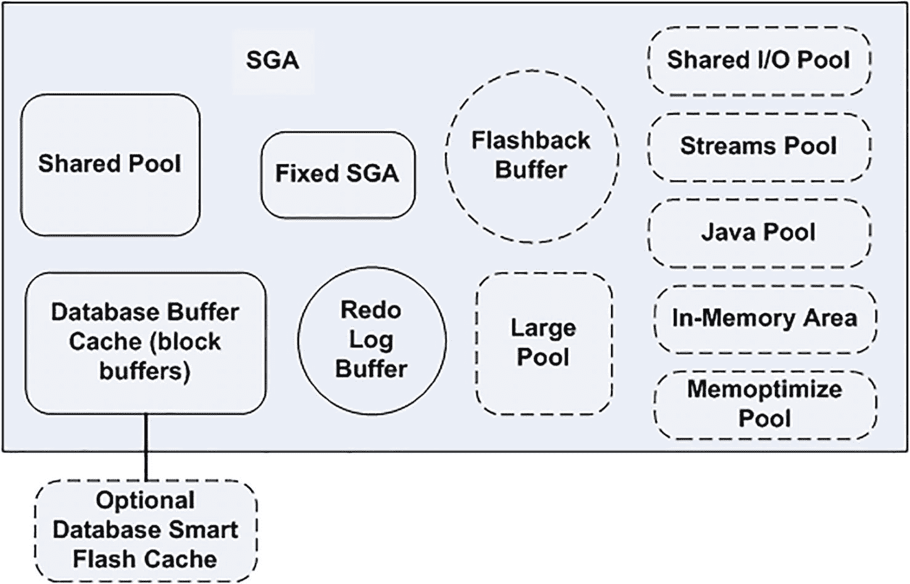

# 系统全局区

每个 Oracle 实例都有一个被称为 `系统全局区` (`SGA`) 的大型内存结构。这是一个庞大、共享的内存结构，每个 Oracle 进程在某个时间点都会访问它。它的大小从小型测试系统中的几十 MB，到中大型系统中的几 GB，再到真正大型系统中的数百 GB 不等。

在 UNIX/Linux 上，`SGA` 是一个物理实体，你可以从操作系统命令行“看到”它。它在物理上被实现为一个共享内存段——一个进程可以附加的独立内存块。系统上有可能存在 `SGA` 而没有任何 Oracle 进程；该内存是独立存在的。然而，应该注意的是，如果你有 `SGA` 却没有任何 Oracle 进程，这表明数据库以某种方式崩溃了。这是一种不常见的情况，但它可能发生。这就是 `SGA` 在 Oracle Linux 上的“样子”：

```
$ ipcs -m | grep ora
0x00000000 32768      oracle     600        9138176    116
0x00000000 32769      oracle     600        1560281088 58
0x00000000 32770      oracle     600        7639040    58
0x322379e0 32771      oracle     600        12288      58
```

这里表示一个 `SGA`，报告显示了拥有 `SGA` 的操作系统账户（本例中均为 `oracle`）以及 `SGA` 的大小。在 Windows 上，你无法像在 UNIX/Linux 中那样将其视为一个独立的实体来看到 `SGA`。因为在 Windows 平台上，Oracle 作为具有单一地址空间的单个进程执行，所以 `SGA` 被作为私有内存分配给 `oracle.exe` 进程。如果你使用 Windows 任务管理器或其他性能工具，你可以看到 `oracle.exe` 分配了多少内存，但你无法区分出 `SGA` 与任何其他已分配的内存块。

> 注意
> 除非你使用我的参数设置，并且在与我完全相同的操作系统上运行完全相同的 Oracle 版本，否则你几乎肯定会看到与我不同的数字。`SGA` 的大小确定非常依赖于版本/操作系统/参数。

在 Oracle 内部，无论什么平台，你都可以使用另一个神奇的 `V$` 视图，名为 `V$SGASTAT`，来查看 `SGA`。它可能看起来像这样：

```
SQL> compute sum of bytes on pool
SQL> break on pool skip 1
SQL> select pool, name, bytes from v$sgastat order by pool, name;
POOL           NAME                            BYTES
-------------- -------------------------- ----------
java pool      free memory                  16777216
**************                            ----------
sum                                         16777216
large pool     PX msg pool                    491520
free memory                  66617344
**************                            ----------
sum                                         67108864
shared pool    kghrcx RO latch director           16
1105.kgght                      36784
POOL           NAME                            BYTES
-------------- -------------------------- ----------
shared pool    11G QMN so                       1248

sum                                        469762048
buffer_cache                956301312
fixed_sga                     9135680
log_buffer                    7639040
POOL           NAME                            BYTES
-------------- -------------------------- ----------
shared_io_pool               67108864
**************                            ----------
sum                                       1040184896
```

`SGA` 被划分为多个不同的池。以下是你将看到的主要池：

*   `共享池`：共享池包含共享游标、存储过程、状态对象、数据字典缓存以及许多其他数据片段。如果用户执行 SQL 语句，那么 Oracle 将使用共享池。
*   `数据库缓冲区高速缓存（块缓冲区）`：作为用户查询和修改数据时从磁盘读取的数据块。包含最近最常使用的数据块。
*   `固定 SGA`：包含有关实例和数据库状态的内部管理信息。
*   `重做日志缓冲区`：一个循环缓冲区，包含有关数据库更改的信息。这些更改被写入磁盘上的联机重做日志。此信息用于数据库恢复。
*   `Java 池`：Java 池是为在数据库中运行的 JVM 分配的固定内存量。Java 池可以在数据库在线运行时调整大小。
*   `大池`：可选内存区域，供共享服务器连接用作会话内存，并行执行功能用作消息缓冲区，以及 RMAN 备份用作磁盘 I/O 缓冲区。此池可在线调整大小。
*   `流池`：这是供数据共享工具（如 Oracle GoldenGate、Oracle Streams 和 Data Pump）使用的内存池。此池可在线调整大小。如果未配置流池但你使用了 Streams 功能，Oracle 将使用最多百分之十的共享池内存作为流内存。
*   `闪回缓冲区`：启用闪回数据库时使用的可选内存区域。恢复写入进程会将修改过的块从缓冲区高速缓存复制到闪回缓冲区，这些块随后被写入磁盘上的闪回数据库日志。
*   `共享 I/O 池`：用于对 SecureFile 大型对象进行 I/O 操作。此区域用于 SecureFile 去重、加密和压缩。
*   `内存中区域`：可选内存区域，允许以列式格式存储表和分区。对于处理少数列并返回许多行的分析操作非常有用（与返回少数行但包含许多列的 OLTP 应用程序相对）。
*   `内存优化池`：可选的内存组件，用于优化基于键的查询。
*   `可选的数据库智能闪存高速缓存`：针对 Linux 和 Solaris 系统的数据库缓冲区高速缓存的可选内存扩展。驻留在使用闪存的固态存储设备上。

一个典型的 `SGA` 可能如图 4-1 所示。可选的内存组件由虚线轮廓标出。



**图 4-1** 典型的 `SGA`

对 `SGA` 整体大小影响最大的参数如下：

*   `JAVA_POOL_SIZE`：控制 Java 池的大小。
*   `SHARED_POOL_SIZE`：控制共享池的大小（在一定程度上）。
*   `LARGE_POOL_SIZE`：控制大池的大小。
*   `STREAMS_POOL_SIZE`：控制流池的大小。
*   `DB_*_CACHE_SIZE`：这八个 `CACHE_SIZE` 参数控制各种可用缓冲区高速缓存的大小。
*   `LOG_BUFFER`：控制重做日志缓冲区的大小（在一定程度上）。
*   `SGA_TARGET`：用于自动 `SGA` 内存管理，可以在线更改。
*   `SGA_MAX_SIZE`：用于控制 `SGA` 的大小。
*   `MEMORY_TARGET`：用于自动内存管理（PGA 和 `SGA` 的大小都会自动调整）。
*   `MEMORY_MAX_SIZE`：用于控制在自动内存管理下，Oracle 应努力使用的 PGA 和 `SGA` 大小之和的最大内存量。这实际上只是一个目标；如果用户数量增加到超过某个水平，或者一个或多个会话分配了如前所述的大块不可调优的内存，PGA 可能会超过最佳大小。
*   `INMEMORY_SIZE`：设置 `SGA` 中用于内存中列存储的内存中区域的大小。默认值为零，表示未使用内存中功能。
*   `MEMOPTIMIZE_POOL_SIZE`：为内存优化行存储功能设置内存大小。
*   `DB_FLASH_CACHE_SIZE`：设置与 `DB_FLASH_CACHE_FILE` 结合使用的闪存高速缓存的大小。


使用 ASMM 只需将 `SGA_TARGET` 参数设置为所需的 SGA 大小，完全忽略其他与 SGA 相关的参数即可。数据库实例会自行处理后续事宜，根据需要为各个内存池分配内存，甚至可以随时间推移从某个内存池取走内存给予另一个池。这是调整 SGA 大小的最常用方式。

当使用 AMM 时，您只需设置 `MEMORY_TARGET`。数据库实例随后会决定最优的 SGA 大小和 PGA 大小——这些组件将被适当地设置，并在各自范围内进行自身的自动内存管理。此外，数据库可以并且将会随着工作负载随时间的变化而调整 SGA 和 PGA 的分配。

无论您使用哪种类型的内存管理，您都会发现内存是以称为 `granule` 的单位分配到 SGA 的各个池中的。单个粒度是一个 4MB、8MB 或 16MB 大小的内存区域。粒度是最小的分配单位，因此，如果您请求一个 5MB 的 Java 池，而您的粒度大小是 4MB，Oracle 实际上会为 Java 池分配 8MB（8 是大于或等于 5 的最小数字，且是粒度大小 4 的倍数）。粒度的大小由您的 SGA 大小决定（这听起来有点递归，因为 SGA 的大小依赖于粒度大小）。您可以通过查询 `V$SGA_DYNAMIC_COMPONENTS` 来查看用于每个池的粒度大小。实际上，我们可以利用这个视图来了解总 SGA 大小如何影响粒度大小。首先，让我们将 SGA 设置为一个较小的值，然后重启实例，并观察粒度大小。在运行以下命令时，我将连接到数据库的根容器：

注意：如果您的实例当前正在运行，`STARTUP FORCE` 命令将以中止模式关闭实例并重新启动它。

```
$ sqlplus / as sysdba
SQL> alter system set sga_target=800M scope=spfile;
SQL> startup force;
SQL> show parameter sga_target
NAME                                 TYPE        VALUE
------------------------------------ ----------- --------------------------
sga_target                           big integer 800M
SQL> select component, granule_size from v$sga_dynamic_components;
COMPONENT                                                     GRANULE_SIZE
------------------------------------------------------------- ------------
shared pool                                                                4194304
large pool                                                          4194304
java pool                                                           4194304
streams pool                                                        4194304
unified pga pool                                                    4194304
memoptimize buffer cache                                            4194304
DEFAULT buffer cache                                                4194304
KEEP buffer cache                                                   4194304
RECYCLE buffer cache                                                4194304
DEFAULT 2K buffer cache                                             4194304
DEFAULT 4K buffer cache                                             4194304
DEFAULT 8K buffer cache                                             4194304
DEFAULT 16K buffer cache                                            4194304
DEFAULT 32K buffer cache                                            4194304
Shared IO Pool                                                      4194304
Data Transfer Cache                                                 4194304
In-Memory Area                                                      4194304
In Memory RW Extension Area                                         4194304
In Memory RO Extension Area                                         4194304
ASM Buffer Cache                                                    4194304
```

注意：这是使用上一个示例中的初始化参数文件启动的 Oracle 实例的 SGA 信息。我们在该参数文件中自行指定了 SGA 和 PGA 的大小。因此，我们使用的是 ASMM 和自动 PGA 内存管理，而不是 AMM 设置，后者本应为我们调整 PGA/SGA 设置的大小。

在此示例中，我使用了 ASMM 并通过单一参数 `SGA_TARGET` 控制 SGA 的大小。当我的 SGA 大小低于约 1GB 时，粒度为 4MB。当 SGA 大小增加到超过 1GB 的某个阈值时（该阈值会因操作系统甚至版本而略有不同），我看到粒度大小增加了：

```
SQL> alter system set sga_target = 1512m scope=spfile;
SQL> startup force
SGA> show parameter sga_target
NAME                                 TYPE        VALUE
------------------------------------ ----------- --------------------------
sga_target                           big integer 1520M
```

现在我们查看 SGA 组件：

```
SQL> select component, granule_size from v$sga_dynamic_components;
COMPONENT                                                      GRANULE_SIZE
-------------------------------------------------------------- ------------
shared pool                                                        16777216
largpool                                                           16777216
java pool                                                          16777216
streams pool                                                       16777216
DEFAULT buffer cache                                               16777216
KEEP buffer cache                                                  16777216
RECYCLE buffer cache                                               16777216
DEFAULT 2K buffer cache                                            16777216
DEFAULT 4K buffer cache                                            16777216
DEFAULT 8K buffer cache                                            16777216
DEFAULT 16K buffer cache                                           16777216
DEFAULT 32K buffer cache                                           16777216
Shared IO Pool                                                     16777216
Data Transfer Cache                                                16777216
ASM Buffer Cache                                                   16777216
```

如您所见，在 SGA 为 1.5GB 时，我的池将使用 16MB 的粒度进行分配，因此任何给定的池大小都将是 16MB 的某个倍数。考虑到这一点，让我们依次查看每个主要的 SGA 组件。

### 固定 SGA

`固定 SGA` 是 SGA 的一个组件，其大小因平台和版本而异。它在安装时被“编译”到 Oracle 二进制文件本身中（因此得名“固定”）。固定 SGA 包含一组指向 SGA 其他组件的变量，以及包含各种参数值的变量。固定 SGA 的大小是我们无法控制的，而且通常非常小。可以将此区域视为 SGA 的“引导”部分——Oracle 在内部用来查找 SGA 其他组成部分的东西。


### 重做缓冲区

`redo buffer`是需要写入在线重做日志的数据在写入磁盘前的临时缓存区域。由于内存到内存的传输比内存到磁盘的传输快得多，使用重做日志缓冲区可以加速数据库操作。数据在重做缓冲区中停留的时间通常不长。实际上，`LGWR`会在以下情况之一发起将此区域刷新到磁盘的操作：

*   每三秒一次
*   每当发出`COMMIT`或`ROLLBACK`命令时
*   当`LGWR`被要求切换日志文件时
*   当重做缓冲区填满三分之一或包含 1MB 的缓存重做日志数据时

Oracle 建议将重做日志缓冲区大小设置为至少 8MB。如果您正在使用闪回功能且 SGA 大于 4GB，则 Oracle 建议将日志缓冲区设置为至少 64MB。如果您正在使用带有异步重做传输的数据卫士且重做生成率很高，则 Oracle 建议将其设置为至少 256MB。

拥有大量并发事务的大型系统可能会从一个较大的重做日志缓冲区中获得一定好处，因为当`LGWR`（负责将重做日志缓冲区刷新到磁盘的进程）正在写入日志缓冲区的一部分时，其他会话可能正在填充它。通常，生成大量重做数据的长时间运行事务将从比正常情况更大的日志缓冲区中受益最多，因为它会持续填充部分重做日志缓冲区，而`LGWR`正忙于写出其中一部分（我们将在第 9 章详细讨论写入未提交数据的现象）。事务越大、越长，它可能从一个慷慨的日志缓冲区中获得的益处就越多。

重做缓冲区的默认大小由`LOG_BUFFER`参数控制，因操作系统、数据库版本和其他参数设置而异。与其尝试解释最常见的默认大小是什么（实际上没有所谓的“最常见”），我会请您参考您的 Oracle 版本文档（*Oracle Database Reference*指南）。我的默认`LOG_BUFFER`——基于我们之前启动的拥有 1.5GB SGA 的实例——由以下查询显示：

```
SQL> select value, isdefault from v$parameter where name = 'log_buffer';
VALUE                ISDEFAULT
-------------------- ---------
7036928              TRUE
```

这个大小约为 7MB。默认日志缓冲区的最小大小取决于操作系统。如果您想找出这个最小值，只需将您的`LOG_BUFFER`设置为 1 字节并重启数据库即可。例如，在我的 Oracle Linux 实例上，我看到以下结果：

```
SQL> alter system set log_buffer=1 scope=spfile;
SQL> startup force;
SQL> show parameter log_buffer
NAME                                 TYPE        VALUE
------------------------------------ ----------- --------------------------
log_buffer                           integer     1680K
```

在这个系统上，无论我的设置如何，我能拥有的最小日志缓冲区都是 1.680MB。

> **注意**
>
> 对于大多数数据库应用，`LOG_BUFFER`参数的默认值是足够的。如果您看到大量与`log buffer space`事件相关的等待，那么请考虑增加`LOG_BUFFER`参数。

### 数据库块缓冲区缓存

到目前为止，我们已经了解了 SGA 中相对较小的组件。现在我们要看一个潜在巨大的组件。块缓冲区缓存是 Oracle 在将数据库块写入磁盘前以及从磁盘读入后存储它们的地方。这对我们来说是 SGA 的一个关键区域。设置太小，我们的查询将运行得非常慢。设置太大，我们会使其他进程资源匮乏（例如，没有为专用服务器创建其 PGA 留出足够的空间，甚至可能无法启动）。

我们在 SGA 中有三个地方可以存储来自单个段的缓存块：

*   `Default pool`：通常是所有段块被缓存的位置。这是最初的——并且在以前是唯一的——缓冲池。
*   `Keep pool`：一个备用缓冲池，按照约定，您将那些访问相当频繁，但由于其他段需要空间而仍会从默认缓冲池中老化出去的段分配到此处。
*   `Recycle pool`：一个备用缓冲池，按照约定，您将那些访问非常随机、从而会导致许多段的许多块被大量刷新的大型段分配到此处。缓存这些段没有好处，因为当您再次需要该块时，它可能已经从缓存中老化出去了。您将这些段与默认池和保留池中的段分开，以便它们不会导致那些块老化出缓存。

请注意，在保留池和回收池的描述中，我使用了“按照约定”这个短语。没有任何机制能确保您按照描述的方式使用保留池或回收池。事实上，这三个池以几乎相同的方式管理块；它们的块老化或缓存算法并没有根本性的不同。这里的目标是让 DBA 能够将段隔离到热、温以及“不关心缓存”的区域。理论是默认池中的对象本身就足够热（即使用足够频繁），可以保证它们自己留在缓存中。缓存会将它们保留在内存中，因为它们是非常受欢迎的块。如果您有一些相当受欢迎但不是特别热的段，这些被认为是温块。这些段的块可能会被从缓存中刷新，以便为您不频繁使用的块（“不关心缓存”的块）腾出空间。为了保持这些温段的块被缓存，您可以执行以下操作之一：

*   将这些段分配到保留池，试图让温块在缓冲区缓存中停留更长时间。
*   将“不关心缓存”的段分配到回收池，并保持回收池相当小，以使块能快速进入和离开缓存（减少管理它们的开销）。

必须执行这两项操作之一，增加了 DBA 需要执行的管理工作，因为现在有三个缓存需要考虑、调整大小和分配对象。还要记住，它们之间不共享空间，所以如果保留池有大量未使用的空间，它不会将其给予超负荷工作的默认池或回收池。总而言之，这些池通常被认为是一种非常精细的低级调优工具，只有在考虑了大多数其他调优方案之后才使用（如果我能通过重写查询来减少十分之一的 I/O，而不是设置多个缓冲池，那将是我的选择）。

除了默认池、保留池和回收池之外，还有最多四个可选缓存`DB_nK_CACHE_SIZE`需要考虑。这些缓存是为了支持数据库中的多个块大小而添加的。数据库可以有一个默认块大小（存储在默认池、保留池或回收池中的块的大小），以及最多四个非默认块大小，如第 3 章所述。

这些缓冲区缓存中的块的管理方式与原始默认池中的块相同——它们也没有特殊的算法更改。现在让我们继续看看这些池中的块是如何管理的。


## 在缓冲区缓存中管理块

为简单起见，假设只有一个默认池。由于其他池的管理方式相同，我们只需讨论其中一个。缓冲区缓存中的块基本上在同一个位置管理，由两个不同的列表指向它们：

*   脏块列表，这些块需要由数据库块写入器（`DBWn`；我们稍后会看一下这个进程）写入磁盘
*   非脏块列表

最初，非脏块列表曾经是一个最近最少使用（LRU）列表。块按照使用顺序排列。在后续版本的 Oracle 中，算法稍有修改。Oracle 不再维护某种物理顺序的块列表，而是采用了一种接触计数算法，当你在缓存中访问一个块时，会有效地增加与该块关联的计数器。这个计数器并非每次访问块时都会增加，但如果你持续访问它，大约每三秒会增加一次。你可以在一组真正神奇的表中看到这个算法在工作：即 `X$` 表。`X$` 表完全未经 Oracle 文档化，但关于它们的信息不时会泄露出来。

> **注意：** 在以下示例中，我使用具有 SYSDBA 权限的用户连接，因为默认情况下只有该帐户才能看到 `X$` 表。在实际操作中，你不应该使用具有 SYSDBA 权限的帐户来运行查询。需要查询关于缓冲区缓存中块的信息是这条规则的一个罕见例外。

`X$BH` 表显示了块缓冲区缓存中块的信息（它比有文档记载的 `V$BH` 视图提供更多信息）。在这里，我们可以看到当我们访问块时，接触计数是如何增加的。我们可以对该视图运行以下查询，以找到五个"当前最热的块"，并将该信息与 `DBA_OBJECTS` 视图连接，以查看它们属于哪些段。该查询按 `TCH`（接触计数）列对 `X$BH` 中的行进行排序并保留前五个。然后，我们通过 `X$BH.OBJ` 到 `DBA_OBJECTS.DATA_OBJECT_ID` 将 `X$BH` 信息与 `DBA_OBJECTS` 连接起来：

```sql
$ sqlplus / as sysdba
SQL> select tch, file#, dbablk,
case when obj = 4294967295
then 'rbs/compat segment'
else (select max( '('||object_type||') ' ||
owner || '.' || object_name  ) ||
decode( count(*), 1, '', ' maybe!' )
from dba_objects
where data_object_id = X.OBJ )
end what
from (
select tch, file#, dbablk, obj
from x$bh
where state  0
order by tch desc
) x
where rownum <= 5;
TCH      FILE#     DBABLK WHAT
---------- ---------- ---------- ------------------------------
60          3      11653 (TABLE) SYS.WRM$_WR_CONTROL
59          9        321 (INDEX) SYS.I_UNDO1
59          1        321 (INDEX) SYS.I_UNDO1
58          3       3011 (INDEX) SYS.I_ILMOBJ$
58         10      38803 (INDEX) SYS.I_ILMOBJ_POL$
```

> **注意：** `CASE` 语句中引用的 (2³² - 1) 或 4,294,967,295 是一个魔术数字，用于表示"特殊"块。如果你想了解该情况下底层块与什么关联，可以使用查询 `select * from dba_extents where file_id = <FILE#> and block_id <= <DBABLK> and block_id+blocks-1 >= <DBABLK>`。

你可能会问前面标量子查询中的"maybe!"和 `MAX()` 的使用是什么意思。这是由于 `DATA_OBJECT_ID` 在 `DBA_OBJECTS` 视图中并非"主键"，这可以从以下得到证明：

```sql
SQL> select data_object_id, count(*)
from dba_objects
where data_object_id is not null
group by data_object_id
having count(*) > 1;
DATA_OBJECT_ID   COUNT(*)
-------------- ----------
337          2
6          3
29          3
620          7
2         18
781          3
8          3
750          3
64          2
10          3
10 rows selected.
```

这是由于簇（在第 10 章讨论）可能包含多个表。因此，当从 `X$BH` 连接到 `DBA_OBJECTS` 以打印段名时，从技术上讲，我们必须列出簇中所有对象的所有名称，因为一个数据库块并不总是属于单个表。

我们甚至可以观察 Oracle 在我们反复查询某个块时增加其接触计数。在这个例子中，我们将使用神奇的表 `DUAL`——我们知道它是一个单行单列的表。所以每次我们运行以下查询时，都应该会命中真正的 `DUAL` 表（因为我们显式引用了 `DUMMY` 列）：

```sql
SQL> select tch, file#, dbablk, DUMMY
from x$bh, (select dummy from dual)
where obj = (select data_object_id
from dba_objects
where object_name = 'DUAL'
and data_object_id is not null);
TCH      FILE#     DBABLK D
---------- ---------- ---------- -
5          9       1185 X
10          1       1425 X
5          9       1184 X
10          1       1424 X
SQL> exec dbms_lock.sleep(3.2);
SQL> /
TCH      FILE#     DBABLK D
---------- ---------- ---------- -
5          9       1185 X
14          1       1425 X
5          9       1184 X
14          1       1424 X
SQL> exec dbms_lock.sleep(3.2);
SQL> /
TCH      FILE#     DBABLK D
---------- ---------- ---------- -
5          9       1185 X
18          1       1425 X
5          9       1184 X
18          1       1424 X
SQL> exec dbms_lock.sleep(3.2);
SQL> /
TCH      FILE#     DBABLK D
---------- ---------- ---------- -
5          9       1185 X
19          1       1425 X
5          9       1184 X
19          1       1424 X
```

我预计输出会因 Oracle 版本而异；你很可能看到返回的行数不止两行。你可能会观察到 `TCH` 并非每次都增加。在多用户系统上，结果将更加不可预测。Oracle 会尝试每三秒增加一次 `TCH`（有一个 `TIM` 列显示 `TCH` 列的最后更新时间），但确保这个数字 100% 准确并不被认为是重要的，只要它接近即可。此外，Oracle 会有意地让块"冷却"，并随着时间的推移减少 `TCH` 计数。所以，如果你在自己的系统上运行这个查询，请准备好看到可能不同的结果。

块缓冲区在列表中保持在其位置，并且其接触计数增加。然而，随着时间的推移，块自然会在列表中"移动"。我把"移动"放在引号中，因为块并不物理移动；而是维护了多个指向这些块的列表，块将从一个列表"移动"到另一个列表。例如，修改过的块由一个脏列表指向（以便由 `DBWn` 写入磁盘）。另外，随着它们随时间被重用，当缓冲区缓存实际上已满，并且某个接触计数较小的块被释放时，它将带着新数据块被"放置"到列表的大致中间位置。

用于管理这些列表的整个算法相当复杂，并且随着 Oracle 的改进，每个版本都有细微的变化。对我们开发者而言，实际完整的细节并不重要，重要的是频繁使用的块将被缓存，而使用不频繁的块不会被缓存太久。


