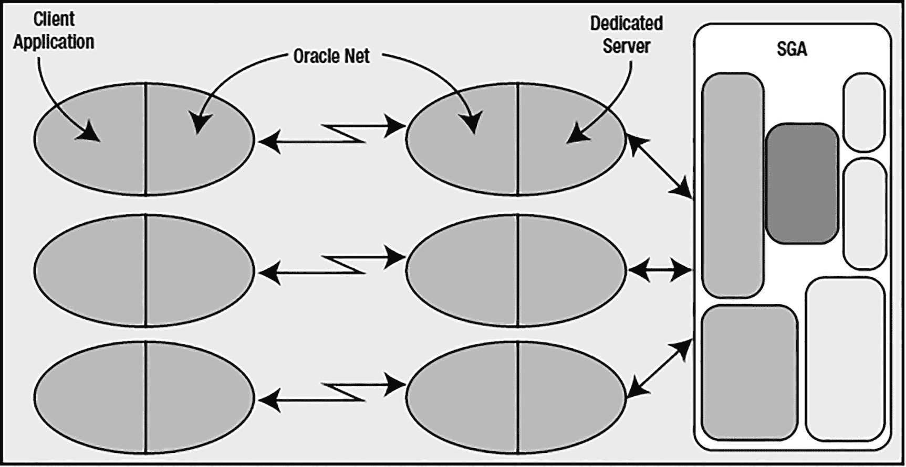
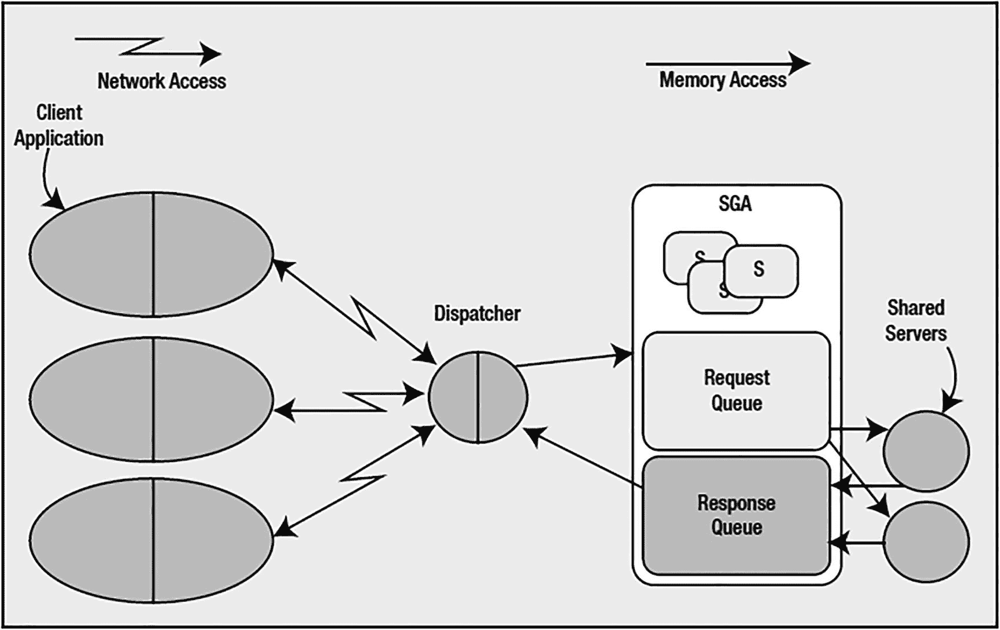
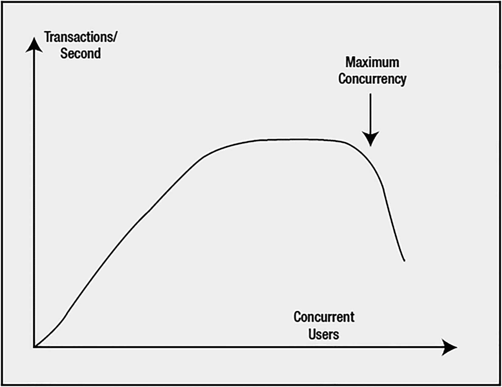
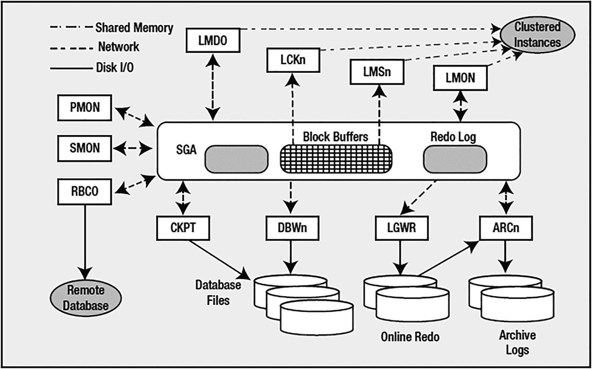

# 5. Oracle 进程

我们已经来到了架构拼图的最后一块。我们已经研究了数据库以及构成数据库的一组物理文件。在探讨 Oracle 使用的内存时，我们已经了解了实例的一半。最后一个需要涵盖的架构问题，就是构成实例另一半的进程集合。Oracle 中的每个进程都将执行特定的任务或一组任务，并且每个进程都会有为执行其工作而分配的内部内存（PGA 内存）。一个 Oracle 实例大致有三类进程：

*   **服务器进程**：这些进程根据客户端的请求执行工作。我们已经对专用服务器和共享服务器有了一定程度的了解。这些就是服务器进程。
*   **后台进程**：这些进程随数据库启动而启动，并执行各种维护任务，例如将块写入磁盘、维护在线重做日志、清理异常终止的进程、维护自动工作量存储库（AWR）等。
*   **从属进程**：这些进程类似于后台进程，但它们代表后台或服务器进程执行额外的工作。

其中一些进程，例如数据库块写入器（`DBWn`）和日志写入器（`LGWR`），已经出现过，但在这里我们将更仔细地研究每个进程的功能、作用及其原因。

> **注意**
>
> 在本章中，当我使用术语 `process` 时，在 Oracle 使用线程实现的操作系统（如 Windows）上，请将其视为与术语 `thread` 同义。在本章的上下文中，我使用术语 `process` 来涵盖进程和线程。如果您使用的是多进程实现的 Oracle（如在 UNIX/Linux 上看到的），那么术语 `process` 是完全合适的。如果您使用的是单进程实现的 Oracle（如在 Windows 上看到的），那么术语 `process` 实际上将意味着 Oracle 进程内的 `thread`。所以，例如，当我谈到 `DBWn` 进程时，Windows 上的等效项就是 Oracle 进程内的 `DBWn` 线程。

## 服务器进程

服务器进程是代表客户端会话执行工作的进程。它们是最终接收并处理我们的应用程序发送给数据库的 SQL 语句的进程。

在第 2 章中，我们简要介绍了连接到 Oracle 的两种主要连接类型，即：

*   **专用服务器**：服务器上有一个专门为您的连接服务的进程。数据库连接与服务器进程或线程之间是一对一的映射。
*   **共享服务器**：多个会话共享一组由 Oracle 实例生成和管理的服务器进程。您的连接是连接到数据库调度程序，而不是专门为您的连接创建的专用服务器进程。

> **注意**
>
> 理解 Oracle 术语中 `connection`（连接）和 `session`（会话）之间的区别非常重要。`connection` 只是客户端进程和 Oracle 实例之间的物理路径（例如，您与实例之间的网络连接）。而 `session` 则是数据库中的一个逻辑实体，客户端进程可以在其中执行 SQL 等操作。多个独立的会话可以关联到单个连接，并且这些会话甚至可以独立于连接而存在。我们稍后将进一步讨论这一点。

专用服务器进程和共享服务器进程的工作是相同的：它们处理您交给它们的所有 SQL。当您向数据库提交一个 `SELECT * FROM EMP` 查询时，一个 Oracle 专用/共享服务器进程会解析该查询并将其放入共享池中（或者，希望已经在共享池中找到了它）。该进程会制定查询计划（如果需要），并执行查询计划，可能在缓冲区缓存中找到所需的数据，或者将数据从磁盘读入缓冲区缓存。

这些服务器进程是主力进程。通常，您会发现这些进程是您系统上 CPU 时间的最大消耗者，因为它们执行您的排序、求和、连接——几乎所有操作。

### 专用服务器连接

在专用服务器模式下，客户端连接与服务器进程（或线程，视情况而定）之间是一对一的映射。如果您在 UNIX/Linux 机器上有 100 个专用服务器连接，那么将会有 100 个进程代表它们执行。图形化表示如图 5-1 所示。



您的客户端应用程序将链接有 Oracle 库。这些库提供了您与数据库通信所需的 API。这些 API 知道如何向数据库提交查询以及如何处理返回的游标。它们知道如何将您的请求打包成网络调用，而专用服务器将知道如何解包。这个软件组件称为 `Oracle Net`，尽管在之前的版本中您可能知道它叫 `SQL*Net`。这是 Oracle 用来实现客户端/服务器处理（即使在 *n* 层架构中，也潜藏着客户端/服务器程序）的网络软件/协议。即使 `Oracle Net` 在技术上不参与其中，Oracle 也采用相同的架构。也就是说，即使客户端和服务器在同一台机器上，仍然采用这种双进程（也称为 *双任务*）架构。这种架构有两个好处：

*   **远程执行**：客户端应用程序在数据库本身以外的机器上执行是非常自然的。
*   **地址空间隔离**：服务器进程对 SGA 具有读写访问权限。如果客户端进程和服务器进程在物理上链接在一起，客户端进程中的一个错误指针很容易损坏 SGA 中的数据结构。

在第 2 章中，我们看到了这些专用服务器如何由 Oracle 监听器进程生成或创建。我不会再次介绍那个过程；相反，我们将快速了解一下当监听器不参与时会发生什么。其机制与监听器参与时基本相同，但专用服务器不是由监听器在 UNIX/Linux 中通过 `fork()`/`exec()` 创建或在 Windows 中通过进程间通信（IPC）调用创建，而是由客户端进程本身创建。

> **注意**
>
> `fork()` 和 `exec()` 调用有许多变体，例如 `vfork()` 和 `execve()`。Oracle 使用的调用可能因操作系统和实现而异，但最终效果是相同的。`fork()` 创建一个新的进程，该进程是父进程的克隆；在 UNIX/Linux 上，这是创建新进程的唯一方法。`exec()` 用新的程序映像覆盖内存中现有的程序映像，从而启动一个新程序。因此，SQL*Plus 可以 *fork*（复制自身），然后 *exec* Oracle 二进制文件，即专用服务器，用这个新程序覆盖自身的副本。

当我们在同一台机器上运行客户端和服务器，以 SYS 用户连接到根容器时，可以清楚地看到这种父/子进程的创建：

```sql
$ sqlplus / as sysdba
SQL> select a.spid dedicated_server, b.process clientpid
from v$process a, v$session b
where a.addr = b.paddr
and   b.sid = sys_context('userenv','sid');
DEDICATED_SERVER         CLIENTPID
------------------------ ------------------------
12380                    12379
SQL> !/bin/ps -fp  12380 12379
UID        PID  PPID  C STIME TTY      STAT   TIME CMD
oracle   12379 14523  0 01:57 pts/0    Sl+    0:00 sqlplus   as sysdba
oracle   12380 12379  1 01:57 ?        Ss     0:00 oracleCDB (DESCRIPTION=(LOCAL=YES)...
```


这里，我使用了一条查询来发现与我的专用服务器相关联的进程 ID（PID）（来自 `V$PROCESS` 的 SPID 就是该查询执行期间所使用进程的操作系统 PID）。`/bin/ps –fp` 的输出包含了父进程 ID（PPID），并显示专用服务器进程 12380 是我的 `SQL*Plus` 进程（进程 ID 12379）的子进程。

### 共享服务器连接

现在，让我们更详细地了解共享服务器进程。这种类型的连接强制要求使用 Oracle Net，即使客户端和服务器位于同一台机器上——如果不使用 Oracle TNS 监听器，就无法使用共享服务器。如前所述，客户端应用程序将连接到 Oracle TNS 监听器，并被重定向或移交给一个调度程序。调度程序充当客户端应用程序和共享服务器进程之间的管道。图 5-2 是共享服务器连接到数据库的架构示意图。



图 5-2 典型的共享服务器连接

在这里，我们可以看到，链接了 Oracle 库的客户端应用程序将物理连接到一个调度程序进程。对于任何给定的实例，我们可能配置了许多调度程序，但仅使用一个调度程序来服务数百甚至数千个用户也很常见。调度程序简单地负责接收来自客户端应用程序的入站请求，并将它们放入 SGA 中的一个请求队列。来自预创建共享服务器进程池的第一个可用共享服务器进程将从队列中取出请求，并附加相关会话的 UGA（图 5-2 中标记为“S”的方框）。共享服务器将处理该请求，并将任何输出放入响应队列。调度程序持续监控响应队列以获取结果，并将其传输回客户端应用程序。就客户端而言，它无法真正分辨自己是通过专用服务器连接还是共享连接——它们看起来是一样的。只有在数据库层面，差异才显而易见。

数据库驻留连接池（DRCP）是一种可选的连接到数据库并建立会话的方法。它被设计为一种更高效的连接池方法，适用于那些本身不支持高效连接池的应用程序接口——例如 PHP，一种通用的 Web 脚本语言。DRCP 是专用服务器和共享服务器概念的混合体。它继承了共享服务器的服务器进程池概念，只不过被池化的进程将是专用服务器，而不是共享服务器；它也继承了专用服务器的概念——嗯——也就是专用性。

在共享服务器连接中，共享服务器进程在许多会话之间共享，并且单个会话往往会使用多个共享服务器。使用 DRCP 时，情况并非如此；从池中选择的专用服务器进程将在其会话的生命周期内专用于该客户端进程。在共享服务器中，如果我在我的会话中对数据库执行三条语句，这三条语句很有可能由三个不同的共享服务器进程执行。而使用 DRCP，相同的这三条语句将由从池中分配给我的专用服务器执行——该专用服务器将专属于我，直到我的会话将其释放回池中。因此，DRCP 具有共享服务器的池化能力和专用服务器的性能特性。我们将在本章后面更详细地探讨专用服务器与共享服务器的性能。

### 连接 vs. 会话

许多人惊讶地发现连接（connection）与会话（session）并非同义词。在大多数人看来，它们是一样的，但现实是它们不必相同。一个连接上可以建立零个、一个或多个会话。每个会话都是独立和分离的，即使它们都共享到数据库的同一物理连接。在一个会话中的提交（commit）不会影响该连接上的任何其他会话。事实上，使用该连接的每个会话都可以使用不同的用户身份！

在 Oracle 中，连接仅仅是你的客户端进程和数据库实例之间的一条物理通路——最常见的是网络连接。连接可能连到一个专用服务器进程或一个调度程序。如前所述，一个连接可以有零个或多个会话，这意味着一个连接可以存在而没有对应的会话。此外，一个会话*可能*有也可能没有连接。使用 Oracle Net 的高级特性（如连接池），客户端可以断开物理连接，同时保持会话完整（但空闲）。当客户端想要在该*会话*中执行某些操作时，它会重新建立物理*连接*。让我们更详细地定义这些术语：

*   *连接*：连接是从客户端到 Oracle 实例的物理路径。连接通过网络或 IPC（进程间通信）机制建立。连接通常位于客户端进程与专用服务器或调度程序之间。但是，使用 Oracle 的连接管理器（CMAN），连接可能位于客户端与 CMAN 之间，以及 CMAN 与数据库之间。CMAN 的介绍超出了本书的范围，但 *Oracle Database Net Services Administrator's Guide*（可从 [`http://otn.oracle.com`](http://otn.oracle.com) 免费获取）对此有详细说明。
*   *会话*：会话是存在于实例中的逻辑实体。它是你的*会话状态*，或内存中代表你唯一会话的数据结构集合。当人们想到数据库连接时，这很可能是最先想到的东西。它是你在服务器上的会话，在那里你执行 SQL、提交事务并运行存储过程。

我们可以使用 `SQL*Plus` 来查看连接和会话的实际情况，并认识到一个连接拥有多个会话是非常常见的现象。我们将简单地使用 `AUTOTRACE` 命令，并发现我们有两个会话！通过一个单一连接，使用一个单一进程，我们将建立两个会话。这是第一个：

```
$ sqlplus eoda/foo@PDB1
SQL> select username, sid, serial#, server, paddr, status
from v$session
where username = USER;
USERNAME            SID    SERIAL# SERVER    PADDR            STATUS
------------ ---------- ---------- --------- ---------------- --------
EODA                 22        692 DEDICATED 000000007850D488 ACTIVE
```

现在，这显示我们当前有一个会话：一个单一的专用服务器连接的会话。`PADDR` 列是我们唯一的专用服务器进程的地址。接下来，我们打开 `AUTOTRACE` 来查看我们在 `SQL*Plus` 中执行语句的统计信息：

```
SQL> set autotrace on statistics
SQL> select username, sid, serial#, server, paddr, status
from v$session
where username = USER;
USERNAME            SID    SERIAL# SERVER    PADDR            STATUS
------------ ---------- ---------- --------- ---------------- --------
EODA                 22        692 DEDICATED 000000007850D488 ACTIVE
EODA                 23      24389 DEDICATED 0000000078528008 INACTIVE
Statistics

0  recursive calls
0  db block gets
0  consistent gets
0  physical reads
0  redo size
1054  bytes sent via SQL*Net to client
462  bytes received via SQL*Net from client
2  SQL*Net roundtrips to/from client
0  sorts (memory)
0  sorts (disk)
2  rows processed
SQL> set autotrace off
```


如此一来，我们现在有两个会话，但 `两者` 都使用同一个专用的服务器进程，这一点可以从它们具有相同的 `PADDR` 值得到证明。我们可以在操作系统中确认，没有创建新的进程，并且我们正在使用一个单一进程——即一个单一连接——来处理这两个会话。请注意，其中一个会话（原始会话）的状态是 `ACTIVE`。这很合理：它正在运行查询以显示此信息，因此当然处于活动状态。但是那个 `INACTIVE` 的会话——它又是做什么的呢？那就是 AUTOTRACE 会话。它的任务是监视我们真实的会话并报告其活动情况。

## 针对 DML 操作的 AUTOTRACE 行为

当我们在 SQL*Plus 中启用 AUTOTRACE 后，执行 DML 操作（`INSERT`、`UPDATE`、`DELETE`、`SELECT` 和 `MERGE`）时，SQL*Plus 将执行以下操作：

1.  如果辅助会话尚不存在，它将使用当前连接创建一个新会话。
2.  它会要求这个新会话去查询 `V$SESSTAT` 视图，以记住我们将要在其中运行 DML 的那个会话的初始统计值。
3.  它将在原始会话中运行 DML 操作。
4.  该 DML 语句完成后，SQL*Plus 会请求另一个会话再次查询 `V$SESSTAT`，并生成前面看到的报告，显示执行 DML 的会话在统计信息上的差异。

如果你关闭 AUTOTRACE，SQL*Plus 将终止这个附加会话，你将不再能在 `V$SESSION` 中看到它。为什么 SQL*Plus 要耍这个花招呢？答案相当直接。SQL*Plus 这样做的原因，与我们在第 4 章使用第二个 SQL*Plus 会话来监视内存和临时空间使用情况的原因相同：如果我们使用单个会话来监视内存使用，那么我们就会消耗内存来进行监视。通过观察单个会话中的统计信息，我们必然会改变这些统计信息。如果 SQL*Plus 使用单个会话来报告执行的 I/O 次数、通过网络传输的字节数以及发生的排序次数，那么用于查找这些细节的查询本身就会增加到统计数据中。它们可能会进行排序、执行 I/O、通过网络传输数据（可以假设它们会这样做）等等。因此，我们需要使用另一个会话来正确地进行测量。

## 没有活动会话的连接

到目前为止，我们看到的连接都带有一个或两个会话。现在，我们想使用 SQL*Plus 来查看一个没有会话的连接。这个就相当简单了。在用于上一个示例的同一个 SQL*Plus 窗口中，只需输入那个名称容易误导的命令，`DISCONNECT`：

```
SQL> disconnect
```

从技术上讲，这个命令应该叫做 `DESTROY_ALL_SESSIONS` 而不是 `DISCONNECT`，因为我们实际上并没有物理断开连接。

**注意**
SQL*Plus 中真正的断开连接是 "exit"，因为你必须退出才能完全销毁连接。

然而，我们已经关闭了所有会话。如果我们使用其他用户账户打开另一个会话并进行查询（当然，将 `EODA` 替换为你的账户名）：

```
$ sqlplus / as sysdba
SQL> select * from v$session where username = 'EODA';
no rows selected
```

我们可以看到我们没有任何会话了——但我们仍然有一个进程，一个物理连接（使用之前的 `ADDR` 值）：

```
SQL> select username, program from v$process where addr = hextoraw( '000000007850D488' );
USERNAME        PROGRAM
--------------- ------------------------------------------------
oracle          oracle@orclvm
```

所以，这里我们有一个没有任何关联会话的连接。我们可以使用同样名称容易误导的 SQL*Plus `CONNECT` 命令，在这个现有进程（这个 `CONNECT` 命令或许应该叫做 `CREATE_SESSION`）中创建一个新会话。使用我们刚刚断开连接的 SQL*Plus 实例，我们将执行以下操作：

```
SQL> connect eoda/foo@PDB1
SQL> select username, sid, serial#, server, paddr, status
from v$session
where username = USER;
USERNAME               SID    SERIAL# SERVER    PADDR            STATUS
--------------- ---------- ---------- --------- ---------------- --------
EODA                    10         25 DEDICATED 000000007850D488 ACTIVE
```

注意，我们的 `PADDR` 和之前相同，所以我们使用的是同一个物理连接，但我们（可能）有一个不同的 SID。我说 `可能`，是因为我们可能被分配相同的 SID——这取决于我们注销期间是否有其他人登录，以及我们原来的 SID 是否可用。

**注意**
在 Windows 或其他基于线程的操作系统上，你可能会看到不同的结果——进程地址可能会改变，因为你连接的是一个线程化的进程，而不是像在 UNIX/Linux 上那样只是一个单一用途的进程。

## 共享服务器连接示例

到目前为止，这些测试都是使用专用服务器连接执行的，因此 `PADDR` 是我们专用服务器进程的进程地址。如果我们使用共享服务器会怎样呢？我将按如下方式配置我的数据库以使用共享服务器：

```
SQL> alter system set shared_servers=4;
SQL> alter system set max_dispatchers=8 scope=spfile;
SQL> alter system set shared_server_sessions=4 scope=spfile;
SQL> alter system set circuits=200 scope=spfile;
SQL> alter system set dispatchers="(protocol=TCP)(dispatchers=3)(connections=100)" scope=spfile;
```

并且我们需要重启数据库以实例化先前设置的参数：

```
$ sqlplus / as sysdba
SQL> startup force;
```

现在，让我们重新建立到可插拔数据库的用户连接：

```
$ sqlplus eoda/foo@PDB1
```

我们可以按如下方式验证连接正在使用共享服务器：

```
SQL> select a.username, a.sid, a.serial#, a.server,
a.paddr, a.status, b.program
from v$session a left join v$process b
on (a.paddr = b.addr)
where a.username = 'EODA';
USERNAME     SID    SERIAL# SERVER    PADDR            STATUS   PROGRAM
---------- ----- ---------- --------- ---------------- -------- -----------
EODA          41      12900 SHARED    000000007B10D488 ACTIVE   oracle@orclvm (S003)
```

我们的共享服务器连接关联到一个进程——`PADDR` 在那里，我们可以连接到 `V$PROCESS` 来获取这个进程的名称。在这个例子中，我们看到它是一个共享服务器，由文本 `S003` 标识。

但是，如果我们使用另一个 SQL*Plus 窗口来查询相同的信息，同时让我们的共享服务器会话处于空闲状态，我们会看到类似这样的情况：

```
$ sqlplus / as sysdba
SQL> select a.username, a.sid, a.serial#, a.server,
a.paddr, a.status, b.program
from v$session a left join v$process b
on (a.paddr = b.addr)
where a.username = 'EODA';
USERNAME    SID    SERIAL# SERVER    PADDR            STATUS   PROGRAM
---------- ---- ---------- --------- ---------------- -------- ------------
EODA         41      12900  NONE      000000007B1069A8 INACTIVE oracle@orclvm (D001))
```

注意，我们的 `PADDR` 不同了，我们关联的进程名称也改变了。我们空闲的共享服务器连接现在关联到一个调度程序，`D001`。因此，我们有了另一种观察指向单一进程的多个会话的方法。一个调度程序可能有数百甚至数千个会话指向它。

共享服务器连接的一个有趣属性是，我们使用的共享服务器进程可以在每次调用之间改变。如果我是这个系统的唯一使用者（就像在这些测试中一样），反复以 `EODA` 身份运行该查询往往会产生相同的 `PADDR`。然而，如果我打开更多的共享服务器连接并开始在其他会话中使用这些共享服务器连接，那么我可能会注意到我使用的共享服务器会发生变化。


请看这个示例。我将查询当前的会话信息，显示我正在使用的共享服务器。然后，在另一个共享服务器会话中，我将执行一个长时间运行的操作（即，我将独占该共享服务器）。当我再次询问数据库我正在使用哪个共享服务器时，（在我的当前会话中）我很可能会看到一个不同的服务器（如果原来那个正忙于为其他会话服务的话）。以下示例代表一个通过共享服务器连接的第二个 SQL*Plus 会话：

```
SQL> select a.username, a.sid, a.serial#, a.server,
a.paddr, a.status, b.program
from v$session a left join v$process b
on (a.paddr = b.addr)
where a.username = 'EODA';
USERNAME     SID    SERIAL# SERVER    PADDR            STATUS   PROGRAM
---------- ----- ---------- --------- ---------------- -------- ------------
EODA          41      12900 SHARED    000000007B10D488 ACTIVE   oracle@orclvm (S003)
```

从另一个终端会话，以用户 `SCOTT` 的身份连接到数据库（以下连接字符串中的 `shared` 映射到 `tnsnames.ora` 文件中的一个条目，该条目指示 SQL*Plus 通过共享服务器连接进行连接）。作为参考，这是我 `tnsnames.ora` 文件中的 `shared` 条目：

```
shared =
(DESCRIPTION =
(ADDRESS = (PROTOCOL = TCP)(HOST = localhost)(PORT = 1521))
(CONNECT_DATA =
(SERVER = SHARED)
(SERVICE_NAME = PDB1)
)
)
```

现在我通过共享服务器连接到 `SCOTT`：

```
$ sqlplus scott/tiger@shared
SQL> exec dbms_lock.sleep(20);
PL/SQL procedure successfully completed.
```

从最初的 `EODA` 连接，再次运行查询以显示 `PROGRAM` 信息：

```
SQL> select a.username, a.sid, a.serial#, a.server,
a.paddr, a.status, b.program
from v$session a left join v$process b
on (a.paddr = b.addr)
where a.username = 'EODA';
USERNAME     SID    SERIAL# SERVER    PADDR            STATUS   PROGRAM
---------- ----- ---------- --------- ---------------- -------- ------------
EODA          41      12900 SHARED    000000007B109468 ACTIVE   oracle@orclvm (S000)
```

注意：你需要使用一个对 `DBMS_LOCK` 包具有执行权限的账户。我为了实现这一点，授予了我的演示账户 `SCOTT` 对 `DBMS_LOCK` 包的执行权限：`SQL> grant execute on dbms_lock to scott;`

请注意，我第一次查询时，使用的是 `S003` 作为共享服务器。然后，在另一个会话中（以 `SCOTT` 身份），我执行了一个长时间运行的语句，该语句独占了共享服务器，这次碰巧是 `S003`。第一个不忙的共享服务器会被分配来执行工作，在此情况下没有其他人请求使用 `S003` 共享服务器，因此 `DBMS_LOCK` 命令占用了它。当我在第一个 SQL*Plus 会话中再次查询时，我被分配到了另一个共享服务器进程 `S000`，因为 `S003` 共享服务器正忙。

有趣的是，一个查询的解析（尚未返回任何行）可能由共享服务器 `S000` 处理，第一行的提取由 `S001` 处理，第二行的提取由 `S002` 处理，而游标的关闭由 `S003` 完成。也就是说，一个单独的语句可能会被许多共享服务器逐段处理。

因此，我们在本节中看到，一个连接——从客户端到数据库实例的一条物理通道——可以在其上建立零个、一个或多个会话。我们在使用 SQL*Plus 的 AUTOTRACE 功能时已经看到了一个这样的用例。许多其他工具也采用了这种能力。例如，Oracle Forms 在单个连接上使用多个会话来实现其调试功能。Oracle 的 *n* 层代理认证特性（用于提供从浏览器到数据库的端到端用户标识）大量使用了单个连接承载多个会话的概念，但每个会话可能会使用一个潜在不同的用户账户。我们已经看到，会话随着时间的推移可以使用许多进程，尤其是在共享服务器环境中。此外，如果我们使用 Oracle Net 的连接池，那么我们的会话可能根本不与任何进程关联；客户端会在空闲时间后丢弃连接，并在检测到活动时透明地重新建立它。

简而言之，连接和会话之间存在多对多的关系。然而，最常见的、我们大多数人日常看到的情况，是一个专用服务器与单个会话之间的一对一关系。

## 专用服务器 vs. 共享服务器 vs. DRCP

在我们研究其余的进程之前，让我们讨论一下为什么有三种主要的连接模式，以及何时一种模式比另一种更合适。

### 何时使用专用服务器

如前所述，在专用服务器模式下，客户端连接和服务器进程之间存在一一对应的映射。这是迄今为止所有基于 SQL 的应用程序连接到 Oracle 数据库的最常用方法。它设置最简单，提供了建立连接的最简便方式，几乎不需要配置。

由于是一一映射，你不必担心一个长时间运行的事务会阻塞其他事务。那些其他事务将通过它们自己的专用进程继续进行。因此，在可能存在长时间运行事务的非 OLTP 环境中，这是你应该考虑使用的唯一模式。专用服务器是 Oracle 的推荐配置，其扩展性相当好。只要你的服务器有足够的硬件（CPU 和 RAM）来服务你的系统所需的专用服务器进程数量，一个专用服务器就可以用于数千个并发连接。

某些操作必须在专用服务器模式下完成，例如数据库的启动和关闭，因此每个数据库要么同时配备两种服务器，要么只配置一个专用服务器。


## 何时使用共享服务器

共享服务器的设置和配置虽然并不复杂，但相比专用服务器设置多了一个额外的步骤。然而，两者的主要区别并不在于设置，而在于其运行模式。使用专用服务器时，客户端连接与服务器进程之间是一一对应的关系。而使用共享服务器时，则存在一种*多对一*的关系：多个客户端对应一个共享服务器。

顾名思义，共享服务器是一种共享资源，而专用服务器则不是。使用共享资源时，你必须小心，不要长时间独占它。正如前面所见，在一个会话中使用简单的 `DBMS_LOCK.SLEEP(20)` 就会独占一个共享服务器进程长达 20 秒。独占这些共享服务器资源可能导致系统看起来像是挂起。

图 5-2 描述了两个共享服务器。假设有三个客户端，并且它们都试图在大致相同的时间运行一个需要 45 秒的进程，那么其中两个客户端将在 45 秒后得到响应，而第三个客户端将在 90 秒后得到响应。这是共享服务器的第一条规则：确保你的事务持续时间短。它们可以频繁，但应该简短（正如 `OLTP` 系统的特点）。如果事务不短，由于少数进程独占了共享资源，你将遇到看起来像是整个系统变慢的情况。在极端情况下，如果所有共享服务器都很忙，系统对所有用户来说都会显得像是挂起了，除了那些幸运地独占了共享服务器的少数用户。

使用共享服务器时，你可能观察到的另一个有趣情况是*人为死锁*。在共享服务器模式下，一定数量的服务器进程由一个潜在庞大的用户群共享。设想一个场景：你有五个共享服务器和一百个已建立的用户会话。在任何时间点，最多只有五个用户会话可以处于活动状态。假设其中一个用户会话更新了一行数据但没有提交。当该用户坐在那里思考其修改时，另外五个用户会话试图锁定同一行数据。它们当然会被阻塞，并会耐心等待该行数据变为可用。现在，持有该行锁的用户会话尝试提交其事务（从而释放该行上的锁）。该用户会话会发现所有共享服务器都被那五个等待的会话独占了。这里我们遇到了一个人为死锁的情况：持有锁的会话将永远无法获得一个共享服务器来允许提交，除非其中一个等待会话放弃其共享服务器。但是，除非等待会话在等待锁时设置了超时，否则它们永远不会放弃其共享服务器（当然，你也可以让管理员通过专用服务器来终止它们的会话，以打破这种僵局）。

由于这些原因，共享服务器仅适用于以简短、频繁事务为特征的 `OLTP` 系统。在 `OLTP` 系统中，事务在毫秒内执行；任何操作都不会超过几分之一秒。共享服务器非常不适合数据仓库。在那里，你可能会执行一个需要一分钟、两分钟、五分钟或更长时间的查询。在共享服务器下，这将是致命的。如果你的系统 90%是 `OLTP`，10%是“不完全是 `OLTP`”，那么你可以在同一个实例上混合使用专用服务器和共享服务器。这样，你可以大幅减少为 `OLTP` 用户提供的服务器进程数量，并确保那些“不完全是 `OLTP`”的用户不会独占他们的共享服务器。此外，DBA 可以使用内置的资源管理器来进一步控制资源利用。

当然，使用共享服务器的一个重要原因是当你别无选择时。许多高级连接功能需要使用共享服务器。如果你想使用 Oracle Net 连接池，你必须使用共享服务器。如果你想使用数据库之间的数据库链接集中器，那么你必须为这些连接使用共享服务器。

> 注意
>
> 如果你已经在应用程序中使用了连接池功能（例如，你正在使用 `J2EE` 连接池），并且你的连接池大小设置得当，那么使用共享服务器只会抑制性能。你已经根据在任何时间点将获得的并发连接数调整了连接池大小；你希望每个连接都是直接的专用服务器连接。否则，你只是让一个连接池功能连接到另一个连接池功能。

## 共享服务器的潜在优势

考虑到你必须对允许使用它的事务类型有所谨慎，共享服务器有哪些好处呢？共享服务器做了三件事：它减少了操作系统进程/线程的数量，它人为地限制了并发程度，并且它减少了系统所需的内存。让我们更详细地讨论这些要点。

### 减少操作系统进程/线程的数量

在一个拥有数千用户的系统上，操作系统可能很快就不堪重负，试图管理数千个进程。在典型系统中，在任何时间点，只有数千用户中的一部分是并发活跃的。例如，我曾处理过有 5000 个并发用户的系统。在任何时间点，最多只有 50 个是活跃的。这个系统使用 50 个共享服务器进程就能有效工作，将操作系统需要管理的进程数量减少了两个数量级（100 倍）。现在，操作系统在很大程度上可以避免上下文切换。


## 人为限制并发程度

作为一名参与过众多基准测试的人，这其中的益处似乎显而易见。运行基准测试时，人们常常要求尽可能增加用户数量，直到系统崩溃为止。这类基准测试的输出结果之一，总是一张显示并发用户数与交易数量关系的图表（参见图 5-3）。



图 5-3

并发用户数与每秒交易数

最初，随着并发用户的增加，交易数量也增加。然而，在某个时间点之后，增加更多用户并不会提高每秒可执行的交易数量；图表趋于平缓。吞吐量已达峰值，此时响应时间开始增加。换句话说，你每秒执行的交易数量相同，但终端用户感知到的响应时间变慢了。如果你继续增加用户，会发现吞吐量实际上开始下降。在这个下降点之前的并发用户数，就是你希望在系统上允许的最大并发程度。超过这个点，系统会过载，开始形成执行工作的队列。就像收费站前的拥堵一样，系统再也跟不上了。此时不仅响应时间急剧上升，系统的吞吐量也可能下降，因为仅仅是上下文切换以及在过多消费者之间共享资源所产生的开销本身就需要额外的资源。如果我们将最大并发程度限制在下降点之前，我们就能维持最大吞吐量，并为大多数用户最小化响应时间的增加。共享服务器允许我们将系统上的最大并发程度限制在这个数值。

对这个过程的一个简单类比是一扇门。门的宽度和人的宽度限制了每分钟通过的最大人数（吞吐量）。在低负载下，没有问题；然而，随着更多人靠近，就会出现一些被迫的等待（CPU 时间片）。如果很多人想通过这扇门，就会出现倒退效应——太多人说“您先请”以及太多假起步，导致吞吐量下降。每个人都被延迟通过。使用队列意味着吞吐量增加；一些人通过门的速度几乎和没有队列时一样快，而另一些人（被排在队列末尾的人）则经历了最大的延迟，并可能担心“这是个坏主意”。但当你测量每个人（包括最后一个人）通过门的速度时，排队模型（共享服务器）的表现优于自由竞争式方法（即使是礼貌的人；想象一下商店大减价开门时的情景，每个人都使劲往前挤）。

## 减少系统所需内存

这是使用共享服务器被高度宣扬的原因之一：它减少了所需内存量。它确实减少了，但不像你想象的那么显著，特别是考虑到第 4 章讨论的自动 PGA 内存管理——工作区被分配给一个进程，使用后释放，其大小根据并发工作负载而变化。因此，在 Oracle 的旧版本中，这曾经是`更真实`的事实，但在今天已不那么重要了。另外，请记住，当使用共享服务器时，UGA 位于 SGA 中。这意味着切换到共享服务器时，你必须能够准确预期你的 UGA 内存需求，并通过`LARGE_POOL_SIZE`参数在 SGA 中适当分配。共享服务器配置的 SGA 需求通常非常大。这部分内存通常必须预先分配，因此只能由数据库实例使用。

注意

虽然通过可调整大小的 SGA，你可以随时间增长和收缩这部分内存，但在大多数情况下，它将由数据库实例拥有，不能被其他进程使用。

与专用服务器对比，在专用服务器中，任何人可以使用任何未分配给 SGA 的内存。如果由于 UGA 位于其中而导致 SGA 大得多，那么节省的内存从何而来？它来自于分配更少的 PGA。每个专用/共享服务器都有一个 PGA。这是进程信息。包括排序区、哈希区和其他与进程相关的结构。通过使用共享服务器，你从系统中移除的正是这种内存需求。如果你从使用 5000 个专用服务器变为使用 100 个共享服务器，那么你通过共享服务器节省的，就是那 4900 个不再需要的 PGA（不包括它们的 UGA）的累积大小。

#### DRCP

那么，DRCP 特性呢？它具有共享服务器的许多优点，例如减少进程（我们正在进行池化），可能节省内存，而没有那些缺点。它没有人为死锁的风险；例如，在前面的例子中持有资源锁的会话，会从池中获得一个*专用*于它的专用服务器，该会话最终将能够释放锁。它不具备共享服务器的多线程能力；当客户端进程从池中获得一个专用服务器时，它就*拥有*该进程，直到客户端进程释放它。因此，它最适合频繁连接、执行一些相对简短的处理、然后断开连接——一遍又一遍的客户端应用程序；简而言之，适合那些 API 自身没有高效连接池的客户端进程。

### 专用/共享服务器总结

除非你的系统过载，或者你需要使用共享服务器来实现特定功能，否则专用服务器可能最适合你。专用服务器设置简单（实际上，无需设置），并且使调优更容易。

注意

使用共享服务器连接时，会话的跟踪信息（`SQL_TRACE=TRUE`输出）可能分散在许多单独的跟踪文件中；因此，重构该会话所做的操作更加困难。随着`DBMS_MONITOR`包的出现，大部分困难已被消除，但它仍然使事情复杂化。此外，如果一个会话生成了多个相关的跟踪文件，你可以使用`TRCSESS`实用程序来合并这些跟踪文件。

如果你拥有非常庞大的用户群体，并且*知道*你将使用共享服务器进行部署，我强烈建议你使用共享服务器进行*开发和测试*。如果你只在专用服务器下开发，而从未在共享服务器上测试，这将增加你失败的风险。对系统施加压力，进行基准测试，并确保你的应用程序在共享服务器下行为良好。即，确保它不会长时间独占共享服务器。如果你在开发阶段发现这种情况，修复起来要比在部署阶段容易得多。你可以使用诸如高级队列（AQ）之类的功能，将长时间运行的过程转变为表面上很短的过程，但你必须在设计应用程序时将其*设计*进去。这类事情最好在开发时完成。此外，从历史上看，共享服务器连接和专用服务器连接可用的功能集存在差异。我们已经讨论过 Oracle 9*i*中缺乏自动 PGA 内存管理，例如，在过去的版本中，即使是像两个表之间的哈希连接这样基本的功能，在共享服务器连接中也不可用。（在当前 9*i*及更高版本中，哈希连接在共享服务器中可用！）


## 后台进程

Oracle 实例由两部分组成：SGA 和一组后台进程。后台进程执行保持数据库运行所需的常规维护任务。例如，有一个进程为我们维护块缓冲区缓存，根据需要将块写入数据文件。另一个进程负责在在线重做日志文件填满时将其复制到归档目标。还有一个进程负责清理已终止的进程等。这些进程中的每一个都专注于自己的工作，但与其他所有进程协同工作。例如，当负责写入日志文件的进程填满一个日志并转向下一个时，它会通知负责归档该已满日志文件的进程有工作要做。

有一个`V$`视图可以用来查看所有*可能的*Oracle 后台进程，并确定当前系统中正在使用哪些：

```
SQL> select paddr, name, description from v$bgprocess order by paddr desc;
PADDR            NAME DESCRIPTION
---------------- ---- ----------------------------------------
0000000072FD44C8 MMON Manageability Monitor Process
00000000727FD850 MMNL Manageability Monitor Process 2
00000000723FE138 LREG Listener Registration
00000000723FCFD8 SMON System Monitor Process
00000000723F9BB8 CKPT checkpoint
00000000723F8A58 LGWR Redo etc.
00000000723F78F8 DBW0 db writer process 0
...
00               VMB0 Volume Membership 00
00               ACFS ACFS CSS
00               SCRB ASM Scrubbing Master
00               XDMG cell automation manager
00               XDWK cell automation worker actions
401 rows selected.
```

此视图中`PADDR`非`00`的行是配置并在系统上运行的进程（线程）。

> **提示**
> 另一种查看当前运行的后台进程的方法是查询`V$PROCESS`，其中`PNAME`不为空。

后台进程有两类：一类有专门的工作要做（如上所述），另一类执行各种其他工作（即实用进程）。例如，有一个实用后台进程用于通过`DBMS_JOB/DBMS_SCHEDULER`包访问的内部作业队列。此进程监控作业队列并运行其中的任何作业。在许多方面，它类似于专用服务器进程，但没有客户端连接。让我们逐一检查这些后台进程，从有专门工作的开始，然后研究实用进程。

### 专注型后台进程

专门后台进程的数量、名称和类型因版本而异。图 5-4 描述了一个有专门用途的 Oracle 后台进程的*典型集合*。



图 5-4

专注型后台进程

例如，这是一个使用最少数量的`init.ora`参数启动的数据库：

```
$ sqlplus / as sysdba
SQL> create pfile='/tmp/pfile' from spfile;
File created.
SQL> !cat /tmp/pfile
```

`以下是输出片段：`

```
*.audit_file_dest='/opt/oracle/admin/CDB/adump'
*.audit_sys_operations=false
*.audit_trail='none'
*.commit_logging='batch'
*.commit_wait='nowait'
*.compatible='21.0.0'
*.control_files='/opt/oracle/oradata/CDB/control01.ctl','/opt/oracle/oradata/CDB/control02.ctl'
*.db_block_size=8192
*.db_name='CDB'
```

启动的后台进程数量因 Oracle 版本而异。一般来说，每个新的主要版本都会比之前的版本多几个后台进程。例如，使用最新版本的 Oracle，大约会启动 60 个后台进程：

```
SQL> select paddr, name, description from v$bgprocess  where paddr  '00'
order by paddr desc;
000000007353FE60 SMON       System Monitor Process
000000007353E900 LG00       Log Writer Slave
000000007353D3A0 CKPT       checkpoint
000000007353BE40 LGWR       Redo etc.
000000007353A8E0 DBW0       db writer process 0
0000000073539380 DIA0       diagnosibility process 0
0000000073537E20 PMAN       process manager

```

请注意，启动实例时可能不会看到所有这些进程，但大部分都会出现。只有当处于`ARCHIVELOG`模式并启用自动归档时，才会看到`ARCn`（归档进程）。只有在运行 Oracle RAC（一种允许集群中不同机器上的多个实例装入并打开同一个物理数据库的 Oracle 配置）时，才会看到`LMD0`、`LCKn`、`LMON`和`LMSn`（稍后将详细介绍这些进程）进程。

> **注意**
> 在一些 UNIX/Linux 平台上，可以混合使用进程和线程。通过将初始化参数`THREADED_EXECUTION`设置为`TRUE`（默认为`FALSE`）来启用此功能。根本没有任何改变——所有“进程”仍然存在；只是可能无法通过操作系统`ps`命令看到它们，因为它们现在作为一个更大进程中的线程运行。

因此，图 5-4 大致描述了启动 Oracle 实例并装入和打开数据库后可能看到的情况。在 Oracle 实现多进程架构的操作系统上，例如 UNIX/Linux 系统，您可以物理地看到这些进程。启动实例后，我观察到了以下情况：

```
$ ps -aef | grep ora_...._$ORACLE_SID | grep -v grep
oracle   24704     1  0 18:55 ?        00:00:00 ora_pmon_CDB
oracle   24706     1  0 18:55 ?        00:00:00 ora_clmn_CDB
oracle   24708     1  0 18:55 ?        00:00:00 ora_psp0_CDB
oracle   24711     1  0 18:55 ?        00:00:02 ora_vktm_CDB
oracle   24716     1  0 18:55 ?        00:00:00 ora_gen0_CDB
oracle   24718     1  0 18:55 ?        00:00:00 ora_mman_CDB
oracle   24722     1  0 18:55 ?        00:00:00 ora_gen1_CDB

```

注意到这些进程使用的命名约定很有趣。进程名以`ora_`开头。后面是代表进程实际名称的四个字符，然后是`_CDB`。碰巧，我的`ORACLE_SID`（站点标识符）是`CDB`。在 UNIX/Linux 上，这使得识别 Oracle 后台进程并将它们与特定实例关联起来变得非常容易（在 Windows 上，没有简单的方法可以做到这一点，因为后台是更大、单一进程中的线程）。也许最有趣但从前述代码中不容易看出的是，*它们都实际上是同一个二进制可执行程序——每个“程序”并没有单独的可执行文件。* 尽管努力搜索，但你不会在磁盘上找到`ora_pmon_CDB`二进制可执行文件。你也找不到`ora_lgwr_CDB`或`ora_reco_CDB`。这些进程实际上都是`oracle`（这是运行的可执行文件的名称）。它们只是在启动时给自己起了别名，以便更容易识别哪个是哪个。这使得大量的目标代码可以在 UNIX/Linux 平台上高效共享。在 Windows 上，这就不那么有趣了，因为它们只是进程内的线程，所以它们当然是一个大的二进制文件。

现在让我们来看一下每个*主要*进程所执行的功能，从主要的 Oracle 后台进程开始。有关可能的后台进程及其功能的完整列表，请参阅可在[`http://otn.oracle.com/`](http://otn.oracle.com/)免费获取的《Oracle 数据库参考手册》的附录。


#### PMON：进程监控器

该进程负责清理异常终止的连接。例如，如果您的专用服务器因某些原因“故障”或被终止，`PMON` 是负责进行修复（恢复或撤销工作）并释放您资源的进程。`PMON` 将启动未提交工作的回滚，释放锁，并释放分配给故障进程的 SGA 资源。

除了清理中止的连接外，`PMON` 还负责监控其他 Oracle 后台进程，并在必要且可能时重新启动它们。如果共享服务器或调度程序失败（崩溃），`PMON` 会介入并重新启动另一个（在为故障进程清理后）。`PMON` 会监视所有 Oracle 进程，并根据情况重启它们或终止实例。例如，在数据库日志写入器进程 `LGWR` 失败的情况下，终止实例是适当的。这是一个严重的错误，最安全的行动路径是立即终止实例，让正常的恢复来修复数据。（请注意，这种情况很少发生，应立即报告给 Oracle 支持部门。）

#### LREG：监听器注册进程

`LREG` 负责向 Oracle TNS 监听器注册实例和服务。实例启动时，除非另有指示，`LREG` 进程会轮询众所周知的端口地址，以查看监听器是否已启动并正在运行。Oracle 使用的众所周知/默认端口是 1521。那么，如果监听器在某个不同的端口上启动会怎样？在这种情况下，机制是相同的，只是监听器地址需要通过 `LOCAL_LISTENER` 参数设置显式指定。您也可以使用 `REMOTE_LISTENER` 参数来指示 `LREG` 向远程监听器注册服务（这在 Oracle RAC 环境中很常见）。

如果在数据库实例启动时监听器正在运行，`LREG` 会与监听器通信，并向其传递相关参数，如实例的服务名称和负载指标。如果监听器未启动，`LREG` 将定期尝试（通常每 60 秒）联系它以进行注册。您也可以通过 `ALTER SYSTEM REGISTER` 命令指示 `LREG` 立即尝试向监听器注册服务（这在高可用性环境中很有用）。

#### SMON：系统监控器

`SMON` 是执行所有系统级工作的进程。`PMON` 关注单个进程，而 `SMON` 则从系统层面看待事物，是数据库的一种垃圾回收器。它执行的一些工作包括：

*   清理临时空间：随着真正的临时表空间的出现，清理临时空间的工作有所减少，但并未完全消失。例如，在构建索引期间，为索引分配的区在创建期间被标记为 `TEMPORARY`。如果 `CREATE INDEX` 会话因某种原因中止，`SMON` 负责清理它们。其他操作也会创建临时区，`SMON` 也将负责清理。

*   合并空闲空间：如果您使用字典管理的表空间，`SMON` 负责获取表空间中相互连续的空闲区，并将它们合并为一个更大的空闲区。这只发生在默认存储子句的 `PCTINCREASE` 设置为非零值的字典管理表空间上。

*   针对不可用文件恢复活动事务：这类似于它在数据库启动期间的角色。在这里，`SMON` 恢复那些因文件不可用而被跳过的失败事务。例如，该文件可能位于不可用或未挂载的磁盘上。当文件变得可用时，`SMON` 将恢复它。

*   执行 RAC 中失败节点的实例恢复：在 Oracle RAC 配置中，当集群中的某个数据库实例失败（例如，运行该实例的机器故障）时，集群中的其他节点将打开该失败实例的重做日志文件，并对该失败实例的所有数据执行恢复。

*   清理 `OBJ$`：`OBJ$` 是一个低级数据字典表，几乎包含数据库中每个对象（表、索引、触发器、视图等）的条目。很多时候，这里面有代表已删除对象的条目，或者代表 Oracle 依赖机制中使用的“不存在”对象的条目。`SMON` 是移除这些不再需要的行的进程。

*   管理撤销段：`SMON` 将执行撤销段的自动联机、脱机和收缩。

*   使回滚段脱机：使用手动回滚段管理（不推荐，您应该使用自动撤销管理）时，DBA 可能使具有活动事务的回滚段 `offline`（脱机）或使其不可用。活动事务可能正在使用此脱机的回滚段。在这种情况下，回滚段并未真正脱机；它被标记为“待脱机”。在后台，`SMON` 会定期尝试真正使其脱机，直到成功。

这应该让您了解了 `SMON` 的作用。它还执行许多其他任务，例如刷新出现在 `DBA_TAB_MODIFICATIONS` 视图中的监控统计信息，刷新 `SMON_SCN_TIME` 表中的 SCN 到时间戳映射信息，等等。`SMON` 进程可能会随着时间的推移积累大量的 CPU，这应被视为正常现象。`SMON` 会定期唤醒（或被其他后台进程唤醒）以执行这些内务管理任务。


#### RECO：分布式数据库恢复

`RECO` 的职责非常明确：它负责恢复那些由于崩溃或连接中断而停留在“已准备”状态的 `两阶段提交`（`2PC`）事务。`2PC` 是一种分布式协议，它允许多个独立数据库上的修改能够原子性地提交。它试图在提交前尽可能缩小分布式故障的发生窗口。在涉及 N 个数据库的 `2PC` 过程中，其中一个数据库——通常是（但不总是）客户端最初登录的那个——将担任协调者。这个站点会询问其他 N-1 个站点是否已准备好提交。实际上，这个站点会去访问其他 N-1 个站点，要求它们做好提交准备。每个 N-1 的站点会报告其准备状态，结果为 YES 或 NO。如果任何一个站点投票 NO，则整个事务将被回滚。如果所有站点都投票 YES，那么协调者站点会向其他 N-1 个站点广播消息，使提交永久生效。

假设某个站点投票 YES 并已准备好提交，但在收到协调者发出的实际提交指令之前，网络发生故障或其他错误，那么该事务就会变成一个 `未确定分布式事务`。`2PC` 试图限制可能发生这种情况的时间窗口，但无法完全消除它。如果此时恰好发生故障，该事务将成为 `RECO` 的责任。`RECO` 会尝试联系该事务的协调者以查明其结果。在联系到之前，事务将保持未提交状态。当事务协调者再次可联系上时，`RECO` 将决定提交该事务或将其回滚。

需要注意的是，如果中断持续很长时间，并且您有一些未完成的事务，您可以手动提交/回滚它们。您可能希望这样做，因为一个 `未确定分布式事务` 可能导致 `写入者阻塞读取者`——这是 Oracle 中唯一可能发生这种情况的情况。您的 DBA 可以致电其他数据库的 DBA，请求他们查询这些未确定事务的状态。然后您的 DBA 可以提交或回滚它们，从而让 `RECO` 免除此任务。

#### CKPT：检查点进程

检查点进程顾名思义，并不执行检查点操作（检查点操作在第 3 章关于重做日志的部分讨论过）——那主要是 `DBWn` 的工作。它只是通过更新数据文件的文件头来协助检查点过程。`CKPT` 是一个强制进程，总是会被启动，因此如果您在 UNIX/Linux 上执行 `ps` 命令，通常会看到它（我说“通常”是因为从 Oracle 12*c* 开始，检查点进程有可能在操作系统线程内运行，因此不会显示为一个独立进程）。

用检查点信息更新数据文件头的工作过去属于 `LGWR`；然而，随着时间的推移，文件数量和数据库规模不断增加，这项额外任务对 `LGWR` 来说负担过重。如果 `LGWR` 需要更新几十个、几百个甚至上千个文件，那么等待提交这些事务的会话很可能需要等待过长时间。`CKPT` 从 `LGWR` 手中接过了这项职责。

#### DBWn：数据库块写入器

数据库块写入器（`DBWn`）是负责将脏块写入磁盘的后台进程。`DBWn` 会从缓冲区缓存中写出脏块，通常是为了腾出更多缓存空间（为读取其他数据释放缓冲区）或推进检查点（将 Oracle 在实例恢复时需要开始读取的联机重做日志文件的位置向前移动）。正如我们在第 3 章讨论的，当 Oracle 切换日志文件时，会发出一个检查点信号。Oracle 需要推进检查点，这样它就不再需要刚刚填满的联机重做日志文件。如果在我们需要重用该重做日志文件之前未能完成此操作，我们就会收到“检查点未完成”的消息，并且必须等待。

注意

推进日志文件只是检查点活动发生的多种方式之一。还有由参数（如 `FAST_START_MTTR_TARGET`）控制的增量检查点，以及其他触发脏块刷新到磁盘的机制。

如您所见，`DBWn` 的性能至关重要。如果它写出块的速度不够快，无法为我们释放缓冲区（可以重用以缓存其他块的缓冲区），我们将看到 `空闲缓冲区等待` 和 `写入完成等待` 的次数和持续时间开始增长。

我们可以配置多个 `DBWn`；实际上，在 Oracle 的后期版本中，我们可以配置多达 100 个，如下列查询所示：

```sql
SQL> select name, description from v$bgprocess  where description like 'db writer process%';
NAME  DESCRIPTION
----- ----------------------------------------------------------------
DBW0  db writer process 0
DBW1  db writer process 1
DBW2  db writer process 2
...
BW97  db writer process 97
BW98  db writer process 98
BW99  db writer process 99
100 rows selected.
```

大多数系统运行一个数据库块写入器，但更大、多 CPU 的系统可以利用多个。这样做通常是为了分散维护 SGA 中大型块缓冲区缓存为“干净”状态以及将脏（已修改）块刷新到磁盘的工作负载。

最优情况下，`DBWn` 使用异步 I/O 将块写入磁盘。通过异步 I/O，`DBWn` 收集一批要写入的块并将其交给操作系统。`DBWn` 不等待操作系统实际写出这些块；相反，它返回并收集下一批要写入的块。随着操作系统完成写入操作，它会异步通知 `DBWn` 已完成写入。这使得 `DBWn` 的工作速度比必须串行执行所有操作快得多。我们将在后面的“从属进程”部分看到，如何在平台或配置不支持异步 I/O 时使用 I/O 从属进程来模拟异步 I/O。

关于 `DBWn`，我想最后再说明一点。根据其定义，它几乎总是会写出散布在磁盘各处的块——`DBWn` 进行大量的分散写入。当您执行更新时，您会修改存储在四处且在磁盘上也随机分布的索引块和数据块。另一方面，`LGWR` 则对重做日志进行大量的顺序写入。这是一个重要的区别，也是 Oracle 为什么除了 `DBWn` 进程外还需要重做日志和 `LGWR` 进程的原因之一。分散写入明显慢于顺序写入。通过让 SGA 缓冲脏块并让 `LGWR` 进行可以重新创建这些脏缓冲区的大型顺序写入，我们实现了性能的提升。`DBWn` 在后台执行其较慢的工作，而 `LGWR` 在用户等待时执行其较快的工作，这一事实为我们带来了更好的整体性能。即使 Oracle 在技术上可能做了比需要更多的 I/O（写入日志和数据文件），这也成立；理论上，如果在提交时 Oracle 直接将修改的块物理写入磁盘，就可以跳过对联机重做日志的写入。但实际上，情况并非如此。`LGWR` 为每个事务将重做信息写入联机重做日志，而 `DBWn` 在后台将数据库块刷新到磁盘。


## LGWR：日志写入器

`LGWR`进程负责将位于 SGA 中的重做日志缓冲区内容刷新到磁盘。当满足以下任一条件时，它会执行此操作：

*   每三秒
*   当发出`COMMIT`或`ROLLBACK`时
*   当`LGWR`被要求切换日志文件时
*   当重做缓冲区满三分之一或包含 1MB 的缓存重做日志数据时

因此，拥有一个巨大（数百/数千 MB）的重做日志缓冲区并不实际；Oracle 永远无法完全使用它，因为它基本上在持续刷新它。与`DBWn`必须执行的分散 I/O 相比，日志是以顺序写入的方式写入的。像这样进行批量写入比对文件各个部分执行许多分散写入要高效得多。这正是首先拥有`LGWR`和重做日志的主要原因之一。仅使用顺序 I/O 写出更改字节的效率，超过了由此产生的额外 I/O 开销。Oracle 本可以在您提交时直接将数据库块写入磁盘，但这将导致大量完整块的分散 I/O，这将比让`LGWR`顺序写出更改要慢得多。

> 注意
>
> 从 Oracle 12*c*开始，Oracle 将在多处理器机器上启动额外的日志写入器工作进程（`LG0`），以提高写入联机重做日志文件的性能。

## ARCn：归档进程

`ARCn`进程的工作是在`LGWR`填满一个联机重做日志文件后将其复制到另一个位置。这些归档重做日志文件随后可用于执行介质恢复。联机重做日志用于在电源故障（实例终止时）修复数据文件，而归档重做日志用于在硬盘故障时修复数据文件。如果我们丢失了包含数据文件的磁盘驱动器，例如`/u01/dbfile/CDB/system01.dbf`，我们可以从上周的备份中恢复该文件的旧副本，并要求数据库应用自该备份以来生成的所有归档和联机重做日志。这将使该文件与数据库中的其他数据文件保持同步，我们可以继续处理而不会丢失数据。

`ARCn`通常将联机重做日志文件复制到至少另外两个位置（冗余是不丢失数据的关键）。这些其他位置可能是本地机器上的磁盘，或者更合适的是，至少一个位于完全不同的机器上，以防发生灾难性故障。在许多情况下，这些归档重做日志文件会被某个其他过程复制到某些三级存储设备，例如磁带。它们也可能被发送到另一台计算机以应用到备用数据库，这是 Oracle 提供的一种故障转移选项。我们稍后将讨论其中涉及的进程。

## DIAG：可诊断性进程

`DIAG`进程监控实例的整体健康状况，并捕获处理实例故障或进程故障所需的信息。`DIAG`进程还在其他进程请求时执行诊断转储。这适用于单实例配置和多实例 RAC 配置。

## FBDA：闪回数据归档进程

闪回数据归档进程是闪回数据归档功能的核心组件——该功能允许查询“截至”很久以前的数据（例如，查询一年前、五年前等时间点表中的数据）。这种长期历史查询能力是通过维护表中每一行随时间变化的历史记录来实现的。而这一历史记录，则由后台的`FBDA`进程维护。该进程在事务提交后不久开始工作。`FBDA`进程将读取该事务生成的 UNDO 并回滚事务所做的更改。然后，它会将这些回滚后（原始值）的行记录到我们的闪回数据归档中。

## DBRM：数据库资源管理器进程

此进程实现可为数据库实例配置的资源计划。它设置资源计划并执行与强制/实施这些资源计划相关的各种操作。资源管理器允许数据库管理员对数据库实例、访问数据库的应用程序或访问数据库的单个用户所使用的资源进行细粒度控制。

## GEN0：通用任务执行进程

如其名所示，此进程为数据库提供通用任务执行线程。此进程的主要目标是将潜在的阻塞处理（会导致进程在该处理期间停止的处理）从其他一些进程中卸载，并在后台执行。例如，如果主 ASM 进程需要执行某个阻塞文件操作，但该操作可以安全地在后台完成（ASM 可以在操作完成之前安全地继续处理），那么 ASM 进程可以请求`GEN0`进程执行此操作，并让`GEN0`在完成后通知它。它的性质类似于本章后面进一步描述的从属进程。

例如，`if (condVar > someVal) {console.log("xxx")}`。


#### 其他常见的聚焦进程

根据您所使用的 Oracle 功能，可能还会看到其他聚焦进程。此处列出了一些，并附有其功能的简要说明。

完整的后台进程及其功能列表，请参阅《*Oracle Database 参考*》手册的附录 F（后台进程），该手册可在 [`http://otn.oracle.com/`](http://otn.oracle.com/) 上获取。

前面描述的大部分进程是**必须的**——只要您有 Oracle 实例在运行，就会有这些进程。（`ARCn` 从技术上讲是可选的，但在我看来，对于所有生产数据库都是**必须的**！）以下进程是可选的，仅在您使用特定功能时才会出现。以下进程是使用 ASM 的数据库实例所独有的，如第 3 章所述：

*   *自动存储管理后台*（`ASMB`）*进程*：`ASMB` 进程运行在利用 ASM 的数据库实例中。它负责与管理存储的 ASM 实例通信，向 ASM 实例提供更新的统计信息，并向 ASM 实例提供心跳信号，让 ASM 实例知道它仍然存活且正常运行。

*   *再平衡*（`RBAL`）*进程*：`RBAL` 进程也运行在利用 ASM 的数据库实例中。当磁盘被添加到 ASM 磁盘组或从 ASM 磁盘组移除时，它负责处理再平衡请求（即重新分布请求）。

以下进程在 Oracle RAC 实例中出现。RAC 是 Oracle 的一种配置，允许集群中运行在不同节点（通常是不同的物理计算机）上的多个实例挂载并打开单个数据库。它使您能够拥有多个实例以完全读写方式访问同一组数据库文件。RAC 的主要目标有两个：

*   *高可用性*：借助 Oracle RAC，如果集群中的一个节点/计算机因软件、硬件或人为错误而发生故障，其他节点可以继续运行。数据库将通过其他节点保持可访问。您可能会损失一些计算能力，但不会失去对数据库的访问。

*   *可扩展性*：与其购买越来越大的机器来处理不断增加的工作负载（称为*纵向扩展*），RAC 允许您以在集群中添加更多机器的形式增加资源（称为*横向扩展*）。与其将 4 CPU 的机器换成可以扩展到 8 或 16 CPU 的机器，RAC 为您提供了添加另一台相对廉价的 4 CPU 机器（或不止一台）的选项。

以下进程是 RAC 环境所独有的。在其他情况下您不会看到它们：

*   *锁监控器*（`LMON`）*进程*：`LMON` 进程监控集群中的所有实例以检测实例故障。然后，它协助恢复故障实例持有的全局锁。当实例离开集群或被添加到集群时（例如实例故障后重新上线，或新实例实时添加到集群），它还负责重新配置锁和其他资源。

*   *锁管理器守护程序*（`LMD0`）*进程*：`LMD` 进程处理全局缓存服务的锁管理器服务请求（保持实例间块缓冲区一致）。它主要充当代理，将资源请求发送到由 `LMSn` 进程处理的队列。`LMD` 处理全局死锁检测/解决，并监控全局环境中的锁超时。此外，从 Oracle 12*c* 开始，可能会有由 `LMD0` 进程生成的 `LDDn` 从属进程来协助处理工作负载。

*   *锁管理器服务器*（`LMSn`）*进程*：如前所述，在 RAC 环境中，Oracle 的每个实例都运行在集群中的不同机器上，并且它们都以读写方式访问完全相同的数据库文件集。为实现这一点，SGA 块缓冲区缓存必须彼此保持一致。这是 `LMSn` 进程的主要目标之一。在早期的 Oracle 并行服务器（OPS）版本中，这是通过*ping*来完成的。也就是说，如果集群中的一个节点需要某个块的读一致性视图，而该块已被另一个节点以独占模式锁定，那么数据交换是通过磁盘刷新（该块被 ping）完成的。这仅仅是为了读取数据而进行的一项非常昂贵的操作。现在，借助 `LMSn`，这种交换是通过集群高速连接上的非常快速的缓存到缓存交换完成的。每个实例最多可以有十个 `LMSn` 进程。

*   *锁*（`LCK0`）*进程*：此进程在功能上与前面描述的 `LMD` 进程非常相似，但它处理除数据库块缓冲区之外的所有全局资源的请求。

以下是大多数单实例或 RAC 实例中常见的后台进程：

*   *进程生成器*（`PSP0`）*进程*：此进程负责生成（启动/创建）各种后台进程。它是为 Oracle 实例创建新进程/线程的进程。它在实例启动期间完成大部分工作。

*   *虚拟时间守护程序*（`VKTM`）*进程*：为 Oracle 实例实现一个一致、细粒度的时钟。它负责提供挂钟时间（人类可读的）和用于测量持续时间和间隔的极高分辨率计时器（不一定使用挂钟时间构建，更像是一个对极小时间单位递增的计时器）。

*   *资源管理器的虚拟调度器*（`VKRM`）*进程*：资源管理器的调度器。管理 CPU 调度和具有活动资源计划的托管进程。

*   *空间管理协调器*（`SMCO`）*进程*：此进程是可管理性基础设施的一部分。它协调数据库的主动空间管理功能，例如发现可回收空间的进程和执行回收操作的进程。

### 实用工具后台进程

这些后台进程完全是可选的，取决于您对它们的需求。它们提供的设施对于日常运行数据库并非必需，除非您自己在使用它们（例如作业队列），或者正在使用利用它们的功能（例如诊断功能）。

在 UNIX/Linux 中，这些进程会像任何其他后台进程一样可见。如果您执行 `ps` 命令，您会看到它们。在我之前“聚焦后台进程”部分开头的 `ps` 列表中（此处部分转载），您可以看到我有：

*   配置了作业队列。`CJQ0` 进程是作业队列协调器。

*   配置了 Oracle AQ，证据是 `Qnnn`（AQ 队列进程）和 `QMNC`（AQ 监控进程）。

*   启用了自动内存管理，证据是内存管理器（`MMAN`）进程。

*   启用了 Oracle 可管理性/诊断功能，证据是可管理性监视器（`MMON`）和轻量级可管理性监视器（`MMNL`）进程。

让我们来看看根据您使用的功能，可能会看到哪些不同的进程。


## CJQ0 与 Jnnn 进程：作业队列

在最初的 7.0 版本中，Oracle 以一种称为 `snapshots` 的数据库对象形式提供复制功能。作业队列是刷新或更新这些 `snapshots` 的内部机制。

作业队列进程监控一个作业表，该表告知它何时需要刷新系统中的各种 `snapshots`。在 Oracle 7.1 中，Oracle 公司通过一个名为 `DBMS_JOB` 的数据库包公开了此功能供所有人使用。因此，在 7.0 版本中仅为 `snapshots` 所独有的进程，在 7.1 及更高版本中成为了“作业队列”。随着时间的推移，控制作业队列行为的参数（应检查的频率以及应有多少个队列进程）名称从 `SNAPSHOT_REFRESH_INTERVAL` 和 `SNAPSHOT_REFRESH_PROCESSES` 更改为 `JOB_QUEUE_INTERVAL` 和 `JOB_QUEUE_PROCESSES`。在当前版本中，只有 `JOB_QUEUE_PROCESSES` 参数作为用户可调整的设置公开。

你最多可以拥有 1000 个作业队列进程。它们的名字将是 `J000` … `J999`。这些进程在作为物化视图刷新过程一部分的复制中被大量使用。基于 Streams 的复制使用 AQ 进行复制，因此不使用作业队列进程。开发人员也经常使用作业队列来安排一次性（后台）作业或定期作业，例如在后台发送电子邮件或在后台处理长时间运行的批处理过程。通过在后台做一些工作，你可以让一个长任务在不耐烦的最终用户看来花费的时间少得多（他们感觉速度变快了，即使任务可能尚未完成）。这类似于 Oracle 使用 `LGWR` 和 `DBWn` 进程的方式；它们在后台完成了大部分工作，因此你无需实时等待它们完成所有任务。

`Jnnn` 进程（其中 `nnn` 代表一个数字）非常类似于共享服务器，但具有专用服务器的某些方面。它们的共享性体现在它们一个接一个地处理作业，但它们管理内存的方式更像专用服务器（它们的 UGA 内存位于 PGA 中，而不是 SGA 中）。每个作业队列进程一次将正好运行一个作业，依次运行直至完成。这就是为什么如果我们希望同时运行作业，可能需要多个进程。没有线程或作业抢占。一旦作业开始运行，它将运行至完成（或失败）。

你会注意到 `Jnnn` 进程会随着时间的推移而出现和消失。也就是说，如果你配置了最多 1000 个，你不会看到 1000 个进程随数据库启动。相反，只有一个进程——作业队列协调器（`CJQ0`）——会启动，当它在作业队列表中看到需要运行的作业时，它会启动 `Jnnn` 进程。当 `Jnnn` 进程完成工作并发现没有新作业要处理时，它们将开始退出、消失。因此，如果你安排大多数作业在凌晨 2 点无人时运行，你可能永远看不到这些 `Jnnn` 进程。

## QMNC 与 Qnnn：高级队列

`QMNC` 进程之于 AQ 表，正如 `CJQ0` 进程之于作业表。它监控高级队列，并向等待消息的 `dequeuers` 发出消息已可用的警报。`QMNC` 和 `Qnnn` 还负责队列*传播*——即在一个数据库中入队（添加）的消息能够移动到另一个数据库的队列中以便出队的能力。

`Qnnn` 进程之于 `QMNC` 进程，正如 `Jnnn` 进程之于 `CJQ0` 进程。它们由 `QMNC` 进程通知需要执行的工作，并处理这些工作。

`QMNC` 和 `Qnnn` 进程是可选的后台进程。参数 `AQ_TM_PROCESSES` 指定了最多创建 40 个名为 `Qnnn`（其中 `nn` 是数字 0-15 或字母 a-z）的进程和一个单独的 `QMNC` 进程。

与作业队列使用的 `Jnnn` 进程不同，`Qnnn` 进程是持久的。如果你将 `AQ_TM_PROCESSES` 设置为 10，你会在数据库启动时以及实例的整个生命周期内看到十个 `Q0nn` 进程和 `QMNC` 进程。

Oracle 会自动调整队列进程的数量，因此你很少需要手动设置 `AQ_TM_PROCESSES`。如果你确实设置了此参数，Oracle 仍会自动调整生成的进程数量，并使用 `AQ_TM_PROCESSES` 的值作为要创建的最小进程数。

注意

从 Oracle 12*c* 开始，引入了一个高级队列进程协调器（`AQPC`）进程。其目的是创建和管理主高级队列进程（启动、停止等）。与该进程相关的统计信息可以从 `GV$AQ_BACKGROUND_COORDINATOR` 视图中查询。

## EMNC：事件监视器进程

`EMNC` 进程是 AQ 架构的一部分。它用于通知队列订阅者他们可能感兴趣的消息。此通知是异步执行的。有可用的 Oracle 调用接口（OCI）函数可用于注册用于消息通知的回调。回调是 OCI 程序中的一个函数，每当队列中有感兴趣的消息可用时，它将被自动调用。`EMNn` 后台进程用于通知订阅者。当实例发出第一个通知时，`EMNC` 进程会自动启动。然后，应用程序可以发出显式的 `message_receive(dequeue)` 来检索消息。

## MMAN：内存管理器

此进程由自动 SGA 大小调整功能使用。`MMAN` 进程协调共享内存组件（默认缓冲池、共享池、Java 池和大池）的大小调整和重新调整。

## MMON、MMNL 与 Mnnn：可管理性监视器

这些进程用于填充自动工作量存储库（AWR），这是一项功能。`MMNL` 进程按计划将统计信息从 SGA 刷新到数据库表中。`MMON` 进程用于自动检测数据库性能问题并实施自调整功能。`Mnnn` 进程类似于作业队列的 `Jnnn` 或 `Qnnn` 进程；`MMON` 进程将请求这些从属进程代表其执行工作。`Mnnn` 进程本质上是瞬态的——它们会根据需要出现和消失。

## CTWR：更改跟踪进程

这是一个可选进程。`CTWR` 进程负责维护更改跟踪文件，如第 [3] 章所述。

## RVWR：恢复写入器

此进程负责维护用于 `FLASHBACK DATABASE` 命令的快速恢复区（如第 [3] 章所述）中块的*之前*映像。

## DMnn/DWnn：数据泵主/工作进程

Data Pump 完全在服务器中运行，其 API 通过 PL/SQL 提供。由于 Data Pump 在服务器中运行，因此添加了执行各种 Data Pump 操作的支持。Data Pump 主进程（`DMnn`）收集来自客户端进程的所有输入（它是接收 API 输入的进程），然后协调工作进程（`DWnn`），这些进程执行实际工作——`DMnn` 进程实际处理元数据和数据。


## TMON/TT00：传输监控器与重做传输从属进程

从 Oracle 12*c* 开始，两个与 Data Guard 相关的进程会在实例启动时自动启动：传输监控器进程 (`TMON`) 和重做传输从属进程 (`TT00`)。`TMON` 将启动并监控多个 `TT00` 进程。`TT00` 进程用于在需要时通知 `LGWR` 进程生成心跳重做。即使您没有实施 Data Guard，也可能看到这些进程启动。您无需担心这些进程，只需知道它们存在，并且在您实施 Data Guard 时会被使用。

如果您确实实施了 Data Guard，将会启动许多其他进程以促进重做信息从一个数据库传输到另一个数据库并应用。有关完整详情，请参阅 Oracle 的 *Data Guard Concepts and Administration* 手册。

## 剩余的实用后台进程

那么，这是完整的列表吗？不，远非如此，根据您实施的功能，还有许多其他进程。例如，当您实施诸如 Oracle RAC、Oracle GoldenGate、Oracle Data Guard 等产品时，会存在 Streams 应用和捕获进程。然而，前面的列表涵盖了您将遇到的大多数常见后台进程。

## 从属进程

现在，我们准备查看 Oracle 进程的最后一类：`slave` 进程。Oracle 有两种类型的从属进程：I/O 从属和并行查询从属。

### I/O 从属

I/O 从属用于为那些不支持异步 I/O 的系统或设备模拟异步 I/O。例如，磁带设备（众所周知速度慢）不支持异步 I/O。通过使用 I/O 从属，我们可以为磁带驱动器模拟操作系统通常为磁盘驱动器提供的功能。与真正的异步 I/O 一样，写入设备的进程批处理大量数据并将其移交以供写入。当数据成功写入后，写入者（这次是我们的 I/O 从属，*不是*操作系统）会通知原始调用者，后者从其待写入数据列表中移除该批数据。通过这种方式，我们可以实现更高的吞吐量，因为是 I/O 从属在等待慢速设备，而它们的调用者则在执行其他重要工作，为下一次写入准备数据。

I/O 从属在 Oracle 的几个地方使用。`DBWn` 和 `LGWR` 可以利用它们来模拟异步 I/O，而 RMAN 在写入磁带时也会使用它们。

两个参数控制 I/O 从属的使用：

*   `BACKUP_TAPE_IO_SLAVES`：此参数指定 RMAN 是否使用 I/O 从属来备份、复制或还原数据到磁带。由于此参数是围绕 *磁带* 设备设计的，并且磁带设备在任何时候可能仅由一个进程访问，因此此参数是一个布尔值，而不是您可能期望的要使用的从属进程数量。RMAN 将根据所使用的物理设备数量启动尽可能多的从属进程。当 `BACKUP_TAPE_IO_SLAVES = TRUE` 时，会使用 I/O 从属进程写入或读取磁带设备。如果此参数为 `FALSE`（默认值），则备份时不使用 I/O 从属。相反，参与备份的专用服务器进程将直接访问磁带设备。

*   `DBWR_IO_SLAVES`：此参数指定 `DBW0` 进程使用的 I/O 从属数量。`DBW0` 进程及其从属进程始终执行缓冲区高速缓存中脏块的磁盘写入。默认情况下，该值为零，不使用 I/O 从属。请注意，如果将此参数设置为非零值，`LGWR` 和 `ARCn` 也将使用它们自己的 I/O 从属；最多允许为 `LGWR` 和 `ARCn` 分配四个 I/O 从属。

`DBWn` I/O 从属以 `I1nn` 名称出现，而 `LGWR` I/O 从属以 `I2nn` 名称出现。

### Pnnn：并行查询执行服务器

并行查询是将诸如 `SELECT`、`CREATE TABLE`、`CREATE INDEX`、`UPDATE` 等 SQL 语句转化为包含许多可以同时执行的子执行计划的执行计划的能力。每个子计划的输出被合并成一个更大的结果集。目标是以串行方式所需时间的一小部分来完成操作。例如，假设您有一个分布在十个不同文件上的超大表。您有 16 个 CPU 可用，并且需要对该表执行即席查询。将查询计划分解为 32 个小片段并真正利用该机器可能比仅使用一个进程串行读取和处理所有数据更有优势。

使用并行查询时，您会看到名为 `Pnnn` 的进程——这些就是并行查询执行服务器本身。在处理并行语句期间，您的服务器进程将被称为 *并行查询协调器*。它在操作系统级别的名称不会改变，但当您阅读有关并行查询的文档时，如果提到协调器进程，请知道它只是您原始的服务器进程。

对于最新版本的 Oracle，您的实例将自动创建几个并行服务器进程。这是因为 `PARALLEL_MIN_SERVERS` 参数被设置为非零值（由 `CPU_COUNT * PARALLEL_THREADS_PER_CPU * 2` 得出）。例如，在我的双 CPU 机器上（`CPU_COUNT` 参数为 2，`PARALLEL_THREADS_PER_CPU` 参数为 1），我们可以看到以下四个并行执行服务器在运行：

```
$ ps -ef | grep ora_p00 | grep -v grep
oracle   24790     1  0 18:55 ?        00:00:00 ora_p000_CDB
oracle   24792     1  0 18:55 ?        00:00:00 ora_p001_CDB
oracle   24811     1  0 18:55 ?        00:00:00 ora_p002_CDB
oracle   24813     1  0 18:55 ?        00:00:00 ora_p003_CDB
```

**提示**

有关并行处理的完整详情，请参见第 14 章。

## 总结

我们已经介绍了 Oracle 使用的文件，从不起眼但重要的参数文件到数据文件、重做日志文件等等。我们查看了 Oracle 使用的内存结构内部，包括服务器进程和 SGA 中的结构。我们已经看到不同的服务器配置（例如连接模式是共享服务器还是专用服务器）将对系统如何使用内存产生巨大影响。最后，我们查看了使 Oracle 能够运行其功能的进程（或线程，取决于操作系统）。现在，我们准备查看 Oracle 其他一些功能的实现，例如锁、并发控制和事务。


