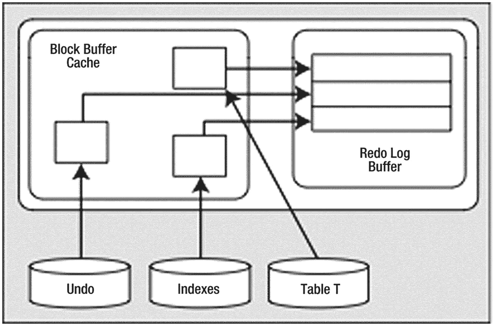
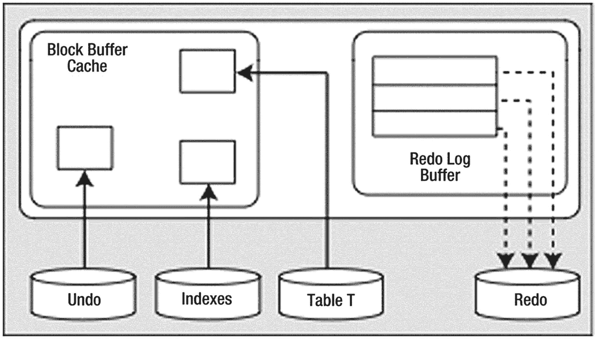

# INSERT 操作

初始的 `INSERT INTO T` 语句将同时生成重做（redo）和撤销（undo）数据。生成的撤销数据将包含使该 `INSERT` 操作“消失”所需的全部信息。而由 `INSERT INTO T` 生成的重做数据将包含使该 `INSERT` 操作“再次发生”所需的全部信息。

在 `INSERT` 操作发生后，我们得到如图 9-1 所示的情景。

**图 9-1**
执行 INSERT 后的系统状态

系统中存在一些被缓存的、已修改的撤销块、索引块和表数据块。这些块中的每一个都受到 `重做日志缓冲区` 中条目的保护。

## 假设情景：此时系统崩溃

在此情景下，系统在发出 `COMMIT` 命令之前或在重做条目写入磁盘之前崩溃。一切都没问题。`SGA` 内存区域被清空，但我们不需要 `SGA` 中的任何内容。当系统重启时，就好像此事务从未发生过一样。没有任何包含更改的块被刷新到磁盘，也没有任何重做数据被刷新到磁盘。我们不需要任何这些撤销或重做数据来从实例故障中恢复。

## 假设情景：此时缓冲区缓存已满

情况是 `DBWn` 进程必须腾出空间，而我们的修改块将被从缓存中刷新出去。在这种情况下，`DBWn` 会首先要求 `LGWR` 刷新保护这些数据库块的重做条目。在 `DBWn` 能够将任何已更改的块写入磁盘之前，`LGWR` 必须将与这些块相关的重做信息刷新（到磁盘）。

这是合理的：如果我们刷新了表 `T` 的修改块（但没有刷新与这些修改关联的撤销块），同时也没有刷新与撤销块关联的重做条目，并且系统发生了故障，那么我们将得到一个修改过的表 `T` 块，但没有与之关联的撤销信息。我们需要在写出这些块之前刷新 `重做日志缓冲区`，以便我们可以重做所有必要的更改，将 `SGA` 恢复到当前的状态，从而能够执行回滚操作。

这第二种情景显示了为此设计的深谋远虑。“如果我们刷新了表 `T` 块 *并且* 没有刷新撤销块的重做数据 *并且* 系统发生了故障”这组条件描述开始变得复杂。随着我们增加用户、更多对象、并发处理等等，情况只会变得更加复杂。

此时，我们得到如图 9-1 所描绘的情况。我们已经生成了一些已修改的表块和索引块。这些块有关联的撤销段块，并且这三种类型的块都生成了重做数据来保护它们。`重做日志缓冲区` *至少* 每三秒刷新一次，或者当它填满三分之一时，或包含 1MB 缓冲数据时，或者每当发生 `COMMIT` 或 `ROLLBACK` 时，都会被刷新。在我们的处理过程中的某个时刻，`重做日志缓冲区` 很可能被刷新。在那种情况下，情况将如图 9-2 所示。

**图 9-2**
重做日志缓冲区刷新后的系统状态

也就是说，缓冲区缓存中将有代表未提交更改的修改块，而磁盘上则存有这些未提交更改的重做数据。这是一个非常正常且频繁发生的情景。

