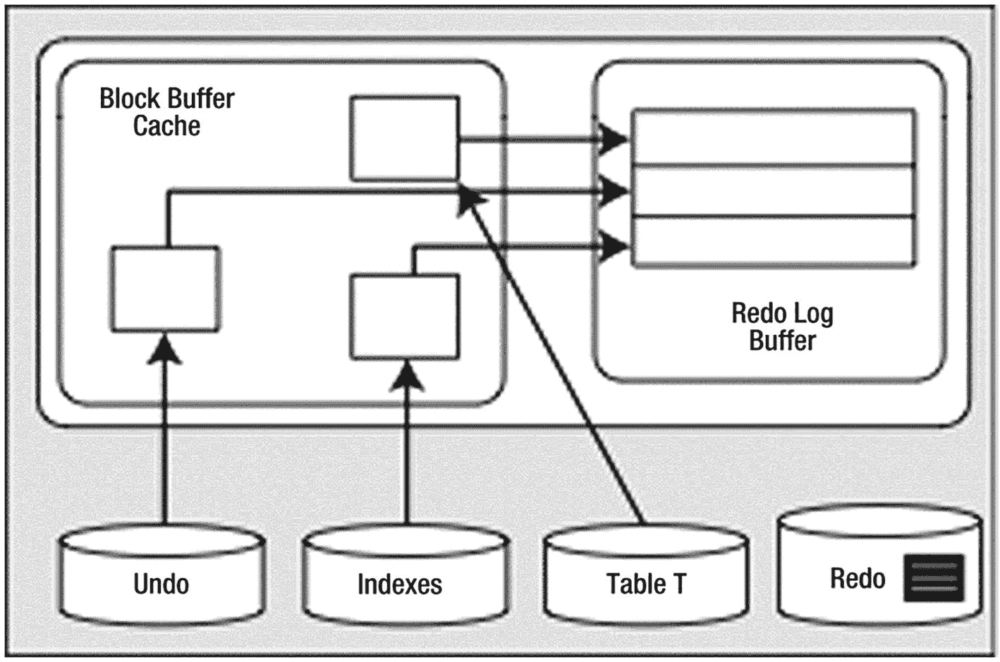
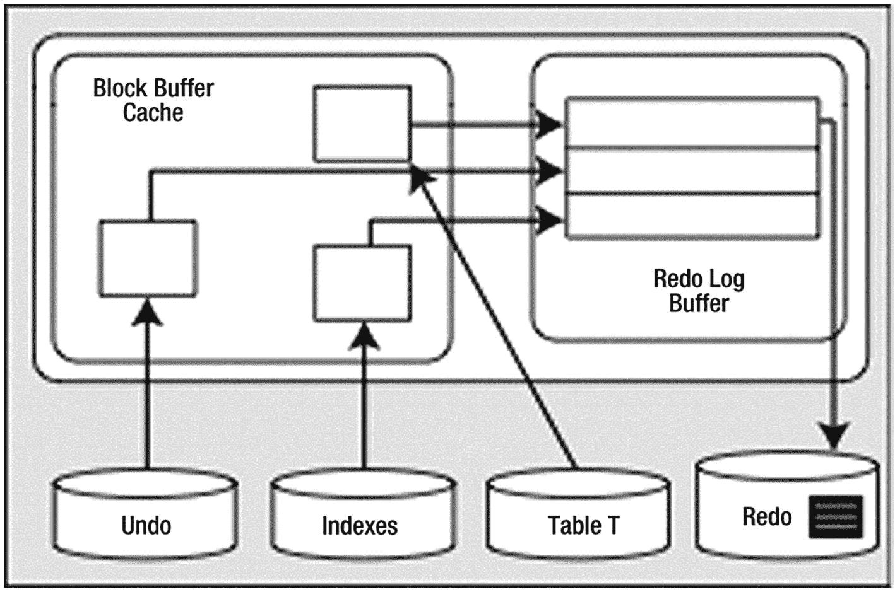

# UPDATE 操作

`UPDATE` 操作将引发与 `INSERT` 大部分相同的工作。这次，撤销数据量会更大；由于 `UPDATE` 操作，我们需要保存一些“前镜像”。现在我们得到如图 9-3 所示的情景（重做日志文件中的深色矩形代表由 `INSERT` 生成的重做；`UPDATE` 的重做仍在 `SGA` 中，尚未写入磁盘）。



**图 9-3**
执行 UPDATE 后的系统状态

块缓冲区缓存中有了更多新的撤销段块。为了在必要时撤销 `UPDATE` 操作，缓存中有了已修改的数据库表块和索引块。我们还生成了更多的 `重做日志缓冲区` 条目。让我们假设，由 `INSERT` 语句（在上一节中讨论过）生成的重做数据已经在磁盘上（在重做日志文件中），而由 `UPDATE` 生成的重做数据仍在缓存中。

## 假设情景：此时系统崩溃

在启动时，Oracle 会读取重做日志文件并发现我们事务的一些重做日志条目。根据我们离开系统时的状态，重做日志文件中存有由 `INSERT` 生成的重做条目（这包括与 `INSERT` 关联的撤销段的重做）。然而，`UPDATE` 的重做数据只存在于日志缓冲区中，从未到达磁盘（并在系统崩溃时被清除了）。这没关系；该事务从未提交，磁盘上的数据文件反映的是 `UPDATE` 操作发生之前的系统状态。

但是，`INSERT` 的重做数据已经被写入了重做日志文件。因此，Oracle 将“向前滚动”该 `INSERT` 操作。我们最终会得到一个与图 9-1 非常相似的图景，包含已修改的撤销块（关于如何撤销 `INSERT` 的信息）、已修改的表块（刚执行完 `INSERT` 后的状态）和已修改的索引块（刚执行完 `INSERT` 后的状态）。Oracle 将发现我们的事务从未提交，并且由于系统正在执行崩溃恢复，而我们的会话已不再连接，因此它会回滚该事务。

为了回滚未提交的 `INSERT` 操作，Oracle 将使用它刚刚向前滚动的撤销数据（来自重做数据，现在位于缓冲区缓存中），并将其应用于数据和索引块，使它们看起来像在 `INSERT` 发生之前的样子。现在一切都恢复原状了。磁盘上的块可能反映也可能不反映该 `INSERT` 操作（这取决于我们的块是否在崩溃前被刷新过）。如果磁盘上的块确实反映了 `INSERT` 操作，那么当这些块从缓冲区缓存中刷新时，该 `INSERT` 将被撤销。如果它们没有反映被撤销的 `INSERT`，那也没关系——反正它们稍后会被覆盖。

这个情景涵盖了崩溃恢复的基本细节。系统将此作为一个两步过程来执行。首先，它向前滚动，将系统带到故障发生前的时刻，然后继续回滚所有尚未提交的操作。此操作将使数据文件重新同步。它重放了正在进行的工作，并撤销任何尚未完成的操作。


##### 假设场景：应用回滚事务

此时，Oracle 将在缓存的撤销段块（最有可能）中查找此事务的撤销信息，如果这些块已被刷新到磁盘（对于非常大的事务更有可能），则会从磁盘读取。它会将撤销信息应用到缓冲区高速缓存中的数据块和索引块上；如果这些块已不在高速缓存中，则会从磁盘读取到高速缓存中，然后应用撤销操作。之后，这些块将被刷新到数据文件中，并恢复其原始行值。

这个场景比系统崩溃更常见。值得注意的是，在回滚过程中，**从不涉及重做日志**。重做日志仅在恢复和归档期间才会被读取。这是一个关键的调优概念：重做日志是**写入**的。Oracle 在正常处理过程中不会读取它们。只要你有足够的设备，使得 `ARCn` 读取一个文件时，`LGWR` 可以写入另一个不同的设备，那么重做日志就不会发生争用。许多其他数据库将日志文件视为“事务日志”。它们没有这种重做与撤销的分离。对于这些系统，回滚操作可能是灾难性的——回滚过程必须读取其日志写入器正在写入的日志。它们在系统中最无法承受争用的部分引入了竞争。Oracle 的目标是使重做日志被顺序写入，并且在写入过程中没有人读取它们。

#### DELETE 操作

同样，`DELETE` 操作会产生撤销信息，数据块被修改，重做信息被发送到重做日志缓冲区。这与之前没有太大不同。事实上，它与 `UPDATE` 非常相似，因此我们将直接进入 `COMMIT`。

#### COMMIT 操作

我们已经研究了各种故障场景和不同的路径，现在终于来到了 `COMMIT`。在这里，Oracle 将把重做日志缓冲区刷新到磁盘，状态图将如图 9-4 所示。



图 9-4

COMMIT 后的系统状态

已修改的块位于缓冲区高速缓存中；其中一些可能已经被刷新到磁盘。*所有*重放此事务所需的重做信息都已安全写入磁盘，更改现在是永久性的。如果我们直接从数据文件读取数据，很可能看到的是事务发生*之前*的数据块状态，因为 `DBWn` 很可能还没有写入它们。这没问题——在发生故障时，可以使用重做日志文件将这些块更新到最新状态。撤销信息将一直保留，直到撤销段回绕并重用这些块。Oracle 将使用该撤销数据，为任何需要它们的会话提供受影响对象的**一致读**。

## 提交与回滚处理

理解重做日志文件如何影响我们作为开发人员是很重要的。我们将研究编写代码的不同方式如何影响重做日志的使用。我们在本章前面已经了解了重做的机制，现在将探讨一些具体问题。你可能会发现许多此类场景，但它们会由 DBA 解决，因为它们影响整个数据库实例。我们将从 `COMMIT` 期间发生的事情开始，然后讨论围绕联机重做日志的常见问题和议题。

### COMMIT 做了什么？

作为开发人员，你应该清楚地理解 `COMMIT` 期间究竟发生了什么。在本节中，我们将探讨 Oracle 中执行 `COMMIT` 语句时发生的情况。`COMMIT` 通常是一个非常快的操作，与事务大小无关。你可能会认为事务越大（换句话说，影响的数据越多），`COMMIT` 所需的时间就越长。事实并非如此。`COMMIT` 的响应时间通常是“平坦的”，与事务大小无关。这是因为 `COMMIT` 实际上没有太多工作要做，但它所做的工作至关重要。

理解并接受这一事实的重要原因之一是，它将引导你让事务保持应有的规模。正如我们在上一章讨论的，许多开发人员人为地限制其事务的大小，每隔若干行就提交一次，而不是在完成一个逻辑工作单元时才提交。他们这样做是错误地认为这是在保护稀缺的系统资源，而实际上他们正在增加资源消耗。如果提交一行需要 X 单位时间，而提交 1000 行也需要同样的 X 单位时间，那么以 1000 次单行提交的方式执行工作，将额外消耗 1000*X 单位时间。只有在必要时（即逻辑工作单元完成时）才提交，不仅可以提高性能，还可以减少对共享资源（日志文件、各种内部闩锁等）的争用。一个简单的例子证明这必然会花费更长时间。我们将使用 Java 应用程序，尽管大多数客户端都会得到类似的结果——除了本例中的 PL/SQL（我们将在示例之后讨论原因）。首先，这是我们将要插入数据的示例表：

```sql
$ sqlplus eoda/foo@PDB1
SQL> create table test
( id          number,
code        varchar2(20),
descr       varchar2(20),
insert_user varchar2(30),
insert_date date);
Table created.
```

我们的 Java 程序（存储在名为 `perftest.java` 的文件中）将接受两个输入：要插入的行数 (`iters`) 和每次提交之间的行数 (`commitCnt`)。它首先连接到数据库，将自动提交设置为 *关闭*（这应在所有 Java 代码中完成），然后总共调用两次 `doInserts()` 方法：

*   一次只是为了预热例程（确保所有类都已加载）

*   第二次，开启 SQL 跟踪，指定要插入的行数以及一次提交多少行（即，每 N 行提交一次）

然后它关闭连接并退出。`main` 方法如下（你需要为你的环境修改连接字符串）：

```java
import java.sql.*;
import java.sql.DriverManager;
import java.sql.Connection;
import java.sql.SQLException;
import java.io.*;
public class perftest
{
public static void main (String arr[]) throws Exception
{
DriverManager.registerDriver(new oracle.jdbc.OracleDriver());
Connection con = DriverManager.getConnection
("jdbc:oracle:thin:@//localhost.localdomain:1521/PDB1", "eoda", "foo");
Integer iters = new Integer(arr[0]);
Integer commitCnt = new Integer(arr[1]);
con.setAutoCommit(false);
doInserts( con, 1, 1 );
Statement stmt = con.createStatement ();
stmt.execute( "begin dbms_monitor.session_trace_enable(waits=>true); end;" );
doInserts( con, iters.intValue(), commitCnt.intValue() );
con.close();
}
```

注意

用于测试的 `SCOTT` 帐户或你使用的任何帐户都需要被授予在 `DBMS_MONITOR` 包上的 `EXECUTE` 权限。

现在，`doInserts()` 方法相当直接。它首先准备（解析）一个 `INSERT` 语句，以便我们可以重复绑定/执行它：


