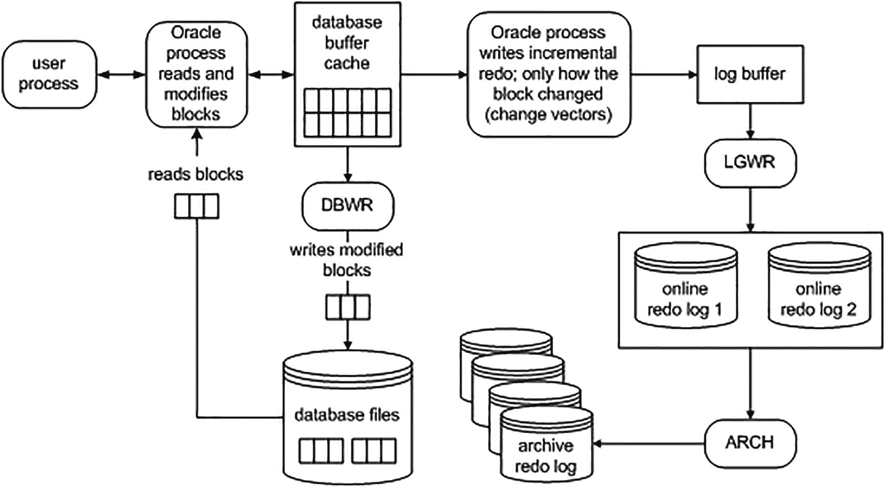

# JDBC 插入操作与 COMMIT 性能分析

## 执行插入操作的代码

```java
static void doInserts(Connection con, int count, int commitCount )
throws Exception
{
PreparedStatement ps =
con.prepareStatement
("insert into test " +
"(id, code, descr, insert_user, insert_date)"
+ " values (?,?,?, user, sysdate)");
```

然后，代码循环执行指定行数的插入操作，反复绑定并执行`INSERT`语句。同时，它在循环内检查一个行计数器，以判断是否需要执行`COMMIT`操作：

```java
int  rowcnt = 0;
int  committed = 0;
for (int i = 0; i < count; i++ )
{
ps.setInt(1,i);
ps.setString(2,"PS - code" + i);
ps.setString(3,"PS - desc" + i);
ps.executeUpdate();
rowcnt++;
if ( rowcnt == commitCount )
{
con.commit();
rowcnt = 0;
committed++;
}
}
con.commit();
System.out.println
("pstatement rows/commitcnt = " + count + " / " +  committed );
}
}
```

**提示**

有关如何使用 Java 连接到 Oracle 数据库的更多详细信息，请参阅 *《Oracle Database JDBC 开发指南》*。

## 环境配置与编译运行

在编译 Java 代码之前，我们需要设置 `CLASSPATH` 环境变量（以下命令应写在一行，中间无空格，但此处因页面宽度限制而换行）：

```bash
$ export CLASSPATH=$CLASSPATH:$ORACLE_HOME/jdbc/lib/ojdbc8.jar:
$ORACLE_HOME/jlib/orai18n.jar
```

同时确保 Java 可执行文件位于 `PATH` 变量中（请根据您的 `ORACLE_HOME` 进行调整）：

```bash
$ export PATH=$PATH:/opt/oracle/product/19c/dbhome_1/jdk/bin
```

接下来，我们从操作系统命令行编译 Java 代码：

```bash
$ javac perftest.java
```

现在，我们将使用不同的输入重复运行此代码，并查看生成的 `TKPROF` 文件。我们将运行插入 100,000 行数据——每次提交 1 行，然后是 10 行，依此类推。以下是从命令行运行第一个测试的示例：

```bash
$ java perftest 100000 1
```

前面的代码执行插入并生成一个跟踪文件。您可以通过以下查询找到跟踪文件所在的目录：

```sql
SQL> select value from v$diag_info where name='Diag Trace';
VALUE
------------------------------------
/opt/oracle/diag/rdbms/cdb/CDB/trace
```

导航到您的跟踪目录，并在该目录中查找最近生成的、包含“insert into test”字符串的跟踪文件：

```bash
$ grep "insert into test" *.trc
CDB_ora_7660.trc:insert into test (id, code, descr, insert_user, insert_date)...
```

使用 `TKPROF` 实用程序处理该文件（这将生成一个人类可读的输出文件）：

```bash
$ tkprof CDB_ora_7660.trc output.txt sys=no
```

运行上述命令后，文件 `output.txt` 包含了插入测试的人类可读的性能输出。生成的 `TKPROF` 文件产生了表 9-1 中的结果。

**表 9-1 插入 100,000 行的结果**

| 需插入的行数 | 每 N 行提交一次，N= | INSERT 语句的 CPU 时间（秒） | 等待“log file sync”的时间（秒） |
| :--- | :--- | :--- | :--- |
| 100,000 | 1 | 1.42 | 34.87 |
| 100,000 | 10 | 1.35 | 4.05 |
| 100,000 | 100 | 1.63 | 0.61 |
| 100,000 | 1000 | 1.65 | 0.21 |
| 100,000 | 10,000 | 1.66 | 0.04 |
| 100,000 | 100,000 | 1.65 | 0.00 |

如您所见，提交得越频繁，等待时间就越长（具体数据可能有所不同）。并且等待时间与您提交的次数大致成正比。请记住，这只是单用户场景；如果多个用户执行相同的工作并且都过于频繁地提交，数字将迅速上升。

我们在类似的情况下反复听到同样的故事。例如，我们已经看到，不使用绑定变量并频繁进行硬解析，会由于库缓存争用和过度的 CPU 使用而严重降低并发性。即使我们改用绑定变量，过于频繁的软解析——由于在短期内会重用它们却仍关闭游标——也会带来巨大的开销。我们必须只在需要时才执行操作——`COMMIT`就是这样的操作之一。最好根据业务需求来确定事务的大小，而不是基于试图减少数据库资源使用的错误想法。

## COMMIT 的开销分析

在此示例中，导致 `COMMIT` 开销大的有两个因素：

*   我们显然增加了与数据库的往返通信。如果每次记录都提交，就会产生更多来回的网络流量。我甚至没有测量这一点，这会增加总的运行时间。
*   每次提交时，我们都必须等待重做日志（redo）被写入磁盘。这将导致一次“等待”。在这种情况下，该等待事件被命名为“log file sync”。

因此，我们在每次 `INSERT` 后提交；每次都等待一小段时间——如果你每次等待一点点时间，但等待次数很多，时间就会累积起来。当我们提交了 100,000 次时，有整整 30 秒的运行时间花在了等待 `COMMIT` 完成上——换句话说，就是等待 `LGWR` 将重做日志写入磁盘。与此形成鲜明对比的是，当我们只提交一次时，我们等待的时间并不长（实际上无法测量）。这证明了 `COMMIT` 是一个快速操作；我们预期响应时间大致是平稳的，而不是我们所做工作量的函数。

那么，为什么 `COMMIT` 的响应时间相对平稳，而与事务大小无关呢？这是因为在我们甚至执行 `COMMIT` 之前，真正困难的工作已经完成了。我们已经修改了数据库中的数据，所以已经完成了 99.9%的工作。例如，以下操作已经发生：

*   在 SGA 中生成了撤销（Undo）块。
*   在 SGA 中生成了被修改的数据块。
*   为上述两项在 SGA 中生成了缓冲的重做日志。
*   根据前三项的大小以及所花费的时间，之前数据的某种组合可能已经被刷新到磁盘。
*   所有的锁都已获取。

当我们执行 `COMMIT` 时，剩下的事情如下：

*   为我们的事务生成一个系统更改号（SCN）。如果您不熟悉，SCN 是 Oracle 用来保证事务顺序并支持故障恢复的一个简单计时机制。它还用于保证数据库中的读一致性和检查点。可以将 SCN 想象成一个计数器；每次有人 `COMMIT`，SCN 就递增 1。
*   `LGWR` 将我们所有*剩余的*缓冲重做日志条目写入磁盘，并将 SCN 记录在在线重做日志文件中。这一步实际上就是 `COMMIT`。如果这一步发生了，我们就提交成功了。我们的事务条目从 `V$TRANSACTION` 中“移除”——这表明我们已经提交。
*   我们会话持有的、记录在 `V$LOCK` 中的所有锁都被释放，所有正在排队等待我们持有锁的进程将被唤醒，并允许继续它们的工作。
*   我们事务修改过的一些块，如果仍在缓冲区缓存中，将被访问并以快速模式“清理”。*块清理*指的是我们存储在数据库块头中的锁相关信息。基本上，我们是在清理块上的事务信息，这样下一个访问该块的人就不必做了。我们这样做不需要生成重做日志信息，从而为以后节省了大量工作（本章后面将详细讨论这一点）。

如您所见，处理 `COMMIT` 几乎没什么可做的。最耗时的操作过去是、将来也永远是由 `LGWR` 执行的活动，因为这是物理磁盘 I/O。`LGWR` 在这里花费的时间将因其已经定期刷新重做日志缓冲区的内容而大大减少。`LGWR` 不会像您做工作那样长时间地缓冲所有工作。相反，它会在您操作的过程中，在后台增量地刷新重做日志缓冲区的内容。这是为了避免在 `COMMIT` 时一次性刷新您的所有重做日志而等待很长时间。


因此，即使我们有一个长时间运行的事务，它所生成的大部分缓冲重做日志在提交前也早已被刷新到磁盘。另一方面，当我们执行 `COMMIT` 时，通常必须等待*所有*尚未写入的缓冲重做日志安全落盘。也就是说，对 `LGWR` 的调用默认情况下是*同步*的。虽然 `LGWR` 可能使用异步 I/O 并行写入我们的日志文件，但我们的事务通常会等待 `LGWR` 完成所有写入操作并收到数据已存在于磁盘上的确认后才返回。

### 注意

Oracle 11g 及以上版本支持一种异步等待。然而，那种提交方式在通用场景下的用途有限。任何面向最终用户的应用程序中的提交都应该是同步的。

## PL/SQL 提交时优化

现在，我之前提到我们使用的是 Java 程序而不是 PL/SQL 是有原因的——这个原因就是 PL/SQL 的提交时优化。我说过，默认情况下对 `LGWR` 的调用是同步的，我们会等待它完成写入。这对于 Oracle 数据库的每个版本和每种编程语言都是成立的，*除了 PL/SQL*。PL/SQL 引擎意识到客户端在 PL/SQL 例程完成之前并不知道其中是否发生了 `COMMIT`，因此它会执行异步提交。它不等待 `LGWR` 完成，而是立即从 `COMMIT` 调用返回。然而，当 PL/SQL 例程完成，当我们从数据库返回到客户端时，PL/SQL 例程将等待 `LGWR` 完成所有未完成的 `COMMIT` 操作。因此，如果你在 PL/SQL 中提交了 100 次然后返回客户端，你可能会发现你只等待了 `LGWR` 一次——不是 100 次——这要归功于这项优化。这是否意味着在 PL/SQL 中频繁提交是个好主意或者可以接受？不，完全不是——只是说这不像在其他语言中那样是个*糟糕的主意*。指导原则是：在你的逻辑工作单元完成后才提交——而不是提前。

### 注意

当你执行分布式事务或 Data Guard 的最大可用性模式时，PL/SQL 中的这种提交时优化可能会被暂停。由于有两个参与者，PL/SQL 必须等待提交实际完成才能继续。此外，通过直接在 PL/SQL 中调用 `COMMIT WORK WRITE WAIT` 也可以暂停此优化。

## 演示 COMMIT 时机

为了演示 `COMMIT` 是一个“固定响应时间”的操作，我们将生成不同数量的重做日志，并测量 `INSERT` 和 `COMMIT` 操作的时间。在进行这些 `INSERT` 和 `COMMIT` 操作时，我们将使用这个小的实用函数来测量会话生成的重做量：

```sql
SQL> create or replace function get_stat_val( p_name in varchar2 ) return number
as
l_val number;
begin
select b.value
into l_val
from v$statname a, v$mystat b
where a.statistic# = b.statistic#
and a.name = p_name;
return l_val;
end;
/
Function created.
```

### 注意

上述函数的所有者需要被直接授予对 `V$` 视图 `V_$STATNAME` 和 `V_$MYSTAT` 的 `SELECT` 权限。

删除表 `T`（如果存在）并创建一个与 `BIG_TABLE` 结构相同的空表 `T`：

```sql
SQL> drop table t purge;
SQL> create table t
as
select *
from big_table
where 1=0;
Table created.
```

##注意

如何在本书开头的“设置你的环境”部分创建并填充 `BIG_TABLE` 表的说明在本书最前面。

我们将使用 `DBMS_UTILITY` 包中的 `GET_CPU_TIME` 和 `GET_TIME` 例程来测量提交事务所使用的 CPU 时间和耗时。用于生成工作负载并报告结果的实际 PL/SQL 块是：

```sql
SQL> set serverout on
SQL> declare
l_redo number;
l_cpu  number;
l_ela  number;
begin
dbms_output.put_line
( '-' || '      Rows' || '        Redo' ||
'     CPU' || ' Elapsed' );
for i in 1 .. 6
loop
l_redo := get_stat_val( 'redo size' );
insert into t select * from big_table  where rownum <= power(10,i);
l_cpu  := dbms_utility.get_cpu_time;
l_ela  := dbms_utility.get_time;
commit work write wait;
dbms_output.put_line
( '-' ||
to_char( power( 10, i ), '9,999,999') ||
to_char( (get_stat_val('redo size')-l_redo), '999,999,999' ) ||
to_char( (dbms_utility.get_cpu_time-l_cpu), '999,999' ) ||
to_char( (dbms_utility.get_time-l_ela), '999,999' ) );
end loop;
end;
/
-      Rows        Redo     CPU Elapsed
-        10       6,552       2      17
-       100      10,336       0       5
-     1,000     114,684       0       8
-    10,000   1,156,452       0      25
-   100,000  13,184,820       1      28
- 1,000,000  67,356,624       2      58
PL/SQL procedure successfully completed.
```

### 注意

时间单位是百分之一秒。你的结果可能会因 `BIG_TABLE` 中的记录数、日志缓冲区大小、重做日志文件的大小和数量、日志写入器进程数量以及 I/O 子系统等变量而有所不同。

## 结论

正如你所看到的，当我们生成的重做日志量从大约 6500 字节变化到 67MB 时，使用分辨率为百分之一秒的计时器无法测量出 `COMMIT` 时间的差异。在我们处理并生成重做日志时，`LGWR` 在后台不断地将我们缓冲的重做信息刷新到磁盘。因此，当我们生成了 67MB 的重做日志信息时，`LGWR` 正忙于每生成大约 1MB 就进行一次刷新。当执行到 `COMMIT` 时，已经没有多少工作需要做了——甚至比生成十行数据时还要少。无论生成多少重做日志，你都应该期望看到类似（但并非完全相同）的结果。


### ROLLBACK 的作用

将 `COMMIT` 改为 `ROLLBACK` 后，我们可以预期得到完全不同的结果。回滚所需的时间绝对是修改数据量的函数。我修改了上一节开发的脚本来执行 `ROLLBACK`（只需将 `COMMIT` 改为 `ROLLBACK`），计时结果大不相同。现在看看结果：

```
$ sqlplus eoda/foo@PDB1
SQL> set serverout on
SQL> declare
    l_redo number;
    l_cpu  number;
    l_ela  number;
begin
    dbms_output.put_line
    ( '-' || '      Rows' || '        Redo' ||
      '     CPU' || ' Elapsed' );
    for i in 1 .. 6
    loop
        l_redo := get_stat_val( 'redo size' );
        insert into t select * from big_table where rownum <= power(10,i);
        l_cpu  := dbms_utility.get_cpu_time;
        l_ela  := dbms_utility.get_time;
        --commit work write wait;
        rollback;
        dbms_output.put_line
        ( '-' ||
          to_char( power( 10, i ), '9,999,999') ||
          to_char( (get_stat_val('redo size')-l_redo), '999,999,999' ) ||
          to_char( (dbms_utility.get_cpu_time-l_cpu), '999,999' ) ||
          to_char( (dbms_utility.get_time-l_ela), '999,999' ) );
    end loop;
end;
/
-      Rows        Redo     CPU Elapsed
-        10       6,672       0       1
-       100      10,884       1       1
-     1,000     122,840       1       0
-    10,000   1,239,080       1       2
-   100,000  14,098,264       7      92
- 1,000,000  71,917,008      36     121
PL/SQL procedure successfully completed.
```

CPU 时间和耗时的差异是意料之中的，因为 `ROLLBACK` 必须撤销我们已完成的工作。与 `COMMIT` 类似，它需要执行一系列操作。甚至在我们执行 `ROLLBACK` 之前，数据库已经做了大量工作。回顾一下，会发生以下情况：

*   撤销段记录已在 SGA 中生成。
*   修改过的数据块已在 SGA 中生成。
*   前两项的缓冲重做日志已在 SGA 中生成。
*   根据前三项的大小以及花费的时间量，之前的部分数据可能已经被刷新到磁盘。
*   所有锁都已被获取。

当我们 `ROLLBACK` 时：

*   我们撤销所有已做的更改。这是通过从撤销段读回数据，有效地逆转我们的操作，然后将撤销条目标记为已应用来实现的。如果我们插入了一行，`ROLLBACK` 将删除它。如果我们更新了一行，回滚将逆转该更新。如果我们删除了一行，回滚将重新插入它。
*   我们会话持有的所有锁都被释放，所有在等待我们持有的锁的队列都会被释放。

另一方面，`COMMIT` 只是将重做日志缓冲区中剩余的任何数据刷新。与 `ROLLBACK` 相比，它做的工作非常少。这里的要点是，除非必要，否则你不想回滚。这很昂贵，因为你花了大量时间做工作，还要花大量时间撤销工作。除非你确定要 `COMMIT`，否则不要做工作。这听起来是常识——当然，除非我想 `COMMIT`，否则我不会做所有这些工作。然而，我经常看到开发人员使用一个“真实”表作为临时表，用数据填充它，生成报告，然后回滚以清除临时数据。稍后，我们将讨论真正的临时表以及如何避免此问题。

## 研究重做

作为处理事务的一部分，Oracle 会捕获数据如何被修改（重做）并将该信息写入日志缓冲区内存区域。接下来，日志写入器后台进程会频繁地将重做信息写入磁盘（在线重做日志）。如果你的数据库启用了归档，一旦一个在线重做日志被填满，归档器进程会将该在线重做日志复制到一个归档重做日志中。处理事务及后续重做流的架构如图 9-5 所示。



图 9-5

Oracle 事务数据并写入重做

重做管理可能成为数据库中的一个序列化点（瓶颈）。这是因为最终所有事务都到达 `LGWR`（或其某个工作进程），要求它管理它们的重做并 `COMMIT` 它们的事务。生成的重做量也会影响归档器进程必须处理的工作量。如果你有一个备用数据库，这些重做还必须传输并应用到备用数据库上。日志写入器和归档器需要做的工作越多，系统就会越慢。

因此，作为开发人员，能够衡量你的操作产生多少重做是很重要的。你产生的重做越多，你的操作可能耗时越长，整个系统也可能越慢。你不仅影响*你的*会话，还影响*每一个*会话。通过观察一个操作倾向于产生多少重做，并对一个问题测试多种方法，你可以找到做事情的最佳方式。

注意

Oracle 至少会启动一个 LGWR 后台进程。在多处理器系统上，Oracle 会生成额外的日志写入器工作进程（LG00）以帮助提高将重做写入磁盘的性能。

### 测量重做

在第一个示例中，我们将使用 AUTOTRACE 来观察生成的重做量。在后续示例中，我们将使用 `GET_STAT_VAL` 函数（本章前面已介绍）。

注意

当你在你的环境中运行这些示例时，不会看到完全相同的结果。你的结果可能会因变量而异，例如 `BIG_TABLE` 中的记录数、内存配置、CPU 以及系统上运行的其他进程。

让我们看看常规路径 `INSERT`（你我每天进行的普通 `INSERT`）和直接路径 `INSERT`（用于将大量数据加载到数据库中）在生成的重做量上的差异。我们将在此简单示例中使用 AUTOTRACE 和先前创建的表 `T` 和 `BIG_TABLE`。首先，我们使用常规路径 `INSERT` 加载表：

```
$ sqlplus eoda/foo@PDB1
SQL> set autotrace traceonly statistics;
SQL> truncate table t;
Table truncated.
SQL> insert into t select * from big_table;
1000000 rows created.
Statistics

          90  recursive calls
      123808  db block gets
       39407  consistent gets
       13847  physical reads
   113875056  redo size
        1177  bytes sent via SQL*Net to client
        1354  bytes received via SQL*Net from client
           4  SQL*Net roundtrips to/from client
           2  sorts (memory)
           0  sorts (disk)
     1000000  rows processed
```

如你所见，该 `INSERT` 产生了大约 113MB 的重做。

注意

本节中的示例是在 `NOARCHIVELOG` 模式的数据库上执行的。如果你在 `ARCHIVELOG` 模式下，表必须被创建或设置为 `NOLOGGING` 才能观察到这种显著变化。我们将在“在 SQL 中设置 NOLOGGING”一节中更详细地研究 `NOLOGGING` 属性。请确保在“真实”系统上与你的 DBA 协调所有非记录操作。

当我们在 `NOARCHIVELOG` 模式数据库中使用直接路径加载时，得到以下结果：

```
SQL> truncate table t;
Table truncated.
SQL> insert /*+ APPEND */ into t  select * from big_table;
1000000 rows created.
Statistics

        551  recursive calls
      16645  db block gets
      15242  consistent gets
      13873  physical reads
     220504  redo size
        1160  bytes sent via SQL*Net to client
        1368  bytes received via SQL*Net from client
           4  SQL*Net roundtrips to/from client
          86  sorts (memory)
           0  sorts (disk)
     1000000  rows processed
SQL> set autotrace off
```

该 `INSERT` 仅产生了约 220KB——是*千字节，不是兆字节*——的重做。如你所见，直接路径插入产生的重做量远少于常规插入。


### 我能否关闭重做日志的生成？

这是一个经常被问到的问题。简单简短的答案是**不能**，因为重做日志对数据库至关重要；它不是开销，也不是浪费。无论你认为自己是否需要它，你都确实需要它。这是既定事实，是数据库的工作方式。如果你关闭了重做日志，那么磁盘驱动器、电源的任何临时故障，或软件崩溃，都会导致整个数据库变得不可用且无法恢复。话虽如此，但在某些情况下，有些操作可以在不生成重做日志的情况下完成。

> **注意**
>
> Oracle 允许你将数据库置于 `FORCE LOGGING` 模式。在这种情况下，*所有*操作都会被记录，无论你是否指定了 `NOLOGGING`。查询 `SELECT FORCE_LOGGING FROM V$DATABASE` 将显示日志记录是否被强制开启。此功能用于支持 Data Guard，这是 Oracle 的一个灾难恢复功能，它依赖重做日志来维护一个备用数据库副本。

#### 在 SQL 中设置 NOLOGGING

一些 SQL 语句和操作支持使用 `NOLOGGING` 子句。这并不意味着对该对象的所有操作都将执行而不生成重做日志，只是某些非常*特定*的操作将生成比正常情况*显著更少*的重做日志。请注意，我说的是“显著更少的重做日志”，而不是“没有重做日志”。所有操作都会生成一些重做日志——所有数据字典操作都将被记录，无论日志记录模式如何。但是，生成的重做日志量可以显著减少。对于这个 `NOLOGGING` 子句的例子，我在一个运行在 `ARCHIVELOG` 模式且未启用强制日志记录的数据库中执行了以下操作：

```
$ sqlplus eoda/foo@PDB1
SQL> select log_mode, force_logging from v$database;
LOG_MODE     FORCE_LOGGING
------------ -----------------
ARCHIVELOG   NO
SQL> drop table t purge;
Table dropped.
SQL> variable redo number
SQL> exec :redo := get_stat_val( 'redo size' );
PL/SQL procedure successfully completed.
SQL> create table t  as  select * from all_objects;
Table created.
SQL> exec dbms_output.put_line( (get_stat_val('redo size')-:redo) &#xF0C9;
|| ' bytes of redo generated...' );
4487796 bytes of redo generated...
PL/SQL procedure successfully completed.
```

这个 `CREATE TABLE` 生成了大约 4MB 的重做日志信息（你的结果将根据插入到表 `T` 中的行数而有所不同）。我们将删除并重新创建该表，这次使用 `NOLOGGING` 模式：

```
SQL> drop table t;
Table dropped.
SQL> variable redo number
SQL> exec :redo := get_stat_val( 'redo size' );
PL/SQL procedure successfully completed.
SQL> create table t NOLOGGING as  select * from all_objects;
Table created.
SQL> exec dbms_output.put_line( (get_stat_val('redo size')-:redo) &#xF0C9;
|| ' bytes of redo generated...' );
90108 bytes of redo generated...
PL/SQL procedure successfully completed.
```

这次，我们只生成了 90KB 的重做日志。如你所见，这造成了巨大的差异——4MB 的重做日志对 90KB。第一个例子中写入的 4MB 是实际表数据本身的副本；当创建表时没有使用 `NOLOGGING` 子句，它被写入了重做日志。

如果你在 `NOARCHIVELOG` 模式数据库上测试此操作，你将看不到两者之间的任何差异。在 `NOARCHIVELOG` 模式数据库中，`CREATE TABLE` 不会被记录，数据字典修改除外。此外，如果你在启用了强制日志记录的数据库中运行此测试，无论 `NOLOGGING` 子句如何，你总会得到记录的重做日志。

这些事实指出了一个有价值的提示：在你的系统将运行于生产的模式下进行测试，*因为行为可能有所不同*。你的生产系统将运行在 `ARCHIVELOG` 模式下；如果你在此模式下执行大量生成重做日志的操作，但在 `NOARCHIVELOG` 模式下不会，你会希望在测试期间发现这一点，而不是在向用户推出期间！

当然，现在很明显你会尽你所能地使用 `NOLOGGING`，对吗？事实上，答案是一个响亮的***不***。你必须非常小心地使用此模式，并且只有在负责备份和恢复的人员讨论过相关问题后才能使用。假设你创建了这个表，它现在已成为你应用程序的一部分（例如，你在升级脚本中使用了 `CREATE TABLE AS SELECT NOLOGGING`）。你的用户在白天修改此表。当晚，该表所在的磁盘发生故障。“没问题”，DBA 说。“我们运行在 `ARCHIVELOG` 模式下，可以执行介质恢复。” 然而，问题在于，最初创建的表由于没有被记录，无法从归档重做日志中恢复。此表是不可恢复的，这引出了关于 `NOLOGGING` 操作最重要的点：它们必须与你的 DBA 和整个系统协调使用。如果你使用了它们而其他人不知道这一事实，你可能会损害 DBA 在介质故障后完全恢复数据库的能力。`NOLOGGING` 操作必须谨慎而小心地使用。

关于 `NOLOGGING` 操作需要注意的重要事项如下：

*   *实际上会生成一定量的重做日志*。此重做日志用于保护数据字典。这完全无法避免。它可能比以前的数量显著减少，但总会有一些。

*   ***`NOLOGGING` 并不能阻止所有后续操作生成重做日志。*** 在前面的例子中，我并没有创建一个永远不会被记录的表。只有创建表的单个操作未被记录。所有后续的“正常”操作，如 `INSERT`、`UPDATE`、`DELETE` 和 `MERGE` 都将被记录。其他特殊操作，例如使用 `SQL*Loader` 的直接路径加载或使用 `INSERT /*+ APPEND */` 语法的直接路径 `INSERT`，将不会被记录（除非并且直到你 `ALTER` 该表并再次启用完全日志记录）。然而，一般来说，你的应用程序对此表执行的操作*将被记录*。

*   在 `ARCHIVELOG` 模式数据库中执行 `NOLOGGING` 操作后，*你必须尽快对受影响的数据文件进行一次新的基线备份*，以避免由于介质故障而丢失由 `NOLOGGING` 操作创建的数据。由于 `NOLOGGING` 操作创建的数据不在重做日志文件中，也尚未包含在备份中，你无法恢复它！


