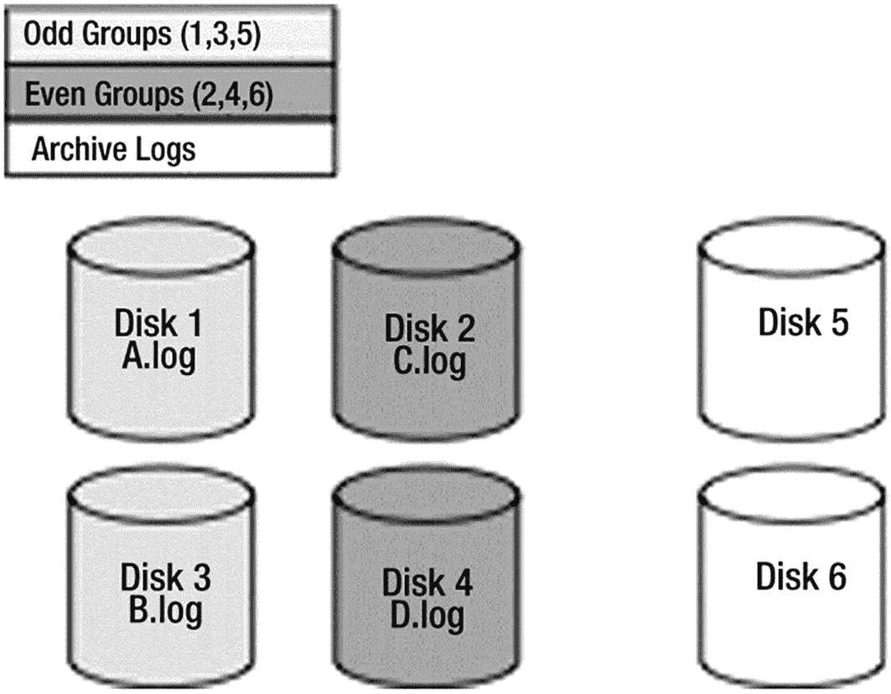
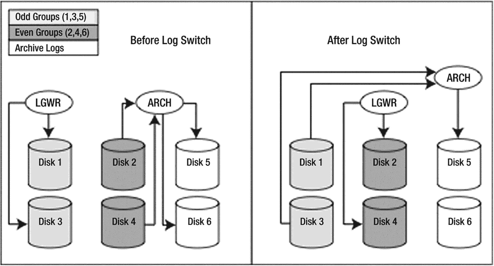

# 日志争用

这与`无法分配新日志`的消息类似，是数据库管理员（DBA）必须解决的问题，通常需要与系统管理员协作。然而，如果 DBA 监控不够仔细，开发人员也可能察觉到这个问题。

如果您面临日志争用，可能观察到 Statspack 报告中“log file sync”事件的等待时间很长，以及“log file parallel write”事件显示出的写入时间过长。如果您看到这些情况，您可能遇到了重做日志的争用；它们写入的速度不够快。这可能由多种原因导致。其中一个应用程序方面的原因（这是 DBA 无法解决的，但开发人员必须解决）是您提交得过于频繁——例如，在执行`INSERT`操作的循环内部提交。正如之前在“`COMMIT`做什么？”一节中所演示的那样，过于频繁地提交，除了是一种不良的编程实践外，还是引入大量`log file sync`等待的必然方式。假设您的所有事务大小都是正确的（您没有比业务规则规定的更频繁地提交），根据我的经验，日志等待的最常见原因如下：

*   将重做日志放在速度慢的设备上：磁盘性能不佳。是时候购买更快的磁盘了。

*   将重做日志与其他频繁访问的文件放在同一设备上：重做日志被设计为使用顺序写入并放置在专用设备上。如果系统的其他组件——甚至是其他 Oracle 组件——在`LGWR`写入的同时尝试读取和写入该设备，您将遇到一定程度的争用。在这里，您要尽可能确保`LGWR`独占访问这些设备。

*   以缓冲方式挂载日志设备：这里您使用的是“cooked”文件系统（不是 RAW 磁盘）。操作系统在缓冲数据，数据库也在缓冲数据（重做日志缓冲区）。双重缓冲会降低速度。如果可能，请以“直接”方式挂载设备。具体方法因操作系统和设备而异，但通常是可行的。

*   将重做日志放在速度慢的技术上，例如`RAID-5`：`RAID-5`对读取操作很好，但对写入操作通常很糟糕。正如我们之前关于`COMMIT`期间发生什么所见，我们必须等待`LGWR`确保数据写入磁盘。使用任何会减慢此速度的技术都不是好主意。

如果可能的话，您真的需要至少五个专用设备用于日志记录，最优是六个设备来镜像您的归档日志。在如今拥有 200GB、300GB、1TB 及更大磁盘的时代，这变得越来越难，但如果您能留出四个能找到的最小、最快的磁盘和一个或两个大磁盘，您就可以对`LGWR`和`ARCn`产生积极影响。为了布置磁盘，您需要将它们分成三组（见图 9-6）：



图 9-6 最佳重做日志配置

*   重做日志组 1：磁盘 1 和 3
*   重做日志组 2：磁盘 2 和 4
*   归档：磁盘 5，以及可选的磁盘 6（大磁盘）

您将把包含成员 A 和 B 的重做日志组 1 放在磁盘 1 和 3 上。您将把包含成员 C 和 D 的重做日志组 2 放在磁盘 2 和 4 上。如果您有组 3、4 等，它们将分别放在奇数和偶数磁盘组上。这样做的效果是，当数据库当前使用组 1 时，`LGWR`将同时写入磁盘 1 和 3。当此组写满后，`LGWR`将移动到磁盘 2 和 4。当它们写满后，`LGWR`将返回磁盘 1 和 3。与此同时，`ARCn`将处理已满的在线重做日志并将其写入磁盘 5 和 6，即大磁盘。最终效果是`ARCn`和`LGWR`都不会读取正在被写入的磁盘，也不会写入正在被读取的磁盘，因此不存在争用（见图 9-7）。



图 9-7 重做日志流

因此，当`LGWR`写入组 1 时，`ARCn`正在读取组 2 并写入归档磁盘。当`LGWR`写入组 2 时，`ARCn`正在读取组 1 并写入归档磁盘。这样，`LGWR`和`ARCn`各自拥有专用设备，不会与任何人争用，甚至彼此之间也不会争用。

## 临时表与重做日志

Oracle 提供两种类型的临时表：全局临时表和私有临时表。全局临时表是 Oracle 中存在已久的功能。全局临时表是持久的数据库对象，保存在磁盘上，并且对所有会话可见。它们之所以被称为临时表，是因为其中的数据仅在事务或会话的持续时间内存在。

从 Oracle 18c 开始，您可以创建私有临时表。与全局临时表不同，私有临时表仅存在于内存中，并且仅对创建它的会话可见。您可以将私有临时表定义为按事务或按会话持续存在，之后临时表会被自动删除。

**注意**

如果您使用过其他数据库技术，如 SQL Server 或 MySQL，那么私有临时表更符合您在这些环境中使用的临时表概念。

尽管全局临时表已经存在一段时间，但围绕它们仍然存在一些困惑，特别是在日志记录方面。在本节中，我们还将探讨“临时表在更改日志记录方面是如何工作的？”这个问题。


## 全局临时表

你可以通过 `TEMP_UNDO_ENABLED` 参数指示 Oracle 将临时表的 undo 信息存储在临时表空间中。当在临时表空间中修改数据块时，不会产生重做日志。因此，当 `TEMP_UNDO_ENABLED` 设置为 `TRUE` 时，针对临时表发出的任何 DML 操作将产生很少甚至不产生重做日志。

### 注意
默认情况下，`TEMP_UNDO_ENABLED` 设置为 `FALSE`。

为了充分理解 `TEMP_UNDO_ENABLED` 对重做日志生成的影响，我们首先来看看当 `TEMP_UNDO_ENABLED` 设置为 `FALSE` 时的行为。我设置了一个小测试来演示处理临时表时生成的重做日志量，这也间接反映了为临时表生成的 undo 量，因为只有 undo 会被记录到日志中。为了演示，我将使用结构相同的永久表和临时表，然后对每个表执行相同的操作，测量每次生成的重做日志量。我使用的表如下：

```
$ sqlplus eoda/foo@PDB1
SQL> create table perm
( x char(2000) ,
y char(2000) ,
z char(2000)  );
Table created.
SQL> create global temporary table temp
( x char(2000) ,
y char(2000) ,
z char(2000)  )
on commit preserve rows;
Table created.
```

我编写了一个小的存储过程，允许我执行任意的 SQL 并报告该 SQL 生成的重做日志量。我将使用此例程对临时表和永久表执行 `INSERT`、`UPDATE` 和 `DELETE` 操作：

```
SQL> create or replace procedure do_sql( p_sql in varchar2 )
as
l_start_redo    number;
l_redo          number;
begin
l_start_redo := get_stat_val( 'redo size' );
execute immediate p_sql;
commit;
l_redo := get_stat_val( 'redo size' ) - l_start_redo;
--
dbms_output.put_line
( to_char(l_redo,'99,999,999') ||' bytes of redo generated for "' ||
substr( replace( p_sql, chr(10), ' '), 1, 25 ) || '"...' );
end;
/
Procedure created.
```

然后我针对 `PERM` 和 `TEMP` 表运行了等效的 `INSERT`、`UPDATE` 和 `DELETE` 操作：

```
SQL> set serveroutput on format wrapped
SQL> begin
do_sql( 'insert into perm
select 1,1,1
from all_objects
where rownum <= 500' );
do_sql( 'insert into temp
select 1,1,1
from all_objects
where rownum <= 500' );
dbms_output.new_line;
do_sql( 'update perm set x = 2' );
do_sql( 'update temp set x = 2' );
dbms_output.new_line;
do_sql( 'delete from perm' );
do_sql( 'delete from temp' );
end;
/
3,313,088 bytes of redo generated for "insert into perm"...
72,584 bytes of redo generated for "insert into temp"...
3,268,384 bytes of redo generated for "update perm set x = 2"...
1,946,432 bytes of redo generated for "update temp set x = 2"...
3,245,112 bytes of redo generated for "delete from perm"...
3,224,460 bytes of redo generated for "delete from temp"...
PL/SQL procedure successfully completed.
```

如你所见：
*   对“真实”表的 `INSERT` 操作生成了大量重做日志，而对临时表几乎没生成重做日志。这是合理的——`INSERT` 操作生成的 undo 数据非常少，并且只有 undo 数据会被记录到临时表的日志中。
*   对真实表的 `UPDATE` 操作生成的重做日志大约是临时表的两倍。同样，这很合理。该 `UPDATE` 操作中大约一半的数据，即“前映像”，必须被保存。临时表的“后映像”（redo）则无需保存。
*   两次 `DELETE` 操作占用的重做日志空间大致相同。这是合理的，因为 `DELETE` 的 undo 很大，但被修改数据块的 redo 却非常小。因此，对临时表的 `DELETE` 操作与对永久表的 `DELETE` 操作方式非常相似。

因此，关于临时表上的 DML 活动，可以得出以下一般性结论：
*   `INSERT` 操作将产生很少甚至不产生 undo/redo 活动。
*   `UPDATE` 操作产生的 redo 量大约是永久表的一半。
*   `DELETE` 操作产生的 redo 量与永久表相同。

现在，我将在 `TEMP_UNDO_ENABLED` 设置为 `TRUE` 的情况下运行之前的测试。`TEMP_UNDO_ENABLED` 参数可以在会话或系统级别设置。以下是在会话级别将其设置为 `TRUE` 的示例：

```
SQL> alter session set temp_undo_enabled=true;
```

一旦在会话中启用，该会话中对临时表数据的任何修改，其后续的 undo 信息都将记录到临时表空间。对永久表的修改，其 undo 信息仍将记录到 undo 表空间。为了查看其影响，我将运行一些代码，显示针对永久表和临时表发出事务时生成的重做日志量——唯一的不同是 `TEMP_UNDO_ENABLED` 被设置为 `TRUE`。输出如下：

```
3,312,148 bytes of redo generated for "insert into perm"...
376 bytes of redo generated for "insert into temp"...
2,203,788 bytes of redo generated for "update perm set x = 2"...
376 bytes of redo generated for "update temp set x = 2"...
3,243,412 bytes of redo generated for "delete from perm"...
376 bytes of redo generated for "delete from temp"...
```

结果非常显著：临时表上的 `INSERT`、`UPDATE` 和 `DELETE` 语句生成的 redo 量微乎其微。对于执行涉及临时表的大型批处理操作的环境，你可以预期会看到生成的 redo 量显著减少。

### 注意
你可能想知道为什么在之前的示例输出中生成了 376 字节的 redo。当进程在数据库内消耗空间时，Oracle 会进行一些内部维护。这些更改会记录在数据字典中，从而产生一些 redo 和 undo。

值得注意的是，在 Oracle Active Data Guard 配置中，你可以直接对存在于备用数据库中的临时表发出 DML 语句。我们可以通过针对备用数据库再次运行相同的代码，来查看为临时表生成的 redo 量。唯一的区别是，必须移除针对永久表发出事务的语句（因为你不能在备用数据库中对永久表发出 DML）。以下输出显示生成了 0 字节的 redo：

```
0 bytes of redo generated for "insert into temp"...
0 bytes of redo generated for "update temp set x = 2"...
0 bytes of redo generated for "delete from temp"...
```

### 注意
无需在备用数据库中设置 `TEMP_UNDO_ENABLED`。这是因为临时表的 undo 在 Oracle Active Data Guard 备用数据库中始终是启用的。

全局临时表通常用于报告目的——例如生成和存储中间查询结果。Oracle Active Data Guard 常用于将报告应用程序负载转移到备用数据库。将全局临时表与 Oracle Active Data Guard 结合使用，你就拥有了一个更强大的工具来满足你的报告需求。


## 私有临时表

关于撤销的生成，私有临时表的行为与全局临时表相似。我们可以通过运行与上一节相同的测试来测量使用临时表时生成的撤销量。首先，我们来创建永久表和私有临时表：

```
$ sqlplus eoda/foo@PDB1
SQL> alter session set temp_undo_enabled=false;
SQL> create table perm
( x char(2000) ,
y char(2000) ,
z char(2000)  );
SQL> CREATE PRIVATE TEMPORARY TABLE ora$ptt_temp
( x char(2000) ,
y char(2000) ,
z char(2000))
ON COMMIT PRESERVE DEFINITION;
```

接下来，我们来测量对上述两个表进行事务处理时生成的重做量：

```
SQL> set serveroutput on format wrapped
SQL> begin
do_sql( 'insert into perm
select 1,1,1
from all_objects
where rownum <= 500' );
do_sql( 'insert into ora$ptt_temp
select 1,1,1
from all_objects
where rownum <= 500' );
dbms_output.new_line;
do_sql( 'update perm set x = 2' );
do_sql( 'update ora$ptt_temp set x = 2' );
dbms_output.new_line;
do_sql( 'delete from perm' );
do_sql( 'delete from ora$ptt_temp' );
end;
/
```

如您所见，生成的重做量与`TEMP_UNDO_ENABLED`设置为`FALSE`时全局临时表的行为相同：

```
3,324,888 bytes of redo generated for "insert into perm         "...
72,548 bytes of redo generated for "insert into ora$ptt_temp "...
5,408,292 bytes of redo generated for "update perm set x = 2"...
1,937,060 bytes of redo generated for "update ora$ptt_temp set x"...
3,252,296 bytes of redo generated for "delete from perm"...
3,225,464 bytes of redo generated for "delete from ora$ptt_temp"...
```

如果我们在`TEMP_UNDO_ENABLED`设置为`TRUE`的情况下运行相同的测试，可以看到撤销生成量的巨大差异：

```
3,324,828 bytes of redo generated for "insert into perm         "...
384 bytes of redo generated for "insert into ora$ptt_temp "...
2,201,092 bytes of redo generated for "update perm set x = 2"...
384 bytes of redo generated for "update ora$ptt_temp set x"...
3,251,936 bytes of redo generated for "delete from perm"...
384 bytes of redo generated for "delete from ora$ptt_temp"...
```

结论是，当你使用全局临时表或私有临时表时，如果希望最小化撤销生成，请将`TEMP_UNDO_ENABLED`设置为`TRUE`。

## 探究撤销

Oracle 数据库创建并管理用于回滚（或撤销）数据库更改的信息。撤销最明显的用途是当你发出`ROLLBACK`语句以撤销你不想提交的数据更改时。以下是撤销用途的完整列表：

*   通过`ROLLBACK`语句回滚事务
*   实现读一致性
*   恢复数据库
*   使用 Oracle 闪回查询分析过去某个时间点的数据
*   使用 Oracle 闪回功能从逻辑损坏中恢复

我们已经讨论了前面几个关于撤销段的主题。我们已经了解了它们在恢复期间如何使用、如何与重做日志交互，以及如何用于数据的非阻塞读和一致读。在本节中，我们将探讨与撤销段最常被提及的问题。

我们将主要讨论臭名昭著的`ORA-01555: snapshot too old`错误，因为这个单一问题在整个数据库主题集合中引起的困惑比任何其他主题都多。然而，在此之前，我们将先探究另一个与撤销相关的问题：哪种类型的 DML 操作生成最多和最少的撤销（鉴于上一节临时表的示例，你可能已经可以自己回答这个问题）。

### 什么操作生成最多和最少的撤销？

这是一个常被问到但容易回答的问题。索引的存在（或者表是索引组织表这一事实）可能会显著影响生成的撤销量，因为索引是复杂的数据结构，可能会产生大量的撤销信息。

也就是说，`INSERT`操作通常会生成最少的撤销，因为 Oracle 为此需要记录的只是一个用于“删除”的 rowid。`UPDATE`操作通常在比赛中排名第二（在大多数情况下）。需要记录的只是更改的字节。通常你只会`UPDATE`整行数据中的一小部分。因此，只需在撤销中记住该行的一小部分。之前的许多示例与这个经验法则相悖，但那是因为它们更新的是大型、固定大小的行，并且更新了整行。更常见的情况是`UPDATE`一行并更改总行的一小部分百分比。`DELETE`操作通常会生成最多的撤销。对于`DELETE`，Oracle 必须将整行的前映像记录到撤销段中。之前的关于重做生成的临时表示例就证明了这一点：`DELETE`生成的重做最多，并且由于临时表 DML 操作中唯一记录的元素是撤销，我们实际上观察到`DELETE`生成的撤销也最多。`INSERT`生成的需要记录的撤销非常少。`UPDATE`生成的量等于被更改数据的前映像，而`DELETE`生成的则是写入撤销段的整个数据集。

如前所述，你还必须考虑在索引上执行的工作。你会发现，更新未索引的列不仅执行速度快得多，而且生成的撤销通常也比更新已索引的列少得多。例如，我们将创建一个包含两列的表，两列包含相同的信息，并为其中一列建立索引：

```
$ sqlplus eoda/foo@PDB1
SQL> create table t
as
select object_name unindexed,
object_name indexed
from all_objects;
Table created.
SQL> create index t_idx on t(indexed);
Index created.
SQL> exec dbms_stats.gather_table_stats(user,'T');
PL/SQL procedure successfully completed.
```

注意：当你在自己的数据库上运行这些测试时，不会看到完全相同的结果。这将取决于你数据库中的对象数量，而不同数据库之间这个数量是不同的。

现在我们将更新该表，首先更新未索引的列，然后更新已索引的列。我们需要一个新的`V$`查询来测量每种情况下生成的撤销量。以下查询为我们实现了这一点。它通过从`V$MYSTAT`获取我们的会话 ID（`SID`），用它在`V$SESSION`视图中查找我们的记录，并检索事务地址（`TADDR`）。它使用`TADDR`调出我们的`V$TRANSACTION`记录（如果有的话）并选择`USED_UBLK`列——已使用的撤销块数。由于我们当前不在事务中，我们预计它现在会返回零行：

```
SQL> select used_ublk
from v$transaction
where addr = (select taddr
from v$session
where sid = (select sid
from v$mystat
where rownum = 1
)
);
no rows selected
```

但在`UPDATE`开始一个事务后，查询将返回一行：

```
SQL> update t set unindexed = lower(unindexed);
72522 rows updated.
SQL> select used_ublk
from v$transaction
where addr = (select taddr
from v$session
where sid = (select sid
from v$mystat
where rownum = 1
)
);
USED_UBLK
----------
1369
SQL> commit;
Commit complete.
```

该`UPDATE`使用了 1369 个块来存储其撤销。提交会释放这些块，因此如果我们重新运行对`V$TRANSACTION`的查询，它将再次显示`no rows selected`。当我们更新相同的数据——只是这次带有索引——我们将观察到以下情况：

```
SQL> update t set indexed = lower(indexed);
72522 rows updated.
SQL> select used_ublk
from v$transaction
where addr = (select taddr
from v$session
where sid = (select sid
from v$mystat
where rownum = 1
)
);
USED_UBLK

```
正如你所见，在这个例子中，更新`indexed`列产生的 undo 量是之前的好几倍。这是由于索引结构本身的内在复杂性以及我们更新了表中的每一行这一事实造成的——这移动了该结构中的每一个索引键值。

### ORA-01555: 快照过旧错误

在上一章，我们简要研究了`ORA-01555`错误，并探讨了其成因之一：提交过于频繁。这里，我们将更详细地探究`ORA-01555`错误的成因和解决方案。`ORA-01555`是一种令人困惑的错误。它是许多神话、不准确说法和假设的基础。

> **注意**
>
> `ORA-01555`错误与数据损坏或数据丢失完全无关。在这方面，它是一个“安全”的错误；唯一的后果是收到此错误的查询无法继续处理。

这个错误其实很直接，只有两个真正的原因，但由于其中一个原因有一种非常频繁发生的特殊情况，我会说有三个：

*   对于系统上执行的操作，`undo`段太小了。
*   你的程序在`COMMIT`之间进行获取（实际上是第一点的变体）。我们在第 8 章中介绍过这一点。
*   块清理。

前两点与 Oracle 的读一致性模型直接相关。正如你在第 7 章中所回忆的，你的查询结果是*预先注定*的，这意味着在 Oracle 甚至检索第一行之前，结果就已经明确定义了。Oracle 通过使用`undo`段来回滚自你的查询开始以来已更改的块，从而提供这种一致的时间点数据库“快照”。你执行的每条语句，例如以下

```
SQL> update t set x = 5 where x = 2;
SQL> insert into t select * from t where x = 2;
SQL> delete from t where x = 2;
SQL> select * from t where x = 2;
```

都将看到`T`表以及`X=2`的行集的一个读一致性视图，而不管数据库中的任何其他并发活动。

> **注意**
>
> 这里展示的四条语句只是说明哪些类型的语句会看到`T`表的读一致性视图。它们并不意味着要在数据库中作为单个事务运行，因为第一条`update`语句会导致后面的三条语句看不到任何记录。它们纯粹是说明性的。

所有“读取”表的语句都利用了这种读一致性。在刚刚展示的例子中，`UPDATE`语句读取表以查找`x=2`的行（然后更新它们）。`INSERT`语句读取表以查找`X=2`的行，然后插入它们，依此类推。正是`undo`段的这种双重用途——既用于回滚失败的事务，又用于提供读一致性——导致了`ORA-01555`错误。

前面列表中的第三点是`ORA-01555`更隐蔽的一个原因，因为它可能发生在只有一个会话的数据库中，并且当引发`ORA-01555`错误时，这个会话并没有修改正在被查询的表！这似乎是不可能的——为什么我们需要一个我们保证没有被修改的表的`undo`数据呢？我们很快就会知道。

在我们通过图示查看所有三种情况之前，我想与你分享`ORA-01555`错误的通用解决方案：

*   如果你的`undo`表空间启用了自动扩展，请正确设置`UNDO_RETENTION`参数（大于执行最长事务所需的时间或预期的最长闪回操作所需的时间）。`V$UNDOSTAT`可用于确定长时间运行查询的持续时间。另外，确保在磁盘上预留了足够的空间，以便`undo`段能够根据请求的`UNDO_RETENTION`增长到所需的大小。
*   如果你的`undo`表空间是固定大小的，那么`UNDO_RETENTION`参数将被忽略，Oracle 会自动调整`undo`。对于固定大小的`undo`表空间，选择一个足够大的大小以容纳长时间运行的查询和闪回操作。
*   减少查询的运行时间（对其进行优化）。如果可能，这始终是一件好事，所以它可能是你首先尝试的方法。它减少了对更大`undo`段的需求。此方法有助于解决前面的几点。
*   收集相关对象的统计信息。这有助于避免前面列出的块清理问题。由于块清理是大规模`UPDATE`或`INSERT`操作的结果，因此无论如何都需要在一次大规模`UPDATE`或大加载之后收集统计信息。

我们将回到这些解决方案，因为了解它们很重要。在开始之前，先将它们突出展示似乎是合适的。

