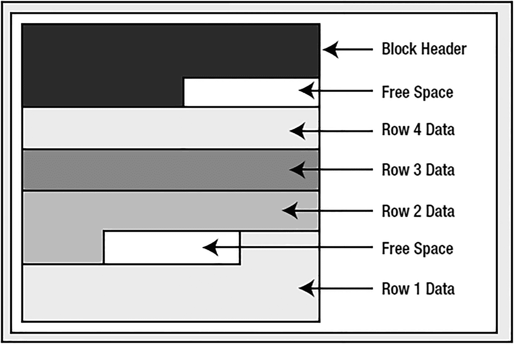
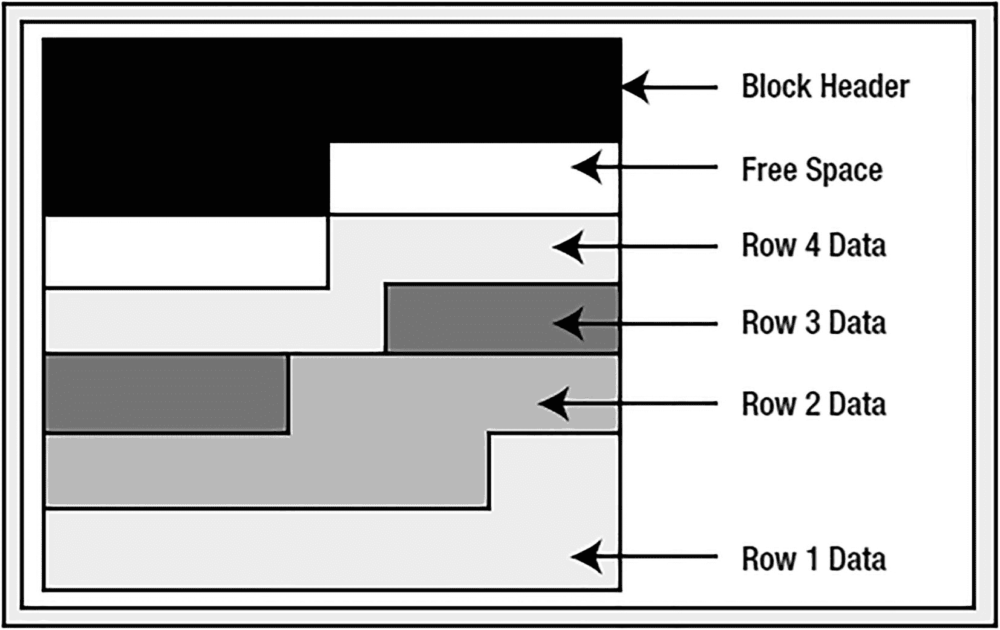
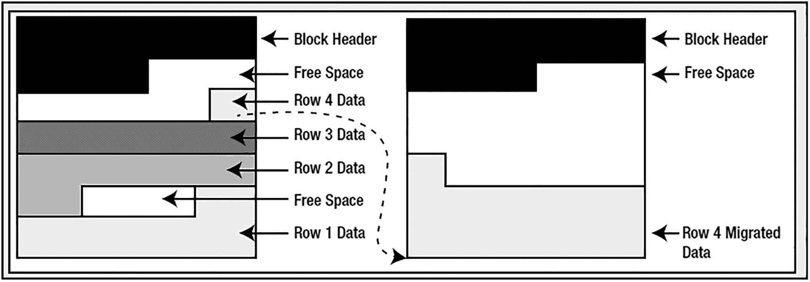

# Oracle 数据库中的段

## 段（Segment）

Oracle 中的`Segment`是一种在磁盘上消耗存储空间的对象。虽然段类型众多，但最常见的有如下几种：

*   `Cluster`（簇）：这种段类型能够存储表。簇有两种类型：B*Tree 簇和哈希簇。簇通常用于将来自多个表的相关数据预连接并存储在同一个数据库块中，以及将单个表的相关信息存储在一起。名称“cluster”指的是该段能够将相关信息物理地聚集在一起的能力。
*   `Table`（表）：表段保存数据库表的数据，可能是与索引段一起使用的最常见的段类型。
*   `Table partition`（表分区）或`subpartition`（子分区）：这种段类型用于分区，与表段非常相似。表分区或子分区段仅保存表中的一部分数据。一个分区表由一个或多个表分区段组成，而一个复合分区表则由一个或多个表子分区段组成。
*   `Index`（索引）：这种段类型保存索引结构。
*   `Index partition`（索引分区）：类似于表分区，这种段类型包含索引的某个部分。一个分区索引由一个或多个索引分区段组成。
*   `Lob partition`（LOB 分区）、`lob subpartition`（LOB 子分区）、`lobindex`和`lobsegment`：`lobindex`和`lobsegment`段保存`large object`（大对象），或称`LOB`的结构。当包含`LOB`的表被分区时，`lobsegment`也会被分区——`lob partition`段就是用于此目的。有趣的是，并不存在`lobindex partition`这种段类型——无论出于何种原因，Oracle 将分区后的 LOB 索引标记为索引分区。`LOB`将在第 12 章中详细讨论。
*   `Nested table`（嵌套表）：这是分配给嵌套表的段类型，嵌套表是主/细目关系中一种特殊的子表，我们稍后会讨论。
*   `Rollback`（回滚）和`Type2 undo`（类型 2 撤销）：这是存放撤销（undo）数据的地方。回滚段是由 DBA 手动创建的。`Type2 undo`段则由 Oracle 自动创建和管理。

因此，举例来说，一个表可能是一个段。一个索引也可能是一个段。我强调“可能是”这个词，是因为我们可以将一个索引分区到独立的段中。因此，索引对象本身可能只是一个定义，而不是一个物理段——该索引将由许多索引分区组成，而每个`index partition`（索引分区）本身是一个段。一个表可能是一个段，也可能不是。出于同样的原因，我们可能因为分区而拥有许多表段，或者我们可能在一个名为`cluster`的段中创建一个表。这个表将驻留于此，可能与同一簇段中的其他表共存。

然而，最常见的情况是，一个表是一个段，一个索引也是一个段。就目前而言，这样考虑是最简单的方式。当你创建一个表时，你通常是在创建一个新的表段，并且如第 3 章所述，该段由区（extent）组成，区又由块（block）组成。这是正常的存储层次结构。但重要的是要注意，只有一对一的关系是常见情况。例如，考虑这个简单的`CREATE TABLE`语句：
```sql
$ sqlplus eoda/foo@PDB1
SQL> create table t ( x int primary key, y clob, z blob );
```
这条语句会创建六个段，假设是在 Oracle 11g Release 1 及更早版本中；在 Oracle 11g Release 2 及更高版本中，默认情况下段创建会延迟到插入第一行时才进行（我们将在下面使用语法让段立即创建）。如果在没有任何对象的模式（schema）中执行此`CREATE TABLE`语句，你将观察到以下情况：
```sql
SQL> select segment_name, segment_type from user_segments;
no rows selected
SQL> create table t
( x int primary key,
y clob,
z blob )
SEGMENT CREATION IMMEDIATE;
Table created.
SQL> select segment_name, segment_type from user_segments;
SEGMENT_NAME                   SEGMENT_TYPE
------------------------------ ---------------
T                              TABLE
SYS_LOB0000021096C00003$$      LOBSEGMENT
SYS_LOB0000021096C00002$$      LOBSEGMENT
SYS_IL0000021096C00003$$       LOBINDEX
SYS_IL0000021096C00002$$       LOBINDEX
SYS_C005958                    INDEX
6 rows selected.
```
在本例中，表本身创建了一个段：输出中的第一行。此外，主键约束在此情况下创建了一个索引段以强制唯一性。

注：唯一约束或主键约束可能会也可能不会创建新的索引。如果在被约束列上存在现有索引，并且这些列位于该索引的引导端（leading edge），那么约束可以并且将会使用该索引。

此外，每个`LOB`列创建了两个段：一个段用于存储字符大对象（`CLOB`）或二进制大对象（`BLOB`）指针所指向的实际数据块，另一个段用于组织它们。`LOB`支持非常大的信息块，最大可达数千兆字节。它们以块的形式存储在`lobsegment`中，而`lobindex`用于跟踪`LOB`块的位置以及访问它们的顺序。

注：延迟段创建功能仅在 Oracle 的企业版（Enterprise Edition）中可用。如果你在一个同时拥有企业版和标准版数据库的环境中工作，那么从`EE`数据库导出对象到`SE`数据库时要格外小心。如果你尝试导出尚未创建段的对象，或者尝试将对象导入到`SE`数据库，可能会收到此错误：`ORA-00439 feature not enabled`。一个解决方法是最初在`EE`数据库中使用`SEGMENT CREATION IMMEDIATE`创建表。更多详情请参阅 Oracle 支持说明 1087325.1。

## 段空间管理

管理段中的空间有两种方法：

*   `Manual Segment Space Management`（手动段空间管理）：你设置各种参数，如`FREELISTS`、`FREELIST GROUPS`、`PCTUSED`等，以控制段中的空间随时间如何分配、使用和重用。在本章中，我将这种空间管理方法称为`MSSM`，但请记住，这是一个虚构的缩写，在 Oracle 文档中并不广泛使用。
*   `Automatic Segment Space Management (ASSM)`（自动段空间管理）：你控制一个与空间使用相关的参数：`PCTFREE`。其他参数在段创建时被接受，但会被忽略。

`MSSM`是 Oracle 中的传统实现。它已经存在多年，跨越多个版本。本书中我将不再进一步讨论这种空间管理类型。

`ASSM`消除了微调无数用于控制空间分配的参数的需要（正如旧的`MSSM`方法所要求的），并提供了高并发性。适用于`ASSM`段的唯一存储设置如下：
*   `BUFFER_POOL`
*   `PCTFREE`
*   `INITRANS`

段空间管理是从段所在表空间继承的属性（段从不跨越表空间）。要让一个段使用`ASSM`，它必须驻留在支持这种空间管理方法的表空间中。


### 高水位标记

此术语用于描述存储在数据库中的表段。可以将一个表想象为一个扁平结构，或是一系列从左到右依次排列的数据块。*高水位标记*（*HWM*）就是曾经包含过数据的最右边的块，如图 10-1 所示。


图 10-1 HWM 示意图

图 10-1 显示，对于一个新创建的表，HWM 起始于第一个块。随着时间推移，数据被放入表中，更多的块被使用，HWM 会上升。如果我们删除了表中的部分（甚至*全部*）行，可能会有很多块不再包含数据，但它们仍然位于 HWM 之下，并且在对象被重建、截断或收缩之前（收缩段仅在该段位于 ASSM 表空间中时才支持），它们将保持在 HWM 之下。

HWM 之所以重要，是因为在全表扫描期间，Oracle 会扫描 HWM 之下的所有块，即使它们不包含任何数据。这将影响全表扫描的性能——特别是当 HWM 之下的大多数块都是空的时候。要理解这一点，只需创建一个包含 1,000,000 行的表（或任何包含大量行的表），然后执行 `SELECT COUNT(*)`。现在，`DELETE` 表中的每一行，你会发现 `SELECT COUNT(*)` 统计 *0* 行所花费的时间与统计 1,000,000 行一样长（甚至更长，取决于是否需要清理块；请参阅第 9 章的“块清理”部分）。这是因为 Oracle 正在忙于读取 HWM 之下的所有块，以查看它们是否包含数据。你应该将此与使用 `TRUNCATE` 而不是逐行删除表时的结果进行比较。`TRUNCATE` 会将表的 HWM 重置为零，并同时截断表上的关联索引。出于这个原因，如果你打算删除表中的每一行，`TRUNCATE`（如果可以使用）将是首选方法。

**注意**

请记住，`TRUNCATE` 语句不能回滚，并且表上的任何触发器（如果存在）也不会被触发。因此，在截断之前，请确保你希望永久删除数据，因为此操作无法撤销。

在 ASSM 表空间中，存在一个 HWM *和*一个低 HWM。当 HWM 推进时，Oracle 并不会立即格式化*所有*块——它们仅在第一次实际使用时才被格式化并变得可以安全读取。第一次实际使用发生在数据库决定向给定块插入记录时。在 ASSM 下，数据可以插入到低 HWM 和 HWM 之间的任何块中，因此这两个点之间的许多块可能尚未被格式化。低 HWM 被定义为这样一个点：其下方的所有块都已格式化（因为它们当前包含数据或之前包含过数据）。

因此，在全扫描一个段时，我们需要知道要读取的块是安全的还是未格式化的（这意味着它们不包含任何有用信息，我们无需处理它们）。为了避免让表中的每个块都进行安全/不安全检查，Oracle 维护了一个低 HWM 和一个 HWM。Oracle 将全扫描表至 HWM——对于低 HWM 之下的所有块，它将直接读取并处理。对于低 HWM 和 HWM 之间的块（见图 10-2），它必须更加小心，并参考用于管理这些块的 ASSM 位图信息，以确定哪些块应该读取，哪些应该忽略。


图 10-2 低 HWM 示意图

### PCTFREE

通常，`PCTFREE` 参数告诉 Oracle 应该在块上为将来的更新保留多少空间。默认值是百分之十。如果块上的空闲空间百分比高于 `PCTFREE` 中指定的值，则该块被视为*空闲*。`PCTFREE` 告诉 Oracle 应该为将来的更新在块上保留多少空间。这意味着，如果我们使用 8KB 的块大小，一旦向块添加新行导致块上的空闲空间降至约 800 字节以下，Oracle 将使用 `FREELIST` 中的另一个块，而不是现有的块。块上数据空间的这百分之十是为该块上行的更新而预留的。当你使用 ASSM 时，`PCTFREE` 限制新行是否可以插入到块中，但它不控制块是否在 `FREELIST` 上，因为 ASSM 根本不使用 `FREELIST`。

**注意**

在 ASSM 中，`PCTUSED` 被直接忽略。

`PCTFREE` 有三种设置：过高、过低和恰到好处。如果你为块设置的 `PCTFREE` 过高，你将浪费空间。如果你将 `PCTFREE` 设置为 50%，并且从不更新数据，那么你只是浪费了每个块 50% 的空间。然而，对于另一个表，50% 可能非常合理。如果行开始时很小，并且倾向于增长到两倍大小，将 `PCTFREE` 设置得太小将在你更新行时导致行迁移。

```text
# PCTFREE 设置示例
PCTFREE = 10   # 适用于默认情况
PCTFREE = 50   # 适用于行会显著增长的表
PCTFREE = 0    # 适用于静态、只读的表
```


#### 行迁移

什么是行迁移？`Row migration`（行迁移）是指一行数据因增长过大而无法与同一块中的其他行共存，被迫离开其初始创建的块。为了说明行迁移，我们从一个类似于图 10-3 的块开始。



图 10-3

更新前的数据块

大约有七分之一的块是空闲空间。然而，我们希望通过一个 `UPDATE` 操作将第 4 行数据占用的空间增加一倍以上（它目前占用了块空间的七分之一）。在这种情况下，即使 Oracle 合并了块上的空间，如图 10-4 所示，仍然没有足够的空间来使第 4 行的大小翻倍，因为空闲空间的大小小于第 4 行当前的大小。



图 10-4

合并空闲空间后的数据块外观

如果这行数据能放入合并后的空间，它就会留在原地。但这次，Oracle 不会执行这种合并，块将保持原状。由于第 4 行如果留在这个块上就必须跨越多个块，Oracle 将会移动（或迁移）这一行。然而，Oracle 不能只是移动行；它必须留下一个转送地址。可能有索引物理指向第 4 行的这个地址。一个简单的更新操作不会同时修改这些索引。

**注意**

在分区表中有一个特殊情况，即 `rowid`（行的地址）会改变。我们将在第 13 章中讨论这种情况。此外，其他管理操作，如 `FLASHBACK TABLE` 和 `ALTER TABLE SHRINK`，也可能改变分配给行的 `rowid`。

因此，当 Oracle 迁移行时，它会留下一个指向行真实位置的指针。更新后，这些块可能如图 10-5 所示。



图 10-5

迁移行的描绘

所以，一个 `migrated row`（迁移行）是指必须从它被插入的块移动到其他某个块的一行。为什么这是个问题？你的应用程序永远不会知道；你使用的 SQL 也没有什么不同。这仅仅关系到性能原因。如果你通过索引去读取这一行，索引会指向原始块。那个块会指向新块。原本读取索引大约需要两到三次 I/O，再读取表需要一次 I/O，现在你需要额外再多一次 I/O 才能获取到实际的行数据。在孤立情况下，这没什么大不了的——你甚至不会注意到它。然而，当你的表中很大比例的行处于这种状态，并且有许多用户访问它们时，你就会开始注意到这个副作用。访问这些数据的速度会开始变慢（额外的 I/O 及其相关的锁存增加了访问时间），缓冲区缓存效率会下降（如果行没有迁移，你只需要缓冲一个块，现在你需要缓冲两个块），并且你的表在大小和复杂性上都会增长。基于这些原因，你通常不希望有迁移行（但如果一个包含数千或更多行的表中只有几百/几千行是迁移的，也不必为此过分担忧）。

有趣的是，我们可以看看 Oracle 会如何处理图 10-5 中从左边块迁移到右边块的行，如果它在未来某个时间点必须再次迁移。这可能是由于其他行被添加到它迁移到的块中，然后更新这一行使其变得更大。Oracle 实际上会将这一行迁移回原始块，并且如果有足够空间，就将其留在那里（该行可能变得 `unmigrated`）。如果没有足够空间，Oracle 会将该行完全迁移到另一个块，并更改 `original` 块上的转送地址。因此，行迁移总是涉及一级间接寻址。

那么，现在我们回到 `PCTFREE` 及其用途：当设置得当时，它就是帮助你最小化行迁移的设置。

#### 设置 PCTFREE 值

设置 `PCTFREE` 有时会被忽视。一方面，你需要使用它来避免太多行发生迁移。另一方面，你需要使用它来避免浪费太多空间。你需要审视你的对象，描述它们将如何被使用，然后才能为设置这些值制定一个合理的计划。关于这个设置的经验法则很可能失效；它确实需要根据实际使用情况来设定。

*   **高** `PCTFREE`：此设置适用于当你插入大量将要被更新的数据，并且更新会频繁增加行的大小时。此设置在插入后在块上保留大量空间（高 `PCTFREE`）。

*   **低** `PCTFREE`：此设置适用于你倾向于只对表执行 `INSERT` 或 `DELETE` 操作，或者如果你执行 `UPDATE`，而该 `UPDATE` 倾向于缩小行的大小时。

同样，对于这些参数什么是高、什么是低，没有硬性规定。在设置 `PCTFREE` 时，你必须考虑应用程序的行为。`PCTFREE` 值的范围可以从 0 到 99。一个较高的 `PCTFREE` 设置可能是 70，这意味着块中 70% 的空间将被保留用于更新。一个较低的 `PCTFREE` 值可能是 5，意思是你在块上留下很少的空间用于未来的更新（这些更新会使行增长）。较高的 `PCTFREE` 设置可能在 70 到 80 的范围内。较低的 `PCTFREE` 设置大约在 10 左右。

#### LOGGING 和 NOLOGGING

通常，对象是以 `LOGGING` 方式创建的，这意味着针对它们执行的所有可以生成重做的操作都会生成重做。`NOLOGGING` 允许针对该对象执行某些操作而不生成重做；我们在第 9 章详细讨论过这一点。`NOLOGGING` 只影响少数特定操作，例如对象的初始创建、使用 SQL*Loader 的直接路径加载或重建（请参阅你正在使用的数据库对象的 *Oracle Database SQL Language Reference* 手册以了解哪些操作适用）。

此选项不会全局禁用对象的日志文件生成——仅针对非常具体的操作。例如，如果我使用 `SELECT NOLOGGING` 创建一个表，然后执行 `INSERT INTO THAT_TABLE VALUES ( 1 )`，则该 `INSERT` 操作会被记录，但表的创建可能不会被记录（DBA 可以在数据库或表空间级别强制启用日志记录）。

#### INITRANS

段中的每个块都有一个块头。块头的一部分是一个事务表。事务表中的条目将描述哪些事务锁定了块上的哪些行/元素。此事务表的初始大小由对象的 `INITRANS` 设置指定（对于表和索引，默认值为 2）。

**注意**

请注意，有一个遗留的 `MAXTRANS` 参数。此参数会被忽略，因为所有段的 `MAXTRANS` 均为 255。


## 堆组织表

堆组织表在应用程序中的使用率大概达到 99%（甚至更高）。堆组织表是当你执行 `CREATE TABLE` 语句时默认获得的表类型。如果你想要任何其他类型的表结构，你需要在 `CREATE` 语句本身中指定。

`堆` 是计算机科学中研究的一种经典数据结构。它本质上是一个巨大的空间区域，位于磁盘或内存中（对于数据库表而言当然是磁盘），以看似随机的方式进行管理。数据会被放在最合适的地方，而不是按照任何特定的顺序排列。许多人期望数据能按照插入时的顺序从表中返回，但对于堆来说，这绝对无法保证。事实上，相反的情况几乎是必然的：行将以完全不可预测的顺序出现。这一点很容易演示。

在这个例子中，我将建立一个表，使得在我的数据库中，每个数据块（我使用的是 8KB 的块大小）能恰好容纳一整行。你不必非得是每个数据块只有一行的情况——我只是利用这个设定来演示一个可预测的事件序列。以下这种行为（即行没有顺序）可以在所有大小的表中观察到，无论数据库的块大小如何：
```sql
SQL> create table t ( a int,
b varchar2(4000) default rpad('*',4000,'*'),
c varchar2(3000) default rpad('*',3000,'*'));
Table created.
SQL> insert into t (a) values ( 1);
1 row created.
SQL> insert into t (a) values ( 2);
1 row created.
SQL> insert into t (a) values ( 3);
1 row created.
SQL> delete from t where a = 2 ;
1 row deleted.
SQL> insert into t (a) values ( 4);
1 row created.
SQL> select a from t;
A
---
```
如果你想重现这个例子，请根据你的块大小调整列 `B` 和 `C`。例如，如果你的块大小是 2KB，你就不需要列 `C`，而列 `B` 应该是一个 `VARCHAR2(1500)`，默认值为 1500 个星号。因为数据在这样的表中是以堆的方式管理的，所以当空间变得可用时，它就会被重用。

对表进行全表扫描时，数据会按照其被发现的顺序检索出来，而不是插入的顺序。这是理解数据库表的一个关键概念：总的来说，它们本质上是**无序的数据集合**。你还应该注意到，我不需要使用 `DELETE` 来观察这种效果；我也可以只用 `INSERT` 来达到同样的结果。如果我先插入一个小行，接着插入一个大到无法与小行共享同一个数据块的大行，然后再次插入一个小行，我完全可能观察到，默认情况下行是以“小行、小行、大行”的顺序出现的。它们不会按照插入顺序被检索——Oracle 会把数据放在合适的地方，而不是按照日期或事务的任何顺序。

如果你的查询需要按插入顺序检索数据，你必须在表中添加一个列，以便在检索时使用该列对数据进行排序。例如，这个列可以是一个数字列，通过一个递增的序列（使用 Oracle 的 `SEQUENCE` 对象）来维护。然后，你可以在 `SELECT` 语句中对该列进行 `ORDER BY`，从而*近似*获得插入顺序。之所以说是近似，是因为序列号为 `55` 的行很可能在序列号为 `54` 的行提交之前就已经提交了；因此，它在数据库中是正式的第一条记录。

你应该将堆组织表视为一个庞大的、无序的行集合。这些行将以看似随机的顺序出现，并且根据使用的其他选项（并行查询、不同的优化器模式等），同一个查询的结果顺序也可能不同。除非你的查询中有 `ORDER BY` 语句，否则永远不要指望查询返回行的顺序！

撇开这点不谈，关于堆表有什么是需要了解的呢？好吧，`CREATE TABLE` 的语法在 Oracle 提供的 *Oracle Database SQL Language Reference* 手册中占了 100 多页，所以有很多与之相关的选项。选项如此之多，要全部掌握是相当困难的。光是连接图（或称*铁轨图*）就占了 20 页。我自己使用的一个技巧是，为某个给定的表创建尽可能简单的 `CREATE TABLE` 语句，例如：
```sql
$ sqlplus eoda/foo@PDB1
SQL> set long 100000
SQL> create table t
( x int primary key,
y date,
z clob);
Table created.
```
然后，使用标准提供的包 `DBMS_METADATA`，我查询它的定义，就能看到冗长的语法：
```sql
SQL> select dbms_metadata.get_ddl( 'TABLE', 'T' ) from dual;
DBMS_METADATA.GET_DDL('TABLE','T')

CREATE TABLE "EODA"."T"
(    "X" NUMBER(*,0),
"Y" DATE,
"Z" CLOB,
PRIMARY KEY ("X")
USING INDEX PCTFREE 10 INITRANS 2 MAXTRANS 255
TABLESPACE "USERS"  ENABLE
) SEGMENT CREATION DEFERRED
PCTFREE 10 PCTUSED 40 INITRANS 1 MAXTRANS 255
NOCOMPRESS LOGGING
TABLESPACE "USERS"
LOB ("Z") STORE AS SECUREFILE (
TABLESPACE "USERS" ENABLE STORAGE IN ROW CHUNK 8192
NOCACHE LOGGING  NOCOMPRESS  KEEP_DUPLICATES )
```
这个技巧的好处在于，它显示了我 `CREATE TABLE` 语句的许多选项。我只需要选择数据类型等；Oracle 会为我生成冗长的版本。现在我可以对这个冗长的版本进行定制，例如将 `ENABLE STORAGE IN ROW` 改为 `DISABLE STORAGE IN ROW`，这将禁止在行内与结构化数据一起存储 `LOB` 数据，导致其存储在另一个段中。我自己一直在用这个技巧，以避免去解读那些巨大的连接图。我也使用这个技术来学习在不同的情况下 `CREATE TABLE` 语句有哪些可用的选项。

既然你知道了如何查看给定 `CREATE TABLE` 语句的大部分选项，那么对于堆表，有哪些重要的选项是你需要注意的呢？在我看来，结合 ASSM（自动段空间管理），有三个很重要：

*   `PCTFREE`：衡量在 `INSERT` 过程中块可以被填满的程度。如前所示，它用于根据块当前的满度来控制是否可以向块中添加行。此选项还用于控制后续更新引起的行迁移，需要根据你如何使用表来设置。
*   `INITRANS`：最初分配给一个块的事务插槽数量。如果设置过低（默认为 2），此选项可能导致被许多用户访问的块出现并发问题。如果一个数据库块几乎已满，并且事务列表无法动态扩展，会话将会为此块排队，因为每个并发事务都需要一个事务插槽。如果你认为同一块上会有很多并发更新，请考虑增加此值。
*   `COMPRESS/NOCOMPRESS`：在直接路径操作或常规路径（即“常规”）操作（如 `INSERT`）期间启用或禁用表数据压缩。使用 `COMPRESS` 或 `NOCOMPRESS` 来指定仅在直接路径操作期间使用（或不使用）表压缩。可用的选项有 `NOLOGGING`、`COMPRESS FOR OLTP` 和 `COMPRESS BASIC`。`NOLOGGING` 禁用任何压缩，`COMPRESS FOR OLTP` 为所有操作（直接或常规路径）启用压缩，而 `COMPRESS BASIC` 仅对直接路径操作启用压缩。从 Oracle 12c 开始，这些压缩选项现在在语法上被指定为 `ROW STORE COMPRESS BASIC`（在直接路径操作期间启用压缩）和 `ROW STORE COMPRESS ADVANCED`（为所有操作启用压缩）。

注意
存储在 LOB 段中的脱机 LOB 数据不使用为表设置的 `PCTFREE`/`PCTUSED` 参数。这些 LOB 块的管理方式不同：它们总是被填满，只有在完全清空时才会返回到 `FREELIST`。


## 索引组织表

``索引组织表`` (``IOTs``) 本质上就是存储在索引结构中的表。存储在堆中的表是无组织的（即数据存放在任何有可用空间的地方），而 ``IOT`` 中的数据则按照 ``主键`` 进行存储和排序。从应用程序的角度来看，``IOTs`` 的行为与“常规”表完全一样；你照常用 ``SQL`` 访问它们。它们对于信息检索、空间数据和 OLAP 应用尤其有用。

``IOT`` 的意义何在？实际上，你可能想反过来问：``堆组织表`` 的意义何在？既然关系数据库中的所有表都应该有一个 ``主键``，那么使用 ``堆组织表`` 不就是一种空间浪费吗？使用 ``堆组织表`` 时，我们必须同时为表本身和表的 ``主键`` 索引预留空间。而使用 ``IOT``，``主键`` 索引的空间开销就被消除了，因为索引即数据，数据即索引。事实上，索引是一种复杂的数据结构，需要大量工作来管理和维护，并且随着待存储行宽度的增加，维护需求也会增加。相比之下，堆的管理则非常简单。``堆组织表`` 相比 ``IOT`` 确实存在一些效率优势。话虽如此，``IOTs`` 相对于其堆表对应物也有其明确的优势。例如，我曾经在一些文本数据上构建过倒排列表索引（这早于 interMedia 及相关技术的引入）。我有一张满是文档的表，我会解析这些文档并在其中查找单词。我的表结构如下：

```sql
SQL> create table keywords
( word  varchar2(50),
position   int,
doc_id int,
primary key(word,position,doc_id));
```

在这里，我的表完全由 ``主键`` 列组成。我的开销超过了 100%；我的表和 ``主键`` 索引的大小相当（实际上，``主键`` 索引更大，因为它物理地存储了所指向行的 ``rowid``，而 ``rowid`` 并不存储在表中——它是被推断出来的）。我只会在 ``WHERE`` 子句中针对 ``WORD`` 列或 ``WORD`` 和 ``POSITION`` 列使用这张表。也就是说，我从未使用这张表——我只使用了表上的索引。表本身无非是开销。我想查找包含给定单词（或靠近另一个单词等）的所有文档。这个 ``KEYWORDS`` 堆表毫无用处，它在维护 ``KEYWORDS`` 表时只会拖慢应用程序速度，并使存储需求翻倍。这正是 ``IOT`` 的完美应用场景。

另一个非常适合使用 ``IOT`` 的实现是代码查找表。例如，你可能有一个从 ``ZIP_CODE`` 到 ``STATE`` 的查找关系。现在，你可以摒弃堆表，直接使用 ``IOT`` 本身。任何时候，只要你有一张完全通过其 ``主键`` 来访问的表，它就有可能成为 ``IOT`` 的候选。

当你希望强制数据的同置存储，或者希望数据按照特定的物理顺序存储时，``IOT`` 就是为你准备的结构。对于 Sybase 和 SQL Server 的用户来说，这正是你会使用聚集索引的地方，但 ``IOTs`` 更胜一筹。在这些数据库中，聚集索引可能产生高达 110% 的开销（类似于之前的 ``KEYWORDS`` 表示例）。而在这里，我们的开销是 0%，因为数据只存储一次。一个经典的可能需要这种物理同置数据的例子是父子关系。假设 ``EMP`` 表有一个包含地址的子表。当员工最初收到工作录用通知时，你可能会在系统中输入他的家庭住址。之后，他们添加了工作地址。随着时间的推移，他们搬家了，将家庭住址改为以前的地址，并添加了一个新的家庭住址。然后，他们又添加了一个学校地址，那是他们回去攻读学位时用的，等等。也就是说，该员工有三个、四个（或更多）详细记录，但这些详细信息是随时间随机到达的。在普通的基于堆的表中，它们会被放在任何地方。在堆表中，两条或多条地址记录位于同一个数据库块上的概率几乎为零。然而，当你查询一个员工的信息时，你总是会同时拉取地址详细记录。这些随时间到达的行总是需要一起被检索。为了使检索更高效，你可以对子表使用 ``IOT``，使得在插入时，给定员工的所有记录都彼此靠近地存放，这样当你一遍又一遍地检索它们时，所做的工作就更少。

一个例子可以轻松展示使用 ``IOT`` 来物理同置子表信息的效果。让我们创建并填充一个 ``EMP`` 表：

```sql
$ sqlplus eoda/foo@PDB1
SQL> create table emp  as
select object_id   empno,
object_name ename,
created     hiredate,
owner       job
from all_objects;
Table created.
SQL> alter table emp add constraint emp_pk primary key(empno);
Table altered.
SQL> begin
dbms_stats.gather_table_stats( user, 'EMP', cascade=>true );
end;
/
PL/SQL procedure successfully completed.
```

接下来，我们将两次实现这个子表，一次作为常规的堆表，另一次作为 ``IOT``：

```sql
SQL> create table heap_addresses
( empno     references emp(empno) on delete cascade,
addr_type varchar2(10),
street    varchar2(20),
city      varchar2(20),
state     varchar2(2),
zip       number,
primary key (empno,addr_type));
Table created.
SQL> create table iot_addresses
( empno     references emp(empno) on delete cascade,
addr_type varchar2(10),
street    varchar2(20),
city      varchar2(20),
state     varchar2(2),
zip       number,
primary key (empno,addr_type) )
ORGANIZATION INDEX;
Table created.
```

我通过向这些表中插入每个员工的工作地址，然后是家庭地址，然后是以前的地址，最后是学校地址来填充它们。堆表倾向于将数据放在表的末尾；由于数据只是到达，并且没有数据被删除，堆表会简单地将其附加到末尾。随着时间的推移，如果地址被删除，插入操作将变得在整个表中更加随机。可以说，在堆表中，员工的工作地址与其家庭地址位于同一个块上的机会几乎为零。然而，对于 ``IOT`` 来说，由于键是 ``EMPNO, ADDR_TYPE``，我们可以相当确定，给定 ``EMPNO`` 的所有地址都位于一个或也许两个索引块中。用于填充此数据的插入操作是：

```sql
SQL> insert into heap_addresses
select empno, 'WORK', '123 main street', 'Washington', 'DC', 20123
from emp;
72075 rows created.
SQL> insert into iot_addresses
select empno, 'WORK', '123 main street', 'Washington', 'DC', 20123
from emp;
72075 rows created.
```

我又重复了三次，依次将 ``WORK`` 更改为 ``HOME``、``PREV`` 和 ``SCHOOL``。然后我收集了统计信息：


