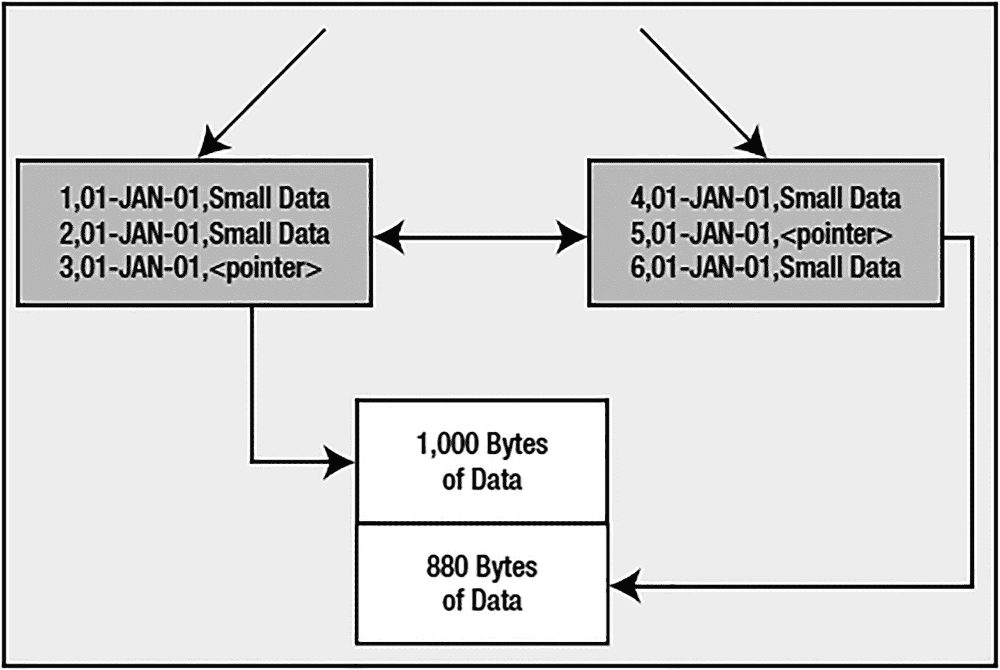
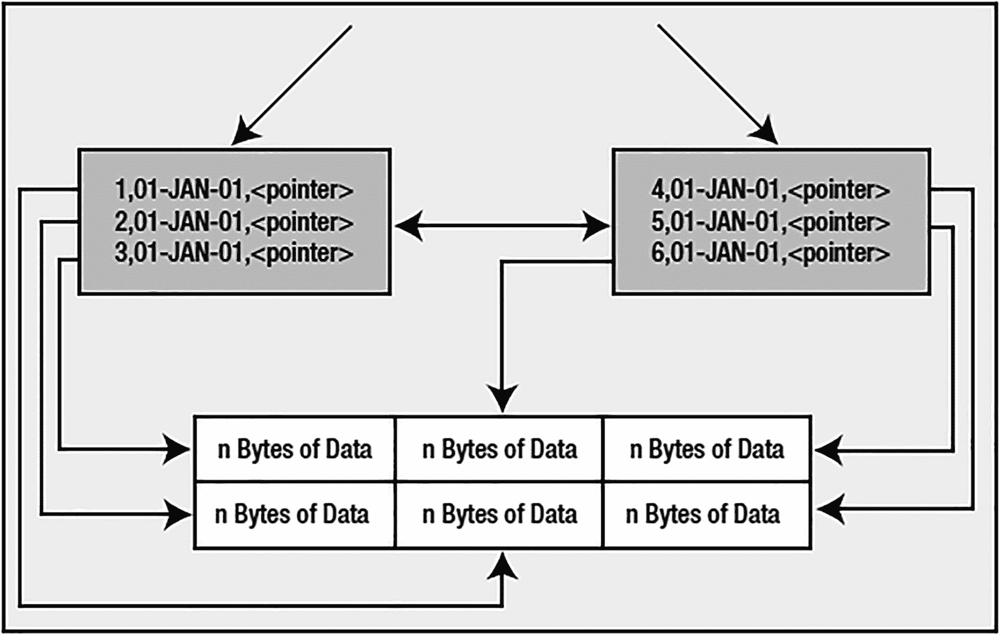
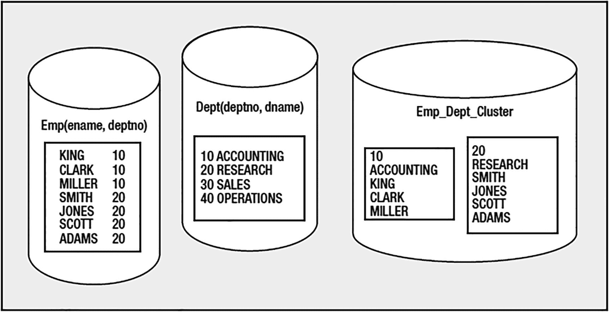
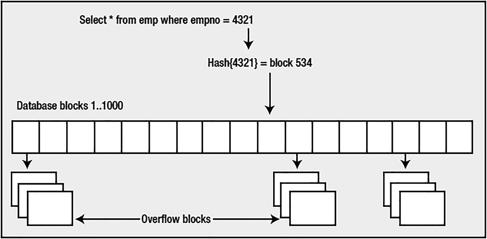

# 索引组织表的压缩与溢出段

| 系统，表，t1 | 系统，表，t2 | 系统，表，t3 | 系统，表，t4 |
| --- | --- | --- | --- |
| 系统，表，t5 | 系统，表，t6 | 系统，表，t7 | 系统，表，t8 |
| … | … | … | … |
| 系统，表，t100 | 系统，表，t101 | 系统，表，t102 | 系统，表，t103 |

也就是说，值 `SYS` 和 `TABLE` 只出现一次，然后存储第三列。通过这种方式，我们可以从每个索引块中获得比原本多得多的条目。这并不会降低并发性（在所有情况下我们仍然在行级别操作）或任何功能性。它*可能*会使用稍多的 CPU 算力，因为 Oracle 需要做更多的工作来重新组合键。另一方面，它可能显著减少 I/O，并允许更多数据缓存在缓冲区缓存中，因为每个块能容纳更多数据。这是一个相当不错的权衡。

让我们通过一个快速测试来演示节省效果，分别使用 `NOCOMPRESS`、`COMPRESS 1` 和 `COMPRESS 2` 执行前面的 `CREATE TABLE AS SELECT`。我们首先创建不带压缩的 IOT：

```
SQL> create table iot
( owner, object_type, object_name,
constraint iot_pk primary key(owner,object_type,object_name))
organization index
NOCOMPRESS
as  select distinct owner, object_type, object_name
from all_objects;
Table created.
```

现在我们可以测量使用的空间。我们将使用 `ANALYZE INDEX VALIDATE STRUCTURE` 命令来完成此操作。该命令会填充一个名为 `INDEX_STATS` 的动态性能视图，其中最多包含一行，记录最后一次执行 `ANALYZE` 命令的信息：

```
SQL> analyze index iot_pk validate structure;
Index analyzed.
SQL> select lf_blks, br_blks, used_space,
opt_cmpr_count, opt_cmpr_pctsave
from index_stats;
LF_BLKS    BR_BLKS USED_SPACE OPT_CMPR_COUNT OPT_CMPR_PCTSAVE
---------- ---------- ---------- -------------- ----------------
240          1    1726727              2               37
```

这显示我们的索引当前使用了 240 个叶块（数据所在的位置）和 1 个分支块（Oracle 用来导航索引结构以找到叶块的块）。使用的空间约为 1.7MB（1,726,727 字节）。另外两个名称奇怪的列试图告诉我们一些信息。`OPT_CMPR_COUNT`（最佳压缩计数）列想表达的是：“如果你将此索引设为 `COMPRESS 2`，你将获得最佳压缩效果。”`OPT_CMPR_PCTSAVE`（最佳压缩节省百分比）告诉我们，如果执行 `COMPRESS 2`，我们将节省大约三分之一的存储空间，索引将只消耗当前磁盘空间的三分之二。

> 注意
> 下一章“索引”将更详细地介绍索引结构。

为了验证这个理论，我们首先用 `COMPRESS 1` 重建 IOT：

`SQL> alter table iot move compress 1;`

```
Table altered.
SQL> analyze index iot_pk validate structure;
Index analyzed.
SQL> select lf_blks, br_blks, used_space,
opt_cmpr_count, opt_cmpr_pctsave
from index_stats;
LF_BLKS    BR_BLKS USED_SPACE OPT_CMPR_COUNT OPT_CMPR_PCTSAVE
---------- ---------- ---------- -------------- ----------------
213          1    1529506              2               28
```

如你所见，索引确实变小了：大约 1.5MB，叶块也更少了。但现在它提示：“你仍然可以再减少 28%”，因为我们还没有削减那么多。让我们用 `COMPRESS 2` 重建：

```
SQL> alter table iot move compress 2;
Table altered.
SQL> analyze index iot_pk validate structure;
Index analyzed.
SQL> select lf_blks, br_blks, used_space,
opt_cmpr_count, opt_cmpr_pctsave
from index_stats;
LF_BLKS    BR_BLKS USED_SPACE OPT_CMPR_COUNT OPT_CMPR_PCTSAVE
---------- ---------- ---------- -------------- ----------------
151          1    1086483              2                0
```

现在我们的大小显著减小，无论是叶块数量还是总使用空间，都减少了大约 1MB。如果我们回到原始数字：

```
SQL> select (1-.37)* 1726727 from dual;
(1-.37)*1726727
---------------
    1087838.01
```

我们可以看到 `OPT_CMPR_PCTSAVE` 基本完全准确。前面的例子指出了关于 IOT 的一个有趣事实。它们是表，但只是名义上的。它们的段确实是索引段。

我打算推迟讨论 `PCTTHRESHOLD` 选项，因为它与 IOT 的下两个选项相关：`OVERFLOW` 和 `INCLUDING`。如果我们查看接下来两个表 `T2` 和 `T3` 的完整 SQL，我们会看到以下内容（我使用了 `DBMS_METADATA` 例程来抑制存储子句，因为它们与示例无关）：

```
SQL> begin
  dbms_metadata.set_transform_param
  ( DBMS_METADATA.SESSION_TRANSFORM, 'STORAGE', false );
end;
/
PL/SQL procedure successfully completed.
SQL> select dbms_metadata.get_ddl( 'TABLE', 'T2' ) from dual;
DBMS_METADATA.GET_DDL('TABLE','T2')
--------------------------------------------------------------------------------
CREATE TABLE "EODA"."T2"
(    "X" NUMBER(*,0),
     "Y" VARCHAR2(25),
     "Z" DATE,
     PRIMARY KEY ("X") ENABLE
) ORGANIZATION INDEX NOCOMPRESS PCTFREE 10 INITRANS 2 MAXTRANS 255 LOGGING
TABLESPACE "USERS"
PCTTHRESHOLD 50 OVERFLOW
PCTFREE 10 PCTUSED 40 INITRANS 1 MAXTRANS 255 LOGGING
TABLESPACE "USERS"
SQL> select dbms_metadata.get_ddl( 'TABLE', 'T3' ) from dual;
DBMS_METADATA.GET_DDL('TABLE','T3')
--------------------------------------------------------------------------------
CREATE TABLE "EODA"."T3"
(    "X" NUMBER(*,0),
     "Y" VARCHAR2(25),
     "Z" DATE,
     PRIMARY KEY ("X") ENABLE
) ORGANIZATION INDEX NOCOMPRESS PCTFREE 10 INITRANS 2 MAXTRANS 255 LOGGING
TABLESPACE "USERS"
PCTTHRESHOLD 50 INCLUDING "Y" OVERFLOW
PCTFREE 10 PCTUSED 40 INITRANS 1 MAXTRANS 255 LOGGING
TABLESPACE "USERS"
```

所以，现在我们还剩下 `PCTTHRESHOLD`、`OVERFLOW` 和 `INCLUDING` 需要讨论。这三项是相互关联的，它们的目标是使索引叶块（保存实际索引数据的块）能够高效地存储数据。索引通常只针对列的子集。你会发现，索引块上能容纳的行条目数量通常比堆表块上多得多。索引依赖于每个块能容纳许多行的能力。否则，Oracle 将花费大量时间维护索引，因为每个 `INSERT` 或 `UPDATE` 都可能导致索引块分裂以容纳新数据。

`OVERFLOW` 子句允许你设置另一个段（使 IOT 成为多段对象，类似于拥有 `CLOB` 列），当 IOT 的行数据变得太大时，可以溢出到这个段上。

> 注意
> 组成主键的列不能溢出——它们必须直接存储在叶块上。

注意，`OVERFLOW` 将 `PCTUSED` 子句重新引入了 IOT。`PCTFREE` 和 `PCTUSED` 对于 `OVERFLOW` 段的含义与它们对堆组织表的含义相同。可以使用以下两种方式之一来指定使用溢出段的条件：

*   `PCTTHRESHOLD`：当行中的数据量超过块的这个百分比时，该行的尾部列将存储在溢出段中。所以，如果 `PCTTHRESHOLD` 是百分之十，且块大小是 8KB，那么任何长度超过大约 800 字节的行，其部分内容将被存储到其他地方，即索引块之外。

*   `INCLUDING`：行中直到并包括 `INCLUDING` 子句中指定列的所有列都存储在索引块上，其余列存储在溢出段中。

给定一个具有 2KB 块大小的以下表：

```
SQL> create table iot
(  x    int,
   y    date,
   z    varchar2(2000),
   constraint iot_pk primary key (x))
organization index
pctthreshold 10
overflow;
Table created.
```

图形上，它可能如图 10-6 所示。



图 10-6

带有溢出段的 IOT，使用了 PCTTHRESHOLD 子句


灰色方框代表索引条目，它们是更大索引结构的一部分（在第 11 章中，你会看到一个索引结构的更宏观视图）。简而言之，索引结构是一棵树，而叶块（数据实际存储的位置）在效果上组成了一个双向链表，以便于在找到我们想要在索引中开始的位置后，能够按顺序遍历节点。白色方框代表一个`OVERFLOW`（溢出）段。超过我们`PCTTHRESHOLD`设置的数据将存储在这里。Oracle 会从最后一列开始，反向查找（但不包括主键的最后一列），以确定哪些列需要存储在溢出段中。在此示例中，数字列`X`和日期列`Y`将始终能放入索引块。最后一列`Z`是变长的。当它小于大约 190 字节左右时（2KB 块的 10%大约是 200 字节；减去日期占用的 7 字节和数字占用的 3 到 5 字节），它将存储在索引块上。当它超过 190 字节时，Oracle 会将`Z`的数据存储在溢出段中，并设置一个指向它的指针（实际上是一个 rowid）。

另一个选项是使用`INCLUDING`子句。在这里，我们明确指定了哪些列希望存储在索引块上，哪些应该存储在溢出段中。给定如下的`CREATE TABLE`语句：

```
SQL> create table iot
(  x    int,
y    date,
z    varchar2(2000),
constraint iot_pk primary key (x))
organization index
including y
overflow;
Table created.
```

我们可以预期找到的内容如图 10-7 所示。



图 10-7

带有 OVERFLOW 段和 INCLUDING 子句的 IOT

在这种情况下，无论其中存储的数据大小如何，`Z`都将在溢出段中离线存储（所有在`INCLUDING`子句指定列之后的非主键列都将存储在溢出段中）。

那么，`PCTTHRESHOLD`、`INCLUDING`，或者两者的某种组合，哪个更好呢？这取决于你的需求。如果你的应用程序总是、或几乎总是使用表的前四列，而很少访问最后五列，那么使用`INCLUDING`是合适的。你可以包含到第四列，并让其他五列离线存储。在运行时，如果你需要它们，这些列将被检索，其方式与链接行的检索非常相似。Oracle 将读取行的头部，找到指向行其余部分的指针，然后读取它。另一方面，如果你不能确定是否几乎总是访问这些列而几乎从不访问那些列，那么你应该考虑一下`PCTTHRESHOLD`。一旦你确定了平均每个索引块希望存储多少行，设置`PCTTHRESHOLD`是容易的。假设你希望每个索引块存储 20 行。嗯，这意味着每行应该是二十分之一（百分之五）。你的`PCTTHRESHOLD`将是五，而保留在索引叶块上的每一行数据块所占用的空间不应超过该块的百分之五。

关于 IOT 最后要考虑的是索引。你可以在 IOT 本身上建立索引——有点像是在一个索引上再建一个索引。这些被称为*二级索引*。通常，一个索引包含它所指向行的物理地址，即 rowid。IOT 的二级索引无法做到这一点；它必须使用其他方式来定位行。这是因为 IOT 中的一行可能会频繁移动，而且它的移动方式与堆组织表中的行不同。IOT 中的一行，根据其主键值，预计位于索引结构中的某个位置；它的移动只会是因为索引本身的大小和形状发生了变化。（我们将在下一章中更多地讨论索引结构是如何维护的。）为了适应这一点，Oracle 引入了*逻辑 rowid*。这些逻辑 rowid 基于 IOT 的主键。它们还可能包含对该行当前位置的猜测，尽管这个猜测几乎总是错误的，因为过一段时间后，IOT 中的数据往往会移动。这个猜测是该行首次被放入二级索引结构时在 IOT 中的物理地址。如果 IOT 中的行移动到了另一个块，二级索引中的猜测就会过时。因此，IOT 上的索引比常规堆组织表上的索引效率略低。在常规表上，索引访问通常需要扫描索引结构的 I/O，然后是一次读取表数据的 I/O。对于 IOT，通常需要执行两次扫描：一次是二级结构，另一次是 IOT 本身。除此之外，IOT 上的索引提供了使用主键以外的列快速高效访问 IOT 中数据的途径。

## 索引组织表总结

在设置 IOT 时，最关键的部分是平衡好索引块上的数据与溢出段中的数据。使用不同的溢出条件对各种场景进行基准测试，看看它们将如何影响你的`INSERT`、`UPDATE`、`DELETE`和`SELECT`操作。如果你的结构是构建一次并频繁读取，那么尽可能多地将数据塞入索引块。如果你频繁修改结构，你将需要在所有数据都在索引块上（有利于检索）和频繁重组索引中的数据（不利于修改）之间取得某种平衡。你为堆表考虑的`FREELIST`问题同样适用于 IOT。`PCTFREE`和`PCTUSED`在 IOT 中扮演两个角色。`PCTFREE`对于 IOT 来说远不如对堆表重要，而`PCTUSED`通常不起作用。然而，在考虑`OVERFLOW`段时，`PCTFREE`和`PCTUSED`的解释与堆表相同；使用与堆表相同的逻辑为溢出段设置它们。


## 索引聚簇表

我发现人们通常对 Oracle 中“聚簇”的理解并不准确。很多人容易将聚簇与 SQL Server 或 Sybase 中的“聚集索引”混淆。它们并非同一概念。聚簇是一种将一组共享某些公共列的表存储在相同数据库块中，并将相关数据一起存储在同一块上的方式。SQL Server 中的聚集索引强制行根据索引键排序存储，类似于刚才描述的索引组织表（IOT）。使用聚簇时，单个数据块可能包含来自多个表的数据。从概念上讲，你是在“预连接”存储数据。它也可以用于单表，即按某个列分组存储数据。例如，部门 `10` 的所有员工都将存储在同一个块上（或者尽可能少的块上，如果无法全部容纳的话）。它并非存储已排序的数据——那是 IOT 的职责。它是按某个键将数据聚簇存储，但组织方式为堆表。因此，部门 `100` 可能紧挨着部门 `1`，而在物理磁盘上则与部门 `101` 和 `99` 相距甚远。

直观上，你可以参考图 10-8 所示。图像左侧使用的是常规表。`EMP` 表存储在其自己的段中。`DEPT` 表存储在其自己的段中。它们可能位于不同的文件和不同的表空间中，并且肯定位于不同的区中。在图像右侧，我们看到如果将这两个表聚簇在一起会发生什么。方框代表数据库块。现在值 `10` 被分离出来并存储一次。然后，聚簇中所有表对应部门 `10` 的所有数据都存储在该块中。如果部门 `10` 的所有数据无法容纳在一个块中，那么多余的数据将链接到原始块，类似于 IOT 的溢出块。



图 10-8 索引聚簇数据

那么，我们来看看如何创建聚簇对象。在对象中创建表的聚簇是直接明了的。对象的存储定义（`PCTFREE`、`PCTUSED`、`INITIAL` 等）与 `CLUSTER` 关联，而不是与各个表关联。这是合理的，因为聚簇中将有许多表，它们位于相同的块上。使用不同的 `PCTFREE` 值是没有意义的。因此，`CREATE CLUSTER` 语句看起来与 `CREATE TABLE` 语句类似，但列数很少（仅聚簇键列）：

```
$ sqlplus eoda/foo@PDB1
SQL> create cluster emp_dept_cluster
( deptno number(2) )
size 1024;
Cluster created.
```

这里，我们创建了一个 `索引聚簇`（另一种类型是 `哈希聚簇`，我们将在后面的“哈希聚簇表”一节中讨论）。该聚簇的聚簇列将是 `DEPTNO` 列。表中的列不必命名为 `DEPTNO`，但它们*必须*是 `NUMBER`(2) 以匹配此定义。在聚簇定义中，我们有一个 `SIZE 1024` 选项。这用于告诉 Oracle，我们预计每个聚簇键值大约关联 1024 字节的数据。Oracle 将使用此信息来计算每个块上可以容纳的聚簇键的*最大*数量。假设我们的块大小为 8KB，Oracle 最多会将七个聚簇键放入一个数据库块（但如果数据大于预期，数量可能会更少）。例如，部门 `10`、`20`、`30`、`40`、`50`、`60` 和 `70` 的数据将倾向于放入一个块，一旦我们插入部门 `80`，就会使用一个新块。这并不意味着数据是按排序方式存储的；它只是意味着如果按该顺序插入部门，它们自然倾向于被放在一起。如果我们以 `10`、`80`、`20`、`30`、`40`、`50`、`60`，然后 `70` 的顺序插入部门，最后一个部门（`70`）将倾向于位于新添加的块上。正如我们接下来将看到的，数据的大小和数据的插入顺序都会影响每个块上可以存储的键的数量。

因此，`SIZE` 参数控制每个块上的最大聚簇键数量。它是影响聚簇空间利用率的单一最大因素。如果设置的 size 过大，每个块上的键数就会非常少，我们将使用比需要更多的空间。如果设置的 size 过小，数据将过度链接，这违背了聚簇将所有数据存储在同一块上的初衷。它是聚簇最重要的参数。

接下来，我们需要在向聚簇中放入数据之前为其创建索引。我们现在就可以在聚簇中创建表，但我们打算同时创建和填充表，并且我们需要在有任何数据*之前*创建聚簇索引。聚簇索引的工作是获取一个聚簇键值，并返回包含该键的块的地址。实际上，它是一个主键，其中每个聚簇键值指向聚簇本身中的单个块。因此，当我们请求部门 `10` 的数据时，Oracle 将读取聚簇键，确定其块地址，然后读取数据。聚簇键索引创建如下：

```
SQL> create index emp_dept_cluster_idx  on cluster emp_dept_cluster;
Index created.
```

它可以拥有索引的所有常规存储参数，并且可以存储在另一个表空间中。它只是一个常规索引，因此可以创建在多个列上；它恰好是索引到聚簇，并且可以包含一个完全为 null 值的条目（有关为何这很有趣，请参见第 11 章）。注意，我们在此 `CREATE INDEX` 语句中*没有*指定列列表——这是从 `CLUSTER` 定义本身派生出来的。现在我们已准备好在聚簇中创建表了：

```
SQL> create table dept
( deptno number(2) primary key,
dname  varchar2(14),
loc    varchar2(13))
cluster emp_dept_cluster(deptno);
Table created.
SQL> create table emp
( empno    number primary key,
ename    varchar2(10),
job      varchar2(9),
mgr      number,
hiredate date,
sal      number,
comm     number,
deptno number(2) references dept(deptno))
cluster emp_dept_cluster(deptno);
Table created.
```


这里，与普通表唯一的区别在于我们使用了 `CLUSTER` 关键字，并告诉 Oracle 基础表中的哪一列将映射到聚簇本身的聚簇键。请记住，聚簇在这里是段；因此，这个表永远不会拥有诸如 `TABLESPACE`、`PCTFREE` 等段属性——它们是聚簇段的属性，而非我们刚刚创建的表的属性。我们现在可以用初始数据集来加载它们：

```markdown
SQL> insert into dept
( deptno, dname, loc )
select deptno+r, dname, loc
from scott.dept,
(select level r from dual connect by level < 10);
36 rows created.

SQL> insert into emp
(empno, ename, job, mgr, hiredate, sal, comm, deptno)
select rownum, ename, job, mgr, hiredate, sal, comm, deptno+r
from scott.emp,
(select level r from dual connect by level < 10);
126 rows created.
```

**注意**

我在这个例子中使用了一个 SQL 技巧来生成数据。我希望有超过七个部门，以演示 Oracle 会根据我的 `SIZE` 参数来限制每个块中的部门键数量。因此，我需要的数据量超过了 `SCOTT.DEPT` 中存在的四个部门行。我利用针对 `DUAL` 的“connect by level”技巧生成了九行数据，并将这九行与 `DEPT` 中的四行进行了笛卡尔连接，从而产生了 36 个唯一的行。我对 `EMP` 也使用了类似的技巧来为这些部门编造数据。

现在数据已经加载，让我们看看它在磁盘上的组织结构。我们将使用 `DBMS_ROWID` 包来窥探 rowid，查看数据存储在哪些块上。我们首先查看 `DEPT` 表，看看每个块有多少个 `DEPT` 行：

```markdown
SQL> select min(count(*)), max(count(*)), avg(count(*))
from dept
group by dbms_rowid.rowid_block_number(rowid);
MIN(COUNT(*)) MAX(COUNT(*)) AVG(COUNT(*))
------------- ------------- -------------
1             7             6
```

因此，尽管我们首先加载了 `DEPT`——并且 `DEPT` 行非常小（通常一个 8k 块可以容纳数百个）——但我们发现此表中一个块上的 `DEPT` 行最大数量仅为七。这与我们设置 `SIZE` 为 1024 时的预期相符。我们估计，在 8k 块大小下，每个聚簇键的组合 `EMP` 和 `DEPT` 记录占用 1024 字节数据，我们预计每个块上大约有七个唯一的聚簇键值，而这正是我们这里看到的。接下来，让我们一起查看 `EMP` 和 `DEPT` 表。我们将查看每个表的 rowid，并在通过 `DEPTNO` 连接后比较块号。如果块号相同，我们就知道 `EMP` 行和 `DEPT` 行一起存储在相同的物理数据库块上；如果不同，我们就知道它们没有在一起。在这个案例中，我们观察到所有数据都被完美地存储了。没有任何 `EMP` 表的记录存储在与其对应的 `DEPT` 记录不同的块上：

```markdown
SQL> select * from (
select dept_blk, emp_blk,
case when dept_blk <> emp_blk then '*' end flag,
deptno
from (
select dbms_rowid.rowid_block_number(dept.rowid) dept_blk,
dbms_rowid.rowid_block_number(emp.rowid) emp_blk,
dept.deptno
from emp, dept
where emp.deptno = dept.deptno
)
)
where flag = '*'
order by deptno;
no rows selected
```

这正是我们的目标——让 `EMP` 表中的每一行都与其对应的 `DEPT` 行存储在同一个块上。但如果我们估计错了会怎样？如果 1024 不够大怎么办？如果我们的某些部门数据接近 1024，而另一些超过了这个值怎么办？那么显然，数据无法容纳在同一个块上，我们就不得不将一些 `EMP` 记录放在与 `DEPT` 记录分开的块上。我们可以通过重置之前的示例来轻松地看到这一点（我从加载前创建好的表开始）。这次加载时，我们会将每条 `EMP` 记录插入八次，以增加每个部门的员工记录数量：

```markdown
SQL> insert into dept
( deptno, dname, loc )
select deptno+r, dname, loc
from scott.dept,
(select level r from dual connect by level < 10);
36 rows created.

SQL> insert into emp
(empno, ename, job, mgr, hiredate, sal, comm, deptno)
select rownum, ename, job, mgr, hiredate, sal, comm, deptno+r
from scott.emp,
(select level r from dual connect by level < 8);
1008 rows created.
```

现在让我们检查每个块的 `DEPT` 行数：

```markdown
SQL> select min(count(*)), max(count(*)), avg(count(*))
from dept
group by dbms_rowid.rowid_block_number(rowid);
MIN(COUNT(*)) MAX(COUNT(*)) AVG(COUNT(*))
------------- ------------- -------------
1             7             6
```

到目前为止，看起来与之前的例子一样，但让我们比较一下 `EMP` 记录所在的块与 `DEPT` 记录所在的块：

```markdown
SQL> select * from (
select dept_blk, emp_blk,
case when dept_blk <> emp_blk then '*' end flag,
deptno
from (
select dbms_rowid.rowid_block_number(dept.rowid) dept_blk,
dbms_rowid.rowid_block_number(emp.rowid) emp_blk,
dept.deptno
from emp, dept
where emp.deptno = dept.deptno
)
)
where flag = '*'
order by deptno;
DEPT_BLK    EMP_BLK F     DEPTNO
---------- ---------- - ----------
24845      22362 *         12
24845      22362 *         12
24845      22362 *         12
...
24844      22362 *         39
24844      22362 *         39
24844      22362 *         39
46 rows selected.
```

我们可以看到，882 行 `EMP` 数据中有 46 行所在的块，与其在 `DEPT` 表中对应的 `DEPTNO` 所在的块是分开且不同的。鉴于我们低估了聚簇的大小（`SIZE` 参数相对于我们的实际数据来说太小了），我们可以用聚簇 `SIZE` 为 1200 来重新创建它，然后会发现如下结果：

```markdown
SQL> select min(count(*)), max(count(*)), avg(count(*))
from dept
group by dbms_rowid.rowid_block_number(rowid);
MIN(COUNT(*)) MAX(COUNT(*)) AVG(COUNT(*))
------------- ------------- -------------
6             6             6

SQL> select * from (
select dept_blk, emp_blk,
case when dept_blk <> emp_blk then '*' end flag,
deptno
from (
select dbms_rowid.rowid_block_number(dept.rowid) dept_blk,
dbms_rowid.rowid_block_number(emp.rowid) emp_blk,
dept.deptno
from emp, dept
where emp.deptno = dept.deptno
)
)
where flag = '*'
order by deptno;
no rows selected
```

现在我们每个块只存储六个 `DEPTNO` 值，为所有 `EMP` 数据与其对应的 `DEPT` 记录存储在同一个块上留出了足够的空间。

这里有一个可以让你朋友们惊叹不已的小谜题。许多人错误地认为 rowid 唯一地标识了数据库中的一行，并且给定一个 rowid 就能说出该行来自哪个表。事实上，*你不能*。你能够也将会从聚簇中得到重复的 rowid。例如，执行完前面的代码后，你应该会发现

```markdown
SQL> select rowid from emp
intersect
select rowid from dept;
ROWID
----------------
AAAE+/AAEAAABErAAA
AAAE+/AAEAAABErAAB
...
AAAE+/AAGAAAFdvAAE
AAAE+/AAGAAAFdvAAF
36 rows selected.
```

分配给 `DEPT` 中每一行的 rowid 也同样被分配给了 `EMP` 中的行。那是因为需要一张表*和*行 `ID` 才能唯一地标识一行。`ROWID` 伪列仅在表内是唯一的。

我还发现很多人认为聚簇对象是一种深奥的对象，没人真正使用——每个人都只使用普通的表。事实上，你每次使用 Oracle 时都在使用聚簇。许多数据字典就存储在不同的聚簇中，例如，以 `SYS` 身份（在根容器中）运行以下命令：

```markdown
$ sqlplus / as sysdba
SQL> break on cluster_name
SQL> select cluster_name, table_name
from user_tables
where cluster_name is not null
order by 1;
```

`以下是输出的部分列表：`

```markdown
CLUSTER_NAME                   TABLE_NAME
------------------------------ ------------------------------
C_COBJ#                        CDEF$
                               CCOL$
C_FILE#_BLOCK#                 SEG$
                               UET$
C_MLOG#                        SLOG$
                               MLOG$
C_OBJ#                         LIBRARY$
                               ASSEMBLY$
                               ATTRCOL$
                               TYPE_MISC$
                               VIEWTRCOL$
                               OPQTYPE$
...
```


如你所见，大部分与对象相关的数据都存储在一个单一的簇（即 `C_OBJ#` 簇）中：17 个表共享相同的数据块。其中存储的主要是与列相关的信息，因此关于一个表或索引的所有列集合的信息都物理上存储在同一个块上。这很合理，因为当 Oracle 解析一个查询时，它希望访问被引用表中所有列的数据。如果这些数据分散在各处，那么将它们整合起来就需要一些时间。在这里，数据通常位于一个单一的块上，随时可用。

什么时候应该使用簇？或许描述*不*使用簇的情况更容易：

*   如果你预计簇中的表将被频繁修改：你必须意识到索引簇会对 DML 性能产生某些负面影响，特别是 `INSERT` 语句。管理簇中的数据需要更多工作。数据必须被仔细地存放，因此存放数据（即插入数据）所需的时间更长。
*   如果你需要对簇中的表执行全表扫描：除了扫描单个表的数据，你可能还需要扫描许多表的数据。需要扫描的数据量更大，因此全表扫描将花费更长时间。
*   如果你需要对表进行分区：簇中的表不能被分区，簇本身也不能被分区。
*   如果你认为会频繁需要 `TRUNCATE` 并加载表：簇中的表不能被截断。这很明显——因为簇在同一个块上存储了多个表，你必须手动删除簇表中的行。

因此，如果你的数据主要是读取的（这*不*意味着“永不写入”；修改簇表是完全可以的），并且通过索引（无论是簇键索引还是你在簇表上建立的其他索引）读取，并且经常需要将这些信息连接在一起，那么簇是合适的。寻找那些在逻辑上相关并且总是一起使用的表，就像设计 Oracle 数据字典的人将所有与列相关的信息聚集在一起那样。

## 索引聚簇表总结

聚簇表使你能够物理地预连接数据。你使用簇将来自多个表的相关数据存储在同一个数据库块上。簇有助于那些总是需要连接数据或访问相关数据集（例如，部门 `10` 的所有人）的读取密集型操作。聚簇表减少了 Oracle 必须缓存的块数量。Oracle 不会为同一部门的十个员工保留十个块，而是将它们放在一个块中，从而提高了缓冲区缓存的效率。另一方面，除非你能正确计算 `SIZE` 参数的设置，否则簇在空间利用上可能效率低下，并且往往会减慢 DML 密集型操作。

## 哈希聚簇表

哈希聚簇表在概念上与刚才描述的索引聚簇表非常相似，只有一个主要区别：簇键索引被一个哈希函数所取代。表中的数据本身就是索引；没有物理的索引。Oracle 会获取一行的键值，使用内部函数或你提供的函数对其进行哈希计算，并利用这个结果来确定数据在磁盘上的位置。然而，使用哈希算法来定位数据的一个副作用是，如果不给表添加传统索引，就无法对哈希簇中的表进行范围扫描。在索引簇中，查询

```sql
select * from emp where deptno between 10 and 20;
```

将能够利用簇键索引来找到这些行。在哈希簇中，除非你为 `DEPTNO` 列创建了索引，否则这个查询将导致全表扫描。只有精确的相等搜索（包括 `IN` 列表和子查询）可以在不使用支持范围扫描的索引的情况下，在哈希键上进行。

在理想情况下，如果哈希键值分布良好，并且哈希函数能将它们均匀地分布在分配给哈希簇的所有块上，我们可以直接通过一次 I/O 从查询定位到数据。在现实世界中，最终会有超过块容量的哈希键值映射到相同的数据库块地址。这将导致 Oracle 不得不将块链接在一起形成一个链表，以容纳所有哈希到该块的行。现在，当我们需要检索匹配我们哈希键的行时，可能需要访问多个块。

就像编程语言中的哈希表一样，数据库中的哈希表也有固定的大小。创建表时，你必须确定表将拥有的哈希键数量，并且这个数量是永久固定的。但这并不限制你可以放入其中的行数。

在下图中，我们可以看到一个在其中创建了表 `EMP` 的哈希簇的图形化表示。当客户端发出一个在谓词中使用哈希簇键的查询时，Oracle 将应用哈希函数来确定数据应该在哪个块中。然后，它将读取那个块来查找数据。如果发生了很多冲突，或者 `CREATE CLUSTER` 的 `SIZE` 参数被低估了，Oracle 将会分配从原始块链接出去的溢出块。



创建哈希簇时，你将使用与创建索引簇相同的 `CREATE CLUSTER` 语句，但选项不同。你只需为其添加一个 `HASHKEYS` 选项来指定哈希表的大小。Oracle 会将你的 `HASHKEYS` 值向上取整到最近的质数；哈希键的数量总是一个质数。然后，Oracle 会根据 `SIZE` 参数乘以调整后的 `HASHKEYS` 值来计算一个值。它将为簇分配至少这么多字节的空间。这与之前的索引簇有很大不同，索引簇是按需动态分配空间的。哈希簇会预分配足够的空间来容纳 (`HASHKEYS`/`trunc(blocksize/SIZE)`) 字节的数据。例如，如果你将 `SIZE` 设置为 1500 字节，并且块大小为 4KB，Oracle 将预期每个块存储两个键。如果你计划拥有 1000 个 `HASHKEYS`，Oracle 将分配 500 个块。


有趣的是，与计算机语言中的常规哈希表不同，哈希冲突的存在是可以接受的——实际上，在许多情况下这是可取的。如果沿用之前相同的`DEPT`/`EMP`示例，你可以基于`DEPTNO`列建立一个哈希簇。显然，许多行将哈希到同一个值，而这正是你所期望的（它们具有相同的`DEPTNO`）。在某种程度上，这正是簇的意义所在：将相似的数据聚集在一起。这就是为什么 Oracle 要求你指定`HASHKEY`（你预期随时间推移会有多少个部门编号）和`SIZE`（与每个部门编号相关联的数据大小）。它会分配一个哈希表，包含`HASHKEY`个部门，每个部门`SIZE`字节。你真正需要避免的是非预期的哈希冲突。显然，如果你将哈希表的大小设置为 1000（实际上是 1009，因为哈希表大小总是质数，Oracle 会为你向上取整），而你在表中放入 1010 个部门，那么至少会发生一次冲突（两个不同的部门哈希到同一个值）。应避免非预期的哈希冲突，因为它们会增加开销并提高发生块链接的概率。

## 1. 查看哈希簇的空间占用

为了查看哈希簇占用何种空间，我们将使用一个小型实用工具存储过程`SHOW_SPACE`（关于此过程的详细信息，请参见本书开头的“设置你的环境”部分），本章和下一章都会用到它。该例程仅使用`DBMS_SPACE`提供的包来获取数据库中段所用存储的详细信息。

现在，如果我们执行一条`CREATE CLUSTER`语句，例如下面这条，就可以看到它分配的存储空间：

```sql
$ sqlplus eoda/foo@PDB1
SQL> create cluster hash_cluster
( hash_key number )
hashkeys 1000
size 8192;
Cluster created.
SQL> set serverout on
SQL> exec show_space( 'HASH_CLUSTER', user, 'CLUSTER' )
Unformatted Blocks .....................               0
FS1 Blocks (0-25)  .....................               0
FS2 Blocks (25-50) .....................               0
FS3 Blocks (50-75) .....................               0
FS4 Blocks (75-100).....................               0
Full Blocks        .....................           1,009
Total Blocks............................           1,152
Total Bytes.............................       9,437,184
Total MBytes............................               9
Unused Blocks...........................             117
Unused Bytes............................         958,464
Last Used Ext FileId....................              12
Last Used Ext BlockId...................         225,536
Last Used Block.........................              11
PL/SQL procedure successfully completed.
```

我们可以看到，分配给该表的总块数为 1152。其中 117 个块是未使用的（空闲）。有一个块用于表开销，以管理区。因此，有 1034 个块位于该对象的高水位线之下，并由该簇使用。

这个例子指出了使用哈希簇时需要注意的一个问题。通常，如果我们创建一个空表，该表高水位线下的块数为零。如果我们对它进行全表扫描，它会到达高水位线并停止。而对于哈希簇，表一开始就会很大，并且创建时间更长，因为 Oracle 必须初始化每个块——这个操作通常是在向表中添加数据时才进行的。它们的数据有可能出现在第一个块和最后一个块中，而中间什么也没有。全表扫描一个几乎为空的哈希簇所需的时间，将与全表扫描一个已满的哈希簇一样长。这不一定是坏事；我们构建哈希簇是为了通过哈希键查找来非常快速地访问数据。我们构建它并不是为了频繁地进行全表扫描。

## 2. 在哈希簇中创建表

现在我们可以像使用索引簇那样，开始将表放入哈希簇中：

```sql
SQL> create table hashed_table
( x number, data1 varchar2(4000), data2 varchar2(4000) )
cluster hash_cluster(x);
Table created.
```

## 3. 性能对比测试

为了看看哈希簇能带来什么不同，我设置了一个小测试。我创建了一个哈希簇，在其中加载了一些数据，将这些数据复制到一个带有常规索引的普通表中，然后对每个表进行了随机读取（在每个表上执行相同的“随机”读取）。使用 runstats、`SQL_TRACE`和`TKPROF`，我能够确定各自的特性。以下是我执行的设置，随后是分析：

```sql
SQL> create cluster hash_cluster
( hash_key number )
hashkeys 75000
size 150;
Cluster created.
SQL> create table t_hashed cluster hash_cluster(object_id) as
select * from all_objects;
Table created.
SQL> alter table t_hashed add constraint t_hashed_pk primary key(object_id);
Table altered.
SQL> begin
dbms_stats.gather_table_stats( user, 'T_HASHED' );
end;
/
PL/SQL procedure successfully completed.
```

我创建哈希簇时指定`SIZE`为 150 字节。这是因为，我确定我表中一行的平均大小约为 100 字节，但会根据数据上下波动，许多行的大小在 150 字节左右。然后，我在该簇中创建并填充了一个表，作为`ALL_OBJECTS`的副本。

接下来，我创建了该表的常规克隆：

```sql
SQL> create table t_heap as select *  from t_hashed;
Table created.
SQL> alter table t_heap add constraint t_heap_pk primary key(object_id);
Table altered.
SQL> begin
dbms_stats.gather_table_stats( user, 'T_HEAP' );
end;
/
PL/SQL procedure successfully completed.
```

现在，我只需要一些随机数据来从各个表中选取行。为了实现这一点，我简单地将所有`OBJECT_ID`选入一个数组，并让它们随机排序，以便以分散的方式访问表的各个部分。我使用了一个 PL/SQL 包来定义和声明该数组，并用一小段 PL/SQL 代码来初始化数组，填充它：

```sql
SQL> create or replace package state_pkg
as
type array is table of t_hashed.object_id%type;
g_data array;
end;
/
Package created.
SQL> begin
select object_id bulk collect into state_pkg.g_data
from t_hashed
order by dbms_random.random;
end;
/
PL/SQL procedure successfully completed.
```

为了查看每个表完成的工作量，我使用了以下代码块（如果你将代码中出现的`HEAP`替换为`HASHED`，就得到了另一个需要测试的代码块）：

```sql
SQL> declare
l_rec t_heap%rowtype;
begin
for i in 1 .. state_pkg.g_data.count
loop
select * into l_rec from t_heap
where object_id = state_pkg.g_data(i);
end loop;
end;
/
PL/SQL procedure successfully completed.
```

接下来，我运行了前面的代码块三次（同时也运行了将`HEAP`替换为`HASHED`的代码块副本）。第一次运行是为了预热系统，消除任何硬解析的影响。第二次运行代码块时，我使用了 runstats 来查看两者之间的实质性差异：首先运行哈希簇实现，然后运行堆表实现。第三次运行代码块时，我启用了`SQL_TRACE`，以便查看`TKPROF`报告。runstats 运行报告了以下结果：


