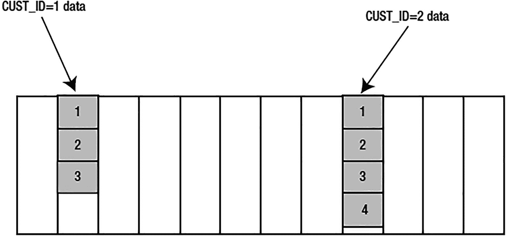

# SQL 哈希集群与索引表的性能对比分析

首先，我们运行了性能对比测试，结果如下：

```
SQL> set serverout on
SQL> exec runstats_pkg.rs_stop(10000);
Run1 ran in 122 cpu hsecs
Run2 ran in 171 cpu hsecs
run 1 ran in 71.35% of the time
Name                                    Run1            Run2           Diff
STAT...redo synch time (usec)              0           1,162          1,162
LATCH.simulator hash latch             4,550           7,104          2,554
STAT...file io wait time               2,939               0         -2,939
STAT...undo change vector size        14,088          21,648          7,560
STAT...Cached Commit SCN refer        30,001               0        -30,001
STAT...redo size                      22,308          53,984         31,676
STAT...physical read bytes            57,344               0        -57,344
STAT...physical read total byt        57,344               0        -57,344
STAT...cell physical IO interc        57,344               0        -57,344
LATCH.cache buffers chains           145,688         203,682         57,994
STAT...table fetch by rowid               29          67,326         67,297
STAT...cluster key scans              67,307               1        -67,306
STAT...rows fetched via callba             7          67,314         67,307
STAT...index fetch by key                  8          67,345         67,337
STAT...cluster key scan block         72,255               1        -72,254
STAT...consistent gets pin (fa        72,347              49        -72,298
STAT...no work - consistent re        72,324              23        -72,301
STAT...consistent gets pin            72,353              49        -72,304
STAT...consistent gets from ca        72,423         202,036        129,613
STAT...consistent gets                72,423         202,036        129,613
STAT...buffer is not pinned co        72,361         201,999        129,638
STAT...session logical reads          72,658         202,415        129,757
STAT...session pga memory            196,608               0       -196,608
STAT...consistent gets examina            70         201,987        201,917
STAT...consistent gets examina            70         201,987        201,917
STAT...temp space allocated (b     1,048,576               0     -1,048,576
STAT...logical read bytes from   595,214,336   1,658,183,680  1,062,969,344
Run1 latches total versus runs -- difference and pct
Run1               Run2              Diff        Pct
150,966           212,557            61,591     71.02%
PL/SQL procedure successfully completed.
```

现在，这两个模拟在 CPU 时钟时间上运行得差不多。然而，需要注意的重要差异是 `cache buffers chains` latches 的大幅减少。第一种实现（哈希）使用的 latches 显著更少，这意味着哈希实现在读取密集型环境中应该具有更好的可扩展性，因为它需要更少的、需要某种级别序列化的资源。这完全是因为哈希实现所需的 I/O 比 `HEAP` 表显著减少——你可以看到报告中的 `consistent gets` 统计数据证实了这一点。`TKPROF` 更清晰地显示了这一点：

## TKPROF 输出对比

```
SELECT * FROM T_HASHED WHERE OBJECT_ID = :B1
call     count    cpu   elapsed     disk    query    current        rows
------- ------  ----- --------- -------- -------- ----------  ----------
Parse        1   0.00      0.00        0        0          0           0
Execute  72105   0.75      0.75        0        2          0           0
Fetch    72105   0.74      0.71        0    72105          0       72105
------- ------  ----- --------- -------- ---------- ----------  --------
total   144211   1.50      1.47        0    72107          0       72105
...
Rows (1st) Rows (avg) Rows (max)  Row Source Operation
---------- ---------- ----------  -----------------------------------------
1          1          1  TABLE ACCESS HASH T_HASHED (cr=1 pr=0 pw=0 time=19 us)
***************************************************************************
SELECT * FROM T_HEAP WHERE OBJECT_ID = :B1
call     count    cpu   elapsed     disk      query    current        rows
------- ------  ----- --------- -------- ---------- ----------  ----------
Parse        1   0.00      0.00        0          0          0           0
Execute  72105   0.81      0.81        0          0          0           0
Fetch    72105   0.75      0.74        0     216315          0       72105
------- ------  ----- ---------- ------- ---------- ----------  ----------
total   144211   1.56      1.55        0     216315          0       72105
...
Rows (1st) Rows (avg) Rows (max)  Row Source Operation
---------- ---------- ----------  -----------------------------------------
1          1          1  TABLE ACCESS BY INDEX ROWID T_HEAP (cr=3 pr=0 pw=0 ...
1          1          1  INDEX UNIQUE SCAN T_HEAP_PK (cr=2 pr=0 pw=0 time=14...
```

## 原理分析

`HASHED` 实现简单地将查询传入的 `OBJECT_ID` 转换为要读取的 `FILE`/`BLOCK` 并直接读取——没有索引。而 `HEAP` 表则必须对每一行进行两次索引 I/O。`TKPROF Row Source Operation` 行中的 `cr=2` 精确地显示了对索引执行了多少次一致读。每次我查找 `OBJECT_ID = :B1` 时，Oracle 都必须获取索引的根块，然后找到包含该行位置的叶块。接着，我必须获取叶块信息（其中包含该行的 `ROWID`）并访问表中的那一行，进行第三次 I/O。`HEAP` 表执行的 I/O 是 `HASHED` 实现的三倍。

## 关键结论

这里的要点如下：

*   哈希集群做的 I/O 显著更少（`query` 列）。这正是我们所预期的。查询只是获取随机的 `OBJECT_ID`，对它们执行哈希运算，然后直接定位到数据块。哈希集群至少需要做一次 I/O 来获取数据。而带有索引的传统表则必须执行索引扫描，然后通过 `rowid` 访问表才能得到相同的答案。在这种情况下，索引表至少需要做三次 I/O 才能获取数据。

*   尽管哈希集群查询访问 `buffer cache` 的次数只有索引表的三分之一，但其消耗的 CPU 时间在本质上是一样的。这一点也可以预见。执行哈希运算是非常消耗 CPU 的，而执行索引查找则是 I/O 密集型的。这是一种权衡。然而，随着用户数量的增加，我们预计哈希集群查询会表现出更好的可扩展性，因为它需要排队访问 `buffer cache` 的频率更低。


最后一点是至关重要的。在计算机工作中，一切关乎资源及其利用。如果我们遇到 **I/O 受限** 的情况，并执行大量键控读取的查询（正如我刚才所做的），那么哈希集群可能会提升性能。如果我们已经 **CPU 受限**，那么哈希集群反而可能降低性能，因为哈希计算需要更多的 CPU 算力。然而，如果我们消耗的额外 CPU 是由于在高速缓存缓冲区链的闩锁上自旋导致的，那么哈希集群则能显著减少所需的 CPU 资源。这就是为什么经验法则在真实系统中行不通的主要原因之一：对你有效的方法，在类似但不尽相同的条件下，可能对他人并不适用。

## 单表哈希集群

有一种特殊的哈希集群称为 `单表哈希集群`。这是对我们已经了解的一般哈希集群的优化版本。它一次只支持在集群中包含一个表（在单表哈希集群中创建另一个表之前，你必须先 `DROP` 掉现有的表）。此外，如果哈希键与数据行之间存在一对一的映射关系，那么访问行的速度也会稍快一些。这些哈希集群专为那些你想通过主键访问一个表，且不关心将其他表与之集群的场景而设计。如果你需要通过 `EMPNO` 快速访问员工记录，可能就需要使用单表哈希集群。我也在单表哈希集群上进行了前面的测试，发现其性能甚至比普通的哈希集群更好。你甚至可以在此示例的基础上更进一步，利用 Oracle 允许你编写自己的专用哈希函数（而非使用 Oracle 提供的默认函数）这一特性。你仅限使用表中的可用列，并且在编写这些哈希函数时只能使用 Oracle 内置函数（例如，不能使用 PL/SQL 代码）。通过利用示例中 `OBJECT_ID` 是介于 1 到 75,000 之间的数字这一事实，我让我的哈希函数简单地就是 `OBJECT_ID` 列本身。这样，我可以保证永远不会发生哈希冲突。综合所有这些，我将通过以下方式创建一个使用我自己哈希函数的单表哈希集群：

### 创建集群

```sql
SQL> create cluster hash_cluster
( hash_key number(10) )
hashkeys 75000
size 150
single table
hash is HASH_KEY;
Cluster created.
```

我只需添加了关键字 `SINGLE TABLE` 将其指定为单表哈希集群。在此例中，我的 `HASH IS` 子句使用了 `HASH_KEY` 集群键。这是一个 SQL 函数，所以如果我愿意，我本可以使用 `trunc(mod(hash_key/324+278,555)/abs(hash_key+1))`（并非说这是一个好的哈希函数——它只是为了演示我们可以在此处使用复杂函数）。我使用了 `NUMBER(10)` 而不仅仅是 number。因为哈希值必须是整数，所以它不能有任何小数部分。然后，我在该集群中创建表以构建哈希化的表：

### 创建哈希表

```sql
SQL> create table t_hashed
cluster hash_cluster(object_id)
as
select OWNER, OBJECT_NAME, SUBOBJECT_NAME,
cast( OBJECT_ID as number(10) ) object_id,
DATA_OBJECT_ID, OBJECT_TYPE, CREATED,
LAST_DDL_TIME, TIMESTAMP, STATUS, TEMPORARY,
GENERATED, SECONDARY
from all_objects;
Table created.
```

注意使用了 `CAST` 内置函数来使 `OBJECT_ID` 的数据类型符合要求。我像之前一样运行了测试（每个代码块运行三次），这次 `runstats` 的输出结果持续显示出更积极的结果：

### Runstats 输出对比

```
Run1 在 99 个 CPU 百分秒内完成
Run2 在 132 个 CPU 百分秒内完成
运行 1 的耗时是运行 2 的 75%
名称                                    运行 1         运行 2          差异
STAT...通过回调获取的行数              55,609        67,314        11,705
STAT...集群键扫描块                     12,558             1       -12,557
STAT...一致性获取（固定）               12,587            29       -12,558
STAT...一致性获取（固定，快速）         12,587            28       -12,559
STAT...重做日志大小                     12,468        30,528        18,060
STAT...缓存的提交 SCN 引用             55,600             0       -55,600
STAT...通过 ROWID 获取表数据                9        67,314        67,305
STAT...集群键扫描                       67,308             1       -67,307
STAT...通过键获取索引数据                 10        67,332        67,322
LATCH.高速缓存缓冲区链                  81,539       203,183       121,644
STAT...缓冲区未被固定计数               68,176       201,953       133,777
STAT...从缓存中一致性获取               68,217       202,000       133,783
STAT...一致性获取                       68,217       202,000       133,783
STAT...会话逻辑读取                     68,407       202,270       133,863
STAT...一致性获取（检查）               55,630       201,971       146,341
STAT...一致性获取（检查，快速）         55,630       201,971       146,341
STAT...会话 PGA 内存                    262,144             0      -262,144
STAT...临时空间分配（字节）          1,048,576             0    -1,048,576
STAT...逻辑读取字节数            560,390,144 1,656,995,840 1,096,605,696
运行 1 的闩锁总数与运行对比 -- 差异及百分比
运行 1             运行 2           差异        百分比
86,525          214,193          127,668      40.40%
PL/SQL 过程已成功完成。
```

这个单表哈希集群在处理时甚至需要更少地去闩锁访问缓冲区缓存（它可以更早地停止查找数据，并且拥有更多信息）。因此，`TKPROF` 报告此次显示了 CPU 利用率的显著下降：

### TKPROF 报告对比

```sql
SELECT * FROM T_HASHED WHERE OBJECT_ID = :B1

调用        次数    CPU 耗时    耗时     �盘块      查询      当前        行数
------- ------  ----- --------- -------- ---------- ----------  ----------
解析        1     0.00      0.00        0          0          0           0
执行    72105     0.70      0.70        0          2          0           0
获取    72105     0.63      0.64        0      82548          0       72105
------- ------  ----- --------- -------- ---------- ----------  ----------
总计   144211     1.33      1.35        0      82550          0       72105

...

行数(首次) 行数(平均) 行数(最大)  行数据源操作
---------- ---------- ----------  -----------------------------------------
     1          1          1  表访问 HASH T_HASHED (cr=1 pr=0 pw=0 time=25 us)
***************************************************************************
SELECT * FROM T_HEAP WHERE OBJECT_ID = :B1

调用        次数    CPU 耗时    耗时     盘块      查询      当前        行数
------- ------  ------ --------- ------- ---------- ----------  ----------
解析        1      0.00      0.00       0          0          0           0
执行    72105      0.87      0.84       0          0          0           0
获取    72105      0.70      0.71       0     216315          0       72105
------- ------  ------ --------- ------- ---------- ----------  ----------
总计   144211      1.58      1.55       0     216315          0       72105

...

行数(首次) 行数(平均) 行数(最大)  行数据源操作
---------- ---------- ----------  -----------------------------------------
     1          1          1  表访问 BY INDEX ROWID T_HEAP (cr=3 pr=0 pw=0 time=22...
     1          1          1    索引唯一扫描 T_HEAP_PK (cr=2 pr=0 pw=0 ...
```


### 哈希聚簇表总结

以上就是哈希聚簇的核心要点。哈希聚簇在概念上与索引聚簇相似，但不使用聚簇索引。`数据本身就是索引`。聚簇键经过哈希计算得到一个块地址，数据就预期存放在那里。关于哈希聚簇，需要理解的重要事项如下：

*   哈希聚簇从一开始就分配空间。Oracle 会根据你的 `HASHKEYS/trunc(blocksize/SIZE)` 计算结果，立即分配并格式化该空间。一旦第一个表被放入该聚簇，任何全表扫描都将访问每个已分配的块。在这方面，它与其他所有表都不同。

*   哈希聚簇中的 `HASHKEY` 数量是固定大小的。不重建聚簇就无法更改哈希表的大小。这绝不会限制你可以存储在此聚簇中的数据量；它只限制了可以为该聚簇生成的唯一哈希键的数量。如果此值设置过低，可能会因意外的哈希冲突而影响性能。

*   无法在聚簇键上进行范围扫描。像 `WHERE cluster_key BETWEEN 50 AND 60` 这样的谓词无法使用哈希算法。在 `50` 和 `60` 之间有无数个可能的值，服务器必须生成所有这些值，对每个值进行哈希计算并检查是否存在数据。这是不可能的。如果你在聚簇键上使用范围查询且未使用常规索引对其进行索引，则将对该聚簇进行全表扫描。

哈希聚簇适用于以下情况：

*   你相当准确地知道表在其生命周期内将有多少行，或者你有一个合理的上限。正确设置 `HASHKEYS` 和 `SIZE` 参数的大小对于避免重建至关重要。

*   相对于检索而言，DML（特别是插入）操作较轻。这意味着你必须在优化数据检索和创建新数据之间取得平衡。“轻量插入”可能对某些人来说是单位时间内 10 万条，而对另一些人是 100 条——这完全取决于他们的数据检索模式。更新不会引入显著开销，除非你更新了 `HASHKEY`（这会导致行迁移，因此不是一个好主意）。

*   你通过 `HASHKEY` 值持续访问数据。例如，假设你有一个零件表，并且这些零件是通过零件号访问的。查找表特别适合使用哈希聚簇。

## 有序哈希聚簇表

有序哈希聚簇结合了刚才描述的哈希聚簇的特性和索引组织表（IOT）的特性。当你持续使用类似于以下的查询检索数据时，它们最为适用：

```
Select *
From t
Where KEY=:x
Order by SORTED_COLUMN
```

也就是说，你通过某个键检索数据，并且需要这些数据按照另一列进行排序。使用有序哈希聚簇，Oracle 完全无需执行排序操作即可返回数据。它通过在插入时按物理顺序——按键——存储数据来实现这一点。假设你有一个客户订单表：

```
$ sqlplus eoda/foo@PDB1
SQL> select cust_id, order_dt, order_number
from cust_orders
order by cust_id, order_dt;
CUST_ID ORDER_DT                     ORDER_NUMBER
------- ---------------------------- ------------
1 31-MAR-21 09.13.57.000000 PM        21453
11-APR-21 08.30.45.000000 AM        21454
28-APR-21 06.21.09.000000 AM        21455
2 08-APR-21 03.42.45.000000 AM        21456
19-APR-21 08.59.33.000000 AM        21457
27-APR-21 06.35.34.000000 AM        21458
30-APR-21 01.47.34.000000 AM        21459
7 rows selected.
```

该表存储在一个有序哈希聚簇中，其中 `HASH` 键是 `CUST_ID`，用于排序的字段是 `ORDER_DT`。图示可能如图 10-10 所示，其中 1、2、3、4… 表示存储在每个块上已排序的记录。



图 10-10

有序哈希聚簇示意图

创建有序哈希聚簇与其他聚簇大致相同。要设置一个能够存储上述数据的有序哈希聚簇，我们可以使用以下语句：

```
SQL> CREATE CLUSTER shc
(
cust_id     NUMBER,
order_dt    timestamp SORT
)
HASHKEYS 10000
HASH IS cust_id
SIZE  8192;
Cluster created.
```

我们在这里引入了一个新关键字：`SORT`。在创建聚簇时，我们指定了 `HASH IS CUST_ID`，并添加了一个类型为 `timestamp` 的 `ORDER_DT` 列，并带有 `SORT` 关键字。这意味着数据将通过 `CUST_ID`（即 `CUST_ID=:x`）定位，并按物理顺序按 `ORDER_DT` 排序检索。从技术上讲，它确实意味着我们将存储一些通过 `NUMBER` 列检索并按 `TIMESTAMP` 列排序的数据。这里的列名并不关键，就像在 B*Tree 或 `HASH` 聚簇中一样，但按照惯例，我们根据它们所代表的意义来命名。

我们的 `CUST_ORDERS` 表的 `CREATE TABLE` 语句如下：

```
SQL> CREATE TABLE cust_orders
(  cust_id       number,
order_dt      timestamp SORT,
order_number  number,
username      varchar2(30),
ship_addr     number,
bill_addr     number,
invoice_num   number)
CLUSTER shc ( cust_id, order_dt );
Table created.
```

我们将此表的 `CUST_ID` 列映射到有序哈希聚簇的哈希键，将 `ORDER_DT` 列映射到 `SORT` 列。我们可以在 SQL*Plus 中使用 AUTOTRACE 观察到，当访问有序哈希聚簇时，我们预期的正常排序操作消失了：

```
SQL> set autotrace traceonly explain
SQL> variable x number
SQL> select cust_id, order_dt, order_number
from cust_orders
where cust_id = :x
order by order_dt;

| Id | Operation         | Name        | Rows | Bytes | Cost (%CPU)|     Time |

|  0 | SELECT STATEMENT  |             |    1 |    39 |    1    (0)| 00:00:01 |
|* 1 | TABLE ACCESS HASH | CUST_ORDERS |    1 |    39 |    1    (0)| 00:00:01 |

SQL> select job, hiredate, empno
from scott.emp
where job = 'CLERK'
order by hiredate;

| Id | Operation                           | Name    | Rows | Bytes | Cost (%CPU)| Time     |
```


|  0 | SELECT 语句                         |         |    4 |   112 |    2    (0)| 00:00:01 |
|  1 | SORT ORDER BY 排序                 |         |    4 |   112 |    2    (0)| 00:00:01 |
|  2 | TABLE ACCESS BY INDEX ROWID BATCHED 通过索引 ROWID 批处理访问表 | EMP     |    4 |   112 |    2    (0)| 00:00:01 |
|* 3 | INDEX RANGE SCAN 索引范围扫描       | JOB_IDX |    4 |       |    1    (0)| 00:00:01 |

```sql
SQL> set autotrace off
```

我添加了针对普通`SCOTT.EMP`表的查询（为此次演示对`JOB`列进行了索引），以便与我们通常预期看到的情况进行对比：`SCOTT.EMP`的查询计划与排序哈希聚簇在我们要以 FIFO 模式（如队列）访问数据时能为我们实现的效果。如你所见，排序哈希聚簇只有一个步骤：它接收`CUST_ID=:X`，对输入进行哈希运算，找到第一行，然后直接开始按顺序读取行。常规表则大不相同：它找到所有`JOB='CLERK'`的行（这些行可能在堆表中的任何位置），对它们进行排序，然后返回第一个。

因此，排序哈希聚簇具备哈希聚簇的所有检索特性，即无需遍历索引即可访问数据，并且具备索引组织表（IOT）的许多特性，即数据会根据你选择的某个字段按该键排序。当输入数据按排序字段（按键）有序到达时，这种数据结构效果很好。也就是说，随着时间的推移，对于任何给定的键值，数据按递增的排序顺序到达。股票信息就符合此要求。例如，每晚你都会收到一个充满股票代码、日期（日期将作为排序键，股票代码将作为哈希键）以及相关信息的新文件。你按排序键顺序接收并加载这些数据。股票代码为`ORCL`的昨日股票数据不会在今日数据之后到达——你会先加载昨日的数值，然后是今日的，之后是明日的。如果信息随机到达（未按排序顺序），这种数据结构会在插入过程中迅速崩溃，因为需要移动大量数据才能使行在磁盘上物理有序。在这种情况下不推荐使用排序哈希聚簇（另一方面，IOT 可能对此类数据很有用）。

在考虑使用此结构时，除了应遵循哈希聚簇部分的相同考量因素外，还应满足一个约束条件，即数据应随时间推移为每个键值有序到达。

## 嵌套表

嵌套表是 Oracle 对象关系扩展的一部分。嵌套表是 Oracle 中两种集合类型之一，它与关系模型中传统的父/子表对中的子表非常相似。它是一个无序的数据元素集合，所有元素都属于相同的数据类型，该数据类型可以是内置数据类型或对象数据类型。然而，它更进一步，因为它旨在营造一种假象，即父表中的每一行都有自己的子表。如果父表中有 100 行，那么实际上就有 100 个嵌套表。在物理上，只有一个父表和一个子表。嵌套表与父/子表在语法和语义上也存在很大差异，我们将在本节中探讨这些差异。

有两种使用嵌套表的方式。一种是在你的 PL/SQL 代码中，作为一种扩展 PL/SQL 语言的方式。另一种是作为集合持久化存储的物理存储机制。我经常在 PL/SQL 中使用它们，但我从未将它们用作永久存储机制。

在本节中，我将简要介绍创建、查询和修改嵌套表的语法。然后，我们将看一些实现细节，以及了解 Oracle 实际如何存储嵌套表的重要信息。

### 嵌套表语法

创建包含嵌套表的表相当直接——复杂的是操作它们的语法。让我们使用简单的`EMP`和`DEPT`表来演示。我们熟悉那个在关系模型中实现的小数据模型，如下所示：

```sql
$ sqlplus eoda/foo@PDB1
SQL> create table dept
(deptno number(2) primary key,
dname     varchar2(14),
loc       varchar2(13));
Table created.
SQL> create table emp
(empno       number(4) primary key,
ename       varchar2(10),
job         varchar2(9),
mgr         number(4) references emp,
hiredate    date,
sal         number(7, 2),
comm        number(7, 2),
deptno      number(2) references dept);
Table created.
```

包含主键和外键。我们将使用嵌套表为`EMP`表进行等效的实现：

```sql
SQL> create or replace type emp_type as object
(empno       number(4),
ename       varchar2(10),
job         varchar2(9),
mgr         number(4),
hiredate    date,
sal         number(7, 2),
comm        number(7, 2)
);
/
Type created.
SQL> create or replace type emp_tab_type
as table of emp_type
/
Type created.
```

要创建包含嵌套表的表，我们需要一个嵌套表类型。前面的代码创建了一个复杂对象类型`EMP_TYPE`，以及基于该类型的嵌套表类型`EMP_TAB_TYPE`。在 PL/SQL 中，这将被当作数组处理。在 SQL 中，它将导致创建一个物理嵌套表。以下是使用它的简单`CREATE TABLE`语句：

```sql
SQL> create table dept_and_emp
(deptno number(2) primary key,
dname     varchar2(14),
loc       varchar2(13),
emps      emp_tab_type
)
nested table emps store as emps_nt;
Table created.
SQL> alter table emps_nt add constraint emps_empno_unique unique(empno);
Table altered.
```

这个`CREATE TABLE`语句的关键部分包括`EMP_TAB_TYPE`类型的`EMPS`列，以及相应的`NESTED TABLE EMPS STORE AS EMPS_NT`子句。这创建了一个真实的物理表`EMPS_NT`，它是独立于`DEPT_AND_EMP`表之外的额外表。我们直接在嵌套表上为`EMPNO`列添加了一个约束，以使其像原始关系模型中一样唯一。然而，我们无法实现完整的数据模型；因为存在自引用约束：

```sql
SQL> alter table emps_nt add constraint mgr_fk
foreign key(mgr) references emps_nt(empno);
alter table emps_nt add constraint mgr_fk
*
ERROR at line 1:
ORA-30730: referential constraint not allowed on nested table column
```

这根本行不通。嵌套表不支持引用完整性约束，因为它们不能引用任何其他表——甚至不能引用自己。因此，在这个演示中我们将跳过那个要求（这在现实生活中是无法做到的）。接下来，我们将用现有的`EMP`和`DEPT`数据填充这个表：

```sql
SQL> insert into dept_and_emp
select dept.*,
CAST( multiset( select empno, ename, job, mgr, hiredate, sal, comm
from SCOTT.EMP
where emp.deptno = dept.deptno ) AS emp_tab_type )
from SCOTT.DEPT;
4 rows created.
```

这里有两点需要注意：

*   只创建了四行。`DEPT_AND_EMP`表中实际上只有四行。14 个`EMP`行并不独立存在。


