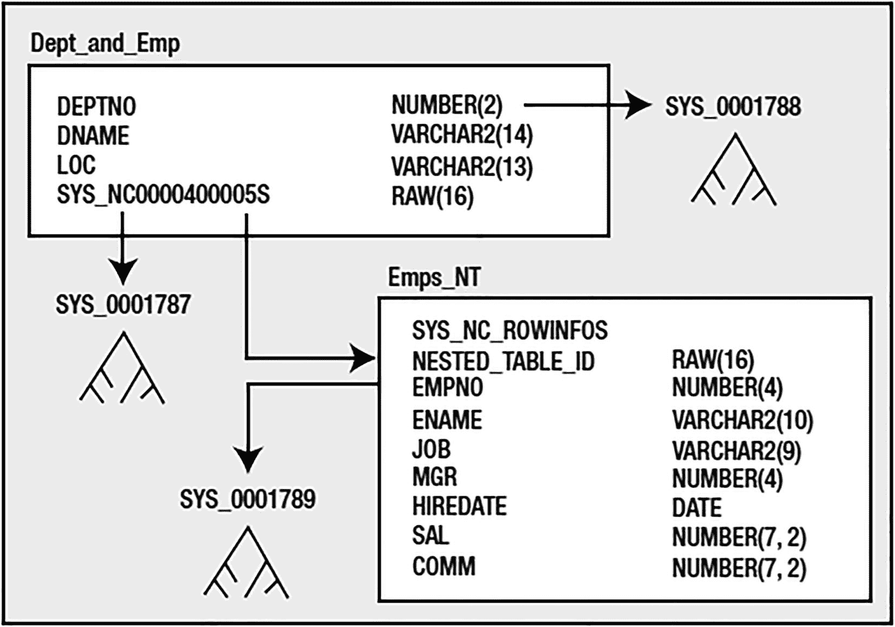
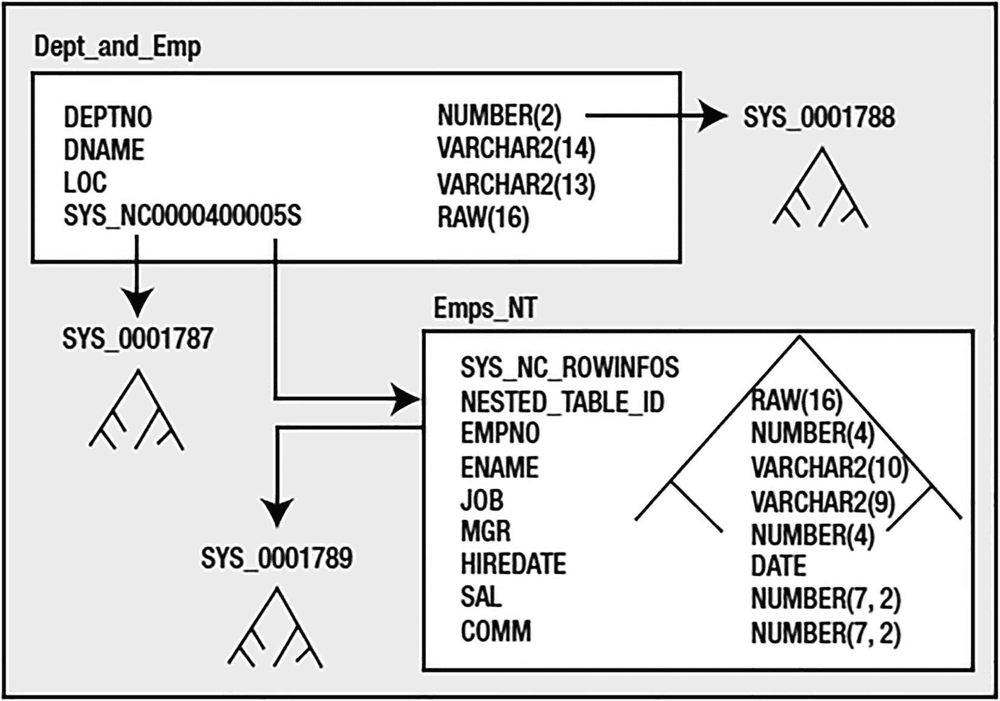

# 嵌套表的操作与特性

## 特殊语法介绍

语法正变得相当奇特。`CAST`和`MULTISET`是大多数人未曾使用过的语法。在处理数据库中的对象-关系组件时，你会发现很多奇特的语法。`MULTISET`关键字用于告知 Oracle，子查询预计返回多行（而`SELECT`列表中的子查询之前被限制为返回一行）。`CAST`用于指示 Oracle 将返回的集合作为一个集合类型处理。在此例中，我们将`MULTISET`转换为一个`EMP_TAB_TYPE`。`CAST`是一个通用例程，并不局限于在集合中使用。例如，如果我们想从`EMP`表中获取`EMPNO`列作为`VARCHAR2(20)`类型，而不是`NUMBER(4)`类型，可以使用查询 `select cast( empno as VARCHAR2(20) ) e from emp`。

## 查询嵌套表数据

现在我们准备查询数据。让我们看看一行数据可能是什么样子：

```sql
SQL> select deptno, dname, loc, d.emps AS employees
from dept_and_emp d
where deptno = 10;
DEPTNO DNAME          LOC           EMPLOYEES(EMPNO, ENAME, JOB,
---------- -------------- ------------- ----------------------------
10 ACCOUNTING     NEW YORK      EMP_TAB_TYPE(EMP_TYPE(7782,
'CLARK', 'MANAGER', 7839,
'09-JUN-81', 2450, NULL),
EMP_TYPE(7839, 'KING',
'PRESIDENT', NULL, '17-NOV-81',
5000, NULL), EMP_TYPE(7934,
'MILLER', 'CLERK', 7782,
'23-JAN-82', 1300, NULL))
```

所有数据都包含在一个单独的列中。大多数应用程序，除非是专门为对象-关系特性编写的，否则将无法处理这个特定的列。例如，ODBC 无法处理嵌套表（JDBC、OCI、Pro*C、PL/SQL 和大多数其他 API 和语言可以）。对于这些情况，Oracle 提供了一种方法来解集合，并像处理关系表一样处理它：

```sql
SQL> select d.deptno, d.dname, emp.*
from dept_and_emp D, table(d.emps) emp;
DEPTNO DNAME       EMPNO ENAME      JOB         MGR HIREDATE    SAL  COMM
------ ----------- ----- ---------- --------- --------- ----- -----
10 ACCOUNTING   7782 CLARK      MANAGER    7839 09-JUN-81  2450
10 ACCOUNTING   7839 KING       PRESIDENT       17-NOV-81  5000
10 ACCOUNTING   7934 MILLER     CLERK      7782 23-JAN-82  1300
20 RESEARCH     7369 SMITH      CLERK      7902 17-DEC-80   800
20 RESEARCH     7566 JONES      MANAGER    7839 02-APR-81  2975
20 RESEARCH     7788 SCOTT      ANALYST    7566 09-DEC-82  3000
20 RESEARCH     7876 ADAMS      CLERK      7788 12-JAN-83  1100
20 RESEARCH     7902 FORD       ANALYST    7566 03-DEC-81  3000
30 SALES        7499 ALLEN      SALESMAN   7698 20-FEB-81  1600   300
30 SALES        7521 WARD       SALESMAN   7698 22-FEB-81  1250   500
30 SALES        7654 MARTIN     SALESMAN   7698 28-SEP-81  1250  1400
30 SALES        7698 BLAKE      MANAGER    7839 01-MAY-81  2850
30 SALES        7844 TURNER     SALESMAN   7698 08-SEP-81  1500     0
30 SALES        7900 JAMES      CLERK      7698 03-DEC-81   950
14 rows selected.
```

我们能够将`EMPS`列作为一张表进行转换，它自然地为我们完成了连接操作——不需要连接条件。事实上，由于我们的`EMP`类型没有`DEPTNO`列，表面上我们没有任何东西可以进行连接。Oracle 为我们处理了这个细节。

## 更新嵌套表数据

那么，我们如何更新数据呢？假设我们想给部门`10`的员工每人 100 美元的奖金。我们会编写如下代码：

```sql
SQL> update
table( select emps
from dept_and_emp
where deptno = 10
)
set comm = 100;
3 rows updated.
```

这正是“每一行都对应一张虚拟表”发挥作用的地方。在前面展示的`SELECT`谓词中，可能不明显存在每行一张表，特别是因为连接等操作并不存在；这看起来有点像魔法。然而，`UPDATE`语句表明每行确实有一张表。我们选择了一个离散的表来`UPDATE`——这张表没有名字，只有一个查询来标识它。如果我们使用的查询没有`SELECT`恰好一张表，我们将收到以下错误：

```sql
SQL> update
table( select emps
from dept_and_emp
where deptno = 1
)
set comm = 100;
update
*
ERROR at line 1:
ORA-22908: reference to NULL table value
SQL> update
table( select emps
from dept_and_emp
where deptno > 1
)
set comm = 100;
table( select emps
*
ERROR at line 2:
ORA-01427: single-row subquery returns more than one row
```

如果我们返回少于一行（一个嵌套表实例），更新就会失败。通常，更新零行是可以的，但这种情况除外——它会返回错误，就像我们在常规表更新中省略了表名一样。如果我们返回多于一行（多于一个嵌套表实例），更新也会失败。通常，更新多行是完全可以的。这表明 Oracle 将`DEPT_AND_EMP`表中的每一行都视为指向另一张表，而不是像关系模型那样只是指向另一组行。

## 嵌套表与关系表的区别

这是嵌套表和父子关系表之间的语义区别。在嵌套表模型中，每个父行对应一张表。在关系模型中，每个父行对应一组行。这种差异有时会使嵌套表的使用有些麻烦。考虑我们使用的这个模型，它从单个部门的角度提供了一个非常好的数据视图。但如果我们想问诸如“`KING`在哪个部门工作？”、“我们有多少个会计？”之类的问题，这就是一个糟糕的模型。这些问题最好向`EMP`关系表提出，但在这种嵌套表模型中，我们只能通过`DEPT`数据访问`EMP`数据。我们必须总是进行连接；我们无法单独查询`EMP`数据。嗯，我们无法用受支持、有文档记载的方法做到这一点，但我们可以使用一个技巧（稍后会详细介绍这个技巧）。如果我们需要更新`EMPS_NT`中的每一行，我们将必须进行四次更新：分别更新`DEPT_AND_EMP`中的行，以更新与每行关联的虚拟表。

另一个需要考虑的问题是，当我们更新部门`10`的员工数据时，我们是在语义上更新`DEPT_AND_EMP`表中的`EMPS`列。我们理解物理上有两张表参与，但语义上只有一张。尽管我们没有更新`DEPT`表中的任何数据，但我们修改过的包含嵌套表的那一行会被其他会话锁定更新。在传统的父子表关系中，情况不会是这样。

## 使用建议

这些原因使得我倾向于避免将嵌套表作为持久化存储机制。`EMP`表是一个需要单独查询的强实体，这种情况非常普遍。我倾向于通过关系表上的视图来使用嵌套表。

## 插入与删除操作

既然我们已经了解了如何更新嵌套表实例，插入和删除操作就相当直接了。让我们在部门`10`的嵌套表实例中添加一行，并从部门`20`中删除一行：

```sql
SQL> insert into table
( select emps from dept_and_emp where deptno = 10 )
values
( 1234, 'NewEmp', 'CLERK', 7782, sysdate, 1200, null );
1 row created.
SQL> delete from table
( select emps from dept_and_emp where deptno = 20 )
where ename = 'SCOTT';
1 row deleted.
SQL> select d.dname, e.empno, ename, deptno
from dept_and_emp d, table(d.emps) e
where d.deptno in ( 10, 20 );
DNAME               EMPNO ENAME          DEPTNO
-------------- ---------- ---------- ----------
ACCOUNTING           7782 CLARK              10
ACCOUNTING           7839 KING               10
ACCOUNTING           7934 MILLER             10
ACCOUNTING           1234 NewEmp             10
RESEARCH             7369 SMITH              20
RESEARCH             7566 JONES              20
RESEARCH             7876 ADAMS              20
RESEARCH             7902 FORD               20
8 rows selected.
```


以上就是查询和修改嵌套表的基本语法。你会发现，为了使用嵌套表，你经常需要像刚才那样对它们进行“反嵌套”操作，尤其是在查询中。一旦你从概念上理解了“每行一个虚拟表”这个概念，处理嵌套表就会变得容易得多。

之前我曾说过：“我们必须进行连接；无法单独查询 `EMP` 数据。”但随后我补充了一个例外情况：“如果你真的需要，也可以。”这种方式并未被大量记录；仅在作为最后手段时才使用。它最方便的用途是当你需要批量更新嵌套表时（记住，你必须通过连接 `DEPT` 表来完成此操作）。有一个未充分文档化的提示（仅被简要提及且未完全记录），`NESTED_TABLE_GET_REFS`，它被各种工具（包括已弃用的 `EXP` 和 `IMP` 实用程序）用来处理嵌套表。它也是一种能让你稍微了解嵌套表物理结构的方法。如果你使用这个提示，你可以查询到一些“神奇”的结果。以下是 `EXP`（一种数据卸载实用程序）用来从此嵌套表中提取数据的查询：

```
SQL> SELECT /*+NESTED_TABLE_GET_REFS+*/
NESTED_TABLE_ID,SYS_NC_ROWINFO$ FROM "EODA"."EMPS_NT";
NESTED_TABLE_ID                  SYS_NC_ROWINFO$(EMPNO, ENAME, JOB, MGR, HIREDATE,
-------------------------------- ------------------------------------------
EF6CDA23E32D315AE043B7D04F0AA620 EMP_TYPE(7782, 'CLARK', 'MANAGER', 7839, '09-JUN-81', 2450, 100)
EF6CDA23E32D315AE043B7D04F0AA620 EMP_TYPE(7839, 'KING', 'PRESIDENT', NULL, '17-NOV-81', 5000, 100)
...
```

嗯，这有点令人惊讶，如果你描述一下这个表：

```
SQL> desc emps_nt
Name                          Null?    Type
----------------------------- -------- --------------------
EMPNO                                  NUMBER(4)
ENAME                                  VARCHAR2(10)
JOB                                    VARCHAR2(9)
MGR                                    NUMBER(4)
HIREDATE                               DATE
SAL                                    NUMBER(7,2)
COMM                                   NUMBER(7,2)
```

这两列甚至没有显示出来。它们是嵌套表隐藏实现的一部分。`NESTED_TABLE_ID` 实际上是一个指向父表 `DEPT_AND_EMP` 的外键。`DEPT_AND_EMP` 表中实际上有一个隐藏列，用于与 `EMPS_NT` 进行连接。`SYS_NC_ROWINFO$` 列是一个神奇的列；它更像一个函数而不是一列。这里的嵌套表实际上是一个对象表（由一个对象类型构成），而 `SYS_NC_ROWINFO$` 是 Oracle 在内部引用对象行的方式，而不是引用每个标量列。在底层，Oracle 为我们所做的只是实现了一个带有系统生成的主键和外键的父子表。如果我们再深入一点，可以查询真实的数据字典来查看 `DEPT_AND_EMP` 表中的所有列：

```
SQL> select name
from sys.col$
where obj# = ( select object_id
from dba_objects
where object_name = 'DEPT_AND_EMP'
and owner = 'EODA' );
NAME
--------------------
DEPTNO
DNAME
EMPS
LOC
TABLE
SYS_NC0000400005$
```

从嵌套表中选择这个列，我们会看到类似这样的内容：

```
SQL> select SYS_NC0000400005$ from dept_and_emp;
SYS_NC0000400005$
--------------------
EF6CDA23E32D315AE043B7D04F0AA620
EF6CDA23E32E315AE043B7D04F0AA620
EF6CDA23E32F315AE043B7D04F0AA620
EF6CDA23E330315AE043B7D04F0AA620
```

这个看起来奇怪的列名 `SYS_NC0000400005$`，是系统生成的、放入 `DEPT_AND_EMP` 表中的键。如果我们再深入挖掘，会发现 Oracle 在这个列上放置了一个唯一索引。然而不幸的是，它忽略了为 `EMPS_NT` 中的 `NESTED_TABLE_ID` 创建索引。这个列确实需要被索引，因为我们总是从 `DEPT_AND_EMP` 连接 *到* `EMPS_NT`。如果你像刚才那样使用所有默认设置来处理嵌套表，这是需要记住的重要一点：*始终为* 嵌套表中的 `NESTED_TABLE_ID` *建立索引*！

不过，我现在有点跑题了——我本来是在讲如何将嵌套表当作真正的表来对待。`NESTED_TABLE_GET_REFS` 提示为我们做到了这一点。我们可以像这样使用这个提示：

```
SQL> select /*+ nested_table_get_refs */ empno, ename from emps_nt where ename like '%A%';
EMPNO ENAME
---------- ----------
7782 CLARK
7876 ADAMS
7499 ALLEN
7521 WARD
7654 MARTIN
7698 BLAKE
7900 JAMES
7 rows selected.
SQL> update /*+ nested_table_get_refs */ emps_nt set ename = initcap(ename);
14 rows updated.
SQL> select /*+ nested_table_get_refs */ empno, ename from emps_nt where ename like '%a%';
EMPNO ENAME
---------- ----------
7782 Clark
7876 Adams
7521 Ward
7654 Martin
7698 Blake
7900 James
6 rows selected.
```

再次强调，这不是一个经过充分文档化和支持的功能。它为 `EXP` 和 `IMP` 工作提供了特定的功能。这是唯一能保证其工作的环境。使用它风险自负，并抵制将其放入生产代码中。事实上，如果你发现你*需要使用它*，那么根据定义，你根本就不打算使用嵌套表！它对你来说是错误的结构。可以将其用于数据的一次性修复，或者出于好奇查看嵌套表中的内容。受支持的数据报告方式是像下面这样将其反嵌套：

```
SQL> select d.deptno, d.dname, emp.*  from dept_and_emp D, table(d.emps) emp;
```

这才是你应该在查询和生产代码中使用的方式。


### 嵌套表存储

我们已经看过一些嵌套表结构的存储方式。在本节中，我们将深入研究 Oracle 默认创建的结构以及我们对其拥有的控制权。沿用之前的 `CREATE` 语句：

```sql
$ sqlplus eoda/foo@PDB1
SQL> create table dept_and_emp
(deptno number(2) primary key,
dname     varchar2(14),
loc       varchar2(13),
emps      emp_tab_type
)
nested table emps store as emps_nt;
Table created.
SQL> alter table emps_nt add constraint emps_empno_unique unique(empno);
Table altered.
```

我们知道 Oracle 实际上创建了一个如图 10-11 所示的结构。



图 10-11

嵌套表物理实现

该代码创建了两个真实的表。我们要求创建的表确实存在，但它多了一个隐藏列（默认情况下，表中的*每个*嵌套表列都会多一个隐藏列）。它还在此隐藏列上创建了一个 `unique` 约束。Oracle 为我们创建了嵌套表 `EMPS_NT`。此表有两个隐藏列，其中一个 `SYS_NC_ROWINFO$` 实际上不是列，而是一个返回所有标量元素作为对象的虚拟列。另一个是名为 `NESTED_TABLE_ID` 的外键，可用于关联回父表。请注意此列上*缺少*索引。最后，Oracle 在 `DEPT_AND_EMP` 表的 `DEPTNO` 列上添加了一个索引以强制实施主键。因此，我们要求创建一个表，却得到了远超预期的东西。仔细观察，这很像你可能为父/子关系创建的结构，但你会使用 `DEPTNO` 上现有的主键作为 `EMPS_NT` 中的外键，而不是生成一个代理 `RAW(16)` 键。

如果我们查看嵌套表示例的 `DBMS_METADATA.GET_DDL` 转储，会看到以下内容：

```sql
SQL> begin
dbms_metadata.set_transform_param
( DBMS_METADATA.SESSION_TRANSFORM, 'STORAGE', false );
end;
/
PL/SQL procedure successfully completed.
SQL> set long 100000
SQL> select dbms_metadata.get_ddl( 'TABLE', 'DEPT_AND_EMP' ) from dual;
DBMS_METADATA.GET_DDL('TABLE','DEPT_AND_EMP')

CREATE TABLE "EODA"."DEPT_AND_EMP"
(    "DEPTNO" NUMBER(2,0),
"DNAME" VARCHAR2(14),
"LOC" VARCHAR2(13),
"EMPS" "EODA"."EMP_TAB_TYPE",
PRIMARY KEY ("DEPTNO")
USING INDEX PCTFREE 10 INITRANS 2 MAXTRANS 255
TABLESPACE "USERS"  ENABLE
) SEGMENT CREATION IMMEDIATE
PCTFREE 10 PCTUSED 40 INITRANS 1 MAXTRANS 255
NOCOMPRESS LOGGING
TABLESPACE "USERS"
NESTED TABLE "EMPS" STORE AS "EMPS_NT"
(( CONSTRAINT "EMPS_EMPNO_UNIQUE" UNIQUE ("EMPNO")
USING INDEX PCTFREE 10 INITRANS 2 MAXTRANS 255 COMPUTE STATISTICS
TABLESPACE "USERS"  ENABLE)
PCTFREE 10 PCTUSED 40 INITRANS 1 MAXTRANS 255 LOGGING
TABLESPACE "USERS" ) RETURN AS VALUE
```

到目前为止，这里唯一新增的内容是 `RETURN AS VALUE` 子句。它用于描述如何将嵌套表返回给客户端应用程序。默认情况下，Oracle 会按值将嵌套表返回给客户端；实际数据将随每一行传输。这也可以设置为 `RETURN AS LOCATOR`，意味着客户端将获得指向数据的指针，而非数据本身。*只有当*客户端解引用此指针时，数据才会被传输给它。因此，如果你认为客户端通常不会查看每个父行对应的嵌套表行，则可以返回定位器而不是值，从而节省网络往返。例如，如果你有一个显示部门列表的客户端应用程序，并且当用户双击某个部门时才显示员工信息，你可能会考虑使用定位器。这是因为通常不会查看详细信息——这是例外，而非规则。

那么，我们还能对嵌套表做些什么呢？首先，`NESTED_TABLE_ID` 列必须被索引。由于我们总是*从*父表*到*子表访问嵌套表，我们确实需要该索引。我们可以使用 `CREATE INDEX` 为该列创建索引，但更好的解决方案是使用 `IOT`（索引组织表）来存储嵌套表。嵌套表是 `IOT` 非常适用的另一个完美例子。它将按 `NESTED_TABLE_ID` 物理地将子行 colocated（同址存储）（因此检索表所需的物理 I/O 更少）。它将消除在 `RAW(16)` 列上创建冗余索引的需要。更进一步，由于 `NESTED_TABLE_ID` 将是 `IOT` 主键中的前导列，我们还应该结合使用索引键压缩来抑制本会存在的冗余 `NESTED_TABLE_ID`。此外，我们可以将 `EMPNO` 列上的 `UNIQUE` 和 `NOT NULL` 约束整合到 `CREATE TABLE` 命令中。因此，如果我们对前面的 `CREATE TABLE` 语句稍作修改：

```sql
SQL> CREATE TABLE "EODA"."DEPT_AND_EMP"
("DEPTNO" NUMBER(2, 0),
"DNAME"  VARCHAR2(14),
"LOC"    VARCHAR2(13),
"EMPS" "EMP_TAB_TYPE")
PCTFREE 10 PCTUSED 40 INITRANS 1 MAXTRANS 255 LOGGING
TABLESPACE "USERS"
NESTED TABLE "EMPS"
STORE AS "EMPS_NT"
((empno NOT NULL, unique (empno), primary key(nested_table_id,empno))
organization index compress 1 )
RETURN AS VALUE;
Table created.
```

我们现在得到以下对象集。我们不再拥有常规表 `EMPS_NT`，而是拥有一个 `IOT` `EMPS_NT`，如图 10-12 中叠加在表上的索引结构所示。



图 10-12

作为 IOT 实现的嵌套表

其中 `EMPS_NT` 是一个使用压缩的 `IOT`，它应该比默认的原始嵌套表占用更少的存储空间，*并且*它拥有我们迫切需要的索引。

### 嵌套表总结

我个人不使用嵌套表作为永久存储机制，原因如下：

*   添加的 `RAW(16)` 列带来了不必要的存储开销。父表和子表都会有这个额外的列。父表对于它的每个嵌套表列都会有一个额外的 16 字节 RAW。由于父表通常已经有主键（在我的示例中是 `DEPTNO`），在子表中使用此键是有意义的，而不是使用系统生成的键。

*   当父表通常已经有唯一约束时，在父表上添加额外唯一约束带来的不必要开销。

*   嵌套表本身不易单独使用，除非使用不支持的构造（`NESTED_TABLE_GET_REFS`）。它可以用于查询的解嵌套（unnest），但不能用于批量更新。我尚未在现实生活中找到一个不会被“单独”查询的表。

`我确实在编程构造和视图中大量使用嵌套表`。我认为这才是它们真正擅长的领域。作为存储机制，我更倾向于自己创建父/子表。创建父/子表之后，我们实际上可以创建一个视图，使其看起来就像我们有一个真正的嵌套表一样。也就是说，我们可以获得嵌套表构造的所有优势，而不会产生额外开销。

如果你确实将嵌套表用作存储机制，请务必将其设为 `IOT`，以避免在 `NESTED_TABLE_ID` 上创建索引以及嵌套表本身的开销。有关设置溢出段和其他选项的建议，请参阅前面关于 `IOT` 的部分。如果你不使用 `IOT`，请确保在嵌套表的 `NESTED_TABLE_ID` 列上创建索引，以避免为查找子行而进行全表扫描。


