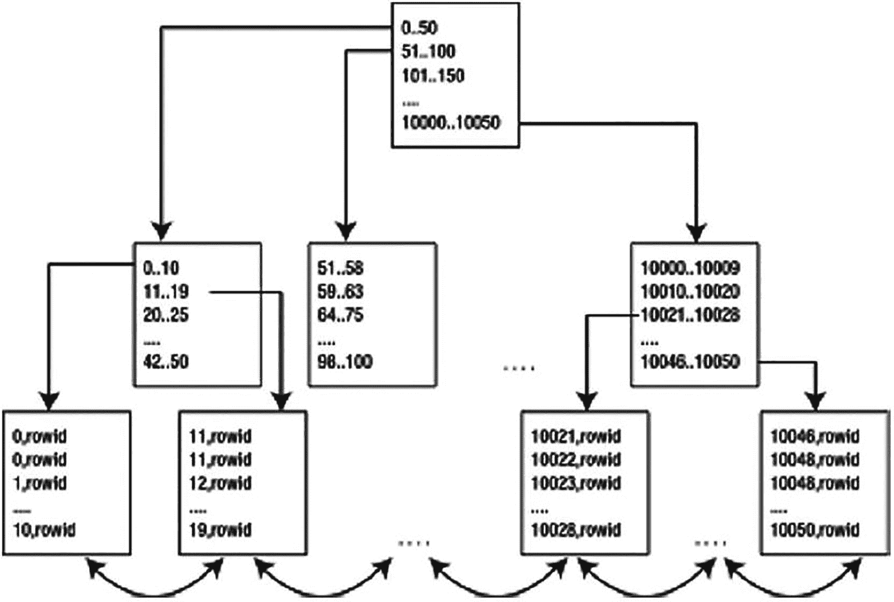
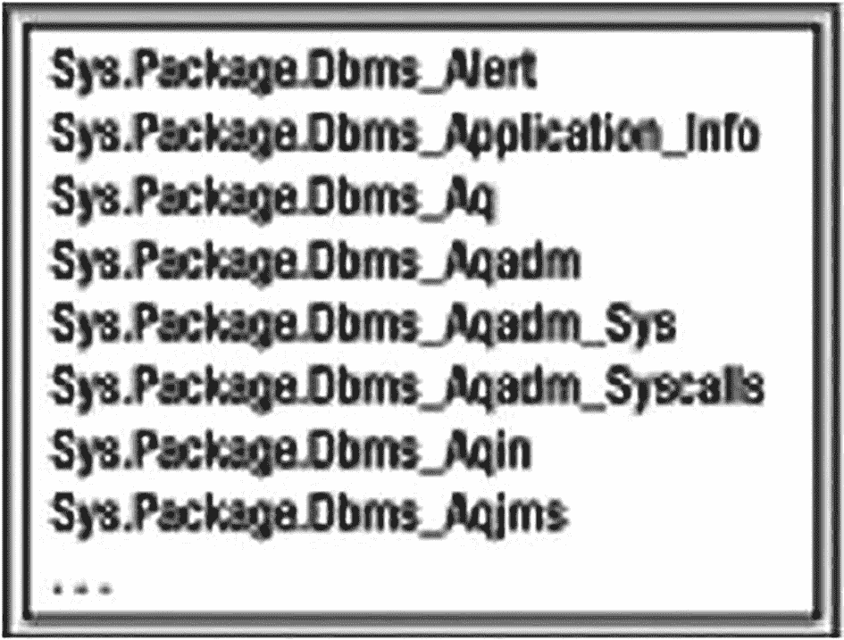
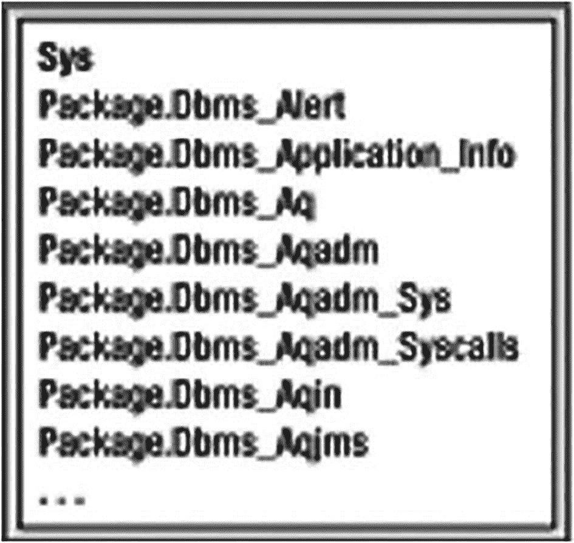

# Oracle 索引概览

Oracle 为我们提供了多种不同类型的索引。简要概述如下：

*   **B*Tree 索引**：这些是我所说的*传统*索引。迄今为止，它们是 Oracle 以及大多数其他数据库中最常用的索引。其结构类似于二叉树，B*Tree 索引通过键提供对单个行或行范围的快速访问，通常只需几次读取即可找到正确的行。但需要注意的是，“B*Tree”中的“B”并不代表 *binary*（二叉），而是代表 *balanced*（平衡）。正如我们在查看其物理存储方式时将看到的，B*Tree 索引根本不是二叉树。B*Tree 索引有几个子类型：
    *   **索引组织表**：这些是存储在 B*Tree 结构中的表。堆表中的数据行以无组织的方式存储（数据存放在任何有可用空间的地方），而 IOT 中的数据则按主键排序存储。从应用程序的角度来看，IOT 的行为与“常规”表完全一样；您可以像正常一样使用 SQL 访问它们。IOT 对于信息检索、空间和 OLAP 应用程序特别有用。我们在第 10 章详细讨论了 IOT。
*   **B*Tree 簇索引**：这是传统 B*Tree 索引的一个轻微变体。它们用于索引簇键（参见第 10 章“索引簇表”一节），本章将不再讨论。与传统 B*Tree 索引有一个指向行的键不同，B*Tree 簇有一个簇键，指向包含与该簇键相关的行的块。
*   **降序索引**：降序索引允许数据在索引结构中按从大到小（降序）而不是从小到大（升序）排序。我们将探讨为什么这可能很重要以及它们的工作原理。
*   **反向键索引**：这些是 B*Tree 索引，其中键中的字节被反转。反向键索引可用于在填充了递增值的索引中获得更均匀的索引条目分布。例如，如果我使用序列生成主键，序列将生成诸如 987500、987501、987502 等值。这些序列值是单调的，因此如果我使用传统的 B*Tree 索引，它们都倾向于进入同一个右侧的块，从而增加对该块的争用。使用反向键索引，Oracle 将逻辑上索引 205789、105789、005789 等值。Oracle 会在将数据放入索引之前反转要存储的数据字节，因此在字节反转之前本应在索引中相邻的值现在会相距很远。这种字节反转将插入操作分散到索引的许多块中。
*   **位图索引**：通常在 B*Tree 中，索引条目与行之间是一对一的关系：一个索引条目指向一行。使用位图索引，单个索引条目使用位图同时指向多行。它们适用于高度重复的数据（*相对于表中总行数*而言不同值很少的数据）且主要是只读的情况。考虑一个在一个百万行表中可能取三个值（`Y`、`N` 和 `NULL`）的列。如果例如您需要经常计算值为 `Y` 的行数，这可能是位图索引的一个好候选。这并不是说在同一张表中对具有 1000 个不同值的列建立位图索引无效——它当然是可行的。在 OLTP 数据库中，由于并发相关问题（我们将在适当的时候讨论），永远不应考虑位图索引。请注意，位图索引需要 Oracle 的企业版或个人版。
*   **位图连接索引**：这些提供了一种在索引结构中（而不是在表中）对数据进行反规范化的方法。例如，考虑简单的 `EMP` 和 `DEPT` 表。有人可能会问：“位于波士顿市的部门中有多少员工？” `EMP` 有一个指向 `DEPT` 的外键，为了计算 `LOC` 值为 Boston 的部门中的员工数，我们通常必须连接表以使 `LOC` 列与 `EMP` 记录关联来回答此问题。使用位图连接索引，我们可以针对 `EMP` 表对 `LOC` 列建立索引。关于 OLTP 系统的同样注意事项适用于位图连接索引和常规位图索引。
*   **基于函数的索引**：这些是 B*Tree 或位图索引，它们存储的是对行的列应用函数后的计算结果，而不是列数据本身。您可以将它们视为对虚拟（或派生）列的索引——换句话说，该列并未物理存储在表中。这些索引可用于加速形如 `SELECT * FROM T WHERE FUNCTION(DATABASE_COLUMN) = SOME_VALUE` 的查询，因为 `FUNCTION(DATABASE_COLUMN)` 的值已经被计算并存储在索引中。
*   **应用程序域索引**：这些是您自己构建和存储的索引，可以在 Oracle 内部，甚至可能在 Oracle 外部。您告诉优化器您的索引的选择性以及执行成本，优化器将根据该信息决定是否使用您的索引。Oracle 文本索引就是应用程序域索引的一个例子；它是使用您可能用来构建自己索引的相同工具构建的。需要注意的是，这里创建的索引不必使用传统的索引结构。例如，Oracle 文本索引使用一组表来实现其索引的概念。

如您所见，有许多索引类型可供选择。在以下各节中，我将介绍每种索引的工作原理以及何时应使用的技术细节。我想再次强调，我们将不会涵盖某些与 DBA 相关的主题。例如，我们不会讨论在线重建的机制；相反，我们将专注于实际应用相关的细节。


## B*树索引

B*树索引——或称我所说的常规索引——是数据库中最常用的索引结构。其实现方式类似于二叉搜索树。它的目标是**最小化** Oracle 用于搜索数据的时间。粗略地说，如果你在一个数字列上创建了索引，那么其结构在概念上可能类似于图 11-1 所示。



图 11-1：典型的 B*树索引布局

实际发生的块级优化和数据压缩，使得真实的块结构看起来与图 11-1 不同。此外，图 11-1 描绘的是一个非唯一索引（意味着它允许重复键值）。例如，如果你想查找值 11，会有两个不同的索引条目都包含值 11。

树中最低级别的块被称为 `leaf nodes`（叶节点）或 `leaf blocks`（叶块），它们包含每一个被索引的键和一个指向其所索引行的 `rowid`。位于叶节点之上的内部块被称为 `branch blocks`（分支块），用于在结构中导航。例如，如果我们想在索引中查找值 42，我们会从树顶部开始并向左走。我们会检查那个块，然后发现我们需要进入范围“42..50”对应的块。这个块将是叶块，并将我们指向包含数字 42 的行。

有趣的是，索引的叶节点实际上是一个双向链表。一旦我们确定了在叶节点中的起始位置（即，一旦我们找到了第一个值），对值进行有序扫描（也称为 `index range scan`，索引范围扫描）就非常容易了。我们不再需要导航结构；只需根据需要向前或向后遍历叶节点。这使得满足如下谓词的查询变得相当简单：

```
where x between 20 and 30
```

Oracle 会找到第一个包含大于或等于 20 的最低键值的索引叶块，然后它只需水平遍历叶节点的链表，直到最终碰到一个大于 30 的值。

在 B*树索引中，实际上并不存在所谓的非唯一条目。在非唯一索引中，Oracle 只是将 `rowid` 作为一个额外的列（带有一个长度字节以使键唯一）附加到键后面来存储。例如，像 `CREATE INDEX I ON T(X,Y)` 这样的索引，在概念上等同于 `CREATE UNIQUE INDEX I ON T(X,Y,ROWID)`。在由你定义的唯一索引中，Oracle 不会将 `rowid` 添加到索引键中。在非唯一索引中，你会发现数据首先按索引键值排序（按索引键的顺序），然后按 `rowid` 升序排序。在唯一索引中，数据仅按索引键值排序。

B*树的特性之一是所有叶块在树中应处于同一级别。这个级别也称为索引的 `height`（高度），这意味着从索引的根块到叶块的任何遍历都将访问相同数量的块。也就是说，无论使用的 `:X` 值是多少，对于 `"SELECT INDEXED_COL FROM T WHERE INDEXED_COL = :X"` 这种形式的查询，到达叶块以检索第一行所需的 I/O 次数是相同的。换句话说，索引是 `height balanced`（高度平衡的）。大多数 B*树索引的高度为 2 或 3，即使对于数百万条记录也是如此。这意味着，通常只需进行两到三次 I/O 就能在索引中找到你的键——这还不算太糟。

Oracle 在提及从索引根块遍历到叶块所涉及的块数时，使用了两个含义略有不同的术语。第一个是 `HEIGHT`，它表示从根块到叶块所需的块数。`HEIGHT` 值可以在使用 `ANALYZE INDEX <name> VALIDATE STRUCTURE` 命令分析索引后，从 `INDEX_STATS` 视图中找到。另一个是 `BLEVEL`，它表示分支级别数，与 `HEIGHT` 相差一（它不计算叶块）。`BLEVEL` 的值在收集统计信息后，可以在如 `USER_INDEXES` 这样的普通数据字典表中找到。

例如，假设我们有一个包含 10,000,000 行的表（关于创建 `BIG_TABLE` 的详细信息，请参阅本书开头的“设置你的环境”部分），并在一个数字列上有一个主键索引：

```
$ sqlplus eoda/foo@PDB1
SQL> select index_name, blevel, num_rows
from user_indexes
where table_name = 'BIG_TABLE';
INDEX_NAME               BLEVEL  NUM_ROWS
-------------------- ---------- ---------
BIG_TABLE_PK                  2   9848991
```

这里的 `BLEVEL` 是 2，意味着 `HEIGHT` 是 3，需要两次 I/O 来找到叶块（最终产生第三次 I/O）。因此，我们预期从这个索引中检索任何给定的键值需要三次 I/O：

```
SQL> set autotrace on
SQL> select id from big_table where id = 42;
Execution Plan
----------------------------------------------------------
| Id  | Operation          | Name         | Rows | Bytes | Cost (%CPU)|     Time     |
----------------------------------------------------------
|   0 | SELECT STATEMENT   |              |    1 |     6 |    2    (0)| 00:00:01 |
|*  1 |  INDEX UNIQUE SCAN | BIG_TABLE_PK |    1 |     6 |    2    (0)| 00:00:01 |
----------------------------------------------------------

Statistics
----------------------------------------------------------
          0  recursive calls
          0  db block gets
          3  consistent gets
          0  physical reads
          0  redo size
        523  bytes sent via SQL*Net to client
        520  bytes received via SQL*Net from client
          2  SQL*Net roundtrips to/from client
          0  sorts (memory)
          0  sorts (disk)
          1  rows processed

SQL> select id from big_table where id = 12345;
Statistics
----------------------------------------------------------
          0  recursive calls
          0  db block gets
          3  consistent gets
          0  physical reads
          0  redo size
        523  bytes sent via SQL*Net to client
        520  bytes received via SQL*Net from client
          2  SQL*Net roundtrips to/from client
          0  sorts (memory)
          0  sorts (disk)
          1  rows processed

SQL> select id from big_table where id = 1234567;
Statistics
----------------------------------------------------------
          0  recursive calls
          0  db block gets
          3  consistent gets
          0  physical reads
          0  redo size
        523  bytes sent via SQL*Net to client
        520  bytes received via SQL*Net from client
          2  SQL*Net roundtrips to/from client
          0  sorts (memory)
          0  sorts (disk)
          1  rows processed
```

B*树是一种极好的通用索引机制，适用于大表和小表，并且随着基础表大小的增长，其检索性能几乎不会（如果有的话）下降。


### 索引键压缩

对 B*树索引可以执行的一项有趣操作是 `compress`（压缩）。这种压缩方式不同于 ZIP 文件的压缩原理；它主要用于消除串联（多列）索引中的冗余数据。

我们在第 10 章的“索引组织表”一节中已较为详细地介绍过压缩键索引，这里我们将再次简要探讨。压缩键索引的基本概念是将每个索引条目拆分为两部分：`prefix`（前缀）和`suffix`（后缀）组件。前缀基于索引串联列中的前导列构建，其中包含大量重复值。后缀则基于索引键中的尾随列构建，它是在前缀范围内标识索引条目唯一性的组件。

举例说明，我们将创建一个表和一个串联索引，并使用 `ANALYZE INDEX` 来度量其未压缩时占用的空间。

**注意**
存在一个常见的误解，认为在 Oracle 中不应使用 `ANALYZE` 命令——认为 `DBMS_STATS` 包已经取代了它。这种说法并不正确。真正正确的是，`ANALYZE` 不应再用于收集统计信息，但其其他功能仍然适用。`ANALYZE` 命令应被用于执行诸如验证索引结构（我们稍后会进行）或列出表中的链行（chained rows）等操作。收集对象统计信息的工作则应完全使用 `DBMS_STATS` 来完成。

然后，我们将使用索引键压缩重新创建索引，压缩不同数量的键条目，并观察其差异。让我们从这个表和索引开始：

```
$ sqlplus eoda/foo@PDB1
SQL> create table t as select * from all_objects where rownum < 10000;
SQL> create index t_idx on t(owner,object_type,object_name);
Index created.
SQL> analyze index t_idx validate structure;
Index analyzed.
```

接着，我们创建一个 `IDX_STATS` 表来保存 `INDEX_STATS` 信息，并将这些行标记为“未压缩”（noncompressed）：

```
SQL> create table idx_stats as
select 'noncompressed' what, a.*
from index_stats a;
Table created.
```

现在，我们可以观察到 `OWNER` 组件被重复了多次，这意味着该索引的单个索引块中会包含数十个条目，如图 11-2 所示。



图 11-2
包含重复 `OWNER` 列的索引块

我们可以将重复的 `OWNER` 列提取出来，得到一个更接近图 11-3 所示的块结构。



图 11-3
提取出 `OWNER` 列后的索引块

在图 11-3 中，所有者名称在叶块上只出现一次——而不是每个重复条目都出现一次。我们运行以下脚本，传入数字 1，来重新创建索引仅对前导列使用压缩的场景：

```
SQL> drop index t_idx;
SQL> create index t_idx on
t(owner,object_type,object_name)
compress &1;
SQL>  analyze index t_idx validate structure;
SQL> insert into idx_stats
select 'compress &1', a.*
from index_stats a;
```

为了进行比较，我们不仅运行传入 1（压缩第一列）的脚本，还运行传入 2 和 3（压缩前两列和前三列）的版本，以观察结果。最后，我们查询 `IDX_STATS`，应该会观察到以下内容：

```
SQL> select what, height, lf_blks, br_blks,
btree_space, opt_cmpr_count, opt_cmpr_pctsave
from idx_stats;
WHAT              HEIGHT    LF_BLKS    BR_BLKS BTREE_SPACE OPT_CMPR_COUNT OPT_CMPR_PCTSAVE
------------- ---------- ---------- ---------- ----------- -------------- ----------------
noncompressed          2        227          1     1823120              2             28
compress 1             2        206          1     1654380              2             21
compress 2             2        162          1     1302732              2              0
compress 3             2        268          1     2149884              2             39
```

我们看到，`COMPRESS 1` 索引的大小大约是非压缩索引的 90%（比较 `BTREE_SPACE`）。叶块的数量显著减少。此外，当我们使用 `COMPRESS 2` 时，节省的空间更加显著。生成的索引大小约为原始索引的 71%。实际上，利用 `OPT_CMPR_PCTSAVE` 列（代表“最佳压缩节省百分比”或压缩的预期节省空间），我们本可以预估出 `COMPRESS 2` 索引的大小：

```
SQL> select 1823120*(1-0.28) from dual;
1823120*(1-0.28)
----------------
      1312646.4
```

**注意**
对非压缩索引执行的 `ANALYZE` 命令填充了 `OPT_CMPR_PCTSAVE`/`OPT_CMPR_COUNT` 列，并预估 `COMPRESS 2` 能节省 28%的空间，而我们的实际结果几乎完全符合。

但请注意 `COMPRESS 3` 的情况。生成的索引实际上变大了：是原始索引大小的 117%。这是因为，我们移除的每个重复前缀虽然节省了 N 个副本的空间，但作为压缩方案的一部分，它在叶块上增加了 4 字节的开销。通过将 `OBJECT_NAME` 列加入压缩键，我们使这个键几乎变得唯一——在这种情况下，意味着实际上没有可提取的重复副本。因此，我们最终为几乎每一个索引键条目*增加*了 4 字节，却没有提取出任何重复数据。`IDX_STATS` 中的 `OPT_CMPR_COUNT` 列对于提供应使用的最佳压缩计数值非常准确，而 `OPT_CMPR_PCTSAVE` 则会准确告诉你预期能节省多少空间。

当然，这种压缩并非没有代价。压缩后的索引结构比以前更复杂了。在维护索引（当数据发生修改时）以及在查询期间搜索索引时，Oracle 都需要花费更多时间来处理该结构中的数据。我们在这里所做的，是用增加的 CPU 时间来换取减少的 I/O 时间。通过压缩，我们的块缓冲区缓存能够容纳比以前更多的索引条目，缓存命中率可能会上升，物理 I/O 应该会减少，但处理索引需要稍多的 CPU 处理能力，并且也会增加块争用的可能性。正如我们在讨论哈希集群时所说的，检索一百万随机行可能需要更多的 CPU，但能减少一半的 I/O，我们必须意识到这种权衡。如果你的系统当前受限于 CPU 资源，添加压缩键索引可能会降低处理速度。另一方面，如果你的系统受限于 I/O 资源，使用它们可能会加快速度。


### 反向键索引

### 注意

B*树索引的另一个特性是能够反转其键。起初，你可能会问自己：“我为什么要这么做？” B*树索引是为特定环境和特定问题设计的。在 Oracle RAC 环境中，它们被实现以减少对索引叶块的争用，特别是那些位于“右侧”的索引，例如由序列值或时间戳填充的列上的索引。

我们在第 2 章讨论过 RAC。

RAC 是 Oracle 的一种配置，允许多个实例挂载并打开同一个数据库。如果两个实例需要同时修改同一数据块，它们将通过一个硬件*互连*（机器之间的私有网络连接）来回传递该块来共享它。如果你在由序列填充的列上有一个主键索引（一种非常普遍的实现），那么每个人在插入新值时，都会试图修改当前位于索引结构右侧的那一个块（见图 11-1，图中显示索引中较高的值向右，较低的值向左）。由序列填充的列上的索引修改会集中在少量的叶块上。反转索引的键可以将插入操作分布到索引的所有叶块上，尽管这可能会导致索引的打包效率降低很多。

即使在 Oracle 的单实例环境中，你可能也会发现反向键索引作为减少争用的方法很有用。同样，你主要会用它们来缓解繁忙索引右侧的缓冲区忙等待，如本节所述。

在我们研究如何衡量反向键索引的影响之前，我们先讨论一下反向键索引在物理上做了什么。反向键索引只是简单地反转索引键中每一列的字节。如果我们考虑数字 90101、90102 和 90103，并使用 Oracle 的 `DUMP` 函数查看它们的内部表示，我们会发现它们表示如下：

```sql
SQL> select 90101, dump(90101,16) from dual
union all
select 90102, dump(90102,16) from dual
union all
select 90103, dump(90103,16) from dual;
90101 DUMP(90101,16)
---------- ---------------------
90101 Typ=2 Len=4: c3,a,2,2
90102 Typ=2 Len=4: c3,a,2,3
90103 Typ=2 Len=4: c3,a,2,4
```

每个数字都是 4 字节长，只有最后一个字节不同。这些数字在索引结构中最终会彼此紧邻。然而，如果我们反转它们的字节，Oracle 将插入以下内容：

```
90101 反转后 = 2,2,a,c3
90102 反转后 = 3,2,a,c3
90103 反转后 = 4,2,a,c3
```

这些数字最终会相距甚远。这减少了访问同一个块（最右边的块）的 RAC 实例数量，并减少了 RAC 实例之间的块传输次数。反向键索引的一个缺点是，它不能在所有常规索引可以应用的情况下使用。例如，在回答以下谓词时，`X` 上的反向键索引将没有用：

```sql
where x > 5
```

索引中的数据在存储之前不是按 `X` 排序的，而是按 `REVERSE(X)` 排序的；因此，`X > 5` 的范围扫描将无法使用该索引。另一方面，一些范围扫描可以在反向键索引上完成。如果我在 `(X, Y)` 上有一个组合索引，以下谓词将能够利用反向键索引并对其进行范围扫描：

```sql
where x = 5
```

这是因为 `X` 的字节被反转，然后 `Y` 的字节被反转。Oracle 并不是反转 `(X || Y)` 的字节，而是存储 `(REVERSE(X) || REVERSE(Y))`。这意味着所有 `X = 5` 的值将存储在一起，因此 Oracle 可以对该索引进行范围扫描以找到它们全部。

现在，假设你在表上有一个通过序列填充的代理主键，并且你不需要在此索引上进行范围扫描——也就是说，你不需要查询 `MAX(primary_key)`、`MIN(primary_key)`、`WHERE primary_key < 100` 等等——那么即使在 Oracle 的单实例环境中，你也可以在插入量大的场景下考虑使用反向键索引。

我在 PL/SQL 环境中设置了一个测试，以演示在主键上带有反向键索引的表与带有常规索引的表之间插入操作的差异。使用的表是使用以下 DDL 创建的：

```sql
$ sqlplus eoda/foo@PDB1
SQL> create tablespace assm
datafile size 1m autoextend on next 1m
segment space management auto;
SQL> create table t tablespace assm
as
select 0 id, owner, object_name, subobject_name,
object_id, data_object_id, object_type, created,
last_ddl_time, timestamp, status, temporary,
generated, secondary
from all_objects a
where 1=0;
SQL> alter table t add constraint t_pk primary key (id)
using index (create index t_pk on t(id) &indexType tablespace assm);
SQL> create sequence s cache 1000;
```

其中 `&indexType` 被替换为关键字 `REVERSE`（创建反向键索引）或留空（从而使用“常规”索引）。由 1、2、5、10、15 或 20 个用户并发运行的 PL/SQL 如下所示：

```sql
SQL> create or replace procedure do_sql
as
begin
for x in ( select rownum r, OWNER, OBJECT_NAME, SUBOBJECT_NAME,
OBJECT_ID, DATA_OBJECT_ID, OBJECT_TYPE, CREATED,
LAST_DDL_TIME, TIMESTAMP, STATUS, TEMPORARY,
GENERATED, SECONDARY from all_objects )
loop
insert into t
( id, OWNER, OBJECT_NAME, SUBOBJECT_NAME,
OBJECT_ID, DATA_OBJECT_ID, OBJECT_TYPE, CREATED,
LAST_DDL_TIME, TIMESTAMP, STATUS, TEMPORARY,
GENERATED, SECONDARY )
values
( s.nextval, x.OWNER, x.OBJECT_NAME, x.SUBOBJECT_NAME,
x.OBJECT_ID, x.DATA_OBJECT_ID, x.OBJECT_TYPE, x.CREATED,
x.LAST_DDL_TIME, x.TIMESTAMP, x.STATUS, x.TEMPORARY,
x.GENERATED, x.SECONDARY );
if ( mod(x.r,100) = 0 )
then
commit;
end if;
end loop;
commit;
end;
/
```

#### 提示

你可以从 GitHub 网站下载反向键索引性能示例的源代码。在第 11 章的脚本文件夹中，有几个 `demo3*` 文件，可以自动运行整个测试套件。

下表总结了不同运行之间的差异，从表 11-1 的单用户测试开始。

**表 11-1**
使用反向键索引的性能测试（PL/SQL）：单用户情况

|   | 反向索引 PL/SQL | 非反向索引 PL/SQL |
| --- | --- | --- |
| 每秒事务数 | 41.5 | 41.5 |
| CPU 时间（秒） | 0.38 | 0.37 |
| 缓冲区忙等待次数/秒数 | 0/0 | 0/0 |
| 已用时间（秒） | 0.38 | 0.34 |
| 日志文件同步次数/秒数 | 2/0 | 2/0 |

从这个单用户测试来看，反向键索引似乎消耗了稍多的 CPU。这是合理的，因为数据库在仔细反转键中的字节时必须执行额外的工作。但我们会看到，随着用户数量的增加，这个逻辑将不再成立。当我们引入争用时，反向键索引的开销将完全消失。事实上，即使到我们进行双用户测试时，开销也大部分被索引右侧的争用所抵消，如表 11-2 所示。

**表 11-2**
使用反向键索引的性能测试（PL/SQL）：双用户

|   | 反向索引 PL/SQL | 非反向索引 PL/SQL |
| --- | --- | --- |
| 每秒事务数 | 55.0 | 55.0 |
| CPU 时间（秒） | 0.80 | 0.77 |
| 缓冲区忙等待次数/秒数 | 823/0 | 615/0 |
| 已用时间（秒） | 0.79 | 0.75 |
| 日志文件同步次数/秒数 | 3/0 | 3/0 |

让我们继续看五用户测试，如表 11-3 所示。

**表 11-3**
使用反向键索引的性能测试（PL/SQL）：五用户


| | 反向键 PL/SQL | 非反向键 PL/SQL |
|---|---|---|
| 事务数/秒 | 82.2 | 82.2 |
| CPU 时间（秒） | 1.93 | 1.91 |
| 缓冲区忙等待次数/秒数 | 1963/1 | 2644/1 |
| 已用时间（秒） | 5.26 | 5.59 |
| 日志文件同步次数/秒数 | 6/0 | 6/0 |

我们看到的情况大同小异。PL/SQL 全速运行，`log file sync`等待很少，但受到`buffer busy waits`的影响很大。使用常规索引且所有五个用户都试图向索引结构的右侧插入时，PL/SQL 受`buffer busy waits`影响最大，因此在这些等待减少时受益也最多。

看一下表 11-4 中的十用户测试，我们可以看到趋势仍在继续。

表 11-4

PL/SQL 使用反向键索引的性能测试：十用户

| | 反向键 PL/SQL | 非反向键 PL/SQL |
|---|---|---|
| 事务数/秒 | 88.3 | 91.2 |
| CPU 时间（秒） | 3.83 | 4.06 |
| 缓冲区忙等待次数/秒数 | 2897/28 | 6831/7 |
| 已用时间（秒） | 25.6 | 26.04 |
| 日志文件同步次数/秒数 | 11/0 | 119/0 |

在没有`log file sync`等待的情况下，移除`buffer busy wait`事件对 PL/SQL 的帮助很大。改进使用常规索引的 PL/SQL 实现性能的一种方法是引入一个小的等待。这会减少索引右侧的竞争，从而提高整体性能。由于篇幅原因，这里不包括 15 用户和 20 用户的测试，但我可以确认，本节中观察到的趋势仍在继续。

从这个演示中我们可以得出两点结论。反向键索引可以帮助缓解`buffer busy wait`情况，但根据其他因素，你获得的投资回报会有所不同。查看表 11-4 的十用户测试，移除`buffer busy waits`（当时最主要的等待事件）对事务吞吐量的影响是轻微的，但它确实在更高的并发级别下显示出更好的可扩展性。

## 降序索引

降序索引扩展了 B*Tree 索引的功能。它们允许在索引中按降序（从大到小）而不是升序（从小到大）存储列。

Oracle 能够反向读取索引已经有一段时间了，所以你可能会想知道为什么这个功能相关。例如，如果我们使用表 `T`

```sql
$ sqlplus eoda/foo@PDB1
SQL> create table t as select * from all_objects;
Table created.
SQL> create index t_idx on t(owner,object_type,object_name);
Index created.
SQL> begin
  dbms_stats.gather_table_stats
    ( user, 'T', method_opt=>'for all indexed columns' );
end;
/
PL/SQL procedure successfully completed.
```

并像下面这样查询它

```sql
SQL> set autotrace traceonly explain
SQL> select owner, object_type
    from t
    where owner between 'T' and 'Z'
    and object_type is not null
    order by owner DESC, object_type DESC;
Execution Plan
----------------------------------------------------------
Plan hash value: 2685572958

| Id  | Operation                    | Name  | Rows | Bytes | Cost (%CPU)| Time     |
|---|---|---|---|---|---|---|
|   0 | SELECT STATEMENT             |       | 5008 | 50080 |    24   (0)| 00:00:01 |
|*  1 |  INDEX RANGE SCAN DESCENDING | T_IDX | 5008 | 50080 |    24   (0)| 00:00:01 |
```

Oracle 将直接反向读取索引。此计划中没有最终的排序步骤；数据是有序的。然而，降序索引功能发挥作用的情况是，当列的排序方式混合时，有些是`ASC`（升序），有些是`DESC`（降序），例如：

```sql
SQL> select owner, object_type
    from t
    where owner between 'T' and 'Z'
    and object_type is not null
    order by owner DESC, object_type ASC;
Execution Plan
----------------------------------------------------------
Plan hash value: 2813023843

| Id  | Operation          | Name  | Rows | Bytes | Cost (%CPU)| Time     |
|---|---|---|---|---|---|---|
|   0 | SELECT STATEMENT   |       | 5008 | 50080 |    24   (0)| 00:00:01 |
|   1 |  SORT ORDER BY     |       | 5008 | 50080 |    24   (0)| 00:00:01 |
|*  2 |   INDEX RANGE SCAN | T_IDX | 5008 | 50080 |    24   (0)| 00:00:01 |
Predicate Information (identified by operation id):
---------------------------------------------------
   2 - access("OWNER">='T' AND "OWNER"<='Z')
       filter("OBJECT_TYPE" IS NOT NULL)
```

Oracle 无法再使用我们已有的(`OWNER`, `OBJECT_TYPE`, `OBJECT_NAME`)上的索引来对数据进行*排序*。它本可以反向读取索引来获得按`OWNER DESC`排序的数据，但它需要“正向”读取才能获得`OBJECT_TYPE`的`ASC`排序。相反，它收集了所有行然后进行了排序。这时`DESC`索引就派上用场了：

```sql
SQL> create index desc_t_idx on t(owner desc,object_type asc);
Index created.
SQL> select owner, object_type
    from t
    where owner between 'T' and 'Z'
    and object_type is not null
    order by owner DESC, object_type ASC;
Execution Plan
----------------------------------------------------------
Plan hash value: 2494308350

| Id  | Operation         | Name       | Rows | Bytes | Cost (%CPU)| Time     |
|---|---|---|---|---|---|---|
|   0 | SELECT STATEMENT  |            | 5008 | 50080 |     2   (0)| 00:00:01 |
|*  1 |  INDEX RANGE SCAN | DESC_T_IDX | 5008 | 50080 |     2   (0)| 00:00:01 |
Predicate Information (identified by operation id):
---------------------------------------------------
   1 - access(SYS_OP_DESCEND("OWNER")>=HEXTORAW('A5FF') AND
              SYS_OP_DESCEND("OWNER")<HEXTORAW('A600') AND
              SYS_OP_UNDESCEND(SYS_OP_DESCEND("OWNER"))>='T' AND
              SYS_OP_UNDESCEND(SYS_OP_DESCEND("OWNER"))<='Z' AND
              "OBJECT_TYPE" IS NOT NULL)
```

我们再次能够读取已排序的数据，并且计划末尾没有额外的排序步骤。

> **注意**
>
> 永远不要试图从查询中去掉`ORDER BY`。仅仅因为你的查询计划包含索引，并不意味着数据会以“某种顺序”返回。从数据库中以某种排序顺序检索数据的*唯一方式*就是在查询中包含`ORDER BY`。`ORDER BY`是无可替代的。


### 何时应使用 B*树索引？

我并非“经验法则”的坚定信徒（任何规则都有例外），因此对于何时使用（或不使用）`B*树`索引，我没有任何经验法则。为了说明我为何没有这方面的经验法则，我将举出两条同样有效的法则：

*   仅当通过索引访问表中行的比例非常小时，才使用`B*树`对列进行索引。
*   如果你将要处理表中的许多行，并且索引可以*代替*表本身被使用，那么就使用`B*树`索引。

这些法则看似提供了相互矛盾的建议，但实际上并非如此——它们只是涵盖了两种截然不同的情况。根据前面的建议，有两种使用索引的方式：

*   作为访问表中行的手段：你将读取索引以定位到表中的一行。在这里，你希望访问表中行的很小一部分。
*   作为回答查询的手段：索引包含足够的信息来回答整个查询——我们根本不需要访问表。索引将被用作表的更“瘦”的版本。

还有其他方式——例如，我们可能使用一个索引来检索表中*所有*的行，包括那些不在索引本身中的列。这看似与刚提出的两条法则都相悖。这种情况会发生的场景是交互式应用程序，你在其中获取一部分行并显示它们，然后再获取更多，依此类推。你希望查询针对初始响应时间进行优化，而不是整体吞吐量。

第一种情况（即，如果你将访问表中很小比例的行，则使用索引）指的是，假设你有一个表 `T`（使用与之前相同的表 `T`），并且你的查询计划如下所示：

```sql
$ sqlplus eoda/foo@PDB1
SQL> set autotrace traceonly explain
SQL> select owner, status  from t where owner = USER;
Execution Plan

Plan hash value: 1695850079

| Id  | Operation                             | Name       | Rows | Bytes | Cost (%CPU)| ...

|   0 | SELECT STATEMENT                      |            | 1716 | 17160 |   13    (0)| ...
|   1 |  TABLE ACCESS BY INDEX ROWID BATCHED  | T          | 1716 | 17160 |   13    (0)| ...
|*  2 |   INDEX RANGE SCAN                    | DESC_T_IDX |  288 |       |    2    (0)| ...

Predicate Information (identified by operation id):

2 - access(SYS_OP_DESCEND("OWNER")=SYS_OP_DESCEND(USER@!))
filter(SYS_OP_UNDESCEND(SYS_OP_DESCEND("OWNER"))=USER@!)
```

你应该只访问这张表中非常小的一部分数据。这里需要关注的问题是 `INDEX RANGE SCAN` 之后紧跟着 `TABLE ACCESS BY INDEX ROWID`。这意味着 `Oracle` 会读取索引，然后针对每个索引条目，执行一次数据库块读取（逻辑或物理 `I/O`）来获取行数据。如果你必须通过索引访问 `T` 表中很大比例的行（我们很快会定义“很大比例”可能是多少），那么这不是最有效的方法。

在第二种情况下（即，当索引可以代替表使用时），你可以通过索引处理 100%（或者实际上任何比例）的行。你可能只是使用一个索引来创建一个更“瘦”的表版本。下面的查询演示了这个概念：

```sql
SQL> select count(*) from t where owner = user;
Execution Plan

Plan hash value: 293504097

| Id  | Operation          | Name  | Rows | Bytes | Cost (%CPU)| Time     |

|   0 | SELECT STATEMENT   |       |    1 |     3 |   10    (0)| 00:00:01 |
|   1 |  SORT AGGREGATE    |       |    1 |     3 |            |          |
|*  2 |   INDEX RANGE SCAN | T_IDX | 1716 |  5148 |   10    (0)| 00:00:01 |

Predicate Information (identified by operation id):

2 - access("OWNER"=USER@!)
```

在这里，仅使用索引就回答了查询——现在我们访问了多少比例的行已经无关紧要了，因为我们只会使用索引。从执行计划可以看出，从未访问底层表；我们只是扫描了索引结构本身。

理解这两个概念之间的区别至关重要。当我们必须执行 `TABLE ACCESS BY INDEX ROWID` 时，我们必须确保只访问表中总块数的一小部分（这通常等同于访问行的一小部分），或者我们需要尽快检索出第一批行（最终用户正在不耐烦地等待它们）。如果我们访问的行比例过高（超过行的 1% 到 20% 之间的某个值），那么通常通过 `B*树` 访问它们会比全表扫描花费更长时间。

对于第二种查询，即答案完全存在于索引中的情况，情况就不同了。我们读取一个索引块，获取许多行进行处理，然后继续读取下一个索引块，依此类推——我们从不访问表。在某些情况下，我们还可以对索引执行*快速全扫描*，以使速度更快。快速全扫描是指数据库以无特定顺序读取索引块；它只是开始读取它们。此时，它不再将索引用作索引，而更像是一张表。快速全扫描输出的行不会按索引条目排序。

通常，`B*树` 索引会放置在查询谓词中频繁使用的列上，并且我们期望返回表中数据的一小部分，或者最终用户要求即时反馈。在一个“瘦”表（即列很少或很窄的表）上，这个比例可能非常小。使用此索引的查询应预期检索并访问表中 2% 到 3% 或更少的行。在一个“胖”表（即有很多列或列非常宽的表）上，这个比例可能高达表的 20-25%。这个建议似乎并不总是立即被所有人理解；它不直观，但它是准确的。索引按索引键排序存储。索引将按键的排序顺序被访问。而索引指向的块则是随机存储在堆中。因此，当我们通过索引读取以访问表时，我们将执行大量的*分散的*、随机的 `I/O`。所谓“分散的”，我的意思是索引会指示我们读取块 1、块 1000、块 205、块 321、块 1、块 1032、块 1，等等——它不会让我们按连续顺序读取块 1、然后块 2、再然后块 3。我们往往会以非常杂乱无章的方式读取和重新读取块。这种单块 `I/O` 可能非常慢。

作为一个简单的例子，假设我们正在通过一个索引读取那个“瘦”表，并且我们将读取 20% 的行。假设表中有 100,000 行。20% 就是 20,000 行。如果每行大小约为 80 字节，在数据库块大小为 `8KB` 的情况下，我们每块大约能找到 100 行。这意味着该表大约有 1000 个块。从这里开始，计算就非常容易了。我们将通过索引读取 20,000 行；这很可能意味着 20,000 次 `TABLE ACCESS BY ROWID` 操作。我们将处理 20,000 个表块来执行此查询。然而，整个表中只有大约 1000 个块！我们最终将平均读取并处理表中的每个块 20 次。即使我们将行大小增加一个数量级，达到每行 800 字节，每块 10 行，那么表中现在就有 10,000 个块。对 20,000 行进行索引访问仍然会导致我们平均读取每个块两次。在这种情况下，全表扫描将比使用索引高效得多，因为它只需要接触每个块一次。对于 800 字节的列（此时我们访问约 5000 个块），任何使用此索引访问数据的查询，直到其平均访问的数据量低于 5% 时才会变得比较高效；对于 80 字节的列（访问约 0.5% 或更少），这个比例则要更低。

## 物理组织

数据在磁盘上的物理组织方式深刻地影响着这些计算，因为它直接影响索引访问的成本高低。假设你有一个表，其行包含由序列填充的主键。随着数据被添加到表中，具有连续序列号的行通常彼此相邻。

注意：使用 ASSM 或多个 `FREELIST`/`FREELIST GROUPS` 等功能会影响数据在磁盘上的组织方式。这些功能倾向于分散数据，因此可能不会观察到这种按主键的自然聚簇。

该表自然地按主键顺序聚簇（因为数据大致按此顺序添加）。当然，它不会严格按照键顺序聚簇（我们需要使用 IOT 才能实现）；一般来说，主键值接近的行在物理位置上也会接近。当你发出查询

```
SQL> select * from T where primary_key between :x and :y
```

你想要的行通常位于相同的块上。在这种情况下，即使索引范围扫描访问了很大比例的行，它也可能是有用的，仅仅因为我们需要读取和重新读取的数据库块很可能被缓存，因为数据是共址的。另一方面，如果行不是共址的，使用相同的索引可能对性能造成灾难性影响。一个小型演示将阐明这一事实。我们将从一个基本按其主键排序的表开始：

```
SQL> create table colocated ( x int, y varchar2(80) );
Table created.
SQL> begin
for i in 1 .. 100000
loop
insert into colocated(x,y)
values (i, rpad(dbms_random.random,75,'*') );
end loop;
end;
/
PL/SQL procedure successfully completed.
SQL> alter table colocated add constraint colocated_pk primary key(x);
Table altered.
SQL> begin
dbms_stats.gather_table_stats( user, 'COLOCATED');
end;
/
PL/SQL procedure successfully completed.
```

这个表符合我们之前的描述，在 8KB 数据库中每个块大约有 100 行。在这个表中，`X=1`、`2`、`3` 的行很有可能在同一个块上。现在，我们将这个表故意“打乱”。在 `COLOCATED` 表中，`Y` 列的前导是随机数，我们将利用这一点来打乱数据，使其肯定不再按主键排序：

```
SQL> create table disorganized as
select x,y
from colocated
order by y;
Table created.
SQL> alter table disorganized add constraint disorganized_pk primary key (x);
Table altered.
SQL> begin
dbms_stats.gather_table_stats( user, 'DISORGANIZED');
end;
/
PL/SQL procedure successfully completed.
```

可以说，这些是相同的表——它是一个关系数据库，因此物理组织对返回的答案没有影响（至少理论数据库课程是这么教的）。事实上，这两个表的性能特征天差地别，而返回的答案是相同的。给定完全相同的问题，使用完全相同的查询计划，并查看 `TKPROF`（SQL Trace）输出，我们看到以下内容：

```
select * from colocated where x between 20000 and 40000
call     count     cpu   elapsed     disk      query    current        rows
------- ------  ------ --------- ---------- ---------- ----------  --------
Parse        5    0.00      0.00        0          0          0           0
Execute      5    0.00      0.00        0          0          0           0
Fetch     6675    0.06      0.21        0      14495          0      100005
------- ------  ------ --------- -------- ---------- ----------  ----------
total     6685    0.06      0.21        0      14495          0      100005
...
Rows (1st) Rows (avg) Rows (max)  Row Source Operation
---------- ---------- ----------  -----------------------------------------
20001      20001      20001  TABLE ACCESS BY INDEX ROWID BATCHED COLOCATED...
20001      20001      20001  INDEX RANGE SCAN COLOCATED_PK (cr=1374 pr=0 pw=0...
***************************************************************************
select /*+ index( disorganized disorganized_pk ) */ * from disorganized
where x between 20000 and 40000
call     count     cpu   elapsed     disk      query    current        rows
------- ------  ------ --------- -------- ---------- ----------  ----------
Parse        5    0.00      0.00        0          0          0           0
Execute      5    0.00      0.00        0          0          0           0
Fetch     6675    0.12      0.41        0     106830          0      100005
------- ------  ------ --------- -------- ---------- ----------  ----------
total     6685    0.12      0.41        0     106830          0      100005
Rows (1st) Rows (avg) Rows (max)  Row Source Operation
---------- ---------- ----------  -----------------------------------------
20001      20001      20001  TABLE ACCESS BY INDEX ROWID BATCHED DISORGANIZED...
20001      20001      20001  INDEX RANGE SCAN DISORGANIZED_PK (cr=1374 pr=0 pw=0...
```

注意：我运行了每个查询五次，以获得每个查询的平均运行时间（因此，TKPROF 输出显示处理了 100,000 多行）。

我认为这相当令人难以置信。物理数据布局能带来多大的不同啊！表 11-5 总结了结果。

表 11-5
研究物理数据布局对索引访问成本的影响

| Table | CPU Time | Logical I/O |
| --- | --- | --- |
| Colocated | 0.21 seconds | 14,495 |
| Disorganized | 0.41 seconds | 106,830 |
| Colocated % | ~50% | 13% |

在我的使用 8KB 块大小的数据库中，这些表各自有以下总块数：

```
SQL> select a.index_name,
b.num_rows,
b.blocks,
a.clustering_factor
from user_indexes a, user_tables b
where index_name in ('COLOCATED_PK', 'DISORGANIZED_PK' )
and a.table_name = b.table_name;
INDEX_NAME             NUM_ROWS     BLOCKS CLUSTERING_FACTOR
-------------------- ---------- ---------- -----------------
COLOCATED_PK             100000       1252              1190
DISORGANIZED_PK          100000       1219             99929
```

针对 `DISORGANIZED` 表的查询证实了我们之前做的简单数学计算：我们做了 20,000 多次逻辑 I/O（总共查询了 100,000 个块，查询运行了五次）。我们处理了每个块 20 次！另一方面，物理 `COLOCATED` 的数据大大降低了逻辑 I/O。这完美地说明了为什么经验法则很难提供——在一种情况下，使用索引效果很好，而在另一种情况下则不然。下次当你从生产系统导出数据并加载到开发环境中时，请考虑到这一点，因为它很可能至少部分地回答了这个问题：“为什么它在这台机器上运行得不同——它们不是相同的吗？”它们并不相同。


回顾第 6 章，我们了解到增加的逻辑 I/O 只是冰山一角。每次逻辑 I/O 都涉及对缓冲区缓存的一个或多个闩锁。在多用户/CPU 环境下，当我们自旋并等待闩锁时，第二个查询使用的 CPU 无疑会比第一个查询快得多地增长。第二个示例查询不仅执行了更多工作，而且其扩展性也不如第一个查询。

### `ARRAYSIZE` 对逻辑 I/O 的影响

`ARRAYSIZE`对执行的逻辑 I/O 的影响很值得注意。`ARRAYSIZE`是 Oracle 在客户端请求下一行时返回给客户端的行数。客户端会缓冲这些行，使用完后再向数据库请求下一组行。`ARRAYSIZE`可能对查询执行的逻辑 I/O 产生非常实质性的影响，原因在于，如果你必须在多次调用数据库（具体来说，这里是指多次获取调用）中反复访问同一个数据块，Oracle 就必须再次从缓冲区缓存中检索该块。因此，如果你在一次调用中向数据库请求 100 行，Oracle 可能能够完全处理一个数据库块而不需要再次检索该块。如果你每次请求 15 行，Oracle 很可能需要反复获取同一个块以检索相同的行集。

在本节前面的例子中，我们使用的是 SQL*Plus 默认的数组获取大小 15 行（如果你将总获取行数（100005）除以获取调用次数（6675），结果非常接近 15）。如果我们比较使用每次获取 15 行与每次获取 100 行执行前面的查询，我们会观察到`COLOCATED`表的以下情况：

```sql
select * from colocated a15 where x between 20000 and 40000
Rows     Row Source Operation
Rows (1st) Rows (avg) Rows (max)  Row Source Operation
---------- ---------- ----------  -------------------------------------------
20001      20001      20001
TABLE ACCESS BY INDEX ROWID BATCHED COLOCATED
(cr=2899 pr=0 pw=0 ...
20001      20001      20001  INDEX RANGE SCAN COLOCATED_PK
(cr=1374 pr=0 pw=0 ...

select * from colocated a100 where x between 20000 and 40000
Rows (1st) Rows (avg) Rows (max)  Row Source Operation
---------- ---------- ----------  -------------------------------------------
20001      20001      20001  TABLE ACCESS BY INDEX ROWID BATCHED COLOCATED
(cr=684 pr=0 pw=0 ...
20001      20001      20001  INDEX RANGE SCAN COLOCATED_PK
(cr=245 pr=0 pw=0 ...
```

第一个查询使用`ARRAYSIZE` 15 执行，`Row Source Operation`中的(`cr=nnnn`)值显示我们对索引执行了 1374 次逻辑 I/O，然后对表执行了 1625 次逻辑 I/O（2899–1374；`Row Source Operation`步骤中的数字是累积的）。当我们通过`SET ARRAYSIZE 100`命令将`ARRAYSIZE`从 15 增加到 100 时，针对索引的逻辑 I/O 数量下降到 245，这是不再需要每 15 行就从缓冲区缓存重新读取索引叶子块，而只是每 100 行读取一次的直接结果。为了理解这一点，假设我们每个叶子块能够存储 200 行。当我们每次读取 15 行扫描索引时，我们需要 14 次检索第一个叶子块才能获取其上的所有 200 个条目。另一方面，当我们每次数组获取 100 行时，我们只需要从缓冲区缓存检索同一个叶子块两次就能用完它的所有条目。

在这个例子中，表块也发生了同样的情况。由于表的存储顺序与索引键相同，我们倾向于更少地检索每个表块，因为每次获取调用我们会从中得到更多的行。

所以，如果这对`COLOCATED`表是好事，那对`DISORGANIZED`表肯定也同样好，对吧？并非如此。`DISORGANIZED`表的结果会是这样：

```sql
select /*+ index( a15 disorganized_pk ) */ *
from disorganized a15 where x between 20000 and 40000
Rows (1st) Rows (avg) Rows (max)  Row Source Operation
---------- ---------- ----------  -------------------------------------------
20001      20001      20001  TABLE ACCESS BY INDEX ROWID BATCHED DISORGANIZED
(cr=21365 pr=0 ...
20001      20001      20001  INDEX RANGE SCAN DISORGANIZED_PK
(cr=1374 pr=0...

select /*+ index( a100 disorganized_pk ) */ *
from disorganized a100 where x between 20000 and 40000
Rows (1st) Rows (avg) Rows (max)  Row Source Operation
---------- ---------- ----------  -------------------------------------------
20001      20001      20001  TABLE ACCESS BY INDEX ROWID BATCHED DISORGANIZED
(cr=20236 pr=0 ...
20001      20001      20001  INDEX RANGE SCAN DISORGANIZED_PK
(cr=245 pr=0...
```

这里针对索引的结果是相同的，这很合理，因为无论*表*如何组织，索引中存储的数据都是一样的。逻辑 I/O 从单次执行的 1374 次下降到 245 次，和之前一样。但查询执行的总逻辑 I/O 数量并没有显著差异：21,365 对比 20,236。原因呢？针对表执行的逻辑 I/O 数量完全没有不同——如果你从每个查询执行的总逻辑 I/O 中减去针对索引的逻辑 I/O，你会发现两个查询都对表执行了 19,991 次逻辑 I/O。这是因为每次我们想从数据库获取 N 行时——这些行中的任意两行位于同一个数据块上的概率非常小——就没有机会在一次调用中从一个表块获取多行。

我所见过的每个可以与 Oracle 交互的专业编程语言都实现了这个数组获取的概念。在 PL/SQL 中，你可以使用`BULK COLLECT`，或者依赖隐式游标`for`循环执行的隐式 100 行数组获取。在 Java/JDBC 中，连接或语句对象上有一个预取方法。Oracle 调用接口（OCI；一个 C API）允许你以编程方式设置预取大小，Pro*C 也可以。如你所见，这对查询执行的逻辑 I/O 数量可以产生实质且可衡量的影响，值得你关注。

为了结束这个例子，让我们看看当全表扫描`DISORGANIZED`表时会发生什么：

```sql
select * from disorganized where x between 20000 and 30000
call     count     cpu   elapsed     disk      query    current        rows
------- ------  ------ --------- -------- ---------- ----------  ----------
Parse        1    0.00      0.00        0          0          0           0
Execute      1    0.00      0.00        0          0          0           0
Fetch      668    0.01      0.03        0       1858          0       10001
------- ------  ------ --------- -------- ---------- ----------  ----------
total      670    0.01      0.03        0       1858          0       10001
...
Rows (1st) Rows (avg) Rows (max)  Row Source Operation
---------- ---------- ----------  -----------------------------------------
10001      10001      10001  TABLE ACCESS FULL DISORGANIZED (cr=1858 pr=0 pw=0...
```

因此，在这种特定情况下，由于数据在磁盘上的物理存储方式，全表扫描是非常合适的。那么为什么优化器一开始不为这个查询进行全表扫描呢？嗯，如果让它自主决定，它本来是会的，但在第一个针对`DISORGANIZED`的示例查询中，我特意使用了提示（hint），告诉优化器构建一个使用索引的计划。在第二种情况下，我让优化器选择了最优的总体计划。


## 聚簇因子

接下来，让我们看看 Oracle 会使用的一些信息。我们要特别关注 `USER_INDEXES` 视图中的 `CLUSTERING_FACTOR` 列。《Oracle 数据库参考》手册告诉我们这个列的含义如下：

> 指示表中行的排列顺序与索引值的接近程度：

*   如果该值接近数据块的数量，那么表排列得非常好。在这种情况下，单个叶块中的索引条目倾向于指向同一数据块中的行。

*   如果该值接近行的数量，那么表是高度随机排列的。在这种情况下，同一叶块中的索引条目不太可能指向同一数据块中的行。

我们也可以将聚簇因子视为一个数字，表示通过索引读取整个表时将执行的逻辑 I/O 次数。也就是说，`CLUSTERING_FACTOR` 表明了表相对于索引本身的有序程度。当我们查看这些索引时，会发现以下情况：

```
SQL> select a.index_name,
           b.num_rows,
           b.blocks,
           a.clustering_factor
from   user_indexes a, user_tables b
where  index_name in ('COLOCATED_PK', 'DISORGANIZED_PK' )
and    a.table_name = b.table_name;
INDEX_NAME             NUM_ROWS     BLOCKS CLUSTERING_FACTOR
-------------------- ---------- ---------- -----------------
COLOCATED_PK             100000       1252              1190
DISORGANIZED_PK          100000       1219             99929
```

**注意**

在本节的示例中，我使用了一个 ASSM 管理的表空间，这解释了为什么 `COLOCATED` 表的聚簇因子小于表中的数据块数量。在接下来的 `COLOCATED` 表的 HWM（高水位线）下方存在未格式化的块，这些块不包含数据，同时还有 ASSM 自身用于管理空间的块，在索引范围扫描中我们永远不会读取这些块。第 10 章更详细地解释了 HWM 和 ASSM。

因此，数据库的意思是：“如果我们要通过索引 `COLOCATED_PK` 从头到尾读取 `COLOCATED` 表中的每一行，我们将执行 1190 次 I/O。但是，如果我们对 `DISORGANIZED` 表做同样的操作，我们将对表执行 99,929 次 I/O。”造成巨大差异的原因是，当 Oracle 在索引结构中进行范围扫描时，如果发现索引中的下一行与前一行在同一个数据库块上，它就不会执行另一次 I/O 来从缓冲区缓存中获取表块。它已经持有一个该块的句柄，只需使用它即可。然而，如果下一行*不*在同一个块上，那么它将释放该块并执行另一次 I/O 到缓冲区缓存中，以获取下一个要处理的块。因此，当我们扫描 `COLOCATED_PK` 索引时，会发现下一行几乎总是与前一行在同一个块上。而扫描 `DISORGANIZED_PK` 索引时，情况则完全相反。事实上，我们实际上可以看到这个度量非常准确。如果我们提示优化器使用索引全扫描来读取整个表并只计算非空 `Y` 值的数量，我们就可以确切地看到通过索引读取整个表需要多少次 I/O：

```
select count(Y) from
(select /*+ INDEX(COLOCATED COLOCATED_PK) */ * from colocated)
call     count       cpu    elapsed       disk      query    current        rows
------- ------  -------- --------- ---------- ---------- ----------  ----------
Parse        1     0.00      0.00          0          0          0           0
Execute      1     0.00      0.00          0          0          0           0
Fetch        2     0.03      0.03          0       1399          0           1
------- ------  -------- --------- ---------- ---------- ----------  ----------
total        4     0.03      0.03          0       1399          0           1
...
Rows (1st) Rows (avg) Rows (max)   Row Source Operation
---------- ---------- ----------   ---------------------------------------------------
         1          1          1   SORT AGGREGATE (cr=1399 pr=0 pw=0 time=34740 us)
    100000     100000     100000   TABLE ACCESS BY INDEX ROWID BATCHED
                                  COLOCATED (cr=1399 pr=0 pw=0 time=90620 us cost=1400 size=7600000...
    100000     100000     100000   INDEX FULL SCAN COLOCATED_PK (cr=209 pr=0 pw=0 ...
***************************************************************************
select count(Y) from
(select /*+ INDEX(DISORGANIZED DISORGANIZED_PK) */ * from disorganized)
call     count       cpu    elapsed       disk      query    current        rows
------- ------  -------- --------- ---------- ---------- ----------  ----------
Parse        1     0.00      0.00          0          0          0           0
Execute      1     0.00      0.00          0          0          0           0
Fetch        2     0.11      0.11          0     100138          0           1
------- ------  -------- --------- ---------- ---------- ----------  ----------
total        4     0.11      0.11          0     100138          0           1
...
Rows (1st) Rows (avg)  Rows (max)  Row Source Operation
---------- ---------- -----------  -----------------------------------------
         1          1           1  SORT AGGREGATE (cr=100138 pr=0 pw=0 time=111897 us)
    100000     100000      100000  TABLE ACCESS BY INDEX ROWID BATCHED DISORGANIZED
                                  (cr=100138  pr=0 pw=0 time=203332 us cost=100158 size=7600000 card=100000)
    100000     100000      100000  INDEX FULL SCAN DISORGANIZED_PK (cr=209 pr=0 pw=0...
```

在这两种情况下，索引本身都需要执行 209 次逻辑 I/O（在 `Row Source Operation` 行中 `cr=209`）。如果从总的 `consistent reads`（一致读）中减去 209，并仅测量针对表的 I/O 次数，你会发现它们与各自索引的聚簇因子完全相同。`COLOCATED_PK` 是“表排列有序”的典型例子，而 `DISORGANIZED_PK` 是“表高度随机排列”的典型例子。看看这对优化器有什么影响是很有趣的。如果我们尝试检索 25,000 行，Oracle 现在将为两个查询都选择全表扫描（即使对于非常有序的表，通过索引检索 25% 的行通常也不是最优计划）。但是，如果我们降到表数据的 10%（请记住，10% *不是一个阈值*——它只是一个小于 25% 的数字，在这种情况下导致了索引范围扫描）：

```
SQL> set autotrace traceonly explain
SQL> select * from colocated where x between 20000 and 30000;
Execution Plan

Plan hash value: 2792740192

| Id  | Operation                           | Name         | Rows  | Bytes |  Cost ...

|   0 | SELECT STATEMENT                    |              | 10002 |   791K|   142 ...
|   1 |  TABLE ACCESS BY INDEX ROWID BATCHED| COLOCATED    | 10002 |   791K|   142 ...
|*  2 |   INDEX RANGE SCAN                  | COLOCATED_PK | 10002 |       |    22 ...

Predicate Information (identified by operation id):

   2 - access("X">=20000 AND "X" select * from disorganized where x between 20000 and 30000;
Execution Plan

Plan hash value: 2727546897

| Id  | Operation         | Name         | Rows  | Bytes | Cost (%CPU)| Time     |
```


|   0 | SELECT STATEMENT  |              | 10002 |   791K|  333    (1)| 00:00:01 |
|*  1 |  TABLE ACCESS FULL| `DISORGANIZED` | 10002 |   791K|  333    (1)| 00:00:01 |

```
Predicate Information (identified by operation id):
1 - filter("X"=20000)
```

这里，我们拥有相同的表结构——相同的索引——但聚类因子不同。在这种情况下，优化器选择对 `COLOCATED` 表使用索引访问计划，而对 `DISORGANIZED` 表使用全表扫描访问计划。

本次讨论的关键点在于，索引并非总是合适的访问方法。正如前面的例子所示，优化器选择不使用索引很可能是正确的。许多因素会影响优化器对索引的使用，包括物理数据布局。因此，你可能很想立刻跑出去重建所有表，以使所有索引都具有良好的聚类因子，但在大多数情况下，这将是浪费时间。这会影响那些需要索引范围扫描表中很大比例数据的场景。此外，你必须记住，一般来说，一张表只会有一个具有良好聚类因子的索引！表中的行只能以一种方式排序。在刚才展示的例子中，如果我在 `Y` 列上还有另一个索引，那么它在 `COLOCATED` 表中的聚类会非常糟糕，但在 `DISORGANIZED` 表中的聚类却会非常好。如果物理上对数据进行聚类对你很重要，可以考虑使用 `IOT`（索引组织表）、`B*Tree` 集群或哈希集群，而不是持续重建表。

### B*树索引总结

`B*Tree` 索引是 Oracle 数据库中最常见且最广为人知的索引结构。它们是一种出色的通用索引机制，提供了非常可扩展的访问时间，从包含 1000 行的索引中检索数据所需的时间与从包含 100,000 行的索引结构中检索数据大致相同。

何时建立索引以及对哪些列建立索引，是设计中需要关注的事项。索引并不总是意味着更快的访问；事实上，你会发现，在许多情况下，如果 Oracle 使用了索引，反而会降低性能。这完全取决于通过索引需要访问的表数据百分比有多大，以及数据碰巧是如何布局的。如果你能使用索引来回答问题，访问大比例的行是有意义的，因为这样可以避免读取表时额外的分散 I/O。如果你使用索引来访问表，则需要确保你处理的只是表总数据的一小部分。

你应该在应用程序设计阶段考虑索引的设计和实现，而不是事后才考虑（这种情况我经常看到）。通过仔细规划并充分考虑你将如何访问数据，在大多数情况下，你需要的索引就会一目了然。

## 位图索引

位图索引目前在 Oracle 企业版和个人版中可用，但标准版中不可用。位图索引专为数据仓库/即席查询环境而设计，这类环境中，可能对数据提出的所有查询集合在系统实现时并未完全明确。它们特别不适用于 OLTP 系统或数据经常被许多并发会话更新的系统。

位图索引是一种存储指向多行的指针的结构，每个索引键条目对应多个行，这与 `B*Tree` 结构（索引键与表中的行是一一对应关系）形成对比。在位图索引中，索引条目数量非常少，每个条目指向许多行。而在传统的 `B*Tree` 中，一个索引条目指向单行。

假设我们在 `EMP` 表的 `JOB` 列上创建一个位图索引，如下所示：

```
$ sqlplus eoda/foo@PDB1
SQL> create BITMAP index job_idx on emp(job);
Index created.
```

Oracle 将在索引中存储类似于表 11-6 所示的内容。

表 11-6

Oracle 如何存储 `JOB-IDX` 位图索引的表示

| 值/行 | 1 | 2 | 3 | 4 | 5 | 6 | 7 | 8 | 9 | 10 | 11 | 12 | 13 | 14 |
| --- | --- | --- | --- | --- | --- | --- | --- | --- | --- | --- | --- | --- | --- | --- |
| `ANALYST` | 0 | 0 | 0 | 0 | 0 | 0 | 0 | 1 | 0 | 1 | 0 | 0 | 1 | 0 |
| `CLERK` | 1 | 0 | 0 | 0 | 0 | 0 | 0 | 0 | 0 | 0 | 1 | 1 | 0 | 1 |
| `MANAGER` | 0 | 0 | 0 | 1 | 0 | 1 | 1 | 0 | 0 | 0 | 0 | 0 | 0 | 0 |
| `PRESIDENT` | 0 | 0 | 0 | 0 | 0 | 0 | 0 | 0 | 1 | 0 | 0 | 0 | 0 | 0 |
| `SALESMAN` | 0 | 1 | 1 | 0 | 1 | 0 | 0 | 0 | 0 | 0 | 0 | 0 | 0 | 0 |

表 11-6 显示，第 8、10 和 13 行的值为 `ANALYST`，而第 4、6 和 7 行的值为 `MANAGER`。它还告诉我们没有空行（位图索引存储空条目；索引中缺少空条目意味着没有空行）。如果我们想统计值为 `MANAGER` 的行数，位图索引可以非常快速地完成此操作。如果我们想找出所有 `JOB` 为 `CLERK` 或 `MANAGER` 的行，我们可以简单地从索引中组合它们的位图，如表 11-7 所示。

表 11-7

按位或 (OR) 运算的表示

| 值/行 | 1 | 2 | 3 | 4 | 5 | 6 | 7 | 8 | 9 | 10 | 11 | 12 | 13 | 14 |
| --- | --- | --- | --- | --- | --- | --- | --- | --- | --- | --- | --- | --- | --- | --- |
| `CLERK` | 1 | 0 | 0 | 0 | 0 | 0 | 0 | 0 | 0 | 0 | 1 | 1 | 0 | 1 |
| `MANAGER` | 0 | 0 | 0 | 1 | 0 | 1 | 1 | 0 | 0 | 0 | 0 | 0 | 0 | 0 |
| `CLERK` 或 `MANAGER` | 1 | 0 | 0 | 1 | 0 | 1 | 1 | 0 | 0 | 0 | 1 | 1 | 0 | 1 |

表 11-7 迅速显示，第 1、4、6、7、11、12 和 14 行满足我们的条件。Oracle 与每个键值一起存储的位图是这样设置的：每个位置代表基础表中的一个 rowid，如果我们需要实际检索该行进行进一步处理的话。类似以下的查询

```
SQL> select count(*) from emp where job = 'CLERK' or job = 'MANAGER';
```

将直接从位图索引中得到解答。而类似这样的查询

```
SQL> select * from emp where job = 'CLERK' or job = 'MANAGER';
```

则需要访问表。在这里，Oracle 将应用一个函数，将位图中第 `i` 位为“开”这个事实，转换为可用于访问表的 rowid。


