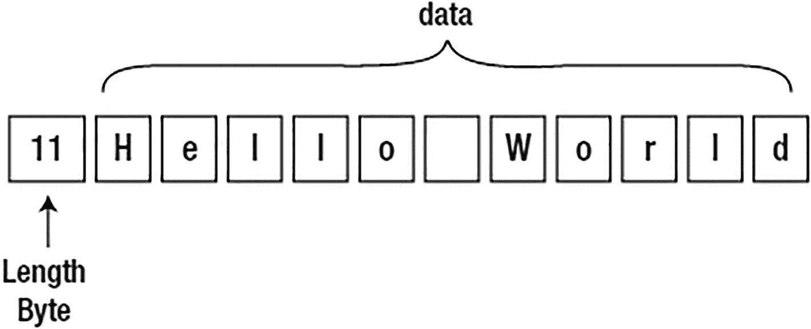
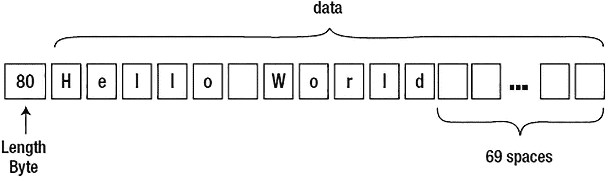

# 管理自动索引

自动索引通过内部的 `DBMS_AUTO_INDEX` PL/SQL 包进行管理。自动索引的默认模式是 `REPORT ONLY`。在此模式下，自动索引功能是开启的，但它创建的任何索引都是不可见的（意味着优化器不会使用这些索引）。

您可以在根容器级别或可插拔数据库级别启用/禁用索引。换句话说，可以仅在根容器活动中启用自动索引，而在可插拔数据库中禁用（反之亦然）。您可以按照如下方式查看自动索引的当前设置（由于我连接的是可插拔数据库，以下仅显示 PDB 级别的设置）：

```sql
$ sqlplus eoda/foo@PDB1
SQL> select con_id, parameter_name, parameter_value
from   cdb_auto_index_config
order by 1, 2;
CON_ID PARAMETER_NAME                      PARAMETER_VALUE
---------- ----------------------------------- ---------------------------
3 AUTO_INDEX_COMPRESSION              OFF
3 AUTO_INDEX_DEFAULT_TABLESPACE
3 AUTO_INDEX_MODE                     REPORT ONLY
3 AUTO_INDEX_REPORT_RETENTION         31
3 AUTO_INDEX_RETENTION_FOR_AUTO       373
3 AUTO_INDEX_RETENTION_FOR_MANUAL
3 AUTO_INDEX_SCHEMA
3 AUTO_INDEX_SPACE_BUDGET             50
```

您可以通过 `DBMS_AUTO_INDEX` 的 `CONFIGURE` 过程修改前面列出的任何参数。例如，启用自动索引功能如下所示：

```sql
SQL> exec dbms_auto_index.configure('AUTO_INDEX_MODE','IMPLEMENT');
```

同样地，您可以按如下方式禁用自动索引：

```sql
SQL> exec dbms_auto_index.configure('AUTO_INDEX_MODE','OFF');
```

一旦自动索引被启用，所有模式都成为自动管理索引的候选对象。您可以通过 `CONFIGURE` 过程修改这一点。例如，要构建一个包含列表，请按如下方式操作：

```sql
SQL> exec dbms_auto_index.configure('AUTO_INDEX_SCHEMA', 'EODA', allow => TRUE);
```

现在，如果我们运行显示配置参数的查询，将会看到包含列表：

```sql
SQL> select con_id, parameter_name, parameter_value
from   cdb_auto_index_config;
CON_ID PARAMETER_NAME               PARAMETER_VALUE
---- ----------------------------------- ---------------------------
3 AUTO_INDEX_SCHEMA                   schema IN (EODA)
```

同样地，您可以构建一个排除列表：

```sql
SQL> exec dbms_auto_index.configure('AUTO_INDEX_SCHEMA', 'EODA', allow => FALSE);
SQL> select con_id, parameter_name, parameter_value
from   cdb_auto_index_config
where parameter_name='AUTO_INDEX_SCHEMA';
CON_ID PARAMETER_NAME                      PARAMETER_VALUE
---------- ----------------------------------- ---------------------------
3 AUTO_INDEX_SCHEMA                   schema NOT IN (EODA)
```

要将 `AUTO_INDEX_SCHEMA` 的值设回默认值，请向过程传入一个 `NULL`，如下所示：

```sql
SQL> exec dbms_auto_index.configure('AUTO_INDEX_SCHEMA', NULL, allow => FALSE);
```

自动索引的某些功能只应在经过彻底测试后才使用。例如，有一个功能是删除数据库或特定模式中存在的所有二级索引。二级索引定义为那些非用于强制约束的索引。请对此功能格外谨慎！

话虽如此，接下来的这段代码将删除数据库中的所有二级索引。如果您连接的是可插拔数据库，它将只删除该可插拔数据库中的二级索引，例如：

```sql
$ sqlplus system/foo@PDB1
SQL> exec dbms_auto_index.drop_secondary_indexes;
```

如果您的数据库包含大量索引（大多数都有），那么前面的命令将需要几分钟才能运行完成。

要从特定模式删除索引，请按如下方式操作：

```sql
SQL> exec dbms_auto_index.drop_secondary_indexes('EODA',NULL);
```

要在特定表上删除二级索引，请按如下方式操作：

```sql
SQL> exec dbms_auto_index.drop_secondary_indexes('EODA','T');
```

不用说，前面提到的删除索引操作应非常谨慎地进行，并且只有在您确定它会执行您所预期的操作之后才能进行。

## 自动索引实战

现在您已经对自动索引功能有了一些背景了解，让我们启用它并观察其工作方式：

```sql
$ sqlplus system/foo@PDB1
SQL> exec dbms_auto_index.configure('AUTO_INDEX_MODE','IMPLEMENT');
PL/SQL procedure successfully completed.
```

接下来，我将创建一个测试表：

```sql
$ sqlplus eoda/foo@PDB1
SQL> create table d (d varchar2(30));
Table created.
```

现在向此表中插入一些随机数数据：

```sql
SQL> insert into d(d)
select trunc(dbms_random.value(1,100000))
from dual
connect by level <= 1000000;
1000000 rows created.
```

接着，我将创建一个 PL/SQL 循环，循环查询该表。目的是构造一条目前未使用索引，但若存在索引可能提升性能的 SQL 语句。例如：

```sql
SQL> declare
i integer;
j integer;
begin
for l_counter in 1..100000
loop
begin
select trunc(dbms_random.value(1,100000)) into i from dual;
select distinct(d) into j from d where d = i;
exception
when no_data_found then
null;
end;
end loop;
end;
/
```

在另一个会话中，以下 SQL 将报告任何自动索引活动：

```sql
SQL> set long 1000000 pagesize 0
SQL> -- 过去 24 小时的默认 TEXT 报告。
SQL> select dbms_auto_index.report_activity() from dual;
GENERAL INFORMATION

Activity start               : 09-JUL-2021 16:07:14
Activity end                 : 10-JUL-2021 16:07:14
Executions completed         : 1
Executions interrupted       : 0
Executions with fatal error  : 0

SUMMARY (AUTO INDEXES)

Index candidates            : 0
Indexes created             : 0
Space used                  : 0 B
Indexes dropped             : 0
SQL statements verified     : 0
SQL statements improved     : 0
SQL plan baselines created  : 0
Overall improvement factor  : 1x

SUMMARY (MANUAL INDEXES)

Unused indexes    : 0
Space used        : 0 B
Unusable indexes  : 0
```

根据先前的输出，尚未发生任何自动索引活动。这意味着管理自动索引的 Oracle 作业尚未执行。自动索引功能在后台由 Oracle 作业管理。您可以通过以下方式查看这些作业：

```sql
SQL> select task_id, task_name, advisor_name
from dba_advisor_tasks
where owner='SYS'
and task_name like '%_AI_%'
order by task_id;
TASK_ID TASK_NAME                      ADVISOR_NAME
---------- ------------------------------ ------------------------------
3 SYS_AI_SPM_EVOLVE_TASK         SPM Evolve Advisor
4 SYS_AI_VERIFY_TASK             SQL Performance Analyzer
```

等待几分钟，让自动索引有机会评估系统后，我将再次运行报告，查看是否已识别出任何候选索引。例如：

```sql
SQL> select dbms_auto_index.report_activity() from dual;
SUMMARY (AUTO INDEXES)

...
Index candidates            : 6
Indexes created             : 0
...
```

从报告输出可以看出，此数据库中已识别出一些候选索引。我们可以通过以下查询查看这些候选索引：

```sql
SQL> select index_owner, table_name, index_name, column_name
from dba_ind_columns
where index_name like 'SYS_AI%'
and table_name='D';
```

我们看到表 `D` 和列 `D` 上的一个索引是候选索引：

```sql
INDEX_OWNE TABLE_NAME   INDEX_NAME                COLUMN_NAME
---------- ------------ ------------------------- --------------------
EODA       D            SYS_AI_gc454q9xmxbqv      D
```

进一步深入探究，我将查询 `DBA_INDEXES` 视图，查看是否已创建任何自动索引：

```sql
SQL> select index_name, visibility
from dba_indexes
where index_name like 'SYS_AI%'
and table_name = 'D';
```

可以看到一个自动索引已被创建，目前处于 `INVISIBLE`（不可见）状态。这表明自动索引已创建索引，目前正在评估它是否会提升性能：

```sql
INDEX_NAME           VISIBILITY
-------------------- ------------------------------
SYS_AI_gc454q9xmxbqv INVISIBLE
```

等待几分钟后，再次查询 `DBA_INDEXES` 视图，显示该有用的索引已被设为可见：

```sql
INDEX_NAME           VISIBILITY
-------------------- ------------------------------
SYS_AI_gc454q9xmxbqv VISIBLE
```

我们可以通过生成执行计划来验证此索引是否正在使用中。例如：

```sql
SQL> set autotrace trace explain;
SQL> select d from d where d = 100;

| Id  | Operation         | Name                       | Rows  | Bytes | Cost (%CPU)| Time     |
|   0 | SELECT STATEMENT  |                            |   317 |  1585 |     3   (0)| 00:00:01 |
|   1 |  RESULT CACHE     | baj8hf6gf8032aquv2m2cv95ws |   317 |  1585 |     3   (0)| 00:00:01 |
|*  2 |   INDEX RANGE SCAN| SYS_AI_gc454q9xmxbqv       |   317 |  1585 |     3   (0)| 00:00:01 |
```

这是一个简单的例子，但您可以在此看到基本思路。自动索引评估系统并识别可能提升性能的索引。索引最初被创建为不可见，随后，如果该索引被判定为能提升性能，它就会被设为可见。

### 自动索引总结

这是否意味着 DBA 和应用开发人员不再需要担心索引问题了？远非如此。即使有了自动索引，您仍然需要监控系统并确保索引操作符合预期。您对数据库和应用代码的洞察力，可能是自动索引功能所不具备的。话虽如此，此功能应用于增强您的索引策略，而非完全取代它。

## 总结

在本章中，我们探讨了 Oracle 提供的不同类型的索引。我们从基础的 `B*树` 索引开始，研究了该索引的各种子类型，例如反向键索引（为 Oracle `RAC` 设计）和用于检索降序与升序混合排序数据的降序索引。我们花了一些时间讨论何时应该使用索引，以及为什么在某些情况下索引可能无效。

接着，我们介绍了位图索引，这是一种在数据仓库（读取密集型、非 `OLTP`）环境中为低到中基数数据创建索引的绝佳方法。我们涵盖了何时适合使用位图索引，以及为什么你绝不会考虑在 `OLTP` 环境——或任何需要多用户并发更新同一列的环境中使用它。

随后，我们讨论了基于函数的索引，它们实际上是 `B*树` 和位图索引的特例。基于函数的索引允许我们在列（或多列）的函数上创建索引，这意味着我们可以预先计算并存储复杂计算和用户自定义函数的结果，以便后续实现极快的索引检索。我们研究了与基于函数的索引相关的一些重要实现细节，例如必须在系统和会话级别进行哪些设置才能使用它们。接着，我们提供了使用内置 Oracle 函数和用户自定义函数的基于函数索引的示例。最后，我们探讨了基于函数索引的一些注意事项。

然后，我们考察了一种非常专业的索引类型，称为应用域索引。我们没有深入探讨如何从头构建这样一个索引（这涉及一系列漫长而复杂的步骤），而是研究了一个已实现的示例：文本索引。

接着，我们讨论了几个关于 12c 的主题：对扩展列建立索引以及在同一列组合上建立多个索引。对于扩展列的索引，这需要使用虚拟列及相关索引，或者基于函数的索引。当在同一列组合上建立索引时，必须使用不同的物理索引类型，并且只能将一个索引指定为可见。

我们还解答了一些关于索引最常见的问题，并破除了一些关于索引的迷思。本节涵盖的主题范围广泛，从简单的“索引对视图有效吗？”到更复杂和微妙的迷思“索引中的空间永远不会被重用”。我们主要通过示例来回答这些问题并破除迷思，边讲解边演示概念。

最后，我们介绍了一项新功能：自动索引。这允许你将许多索引管理功能委托给数据库。启用后，Oracle 将自动识别可以提升性能的新索引。此功能还能识别需要重建的索引以及应被移除的未使用索引。`DBA` 仍然需要管理和监控此活动，并确保自动索引功能正常运行。

## 12. 数据类型

选择正确的数据类型看似简单直接，但我多次看到人们选错了。最基本的决定——你用来存储数据的类型——将在未来多年对你的应用程序和数据产生影响。因此，选择合适的数据类型至关重要。而且事后更改也很困难——换句话说，一旦实施，你可能会被它困扰相当长一段时间。

在本章中，我们将了解所有可用的 Oracle 基本数据类型，讨论它们的实现方式以及每种类型何时适用。我们不会考察用户定义的数据类型，因为它们只是从 Oracle 内置数据类型派生出的复合对象。我们将探讨当你为任务使用了错误的数据类型——或者甚至只是使用了错误的数据类型参数（长度、精度、小数位数等）——会发生什么。到本章结束时，你将理解可用的类型、它们的实现方式、何时使用每种类型，以及同样重要的是，为什么为任务选择正确的类型是关键。


## Oracle 数据类型概览

Oracle 提供了 23 种不同的 SQL 数据类型。简要介绍如下：

### `CHAR`
一种定长字符串，会用空格填充至其最大长度。在默认的国家语言支持（`NLS`）设置下，一个非空的 `CHAR(10)` 将始终包含 10 *字节* 的信息。我们稍后将更详细地讨论 `NLS` 的影响。一个 `CHAR` 字段最多可存储 2000 *字节* 的信息。

### `NCHAR`
一种包含 `UNICODE` 格式数据的定长字符串。`Unicode` 是由 `Unicode Consortium` 制定的字符编码标准，旨在为任何语言的字符提供一种通用的编码方式，不受计算机系统或平台的限制。`NCHAR` 类型允许数据库包含两种不同字符集的数据：`CHAR` 类型和 `NCHAR` 类型分别使用数据库的字符集和国家字符集。一个非空的 `NCHAR(10)` 将始终包含 10 *字符* 的信息（注意，它在这方面与 `CHAR` 类型不同）。一个 `NCHAR` 字段最多可存储 2000 *字节* 的信息。

### `VARCHAR2`
目前也与 `VARCHAR` 同义。这是一种变长字符串，与 `CHAR` 类型的区别在于它不会被填充空格至最大长度。在默认的 `NLS` 设置下，一个 `VARCHAR2(10)` 可以包含 0 到 10 *字节* 的信息。一个 `VARCHAR2` 最多可存储 4000 字节的信息。从 Oracle 12c 开始，可以配置 `VARCHAR2` 以存储最多 32,767 字节的信息（详情请参阅本章的“扩展数据类型”部分）。

### `NVARCHAR2`
一种包含 `UNICODE` 格式数据的变长字符串。一个 `NVARCHAR2(10)` 可以包含 0 到 10 *字符* 的信息。一个 `NVARCHAR2` 最多可存储 4,000 字节的信息。从 Oracle 12c 开始，可以配置 `NVARCHAR2` 以存储最多 32,767 字节的信息（详情请参阅本章的“扩展数据类型”部分）。

### `RAW`
一种变长二进制数据类型，意味着存储在此数据类型中的数据不会进行字符集转换。它被视为一串二进制字节信息，将仅由数据库存储。一个 `RAW` 最多可存储 2000 字节的信息。从 Oracle 12c 开始，可以配置 `RAW` 以存储最多 32,767 字节的信息（详情请参阅本章的“扩展数据类型”部分）。

### `NUMBER`
此数据类型能够存储精度高达 38 位的数字。这些数字的范围在 1.0x10(–130) 到但不包括 1.0x10(126) 之间。每个数字都存储在一个*变长*字段中，长度在 0 字节（对于 `NULL`）到 22 字节之间变化。Oracle `NUMBER` 类型非常精确——远比许多编程语言中常见的 `FLOAT` 和 `DOUBLE` 类型精确得多。

### `BINARY_FLOAT`
这是一个 32 位单精度浮点数。它至少支持六位数的精度，并在磁盘上占用 5 字节的存储空间。

### `BINARY_DOUBLE`
这是一个 64 位双精度浮点数。它至少支持 15 位数的精度，并在磁盘上占用 9 字节的存储空间。

### `LONG`
此类型能够存储最多 2GB 的字符数据（2 *千兆字节*，而非字符，因为在多字节字符集中每个字符可能占用多个字节）。`LONG` 类型有许多限制（我稍后会讨论），这些限制是为了向后兼容而存在的，因此强烈建议不要在新应用中使用此类型。在可能的情况下，请在现有应用中将 `LONG` 类型转换为 `CLOB` 类型。

### `LONG RAW`
`LONG RAW` 类型能够存储最多 2GB 的二进制信息。基于与 `LONG` 类型相同的理由，建议在所有未来的开发中使用 `BLOB` 类型，并且在可能的情况下，也应在现有应用中使用它。

### `DATE`
这是一个定宽的 7 字节日期/时间数据类型。它始终包含七个属性：世纪、世纪中的年份、月份、日、小时、分钟和秒。

### `TIMESTAMP`
这是一个定宽的 7 或 11 字节日期/时间数据类型（取决于精度）。它与 `DATE` 数据类型的区别在于它可以包含小数秒；对于带小数秒的 `TIMESTAMP`，小数点后最多可保留九位数字。

### `TIMESTAMP WITH TIME ZONE`
这是一个定宽的 13 字节日期/时间数据类型，但它还提供了 `时区` 支持。关于时区的额外信息与时间戳一起存储在数据中，因此最初插入时的 `时区` 会与数据一起保留。

### `TIMESTAMP WITH LOCAL TIME ZONE`
这是一个定宽的 7 或 11 字节日期/时间数据类型（取决于精度），类似于 `TIMESTAMP`；但是，它是时区敏感的。在数据库中修改时，会参考数据提供的 `时区`，并将日期/时间组件规范化为本地数据库时区。因此，如果你使用 `US/Pacific` 时区插入一个日期/时间，而数据库时区是 `US/Eastern`，最终的日期/时间信息将被转换为 `东部` 时区并存储为 `TIMESTAMP`。在检索时，存储在数据库中的 `TIMESTAMP` 将被转换为会话时区的时间。

### `INTERVAL YEAR TO MONTH`
这是一个定宽的 5 字节数据类型，用于存储一段时间长度，在此情况下表示为年数和月数。你可以在日期运算中使用间隔，从 `DATE` 或 `TIMESTAMP` 类型中加减一段时间。

### `INTERVAL DAY TO SECOND`
这是一个定宽的 11 字节数据类型，用于存储一段时间长度，在此情况下表示为天数以及小时数、分钟数和秒数，可选地最多包含九位小数秒。

### `BLOB`
此数据类型允许在 Oracle 中存储最多 (4 千兆字节 – 1) * (数据库块大小) 字节的数据。`BLOB` 包含不受字符集转换影响的“二进制”信息。这是存储电子表格、文字处理文档、图像文件等的合适类型。

### `CLOB`
此数据类型允许在 Oracle 中存储最多 (4 千兆字节 –1) * (数据库块大小) 字节的数据。`CLOB` 包含受字符集转换影响的信息。这是存储*大型*纯文本信息的合适类型。请注意，我说的是*大型*纯文本信息；如果你的纯文本数据小于或等于 4000 字节，则此数据类型不合适——对于这种情况，你需要使用 `VARCHAR2` 数据类型。

### `NCLOB`
此数据类型允许在 Oracle 中存储最多 (4 千兆字节 – 1) * (数据库块大小) 字节的数据。`NCLOB` 存储以数据库的国家字符集编码的信息，并像 `CLOB` 一样受字符集转换的影响。

### `BFILE`
此数据类型允许你在数据库列中存储一个 Oracle 目录对象（指向操作系统目录的指针）和一个文件名，并读取此文件。这实际上允许你以只读方式访问数据库服务器上可用的操作系统文件，就好像它们存储在数据库表本身中一样。

### `ROWID`
`ROWID` 实际上是数据库中一行的 10 字节地址。`ROWID` 中编码了足够的信息来定位磁盘上的行，并识别 `ROWID` 指向的对象（表等）。

### `UROWID`
`UROWID` 是通用 `ROWID`，用于那些没有固定 `ROWID` 的表，例如 `IOT`（索引组织表）和通过异构数据库网关访问的表。`UROWID` 是行主键值的表示，因此其大小会因其指向的对象而异。


*   `JSON`：Oracle 21c 的新特性之一是 `JSON` 数据类型。你现在可以以二进制格式将 `JSON` 数据原生存储在数据库中。

前面的列表中显然缺少许多类型，例如 `INT`、`INTEGER`、`SMALLINT`、`FLOAT`、`REAL` 等。这些类型实际上是在前面列表中的某个基础类型之上实现的——也就是说，它们是 Oracle 原生类型的**同义词**。此外，诸如 `XMLType`、`SYS.ANYTYPE` 和 `SDO_GEOMETRY` 之类的数据类型未列出，因为本书不作讲解。它们是复杂的对象类型，由属性集合以及操作这些属性的方法（函数）组成。它们由前面列出的基本数据类型构成，并非传统意义上的真正数据类型，而是一种实现、一组功能，供你在应用程序中使用。

现在，让我们更详细地了解这些基本数据类型。

## 字符和二进制字符串类型

Oracle 中的字符数据类型是 `CHAR`、`VARCHAR2` 及其 “`N`” 变体。`CHAR` 和 `NCHAR` 最多可存储 2000 字节的文本。`VARCHAR2` 和 `NVARCHAR2` 最多可存储 4000 字节的信息。

> **注意**
>
> 从 Oracle 12c 开始，可以配置 `VARCHAR2`、`NVARCHAR2` 和 `RAW` 数据类型以存储最多 32,767 字节的信息。默认情况下不启用扩展数据类型；因此，除非明确配置，否则 `VARCHAR2` 和 `NVARCHAR2` 数据类型的最大大小仍为 4000 字节，`RAW` 为 2000 字节。有关更多详细信息，请参阅本章后面的“扩展数据类型”部分。

文本根据数据库的需要在各种字符集之间进行转换。`字符集`是用比特和字节表示单个字符的二进制形式。有许多不同的字符集可用，每种都能表示不同的字符，例如：

*   `US7ASCII` 字符集是 128 个字符的 ASCII 标准表示。它使用一个字节的低 7 位来表示这 128 个字符。
*   `WE8MSWIN1252` 字符集是一种西欧字符集，能够使用一个字节的所有 8 位来表示 128 个 ASCII 字符以及 128 个扩展字符。

在我们深入探讨 `CHAR`、`VARCHAR2` 及其 “`N`” 变体的细节之前，先粗略了解一下这些不同字符集对我们的意义会很有帮助。

### NLS 概述

如前所述，`NLS` 代表 `国家语言支持`。`NLS` 是数据库一个非常强大的功能，但往往未被充分理解。`NLS` 控制着数据的许多方面。例如，它控制数据的排序方式，以及我们看到的数字是逗号加一个句点（例如，1,000,000.01）还是多个句点加一个逗号（例如，1.000.000,01）。但最重要的是，它控制以下方面：

*   作为持久化数据存储在磁盘上的文本数据的编码
*   数据在字符集之间的透明转换

正是这种透明部分最令人困惑——它是如此透明，你甚至看不到它的发生。让我们看一个简单的例子。

假设你在数据库中使用 `WE8MSWIN1252` 字符集存储 8 位数据，但你有一些客户端使用 7 位字符集（如 `US7ASCII`）进行连接。这些客户端不期望接收 8 位数据，需要将来自数据库的数据转换为它们可以使用的格式。虽然这听起来很好，但如果你没有意识到它的发生，那么随着时间的推移，你很可能会发现你的数据丢失了字符，因为在 `US7ASCII` 中不可用的字符被转换成了某些可用的字符。这是由于进行了字符集转换。简而言之，如果你以字符集 1 从数据库检索数据，将其转换为字符集 2，然后再插回去（逆转这个过程），那么你很有可能已经实质性地修改了数据。字符集转换通常是一个会改变数据的过程，而且你通常是将一大组字符（在此示例中是 8 位字符集）映射到一个较小的集合（7 位字符集）。这是一种`有损转换`——字符会被修改，因为根本不可能表示每一个字符。但这种转换必须发生。如果数据库以单字节字符集存储数据，但客户端（例如 Java 应用程序，因为 Java 语言使用 Unicode）期望的是多字节表示，那么为了客户端应用程序能够使用它，就必须进行转换。

你可以非常容易地看到字符集转换。例如，我有一个数据库，其字符集设置为 `WE8MSWIN1252`，这是一个典型的西欧字符集：

```
$ sqlplus eoda/foo@PDB1
SQL> select *  from nls_database_parameters where parameter = 'NLS_CHARACTERSET';
PARAMETER                      VALUE
------------------------------ ----------------------------------------
NLS_CHARACTERSET               WE8MSWIN1252
```

现在，如果我确保我的 `NLS_LANG` 设置与我的数据库字符集相同（Windows 用户会在注册表中更改/验证此设置）：

```
SQL> host echo $NLS_LANG
AMERICAN_AMERICA.WE8MSWIN1252
```

我可以创建一个表并插入一些“8 位”数据。这些数据对于期望仅使用 7 位 ASCII 数据的 7 位客户端来说是不可用的：

```
SQL> create table t ( data varchar2(1) );
Table created.
SQL> insert into t values ( chr(224) );
1 row created.
SQL> insert into t values ( chr(225) );
1 row created.
SQL> insert into t values ( chr(226) );
1 row created.
SQL> select data, dump(data) dump from t;
D DUMP
- --------------------
à Typ=1 Len=1: 224
á Typ=1 Len=1: 225
â Typ=1 Len=1: 226
SQL> commit;
```

> **注意**
>
> 如果你自己做这个例子但没有看到上面的输出，请确保你的终端客户端软件本身使用的是 UTF-8 字符集。否则，它在打印到屏幕时可能会转换字符！UNIX 的常见终端模拟器通常是 7 位 ASCII。这同样影响 Windows 和 UNIX/Linux 用户。请确保你的终端可以显示这些字符。

现在，如果我转到另一个窗口并指定一个 7 位 ASCII 客户端，我会看到截然不同的结果：


## SQL DUMP 函数

```
$ export NLS_LANG=AMERICAN_AMERICA.US7ASCII
$ sqlplus eoda/foo@PDB1
SQL> select data, dump(data) dump from t;
D DUMP
- --------------------
a Typ=1 Len=1: 224
a Typ=1 Len=1: 225
a Typ=1 Len=1: 226
```

请注意，在 7 位会话中，我收到了三次字母“a”，没有带变音符号。然而，`DUMP` 函数向我显示，在数据库中实际上存在三个独立且不同的字符，而不仅仅是字母“a。”数据库中的数据并未改变——只是此客户端接收到的值变了。如果此客户端按如下方式将数据检索到主机变量中：

```
SQL> variable d varchar2(1)
SQL> variable r varchar2(20)
SQL> begin
select data, rowid into :d, :r from t where rownum = 1;
end;
/
PL/SQL procedure successfully completed.
```

然后，接下来，什么都不做，只是将其发送回数据库：

```
SQL> update t set data = :d where rowid = chartorowid(:r);
1 row updated.
SQL> commit;
Commit complete.
```

我将在原始的 8 位会话中观察到，我丢失了其中一个原始字符。它已被卑微的 7 位 `a` 所取代，而不是我之前那个花哨的 `à`。

```
SQL> select data, dump(data) dump from t;
D DUMP
- --------------------
a Typ=1 Len=1: 97
á Typ=1 Len=1: 225
â Typ=1 Len=1: 226
```

Oracle SQL 的 `DUMP` 函数允许您显示数据类型代码、字节长度以及数据值的内部表示（也可以选择显示字符集名称）。其语法如下：

```
DUMP( expression [,return_format] [,start_position] [,length] )
```

默认的 `return_format` 是 10（十进制），可以是以下任意值：8、10、16、17、1008、1010、1016 或 1017，其中 8 表示八进制表示法，10 表示十进制，16 表示十六进制，17 表示单字符，1008 表示带字符集名称的八进制，1010 表示带字符集名称的十进制，1016 表示带字符集名称的十六进制，1017 表示带字符集名称的单字符。以下示例转储有关“a”字符的信息：

```
SQL> select dump('a'), dump('a',8), dump('a',16) from dual;
DUMP('A')        DUMP('A',8)       DUMP('A',16)
---------------- ----------------- ----------------
Typ=96 Len=1: 97 Typ=96 Len=1: 141 Typ=96 Len=1: 61
```

其中，97、141 和 61 分别是“a”字符的十进制、八进制和十六进制表示法对应的 ASCII 码。返回的数据类型代码 `Typ=96` 表示 `CHAR` 数据类型（完整的 Oracle 数据类型代码和含义列表请参阅 *Oracle Database SQL Language Reference* 手册）。

这展示了在异构字符集环境中的直接影响，即客户端和数据库使用不同的 NLS 设置。这是需要注意的事情，因为它在许多情况下都会发挥作用。例如，如果 DBA 使用已弃用的遗留 `EXP` 工具来提取信息，他们可能会观察到以下警告：

```
Export done in US7ASCII character set and UTF8 NCHAR character set
server uses WE8MSWIN1252 character set (possible charset conversion)
About to export specified tables via Conventional Path
...
```

此类警告应受到高度重视。如果您导出此表的目的是先删除该表，然后使用 `IMP` 重新创建它，您会发现该表中的*所有*数据现在都变成了卑微的 7 位数据！请注意意外的字符集转换。

**注意：** 意外字符集转换的问题并不影响每个工具，也不以相同的方式影响每个工具。例如，如果您使用推荐的 Data Pump 导出/导入流程，您会发现导出始终以包含数据的数据库的字符集进行，无论客户端的 NLS 设置如何。这是因为 Data Pump 在数据库服务器本身中运行；它根本不是一个客户端工具。同样，Data Pump 导入总是将要导入的文件中的数据从源数据库的字符集转换为目标数据库的字符集——这意味着使用 Data Pump 时字符集转换仍然可能发生（如果源数据库和目标数据库的字符集不同），但方式与遗留的 `EXP`/`IMP` 工具不同！

但也要注意，一般来说，字符集转换是必要的。如果客户端期望以特定字符集接收数据，向它们发送不同字符集的信息将是灾难性的。

**注意：** 我强烈建议每个人都通读一遍 *Oracle Database Globalization Support Guide* 文档。它涵盖了 NLS 相关问题的深度是我们在此无法涉及的。任何创建将在全球（甚至跨国界）使用的应用程序的人都需要掌握该文档中包含的信息。

现在我们已经对字符集及其对我们的影响有了初步的了解，接下来让我们看看 Oracle 提供的字符串类型。

### 字符串

Oracle 中有四种基本字符串类型，即 `CHAR`、`VARCHAR2`、`NCHAR` 和 `NVARCHAR2`。所有字符串在 Oracle 中都以相同的格式存储。在数据库块上，它们会有一个 1-3 字节的引导长度字段，后跟数据；当它们为 `NULL` 时，会表示为单字节值 `0xFF`。

> **注意**
> 尾随的 `NULL` 列在 Oracle 中不占用存储空间（`0` 字节）。这意味着，如果表中的最后一列是 `NULL`，Oracle 不会为其存储任何内容。如果最后两列都是 `NULL`，则两者都不会存储任何内容。但如果在位置上位于 `NULL` 列之后的任何列*不为 NULL*，那么 Oracle 将使用本节描述的空值标志来指示缺失值。

如果字符串的长度小于或等于 250（`0x01` 到 `0xFA`），Oracle 将使用 `1` 字节来存储长度。所有长度超过 250 字节的字符串将有一个标志字节 `0xFE`，后跟表示长度的 `2` 个字节。因此，一个存储了 `Hello World` 字样的 `VARCHAR2(80)` 在块上可能如图 12-1 所示。


图 12-1
存储在 VARCHAR2(80) 中的 Hello World

另一方面，存储相同数据的 `CHAR(80)` 则如图 12-2 所示。


图 12-2
存储在 CHAR(80) 中的 Hello World

事实上，`CHAR`/`NCHAR` 不过是 `VARCHAR2`/`NVARCHAR2` 的伪装，这让我认为实际上只需要考虑两种字符串类型，即 `VARCHAR2` 和 `NVARCHAR2`。我从未在任何应用程序中发现 `CHAR` 类型的用处。由于 `CHAR` 类型*总是*用空白填充结果字符串以达到固定宽度，我们很快就会发现它在表段和任何索引段中都消耗了最大存储空间。这已经够糟糕了，但还有另一个重要原因要避免使用 `CHAR`/`NCHAR` 类型：它们会在需要检索此信息的应用程序中造成混淆（许多应用程序在存储数据后“找不到”其数据）。原因与字符串比较的规则以及执行这些规则的严格程度有关。让我们用一个简单表中的 `'Hello World'` 字符串来演示：

```
$ sqlplus eoda/foo@PDB1
SQL> create table t  (
char_column      char(20),
varchar2_column  varchar2(20));
Table created.
SQL> insert into t values ( 'Hello World', 'Hello World' );
1 row created.
SQL> select * from t;
CHAR_COLUMN          VARCHAR2_COLUMN
-------------------- --------------------
Hello World          Hello World
SQL> select * from t where char_column = 'Hello World';
CHAR_COLUMN          VARCHAR2_COLUMN
-------------------- --------------------
Hello World          Hello World
SQL> select * from t where varchar2_column = 'Hello World';
CHAR_COLUMN          VARCHAR2_COLUMN
-------------------- --------------------
Hello World          Hello World
```

到目前为止，这些列看起来是一样的，但实际上，发生了一些隐式转换，`CHAR(11)` 字面量 ‘Hello World’ 被提升为 `CHAR(20)`，并在与 `CHAR` 列比较时进行了空白填充。这一定发生了，因为带尾随空格的 `Hello World.........` 与不带尾随空格的 `Hello World` *不一样*。我们可以确认这两个字符串在实质上是不同的：

```
SQL> select * from t where char_column = varchar2_column;
no rows selected
```

它们彼此不相等。我们必须将 `VARCHAR2_COLUMN` 空白填充为 `20` 字节长度，或者修剪 `CHAR_COLUMN` 的尾随空格，如下所示：

```
SQL> select * from t where trim(char_column) = varchar2_column;
CHAR_COLUMN          VARCHAR2_COLUMN
-------------------- --------------------
Hello World          Hello World
SQL> select * from t where char_column = rpad( varchar2_column, 20 );
CHAR_COLUMN          VARCHAR2_COLUMN
-------------------- --------------------
Hello World          Hello World
```

> **注意**
> 有许多方法可以空白填充 `VARCHAR2_COLUMN`，例如使用 `CAST()` 函数。

当使用可变长度字符串的应用程序绑定输入时，问题就出现了，随之而来的肯定是“未找到数据”：

```
SQL> variable varchar2_bv varchar2(20)
SQL> exec :varchar2_bv := 'Hello World';
PL/SQL procedure successfully completed.
SQL> select * from t where char_column = :varchar2_bv;
no rows selected
SQL> select * from t where varchar2_column = :varchar2_bv;
CHAR_COLUMN          VARCHAR2_COLUMN
-------------------- --------------------
Hello World          Hello World
```

所以在这里，搜索 `VARCHAR2` 字符串有效，但 `CHAR` 列无效。`VARCHAR2` 绑定变量不会像字符串字面量那样被提升为 `CHAR(20)`。此时，许多程序员会形成这样的观点：“绑定变量不起作用；我们必须使用字面量。”这将是一个非常糟糕的决定。解决方案是使用 `CHAR` 类型进行绑定：

```
SQL> variable char_bv char(20)
SQL> exec :char_bv := 'Hello World';
PL/SQL procedure successfully completed.
SQL>
SQL> select * from t where char_column = :char_bv;
CHAR_COLUMN          VARCHAR2_COLUMN
-------------------- --------------------
Hello World          Hello World
SQL> select * from t where varchar2_column = :char_bv;
CHAR_COLUMN          VARCHAR2_COLUMN
-------------------- --------------------
Hello World          Hello World
```

然而，如果你混合使用 `VARCHAR2` 和 `CHAR`，你会不断遇到这个问题。不仅如此，开发人员现在还必须在他们的应用程序中考虑字段宽度。如果开发人员选择使用 `RPAD()` 技巧将绑定变量转换为可与 `CHAR` 字段比较的形式（当然，更可取的是填充绑定变量，而不是 `TRIM` 数据库列，因为对列应用 `TRIM` 函数很容易使其无法使用该列上的现有索引），他们将不得不担心列长度随时间的变化。如果字段的大小发生变化，那么应用程序就会受到影响，因为它必须更改其字段宽度。

正是由于这些原因——固定宽度的存储倾向于使表和相关索引比正常情况大得多，再加上绑定变量问题——我在所有情况下都避免使用 `CHAR` 类型。我甚至无法在单字符字段的情况下为其辩护，因为在这种情况下，它确实没有实质性的区别。`VARCHAR2(1)` 和 `CHAR(1)` 在所有方面都是相同的。在这种情况下没有令人信服的理由使用 `CHAR` 类型，为了避免任何混淆，我“直接说不”，即使是 `CHAR(1)` 字段也是如此。

#### 字符串语法

四种基本字符串类型的语法很简单，如表 12-1 所述。

表 12-1
四种基本字符串类型

| 字符串类型 | `<SIZE>` |
| --- | --- |
| `VARCHAR2( <SIZE> <BYTE\|CHAR> )` | 一个介于 `1` 和 `4000` 之间的数字，最多可存储 `4000` 字节。在下一节中，我们将详细研究该子句中 `BYTE` 与 `CHAR` 修饰符的差异和细微差别。从 `12c` 开始，你可以配置 `VARCHAR2` 以存储最多 `32,767` 字节的信息。 |
| `CHAR( <SIZE> <BYTE\|CHAR> )` | 一个介于 `1` 和 `2000` 之间的数字，最多可存储 `2000` 字节。 |
| `NVARCHAR2( <SIZE> )` | 一个大于 `0` 的数字，其上限由你的国家字符集决定。从 `12c` 开始，你可以配置 `NVARCHAR2` 以存储最多 `32,767` 字节的信息。 |
| `NCHAR( <SIZE> )` | 一个大于 `0` 的数字，其上限由你的国家字符集决定。 |

### 字节或字符

`VARCHAR2` 和 `CHAR` 类型支持两种指定长度的方法：

*   *按字节*：`VARCHAR2(10 byte)`。这将支持最多 10 字节的数据，在多字节字符集中可能只有两个字符。请记住，在多字节字符集中，字节与字符不是一回事！

*   *按字符*：`VARCHAR2(10 char)`。这将支持最多十个*字符*的数据，可能高达 40 字节的信息。此外，`VARCHAR2(4000 CHAR)` 理论上支持最多 4000 个字符的数据，但由于 Oracle 中字符串数据类型的限制为 4000 字节，你可能无法存储那么多字符。参见以下示例。

当使用多字节字符集（如 `UTF8`）时，强烈建议在 `VARCHAR2`/`CHAR` 定义中使用 `CHAR` 修饰符——即使用 `VARCHAR2(80 CHAR)`，而不是 `VARCHAR2(80)`，因为你的意图很可能是定义一个实际能存储 80 个字符数据的列。你也可以使用会话或系统参数 `NLS_LENGTH_SEMANTICS` 将默认行为从 `BYTE` 更改为 `CHAR`。我不建议在系统级别更改此设置；而应在数据库模式安装脚本中将其作为 `ALTER SESSION` 设置的一部分使用。任何要求数据库具有特定 NLS 设置的应用程序都是不友好的应用程序。此类应用程序通常无法安装到具有其他不希望使用这些设置、但依赖默认设置的应用程序的数据库中。

另一个需要记住的重要事情是，`VARCHAR2` 中存储的字节数上限是 4000。然而，即使你指定了 `VARCHAR2(4000 CHAR)`，你可能也无法在该字段中容纳 4000 个字符。事实上，如果你选择的字符集中所有字符都需要 4 字节来表示，你可能只能在该字段中容纳 1000 个字符！关于 4000 字节的限制，从 12c 开始，可以将 `VARCHAR2` 配置为最多存储 32,767 字节的信息。

下面的小例子演示了 `BYTE` 和 `CHAR` 之间的差异以及上限如何起作用。我们将创建一个包含三列的表，前两列分别是 1 字节和 1 字符，最后一列是 4000 字符。请注意，我们是在使用字符集 `AL32UTF8` 的多字节字符集数据库上执行此测试，该字符集支持最新版本的 Unicode 标准，并使用 1 到 4 个字节以可变长度方式对每个字符进行编码：

```
$ sqlplus eoda/foo@PDB1
SQL> select * from nls_database_parameters where parameter = 'NLS_CHARACTERSET';
PARAMETER                      VALUE
------------------------------ --------------------
NLS_CHARACTERSET               AL32UTF8
SQL> create table t
( a varchar2(1),
b varchar2(1 char),
c varchar2(4000 char));
Table created.
```

现在，如果我们尝试向表中插入一个在 UTF 中占 2 字节长的单个字符，我们会观察到以下情况：

```
SQL> insert into t (a) values (unistr('\00d6'));
insert into t (a) values (unistr('\00d6'))
*
ERROR at line 1:
ORA-12899: value too large for column "EODA"."T"."A" (actual: 2, maximum: 1)
```

这个例子展示了两点：

*   `VARCHAR2(1)` 是按字节，而不是按字符。我们有一个 Unicode 字符，但它无法放入单个字节中。
*   当你将应用程序从单字节定宽字符集迁移到多字节字符集时，你可能会发现曾经适合你字段的文本不再适合。

第二点的原因是，单字节字符集中的 20 字符字符串长度为 20 字节，绝对可以放入 `VARCHAR2(20)` 中。然而，在多字节字符集中，20 字符字段的长度可能高达 80 字节，而 20 个 Unicode 字符很可能无法在 20 字节内容纳。你可能需要考虑将你的 DDL 修改为 `VARCHAR2(20 CHAR)`，或者在运行 DDL 创建表时使用前面提到的 `NLS_LENGTH_SEMANTICS` 会话参数。

如果我们将该单个字符插入到设置为容纳单个字符的字段中，我们将观察到以下情况：

```
SQL> insert into t (b) values (unistr('\00d6'));
1 row created.
SQL> select length(b), lengthb(b), dump(b) dump from t;
LENGTH(B) LENGTHB(B) DUMP
---------- ---------- --------------------
1          2 Typ=1 Len=2: 195,150
```

该 `INSERT` 成功了，我们可以看到插入数据的 `LENGTH` 是一个字符——所有字符串函数都是*按字符*工作的。因此，该字段的长度是一个字符，但 `LENGTHB`（以字节为单位的长度）函数显示它占用 2 字节存储，`DUMP` 函数向我们确切展示了这些字节是什么。因此，这个例子展示了人们在使用多字节字符集时遇到的一个非常常见的问题，即 `VARCHAR2(N)` 不一定容纳 N 个*字符*，而是 N 个*字节*。

注意

下一个示例适用于未启用扩展数据类型的数据库。

人们经常遇到的下一个问题是 `VARCHAR2` 的最大字节长度是 4000，而 `CHAR` 的是 2000：

```
SQL> declare
l_data varchar2(4000 char);
l_ch   varchar2(1 char) := unistr( '\00d6' );
begin
l_data := rpad( l_ch, 4000, l_ch );
insert into t ( c )  values ( l_data );
end;
/
declare
*
ERROR at line 1:
ORA-01461: can bind a LONG value only for insert into a LONG column
ORA-06512: at line 6
```

这表明一个 4000 字符长、实际上是 8000 字节的字符串无法永久存储在 `VARCHAR2(4000 CHAR)` 字段中。它在 PL/SQL 变量中可以容纳，因为在那里 `VARCHAR2` 允许最大为 32KB。然而，当存储在表中时，硬限制是 4000 字节。我们可以成功存储 2000 个这样的字符：

```
SQL> declare
l_data varchar2(4000 char);
l_ch   varchar2(1 char) := unistr( '\00d6' );
begin
l_data := rpad( l_ch, 2000, l_ch );
insert into t ( c ) values ( l_data );
end;
/
PL/SQL procedure successfully completed.
SQL> select length( c ), lengthb( c ) from t where c is not null;
LENGTH(C)  LENGTHB(C)
---------- ----------
2000       4000
```

如你所见，它们消耗了 4000 字节的存储空间。

### “N”变体

那么，`NVARCHAR2` 和 `NCHAR`（为完整起见）有什么用呢？它们用于需要管理和存储多个字符集的系统中。这通常发生在主要字符集是单字节定宽字符集（如 `WE8MSWIN1252`）的数据库中，但又需要维护和存储一些多字节数据。许多系统拥有遗留数据但需要为一些新应用程序支持多字节数据；同样，有些系统希望为大多数操作使用单字节字符集的效率（在使用定宽字符的字符串上进行字符串操作比在每个字符可能使用不同字节数的字符串上更高效），但在某些时候又需要多字节数据的灵活性。

`NVARCHAR2` 和 `NCHAR` 数据类型满足这一需求。它们通常与对应的 `VARCHAR2` 和 `CHAR` 相同，但有以下例外：

*   它们的文本以数据库的国家字符集（national character set）而非默认字符集进行存储和管理。
*   它们的长度始终以字符为单位提供，而 `CHAR`/`VARCHAR2` 可以指定字节或字符。

你可以按如下方式查看数据库的国家字符集：

```
SQL>  select * from nls_database_parameters where parameter = 'NLS_CHARACTERSET';
PARAMETER                 VALUE
------------------------- -------------------------
NLS_CHARACTERSET          AL32UTF8
```

这使得 `NCHAR` 和 `NVARCHAR` 类型仅适用于存储多字节数据。

## 二进制字符串：RAW 类型

Oracle 支持存储二进制数据以及文本。二进制数据不受我们之前讨论的与 `CHAR` 和 `VARCHAR2` 类型相关的字符集转换影响。因此，二进制数据类型不适合存储用户提供的文本，但适合存储加密信息——加密数据不是“文本”，而是原始文本的二进制表示，或包含二进制标记信息的字处理文档等。任何不应被数据库视为“文本”（或任何其他基本数据类型，如数字、日期等）且不应对其应用字符集转换的字节串，都应存储在二进制数据类型中。

Oracle 支持三种用于存储二进制数据的类型：

*   `RAW` 类型，这是我们本节的重点，适用于存储大小不超过 2000 字节的 `RAW` 数据。从 12c 版本开始，你可以配置一个 `RAW` 列来存储最多 32,767 字节的信息。
*   `BLOB` 类型，支持更大型的二进制数据。我们将把这部分内容留到本章后面的“LOB 类型”一节再讨论。
*   `LONG RAW` 类型，出于向后兼容性而支持，不应用于新的应用程序。

二进制 `RAW` 类型的语法很简单：

```
RAW(  )
```

例如，以下代码创建了一个表，该表每行能够存储 16 字节的二进制信息：

```
SQL> create table t ( raw_data raw(16) );
Table created.
```

就磁盘存储而言，`RAW` 类型与 `VARCHAR2` 类型非常相似。`RAW` 类型是变长二进制字符串，这意味着刚刚创建的表 `T` 可能存储从 0 到 16 字节不等的二进制数据。它不会像 `CHAR` 类型那样被填充。

在处理 `RAW` 数据时，你可能会发现它会被隐式转换为 `VARCHAR2` 类型——也就是说，许多工具（如 SQL*Plus）不会直接显示 `RAW` 数据，而是将其转换为十六进制格式进行显示。在下面的例子中，我们使用 `SYS_GUID()`（一个返回全局唯一的 16 字节 `RAW` 字符串的内置函数，GUID 代表全局唯一标识符）在我们的表中创建一些二进制数据：

```
SQL> insert into t values ( sys_guid() );
1 row created.
SQL> select * from t;
RAW_DATA
--------------------------------------------------------------------------------
EEF18AA30B563AF0E043B7D04F0A4A30
```

你可以立即注意到两件事。首先，`RAW` 数据看起来像一个字符串。这只是 SQL*Plus 检索和打印它的方式；它在磁盘上的存储方式并非如此。SQL*Plus 无法在屏幕上打印任意二进制数据，因为这可能会对显示产生严重影响。请记住，二进制数据可能包括控制字符，例如回车或换行——或者可能是 Ctrl+G 字符，这会导致终端发出蜂鸣声。

其次，`RAW` 数据看起来远大于 16 字节——实际上，在此示例中，你可以看到 32 个字符。这是因为每个二进制字节需要两个十六进制字符来显示（如果前导字符是零，则不显示该零）。存储的 `RAW` 数据实际上是 16 字节长，你可以使用 Oracle SQL 的 `DUMP` 函数看到这一点。在这里，我转储二进制字符串的值，并使用可选参数指定显示每个字节值时应使用的基数。我使用的是基数 16，这样我们就可以比较转储结果与之前的字符串：

```
SQL> select dump(raw_data,16) from t;
DUMP(RAW_DATA,16)
----------------------------------------------------------------------------------------------------
Typ=23 Len=16: ee,f1,8a,a3,b,56,3a,f0,e0,43,b7,d0,4f,a,4a,30
```

因此，`DUMP` 向我们显示这个二进制字符串实际上是 16 字节长 (`Len=16`)，并逐字节显示二进制数据。如我们所见，此转储显示与 SQL*Plus 将 `RAW` 数据获取到字符串时执行的隐式转换相匹配。这种隐式转换在另一个方向上同样有效：

```
SQL> insert into t values ( 'abcdef' );
1 row created.
```

这插入的并不是字符串 `'abcdef'`，而是一个 3 字节的 `RAW`，其字节为 `AB`、`CD`、`EF`，或者以十进制表示，字节为 `171, 205, 239`。如果你尝试使用不包含有效十六进制字符的字符串，你将收到错误消息：

```
SQL> insert into t values ( 'abcdefgh' );
insert into t values ( 'abcdefgh' )
*
ERROR at line 1:
ORA-01465: invalid hex number
```

`RAW` 类型可以被索引并在谓词中使用——它的功能性与其他数据类型一样。但是，你必须注意避免不需要的隐式转换，并且你必须意识到它们会发生。

我更喜欢并推荐在所有情况下都使用显式转换，可以使用以下内置函数执行：

*   `HEXTORAW`：将十六进制字符字符串转换为 `RAW` 类型
*   `RAWTOHEX`：将 `RAW` 字符串转换为十六进制字符串

当 SQL*Plus 将 `RAW` 类型获取到字符串时，会隐式调用 `RAWTOHEX` 函数，而在插入字符串时会隐式调用 `HEXTORAW` 函数。避免隐式转换并在编码时始终保持显式是一种好的实践。因此，前面的示例本可以写成如下形式：

```
SQL> select rawtohex(raw_data) from t;
RAWTOHEX(RAW_DATA)
--------------------------------------------------------------------------------
EEF18AA30B563AF0E043B7D04F0A4A30
SQL> insert into t values ( hextoraw('abcdef') );
1 row created.
```


## 扩展数据类型

在 Oracle 12c 之前，`VARCHAR2` 和 `NVARCHAR2` 数据类型允许的最大长度是 4000 字节，`RAW` 数据类型是 2000 字节。从 Oracle 12c 开始，这些数据类型可以被配置为最多存储 32,767 字节。下面列出的是为非容器（有关数据库类型的定义请参见第 2 章）、单实例数据库启用扩展数据类型的步骤。这些步骤必须以 `SYS` 身份执行：

```
$ sqlplus / as sysdba
SQL> shutdown immediate;
SQL> startup upgrade;
SQL> alter system set max_string_size=extended;
SQL> @?/rdbms/admin/utl32k.sql
SQL> shutdown immediate;
SQL> startup;
```

如果你在处理容器数据库，以下是启用扩展数据类型的步骤：

```
$ sqlplus / as sysdba
SQL> ALTER SYSTEM SET max_string_size=extended SCOPE=SPFILE;
SQL> shutdown immediate;
SQL> startup upgrade;
SQL> exit;
$ cd $ORACLE_HOME/rdbms/admin
$ mkdir /home/oracle/utl32k_cdb_pdbs_output
# 下面这行代码需要写在一行内。
$ $ORACLE_HOME/perl/bin/perl $ORACLE_HOME/rdbms/admin/catcon.pl -u SYS --force_pdb_mode 'UPGRADE' -d $ORACLE_HOME/rdbms/admin -l '/home/oracle/utlrp_cdb_pdbs_output' -b utlrp_cdb_pdbs_output utl32k.sql
$ sqlplus / as sysdba
SQL> shutdown immediate;
SQL> startup;
```

**注意**

关于为所有类型的数据库（单实例、容器、RAC 和 Data Guard 逻辑备库）实现扩展数据类型的完整详细信息，请参阅 *Oracle Database Reference* 指南。

一旦你将 `MAX_STRING_SIZE` 修改为 `EXTENDED`，就不能将该值改回默认值（`STANDARD`）。这是一个单向的变更。如果需要切换回来，你必须恢复到变更发生之前的时间点——这意味着你需要 RMAN 备份（在变更前进行的）或启用了闪回数据库功能。你也可以从启用了扩展数据类型的数据库中使用 Data Pump 导出数据，然后导入到一个未启用扩展数据类型的数据库中，但需要注意的是，任何包含扩展列的表在导入时都会失败。

启用扩展数据类型后，你可以创建包含扩展列的表，如下所示：

```
$ sqlplus eoda/foo@PDB1
SQL> create table t(et varchar2(32727)) tablespace users;
Table created.
```

如果你描述该表，它会显示这个较大的定义：

```
SQL> desc t
Name                          Null?    Type
----------------------------- -------- --------------------
ET                                     VARCHAR2(32727)
```

你可以通过 SQL 操作扩展的 `VARCHAR2` 列，就像操作非扩展列一样，例如：

```
SQL> insert into t values(rpad('abc',10000,'abc'));
SQL> select substr(et,9500,10) from t where UPPER(et) like 'ABC%';
```

扩展数据类型在内部是作为一个 LOB 来实现的。假设表 `T` 是在一个不包含任何其他对象的模式中创建的，当你查询 `USER_OBJECTS` 时，你会得到以下结果：

```
SQL> select object_name, object_type from user_objects;
OBJECT_NAME                  OBJECT_TYPE
---------------------------- ---------------
SYS_LOB0000019479C00001$$    LOB
SYS_IL0000019479C00001$$     INDEX
T                            TABLE
```

你可以通过查询 `USER_LOBS` 进一步验证 LOB 段的详细信息：

```
SQL> select table_name, column_name, segment_name, tablespace_name, in_row
2     from user_lobs where table_name='T';
TABLE_NAME  COLUMN_NAME  SEGMENT_NAME                 TABLESPACE_NAME    IN_
----------- ------------ ---------------------------- ------------------ ---
T           ET           SYS_LOB0000019479C00001$$    USERS              YES
```

你无法直接控制与扩展列关联的 LOB。这意味着你不能使用 `DBMS_LOB` 包来操作底层的 LOB 列。此外，与扩展数据类型列关联的内部 LOB 对你而言通过 `DBA_TAB_COLUMNS` 或 `COL$` 是不可见的。

LOB 段和关联的 LOB 索引总是存储在创建扩展数据类型的表所在的表空间中。遵循正常的 LOB 存储规则，Oracle 将前 4000 字节以内联方式存储在表中。超过 4000 字节的任何数据都存储在 LOB 段中。如果创建 LOB 的表空间使用的是自动段空间管理（ASSM），则 LOB 会被创建为 SecureFiles LOB；否则，它会被创建为 BasicFiles LOB。

**注意**

有关行内存储以及 SecureFiles 和 BasicFiles 技术方面的讨论，请参阅本章后面的“LOB 类型”部分。

Oracle 会透明地处理你对存储在扩展列 LOB 段中的任何数据的 SQL 访问。这有一些有趣的含义。例如，你可以通过数据库链成功地选择存储在扩展列中的数据。这段代码通过数据库链从名为 `OCE` 的远程数据库中名为 `T` 的表进行选择：

```
SQL> select substr(et, 9000,10) from t@OCE;
SUBSTR(ET,9000,10)

cabcabcabc
```

为什么这很重要？考虑一下当在远程 OCE 数据库中创建一个定义了 LOB 数据类型列的表时会发生什么：

```
SQL> create table c(ct clob);
Table created.
```

如果你试图通过数据库链远程选择 LOB 列，Oracle 会抛出一个错误：

```
SQL> select * from c@REMDB;
ERROR:
ORA-22992: cannot use LOB locators selected from remote tables
```

你还可以对扩展列执行集合操作比较（`UNION`、`UNION ALL`、`MINUS`、`INTERSECT`），例如：

```
SQL> select et from t minus select et from t;
```

而如果你试图通过集合操作符比较两个 LOB 列，Oracle 会返回一个错误：

```
SQL> select ct from c minus select ct from c;
select ct from c minus select ct from c
*
ERROR at line 1:
ORA-00932: inconsistent datatypes: expected - got CLOB
```

前面的例子表明，使用扩展数据类型比直接使用 LOB 列具有更大的灵活性。因此，如果你有一个应用程序处理大于 4000 字节但小于或等于 32,727 字节的字符数据，那么你可能需要考虑使用扩展数据类型。另外，如果你正在从非 Oracle 数据库（支持大字符列）迁移到 Oracle 数据库，扩展数据类型特性将使迁移更容易，因为现在你可以在 Oracle 中原生地为 `VARCHAR2`、`NVARCHAR2` 和 `RAW` 列定义较大的尺寸。


