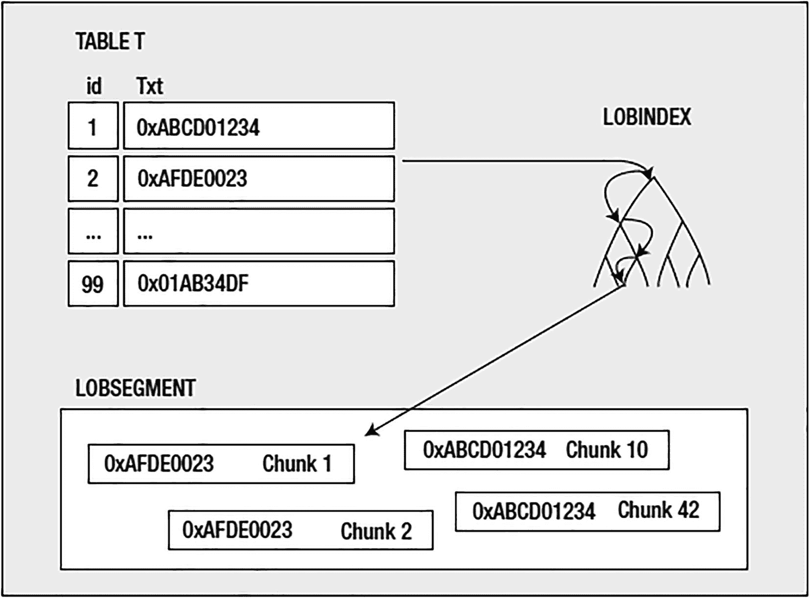

# LOB 类型

`LOBs`，或称`大对象`，根据我的经验，是很多困惑的来源。它们是一种被误解的数据类型，无论是在实现方式上还是在最佳使用方法上。本节概述了 LOB 的物理存储方式以及使用 LOB 类型时必须考虑的因素。它们有许多可选设置，为你的应用程序找到正确的组合至关重要。

Oracle 支持四种类型的 LOB：

*   `CLOB`：字符 LOB。此类型用于存储大量文本信息，例如 XML 或纯文本。此数据类型受字符集转换影响——也就是说，在检索时，此字段中的字符将从数据库的字符集转换为客户端的字符集，在修改时，则从客户端的字符集转换为数据库的字符集。

*   `NCLOB`：另一种字符 LOB。存储在此列中的数据的字符集是数据库的国家字符集，而不是数据库的默认字符集。

*   `BLOB`：二进制 LOB。此类型用于存储大量二进制信息，例如文字处理文档、图像以及你能想象到的任何其他内容。它不受字符集转换影响。应用程序写入 `BLOB` 的任何位和字节，都是从 `BLOB` 返回的内容。

*   `BFILE`：二进制文件 LOB。这更像是一个指针，而不是一个数据库存储的实体。与 `BFILE` 一起存储在数据库中的唯一内容是指向操作系统中文件的指针。文件在数据库外部维护，根本不是数据库的一部分。`BFILE` 提供对文件内容的只读访问。

在讨论 LOB 时，我会将前面的列表分为两部分：存储在数据库中的 LOB，或内部 LOB，包括 `CLOB`、`BLOB` 和 `NCLOB`；以及存储在数据库外部的 LOB，即 `BFILE` 类型。我不会单独讨论 `CLOB`、`BLOB` 或 `NCLOB`，因为从存储和选项的角度来看，它们是相同的。只是 `CLOB` 和 `NCLOB` 支持文本信息，而 `BLOB` 不支持。但我们为它们指定的选项——`CHUNK` 大小、`RETENTION` 等——以及考虑因素是相同的，与基本类型无关。由于 `BFILE` 明显不同，我将单独讨论它们。

## Internal LOBs

从 Oracle Database 11g 开始，Oracle 为 LOB 引入了一个新的底层架构，称为 `SecureFiles`。先前存在的 LOB 架构称为 `BasicFiles`。在 11g 中，默认情况下，当你创建 LOB 时，它将被创建为 BasicFiles LOB。从 Oracle 12c 开始，在 ASSM 管理的表空间中创建 LOB 列时，默认情况下 LOB 将被创建为 SecureFiles LOB。

展望未来，我建议使用 SecureFiles 而不是 BasicFiles，原因如下：

*   Oracle 的文档指出 BasicFiles 将在未来的版本中被弃用。

*   SecureFiles 需要管理的参数更少，即以下属性不适用于 SecureFiles：`CHUNK`、`PCTVERSION`、`FREEPOOLS`、`FREELISTS` 或 `FREELIST GROUPS`。

*   SecureFiles 允许使用高级加密、压缩和重复数据删除。如果你打算使用这些高级 LOB 功能，那么你需要获得 Advanced Security Option 和/或 Advanced Compression Option 的许可。如果你不使用高级 LOB 功能，那么你可以使用 SecureFiles LOB 而无需额外许可。

在以下小节中，我将详细说明使用 SecureFiles 和 BasicFiles 的细微差别。


## 创建 SecureFiles LOB

SecureFiles LOB 的语法，乍一看非常简单——简单得令人怀疑。你可以创建列数据类型为 `CLOB`、`BLOB` 或 `NCLOB` 的表，仅此而已：

```
$ sqlplus eoda/foo@PDB1
SQL> create table t
( id int primary key,
txt clob)
segment creation immediate;
Table created.
```

你可以通过以下方式验证该列是否已创建为 SecureFiles LOB：

```
SQL> select column_name, securefile from user_lobs where table_name='T';
COLUMN_NAME  SECUREFILE
------------ ------------
TXT          YES
```

表面上，LOB 的使用似乎和 `NUMBER`、`DATE` 或 `VARCHAR2` 数据类型一样简单。但果真如此吗？前面的小例子只是冰山一角——仅仅是你可以为 LOB 指定的最小配置。使用 `DBMS_METADATA`，我们可以看到完整的细节：

```
SQL> select dbms_metadata.get_ddl( 'TABLE', 'T' )  from dual;
DBMS_METADATA.GET_DDL('TABLE','T')

CREATE TABLE "EODA"."T"
(    "ID" NUMBER(*,0),
"TXT" CLOB,
PRIMARY KEY ("ID")
USING INDEX PCTFREE 10 INITRANS 2 MAXTRANS 255
STORAGE(INITIAL 65536 NEXT 1048576 MINEXTENTS 1 MAXEXTENTS 2147483645
PCTINCREASE 0 FREELISTS 1 FREELIST GROUPS 1
BUFFER_POOL DEFAULT FLASH_CACHE DEFAULT CELL_FLASH_CACHE DEFAULT)
TABLESPACE "USERS"  ENABLE
) SEGMENT CREATION IMMEDIATE
PCTFREE 10 PCTUSED 40 INITRANS 1 MAXTRANS 255
NOCOMPRESS LOGGING
STORAGE(INITIAL 65536 NEXT 1048576 MINEXTENTS 1 MAXEXTENTS 2147483645
PCTINCREASE 0 FREELISTS 1 FREELIST GROUPS 1
BUFFER_POOL DEFAULT FLASH_CACHE DEFAULT CELL_FLASH_CACHE DEFAULT)
TABLESPACE "USERS"
LOB ("TXT") STORE AS SECUREFILE (
TABLESPACE "USERS" ENABLE STORAGE IN ROW CHUNK 8192
NOCACHE LOGGING  NOCOMPRESS  KEEP_DUPLICATES
STORAGE(INITIAL 106496 NEXT 1048576 MINEXTENTS 1 MAXEXTENTS 2147483645
PCTINCREASE 0
BUFFER_POOL DEFAULT FLASH_CACHE DEFAULT CELL_FLASH_CACHE DEFAULT))
```

如你所见，参数相当多。在深入这些参数的细节之前，我将在下一节为 BasicFiles LOB 生成相同类型的输出。这将为讨论各种 LOB 属性提供一个基础。

## 创建 BasicFiles LOB

在 12c 及以上版本中，要创建 BasicFiles LOB，你需要使用 `STORE AS BASICFILE` 语法：

```
SQL> create table t
( id int primary key,
txt clob)
segment creation immediate
lob(txt) store as basicfile;
Table created.
```

使用 `DBMS_METADATA` 包，我们可以看到 BasicFiles LOB 的详细信息：

```
SQL> select dbms_metadata.get_ddl( 'TABLE', 'T' )  from dual;
DBMS_METADATA.GET_DDL('TABLE','T')

CREATE TABLE "EODA"."T"
(    "ID" NUMBER(*,0),
"TXT" CLOB,
PRIMARY KEY ("ID")
USING INDEX PCTFREE 10 INITRANS 2 MAXTRANS 255
STORAGE(INITIAL 65536 NEXT 1048576 MINEXTENTS 1 MAXEXTENTS 2147483645
PCTINCREASE 0 FREELISTS 1 FREELIST GROUPS 1
BUFFER_POOL DEFAULT FLASH_CACHE DEFAULT CELL_FLASH_CACHE DEFAULT)
TABLESPACE "USERS"  ENABLE
) SEGMENT CREATION IMMEDIATE
PCTFREE 10 PCTUSED 40 INITRANS 1 MAXTRANS 255
NOCOMPRESS LOGGING
STORAGE(INITIAL 65536 NEXT 1048576 MINEXTENTS 1 MAXEXTENTS 2147483645
PCTINCREASE 0 FREELISTS 1 FREELIST GROUPS 1
BUFFER_POOL DEFAULT FLASH_CACHE DEFAULT CELL_FLASH_CACHE DEFAULT)
TABLESPACE "USERS"
LOB ("TXT") STORE AS BASICFILE (
TABLESPACE "USERS" ENABLE STORAGE IN ROW CHUNK 8192 RETENTION
NOCACHE LOGGING
STORAGE(INITIAL 65536 NEXT 1048576 MINEXTENTS 1 MAXEXTENTS 2147483645
PCTINCREASE 0 FREELISTS 1 FREELIST GROUPS 1
BUFFER_POOL DEFAULT FLASH_CACHE DEFAULT CELL_FLASH_CACHE DEFAULT))
```

BasicFiles LOB 的大多数参数与 SecureFiles LOB 相同。主要区别在于 SecureFiles LOB 存储子句包含的参数较少（例如，在 LOB 存储子句中没有 `FREELISTS` 和 `FREELIST GROUPS`）。

## LOB 组件

正如前面章节中 `DBMS_METADATA` 输出所示，LOB 有几个有趣的属性：

*   一个表空间（本例中为 `USERS`）
*   `ENABLE STORAGE IN ROW` 作为默认属性
*   `CHUNK 8192`
*   `RETENTION`
*   `NOCACHE`
*   一个完整的存储子句

这些属性意味着 LOB 在后台有很多处理过程，确实如此。一个 LOB 列总会产生一个我称之为*多段对象*的东西，这意味着表将使用多个物理段。如果我们是在一个空的模式中创建该表，我们会发现以下情况：

```
SQL> select segment_name, segment_type from user_segments;
SEGMENT_NAME                   SEGMENT_TY
------------------------------ ----------
T                              TABLE
SYS_LOB0000020053C00002$$      LOBSEGMENT
SYS_IL0000020053C00002$$       LOBINDEX
SYS_C005432                    INDEX
```

为支持主键约束而创建了一个索引——这是正常的——但另外两个段，`LOBINDEX` 和 `LOBSEGMENT` 呢？它们是为我们的 LOB 列创建的。`LOBSEGMENT` 是实际数据将被存储的地方（嗯，数据也可能存储在表 `T` 中，但当我们讲到 `ENABLE STORAGE IN ROW` 子句时，会更详细地介绍）。`LOBINDEX` 用于导航我们的 LOB，以找到它的各个部分。当我们创建一个 LOB 列时，通常存储在行中的内容是一个*指针*，或*LOB 定位器*。我们的应用程序获取的就是这个 LOB 定位器。当我们请求 LOB 的“第 1000 到 2000 字节”时，会使用 LOB 定位器查询 `LOBINDEX` 以找到这些字节的存储位置，然后访问 `LOBSEGMENT`。`LOBINDEX` 用于轻松找到 LOB 的各个部分。因此，你可以将 LOB 视为一种主/细关系。LOB 以块或片段的形式存储，并且任何片段对我们都是可访问的。例如，如果我们仅使用表来实现一个 LOB，可能会这样做：

```
Create table parent
( id int primary key,
other-data...
);
Create table lob
( id references parent on delete cascade,
chunk_number int,
data (n),
primary key (id,chunk_number)
);
```

从概念上讲，LOB 的存储方式非常类似——在创建这两个表时，我们会在 LOB 表上对 `ID,CHUNK_NUMBER` 设置主键（类似于 Oracle 创建的 `LOBINDEX`），并且我们会有表 `LOB` 来存储数据块（类似于 `LOBSEGMENT`）。LOB 列为我们透明地实现了这种主/细结构。图 12-3 可能使这个概念更清晰。



图 12-3：表到 LOBINDEX 到 LOBSEGMENT

表中的 LOB 定位器实际上只是指向 `LOBINDEX`；而 `LOBINDEX` 又指向 LOB 本身的所有片段。要获取 LOB 的第 N 到 M 字节，你需要解引用表中的指针（LOB 定位器），遍历 `LOBINDEX` 结构以找到所需的块，然后按顺序访问它们。这使得对 LOB 任何部分的随机访问速度都一样快——你可以同样快地获取 LOB 的开头、中间或结尾部分，因为你并不总是从头开始遍历 LOB。

现在你从概念上理解了 LOB 是如何存储的，我想逐步讲解前面列出的每个可选设置，解释它们的用途以及它们具体意味着什么。


## LOB 表空间

`CREATE TABLE` 语句（从 `DBMS_METADATA` 返回的，无论是 SecureFiles 还是 BasicFiles）都包含以下内容：

```sql
LOB ("TXT") STORE AS ... (  TABLESPACE "USERS" ...
```

此处指定的 `TABLESPACE` 是 LOBSEGMENT 和 LOBINDEX 将被存储的表空间，它可能与表本身所在的表空间不同。也就是说，保存 LOB 数据的表空间可能与保存实际表数据的表空间是分开且独立的。

你考虑为 LOB 数据与表数据使用不同表空间的主要原因大多与管理和性能相关。从管理角度来看，LOB 数据类型代表大量的信息。如果一个表有数百万行，并且每一行都关联一个相当大的 LOB，那么 LOB 数据将非常庞大。仅仅为了便于备份、恢复和空间管理，将表与 LOB 数据分开是有意义的。例如，你可能希望为 LOB 数据设置一个与常规表数据不同的统一区间大小。

另一个原因可能是 I/O 性能。默认情况下，LOB 不会缓存在缓冲区缓存中（稍后会详细介绍）。因此，默认情况下，每次访问 LOB，无论是读还是写，都是一次物理 I/O——直接从磁盘读取或直接写入磁盘。

> 注意：
>
> LOB 可以内联或存储在表中。在这种情况下，LOB 数据会被缓存，但这仅适用于大小在 4000 字节或更小的 LOB。我们将在 “IN ROW 子句” 一节中进一步讨论这一点。

因为每次访问都是一次物理 I/O，所以将你已知在实时访问（当用户访问它们时）中会比大多数对象经历更多物理 I/O 的对象隔离到它们自己的磁盘上是有意义的。

需要注意的是，LOBINDEX 和 LOBSEGMENT *总是位于同一个表空间中*。你不能将 LOBINDEX 和 LOBSEGMENT 放在不同的表空间中。事实上，LOBINDEX 的所有存储特性都继承自 LOBSEGMENT，我们稍后会看到。

## IN ROW 子句

之前从 `DBMS_METADATA` 返回的 `CREATE TABLE` 语句（对于 SecureFiles 和 BasicFiles）都包含以下内容：

```sql
LOB ("TXT") STORE AS ...  (... ENABLE STORAGE IN ROW ...
```

这控制着 LOB 数据是始终与表分开存储在 LOBSEGMENT 中，还是有时可以直接存储在表本身中，而不放入 LOBSEGMENT。如果设置了 `ENABLE STORAGE IN ROW`，而不是 `DISABLE STORAGE IN ROW`，那么最多 4000 字节的小型 LOB 将存储在表本身中，类似于 `VARCHAR2`。只有当 LOB 超过 4000 字节时，它们才会被移出表行，进入 LOBSEGMENT。

启用行内存储是默认设置，并且一般来说，如果你知道 LOB 很多时候能放入表本身中，就应该采用这种方式。例如，你可能有一个应用程序，其中包含某种描述字段。描述可能包含 0 到 32KB 的数据（或者甚至更多，但大多数是 32KB 或更少）。许多描述已知非常短，只有几百个字符。与其每次都经历存储它们到行外并通过索引访问的开销，不如将它们行内存储在表本身中。此外，如果 LOB 使用默认的 `NOCACHE`（LOBSEGMENT 数据不缓存在缓冲区缓存中），那么存储在表段中（该段被缓存）的 LOB 将避免检索 LOB 所需的物理 I/O。

> 注意：
>
> 从 Oracle 12c 开始，你可以创建 `VARCHAR2`、`NVARCHAR2` 或 `RAW` 列，最多可存储 32,767 字节的信息。有关详细信息，请参阅本章的 “扩展数据类型” 部分。

我们可以通过一个相当简单的例子看到这一点。我们将创建一个包含一个可以行内存储数据的 LOB 和一个不可以的 LOB 的表：

```sql
$ sqlplus eoda/foo@PDB1
SQL> create table t
( id int   primary key,
in_row   clob,
out_row  clob
)
lob (in_row)  store as ( enable  storage in row )
lob (out_row) store as ( disable storage in row );
Table created.
```

向这个表中，我们将插入一些字符串数据，所有数据都小于 4000 字节：

```sql
SQL> insert into t
select rownum,
owner || ' ' || object_name || ' ' || object_type || ' ' || status,
owner || ' ' || object_name || ' ' || object_type || ' ' || status
from all_objects;
72085 rows created.
SQL> commit;
Commit complete.
```

现在，如果我们尝试读取每一行，并使用 `DBMS_MONITOR` 包，在启用 `SQL_TRACE` 的情况下执行此操作，我们将能够看到每行数据检索时的性能：

```sql
SQL> declare
l_cnt    number;
l_data   varchar2(32765);
begin
select count(*)
into l_cnt
from t;
dbms_monitor.session_trace_enable;
for i in 1 .. l_cnt
loop
select in_row  into l_data from t where id = i;
select out_row into l_data from t where id = i;
end loop;
end;
/
PL/SQL procedure successfully completed.
```

当我们查看这次小模拟的 `TKPROF` 报告时，结果相当明显：


### SELECT 查询性能对比

```sql
SELECT IN_ROW FROM T WHERE ID = :B1
call     count       cpu    elapsed       disk      query    current        rows
------- ------  -------- ---------- ---------- ---------- ----------  ----------
Parse        1      0.00       0.00          0          0          0           0
Execute  18240      0.23       0.25          0          0          0           0
Fetch    18240      0.22       0.27          0      54720          0       18240
------- ------  -------- ---------- ---------- ---------- ----------  ----------
total    36481      0.46       0.53          0      54720          0       18240
********************************************************************************
SELECT OUT_ROW FROM T WHERE ID = :B1
call     count       cpu    elapsed       disk      query    current        rows
------- ------  -------- ---------- ---------- ---------- ----------  ----------
Parse        1      0.00       0.00          0          0          0           0
Execute  18240      0.23       0.24          0          0          0           0
Fetch    18240      1.95       1.67      18240      72960          0       18240
------- ------  -------- ---------- ---------- ---------- ----------  ----------
total    36481      2.18       1.91      18240      72960          0       18240
Elapsed times include waiting on following events:
Event waited on                             Times   Max. Wait  Total Waited
----------------------------------------   Waited  ----------  ------------
direct path read                            18240        0.00          0.14
```

`IN_ROW`列的检索速度明显更快，消耗的资源也少得多。可以看到它使用了 54，720 次逻辑 I/O（查询模式获取），而`OUT_ROW`列使用的逻辑 I/O 要多得多。起初，不清楚这些额外的逻辑 I/O 从何而来，但如果你记得 LOB 是如何存储的，就会变得显而易见。这些是对 LOBINDEX 段的 I/O 操作，目的是找到 LOB 的各个片段。那些额外的逻辑 I/O 都是针对这个 LOBINDEX 的。

此外，你可以看到，使用行外存储检索 18，240 行数据产生了 18，240 次物理 I/O，并导致了 18，240 次 *direct path read* I/O 等待。这些是对非缓存 LOB 数据的读取。在这种情况下，我们可能通过启用 LOB 数据的缓存来减少它们，但那样就必须确保有足够的额外缓冲区缓存可用于此。而且，如果其中有非常大的 LOB，我们可能并不真正希望这些数据被缓存。

### UPDATE 操作性能对比

这种行内/行外存储不仅影响读取，也会影响修改操作。如果我们使用以下技术来监控性能，更新前 100 行（使用短字符串）并插入 100 新行（使用短字符串）：

```sql
SQL> create sequence s start with 100000;
Sequence created.
SQL> declare
l_cnt    number;
l_data   varchar2(32765);
begin
dbms_monitor.session_trace_enable;
for i in 1 .. 100
loop
update t set in_row  =
to_char(sysdate,'dd-mon-yyyy hh24:mi:ss') where id = i;
update t set out_row =
to_char(sysdate,'dd-mon-yyyy hh24:mi:ss') where id = i;
insert into t (id, in_row) values ( s.nextval, 'Hello World' );
insert into t (id,out_row) values ( s.nextval, 'Hello World' );
end loop;
end;
/
PL/SQL procedure successfully completed.
```

我们会在生成的 `TKPROF` 报告中发现类似以下的输出：

```sql
UPDATE T SET IN_ROW = TO_CHAR(SYSDATE,'dd-mon-yyyy hh24:mi:ss') WHERE ID = :B1
call     count       cpu    elapsed       disk      query    current        rows
------- ------  -------- ---------- ---------- ---------- ----------  ----------
Parse        1      0.00       0.00          0          0          0           0
Execute    100      0.00       0.01          0        200        214         100
Fetch        0      0.00       0.00          0          0          0           0
------- ------  -------- ---------- ---------- ---------- ----------  ----------
total      101      0.00       0.01          0        200        214         100
Misses in library cache during parse: 1
Misses in library cache during execute: 1
Optimizer mode: ALL_ROWS
Parsing user id: 66     (recursive depth: 1)
Number of plan statistics captured: 1
Rows (1st) Rows (avg) Rows (max)  Row Source Operation
---------- ---------- ----------  -----------------------------------------
0          0          0  UPDATE  T (cr=2 pr=0 pw=0 time=463 us)
1          1          1  INDEX UNIQUE SCAN SYS_C005434 (cr=2 pr=0 pw=0 time=16...
********************************************************************************
UPDATE T SET OUT_ROW = TO_CHAR(SYSDATE,'dd-mon-yyyy hh24:mi:ss') WHERE ID = :B1
call     count       cpu    elapsed       disk      query    current        rows
------- ------  -------- ---------- ---------- ---------- ----------  ----------
Parse        1      0.00       0.00          0          0          0           0
Execute    100      0.03       0.99          0        200        302         100
Fetch        0      0.00       0.00          0          0          0           0
------- ------  -------- ---------- ---------- ---------- ----------  ----------
total      101      0.03       0.99          0        200        302         100
Misses in library cache during parse: 1
Misses in library cache during execute: 1
Optimizer mode: ALL_ROWS
Parsing user id: 66     (recursive depth: 1)
Number of plan statistics captured: 1
Rows (1st) Rows (avg) Rows (max)  Row Source Operation
---------- ---------- ----------  -----------------------------------------
0          0          0  UPDATE  T (cr=2 pr=0 pw=1 time=8759 us)
1          1          1  INDEX UNIQUE SCAN SYS_C005434 (cr=2 pr=0 pw=0 time=6...
Elapsed times include waiting on following events:
Event waited on                             Times   Max. Wait  Total Waited
----------------------------------------   Waited  ----------  ------------
Disk file operations I/O                        1        0.00          0.00
direct path write                             163        0.01          0.96
```

### INSERT 操作性能对比

正如我们所见，更新行外 LOB 消耗了明显更多的资源。它花费了一些时间进行直接路径写入（物理 I/O），并执行了更多当前模式获取。这是为了维护表本身的 LOBINDEX 和 LOBSEGMENT。`INSERT`活动显示出同样的差异。


