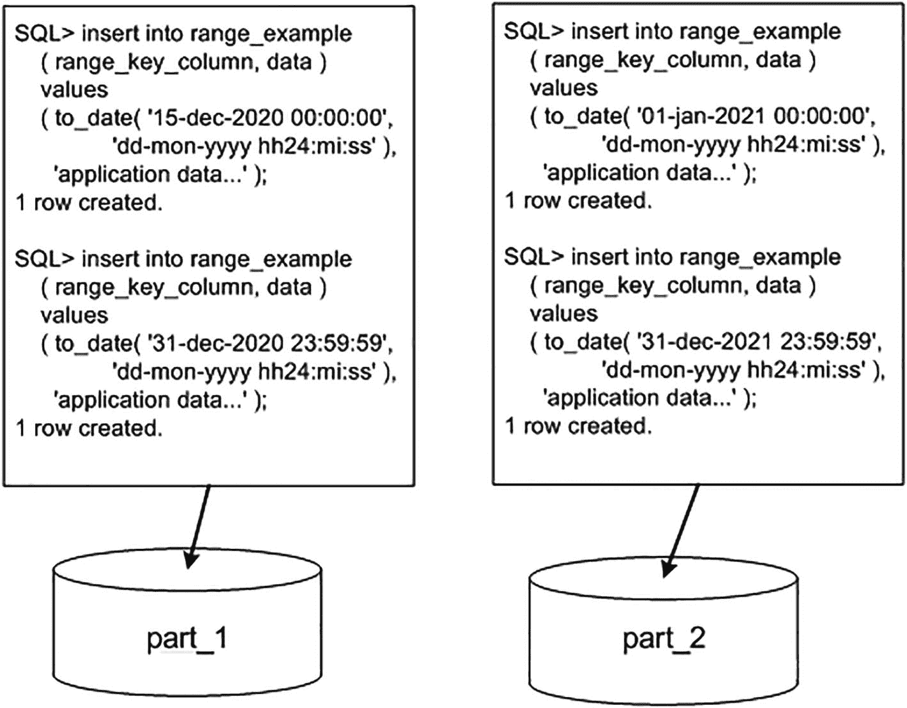

# 表分区方案

目前在 Oracle 中，有九种方法可以对表进行分区：

*   `Range partitioning（范围分区）`：你可以指定应存储在一起的数据范围。例如，时间戳在`Jan-2014`月份内的所有数据将存储在分区 1 中，时间戳在`Feb-2014`内的所有数据存储在分区 2 中，依此类推。这可能是 Oracle 中最常用的分区机制。

*   `Hash partitioning（哈希分区）`：你在本章第一个示例中已经见过。对一个列（或多个列）应用哈希函数，行将根据该哈希值被放置到某个分区中。

*   `List partitioning（列表分区）`：你指定一个离散的值集合，这些值决定了哪些数据应存储在一起。例如，你可以指定`STATUS`列值在`( 'A', 'M', 'Z' )`中的行进入分区 1，`STATUS`值在`( 'D', 'P', 'Q' )`中的行进入分区 2，依此类推。

*   `Interval partitioning（间隔分区）`：这与范围分区非常相似，不同之处在于数据库本身可以在新数据到来时创建新的分区。使用传统的范围分区，DBA 的任务是预先创建分区以容纳现在和未来的所有可能数据值。这通常意味着 DBA 需要按计划创建分区——以容纳下个月或下周的数据。使用间隔分区，当新数据到达且无法根据 DBA 指定的规则放入任何现有分区时，数据库本身将创建分区。

*   `Reference partitioning（引用分区）`：这允许在由外键强制实施的父子关系中，子表继承父表的分区方案。这使得无需对数据模型进行反规范化即可实现子表与父表的等分区。过去，表只能基于其物理存储的属性进行分区；引用分区实际上允许你基于父表的属性对表进行分区。

*   `Interval reference partitioning（间隔引用分区）`：顾名思义，这是间隔分区和引用分区的组合。它允许自动向父/子引用分区表添加分区。

*   `Virtual column partitioning（虚拟列分区）`：这允许基于表中一个或多个现有列的表达式进行分区。该表达式仅作为元数据存储。

*   `Composite partitioning（复合分区）`：这是范围、哈希和列表分区的组合。它允许你首先对某些数据应用一种分区方案，然后，在每个生成的分区内，使用其他分区方案将该分区再细分为子分区。

*   `System partitioning（系统分区）`：由应用程序显式决定将一行插入到哪个分区。这种分区类型用途有限，本章不予讨论；我们在此提及只是为了完整列出 Oracle 支持的分区类型。有关系统分区的更多详细信息，请参阅 Oracle *Database Cartridge Developer's Guide*。

在接下来的章节中，我们将探讨每种分区类型的益处以及它们之间的差异。我们还将讨论何时对不同类型的应用采用何种方案。本节并非旨在全面展示分区语法及所有可用选项。相反，示例是简单且具有说明性的，旨在让你了解分区的工作原理以及不同类型的分区设计用来实现的功能。

**注意**

有关分区语法的完整细节，请参阅*Oracle Database SQL Language Reference*手册或*Oracle Database Administrator's Guide*。此外，*Oracle Database VLDB and Partitioning Guide*和*Oracle Database Data Warehousing Guide*都是关于分区选项的极佳信息来源，对于任何计划实施分区的人来说都是必读之物。


### 范围分区

我们要看的第一种类型是范围分区表。下面的 `CREATE TABLE` 语句创建了一个使用列 `RANGE_KEY_COLUMN` 的范围分区表。所有 `RANGE_KEY_COLUMN` 严格小于 `01-JAN-2021` 的数据将被放入分区 `PART_1`，所有值严格小于 `01-JAN-2022`（且大于或等于 `01-JAN-2021`）的数据将进入分区 `PART_2`。任何不满足这两个条件之一的数据（例如，`RANGE_KEY_COLUMN` 值为 `01-JAN-2022` 或更大的行）在插入时都会失败，因为它无法映射到任何分区：

```
$ sqlplus eoda/foo@PDB1
SQL> CREATE TABLE range_example
( range_key_column date NOT NULL,
data             varchar2(20)
)
PARTITION BY RANGE (range_key_column)
( PARTITION part_1 VALUES LESS THAN
(to_date('01/01/2021','dd/mm/yyyy')),
PARTITION part_2 VALUES LESS THAN
(to_date('01/01/2022','dd/mm/yyyy'))
);
Table created.
```

注意

我们使用了 `DD/MM/YYYY` 日期格式来创建 `CREATE TABLE` 语句，以使其国际化。如果我们使用 `DD-MON-YYYY` 格式，那么如果一月的缩写在您的系统上不是 Jan，`CREATE TABLE` 将会因 `ORA-01843: not a valid month` 而失败。`NLS_LANGUAGE` 设置会影响这一点。然而，为了避免对哪个部分是日、哪个部分是月产生任何歧义，我在正文和插入语句中使用了三字符月份缩写。

图 13-1 显示了 Oracle 将检查 `RANGE_KEY_COLUMN` 的值，并根据该值将其插入到两个分区之一。



图 13-1

范围分区插入示例

插入的行是特意选择的，目的是演示分区范围是严格小于，而不是小于或等于。我们首先插入值 `15-DEC-2020`，它肯定会进入分区 `PART_1`。我们还插入一行日期/时间为 `01-JAN-2021` 前一秒的行——该行也将进入分区 `PART_1`，因为它小于 `01-JAN-2021`。然而，下一个在 `01-JAN-2021` 午夜的插入会进入分区 `PART_2`，因为该日期/时间并不严格小于 `PART_1` 的分区范围边界。最后一行显然属于分区 `PART_2`，因为它大于或等于 `PART_1` 的分区范围边界，并且小于 `PART_2` 的分区范围边界。

我们可以通过从各个分区执行 `SELECT` 语句来确认这一点：

```
SQL> select to_char(range_key_column,'dd-mon-yyyy hh24:mi:ss')
from range_example partition (part_1);
TO_CHAR(RANGE_KEY_COLUMN,'DD-

15-dec-2020 00:00:00
31-dec-2020 23:59:59
SQL> select to_char(range_key_column,'dd-mon-yyyy hh24:mi:ss')
from range_example partition (part_2);
TO_CHAR(RANGE_KEY_COLUMN,'DD-

01-jan-2021 00:00:00
31-dec-2021 23:59:59
```

您可能想知道如果您插入一个超出上限的日期会发生什么。答案是 Oracle 会引发错误：

```
SQL> insert into range_example
( range_key_column, data )
values
( to_date( '01-jan-2022 00:00:00',
'dd-mon-yyyy hh24:mi:ss' ),
'application data...' );
insert into range_example
*
ERROR at line 1:
ORA-14400: inserted partition key does not map to any partition
```

对于前述情况，有两种处理方法——一种是使用后面描述的间隔分区，另一种是使用一个全捕获分区，我们现在将演示后者。假设您想像之前那样将 2020 和 2021 年的日期隔离到各自的分区中，但您希望所有其他日期都进入第三个分区。使用范围分区，您可以使用 `MAXVALUE` 子句来实现这一点，如下所示：

```
SQL> drop table range_example purge;
SQL> CREATE TABLE range_example
( range_key_column date,
data             varchar2(20)
)
PARTITION BY RANGE (range_key_column)
( PARTITION part_1 VALUES LESS THAN
(to_date('01/01/2021','dd/mm/yyyy')),
PARTITION part_2 VALUES LESS THAN
(to_date('01/01/2022','dd/mm/yyyy')),
PARTITION part_3 VALUES LESS THAN
(MAXVALUE)
);
Table created.
```

现在，当您向该表中插入一行时，它将进入三个分区之一——没有任何行会被拒绝，因为分区 `PART_3` 可以接受任何未进入 `PART_1` 或 `PART_2` 的 `RANGE_KEY_COLUMN` 值（即使是 `RANGE_KEY_COLUMN` 的 null 值也会被插入到这个新分区中）。

