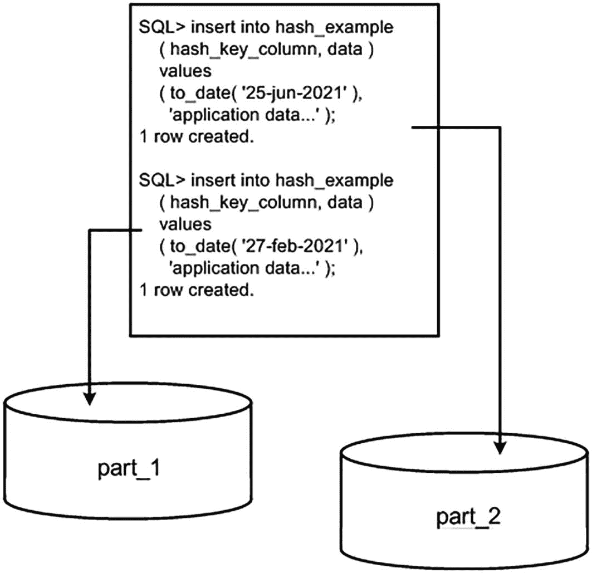

# 哈希分区

当对表进行哈希分区时，Oracle 会对分区键应用一个哈希函数，以确定数据应放置在 N 个分区中的哪一个。Oracle 建议 N 是 2 的幂（2、4、8、16 等），以实现最佳的整体分布，我们很快就会看到，这绝对是一个非常好的建议。


### 哈希分区的工作原理

哈希分区旨在实现数据在不同设备（磁盘）之间的良好分布，或将数据隔离成更易管理的块。为表选择的哈希键应是一个或多个具有唯一性（或至少具有尽可能多的不同值）的列，以确保行在各分区间得到良好分布。如果选择一个仅有四个值的列，并使用两个分区，那么所有行很可能最终都哈希`到同一个分区`，这完全违背了分区的初衷！

在本例中，我们将创建一个包含两个分区的哈希表。我们将使用名为`HASH_KEY_COLUMN`的列作为分区键。Oracle 会获取此列中的值，通过哈希计算来确定该行将存储在哪个分区中：

```sql
$ sqlplus eoda/foo@PDB1
SQL> CREATE TABLE hash_example
( hash_key_column   date,
data              varchar2(20)
)
PARTITION BY HASH (hash_key_column)
( partition part_1 tablespace p1,
partition part_2 tablespace p2
);
表已创建。
```

图 13-2 显示，Oracle 将检查`HASH_KEY_COLUMN`中的值，对其进行哈希计算，并确定给定行将出现在两个分区中的哪一个。



图 13-2 哈希分区插入示例

如前所述，哈希分区无法控制行最终落入哪个分区。Oracle 应用哈希函数，该哈希函数的结果决定了行的去向。如果你希望某一行因任何原因进入分区`PART_1`，那么你*不应该*——事实上，你*不能*——使用哈希分区。该行将进入哈希函数指定的任何分区。如果更改哈希分区的数量，数据将在所有分区间重新分布（向哈希分区表添加或删除分区将导致所有数据被重写，因为每一行现在可能属于不同的分区）。

哈希分区在你拥有大型表时最为有用，例如“减轻管理负担”一节中展示的表，并且你希望对其进行*分而治之*。与其管理一个大表，不如拥有 8 个或 16 个更小的表进行管理。哈希分区也有助于在一定程度上提高可用性，如“提高可用性”一节所示；单个哈希分区的临时丢失允许访问所有剩余分区。一些用户可能会受到影响，但很多人很可能不会受到影响。此外，现在的恢复单位要小得多。你无需恢复和修复一个大的表；你只需恢复该表的一个片段。最后，正如“减少 OLTP 系统中的竞争”一节所提到的，哈希分区在高更新竞争环境中很有用。我们不再拥有一个单一的热点段，而是可以将一个段哈希分区成 16 块，每一块现在都在接收修改。

### 使用 2 的幂次进行哈希分区

我之前提到过分区数量应该是 2 的幂。这很容易被证明是正确的。为了演示，我们将设置一个存储过程来自动创建包含 N 个分区的哈希分区表（N 将是一个参数）。此过程将构造一个动态查询，按分区检索行数，然后显示计数和按分区计数的简单直方图。最后，它将打开此查询并让我们查看结果。此过程从创建哈希表开始。我们将使用名为`T`的表：

```sql
SQL> create or replace
procedure hash_proc
( p_nhash in number,
p_cursor out sys_refcursor )
authid current_user
as
l_text     long;
l_template long :=
'select $POS$ oc, ''p$POS$'' pname, count(*) cnt ' ||
'from t partition ( $PNAME$ ) union all ';
table_or_view_does_not_exist exception;
pragma exception_init( table_or_view_does_not_exist, -942 );
begin
begin
execute immediate 'drop table t';
exception when table_or_view_does_not_exist
then null;
end;
execute immediate '
CREATE TABLE t ( id )
partition by hash(id)
partitions ' || p_nhash || '
as
select rownum
from all_objects';
```

接下来，我们将动态构造一个查询来按分区检索行数。它使用之前定义的模板查询来实现。对于每个分区，我们将使用分区扩展表名收集计数，并将所有计数用`union all`合并：

```sql
for x in ( select partition_name pname,
PARTITION_POSITION pos
from user_tab_partitions
where table_name = 'T'
order by partition_position )
loop
l_text := l_text ||
replace(
replace(l_template,
'$POS$', x.pos),
'$PNAME$', x.pname );
end loop;
```

现在，我们将使用该查询选择出分区位置（`PNAME`）和该分区中的行数（`CNT`）。使用`RPAD`，我们将构建一个相当原始但有效的直方图：

```sql
open p_cursor for
'select pname, cnt,
substr( rpad(''*'',30*round( cnt/max(cnt)over(),2),''*''),1,30) hg
from (' || substr( l_text, 1, length(l_text)-11 ) || ')
order by oc';
end;
/
过程已创建。
```

如果我们以输入 4（四个哈希分区）运行此过程，我们期望看到类似于以下输出的结果：

```sql
SQL> variable x refcursor
SQL> set autoprint on
SQL> exec hash_proc( 4, :x );
PL/SQL 过程已成功完成。
PN        CNT HG
-- ---------- ------------------------------
p1      12141 *****************************
p2      12178 *****************************
p3      12417 ******************************
p4      12105 *****************************
```

所示的简单直方图显示数据在四个分区上分布良好且均匀。每个分区中的行数几乎相同。但是，如果我们从四个哈希分区简单地改为五个，我们将看到以下情况：

```sql
SQL> exec hash_proc( 5, :x );
PL/SQL 过程已成功完成。
PN        CNT HG
-- ---------- ------------------------------
p1       6102 **************
p2      12180 *****************************
p3      12419 ******************************
p4      12106 *****************************
p5       6040 **************
```

这个直方图指出，第一个和最后一个分区的行数只有中间分区的一半。数据分布一点也不均匀。对于六个和七个哈希分区，我们将看到这种趋势持续：

