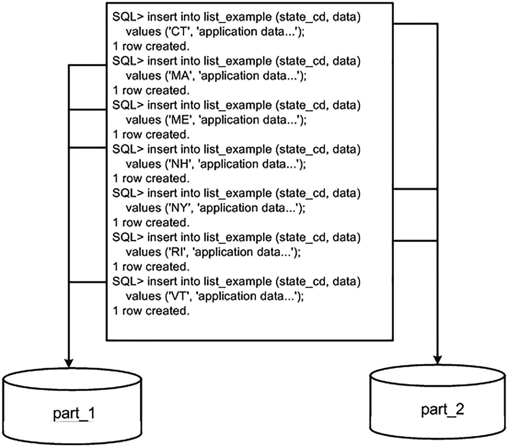

# 哈希分区

```
SQL> exec hash_proc( 6, :x );
PL/SQL 过程已成功完成。
PN        CNT HG
-- ---------- ------------------------------
p1       6104 **************
p2       6175 ***************
p3      12420 ******************************
p4      12106 *****************************
p5       6040 **************
p6       6009 **************
已选择 6 行。
SQL> exec hash_proc( 7, :x );
PL/SQL 过程已成功完成。
PN        CNT HG
-- ---------- ------------------------------
p1       6105 ***************
p2       6176 ***************
p3       6161 ***************
p4      12106 ******************************
p5       6041 ***************
p6       6010 ***************
p7       6263 ***************
已选择 7 行。
```

一旦我们回到哈希分区数为二的幂的情况，我们就能再次实现均匀分布的目标：

```
SQL> exec hash_proc( 8, :x );
PL/SQL 过程已成功完成。
PN        CNT HG
-- ---------- ------------------------------
p1       6106 *****************************
p2       6178 *****************************
p3       6163 *****************************
p4       6019 ****************************
p5       6042 ****************************
p6       6010 ****************************
p7       6264 ******************************
p8       6089 *****************************
已选择 8 行。
```

如果我们继续这个实验直到 16 个分区，我们会看到第 9 到第 15 个分区出现相同的效果——数据向内部的分区倾斜，远离边缘分区——然后当达到第 16 个分区时，你会再次看到分布变得平坦。对于 32 个分区、64 个分区等等，情况也是如此。这个例子恰恰指出了将二的幂作为哈希分区数的重要性。

## 列表分区

列表分区提供了基于离散的值列表来指定某一行将驻留在哪个分区的能力。通常，根据某些代码（如州或地区代码）进行分区非常有用。例如，我们可能希望将缅因州（ME）、新罕布什尔州（NH）、佛蒙特州（VT）和马萨诸塞州（MA）所有人的记录都归入一个分区，因为这些州彼此相邻或靠近，并且我们的应用程序按地理区域查询数据。同样，我们可能希望将康涅狄格州（CT）、罗德岛州（RI）和纽约州（NY）的记录归为一组。

我们无法使用范围分区，因为第一个分区的范围将是 ME 到 VT，而第二个范围将是 CT 到 RI。这些范围有重叠。我们也不能使用哈希分区，因为我们无法控制任何给定的行进入哪个分区；这是由 Oracle 提供的内置哈希函数控制的。使用列表分区，我们可以轻松地实现这种自定义分区方案：

```
$ sqlplus eoda/foo@PDB1
SQL> create table list_example
( state_cd   varchar2(2),
data       varchar2(20)
)
partition by list(state_cd)
( partition part_1 values ( 'ME', 'NH', 'VT', 'MA' ),
partition part_2 values ( 'CT', 'RI', 'NY' )
);
表已创建。
```

图 13-3 显示了 Oracle 将检查 `STATE_CD` 列，并根据其值将行放入正确的分区。



图 13-3 列表分区插入示例

正如我们在范围分区中看到的，如果我们尝试插入一个值，该值未在列表分区中指定，Oracle 将向客户端应用程序返回一个适当的错误。换句话说，一个没有 `DEFAULT` 分区的列表分区表会隐式地对表施加一个类似于检查约束的约束：

```
SQL> insert into list_example values ( 'VA', 'data' );
insert into list_example values ( 'VA', 'data' )
*
第 1 行出现错误:
ORA-14400: 插入的分区键未映射到任何分区
```

如果我们想将这七个州划分到它们各自的分区中，就像我们已经做的那样，但让所有剩余的州代码（或者实际上，任何碰巧被插入的、不具有这七个代码之一的其他行）都进入第三个分区，那么我们可以使用 `VALUES ( DEFAULT )` 子句。这里，我们将修改表来添加这个分区（我们也可以在 `CREATE TABLE` 语句中使用它）：

```
SQL1> alter table list_example add partition part_3 values ( DEFAULT );
表已更改。
SQL> insert into list_example values ( 'VA', 'data' );
已创建 1 行。
```

所有未明确出现在我们的值列表中的值都将进入这里。关于使用 `DEFAULT` 的一点警告：一旦一个列表分区表有了 `DEFAULT` 分区，你就不能再向它添加任何分区了，所以

```
SQL> alter table list_example add partition part_4 values( 'CA', 'NM' );
alter table list_example
*
第 1 行出现错误:
ORA-14323: 当存在 DEFAULT 分区时无法添加分区
```

我们必须先移除 `DEFAULT` 分区，然后添加 `PART_4`，然后再把 `DEFAULT` 分区加回来。其背后的原因是，`DEFAULT` 分区可能已经包含了列表分区键值为 `CA` 或 `NM` 的行——在添加了 `PART_4` 之后，这些行就不属于 `DEFAULT` 分区了。

### 区间分区

区间分区与先前描述的范围分区非常相似——实际上，它始于一个范围分区表，但在定义中添加了一条规则（区间），以便数据库知晓未来应如何添加分区。区间分区的目标是**为数据创建新分区**——如果，并且仅当，数据存在于某个特定分区时，并且是在该数据到达数据库时才创建。换言之，其目的是消除预先为数据创建分区的需求，允许数据在插入时自行创建分区。要使用区间分区，你从一个没有 `MAXVALUE` 分区的范围分区表开始，并指定一个要添加到该分区表**上限**（最高值）的区间，以创建新的范围。你需要有一个在**单列**上进行范围分区的表，并且该列允许向其添加 `NUMBER` 或 `INTERVAL` 类型（例如，按 `VARCHAR2` 字段分区的表无法进行区间分区；你无法对 `VARCHAR2` 执行加法操作）。你可以将区间分区与任何合适的现有范围分区表结合使用；也就是说，你可以通过 `ALTER` 命令将现有的范围分区表更改为区间分区表，或者使用 `CREATE TABLE` 命令创建一个区间分区表。

例如，假设你有一个范围分区表，其规则是“任何严格小于 `01-JAN-2021` 的数据”（即 2020 年及以前的数据）都存入分区 `P1`——仅此而已。因此，它只有一个分区来存放 2020 年及以前的所有数据。如果你尝试将 2022 年的数据插入该表，正如先前在范围分区部分所演示的，插入操作将会失败。使用区间分区，你可以创建一个表，同时指定一个范围（严格小于 `01-JAN-2020`）和一个区间——比如一个月的时长——那么数据库就会在数据到达时，按月创建分区（一个恰好能容纳一个月数据的分区）。数据库不会预先创建所有可能的分区，因为这不切实际。但是，随着每一行数据的到来，数据库会检查对应月份的分区是否存在。如果需要，数据库将创建该分区。以下是语法示例：

```
$ sqlplus eoda/foo@PDB1
SQL> create table audit_trail
( ts    timestamp,
data  varchar2(30)
)
partition by range(ts)
interval (numtoyminterval(1,'month'))
store in (users, example )
(partition p0 values less than
(to_date('01-01-1900','dd-mm-yyyy'))
);
Table created.
```

**注意**

你心中可能会有个疑问，尤其是如果你刚读完前面关于数据类型的章节。你可以看到我们是按 `TIMESTAMP` 进行分区的，并且向其添加了一个月的 `INTERVAL`。在第 12 章中，我们看到向一个落在 1 月 31 日的 `TIMESTAMP` 添加一个月的 `INTERVAL` 会导致错误，因为不存在 2 月 31 日。同样的问题会发生在区间分区上吗？答案是肯定的；如果你尝试使用诸如 `'29-01-1990'`（任何月份中 28 号之后的日期）这样的日期，你将收到错误 "`ORA-14767: Cannot specify this interval with existing high bounds`"。数据库将不允许你使用一个在添加区间时不安全的边界值。

在第 8 和第 9 行，你看到了这个表的范围分区方案；它从一个单独的、空的分区开始，该分区将包含任何早于 `01-JAN-1900` 的数据。由于该表保存的是审计跟踪，可以推测这个分区将永远保持较小且为空。它是一个必需的分区，被称为 `过渡` 分区。所有严格小于此当前高值分区的数据都将使用传统的范围分区。只有在过渡分区高值之上的数据才会使用区间分区。如果我们查询数据字典，可以看到目前已创建的内容：

```
SQL> select a.partition_name, a.tablespace_name, a.high_value,
decode( a.interval, 'YES', b.interval ) interval
from user_tab_partitions a, user_part_tables b
where a.table_name = 'AUDIT_TRAIL'
and a.table_name = b.table_name
order by a.partition_position;
PARTITION_ TABLESPACE HIGH_VALUE                      INTERVAL
---------- ---------- ------------------------------- --------------------
P0         USERS      TIMESTAMP' 1900-01-01 00:00:00'
```

到目前为止，我们只有一个分区，并且它不是一个 `INTERVAL` 分区，如空白的 `INTERVAL` 列所示。相反，它目前只是一个常规的 `RANGE` 分区；它将容纳任何严格小于 `01-JAN-1900` 的数据。

再次查看 `CREATE TABLE` 语句，我们可以在第 6 和第 7 行看到新区间分区的具体信息：

```
interval (numtoyminterval(1,'month'))
store in (users, example )
```

在第 6 行，我们有实际的区间定义 `NUMTOYMINTERVAL(1,'MONTH')`。我们的目标是存储按月分区——每个月的数据一个新分区——这是一个非常常见的目标。通过使用一个可以安全地增加一个月的日期（关于为何向时间戳增加一个月在某些情况下容易出错，请参阅第 12 章）——例如每月的第一日——我们可以让数据库在数据到达时动态地为我们创建按月分区。

在第 7 行，我们有具体说明：`store in (users,example)`。这使我们能够告诉数据库在何处创建这些新分区——使用哪些表空间。当数据库确定需要创建哪些分区时，它会使用此列表来决定在哪个表空间中创建每个分区。这允许数据库管理员控制期望的最大表空间大小：他们可能不想要一个 500GB 的单一表空间，但会乐于接受十个 50GB 的表空间。在这种情况下，他们会设置十个表空间，并允许数据库使用所有这些表空间来创建分区。现在让我们插入一行数据，看看会发生什么：

```
SQL> insert into audit_trail (ts,data) values ( to_timestamp('27-feb-2020','dd-mon-yyyy'), 'xx' );
1 row created.
SQL> select a.partition_name, a.tablespace_name, a.high_value,
decode( a.interval, 'YES', b.interval ) interval
from user_tab_partitions a, user_part_tables b
where a.table_name = 'AUDIT_TRAIL'
and a.table_name = b.table_name
order by a.partition_position;
PARTITION_ TABLESPACE HIGH_VALUE                      INTERVAL
---------- ---------- ------------------------------- ---------------------
P0         USERS      TIMESTAMP' 1900-01-01 00:00:00'
SYS_P1623  USERS      TIMESTAMP' 2020-03-01 00:00:00' NUMTOYMINTERVAL(1,'MONTH')
```

如果你还记得范围分区部分的内容，你会预期那个 `INSERT` 会失败。然而，由于我们使用的是区间分区，它成功了，并且实际上创建了一个新的分区 `SYS_P1623`。此分区的 `HIGH_VALUE` 是 `01-MAR-2020`，如果我们使用的是范围分区，这将意味着任何严格小于 `01-MAR-2020` 且大于等于 `01-JAN-1900` 的数据都会进入此分区，但因为我们有一个区间，规则就不同了。当设置了区间时，此分区的范围是任何大于等于 `HIGH_VALUE-INTERVAL` 且严格小于 `HIGH_VALUE` 的数据。因此，这个分区的范围是

```
SQL> select TIMESTAMP' 2020-03-01 00:00:00'-NUMTOYMINTERVAL(1,'MONTH') greater_than_eq_to,
TIMESTAMP' 2020-03-01 00:00:00' strictly_less_than
from dual;
GREATER_THAN_EQ_TO               STRICTLY_LESS_THAN
-------------------------------- --------------------------------
01-FEB-20 12.00.00.000000000 AM  01-MAR-20 12.00.00.000000000 AM
```

也就是说——2020 年 2 月整月的所有数据。如果我们在其他月份再插入一行，如下所示，我们可以看到另一个分区 `SYS_P1624` 被添加，它包含了 2020 年 6 月整月的所有数据：


## 问题发现与分析

```
SQL> insert into audit_trail (ts,data) values ( to_date('25-jun-2020','dd-mon-yyyy'), 'xx' );
1 row created.
SQL> select a.partition_name, a.tablespace_name, a.high_value,
decode( a.interval, 'YES', b.interval ) interval
from user_tab_partitions a, user_part_tables b
where a.table_name = 'AUDIT_TRAIL'
and a.table_name = b.table_name
order by a.partition_position;
PARTITION_ TABLESPACE HIGH_VALUE                      INTERVAL
---------- ---------- ------------------------------- --------------------
P0         USERS      TIMESTAMP' 1900-01-01 00:00:00'
SYS_P1623  USERS      TIMESTAMP' 2020-03-01 00:00:00' NUMTOYMINTERVAL(1,'MONTH')
SYS_P1624  USERS      TIMESTAMP' 2020-07-01 00:00:00' NUMTOYMINTERVAL(1,'MONTH')
```

你可能会看着这个输出，并询问为什么所有数据都在 `USERS` 表空间中。我们明确要求将数据分布在 `USERS` 表空间和 `EXAMPLE` 表空间上，那么为什么所有数据都在单个表空间中呢？这与数据库在确定数据应进入哪个分区时，同时计算它应进入哪个表空间的事实有关。由于我们的每个分区之间相隔偶数月，并且我们只使用了两个表空间，因此我们最终反复使用同一个表空间。如果我们只向该表中加载“每隔一个月”的数据，最终只会使用一个表空间。我们可以通过添加一些与我们现有数据相隔“奇数”月的数据行来观察 `EXAMPLE` 表空间是否可以被使用：

## 解决方案与验证

```
SQL> insert into audit_trail (ts,data) values ( to_date('15-mar-2020','dd-mon-yyyy'), 'xx' );
1 row created.
SQL> select a.partition_name, a.tablespace_name, a.high_value,
decode( a.interval, 'YES', b.interval ) interval
from user_tab_partitions a, user_part_tables b
where a.table_name = 'AUDIT_TRAIL'
and a.table_name = b.table_name
order by a.partition_position;
PARTITION_ TABLESPACE HIGH_VALUE                      INTERVAL
---------- ---------- ------------------------------- --------------------
P0         USERS      TIMESTAMP' 1900-01-01 00:00:00'
SYS_P1623  USERS      TIMESTAMP' 2020-03-01 00:00:00' NUMTOYMINTERVAL(1,'MONTH')
SYS_P1625  EXAMPLE    TIMESTAMP' 2020-04-01 00:00:00' NUMTOYMINTERVAL(1,'MONTH')
SYS_P1624  USERS      TIMESTAMP' 2020-07-01 00:00:00' NUMTOYMINTERVAL(1,'MONTH')
```

现在我们已经使用了 `EXAMPLE` 表空间。这个新分区被插入在两个现有分区之间，并将包含我们所有的 2020 年 3 月的数据。

你可能会问，“如果我此时回滚会发生什么？”如果我们回滚，很明显我们刚刚插入的 `AUDIT_TRAIL` 行会消失：

```
SQL> select * from audit_trail;
TS                                  DATA
----------------------------------- ------------------------------
27-FEB-20 12.00.00.000000 AM        xx
15-MAR-20 12.00.00.000000 AM        xx
25-JUN-20 12.00.00.000000 AM        xx
SQL> rollback;
Rollback complete.
SQL> select * from audit_trail;
no rows selected
```

但立即不清楚的是，我们添加的分区会发生什么：它们会保留还是会一起消失？一个快速的查询将验证它们会保留：

```
SQL> select a.partition_name, a.tablespace_name, a.high_value,
decode( a.interval, 'YES', b.interval ) interval
from user_tab_partitions a, user_part_tables b
where a.table_name = 'AUDIT_TRAIL'
and a.table_name = b.table_name
order by a.partition_position;
PARTITION_ TABLESPACE HIGH_VALUE                      INTERVAL
---------- ---------- ------------------------------- ---------------------
P0         USERS      TIMESTAMP' 1900-01-01 00:00:00'
SYS_P1623  USERS      TIMESTAMP' 2020-03-01 00:00:00' NUMTOYMINTERVAL(1,'MONTH')
SYS_P1625  EXAMPLE    TIMESTAMP' 2020-04-01 00:00:00' NUMTOYMINTERVAL(1,'MONTH')
SYS_P1624  USERS      TIMESTAMP' 2020-07-01 00:00:00' NUMTOYMINTERVAL(1,'MONTH')
```

一旦它们被创建，它们就会被提交并可见。这些分区是使用一个*递归*事务创建的，这是一个独立于你可能已经在执行的任何事务而执行的事务。当我们插入行并且数据库发现所需的分区不存在时，数据库立即启动一个新事务，更新数据字典以反映新分区的存在，并提交其工作。它必须这样做，否则在许多插入操作上会出现严重的争用（串行化），因为其他事务将不得不等待我们提交才能看到这个新分区。因此，这个 DDL 是在你现有事务之外完成的，分区将持续存在。

## 分区命名与管理

你可能已经注意到数据库为我们命名了分区；`SYS_P1625` 是最新分区的名称。这些名称不可排序，而且大多数人可能也不觉得它们很有意义。它们显示了分区添加到表中的顺序（尽管你不能总是依赖这一点；这可能会改变），但除此之外没有太多信息。通常，在范围分区表中，DBA 会使用某种命名方案来命名分区，并且在大多数情况下会使分区名称可排序。例如，二月份的数据可能在名为 `PART_2020_02` 的分区中（使用 `PART_yyyy_mm` 格式），三月份的数据可能在 `PART_2020_03` 中，依此类推。对于区间分区，你无法控制分区的创建名称，但如果你愿意，可以在之后轻松重命名它们。例如，我们可以查询出 `HIGH_VALUE` 字符串，并使用动态 SQL 将其转换为格式良好、有意义的名称。我们之所以可以这样做，是因为我们了解我们希望名称如何格式化；数据库并不知道。例如：

```
SQL> declare
l_str varchar2(4000);
begin
for x in ( select a.partition_name, a.tablespace_name, a.high_value
from user_tab_partitions a
where a.table_name = 'AUDIT_TRAIL'
and a.interval = 'YES'
and a.partition_name like 'SYS\_P%' escape '\' )
loop
execute immediate
'select to_char( ' || x.high_value ||
'-numtodsinterval(1,''second''), ''"PART_"yyyy_mm'' ) from dual'
into l_str;
execute immediate
'alter table audit_trail rename partition "' ||
x.partition_name || '" to "' || l_str || '"';
end loop;
end;
/
PL/SQL procedure successfully completed.
```

所以，我们所做的是获取 `HIGH_VALUE` 并从中减去一秒。我们知道 `HIGH_VALUE` 代表*严格小于*的值，因此比其值早一秒的值将是一个范围内的值。一旦我们有了那个值，我们就将格式 `"PART_"yyyy_mm` 应用于生成的 `TIMESTAMP`，并得到一个字符串，例如三月份的 `PART_2020_03`。我们在重命名命令中使用该字符串，现在我们的数据字典如下所示：

```
SQL> select a.partition_name, a.tablespace_name, a.high_value,
decode( a.interval, 'YES', b.interval ) interval
from user_tab_partitions a, user_part_tables b
where a.table_name = 'AUDIT_TRAIL'
and a.table_name = b.table_name
order by a.partition_position;
PARTITION_NAME TABLESPACE HIGH_VALUE                      INTERVAL
-------------- ---------- ------------------------------- -----------------
P0             USERS      TIMESTAMP' 1900-01-01 00:00:00'
PART_2020_02   USERS      TIMESTAMP' 2020-03-01 00:00:00' NUMTOYMINTERVAL(1,'MONTH')
PART_2020_03   EXAMPLE    TIMESTAMP' 2020-04-01 00:00:00' NUMTOYMINTERVAL(1,'MONTH')
PART_2020_06   USERS      TIMESTAMP' 2020-07-01 00:00:00' NUMTOYMINTERVAL(1,'MONTH')
```

我们只需时不时地运行该脚本来重命名任何新添加的分区，以保持良好的命名约定。请记住，为避免任何 SQL 注入问题（我们使用的是字符串连接，而不是绑定变量；我们不能在 DDL 中使用绑定变量），我们应将此脚本保留为匿名块或调用者权限例程（如果我们决定将其创建为存储过程）。这将防止其他人在我们的模式中以我们的身份运行 SQL，这可能是一场灾难。


