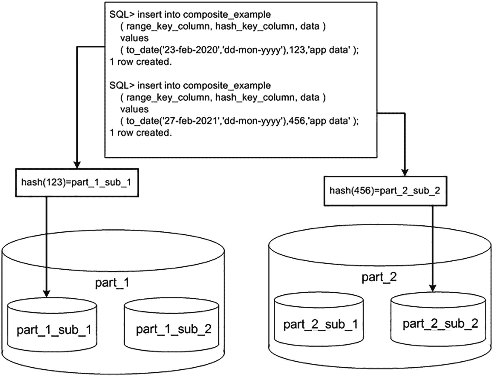
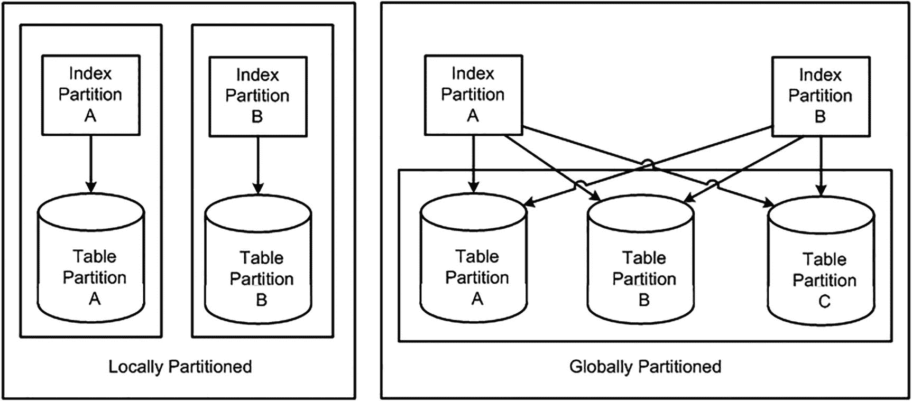

# 引用分区

之前讨论的 `CREATE TABLE` 语句中未涉及的部分是 `ENABLE ROW MOVEMENT`。简言之，该语法允许执行 `UPDATE` 操作，使得 `UPDATE` 修改了分区键值，并导致行从其当前分区移动到其他分区。

由于我们在最初定义父表时允许了行移动，因此我们不得不将所有子表（及其子表等）也定义为具有此功能。因为如果父行移动，并且我们使用的是引用分区，那么子行也必须移动。例如：

```
SQL> select '2021', count(*) from order_line_items partition(part_2021)
union all
select '2022', count(*) from order_line_items partition(part_2022);
'202   COUNT(*)
---- ----------
2021          1
2022          0
```

我们可以看到，目前子表 `ORDER_LINE_ITEMS` 中的数据位于 2021 分区中。通过对父表 `ORDERS` 执行如下简单的更新，可以看到数据发生了移动——在子表中：

```
SQL> update orders set order_date = add_months(order_date,12);
1 row updated.
SQL> select '2021', count(*) from order_line_items partition(part_2021)
union all
select '2022', count(*) from order_line_items partition(part_2022);
'202   COUNT(*)
---- ----------
2021          0
2022          1
```

对父表的更新会级联到子表，并导致子表移动一行或多行（根据需要）。

总结一下，引用分区消除了在对父表和子表进行分区时对数据进行反规范化的需求。此外，当删除父分区时，它会自动删除被引用的子分区。这些功能在数据仓库环境中非常有用。

### 区间引用分区

Oracle 灵活地允许您结合使用区间分区和引用分区。例如，如果您创建一个区间范围分区的父表，如下所示：

```
SQL> create table orders
(order#      number primary key,
order_date  timestamp,
data        varchar2(30))
PARTITION BY RANGE (order_date)
INTERVAL (numtoyminterval(1,'year'))
(PARTITION part_2020 VALUES LESS THAN (to_date('01-01-2021','dd-mm-yyyy')) ,
PARTITION part_2021 VALUES LESS THAN (to_date('01-01-2022','dd-mm-yyyy')));
Table created.
```

接下来是创建引用分区子表的代码：

```
SQL> create table order_line_items
( order#      number,
line#       number,
data        varchar2(30),
constraint c1_pk primary key(order#,line#),
constraint c1_fk_p foreign key(order#) references orders)
partition by reference(c1_fk_p);
Table created.
```

为了查看区间引用分区的实际操作，让我们插入一些数据。首先，插入将适合现有范围分区的行：

```
SQL> insert into orders values (1, to_date( '01-jun-2020', 'dd-mon-yyyy' ), 'xxx');
1 row created.
SQL> insert into orders values (2, to_date( '01-jun-2021', 'dd-mon-yyyy' ), 'xxx');
1 row created.
SQL> insert into order_line_items values( 1, 1, 'yyy' );
1 row created.
SQL> insert into order_line_items values( 2, 1, 'yyy' );
1 row created.
```

所有前面的行都符合创建表时指定的分区。以下查询显示当前分区：

```
SQL> select table_name, partition_name from user_tab_partitions
where table_name in ( 'ORDERS', 'ORDER_LINE_ITEMS' )
order by table_name, partition_name;
TABLE_NAME                PARTITION_NAME
------------------------- -------------------------
ORDERS                    PART_2020
ORDERS                    PART_2021
ORDER_LINE_ITEMS          PART_2020
ORDER_LINE_ITEMS          PART_2021
```

接下来，插入不适合现有范围分区的行；因此，Oracle 会自动创建分区来保存新插入的行：

```
SQL> insert into orders values (3, to_date( '01-jun-2022', 'dd-mon-yyyy' ), 'xxx');
1 row created.
SQL> insert into order_line_items values(3, 1, 'zzz' );
1 row created.
```

以下查询显示自动创建了两个区间分区，一个用于父表，一个用于子表：

```
SQL> select a.table_name, a.partition_name, a.high_value,
decode( a.interval, 'YES', b.interval ) interval
from user_tab_partitions a, user_part_tables b
where a.table_name IN ('ORDERS', 'ORDER_LINE_ITEMS')
and a.table_name = b.table_name
order by a.table_name;
TABLE_NAME         PARTITION_ HIGH_VALUE                        INTERVAL
------------------ ---------- --------------------------------- --------
ORDERS             PART_2020  TIMESTAMP' 2021-01-01 00:00:00'
ORDERS             PART_2021  TIMESTAMP' 2022-01-01 00:00:00'
ORDERS             SYS_P1640  TIMESTAMP' 2023-01-01 00:00:00'   NUMTOYMINTERVAL(1,'YEAR')
ORDER_LINE_ITEMS   PART_2020
ORDER_LINE_ITEMS   PART_2021
ORDER_LINE_ITEMS   SYS_P1640                                    YES
```

创建了两个名为 `SYS_P1640` 的分区，父表分区的高值为 2023-01-01。如果需要，可以通过 `ALTER TABLE` 命令重命名分区：

```
SQL> alter table orders rename partition sys_p1640 to part_2022;
Table altered.
SQL> alter table order_line_items rename partition sys_p1640 to part_2022;
Table altered.
```

> 提示
>
> 有关通过 PL/SQL 自动重命名分区的示例，请参阅本章的“区间分区”部分。


### 虚拟列分区

虚拟列分区允许你基于 SQL 表达式进行分区。当表中的一列承载了多种业务值，而你希望基于该列的一部分进行分区时，这种分区方式非常有用。例如，假设你的一个表中有一个 `RESERVATION_CODE` 列：
```sql
$ sqlplus eoda/foo@PDB1
SQL> create table res(reservation_code varchar2(30));
Table created.
```
并且 `RESERVATION_CODE` 列的第一个字符定义了预订来源的区域。在本例中，假设首字符为 `A` 或 `C` 映射到 `NE` 区域，值为 `B` 映射到 `SW` 区域，值为 `D` 映射到 `NW` 区域。

在这种场景下，我们知道第一个字符代表区域，并且希望能够按区域进行列表分区。按数据现状来看，直接按 `RESERVATION_CODE` 列进行列表分区并不实际，而虚拟分区允许我们对该列应用一个 SQL 函数，然后按其首字符进行列表分区。以下是采用虚拟分区定义的表结构：
```sql
SQL> drop table res;
SQL> create table res(
reservation_code varchar2(30),
region as
(decode(substr(reservation_code,1,1),'A','NE'
,'C','NE'
,'B','SW'
,'D','NW')
)
)
partition by list (region)
(partition NE values('NE'),
partition SW values('SW'),
partition NW values('NW'));
Table created.
```
我们可以通过以下查询查看分区信息：
```sql
SQL> select a.table_name, a.partition_name, a.high_value
from user_tab_partitions a, user_part_tables b
where a.table_name = 'RES'
and a.table_name = b.table_name
order by a.table_name;
TABLE_NAME       PARTITION_ HIGH_VALUE
---------------- ---------- -------------------------------
RES              NE         'NE'
RES              NW         'NW'
RES              SW         'SW'
```
接下来，向表中插入一些随机测试数据（你的随机结果将与此示例不同）：
```sql
SQL> insert into res (reservation_code)
select chr(64+(round(dbms_random.value(1,4)))) || level
from dual connect by level < 10;
9 rows created.
```
现在我们来看看数据是如何被分区的：
```sql
SQL> select 'NE', reservation_code, region from res partition(NE)
union all
select 'SW', reservation_code, region from res partition(SW)
union all
select 'NW', reservation_code, region from res partition(NW);
'N RESERVATION_CODE               RE
-- ------------------------------ --
NE C3                             NE
NE C5                             NE
NE A6                             NE
NE C8                             NE
SW B2                             SW
SW B7                             SW
SW B9                             SW
NW D1                             NW
NW D4                             NW
```
因此，当业务需求要求对一列中的部分数据或来自不同列的数据组合进行分区时（尤其是在没有明显方式进行列表或范围分区的情况下），虚拟列分区通常是合适的选择。虚拟列背后的表达式可以是复杂的计算、返回列字符串的子集、组合列值等等。

### 组合分区

最后，我们来看一些组合分区的示例，它是范围、哈希和/或列表分区的混合体。表 13-1 列出了你可以混合搭配分区类型的各种方式。换句话说，该表显示了目前可用的九种不同的组合分区方案。

**表 13-1 Oracle 数据库按版本支持的组合分区方案**

|          | 范围 | 列表 | 哈希 |
| --- | --- | --- | --- |
| 范围 | 是 | 是 | 是 |
| 列表 | 是 | 是 | 是 |
| 哈希 | 是 | 是 | 是 |

有趣的是，当你使用组合分区时，将不会存在分区段；只会有子分区段。使用组合分区时，分区本身没有段（就像分区表本身没有段一样）。数据物理上存储在子分区段中，分区则成为一个*逻辑容器*，即一个指向实际子分区的容器。

在我们的示例中，我们将研究范围-哈希组合分区。这里，我们为范围分区和哈希分区使用了不同的列。这不是强制性的；我们也可以对两者使用相同的列集：
```sql
$ sqlplus eoda/foo@PDB1
SQL> CREATE TABLE composite_example
( range_key_column   date,
hash_key_column    int,
data               varchar2(20)
)
PARTITION BY RANGE (range_key_column)
subpartition by hash(hash_key_column) subpartitions 2
(
PARTITION part_1
VALUES LESS THAN(to_date('01/01/2021','dd/mm/yyyy'))
(subpartition part_1_sub_1,
subpartition part_1_sub_2
),
PARTITION part_2
VALUES LESS THAN(to_date('01/01/2022','dd/mm/yyyy'))
(subpartition part_2_sub_1,
subpartition part_2_sub_2
)
);
Table created.
```
在范围-哈希组合分区中，Oracle 会首先应用范围分区规则来确定数据属于哪个范围。然后，它将应用哈希函数来决定数据最终应放置在哪个物理分区中。这个过程如图 13-4 所述。



**图 13-4 范围-哈希组合分区示例**

因此，组合分区使你能够按范围拆分数据，并且当某个给定的范围被认为太大或进一步分区消除可能有用时，再通过哈希或列表对其进行更细粒度的拆分。有趣的是，每个范围分区不一定具有相同数量的子分区；例如，假设你正在按日期列进行范围分区以支持数据清除（以便快速轻松地删除所有旧数据）。在 2020 年及之前，你在 `CODE_KEY_COLUMN` 中的奇数代码编号和偶数代码编号的数据量相等。但在此之后，你知道与奇数代码编号相关的记录数量增加了一倍多，并且你希望为奇数代码值设置更多的子分区。你可以通过简单地定义更多的子分区来轻松实现这一点：
```sql
SQL> CREATE TABLE composite_range_list_example
( range_key_column   date,
code_key_column    int,
data               varchar2(20)
)
PARTITION BY RANGE (range_key_column)
subpartition by list(code_key_column)
(
PARTITION part_1
VALUES LESS THAN(to_date('01/01/2021','dd/mm/yyyy'))
(subpartition part_1_sub_1 values( 1, 3, 5, 7 ),
subpartition part_1_sub_2 values( 2, 4, 6, 8 )
),
PARTITION part_2
VALUES LESS THAN(to_date('01/01/2022','dd/mm/yyyy'))
(subpartition part_2_sub_1 values ( 1, 3 ),
subpartition part_2_sub_2 values ( 5, 7 ),
subpartition part_2_sub_3 values ( 2, 4, 6, 8 )
)
);
Table created.
```
在这里，你最终总共有五个分区：分区 `PART_1` 有两个子分区，分区 `PART_2` 有三个子分区。


### 行移动

你可能会好奇，如果在上述任一分区方案中，用于确定分区的列值被修改了，会发生什么。这里有两种情况需要考虑：
*   修改不会导致使用不同的分区；该行仍属于当前分区。所有情况都支持此操作。
*   修改会导致该行在分区之间“移动”。*如果*为该表启用了行移动，则支持此操作；否则，将引发错误。

我们可以轻松观察到这些行为。在前面的“范围分区”部分示例中，我们向 `RANGE_EXAMPLE` 表的 `PART_1` 分区插入了一对行：

```
$ sqlplus eoda/foo@PDB1
SQL> CREATE TABLE range_example
( range_key_column date,
data             varchar2(20)
)
PARTITION BY RANGE (range_key_column)
( PARTITION part_1 VALUES LESS THAN
(to_date('01/01/2021','dd/mm/yyyy')),
PARTITION part_2 VALUES LESS THAN
(to_date('01/01/2022','dd/mm/yyyy'))
);
表已创建。
SQL> insert into range_example
( range_key_column, data )
values
( to_date( '15-dec-2020 00:00:00',  'dd-mon-yyyy hh24:mi:ss' ),
'application data...' );
已创建 1 行。
SQL> insert into range_example
( range_key_column, data )
values
( to_date( '01-jan-2021 00:00:00', 'dd-mon-yyyy hh24:mi:ss' )-1/24/60/60,
'application data...' );
已创建 1 行。
SQL> select * from range_example partition(part_1);
RANGE_KEY DATA
--------- --------------------
15-DEC-20 application data...
31-DEC-20 application data...
```

我们选取其中一行，更新其 `RANGE_KEY_COLUMN` 的值，使其可以保留在 `PART_1` 中：

```
SQL> update range_example set range_key_column = trunc(range_key_column)
where range_key_column =
to_date( '31-dec-2020 23:59:59', 'dd-mon-yyyy hh24:mi:ss' );
已更新 1 行。
```

如预期，此操作成功：该行保留在分区 `PART_1` 中。接下来，我们将 `RANGE_KEY_COLUMN` 更新为一个会导致它属于 `PART_2` 的值：

```
SQL> update range_example
set range_key_column = to_date('01-jan-2021','dd-mon-yyyy')
where range_key_column = to_date('31-dec-2020','dd-mon-yyyy');
update range_example
*
第 1 行出现错误:
ORA-14402: 更新分区键列将导致分区更改
```

由于我们没有显式启用行移动，因此立即引发错误。我们可以在此表上启用行移动，以允许行在分区之间移动。但是，你应该意识到这样做有一个微妙的副作用，即行的 `ROWID` 将因更新而改变：

```
SQL> select rowid  from range_example
where range_key_column = to_date('31-dec-2020','dd-mon-yyyy');
ROWID
----------------
AAAtzXAAGAAAaO6AAB
SQL> alter table range_example enable row movement;
表已更改。
SQL> update range_example
set range_key_column = to_date('01-jan-2021','dd-mon-yyyy')
where range_key_column = to_date('31-dec-2020','dd-mon-yyyy');
已更新 1 行。
SQL> select rowid  from range_example
where range_key_column = to_date('01-jan-2021','dd-mon-yyyy');
ROWID
----------------
AAAtzYAAGAAAae6AAA
```

只要理解在此更新操作中行的 `ROWID` 会发生变化，启用行移动就可以让你更新分区键。

注意

在其他情况下，更新也可能导致 `ROWID` 发生变化。例如，更新索引组织表的主键时，该行的通用 `ROWID` 也会改变。`FLASHBACK TABLE` 命令以及 `ALTER TABLE SHRINK` 命令也可能改变行的 `ROWID`。

你需要理解，从内部机制上看，行移动的执行方式相当于你实际上删除了该行并重新插入了它。它会更新此表上的每一个索引，删除旧条目并插入新条目。它会执行 `DELETE` 加上 `INSERT` 的物理工作。然而，Oracle 将其视为一个更新操作，即使它在物理上删除并插入了该行——因此，它不会触发 `INSERT` 和 `DELETE` 触发器，只会触发 `UPDATE` 触发器。此外，那些可能因外键约束而阻止 `DELETE` 的子表，在此情况下不会阻止。但是，你必须准备好应对将要执行的额外工作；它比普通的 `UPDATE` 开销大得多。因此，设计一个系统，其中分区键被频繁修改，并且这种修改会导致分区移动，将是一个糟糕的设计决策。


## 表分区方案总结

通常，当你拥有按某些值逻辑隔离的数据时，范围分区非常有用。基于时间的数据立即成为经典示例——按“销售季度”、“财政年度”或“月份”进行分区。范围分区在许多情况下能够利用分区消除，包括使用精确相等性和范围（小于、大于、介于等等）。

哈希分区适用于没有自然范围可用于分区的数据。例如，如果你需要加载一个充满人口普查相关数据的表，可能没有一个属性适合进行范围分区。但是，你仍然希望利用分区提供的管理、性能和可用性增强功能。此时，你可以简单地选择一个唯一或几乎唯一的列集进行哈希。这将实现数据在任意数量分区上的均匀分布。哈希分区对象在使用精确相等或 `IN ( value, value, ... )` 时能够利用分区消除，但在使用数据范围时则无法利用。

列表分区适用于某一列具有离散值集的数据，并且基于应用程序的使用方式，按该列进行分区是有意义的（例如，它便于在查询中进行分区消除）。经典示例是州或地区代码——或者，实际上，许多通用的代码类型属性。

间隔分区扩展了范围分区功能，允许在插入表的数据不适合现有分区时自动添加分区。此功能极大地增强了范围分区，因为涉及的维护工作更少（因为 `DBA` 不必必须监控范围并手动添加分区）。

引用分区简化了通过引用完整性约束相关的分区表的实现。这使得子表能够以与父表相同的逻辑方式进行分区，而无需将父表列复制到子表。

间隔引用分区允许你结合间隔和引用分区功能。当你需要同时使用间隔和引用分区功能时，此功能非常有用。

虚拟列分区允许你使用虚拟列作为键进行分区。此功能为你提供了灵活性，可以在常规列值的子字符串（或任何其他 `SQL` 表达式）上进行分区。当无法使用现有列作为分区键，但可以基于现有列中包含的值的子集进行分区时，这非常有用。

当你有逻辑依据可以进行范围分区，但产生的范围分区仍然太大而无法有效管理时，复合分区非常有用。你可以应用范围、列表或哈希分区，然后进一步通过哈希函数划分每个范围，或者使用列表进行分区，甚至再次使用范围。这将允许你将 `I/O` 请求分散到任何给定大型分区中的多个设备上。此外，你现在可以在三个级别实现分区消除。如果你在分区键上进行查询，`Oracle` 能够消除不符合你条件的所有分区。如果你在查询中添加子分区键，`Oracle` 可以消除该分区内的其他子分区。如果你仅在子分区键上进行查询（不使用分区键），`Oracle` 将仅查询每个分区中适用的那些哈希或列表子分区。

建议：如果有依据可以合理地对数据进行范围分区，则应优先使用范围分区，而不是哈希或列表分区。哈希和列表分区增加了许多显著的分区优势，但在涉及分区消除时，它们不如范围分区分区有用。当产生的范围分区太大而无法管理，或者你想对单个范围分区使用所有 `PDML` 功能或并行索引扫描时，建议在范围内使用哈希或列表子分区。

### 分区索引

索引和表一样，可以被分区。有两种可能的方法对索引进行分区：

*   使索引与表`均匀分区`：这也被称为`本地索引`。对于每个表分区，将有一个索引分区，该分区仅索引该表分区。给定索引分区中的所有条目都指向单个表分区，而单个表分区中的所有行都在单个索引分区中表示。

*   按范围或哈希`分区`索引：这也被称为`全局分区索引`。在这里，索引按范围分区，或者可选地按哈希分区，并且单个索引分区可能指向*任何*（以及所有）表分区。

图 13-5 展示了`本地`索引和`全局`索引之间的区别。



图 13-5

`本地`和`全局`索引分区

在`全局分区索引`的情况下，请注意索引分区的数量可能与表分区的数量不同。

由于`全局索引`只能按范围或哈希分区，如果你希望拥有列表或复合分区索引，则必须使用`本地索引`。`本地索引`将使用与底层表相同的方案进行分区。

#### 本地索引与全局索引

根据我的经验，数据仓库系统中的大多数分区实现都使用`本地索引`。在 `OLTP` 系统中，`全局索引`更为常见，我们很快会看到原因。这与需要在索引结构上执行分区消除，以在分区后保持与分区前相同的查询响应时间有关。

`本地索引`具有某些特性，使其成为大多数数据仓库实现的最佳选择。它们支持可用性更高的环境（停机时间更少），因为问题将被隔离到某个范围或哈希的数据。另一方面，由于`全局索引`可以指向多个表分区，它可能成为故障点，导致某些查询无法访问所有分区。

在分区维护操作方面，`本地索引`更加灵活。如果 `DBA` 决定移动一个表分区，则只需重建或维护相关的`本地索引`分区。使用`全局索引`时，所有索引分区都必须实时重建或维护。滑动窗口实现也是如此，其中旧数据从分区中过期，新数据进入。没有任何`本地索引`需要重建，但所有`全局索引`都将在分区操作期间被重建或维护。在某些情况下，`Oracle` 可以利用索引在本地与表分区一起分区的事实，并基于此制定优化的查询计划。对于`全局索引`，索引和表分区之间没有这种关系。

`本地索引`还便于执行分区时间点恢复操作。如果由于某种原因需要将单个分区恢复到比表的其余部分更早的时间点，所有`本地分区索引`都可以恢复到相同的时间点。该对象上的所有`全局索引`都需要重建。这并不意味着“避免使用`全局索引`”——事实上，它们出于性能原因至关重要，你很快就会了解到——你只需要意识到使用它们的含义。


### 本地索引

Oracle 对以下两种类型的本地索引有所区分：

*   `本地前缀索引`：这类索引的分区键位于索引定义的前导边缘。例如，如果一个表按名为 `LOAD_DATE` 的列进行了范围分区，那么该表上的一个本地前缀索引会将 `LOAD_DATE` 作为其列列表中的第一列。

*   `本地非前缀索引`：这类索引的列列表前导边缘上`不`包含分区键。索引中可能包含分区键列，也可能不包含。

两种类型的索引都能够利用分区消除，都能支持唯一性（只要非前缀索引包含分区键），等等。事实是，使用本地前缀索引的查询总是`允许`索引分区消除，而使用本地非前缀索引的查询可能无法实现。这就是为什么有些人说本地非前缀索引更慢——它们不`强制`分区消除（但它们确实支持该功能）。

当索引在查询中作为访问表的初始路径时，本地前缀索引相比本地非前缀索引并没有什么固有的优势。我的意思是，如果查询可以以“`扫描索引`”作为第一步开始，那么前缀索引和非前缀索引之间没有太大区别。

#### 分区消除行为

对于从索引访问开始的查询，它是否能排除某些分区，实际上完全取决于查询中的谓词。一个小例子将有助于说明这一点。以下代码创建了一个表 `PARTITIONED_TABLE`，该表按数值列 `A` 进行范围分区，使得小于 2 的值在分区 `PART_1` 中，小于 3 的值在分区 `PART_2` 中：

```
$ sqlplus eoda/foo@PDB1
SQL> CREATE TABLE partitioned_table
( a int,
b int,
data char(20)
)
PARTITION BY RANGE (a)
(
PARTITION part_1 VALUES LESS THAN(2) tablespace p1,
PARTITION part_2 VALUES LESS THAN(3) tablespace p2
);
Table created.
```

然后我们创建一个本地前缀索引 `LOCAL_PREFIXED` 和一个本地非前缀索引 `LOCAL_NONPREFIXED`。请注意，非前缀索引的定义中，`A` 不在前导边缘上，这就是它成为非前缀索引的原因：

```
SQL> create index local_prefixed on partitioned_table (a,b) local;
Index created.
SQL> create index local_nonprefixed on partitioned_table (b) local;
Index created.
```

接下来，我们向一个分区中插入一些数据并收集统计信息：

```
SQL> insert into partitioned_table
select mod(rownum-1,2)+1, rownum, 'x'
from dual connect by level < 1000;
999 rows created.
SQL> begin
dbms_stats.gather_table_stats (user, 'PARTITIONED_TABLE', cascade=>TRUE );
end;
/
PL/SQL procedure successfully completed.
```

我们将表空间 `P2` 置为离线，该表空间包含了表和索引的 `PART_2` 分区：

```
SQL> alter tablespace p2 offline;
Tablespace altered.
```

将表空间 `P2` 置为离线将阻止 Oracle 访问那些特定的索引分区。这就好像我们遭遇了媒体故障，导致它们变得不可用。现在我们将查询该表，看看不同的查询需要哪些索引分区。这个第一个查询被设计为允许使用本地前缀索引：

```
SQL> select * from partitioned_table where a = 1 and b = 1;
A          B DATA
---------- ---------- --------------------
1          1 x
```

这个查询成功了，我们可以通过查看执行计划来理解原因。我们将使用内置包 `DBMS_XPLAN` 来查看此查询访问了哪些分区。输出中的 `PSTART`（分区起始）和 `PSTOP`（分区终止）列确切地向我们展示了此查询为了成功需要哪些分区处于在线可用状态：

```
SQL> explain plan for select * from partitioned_table where a = 1 and b = 1;
Explained.
```

现在访问 `DBMS_XPLAN.DISPLAY` 并指示其显示基本的执行计划详情以及分区信息：

```
SQL> select * from table(dbms_xplan.display(null,null,'BASIC +PARTITION'));

| Id | Operation                                  | Name              | Pstart| Pstop |

|  0 | SELECT STATEMENT                           |                   |       |       |
|  1 |  PARTITION RANGE SINGLE                    |                   |     1 |     1 |
|  2 |   TABLE ACCESS BY LOCAL INDEX ROWID BATCHED| PARTITIONED_TABLE |     1 |     1 |
|  3 |    INDEX RANGE SCAN                        | LOCAL_PREFIXED    |     1 |     1 |
```

因此，使用 `LOCAL_PREFIXED` 的查询成功了。优化器能够将 `LOCAL_PREFIXED` 的 `PART_2` 排除在考虑之外，因为我们在查询中指定了 `A=1`，我们可以从计划中清楚地看到 `PSTART` 和 `PSTOP` 都等于 1。分区消除为我们发挥了作用。然而，第二个查询失败了：

```
SQL> select * from partitioned_table where b = 1;
ERROR:
ORA-00376: file 23 cannot be read at this time
ORA-01110: data file 23: '/opt/oracle/oradata/CDB/C217E68DF48779E1E0530101007F73B9/datafile/o1_mf_p2_jc8bg9py_.dbf'
```

使用相同的技术，我们可以看到原因：

```
SQL> explain plan for select * from partitioned_table where b = 1;
Explained.
SQL> select * from table(dbms_xplan.display(null,null,'BASIC +PARTITION'));
```

