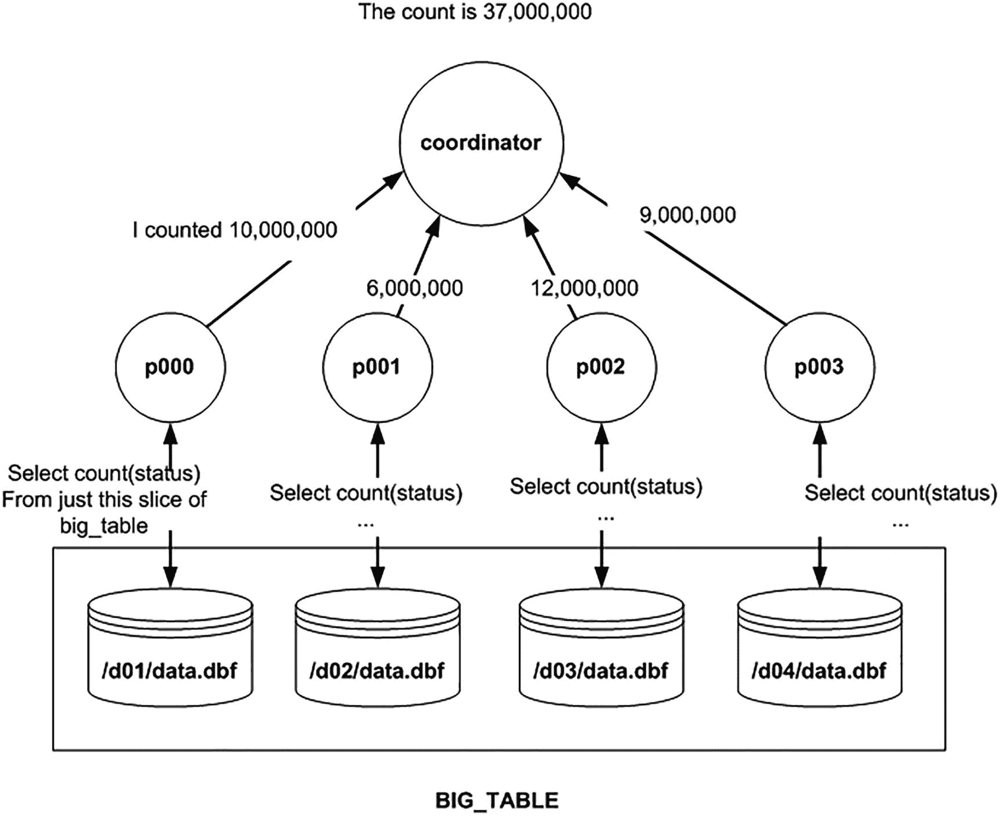
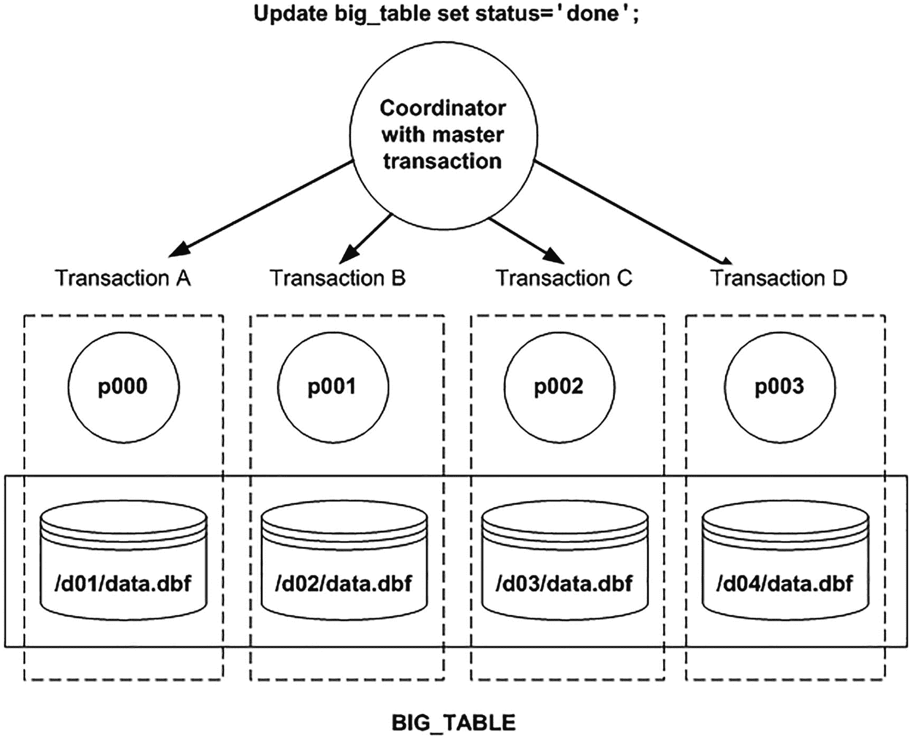
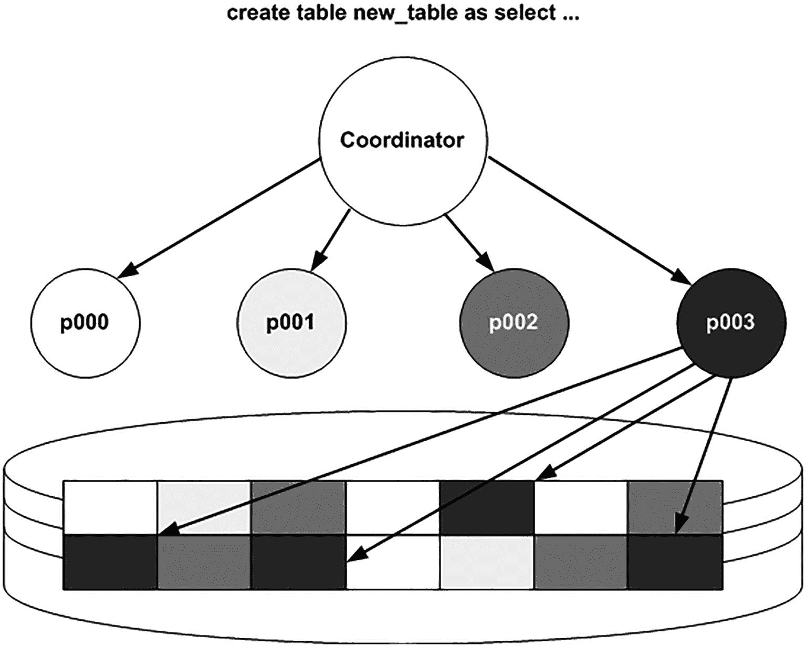

# Oracle 数据库本地索引技术详解

## 本地索引的分区消除

| Id | Operation                                  | Name               | Pstart| Pstop |
|----|--------------------------------------------|--------------------|-------|-------|
|  0 | SELECT STATEMENT                           |                    |       |       |
|  1 |  PARTITION RANGE ALL                       |                    |     1 |     2 |
|  2 |   TABLE ACCESS BY LOCAL INDEX ROWID BATCHED| PARTITIONED_TABLE  |     1 |     2 |
|  3 |    INDEX RANGE SCAN                        | LOCAL_NONPREFIXED  |     1 |     2 |

```

这里，优化器*无法*将 `LOCAL_NONPREFIXED` 索引的 `PART_2` 分区排除在考虑范围之外——它需要查看索引的 `PART_1` 和 `PART_2` 两个分区，以确定 `B=1` 是否存在于其中。这正是本地非前缀索引的一个性能问题所在：它们不像前缀索引那样*强制*你在谓词中使用分区键。这并不是说前缀索引更好；只是要想使用前缀索引，你必须使用一个允许分区消除的查询。

如果我们删除 `LOCAL_PREFIXED` 索引并重新运行最初成功的查询，如下所示：

```
SQL> drop index local_prefixed;
Index dropped.

SQL> select * from partitioned_table where a = 1 and b = 1;
A          B DATA
---------- ----------
1          1 x
```

查询成功了，但正如我们将看到的，它使用了刚刚导致查询失败的同一个索引。执行计划显示 Oracle 在这里能够应用分区消除——谓词 `A=1` 提供了足够的信息让数据库将索引分区 `PART_2` 排除在考虑范围之外：

```
SQL> explain plan for select * from partitioned_table where a = 1 and b = 1;
Explained.

SQL> select * from table(dbms_xplan.display(null,null,'BASIC +PARTITION'));

| Id | Operation                                  | Name              | Pstart| Pstop |
|----|--------------------------------------------|-------------------|-------|-------|
|  0 | SELECT STATEMENT                           |                   |       |       |
|  1 |  PARTITION RANGE SINGLE                    |                   |     1 |     1 |
|  2 |   TABLE ACCESS BY LOCAL INDEX ROWID BATCHED| PARTITIONED_TABLE |     1 |     1 |
|  3 |    INDEX RANGE SCAN                        | LOCAL_NONPREFIXED |     1 |     1 |

```

注意 `PSTART` 和 `PSTOP` 列的值均为 1。这证明了优化器即使对于非前缀的本地索引也能够执行分区消除。

如果你经常使用以下查询来查询前面的表，那么可以考虑在 (`b`,`a`) 上创建一个本地非前缀索引：

```
select ... from partitioned_table where a = :a and b = :b;
select ... from partitioned_table where b = :b;
```

该索引对于上述两个查询都有用。而 (`a`,`b`) 上的本地前缀索引仅对第一个查询有用。

这里的核心观点是，你不应该害怕非前缀索引，或者认为它们是主要的性能障碍。如果你的许多查询可以像前面概述的那样从非前缀索引中受益，那么你应该考虑使用一个。主要问题是确保你的查询尽可能包含允许索引分区消除的谓词。使用前缀本地索引强制了这种考虑。使用非前缀索引则没有。同时也要考虑索引将如何被使用。如果它将被用作查询计划的第一步，那么两种索引类型之间的差异不大。

#### 本地索引与唯一约束

要强制唯一性——包括 `UNIQUE` 约束或 `PRIMARY KEY` 约束——如果你想使用本地索引来强制约束，那么你的分区键*必须包含在约束本身中*。在我看来，这是本地索引最大的限制。Oracle 只在索引分区内强制唯一性——永远不会跨分区强制。这意味着什么？例如，你不能在 `TIMESTAMP` 字段上进行范围分区，同时在一个使用本地分区索引强制的 `ID` 列上拥有主键。Oracle 将转而使用*全局*索引来强制唯一性。

在下一个例子中，我们将创建一个按名为 `TIMESTAMP` 的列进行范围分区的表，但该表在 `ID` 列上有一个主键。我们可以通过在没有任何其他对象的 schema 中执行以下 `CREATE TABLE` 语句来实现，这样我们就可以轻松地通过查看该用户拥有的每个段来确切地看到创建了哪些对象：

```
SQL> CREATE TABLE partitioned
  2  ( timestamp date,
  3    id        int,
  4    constraint partitioned_pk primary key(id)
  5  )
  6  PARTITION BY RANGE (timestamp)
  7  (
  8    PARTITION part_1 VALUES LESS THAN
  9      ( to_date('01/01/2021','dd/mm/yyyy') ) ,
 10    PARTITION part_2 VALUES LESS THAN
 11      ( to_date('01/01/2022','dd/mm/yyyy') )
 12  );
Table created.
```

并插入一些数据以便创建段：

```
SQL> insert into partitioned values(to_date('01/01/2020','dd/mm/yyyy'),1);
1 row created.

SQL> insert into partitioned values(to_date('01/01/2021','dd/mm/yyyy'),2);
1 row created.
```

假设我们在一个没有其他对象的 schema 中运行此命令，我们将看到以下内容：

```
SQL > select segment_name, partition_name, segment_type from user_segments;

SEGMENT_NAME              PARTITION_NAME            SEGMENT_TYPE
------------------------- ------------------------- ---------------
PARTITIONED               PART_1                    TABLE PARTITION
PARTITIONED               PART_2                    TABLE PARTITION
PARTITIONED_PK                                      INDEX
```

`PARTITIONED_PK` 索引甚至不是分区的，更不用说是本地分区的了，正如我们将看到的，它不能是本地分区的。即使我们试图通过意识到主键可以由非唯一索引以及唯一索引来强制，从而“欺骗” Oracle，我们也会发现这种方法也不起作用：

```
SQL> drop table partitioned;

SQL> CREATE TABLE partitioned
  2  ( timestamp date,
  3    id        int
  4  )
  5  PARTITION BY RANGE (timestamp)
  6  (
  7    PARTITION part_1 VALUES LESS THAN
  8      ( to_date('01-jan-2021','dd-mon-yyyy') ) ,
  9    PARTITION part_2 VALUES LESS THAN
 10      ( to_date('01-jan-2022','dd-mon-yyyy') )
 11  );
Table created.

SQL> create index partitioned_idx on partitioned(id) local;
Index created.
```

并插入一些数据以便创建段：

```
SQL> insert into partitioned values(to_date('01/01/2020','dd/mm/yyyy'),1);
1 row created.

SQL> insert into partitioned values(to_date('01/01/2021','dd/mm/yyyy'),2);
1 row created

SQL> select segment_name, partition_name, segment_type from user_segments;

SEGMENT_NAME              PARTITION_NAME            SEGMENT_TYPE
------------------------- ------------------------- ---------------
PARTITIONED               PART_1                    TABLE PARTITION
PARTITIONED               PART_2                    TABLE PARTITION
PARTITIONED_IDX           PART_1                    INDEX PARTITION
PARTITIONED_IDX           PART_2                    INDEX PARTITION

SQL> alter table partitioned
  2  add constraint
  3  partitioned_pk
  4  primary key(id);
alter table partitioned
*
ERROR at line 1:
ORA-01408: such column list already indexed
```

在这里，Oracle 尝试在 `ID` 上创建一个全局索引，但发现无法创建，因为已经存在一个索引。如果之前创建的索引不是分区的，前面的语句将会工作，因为 Oracle 会使用该索引来强制约束。

# 为何没有分区键就无法强制实施唯一性

无法强制实施唯一性（除非分区键是约束的一部分）的原因有两个。首先，如果 Oracle 允许这样做，将会使分区的大部分优势失效。可用性和可扩展性将会丧失，因为每个分区都必须始终处于`可用`状态并被`扫描`才能执行任何插入和更新操作。分区越多，数据的可用性就越低。分区越多，需要扫描的索引分区也越多，分区的可扩展性就越差。这样做非但不能提供可用性和可扩展性，反而会同时降低这两者。

此外，Oracle 必须在事务级别有效地`序列化`对此表的插入和更新。这是因为，如果我们将`ID=1`添加到`PART_1`，Oracle 将必须设法`阻止`其他人将`ID=1`添加到`PART_2`。实现这一点的唯一方法是阻止其他人修改索引分区`PART_2`，因为在该分区中实际上没有什么可以锁定的。

在`OLTP`系统中，唯一约束必须由系统强制实施（即由 Oracle 强制实施），以确保数据的完整性。这意味着你应用的逻辑模型将对物理设计产生影响。唯一性约束将要么驱动底层表的分区方案，决定分区键的选择；要么引导你使用`全局`索引。我们接下来将更深入地了解全局索引。

## 全局索引

全局索引使用的分区方案与底层表的分区方案不同。表可能按`TIMESTAMP`列分区为十个分区，而该表上的全局索引则可能按`REGION`列分区为五个分区。与本地索引不同，全局索引只有一类，那就是`前缀全局索引`。Oracle 不支持索引键不以*该索引的*分区键开头的全局索引。这意味着，无论你使用什么属性来分区索引，该属性都将位于索引键本身的前端。

基于我们之前的例子，这里是一个使用全局索引的快速示例。它展示了全局分区索引可用于为主键强制实施唯一性，因此你可以拥有强制实施唯一性但不包含表分区键的分区索引。以下示例创建了一个按`TIMESTAMP`分区的表，其索引按`ID`分区：

```sql
$ sqlplus eoda/foo@PDB1
SQL> drop table partitioned;
SQL> CREATE TABLE partitioned
( timestamp date,
id        int
)
PARTITION BY RANGE (timestamp)
(
PARTITION part_1 VALUES LESS THAN
( to_date('01-jan-2021','dd-mon-yyyy') ) ,
PARTITION part_2 VALUES LESS THAN
( to_date('01-jan-2022','dd-mon-yyyy') )
);
Table created.
SQL> create index partitioned_index
on partitioned(id)
GLOBAL
partition  by range(id)
(
partition part_1 values less than(1000),
partition part_2 values less than (MAXVALUE)
);
Index created.
```

请注意此索引中`MAXVALUE`的使用。`MAXVALUE`可用于任何按范围分区的表以及索引中。它代表范围上的`无限上界`。在我们目前的例子中，我们对范围使用了硬性上界（值小于<*某个值*>）。然而，全局索引有一个要求，即最高分区（最后一个分区）的分区边界值必须是`MAXVALUE`。这确保了底层表中的所有行都能被放置到索引中。

现在，为了完成这个示例，我们将主键添加到表中：

```sql
SQL> alter table partitioned add constraint partitioned_pk  primary key(id);
Table altered.
```

仅从这段代码中并不明显看出 Oracle 正在使用我们创建的索引来强制实施主键（对我来说是明显的，因为我知道 Oracle 在使用它），我们可以通过尝试删除该索引来证明它：

```sql
SQL> drop index partitioned_index;
drop index partitioned_index
*
ERROR at line 1:
ORA-02429: cannot drop index used for enforcement of unique/primary key
```

为了展示 Oracle 不允许我们创建`非前缀`的全局索引，我们只需要尝试以下操作：

```sql
SQL> create index partitioned_index2
on partitioned(timestamp,id)
GLOBAL
partition  by range(id)
(
partition part_1 values less than(1000),
partition part_2 values less than (MAXVALUE)
);
partition  by range(id)
*
ERROR at line 4:
ORA-14038: GLOBAL partitioned index must be prefixed
```

错误信息相当清楚。全局索引*必须*是前缀的。那么，何时你会使用全局索引呢？我们将考察两种系统类型，数据仓库和 OLTP，看看它们可能在什么时候适用。

### 数据仓库与全局索引

许多数据仓库采用滑动窗口方法来管理数据——即删除表中最旧的分区并为新加载的数据添加一个新分区。在接下来的章节中，我们将了解`数据的滑动窗口`意味着什么，以及全局索引对其`潜在`的影响。

#### 滑动窗口与索引

以下示例实现了一个经典的数据滑动窗口。在许多实现中，数据会随着时间推移被添加到仓库中，而最旧的数据则会被清除（老化）。很多时候，这些数据会按日期属性进行范围分区，这样最旧的数据就存储在一个单独的分区中，而新加载的数据同样也存储在一个新的分区中。每月的加载过程包括：

*   *分离旧数据*：最旧的分区要么被删除，要么与一个空表交换（将最旧的分区变成一个表），以便对旧数据进行归档。
*   *加载和索引新数据*：新数据被加载到一个工作表中，并进行索引和验证。
*   *附加新数据*：一旦新数据加载并处理完毕，其所在的表会与分区表中的一个空分区进行交换，从而将这张表中新加载的数据转变为大型分区表的一个分区。

这个过程每个月重复一次，或者根据加载过程执行的频率进行；可能是每天或每周。我们将在本节中实现这个非常典型的过程，以展示全局分区索引的影响，并演示我们在分区操作期间可用的选项，以提高可用性，使我们能够实现数据的滑动窗口并保持数据的持续可用。

在这个示例中，我们将处理年度数据，并加载了 2020 和 2021 财年。该表将按 `TIMESTAMP` 列进行分区，并将创建两个索引——一个是 `ID` 列上的本地分区索引，另一个是 `TIMESTAMP` 列上的全局索引（在此例中为非分区索引）：

```sql
$ sqlplus eoda/foo@PDB1
SQL> drop table partitioned;
SQL> CREATE TABLE partitioned
( timestamp date,
id        int
)
PARTITION BY RANGE (timestamp)
(
PARTITION fy_2020 VALUES LESS THAN
( to_date('01-jan-2021','dd-mon-yyyy') ) ,
PARTITION fy_2021 VALUES LESS THAN
( to_date('01-jan-2022','dd-mon-yyyy') ) );
Table created.
SQL> insert into partitioned partition(fy_2020)
select to_date('31-dec-2020','dd-mon-yyyy')-mod(rownum,360), rownum
from dual connect by level<360*5;
SQL> insert into partitioned partition(fy_2021)
select to_date('31-dec-2021','dd-mon-yyyy')-mod(rownum,360), rownum
from dual connect by level<360*5;
SQL> create index partitioned_idx_local on partitioned(id) LOCAL;
Index created.
SQL> create index partitioned_idx_global on partitioned(timestamp)  GLOBAL;
Index created.
```

这就设置好了我们的仓库表。数据按财年分区，我们保留了最近两年的数据在线。该表有两个索引：一个是 `LOCAL`（本地）索引，另一个是 `GLOBAL`（全局）索引。现在已到年底，我们希望执行以下操作：

1.  *移除最旧的财年数据*：我们并非要永久丢失这些数据；只是希望将其老化并归档。
2.  *添加最新的财年数据*：加载、转换、索引等操作需要一些时间。如果可能，我们希望在不影响当前数据可用性的情况下完成这些工作。

第一步是为 2020 财年创建一个与分区表结构相同的空表。我们将使用此表与分区表中的 `FY_2020` 分区进行交换，从而将该分区转变为一张表，进而清空分区表中的对应分区。最终效果是，交换后，分区表中最旧的数据实际上已被移除：

```sql
SQL> create table fy_2020 ( timestamp date, id int );
Table created.
SQL> create index fy_2020_idx on fy_2020(id);
Index created.
```

我们将对要加载的新数据执行相同操作。我们将创建并加载一个在结构上类似于现有分区表（但其本身并非分区表）的表：

```sql
SQL> create table fy_2022 ( timestamp date, id int );
Table created.
SQL> insert into fy_2022
select to_date('31-dec-2022','dd-mon-yyyy')-mod(rownum,360), rownum
from dual connect by level<360*5;
SQL> create index fy_2022_idx on fy_2022(id) nologging;
Index created.
```

我们将把当前已满的分区变为空分区，并创建一个包含 `FY_2020` 数据的完整表。同时，我们已经完成了使 `FY_2022` 数据准备就绪所需的所有工作。这包括验证数据、进行转换——任何为了使其准备就绪而需要执行的复杂任务。现在，我们准备好使用交换分区来更新实时数据：

```sql
SQL> alter table partitioned
exchange partition fy_2020
with table fy_2020
including indexes
without validation;
Table altered.
SQL> alter table partitioned drop partition fy_2020;
Table altered.
```

这就是我们清除旧数据所需要做的全部工作。我们将该分区变成了一张完整的表，并将空表变成了一个分区。这只是一个简单的数据字典更新。没有发生大量的 I/O 操作——它瞬间就完成了。我们现在可以将该 `FY_2020` 表（也许使用可传输表空间）从数据库中导出以用于归档目的。如果需要，我们可以快速地将其重新附加回来。

接下来，我们希望滑入新数据：

```sql
SQL> alter table partitioned add partition fy_2022
values less than ( to_date('01-jan-2023','dd-mon-yyyy') );
Table altered.
SQL> alter table partitioned
exchange partition fy_2022
with table fy_2022
including indexes
without validation;
Table altered.
```

同样，这也是瞬间完成的；它是通过简单的数据字典更新实现的——`WITHOUT VALIDATION` 子句使我们能够做到这一点。当你使用该子句时，数据库将信任你放入该分区的数据实际上对于该分区是有效的。添加空分区几乎不需要处理时间。然后，我们将新创建的空分区与完整的表进行交换，完整的表与空分区进行交换，该操作执行得也很快。新数据已经在线可用。

然而，查看我们的索引，会发现以下情况：

```sql
SQL> select index_name, status from user_indexes;

INDEX_NAME                STATUS
------------------------- --------
PARTITIONED_IDX_LOCAL     N/A
PARTITIONED_IDX_GLOBAL    UNUSABLE
FY_2020_IDX               VALID
FY_2022_IDX               VALID
```

全局索引在此操作后当然是不可用的（`UNUSABLE`）。因为每个索引分区可以指向任何表分区，*而且*我们刚刚移除并添加了一个分区，所以该索引是无效的。它包含指向已删除分区的条目。它*没有*指向刚刚添加分区的条目。任何使用此索引的查询都会失败而无法执行，或者如果我们跳过不可用的索引，查询性能会因无法使用该索引而受到负面影响：

```sql
SQL> select /*+ index( partitioned PARTITIONED_IDX_GLOBAL ) */ count(*)
  from partitioned
  where timestamp between to_date( '01-mar-2022', 'dd-mon-yyyy' )
                      and to_date( '31-mar-2022', 'dd-mon-yyyy' );
select /*+ index( partitioned PARTITIONED_IDX_GLOBAL ) */ count(*)
*
ERROR at line 1:
ORA-01502: index 'EODA.PARTITIONED_IDX_GLOBAL' or partition of such index is in unusable state
SQL> explain plan for select count(*)
  from partitioned
  where timestamp between to_date( '01-mar-2022', 'dd-mon-yyyy' )
                      and to_date( '31-mar-2022', 'dd-mon-yyyy' );
SQL> select * from table(dbms_xplan.display(null,null,'BASIC +PARTITION'));

| Id | Operation               | Name        | Pstart| Pstop |
|  0 | SELECT STATEMENT        |             |       |       |
|  1 |  SORT AGGREGATE         |             |       |       |
|  2 |   PARTITION RANGE SINGLE|             |     2 |     2 |
|  3 |    TABLE ACCESS FULL    | PARTITIONED |     2 |     2 |
```

因此，在执行了包含全局索引的此分区操作后，我们的选择是


*   确保 `SKIP_UNUSABLE_INDEXES=TRUE`（默认值为 `TRUE`），这样 Oracle 就不会使用这个不可用的索引。但这样一来，我们就失去了该索引原本带来的性能提升。

*   重建此索引，使其再次可用。

*   在执行分区维护时（本章下一节的重点），使用 `UPDATE GLOBAL INDEXES` 子句。

到目前为止几乎实现零停机的滑动窗口过程，在重建全局索引时将花费非常长的时间才能完成。在此期间，依赖这些索引的查询的运行时性能将受到负面影响——要么根本无法运行，要么会在没有索引优势的情况下运行。所有数据都必须被扫描，整个索引需要根据表数据重新构建。如果表的大小达到数百千兆字节，这将消耗大量资源。

#### "在线"全局索引维护

Oracle 有能力在分区操作期间使用 `UPDATE GLOBAL INDEXES` 子句来`维护全局索引`。这意味着当你删除一个分区、拆分一个分区或对分区执行任何必要操作时，Oracle 会对全局索引执行必要的修改以使其保持最新。由于大多数分区操作都会导致这种全局索引失效，因此此功能对于需要持续提供数据访问的系统来说是一个福音。你会发现，你牺牲了分区操作的原始速度（以及之后立即发生的、因重建索引导致的不可用窗口），换来了分区操作整体响应时间变慢但数据可用性达到 100%。简而言之，如果你有一个不能停机但又必须支持这种常见数据仓库技术（即数据的滑入滑出）的数据仓库，那么这个功能就是为你准备的——但你必须理解其含义。

回顾我们之前的例子，如果我们的分区操作在相关时使用了 `UPDATE GLOBAL INDEXES` 子句（在此示例中，`ADD PARTITION` 语句不需要它，因为新添加的分区中不包含任何行），我们会发现索引在操作期间和之后都完全有效且可用：

```
SQL> alter table partitioned
exchange partition fy_2020
with table fy_2020
including indexes
without validation
UPDATE GLOBAL INDEXES;
Table altered.
SQL> alter table partitioned drop partition fy_2020 update global indexes;
Table altered.
SQL> alter table partitioned add partition fy_2022
values less than ( to_date('01-jan-2023','dd-mon-yyyy') );
Table altered.
SQL> alter table partitioned
exchange partition fy_2022
with table fy_2022
including indexes
without validation
UPDATE GLOBAL INDEXES;
Table altered.
```

请注意下面的输出，`PARTITIONED_IDX_LOCAL` 索引的状态显示为 `N/A`，这仅仅表示该状态与该索引关联的索引分区有关，而不是索引本身。说本地分区索引是否有效是没有意义的；它只是一个逻辑上容纳索引分区本身的容器：

```
SQL> select index_name, status from user_indexes;
INDEX_NAME                STATUS
------------------------- --------
PARTITIONED_IDX_LOCAL     N/A
PARTITIONED_IDX_GLOBAL    VALID
FY_2020_IDX               VALID
FY_2022_IDX               VALID
SQL> explain plan for select count(*) from partitioned
where timestamp between to_date( '01-mar-2022', 'dd-mon-yyyy' )
and to_date( '31-mar-2022', 'dd-mon-yyyy' );
SQL> select * from table(dbms_xplan.display(null,null,'BASIC +PARTITION'));

| Id | Operation         | Name                   |
|  0 | SELECT STATEMENT  |                        |
|  1 |  SORT AGGREGATE   |                        |
|  2 |   INDEX RANGE SCAN| PARTITIONED_IDX_GLOBAL |
```

但这需要权衡取舍：我们正在对全局索引结构执行逻辑上等同于 `DELETE` 和 `INSERT` 的操作。当我们删除一个分区时，必须删除所有可能指向该分区的全局索引条目。当我们执行表与分区的交换操作时，必须删除所有指向原始数据的全局索引条目，然后插入所有新滑入数据的条目。因此，`ALTER` 命令执行的工作量显著增加。

对于考虑全局索引维护的情况，你应该预期，不采用索引维护的方法会消耗更少的数据库资源，因此执行速度更快，但会产生一段可衡量的停机时间。第二种方法涉及维护索引，将消耗更多资源，整体耗时可能更长，但不会导致停机。对于最终用户来说，他们的工作能力从未中断。他们处理速度可能稍慢（因为我们与他们竞争资源），但他们仍在处理，从未停止。

考虑到所用时间和 CPU 时间，索引重建方法几乎肯定会运行得更快。这个事实让许多 DBA 停下来说：“嘿，我不想用 `UPDATE GLOBAL INDEXES`——它太慢了。”然而，这种观点过于简单化了。你需要记住的是，虽然操作整体耗时更长，但系统上的处理并未必然中断。当然，作为 DBA，你可能会盯着屏幕看更长时间，但系统上真正重要的工作仍在进行。你需要看看这种权衡对你是否有意义。如果你有一个八小时的夜间维护窗口来加载新数据，那么请务必使用重建方法（如果合理的话）。然而，如果你的任务是要求持续可用，那么维护全局索引的能力将至关重要。

还需要考虑的一点是每种方法生成的重做日志量。你会发现 `UPDATE GLOBAL INDEXES` 会生成相当多的重做日志（由于索引维护），并且你应该预期，随着你在表上添加越来越多的全局索引，这个量只会增加。`UPDATE GLOBAL INDEXES` 处理生成的重做日志是不可避免的，并且无法通过 `NOLOGGING` 关闭，因为全局索引的维护不是其结构的完整重建，而更像是增量维护。此外，由于你维护的是活动的索引结构，你必须为其生成回滚数据——万一分区操作失败，你必须准备好将索引恢复原状。记住，回滚数据本身受重做日志保护，因此你看到生成的一些重做日志来自索引更新，另一些来自回滚操作。再添加一两个全局索引，你就有理由预期这些数字会增加。

因此，`UPDATE GLOBAL INDEXES` 是一个允许你用可用性换取资源消耗的选项。如果你需要提供持续可用性，那么它就是适合你的选项。但你必须理解其影响，并相应地调整系统其他组件的规模。具体来说，许多数据仓库经过精心设计，长期使用批量直接路径操作，绕过回滚数据生成，并且在允许的情况下也绕过重做日志生成。使用 `UPDATE GLOBAL INDEXES` 无法绕过这两个要素。在使用此功能之前，你需要检查用于确定重做日志和回滚数据需求规模的规则，以确保它可以在你的系统上工作。


#### 异步全局索引维护

如前一节所示，您可以在删除或截断分区时通过 `UPDATE GLOBAL INDEXES` 子句来维护全局索引。然而，如前所述，此类操作在时间和资源消耗方面是有代价的。

在删除或截断表分区时，Oracle 会推迟删除与已删除或截断分区相关联的全局索引条目。这被称为异步全局索引维护。Oracle 将全局索引的维护推迟到未来的某个时间，同时保持全局索引可用。其理念是，这提高了删除/截断分区的性能，同时使任何全局索引保持可用状态。索引条目的实际清理工作会稍后（异步地）由 DBA 或由自动调度的 Oracle 作业完成。这并不是说工作量减少了，而是将索引条目的清理工作与 `DROP/TRUNCATE` 语句解耦了。

一个小例子将演示异步全局索引维护。为此，我们创建一个表，用测试数据填充它，并创建一个全局索引：

```sql
$ sqlplus eoda/foo@PDB1
SQL> drop table partitioned;
SQL> CREATE TABLE partitioned
( timestamp date,
id        int
)
PARTITION BY RANGE (timestamp)
(PARTITION fy_2020 VALUES LESS THAN
(to_date('01-jan-2021','dd-mon-yyyy')),
PARTITION fy_2021 VALUES LESS THAN
( to_date('01-jan-2022','dd-mon-yyyy')));
SQL> insert into partitioned partition(fy_2020)
select to_date('31-dec-2020','dd-mon-yyyy')-mod(rownum,364), rownum
from dual connect by level < 100000;
SQL> insert into partitioned partition(fy_2021)
select to_date('31-dec-2021','dd-mon-yyyy')-mod(rownum,364), rownum
from dual connect by level < 100000;
SQL> create index partitioned_idx_global on partitioned(timestamp) GLOBAL;
Index created.
```

接下来，我们将运行一个查询来获取当前会话的 `redo size` 和 `db block gets` 统计信息的当前值：

```sql
SQL> col r1 new_value r2
SQL> col b1 new_value b2
SQL> select * from
(select b.value r1
from v$statname a, v$mystat b
where a.statistic# = b.statistic#
and a.name = 'redo size'),
(select b.value b1
from v$statname a, v$mystat b
where a.statistic# = b.statistic#
and a.name = 'db block gets');
R1         B1
---------- ----------
56928036      80829
```

接下来，删除一个分区，并指定 `UPDATE GLOBAL INDEXES` 子句：

```sql
SQL> alter table partitioned drop partition fy_2020 update global indexes;
Table altered.
```

现在，我们将计算生成的重做量和访问的当前块数：

```sql
SQL> select * from
(select b.value - &r2 redo_gen
from v$statname a, v$mystat b
where a.statistic# = b.statistic#
and a.name = 'redo size'),
(select b.value - &b2 db_block_gets
from v$statname a, v$mystat b
where a.statistic# = b.statistic#
and a.name = 'db block gets');
old   2: (select b.value - &r2 redo_gen
new   2: (select b.value - 4816712 redo_gen
old   6: (select b.value - &b2 db_block_gets
new   6: (select b.value - 4512 db_block_gets
REDO_GEN DB_BLOCK_GETS
---------- -------------
16864           103
```

只生成了少量的重做日志，并且访问了很少的数据块。其背后的原因是，Oracle 不会立即执行从已删除分区中移除索引条目的索引维护操作。相反，这些条目被标记为孤儿，稍后将由 Oracle 进行清理。可以通过以下查询验证孤儿条目的存在：

```sql
SQL> select index_name, orphaned_entries, status from user_indexes where table_name='PARTITIONED';
INDEX_NAME                ORP STATUS
------------------------- --- --------
PARTITIONED_IDX_GLOBAL    YES VALID
```

这些孤儿条目如何被清理？Oracle 有一个自动调度的 `PMO_DEFERRED_GIDX_MAINT_JOB` 作业，它在每晚的维护窗口中运行：

```sql
SQL> select job_name from dba_scheduler_jobs where job_name like 'PMO%';
JOB_NAME
------------------------------
PMO_DEFERRED_GIDX_MAINT_JOB
```

如果您不想等待该作业，可以手动清理这些条目：

```sql
SQL> exec dbms_part.cleanup_gidx;
PL/SQL procedure successfully completed.
```

现在检查孤儿行，显示已不存在：

```sql
SQL> select index_name, orphaned_entries, status from user_indexes where table_name='PARTITIONED';
INDEX_NAME                 ORP STATUS
-------------------------- --- --------------------
PARTITIONED_IDX_GLOBAL     NO  VALID
```

通过这种方式，您可以执行诸如删除和截断分区等操作，并且仍然使您的全局索引保持可用状态，而无需在删除/截断操作中立即承担清理索引条目的开销。

> **提示**
>
> 有关异步全局索引维护的更多详细信息，请参阅 Oracle 支持说明 1482264.1。

# OLTP 与全局索引

OLTP 系统的特点是频繁发生许多小型的读写事务。通常，快速访问所需的行（或多行）至关重要。数据完整性至关重要。可用性也非常重要。全局索引在 OLTP 系统的许多情况下具有合理性。

表数据只能按一个键（一组列）进行分区。但是，您可能需要以多种不同的方式访问数据。您可能按 `LOCATION` 在表中对 `EMPLOYEE` 数据进行分区，但仍需要快速通过以下方式访问 `EMPLOYEE` 数据：

*   `DEPARTMENT`：部门在地理上是分散的。部门与位置之间没有关系。
*   `EMPLOYEE_ID`：虽然员工 ID 能决定一个位置，但您不希望必须按 `EMPLOYEE_ID` 和 `LOCATION` 进行搜索；因此，无法在索引分区上进行分区消除。此外，`EMPLOYEE_ID` 本身必须是 `unique`（唯一的）。
*   `JOB_TITLE`：`JOB_TITLE` 与 `LOCATION` 之间没有关系。所有的 `JOB_TITLE` 值都可能出现在任何 `LOCATION` 中。

在应用程序的不同位置，需要通过许多不同的键访问 `EMPLOYEE` 数据，而且速度至关重要。在数据仓库中，我们可能只会在这些键上使用本地分区索引，并使用并行索引范围扫描来快速收集大量数据。在这些情况下，我们不一定需要使用索引分区消除。然而，在 OLTP 系统中，我们确实需要使用它。并行查询不适用于这些系统；我们需要适当地提供索引。因此，我们将需要在某些字段上使用全局索引。

## OLTP 索引的目标

以下是我们需要满足的目标：

*   快速访问
*   数据完整性
*   可用性

全局索引可以帮助我们在 OLTP 系统中实现这些目标。我们很可能不会执行滑动窗口操作（暂且不谈审计）。我们不会拆分分区（除非有计划停机），不会移动数据，等等。通常在实时 OLTP 系统上不会执行我们在数据仓库中进行的操作。

这里有一个小例子，展示了我们如何使用全局索引实现上述三个目标。我将使用简单的、`单分区` 全局索引，但使用多分区的全局索引结果不会有所不同（除了随着我们添加索引分区，可用性和可管理性会 `增加`）。我们首先创建表空间 `P1`、`P2`、`P3` 和 `P4`，然后创建一个表，该表根据我们的规则按位置 `LOC` 进行范围分区，规则将所有小于 `'C'` 的 `LOC` 值放入分区 `P1`，小于 `'D'` 的放入分区 `P2`，依此类推：

```
$ sqlplus eoda/foo@PDB1
SQL> create tablespace p1 datafile size 1m autoextend on next 1m;
Tablespace created.
SQL> create tablespace p2 datafile size 1m autoextend on next 1m;
Tablespace created.
SQL> create tablespace p3 datafile size 1m autoextend on next 1m;
Tablespace created.
SQL> create tablespace p4 datafile size 1m autoextend on next 1m;
Tablespace created.
SQL> create table emp
(EMPNO             NUMBER(4) NOT NULL,
ENAME             VARCHAR2(10),
JOB               VARCHAR2(9),
MGR               NUMBER(4),
HIREDATE          DATE,
SAL               NUMBER(7,2),
COMM              NUMBER(7,2),
DEPTNO            NUMBER(2) NOT NULL,
LOC               VARCHAR2(13) NOT NULL
)
partition by range(loc)
(
partition p1 values less than('C') tablespace p1,
partition p2 values less than('D') tablespace p2,
partition p3 values less than('N') tablespace p3,
partition p4 values less than('Z') tablespace p4
);
Table created.
```

我们修改表以在主键列上添加约束：

```
SQL> alter table emp add constraint emp_pk primary key(empno);
Table altered.
```

这样做的一个副作用是，在 `EMPNO` 列上存在了一个唯一索引。这表明我们可以支持并强制执行数据完整性（这是我们的目标之一）。最后，我们在 `DEPTNO` 和 `JOB` 上再创建两个全局索引，以便通过这些属性快速访问记录：

```
SQL> create index emp_job_idx on emp(job) GLOBAL;
Index created.
SQL> create index emp_dept_idx on emp(deptno) GLOBAL;
Index created.
SQL> insert into emp
select e.*, d.loc
from scott.emp e, scott.dept d
where e.deptno = d.deptno;
14 rows created.
```

让我们看看每个分区中有什么：

```
SQL> break on pname skip 1
SQL> select 'p1' pname, empno, job, loc from emp partition(p1)
union all
select 'p2' pname, empno, job, loc from emp partition(p2)
union all
select 'p3' pname, empno, job, loc from emp partition(p3)
union all
select 'p4' pname, empno, job, loc from emp partition(p4);
PN      EMPNO JOB       LOC
-- ---------- --------- -------------
p2       7499 SALESMAN  CHICAGO
7521 SALESMAN  CHICAGO
7654 SALESMAN  CHICAGO
7698 MANAGER   CHICAGO
7844 SALESMAN  CHICAGO
7900 CLERK     CHICAGO
p3       7369 CLERK     DALLAS
7566 MANAGER   DALLAS
7788 ANALYST   DALLAS
7876 CLERK     DALLAS
7902 ANALYST   DALLAS
p4       7782 MANAGER   NEW YORK
7839 PRESIDENT NEW YORK
7934 CLERK     NEW YORK
14 rows selected.
```

这显示了数据按位置到各个分区的分布情况。我们现在可以查看一些查询计划，看看在性能方面我们可以期待什么：

```
SQL> variable x varchar2(30);
SQL> begin
dbms_stats.set_table_stats
( user, 'EMP', numrows=>100000, numblks => 10000 );
end;
/
PL/SQL procedure successfully completed.
SQL> explain plan for select empno, job, loc from emp where empno = :x;
Explained.
SQL> select * from table(dbms_xplan.display(null,null,'BASIC +PARTITION'));

| Id | Operation                          | Name   | Pstart| Pstop |

|  0 | SELECT STATEMENT                   |        |       |       |
|  1 |  TABLE ACCESS BY GLOBAL INDEX ROWID| EMP    | ROWID | ROWID |
|  2 |   INDEX UNIQUE SCAN                | EMP_PK |       |       |
```

这里的计划显示了对我们为主键支持而创建的非分区索引 `EMP_PK` 进行了 `INDEX UNIQUE SCAN`（索引唯一扫描）。然后是 `TABLE ACCESS BY GLOBAL INDEX ROWID`（通过全局索引 ROWID 访问表），其 `PSTART` 和 `PSTOP` 为 `ROWID/ROWID`，这意味着当我们从索引中获取 `ROWID` 时，它将准确地告诉我们读取哪个索引分区来获取这一行。这种索引访问的效率将与在非分区表上一样，并执行相同数量的 I/O 来完成。它只是一个简单的、单索引唯一扫描，后跟“通过 rowid 获取此行”。现在，让我们看看另一个全局索引，即 `JOB` 上的那个：

```
SQL> explain plan for select empno, job, loc from emp where job = :x;
Explained.
SQL> select * from table(dbms_xplan.display);

| Id | Operation                                  | Name        | Pstart| Pstop |

|  0 | SELECT STATEMENT                           |             |       |       |
|  1 |  TABLE ACCESS BY GLOBAL INDEX ROWID BATCHED| EMP         | ROWID | ROWID |
|  2 |   INDEX RANGE SCAN                         | EMP_JOB_IDX |       |       |
```

果然，我们看到了 `INDEX RANGE SCAN` 的类似效果。我们的索引被使用，并且可以为底层数据提供高速的 OLTP 访问。如果它们是分区的，它们将必须是前缀的，并强制执行索引分区消除；因此，它们也是可扩展的，这意味着我们可以对它们进行分区并观察到相同的行为。稍后，我们将看看如果只使用 `LOCAL`（本地）索引会发生什么。

最后，让我们看看可用性方面。Oracle 文档声称，全局分区索引比本地分区索引的数据可用性更低。我完全不同意这种笼统的描述。我相信，在 OLTP 系统中，它们与本地分区索引一样具有高可用性。考虑以下情况：


# 部分索引

```sql
SQL> alter tablespace p1 offline;
SQL> alter tablespace p2 offline;
SQL> alter tablespace p3 offline;
SQL> select empno, job, loc from emp where empno = 7782;
EMPNO JOB       LOC
---------- --------- -------------
7782 MANAGER   NEW YORK
```

在这里，即使表中的大部分底层数据不可用，我们仍然可以通过该索引访问到任何可用的数据片段。只要我们想要的 `EMPNO` 位于一个可用的表空间中，并且我们的 `GLOBAL` 索引可用，我们的 `GLOBAL` 索引就能为我们服务。另一方面，如果我们*在前一种情况下使用了*高可用的本地索引，我们可能反而无法访问数据！这是一个副作用，源于我们按 `LOC` 分区但需要按 `EMPNO` 查询的事实。我们本将不得不探测每一个本地索引分区，并且在那些不可用的索引分区上失败。

然而，其他类型的查询在当前时间点将无法（且不能）运行：

```sql
SQL> select empno, job, loc from emp where job = 'CLERK';
ERROR at line 1:
ORA-00376: file 38 cannot be read at this time
ORA-01110: data file 38: '/opt/oracle/oradata/CDB/C217E68DF48779E1E0530101007F73B9/datafile/o1_mf_p2_jcbnhfh2_.dbf'
```

`CLERK` 数据分布在所有分区中，而三个表空间离线这一事实确实影响了我们。这是不可避免的，除非我们当初按 `JOB` 分区，但那样一来，需要按 `LOC` 查询数据又会面临同样的问题。任何时候，当你需要访问来自许多不同*键*的数据时，你都会遇到这个问题。Oracle 会在可能的情况下为你提供数据。

然而请注意，如果查询可以从索引中得到解答，从而避免了 `TABLE ACCESS BY ROWID`，那么数据不可用的事实就显得不那么重要了：

```sql
SQL> select count(*) from emp where job = 'CLERK';
COUNT(*)
```

由于 Oracle 在这种情况下不需要访问表，大部分分区离线的事实并不影响此查询（当然，前提是索引不在那些离线的表空间中）。由于这种优化（即仅使用索引来回答查询）在 OLTP 系统中很常见，因此会有许多应用程序不受离线数据的影响。我们现在需要做的就是尽快让离线数据可用（将其恢复并 Recover）。

Oracle 允许你在表的分区子集上创建本地或全局索引。如果你已经预创建了分区，但尚未有映射到未来日期的范围分区的数据，你可能会想这样做——思路是在分区加载后（在未来的某个日期）再构建索引。

你通过首先为表中的每个分区指定 `INDEXING ON|OFF` 来设置部分索引的使用。在下一个例子中，`PART_1` 的索引功能开启，`PART_2` 的索引功能关闭：

```sql
$ sqlplus eoda/foo@PDB1
SQL> CREATE TABLE p_table (a int)
PARTITION BY RANGE (a)
(PARTITION part_1 VALUES LESS THAN(1000) INDEXING ON,
PARTITION part_2 VALUES LESS THAN(2000) INDEXING OFF);
Table created.
```

接下来，创建一个部分本地索引：

```sql
SQL> create index pi1 on p_table(a) local indexing partial;
Index created.
```

在此场景中，`INDEXING PARTIAL` 子句指示 Oracle 仅为那些定义为 `INDEXING ON` 的表分区构建并启用指向它们的本地索引分区。在这种情况下，将创建一个可用的索引分区，其索引条目指向 `PART_1` 表分区中的数据：

```sql
SQL> select a.index_name, a.partition_name, a.status
from user_ind_partitions a, user_indexes b
where b.table_name = 'P_TABLE'
and a.index_name = b.index_name;
INDEX_NAME           PARTITION_NAME       STATUS
-------------------- -------------------- --------
PI1                  PART_2               UNUSABLE
PI1                  PART_1               USABLE
```

接下来，我们将插入一些测试数据，生成统计信息，设置 autotrace on，并运行一个应该定位到 `PART_1` 分区中数据的查询：

```sql
SQL> insert into p_table select rownum from dual connect by level < 1000;
SQL> commit;
SQL> exec dbms_stats.gather_table_stats(user,'P_TABLE');
PL/SQL procedure successfully completed.
SQL> explain plan for select * from p_table where a = 20;
Explained.
SQL> select * from table(dbms_xplan.display(null,null,'BASIC +PARTITION'));

| Id | Operation              | Name | Pstart| Pstop |

|  0 | SELECT STATEMENT       |      |       |       |
|  1 |  PARTITION RANGE SINGLE|      |     1 |     1 |
|  2 |   INDEX RANGE SCAN     | PI1  |     1 |     1 |
```

正如预期，优化器能够生成一个利用索引的执行计划。接下来，发出一个查询，选择定义为 `INDEXING OFF` 的分区中的数据：

```sql
SQL> explain plan for select * from p_table where a = 1500;
Explained.
SQL> select * from table(dbms_xplan.display(null,null,'BASIC +PARTITION'));

| Id | Operation              | Name    | Pstart| Pstop |

|  0 | SELECT STATEMENT       |         |       |       |
|  1 |  PARTITION RANGE SINGLE|         |     2 |     2 |
|  2 |   TABLE ACCESS FULL    | P_TABLE |     2 |     2 |
```

输出显示需要对 `PART_2` 进行全表扫描，因为没有可用的索引包含指向 `PART_2` 中数据的条目。我们可以通过重建与 `PART_2` 分区关联的索引分区，来指示 Oracle 创建指向 `PART_2` 中数据的索引条目：

```sql
SQL> alter index pi1 rebuild partition part_2;
Index altered.
```

重新运行之前的 select 查询显示，优化器现在正在利用指向 `PART_2` 表分区的本地分区索引：

```sql
SQL> explain plan for select * from p_table where a = 1500;
Explained.
SQL> select * from table(dbms_xplan.display(null,null,'BASIC +PARTITION'));

| Id | Operation              | Name | Pstart| Pstop |

|  0 | SELECT STATEMENT       |      |       |       |
|  1 |  PARTITION RANGE SINGLE|      |     2 |     2 |
|  2 |   INDEX RANGE SCAN     | PI1  |     2 |     2 |
```

通过这种方式，部分索引允许你在加载表分区时禁用索引（从而提高加载速度），然后你可以在之后重建部分索引以使其可用。


## 分区与性能，再探讨

我常听人说：“我对分区感到非常失望。我们对最大的表进行了分区，结果查询*慢了很多*。分区也不过如此，并不是什么能提升性能的功能！”分区对整体查询性能可能产生以下三种影响之一：

*   使你的查询运行更快

*   对查询性能完全没有影响

*   使你的查询运行得慢得多，并且消耗的资源是非分区实现的许多倍

在数据仓库环境中，如果清楚了解针对数据提出的问题，那么第一点是完全可以实现的。通过排除大量不需要考虑的数据，分区可以积极影响那些经常对大型数据库表进行全表扫描的查询。假设你有一个包含十亿行数据的表，其中有一个时间戳属性。你的查询需要从这个表中检索一年的数据（而该表有十年的数据），并且使用全表扫描来获取数据。如果之前已经按照这个时间戳条目进行了分区——比如每月一个分区——那么你只需要全扫描十分之一的数据（假设数据在各年份分布均匀）。分区消除机制会将其余 90%的数据排除在考虑范围之外，你的查询很可能会运行得更快。

现在，考虑一个 OLTP 系统中的类似表。在这类应用中，你绝不会去检索一个十亿行表中 10%的数据。因此，数据仓库中所见的这种巨大速度提升在事务处理系统中是无法实现的。你执行的不是同类型的工作，同样的性能改进潜力也就不切实际。所以，总的来说，在你的 OLTP 系统中，第一点是无法实现的，你也不会主要为了提升性能而应用分区。提高可用性——绝对可以。管理便利性——非常显著。但在 OLTP 系统中，我认为你必须努力确保实现第二点：即完全不影响查询性能，无论是负面还是正面影响。很多时候，你的目标是在不影响查询响应时间的前提下应用分区。

我见过很多次，实施团队看到自己有一个中等大小的表，比如一亿行。一亿这个数字*听起来*非常庞大（五到十年前确实如此，但时过境迁）。于是团队决定对数据进行分区。但审视数据后，发现没有适合`RANGE`分区的逻辑属性，也没有合理的`LIST`分区属性。这个表中找不到任何适合作为分区键的字段。于是，团队选择在主键上进行哈希分区，而该主键恰好是由一个 Oracle 序列号填充的。这看起来很完美，它唯一且易于哈希，并且很多查询都是`SELECT * FROM T WHERE PRIMARY_KEY = :X`这种形式。

但问题在于，针对此对象的许多其他查询并非这种形式。为说明问题，假设该表实际上是`ALL_OBJECTS`数据字典视图。虽然内部很多查询是`WHERE OBJECT_ID = :X`的形式，但最终用户也经常向应用提出如下请求：

*   显示`SCOTT`的`EMP`表的详情 (`where owner = :o and object_type = :t and object_name = :n`)。

*   显示`SCOTT`拥有的所有表 (`where owner = :o and object_type = :t`)。

*   显示`SCOTT`拥有的所有对象 (`where owner = :o`)。

为了支持这些查询，你有一个建立在`(OWNER,OBJECT_TYPE,OBJECT_NAME)`上的索引。但你又了解到本地索引的可用性更高，而你希望系统具有更高的可用性，因此你决定实现本地索引。最终，你这样重新创建了你的表，包含 16 个哈希分区：

```
$ sqlplus eoda/foo@PDB1
SQL> create table t
( OWNER, OBJECT_NAME, SUBOBJECT_NAME, OBJECT_ID, DATA_OBJECT_ID,
OBJECT_TYPE, CREATED, LAST_DDL_TIME, TIMESTAMP, STATUS,
TEMPORARY, GENERATED, SECONDARY )
partition by hash(object_id)
partitions 16
as
select OWNER, OBJECT_NAME, SUBOBJECT_NAME, OBJECT_ID, DATA_OBJECT_ID,
OBJECT_TYPE, CREATED, LAST_DDL_TIME, TIMESTAMP, STATUS,
TEMPORARY, GENERATED, SECONDARY
from all_objects;
Table created.
SQL> create index t_idx on t(owner,object_type,object_name) LOCAL;
Index created.
SQL> exec dbms_stats.gather_table_stats( user, 'T' );
PL/SQL procedure successfully completed.
```

然后你执行你知道会频繁运行的典型 OLTP 查询：

```
SQL> variable o varchar2(30)
SQL> variable t varchar2(30)
SQL> variable n varchar2(30)
SQL> exec :o := 'SCOTT'; :t := 'TABLE'; :n := 'EMP';
SQL> select *
from t
where owner = :o
and object_type = :t
and object_name = :n;
SQL> select *
from t
where owner = :o
and object_type = :t;
SQL> select *
from t
where owner = :o;
```

然而，当你开启`autotrace`运行这些查询并查看输出时，你注意到了以下性能特征：

```
SQL> set autotrace on
SQL> select * from t where owner = :o and object_type = :t and object_name = :n;
```

这是输出的部分片段：

```
Statistics

2  recursive calls
0  db block gets
36  consistent gets
0  physical reads
0  redo size
```

你将其与*未实施分区*的同一张表进行比较，发现如下结果：

```
SQL> set autotrace on
SQL> select * from t where owner = :o and object_type = :t and object_name = :n;
```

这是输出的部分片段：

```
Statistics

2  recursive calls
0  db block gets
7  consistent gets
0  physical reads
0  redo size
```

你可能会立即得出（错误的）结论，认为分区导致了 I/O 增加。该查询在未分区时有 7 次一致读，分区后有 36 次。如果你的系统之前存在高一致读（逻辑 I/O）问题，那么现在情况更糟了。如果之前没有，现在很可能就会出现。根本原因是什么？是索引分区方案。看看下面针对此表分区版本`explain plan`的输出：

```
SQL> explain plan for select * from t where owner = :o and object_type = :t and object_name = :n;
Explained.
SQL> select * from table(dbms_xplan.display(null,null,'BASIC +PARTITION'));

| Id  | Operation                                  | Name  | Pstart| Pstop |

|   0 | SELECT STATEMENT                           |       |       |       |
|   1 |  PARTITION HASH ALL                        |       |     1 |    16 |
|   2 |   TABLE ACCESS BY LOCAL INDEX ROWID BATCHED| T     |     1 |    16 |
|   3 |    INDEX RANGE SCAN                        | T_IDX |     1 |    16 |

```

这个查询必须查看这里的*每一个*索引分区。原因是`SCOTT`的条目很可能存在于*每一个*索引分区中，而且很可能确实如此。该索引在逻辑上是按`OBJECT_ID`进行哈希分区的；任何使用此索引但谓词中没有引用`OBJECT_ID`的查询都必须考虑*每一个*索引分区！那么，解决方案是什么？你应该对索引进行全局分区。以上述情况为例，我们可以选择对索引进行哈希分区：

注意

关于哈希分区索引对范围扫描的影响，有一些需要考虑的因素，我们将在本节后面讨论。

```
SQL> drop index t_idx;
SQL> create index t_idx
on t(owner,object_type,object_name)
global
partition by hash(owner)
partitions 16;
Index created.
```


# 分区索引与数据访问

与我们之前研究过的哈希分区表非常相似，Oracle 会获取`OWNER`值，将其哈希到一个介于 1 到 16 之间的分区中，并将索引条目放入该分区。现在，当我们查看自动跟踪的输出时，它与早期非分区表执行的工作非常接近——也就是说，我们没有对查询执行的工作产生负面影响：

```
SQL> set autotrace on;
SQL> select * from t where owner = :o and object_type = :t and object_name = :n;
Statistics

5  recursive calls
0  db block gets
5  consistent gets
0  physical reads
0  redo size
```

然而，应该注意的是，哈希分区索引无法进行范围扫描；一般来说，它最适合精确相等（等于或 in 列表）。如果您使用前述索引查询“`WHERE OWNER > :X`”，它将无法利用分区消除来执行简单的范围扫描。您将不得不重新检查所有 16 个哈希分区。

## 使用 ORDER BY

这个例子让我们想起了一个无关但非常重要的事实。在查看哈希分区索引时，我们面临另一种情况：使用索引检索数据*不会*自动使数据有序。许多人假设如果查询计划显示使用了索引来检索数据，那么数据将按顺序检索。*这从来都不是真的。* 检索数据使其有序的唯一方法是在查询中使用`ORDER BY`子句。如果您的查询不包含`ORDER BY`语句，您就不能对数据的排序顺序做任何假设。

一个简单的例子证明了这一点。我们创建一个作为`ALL_USERS`副本的小表，并在`USER_ID`列上创建一个包含四个分区的哈希分区索引：

```
SQL> create table t  as select * from all_users;
SQL> create index t_idx on t(user_id) global partition by hash(user_id) partitions 4;
```

现在，我们将查询该表并使用提示让 Oracle 使用索引。注意数据的顺序（实际上是无序）：

```
SQL> set autotrace on explain
SQL> select /*+ index( t t_idx ) */ user_id from t where user_id > 0;
```

这是输出的一部分片段：

```
USER_ID

...

43 rows selected.

| Id | Operation          | Name  | Rows | Bytes | Cost (%CPU)| Time     | Pstart|Pstop |

|  0 | SELECT STATEMENT   |       |   43 |   172 |     4   (0)| 00:00:01 |       |      |
|  1 |  PARTITION HASH ALL|       |   43 |   172 |     4   (0)| 00:00:01 |     1 |  4   |
|* 2 |   INDEX RANGE SCAN | T_IDX |   43 |   172 |     4   (0)| 00:00:01 |     1 |  4   |

```

因此，即使 Oracle 在范围扫描中使用了索引，数据显然没有排序。事实上，您可能会观察到这些数据中的某种模式。这里有四个排序的结果：`...`代替了值递增的那些值；在`USER_ID = 13`和`97`的行之间，输出中的值是递增的。然后出现了`USER_ID = 22`的行。我们观察到的是 Oracle 从四个哈希分区中的每一个依次返回“已排序的数据”。

这只是一个警告，除非您的查询有`ORDER BY`，否则您没有任何理由期望数据以任何排序顺序返回给您。（而且不，`GROUP BY`也并非必须排序！`ORDER BY`是无可替代的。）

## 对 OLTP 性能的影响

这是否意味着分区完全不会对 OLTP 性能产生积极影响？不，并非完全如此——您只需要从不同的角度来看。一般来说，它不会对您在 OLTP 中数据检索的性能产生积极影响；相反，需要小心确保数据检索不会受到负面影响。但在数据修改方面，分区在高并发环境中可能会提供显著的好处。

考虑前面这个包含单个表和单个索引的简单例子，并再加入一个主键。不分区的情况下，只有一个表：所有插入都进入这个单一的表。可能存在对该表的空闲列表的争用。此外，位于`OBJECT_ID`列上的主键索引将是一个重右端索引，正如我们在第 11 章讨论的那样。假定它由序列填充；因此，所有插入都会发生在最右边的块之后，导致缓冲区忙等待。而且，还会存在一个人们将要争用的单一索引结构`T_IDX`。到目前为止，都是单一项目。

引入分区。您按`OBJECT_ID`将表哈希分区为 16 个分区。现在有 16 个表需要争用，并且每个表同时命中它的用户数是之前的十六分之一。您将主键索引在`OBJECT_ID`上本地分区为 16 个分区。现在您有了 16 个右端，每个索引结构将接收之前工作量的十六分之一。以此类推。也就是说，您可以在高并发环境中使用分区来减少争用，就像我们在第 11 章使用反键索引来减少缓冲区忙等待一样。但是，您必须意识到分区数据本身的过程比不分区消耗更多的 CPU。也就是说，确定数据存放位置比数据只有一个地方可去需要更多的 CPU。

因此，与所有事情一样，在将分区应用于系统以提高性能之前，请确保您了解该系统*需要*什么。如果您的系统当前受 CPU 限制，但这种 CPU 使用并非由于争用和锁存等待，那么引入分区可能会使问题变得更糟，而不是更好！

## 易于维护的特性

在本章的开头，我陈述的目标是提供一个关于如何使用分区实现应用程序的实用指南，并且我不会过多地关注管理。然而，有一些新的管理功能值得讨论，即：

*   多分区维护操作

*   级联交换

*   级联删除

这些功能在易于维护、数据完整性和性能方面具有积极影响。因此，在实施分区时，了解这些功能非常重要。


## **多分区维护操作**

此特性**简化了**分区操作的管理，并在某些场景下减少了执行维护操作所需的数据库资源。Oracle 允许您在一条 DDL 语句中组合多个分区维护操作。请看以下示例：

```sql
$ sqlplus eoda/foo@PDB1
SQL> create table p_table
(a int)
partition by range (a)
(partition p1 values less than (1000),
partition p2 values less than (2000));
Table created.
```

现在，假设你想为刚刚创建的表添加多个分区。Oracle 允许你在一条语句中执行多个分区操作：

```sql
SQL> alter table p_table add
partition p3 values less than (3000),
partition p4 values less than (4000);
Table altered.
```

**注意**

除了添加分区，多分区维护操作还可应用于**删除、合并、拆分和截断**。

在一条 DDL 语句中执行多个分区维护操作，对于拆分分区尤其有利，因此值得进一步讨论。一个小例子将阐明这一点。让我们通过创建一个表并加载数据来设置环境：

```sql
SQL> CREATE TABLE sales(
sales_id int
,s_date   date)
PARTITION BY RANGE (s_date)
(PARTITION P2021 VALUES LESS THAN (to_date('01-jan-2022','dd-mon-yyyy')));
Table created.
SQL> insert into sales
select level, to_date('01-jan-2021','dd-mon-yyyy') + ceil(dbms_random.value(1,364))
from dual connect by level < 100000;
99999 rows created.
```

接下来，我们创建一个小的工具函数来帮助我们衡量执行操作时消耗的资源：

```sql
SQL> create or replace function get_stat_val( p_name in varchar2 ) return number
as
l_val number;
begin
select b.value
into l_val
from v$statname a, v$mystat b
where a.statistic# = b.statistic#
and a.name = p_name;
return l_val;
end;
/
Function created.
```

接着，我们将在一条 DDL 语句中将 `P2021` 分区拆分为四个分区，并测量所消耗的资源：

```sql
SQL> var r1 number
SQL> exec :r1 := get_stat_val('redo size');
PL/SQL procedure successfully completed.
SQL> var c1 number
SQL> exec :c1 := dbms_utility.get_cpu_time;
PL/SQL procedure successfully completed.
SQL> alter table sales split partition P2021
into (partition Q1 values less than (to_date('01-apr-2021','dd-mon-yyyy')),
partition Q2 values less than (to_date('01-jul-2021','dd-mon-yyyy')),
partition Q3 values less than (to_date('01-oct-2021','dd-mon-yyyy')),
partition Q4);
Table altered.
SQL> set serverout on
SQL> exec dbms_output.put_line(get_stat_val('redo size') - :r1);

SQL> exec dbms_output.put_line(dbms_utility.get_cpu_time - :c1);

```

通过单条 DDL 语句产生的重做量相对较低。根据要拆分的分区数量以及是否同时更新索引，所产生的重做量和消耗的 CPU 资源可能远低于将维护操作拆分为多条语句的情况。

## **级联截断**

Oracle 允许你将父/子表作为一个原子的 DDL 语句一起截断。在级联截断进行时，针对父/子表组合发出的任何查询总是呈现数据的**读一致视图**，这意味着父/子表中的数据要么看起来都已填充，要么看起来都已被截断。

级联截断功能通过在父表上使用 `TRUNCATE ... CASCADE` 语句来启动。要使级联截断发生，任何子表必须定义有 `ON DELETE CASCADE` 的外键关系约束。级联截断与分区有什么关系？在引用分区表中，你可以在一个事务中截断父表分区并使其级联到子表分区。

让我们看一个这方面的例子。将 `TRUNCATE ... CASCADE` 功能应用于引用分区表，这里创建了父表 `ORDERS`，并且 `ORDER_LINE_ITEMS` 表在创建时对其外键约束应用了 `ON DELETE CASCADE`：

```sql
$ sqlplus eoda/foo@PDB1
SQL> create table orders
(
order#      number primary key,
order_date  date,
data       varchar2(30)
)
PARTITION BY RANGE (order_date)
(
PARTITION part_2020 VALUES LESS THAN (to_date('01-01-2021','dd-mm-yyyy')) ,
PARTITION part_2021 VALUES LESS THAN (to_date('01-01-2022','dd-mm-yyyy'))
);
Table created.
SQL> insert into orders values ( 1, to_date( '01-jun-2020', 'dd-mon-yyyy' ), 'xyz' );
1 row created.
SQL> insert into orders values  ( 2, to_date( '01-jun-2021', 'dd-mon-yyyy' ), 'xyz' );
1 row created.
```

现在，我们将创建 `ORDER_LINE_ITEMS` 表，确保包含 `ON DELETE CASCADE` 子句：

```sql
SQL> create table order_line_items
(
order#      number,
line#       number,
data       varchar2(30),
constraint c1_pk primary key(order#,line#),
constraint c1_fk_p foreign key(order#) references orders on delete cascade
)  partition by reference(c1_fk_p);
SQL> insert into order_line_items values ( 1, 1, 'yyy' );
1 row created.
SQL> insert into order_line_items values ( 2, 1, 'yyy' );
1 row created.
```

现在我们可以发出一条 `TRUNCATE ... CASCADE`，将父表分区和子表分区作为一个事务截断：

```sql
SQL> alter table orders truncate partition PART_2020 cascade;
Table truncated.
```

换句话说，`TRUNCATE ... CASCADE` 功能可防止应用程序在父表被截断之前看到子表已被截断。

你也可以通过以下方式截断父表和子表中的所有分区：

```sql
SQL> truncate table orders cascade;
Table truncated.
```

再次澄清一点，级联截断父/子表的能力并非分区独有。此特性也适用于非分区的父/子表。这允许你使用一条 DDL 语句来启动截断操作，并确保数据库应用程序总是呈现父/子分区的一致视图。


## 级联交换

Oracle 允许你通过一条原子性的 DDL 语句来交换由父/子表组成的引用分区表组合。下面用一个简单示例来演示。首先，创建引用分区的父表和子表以建立基础环境：

```
$ sqlplus eoda/foo@PDB1
SQL> create table orders
( order#      number primary key,
order_date  date,
data        varchar2(30))
PARTITION BY RANGE (order_date)
(PARTITION part_2020 VALUES LESS THAN (to_date('01-01-2021','dd-mm-yyyy')) ,
PARTITION part_2021 VALUES LESS THAN (to_date('01-01-2022','dd-mm-yyyy')));
SQL> insert into orders values (1, to_date( '01-jun-2014', 'dd-mon-yyyy' ), 'xyz');
SQL> insert into orders values (2, to_date( '01-jun-2015', 'dd-mon-yyyy' ), 'xyz');
SQL> create table order_line_items
(order#      number,
line#       number,
data       varchar2(30),
constraint c1_pk primary key(order#,line#),
constraint c1_fk_p foreign key(order#) references orders
) partition by reference(c1_fk_p);
SQL> insert into order_line_items values ( 1, 1, 'yyy' );
SQL> insert into order_line_items values ( 2, 1, 'yyy' );
```

接下来，向这个引用分区表添加一个空分区：

```
SQL> alter table orders add partition part_2022  values less than (to_date('01-01-2023','dd-mm-yyyy'));
```

然后，创建并加载数据到一组新的父表和子表中。这组表将用于与引用分区表中的空分区进行交换：

```
SQL> create table part_2022
( order#      number primary key,
order_date  date,
data        varchar2(30));
SQL> insert into part_2022 values (3, to_date('01-jun-2022', 'dd-mon-yyyy' ), 'xyz');
SQL> create table c_2022
(order#      number,
line#       number,
data       varchar2(30),
constraint ce1_pk primary key(order#,line#),
constraint ce1_fk_p foreign key(order#) references part_2022);
SQL> insert into c_2022 values(3, 1, 'xyz');
```

现在，我们可以通过一个事务将前面两张表交换到引用分区表中。注意这里指定了 `CASCADE` 选项：

```
SQL> alter table orders
exchange partition part_2022
with table part_2022
without validation
CASCADE
update global indexes;
```

就这样。通过一条 DDL 语句，我们同时交换了通过外键约束关联的两张表到一个引用分区表中。任何访问数据库的人都会看到父表和子表分区作为一个无缝的工作单元被添加进去。

## 审计与段空间压缩

就在几年前，像 HIPAA (`www.hhs.gov/ocr/hipaa`) 这样的美国政府强制性约束还不存在。安然（Enron）这样的公司仍在运营，而另一项美国政府要求——萨班斯-奥克斯利法案合规——也尚未出台。那时，审计被认为是“我们某天可能会做，也许吧”的事情。然而，如今审计已处于最前沿，许多数据库管理员面临挑战，需要为其金融、业务和医疗保健数据库保留长达七年的在线审计追踪信息。

审计追踪信息是你数据库中一类可能只插入而通常在操作过程中永不检索的数据。它主要是作为一种取证用的、事后证据链而存在。我们需要拥有它，但从许多角度来看，它只是占据磁盘空间的东西——非常非常多的空间。然后每个月、每年或其他时间间隔，我们必须清理或归档它。审计功能如果从一开始没有妥善设计，最终可能会让你付出沉重代价。当七年后你第一次面临清理或归档旧数据时，才去思考如何实现它，那可不是好时机。除非你一开始就为此进行了设计，否则提取那些旧信息将会非常痛苦。

这里引入两项技术，它们不仅使审计变得可以忍受，而且更易于管理并占用更少的空间。这些技术就是分区和段空间压缩，正如我们在第 10 章讨论的。第二项技术可能不那么明显，因为*基本*段空间压缩仅适用于像直接路径加载这样的大型批量操作（OLTP 压缩是高级压缩选项的一项功能——并非所有数据库版本都可用），而审计追踪通常是随着事件发生而逐行插入的。诀窍在于将滑动窗口分区与段空间压缩结合起来。

假设我们决定按月对审计追踪进行分区。在业务开展的第一个月，我们只是向分区表插入数据；这些插入使用常规路径而非直接路径进行，因此不会被压缩。现在，在本月底之前，我们将向表添加一个新分区，以容纳下个月的审计活动。下个月初不久，我们将对上个月的审计追踪执行一个大型批量操作——具体来说，我们将使用 `ALTER TABLE` 命令移动上个月的分区，这也将产生压缩数据的效果。如果我们实际上更进一步，可以将这个分区从它必须所在的读写表空间，移动到一个通常是只读的表空间（该表空间包含此审计追踪的其他分区）。这样，我们可以在每月将分区移入该表空间后备份一次；确保我们拥有一个良好、干净、当前可读的表空间副本；然后当月就不再备份它了。我们的审计追踪可能会使用如下表空间：

*   一个当前的在线、读写表空间，像系统中其他普通表空间一样定期备份：该表空间中的审计追踪信息未经压缩，并且持续有新数据插入。
*   一个包含“本年至今”审计追踪分区（以压缩格式存储）的只读表空间：在每个月初，我们将此表空间改为读写，移动并压缩上个月的审计信息到此表空间，再将其改回只读，然后进行备份。
*   一系列用于去年、前年等年份的表空间：这些都是只读的，甚至可能存储在速度慢、成本低的介质上。发生介质故障时，我们只需要从备份中恢复。我们会偶尔从备份集中随机选择一个年份进行恢复测试，以确保它们仍然可恢复（磁带有时会损坏）。

通过这种方式，我们使清理变得容易（即删除一个分区）。我们也使归档变得容易——我们可以直接传送一个表空间走，并在以后恢复它。我们通过实施压缩减少了空间利用率。我们还减少了备份量，因为在许多系统中，*审计追踪数据*是单一最大的数据集。如果你能将其部分或全部从日常备份中移除，效果将是显著的。

简而言之，审计追踪需求与分区是相辅相成的，无论底层系统类型是数据仓库还是 OLTP。

**提示**

考虑为审计需求使用 Oracle 的闪回数据归档功能。当为一张表启用此功能时，闪回数据归档将自动创建一个底层的分区表来记录事务信息。


## 总结

分区对于扩展数据库中的大型数据库对象极其有用。这种扩展体现在性能扩展、可用性扩展和管理扩展三个方面。这三者对不同的人来说都极其重要。数据库管理员（DBA）关注的是管理扩展。系统拥有者关心可用性，因为停机时间意味着金钱损失，任何能够减少停机时间（或降低停机影响）的措施都能提高系统的投资回报。系统的最终用户则关心性能扩展。毕竟，没有人喜欢使用一个缓慢的系统。

我们还了解到，在一个`OLTP`系统中，分区可能不会提升性能，尤其是在应用不当的情况下。分区可以提升某些类别查询的性能，但这些查询通常不会在`OLTP`系统中使用。理解这一点很重要，因为许多人将分区与“免费的性能提升”联系起来。这并不意味着分区不应该在`OLTP`系统中使用——它们在此环境中确实提供了许多其他显著的好处——只是不要期望吞吐量的大幅提升。应该期待减少的停机时间。期望同样良好的性能（在应用适当时，分区不会拖慢你的速度）。期望更易于管理，这可能通过更频繁地执行某些维护操作来间接提升性能，因为它们现在变得可行了。

我们研究了`Oracle`提供的各种表分区方案——范围（range）、哈希（hash）、列表（list）、间隔（interval）、引用（reference）、间隔引用（interval reference）、虚拟列（virtual column）和复合（composite）——并讨论了它们最适用的场景。我们将大部分时间用于查看分区索引，并研究了前缀（prefixed）与非前缀（nonprefixed）、本地（local）与全局（global）索引之间的差异。我们探讨了结合全局索引的数据仓库中的分区操作，以及资源消耗与可用性之间的权衡。我们还了解了易于维护的特性，例如同时对多个分区执行维护操作、级联截断（cascade truncate）和级联交换（cascade exchange）的能力。`Oracle`在每个新版本中都在持续更新和改进分区功能。

随着时间的推移，随着数据库应用程序规模和体量的增长，我看到这个特性会变得对更广泛的受众更具相关性。互联网及其对数据库的渴求本性，加上要求保留更长时间审计数据的法规，正导致出现越来越多极其庞大的数据集合，而分区是帮助管理这一问题的自然工具。

## 14. 并行执行

**并行执行**是`Oracle Enterprise Edition`的一个功能（标准版中不可用），它能够将一个大型的串行任务（任何`DML`或`DDL`）物理地分解成多个可以同时处理的小片段。`Oracle`中的并行执行模拟了我们日常生活中经常看到的真实过程。例如，你不会期望看到一个人建造一栋房子；相反，是许多人协同工作，并发地快速组装房子。同样，某些操作可以被分解为更小的任务并并发执行；例如，管道工程和电气布线可以同时进行，以减少整个工作所需的总时间。

`Oracle`中的并行执行遵循大致相同的逻辑。`Oracle`通常可以将某个大型作业分解为更小的部分，并发地执行每个部分。换句话说，如果需要对一个大表进行全表扫描，那么没有理由不能让四个并行会话（`P001`–`P004`）共同完成这个全表扫描，每个会话读取表的不同部分。如果`P001`–`P004`扫描的数据需要排序，这可以由另外四个并行会话（`P005`–`P008`）执行，它们最终可以将结果发送给一个总体协调查询的会话。

并行执行是一种工具，如果运用得当，可以使某些操作的响应时间提升数个数量级。但如果将其当作一个“快速=true”的开关来使用，结果通常恰恰相反。在本章中，目标不是精确解释并行查询在`Oracle`中是如何实现的、并行操作可能产生的无数计划组合等等；这些内容在《Oracle Database Administrator’s Guide》、《Oracle Database Concepts》手册、《Oracle VLDB and Partitioning Guide》，特别是《Oracle Database Data Warehousing Guide》中已有很好的阐述。本章的目标是让你理解并行执行适用和不适用哪一类问题。具体来说，在了解何时使用并行执行之后，我们将介绍：

### 14.1 并行查询
这是`Oracle`使用多个操作系统进程或线程来执行单个查询的能力。`Oracle`会找到可以并行执行的操作（例如全表扫描或大型排序），并创建一个并行执行这些操作的查询计划。

### 14.2 并行 DML (PDML)
这在本质上与并行查询非常相似，但它指的是使用并行处理来执行修改（`INSERT`、`UPDATE`、`DELETE`和`MERGE`）。在本章中，我们将查看`PDML`并讨论其固有的一些限制。

### 14.3 并行 DDL
并行`DDL`是`Oracle`并行执行大型`DDL`操作的能力。例如，索引重建、创建新索引、通过`CREATE TABLE AS SELECT`加载数据以及大表的重组都可能使用并行处理。我相信这是数据库中并行的“最佳应用场景”，因此我们将把大部分讨论集中在这个主题上。

### 14.4 并行加载
外部表和`SQL*Loader`能够并行加载数据。本章和第 15 章将简要提及这个主题。

### 14.5 过程并行化
这是并行运行我们开发的代码的能力。在本章中，我将讨论两种实现方法。第一种方法涉及`Oracle`以一种对开发人员透明的方式并行运行我们开发的`PL/SQL`代码（开发人员不是在编写并行代码，而是`Oracle`在为他们透明地并行化代码）。另一种是我称之为“自己动手并行”的方法，即开发的代码本身就被设计为可以并行执行。

### 14.6 并行恢复
`Oracle`中另一种形式的并行执行是执行并行恢复的能力。并行恢复可以在实例级别执行，也许是为了加速在软件、操作系统或一般系统故障（例如意外断电）后需要执行的恢复。并行恢复也可能应用于介质恢复（例如，从备份中恢复）。本书的目的不是涵盖与恢复相关的主题，所以我只是顺便提及并行恢复的存在。关于此主题的进一步阅读，请参阅《Oracle Database Backup and Recovery User’s Guide》。

现在你对并行执行有了一个简要的介绍，让我们开始了解何时适合使用此功能。


## 何时使用并行执行

并行执行效果可能非常显著。它能让你将一个需要执行数小时甚至数天的过程，在几分钟内完成。在某些情况下，将一个庞大的问题分解为小的组件，可以显著减少处理时间。然而，在考虑并行执行时，有一个基本概念需要牢记，正如 Oracle 专家 Jonathan Lewis 的这句简短引述所总结的：

> `PARALLEL QUERY` 选项本质上是不可扩展的。

尽管在撰写本文时，这句引述已有些年头，但它的有效性与当时相比，即使没有增强，也丝毫不减。并行执行本质上是一个不可扩展的解决方案。它的设计初衷是允许单个用户或特定的 `SQL` 语句消耗数据库的所有资源。如果你有一个特性允许个人利用所有可用资源，然后让两个个人使用该特性，你显然会遇到资源争用问题。随着系统上并发用户数量开始超过你拥有的资源数量（内存、`CPU` 和 `I/O`），部署并行操作的能力就变得值得怀疑了。例如，如果你有一台四核 `CPU` 的机器，平均有 32 个用户同时执行查询，那么你很可能*不*希望并行化他们的操作。如果你允许每个用户只执行一个“并行度 2”的查询，那么在一台仅有四个 `CPU` 的机器上，现在将有 64 个并发操作在进行。如果机器在并行执行之前没有过载，那么现在几乎肯定会过载。

简而言之，并行执行也可能是个糟糕的主意。在许多情况下，应用并行处理只会导致资源消耗增加，因为并行执行试图使用*所有可用资源*。在资源必须由许多并发事务共享的系统中，例如 `OLTP` 系统中，你可能会因此观察到*增加的*响应时间。它会避免在串行执行计划中能够高效使用的某些执行技术，而采用像全表扫描这样的执行路径，希望通过并行执行这个更大批量操作的多个部分，来优于串行计划。并行执行如果应用不当，可能正是导致你性能问题的原因，而非解决方案。

因此，在应用并行执行之前，你需要确保以下两点成立：

*   你必须有一个非常庞大的任务，例如全表扫描 500GB 的数据。
*   你必须有充足的*可用*资源。在并行全表扫描 500GB 数据之前，你需要确保有足够的空闲 `CPU` 来容纳并行进程，以及充足的 `I/O`。这 500GB 数据应该分布在不止一个物理磁盘上，以便允许多个并发读取请求同时发生，从磁盘到计算机应该有足够的 `I/O` 通道来并行检索数据，等等。

如果你的任务很小，就像 `OLTP` 系统中执行的典型查询那样，或者你没有足够的*可用*资源——这在 `OLTP` 系统中也很典型，因为 `CPU` 和 `I/O` 资源通常已经被用到极致——那么并行执行就不是你应该考虑的选项。为了让你更好地理解这个概念，我提供以下类比。

### 一个并行处理的比喻

我经常用一个比喻来描述并行处理，以及为什么在数据库中你需要一个庞大的任务*并且*有充足的空闲资源。比喻是这样的：假设你有两个任务要完成。第一个是撰写一份关于新产品的一页摘要。另一个是撰写一份十章的综合报告，每一章都非常独立。例如，考虑本书：本章“并行执行”与题为“重做与撤销”的章节是完全独立且不同的——它们不需要按顺序写完。

你会如何处理每一项任务？你认为哪一项会从并行处理中受益？

#### 一页摘要

在这个比喻中，分配给你的一页摘要并不是一个大任务。你要么自己完成，要么分配给单个人。为什么？因为并行化这个过程所需的工作量，将超过你自己写这篇论文所需的工作量。你必须坐下来，确定应该有 12 个段落，确定每个段落不依赖于其他段落，召开团队会议，挑选 12 个人，向他们解释问题并给每人分配一个段落，担任协调员收集所有段落，将它们按正确顺序排列，验证无误，然后打印报告。所有这些加起来，很可能比你*自己串行写完这篇论文*花的时间还要长。管理一个大团队来完成这种规模的项目所产生的开销，将远远超过让 12 个段落并行写作带来的任何收益。

完全相同的原则适用于数据库中的并行执行。如果你有一个串行执行只需几秒或更短时间就能完成的任务，那么引入并行执行及其相关的管理开销很可能会让整个事情花费更长时间。

#### 十章报告

但考虑第二个任务。如果你想要那份十章报告尽快完成——越快越好——最慢的方法就是把所有工作交给一个人（相信我，我知道——看看这本书！有时我真希望有 15 个我同时在写它）。所以你会召开会议，审查流程，分配工作，担任协调员，收集结果，装订完成的报告，并交付。这可能无法在十分之一的时间内完成，但也许能在八分之一左右。同样，我这么说是有前提的，即*你有足够的空闲资源*。如果你有一支目前无事可做的庞大团队，那么拆分工作完全合理。

然而，请考虑到作为管理者，你的团队正在处理多项任务，他们手头已经有很多事情了。在这种情况下，对于那个大项目你必须非常小心。你需要确保不会让他们不堪重负；你不想让他们工作到精疲力竭。你不能委派超出你的资源（你的人手）承受能力的工作；否则，他们会辞职。如果你的团队已经满负荷工作，增加更多工作将导致所有进度延误，所有项目延期。

`Oracle` 中的并行执行与此非常相似。如果你有一个需要花费几分钟、几小时或几天的任务，那么引入并行执行可能是让它运行速度快八倍的关键。但如果你的资源已经严重不足（团队人手已过度劳累），那么就应该避免引入并行执行，因为系统会变得更加停滞不前。虽然 `Oracle` 服务器进程不会以罢工来抗议，但它们可能会耗尽 `RAM` 而失败，或者仅仅因为等待 `I/O` 或 `CPU` 的时间过长，而显得好像根本没有在工作。

如果你牢记这一点，永远记住不要将类比推到不合逻辑的极端，那么你就拥有了判断并行性是否能派上用场的常识性指导原则。如果你的任务只需几秒钟完成，那么并行执行很可能无法让它变得更快——反之则更有可能。如果你的资源已经不足（即你的资源已被充分利用），增加并行执行很可能会让情况变得更糟，而不是更好。并行执行在你有一个真正庞大的任务并且有大量空闲资源时效果极佳。在本章中，我们将看看一些利用这些资源的方法。


## 并行查询

并行查询允许将一条 SQL `SELECT` 语句划分为许多较小的查询，让每个组成部分查询并发运行，然后将来自每个部分的结果合并以提供最终答案。例如，在连接到我的可插拔数据库后，考虑以下查询：

```
$ sqlplus eoda/foo@PDB1
SQL> select count(status) from big_table;
```

使用并行查询，此查询可以利用若干并行会话，将 `BIG_TABLE` 拆分为小的、不重叠的切片，然后要求每个并行会话读取表并统计其分片的行数。然后，此会话的并行查询协调器将从各个并行会话接收每个聚合计数，并进一步聚合它们，将最终答案返回给客户端应用程序。从图示上看，它可能如图 14-1 所示。



图 14-1

并行 `select count (status)` 示意图

注意

如图 14-1 所示，进程和文件之间并非一一对应的关系。实际上，`BIG_TABLE` 的所有数据可能都在一个文件中，由四个并行进程处理。或者，也可能有两个文件由这四个进程处理，或者通常情况下是任意数量的文件。

`p000`、`p001`、`p002` 和 `p003` 进程被称为 `并行执行服务器`，有时也称为 `并行查询 (PQ slaves)`。这些并行执行服务器中的每一个都是一个独立的会话，其连接方式就像一个专用服务器进程一样。每个服务器负责扫描 `BIG_TABLE` 的一个不重叠区域，聚合它们的结果子集，并将输出发送回协调服务器——即原始会话的服务器进程——该服务器进程会将子结果聚合成最终答案。

我们可以在执行计划中看到这一点。使用一个包含一千万行的 `BIG_TABLE`（关于创建 `BIG_TABLE` 的详细信息，请参阅本书开头的“设置环境”部分），我们将逐步了解如何为该表启用并行查询，并探索如何观察并行查询的运行情况。此示例在具有四个 CPU 的机器上执行，所有并行参数均使用默认值；也就是说，这是一个开箱即用的安装，仅设置了必要的参数，包括 `SGA_TARGET`（设置为 1GB）、`DB_BLOCK_SIZE`（设置为 8KB）和 `PGA_AGGREGATE_TARGET`（设置为 512MB）。最初，我们预期会看到如下计划：

```
SQL> explain plan for select count(status) from big_table;
Explained.
SQL> select * from table(dbms_xplan.display(null, null, 'TYPICAL -ROWS -BYTES -COST'));

|  Id | Operation          | Name      | Time     |

|   0 | SELECT STATEMENT   |           | 00:00:03 |
|   1 |  SORT AGGREGATE    |           |          |
|   2 |   TABLE ACCESS FULL| BIG_TABLE | 00:00:03 |

```

注意

Oracle 的不同版本对各种并行功能的默认设置不同——有时差异巨大。如果您在旧版本上测试其中一些示例并看到不同的输出，请不要感到惊讶。

这是一个典型的 `串行` 计划。不涉及并行，因为我们没有请求启用并行查询，而默认情况下它是不启用的。我们可以通过多种方式启用并行查询，包括在查询中直接使用提示（hint），或者通过更改表以启用对并行执行路径的考虑（这是我们在本例中使用的方法）。我们可以特别指定在针对此表创建执行路径时应考虑的并行度。例如，我们可以告诉 Oracle：“我们希望您在针对此表创建执行计划时使用并行度 4。” 这转化为以下代码：

```
SQL> alter table big_table parallel 4;
Table altered.
```

我更喜欢这样告诉 Oracle：“请考虑并行执行，但您应根据当前系统工作负载和查询本身来确定适当的并行度。” 也就是说，让并行度随着系统上工作负载的增减而随时间变化。如果我们有大量空闲资源，并行度会升高；在可用资源有限时，并行度会降低。这种方法不是使用固定的并行度使机器过载，而是允许 Oracle 动态地增加或减少查询所需的并发资源量。

我们只需通过 `ALTER TABLE` 命令为此表启用并行查询：

```
SQL> alter table big_table parallel;
Table altered.
```

就这样——现在针对此表的操作将会考虑并行查询。当我们重新运行解释计划时，这次我们看到：

```
SQL> explain plan for select count(status) from big_table;
Explained.
SQL> select * from table(dbms_xplan.display(null, null, 'TYPICAL -ROWS -BYTES -COST'));

|  Id | Operation              | Name      | Time     |    TQ  |IN-OUT| PQ Distrib |

|   0 | SELECT STATEMENT       |           | 00:00:01 |        |      |            |
|   1 |  SORT AGGREGATE        |           |          |        |      |            |
|   2 |   PX COORDINATOR       |           |          |        |      |            |
|   3 |    PX SEND QC (RANDOM) | :TQ10000  |          |  Q1,00 | P->S | QC (RAND)  |
|   4 |     SORT AGGREGATE     |           |          |  Q1,00 |PCWP |            |
|   5 |      PX BLOCK ITERATOR |           | 00:00:01 |  Q1,00 | PCWC |            |
|   6 |       TABLE ACCESS FULL| BIG_TABLE | 00:00:01 |  Q1,00 | PCWP |            |

```

请注意，以并行方式运行的查询的聚合时间为 00:00:01，而之前串行计划的估计时间为 00:00:03。请记住，这些是 `估计值`，而不是承诺！

如果您从下往上阅读此计划，从 `ID=6` 开始，它显示了图 14-1 中描述的步骤。全表扫描将被拆分为许多较小的扫描（步骤 5）。每个扫描将聚合其 `COUNT(STATUS)` 值（步骤 4）。这些子结果将被传输到并行查询协调器（步骤 2 和 3），协调器将进一步聚合这些结果（步骤 1）并输出答案。

默认并行执行服务器

当实例启动时，Oracle 使用 `PARALLEL_MIN_SERVERS` 初始化参数的值来确定应自动启动多少并行执行服务器。这些进程用于为并行执行语句提供服务。`PARALLEL_MIN_SERVERS` 的最小值由 `CPU_COUNT` * `PARALLEL_THREADS_PER_CPU` * 2 计算得出。在 Linux/UNIX 环境中，您可以使用 `ps` 命令查看这些进程：

```
$ ps -aef | grep '^oracle.*ora_p00._'
oracle    1198     1  0 17:20 ?        00:00:02 ora_p000_CDB
oracle    1200     1  0 17:20 ?        00:00:02 ora_p001_CDB
oracle    1215     1  0 17:20 ?        00:00:00 ora_p002_CDB
oracle    1217     1  0 17:20 ?        00:00:00 ora_p003_CDB
oracle    1569     1  0 17:21 ?        00:00:00 ora_p004_CDB
oracle    1571     1  0 17:21 ?        00:00:00 ora_p005_CDB
```

如果我们出于好奇想要观察并行查询，使用两个会话可以轻松做到。在我们要运行并行查询的会话中，我们首先确定我们的 `SID`：

```
SQL> select sid from v$mystat where rownum = 1;
SID

```

在另一个会话中，我们准备好运行此查询（但先不要运行，只需输入它！）：

```
SQL> select sid, qcsid, server#, degree from v$px_session where qcsid = 258
```

现在，回到我们查询 `SID` 的原始会话，我们将启动并行查询。在已设置好查询的会话中，我们现在可以运行它并看到类似于以下内容的输出：


# Oracle 并行查询工作原理

## 并行查询的协调机制

我们在此看到，并行查询会话 (`SID=258`) 是此动态性能视图中九行的查询协调器 SID (QCSID)。我们的会话现在正在**协调**或控制这些并行查询资源。我们可以看到每个资源都有自己的 SID；事实上，每个都是一个独立的 Oracle 会话，在并行查询执行期间显示在 `V$SESSION` 中：

```sql
SQL> select sid, username, program from v$session
where sid in ( select sid
from v$px_session
where qcsid = 258 );
SID USERNAME   PROGRAM
---------- --------   ---------------------------
12 EODA       oracle@orclvm (P007)
23 EODA       oracle@orclvm (P004)
26 EODA       oracle@orclvm (P000)
94 EODA       oracle@orclvm (P001)
102 EODA       oracle@orclvm (P005)
169 EODA       oracle@orclvm (P006)
177 EODA       oracle@orclvm (P002)
258 EODA       sqlplus@orclvm (TNS V1-V3)
267 EODA       oracle@orclvm (P003)
9 rows selected.
```

> **注意**
> 如果您的系统中没有发生并行执行，不要期望在 `V$SESSION` 中看到并行执行服务器。它们会存在于 `V$PROCESS` 中，但除非被使用，否则不会建立会话。并行执行服务器将连接到数据库，但不会建立会话。有关会话和连接之间区别的详细信息，请参见第 5 章。

简而言之，这就是并行查询——事实上，也是通用的并行执行——的工作方式。它需要一系列并行执行服务器协同工作，以生成子结果，这些子结果要么被馈送到其他并行执行服务器进行进一步处理，要么被馈送给并行查询的协调器。

## 资源分配与性能考虑

在这个特定的示例中，如图所示，`BIG_TABLE` 分布在一个表空间（具有四个数据文件的表空间）中的四个独立设备上。在实现并行执行时，通常最佳做法是将数据分散在尽可能多的物理设备上。您可以通过多种方式实现这一点：

*   使用跨磁盘的 RAID 条带化
*   使用具有内置条带化功能的 ASM
*   使用分区在物理上将 `BIG_TABLE` 隔离到多个磁盘上
*   在单个表空间中使用多个数据文件，从而允许 Oracle 为 `BIG_TABLE` 段在许多文件中分配区

通常，并行执行在获得对尽可能多的资源（CPU、内存和 I/O）的访问时效果最佳。然而，这并不是说如果所有数据都在单个磁盘上，从并行查询中就无法获得任何收益，但您获得的收益可能不如使用多个磁盘时那么多。即使使用单个磁盘，响应时间也可能获得一些加速，原因在于，当一个给定的并行执行服务器在计数行时，它并不在读取它们，反之亦然。因此，两个并行执行服务器很可能在比串行计划更短的时间内完成对所有行的计数。

同样，即使在单 CPU 机器上，您也能从并行查询中受益。串行的 `SELECT COUNT(*)` 很可能不会用尽单 CPU 机器上 100% 的 CPU——它会花费部分时间执行（并等待）到磁盘的物理 I/O。并行查询将允许您充分利用机器上的资源（在这种情况下是 CPU 和 I/O），无论这些资源是什么。

最后一点将我们带回到之前的陈述：**并行查询本质上是不可扩展的**。如果您允许四个会话在单 CPU 机器上同时使用两个并行执行服务器执行查询，您可能会发现它们的响应时间比它们串行处理时更长。争夺稀缺资源的进程越多，满足所有请求所需的时间就越长。

请记住，并行查询需要满足两个条件。首先，您需要有一个大的任务来执行——例如，一个运行时间以分钟、小时或天（而不是秒或亚秒）计算的长时间运行的查询。这意味着并行查询不是适用于典型 OLTP 系统的解决方案，因为在这些系统中您不执行长时间运行的任务。在这些系统上启用并行执行通常会带来灾难性的后果。

其次，您需要充足的空闲资源，如 CPU、I/O 和内存。如果您缺乏其中任何一项，那么并行查询很可能会将该资源的利用率推过临界点，从而对整体性能和运行时产生负面影响。

Oracle 引入了一些功能来尝试限制这种资源的过度使用：并行语句排队（Parallel Statement Queuing，`PSQ`）。使用 `PSQ` 时，数据库将限制并发执行的并行查询数量，并将任何后续的并行请求放入执行队列。当 CPU 资源耗尽时（通过并发使用的并行执行服务器数量来衡量），数据库将阻止新请求变为活动状态。这些请求不会失败——相反，它们的启动将被延迟；它们将被排队。随着资源变得可用（当正在使用的并行执行服务器完成任务并变为空闲时），数据库将开始执行队列中的查询。通过这种方式，尽可能多的有意义的并行查询可以并发运行，而不会压垮系统，同时后续请求礼貌地等待轮到它们。总之，每个人都能更快地得到答案，但需要排一个等候队列。

如今，数据仓库几乎无处不在，支持的用户社区规模与许多事务处理系统相当。这意味着在任何给定的时间点，您可能没有足够的空闲资源来在这些系统上启用并行查询。这并不意味着并行执行在这种情况下没有用——正如我们将在“并行 DDL”一节中看到的，它可能更多地是一种 DBA 工具，而不是并行查询工具。


## 并行 DML

### 概述
Oracle 文档将并行 DML (PDML) 的范围限制为仅包括 `INSERT`、`UPDATE`、`DELETE` 和 `MERGE`（它不像普通 DML 那样包括 `SELECT`）。在 PDML 期间，Oracle 可能会使用多个并行执行服务器来执行你的 `INSERT`、`UPDATE`、`DELETE` 或 `MERGE` 操作，而不是单个串行进程。在具有充足 I/O 带宽的多 CPU 机器上，对于大规模 DML 操作，速度的潜在提升可能很大。

### 使用场景
然而，你不应将 PDML 视为加速基于 OLTP（*联机事务处理*）应用程序的功能。如前所述，并行操作旨在完全、彻底地最大化机器的利用率。它们的设计目标是让单个用户能够完全使用机器上的所有磁盘、CPU 和内存。在某个数据仓库（数据量大、用户少）中，这可能是你希望实现的目标。而在 OLTP 系统（大量用户都在进行简短、快速的事务处理）中，你*不希望*赋予单个用户完全接管机器资源的能力。

这听起来有些矛盾：我们使用并行查询来提升扩展性，那它怎么可能不具可扩展性呢？当应用于 OLTP 系统时，这个说法非常准确。并行查询并不会随着并发用户数量的增加而扩展。并行查询的设计目的是让单个会话产生相当于 100 个并发会话的工作量。在我们的 OLTP 系统中，我们确实不希望单个用户产生 100 个用户的工作量。

### 执行机制
PDML 在大型数据仓库环境中对于批量更新海量数据非常有用。PDML 操作的执行方式与 Oracle 执行分布式查询非常相似，每个并行执行服务器就像一个独立数据库实例中的进程。表的每个片段由一个独立的线程修改，每个线程拥有自己独立的事务（因此也有自己的回滚段，但愿如此）。当它们全部完成后，会执行一个相当于快速两阶段提交的操作，来提交这些独立的事务。图 14-2 描述了使用四个并行执行服务器的并行更新。每个并行执行服务器都有自己独立的事务，所有事务要么在 PDML 协调会话中全部提交，要么全部不提交。



图 14-2 并行更新 (PDML) 示意图

### 操作示例
我们实际上可以观察到为并行执行服务器创建了独立事务这一事实。我们将再次使用两个会话。在 `SID=258` 的会话中，我们显式启用并行 DML。在这方面，PDML 与并行查询不同；除非你显式请求，否则你不会得到它：

```
$ sqlplus eoda/foo@PDB1
SQL> alter session enable parallel dml;
```

你可以通过以下查询验证你的会话是否已启用并行 DML：

```
SQL> select pdml_enabled from v$session where sid = sys_context('userenv','sid');
PDM
----
YES
```

仅表是“并行”的这一事实是不够的（对于并行查询是足够的）。需要在会话中显式启用 PDML 的原因在于 PDML 有某些相关的限制，我将在本示例之后列出。

在同一个会话中，我们执行一个批量 `UPDATE`，由于该表是“并行启用”的，这实际上将并行完成：

```
SQL> update big_table set status = 'done';
```

在另一个会话中，我们将 `V$SESSION` 与 `V$TRANSACTION` 连接，以显示 PDML 操作的活动会话及其独立的事务信息：

```
SQL> select a.sid, a.program, b.start_time, b.used_ublk,
  2  b.xidusn ||'.'|| b.xidslot || '.' || b.xidsqn trans_id
  3  from v$session a, v$transaction b
  4  where a.taddr = b.addr
  5  and a.sid in ( select sid
  6                 from v$px_session
  7                 where qcsid = 258)
  8  order by sid;
SID 程序                            START_TIME           USED_UBLK 事务 ID
----- ---------------------------- -------------------- --------- ---------
17 sqlplus@orclvm (TNS V1-V3)      02/28/21 17:25:45            1 9.5.715
19 oracle@orclvm (P000)            02/28/21 17:25:45            1 4.30.689
20 oracle@orclvm (P006)            02/28/21 17:25:45        30903 6.4.720
138 oracle@orclvm (P003)           02/28/21 17:25:45            1 2.9.718
140 oracle@orclvm (P007)           02/28/21 17:25:45        29086 5.11.711
253 oracle@orclvm (P001)           02/28/21 17:25:45            1 3.24.805
260 oracle@orclvm (P004)           02/28/21 17:25:45        31386 7.4.693
366 oracle@orclvm (P002)           02/28/21 17:25:45            1 1.31.707
370 oracle@or (P005)               02/28/21 17:25:45        29114 8.4.766
9 rows selected
```

如你所见，这里发生了很多事情。这是因为所生成的计划包含一个更新表的步骤，以及独立的更新索引条目的步骤。看一下来自 `DBMS_XPLAN` 的带有 `BASIC` 和 `PARALLEL` 启用的解释计划输出：

```
SQL> explain plan for update big_table set status = 'done';
Explained.
SQL> select * from table(dbms_xplan.display(null,null,'BASIC +PARALLEL'));
```

我们看到如下内容：

```
|  Id | Operation                | Name      |    TQ  |IN-OUT| PQ Distrib |
|   0 | UPDATE STATEMENT         |           |        |      |            |
|   1 |  PX COORDINATOR          |           |        |      |            |
|   2 |   PX SEND QC (RANDOM)    | :TQ10001  |  Q1,01 | P->S | QC (RAND)  |
|   3 |    INDEX MAINTENANCE     | BIG_TABLE |  Q1,01 | PCWP |            |
|   4 |     PX RECEIVE           |           |  Q1,01 | PCWP |            |
|   5 |      PX SEND RANGE       | :TQ10000  |  Q1,00 | P->P | RANGE      |
|   6 |       UPDATE             | BIG_TABLE |  Q1,00 | PCWP |            |
|   7 |        PX BLOCK ITERATOR |           |  Q1,00 | PCWC |            |
|   8 |         TABLE ACCESS FULL| BIG_TABLE |  Q1,00 | PCWP |            |
```

### 限制条件
由于 PDML 的这种伪分布式实现方式，它有以下一些限制：

*   在 PDML 操作期间不支持触发器。在我看来，这是一个合理的限制，因为触发器往往会增加大量的更新开销，而你使用 PDML 是为了追求速度——这两个特性并不相容。
*   在 PDML 期间不支持某些声明性 RI（参照完整性）约束，因为表的每个片段都是在独立的会话中作为独立事务进行修改的。例如，不支持自参照完整性。试想一下，如果支持它，将会发生死锁和其他锁定问题。
*   在提交或回滚之前，无法访问你已通过 PDML 修改的表。
*   PDML 不支持高级复制（因为高级复制的实现是基于触发器的）。
*   不支持延迟约束（即处于延迟模式的约束）。
*   PDML 只能对具有位图索引或 LOB 列的表执行，前提是该表已分区，并且并行度将被限制为分区的数量。在这种情况下，无法在分区内并行化操作，因为每个分区将获得一个并行执行服务器来操作。我们应当注意，从 Oracle 12*c*开始，你可以在不分区的情况下对 SecureFiles LOB 运行 PDML。
*   执行 PDML 时不支持分布式事务。
*   PDML 不支持聚簇表。


# Oracle 并行操作：DML、验证与 DDL

## 违反并行 DML 限制的后果

如果违反了上述任何限制，会发生两种情况之一：要么语句将串行执行（不涉及并行），要么引发错误。例如，如果你已经对表`T`执行了并行 DML，然后在事务结束前尝试查询表`T`，你将收到错误`ORA-12838: cannot read/modify an object after modifying it in parallel`。

还值得注意的是，在本节前一个例子中，如果你`没有`为`UPDATE`语句启用并行 DML，那么执行计划输出看起来会大不相同，例如：

```
| Id  | Operation             | Name      |    TQ  |IN-OUT| PQ Distrib |
|   0 | UPDATE STATEMENT      |           |        |      |            |
|   1 |  UPDATE               | BIG_TABLE |        |      |            |
|   2 |   PX COORDINATOR      |           |        |      |            |
|   3 |    PX SEND QC (RANDOM)| :TQ10000  |  Q1,00 | P->S | QC (RAND)  |
|   4 |     PX BLOCK ITERATOR |           |  Q1,00 | PCWC |            |
|   5 |      TABLE ACCESS FULL| BIG_TABLE |  Q1,00 | PCWP |            |
```

在外行人看来，这看起来像是`UPDATE`是并行执行的，但实际上并非如此。上面的输出显示`UPDATE`是串行的，而表的扫描（读取）是并行的。所以这里涉及并行查询，但没有并行 DML。

## 验证并行操作

你可以通过查询数据字典来快速验证会话中发生的并行操作。例如，这里有一个并行 DML 操作：

```
SQL> alter session enable parallel dml;
SQL> update big_table set status='AGAIN';
Next, verify the type and number of parallel activities via
SQL> select name, value from v$statname a, v$mystat b
where a.statistic# = b.statistic# and name like '%parallel%';
Here is some sample output for this session:
NAME                                                 VALUE
----------------------------------------------- ----------
DBWR parallel query checkpoint buffers written           0
queries parallelized                                     0
DML statements parallelized                              1
DDL statements parallelized                              0
DFO trees parallelized                                   1
```

上面的输出证实，此会话中已执行了一条并行 DML 语句。

### 并行 DDL

我相信并行 DDL 是 Oracle 并行技术的真正亮点。正如我们所讨论的，并行执行通常不适用于 OLTP 系统。事实上，对于许多数据仓库而言，并行查询也正变得越来越不是唯一的选择。过去，数据仓库是为非常小且专注的用户社区构建的——有时仅由一两名分析师组成。然而，在过去的十年左右，我看着它们从小型用户社区发展成为拥有成百上千用户的社区。考虑一个由 Web 应用程序前端化的数据仓库：它可能同时可供成千上万甚至更多的用户访问。

但执行大型批处理操作的 DBA，可能是在维护窗口期间，则是另一回事。DBA 仍然是单个个体，他们可能拥有一台具有大量计算资源的大型机器。DBA 只需要做一件事，例如加载这些数据，或重组那个表，或重建那个索引。如果没有并行执行，DBA 很难真正充分利用硬件的全部能力。有了并行执行，他们就可以。以下 SQL DDL 命令允许并行化：

*   `CREATE INDEX`：多个并行执行服务器可以扫描表、对数据进行排序，并将排序后的段写入索引结构。
*   `CREATE TABLE AS SELECT`：执行`SELECT`的查询可以使用并行查询来执行，而表加载本身也可以并行完成。
*   `ALTER INDEX REBUILD`：索引结构可以并行重建。
*   `ALTER TABLE MOVE`：表可以并行移动。
*   `ALTER TABLE SPLIT|COALESCE PARTITION`：单个表分区可以并行拆分或合并。
*   `ALTER INDEX SPLIT PARTITION`：索引分区可以并行拆分。
*   `CREATE/ALTER MATERIALIZED VIEW`：使用并行进程创建物化视图或更改默认的并行度。

注意

请参阅 *Oracle Database SQL Language Reference* 手册以获取支持并行操作的完整语句列表。

这些命令中的前四个也适用于单个表/索引分区——也就是说，你可以并行`MOVE`表的单个分区。

对我来说，并行 DDL 是 Oracle 并行执行中可衡量效益最大的地方。当然，它也可以与并行查询一起使用以加速某些长时间运行的操作，但从维护和管理的角度来看，并行 DDL 是并行操作对我们 DBA 和开发人员影响最大的地方。如果你认为并行查询主要面向最终用户，那么并行 DDL 就是为 DBA/开发人员设计的。


### 并行 DDL

Oracle 提供了执行并行直接路径加载的能力，允许多个会话绕过缓冲区缓存，直接写入 Oracle 数据文件，可能完全绕过表数据的撤销（undo）生成，甚至可能绕过重做（redo）生成。通过并行 DDL 或并行 DML 加上外部表，我们可以实现一个并行直接路径加载，这通过一个简单的 `CREATE TABLE AS SELECT` 或 `INSERT /*+ APPEND */` 语句来完成。

让我们看看实际操作。我们将使用之前相同的 `BIG_TABLE`，它是并行启用的并包含一千万条记录。我们将把它连接到第二个表 `USER_INFO`，该表包含从 `ALL_USERS` 字典视图中获取的 `OWNER` 相关信息。首先，我们将创建 `USER_INFO` 表，为其启用并行操作，然后收集其统计信息：

```sql
$ sqlplus eoda/foo@PDB1
SQL> create table user_info as select * from all_users;
Table created.
SQL> alter table user_info parallel;
Table altered.
SQL> exec dbms_stats.gather_table_stats( user, 'USER_INFO' );
PL/SQL procedure successfully completed.
```

现在，我们想要使用这些信息并行直接路径加载一个新表。我们将使用的查询很简单：

```sql
SQL> create table new_table parallel as
select a.*, b.user_id, b.created user_created
from big_table a, user_info b
where a.owner = b.username;
```

该 `CREATE TABLE AS SELECT` 语句的执行计划如下：

```
| Id  | Operation                          | Name      |    TQ  |IN-OUT| PQ Distrib |
|   0 | CREATE TABLE STATEMENT             |           |        |      |            |
|   1 |  PX COORDINATOR                    |           |        |      |            |
|   2 |   PX SEND QC (RANDOM)              | :TQ10000  |  Q1,00 | P->S | QC (RAND)  |
|   3 |    LOAD AS SELECT (HYBRID TSM/HWMB)| NEW_TABLE |  Q1,00 | PCWP |            |
|   4 |     OPTIMIZER STATISTICS GATHERING |           |  Q1,00 | PCWP |            |
|   5 |      HASH JOIN                     |           |  Q1,00 | PCWP |            |
|   6 |       TABLE ACCESS FULL            | USER_INFO |  Q1,00 | PCWP |            |
|   7 |       PX BLOCK ITERATOR            |           |  Q1,00 | PCWC |            |
|   8 |        TABLE ACCESS FULL           | BIG_TABLE |  Q1,00 | PCWP |            |
```

如果你从步骤 5 往下看，这是查询（`SELECT`）部分。对 `BIG_TABLE` 的扫描和与 `USER_INFO` 的哈希连接是并行执行的，每个子结果都被加载到表的一部分中（步骤 3，`LOAD AS SELECT`）。在每个并行执行服务器完成其连接和加载部分后，它会将其结果发送给查询协调器。在这个案例中，结果只是指示“成功”或“失败”，因为工作已经完成了。

这就是全部内容——让并行直接路径加载变得简单。对于这些操作，最重要的考虑因素是如何使用（或不使用）空间。一个特别重要的副作用被称为 `extent trimming`。我们现在花些时间来研究一下这个问题。

### 并行 DDL 与区修剪

并行 DDL 依赖于直接路径操作。也就是说，数据不会传递到缓冲区缓存以便稍后写入；相反，像 `CREATE TABLE AS SELECT` 这样的操作会创建新的区（extent）并直接写入它们，数据从查询直接进入那些新分配区的磁盘。执行 `CREATE TABLE AS SELECT` 一部分的每个并行执行服务器将写入自己的区。`INSERT /*+ APPEND */`（直接路径插入）在段的高水位标记（HWM）之上写入，每个并行执行服务器将再次写入自己的区集，从不与其他并行执行服务器共享。因此，如果你执行一个并行 `CREATE TABLE AS SELECT` 并使用四个并行执行服务器来创建表，那么你将*至少*有四个区——可能更多。但是每个并行执行服务器将分配自己的区，写入它，并且当它填满时，分配另一个新区。并行执行服务器永远不会使用由其他并行执行服务器分配的区。

图 14-3 描绘了这个过程。我们有一个由四个并行执行服务器执行的 `CREATE TABLE NEW_TABLE AS SELECT`。在图中，每个并行执行服务器由不同的颜色表示。磁鼓中的方框代表由这个 `CREATE TABLE` 语句在某些数据文件中创建的区。每个区以不同的颜色呈现，原因很简单：任何给定区中的所有数据仅由四个并行执行服务器之一加载——例如，`p003` 被描绘为创建并加载了这些区中的四个，依此类推。



图 14-3

并行 DDL 区分配图示

这乍听起来不错，但在数据仓库环境中，这可能在大量加载后导致浪费。假设你要加载 1010MB 的数据（大约 1GB），并且你使用的是具有 100MB 区的表空间。你决定使用十个并行执行服务器来加载这些数据。每个服务器将首先分配自己的 100MB 区（总共将有十个）并填满它。由于每个服务器有 101MB 的数据要加载，它们会填满第一个区，然后继续分配另一个 100MB 区，其中只使用 1MB。你现在有 20 个区（其中 10 个是满的，10 个各有 1MB），剩余的 990MB 是“已分配但未使用”。这个空间可以在下次加载更多数据时使用，但目前你有 990MB 的死空间。这就是 `extent trimming` 的用武之地。Oracle 将尝试将每个并行执行服务器的最后一个区修剪到尽可能小的大小。

#### 区修剪与本地管理表空间

这里引出了本地管理的表空间。有两种类型：`UNIFORM SIZE`，其中表空间中的每个区总是完全相同的大小；和 `AUTOALLOCATE`，其中 Oracle 使用内部算法决定每个区应该多大。这两种方法都很好地解决了*99MB 的空闲空间/后面跟着 1MB 的已用空间/后面跟着 99MB 的空闲空间*的问题。然而，它们各自解决的方式非常不同。`UNIFORM SIZE` 方法完全排除了对 `extent trimming` 的考虑。当你使用 `UNIFORM SIZE` 时，Oracle 无法执行 `extent trimming`。所有区都是那个单一大小——没有区可以比那个单一大小更小（或更大）。另一方面，`AUTOALLOCATE` 区确实支持 `extent trimming`，但以一种智能的方式进行。它们使用几种特定大小的区，并有能力使用不同大小的空间——也就是说，该算法允许随着时间的推移使用表空间中的所有空闲空间。与字典管理的表空间不同，如果你请求一个 100MB 的区，而 Oracle 只能找到 99MB 的空闲区（如此接近，却又如此遥远），它会使请求失败；而具有 `AUTOALLOCATE` 区的本地管理表空间可以更灵活。它可能会减小它正在发出的请求的大小，以尝试使用所有的空闲空间。

现在让我们看看两种本地管理表空间方法之间的区别。为此，我们需要一个实际的例子来操作。我们将设置一个能够在并行直接路径加载情况中使用的外部表，这是我们经常做的事情。即使你仍然使用 SQL*Loader 来并行直接路径加载数据，本节内容也完全适用——你只需要手动编写脚本来实际加载数据。因此，为了研究 `extent trimming`，我们需要设置我们的示例加载，然后在不同条件下执行加载并检查结果。


#### 为本地管理表空间做准备

首先，我们需要一个外部表。我一次又一次地发现，我手上有一个过去用于加载数据的 `SQL*Loader` 控制文件，它看起来像是这样的：

```
LOAD DATA
INFILE '/tmp/big_table.dat'
INTO TABLE big_table
REPLACE
FIELDS TERMINATED BY '|'
( id ,owner ,object_name ,subobject_name ,object_id
,data_object_id ,object_type ,created ,last_ddl_time
,timestamp ,status ,temporary ,generated ,secondary
,namespace ,edition_name
)
```

我们可以使用 `SQL*Loader` 本身轻松地将其转换为外部表定义：

```
$ sqlldr eoda/foo@PDB1 big_table.ctl external_table=generate_only
...
使用的路径：      外部表
```

注意

如果你对 `SQLLDR` 命令及其使用的选项感到好奇，我们将在下一章详细讨论。

你的当前工作目录中应该有一个 `big_table.log` 文件。打开它。注意传递给 `SQL*Loader` 的 `EXTERNAL_TABLE` 参数。在这种情况下，它导致 `SQL*Loader` 不加载数据，而是为我们生成一个 `CREATE TABLE` 语句。这个 `CREATE TABLE` 语句如下所示（这是一个删减版；我已编辑掉重复的元素以使示例更简短）：

```
CREATE TABLE "SYS_SQLLDR_X_EXT_BIG_TABLE"
(
"ID" NUMBER,
"OWNER" VARCHAR2(128),
"OBJECT_NAME" VARCHAR2(128),
"SUBOBJECT_NAME" VARCHAR2(128),
"OBJECT_ID" NUMBER,
"DATA_OBJECT_ID" NUMBER,
"OBJECT_TYPE" VARCHAR2(23),
"CREATED" DATE,
"LAST_DDL_TIME" DATE,
"TIMESTAMP" VARCHAR2(19),
"STATUS" VARCHAR2(7),
"TEMPORARY" VARCHAR2(1),
"GENERATED" VARCHAR2(1),
"SECONDARY" VARCHAR2(1),
"NAMESPACE" NUMBER,
"EDITION_NAME" VARCHAR2(128)
)
ORGANIZATION external
(
TYPE oracle_loader
DEFAULT DIRECTORY SYS_SQLLDR_XT_TMPDIR_00000
ACCESS PARAMETERS
(
RECORDS DELIMITED BY NEWLINE CHARACTERSET US7ASCII
BADFILE 'SYS_SQLLDR_XT_TMPDIR_00001':'big_table.bad'
LOGFILE 'SYS_SQLLDR_XT_TMPDIR_00001':'big_table.log_xt'
READSIZE 1048576
FIELDS TERMINATED BY "|" LDRTRIM
...
"EDITION_NAME" CHAR(255)
TERMINATED BY "|"
)
)
location
(
'big_table.dat'
)
)REJECT LIMIT UNLIMITED
```

我们只需要编辑它，按我们想要的方式命名外部表，可能更改目录等等：

```
$ sqlplus eoda/foo@PDB1
SQL> create or replace directory my_dir as '/tmp/';
```

之后，我们只需要实际创建外部表：

```
CREATE TABLE BIG_TABLE_ET
(
"ID" NUMBER,
"OWNER" VARCHAR2(128),
"OBJECT_NAME" VARCHAR2(128),
"SUBOBJECT_NAME" VARCHAR2(128),
"OBJECT_ID" NUMBER,
"DATA_OBJECT_ID" NUMBER,
"OBJECT_TYPE" VARCHAR2(23)
)
ORGANIZATION external
(
TYPE oracle_loader
DEFAULT DIRECTORY my_dir
ACCESS PARAMETERS
(
RECORDS DELIMITED BY NEWLINE CHARACTERSET US7ASCII
READSIZE 1048576
FIELDS TERMINATED BY "|" LDRTRIM
REJECT ROWS WITH ALL NULL FIELDS
(
"ID" CHAR(255)
TERMINATED BY "|",
"OWNER" CHAR(255)
TERMINATED BY "|",
"OBJECT_NAME" CHAR(255)
TERMINATED BY "|",
"SUBOBJECT_NAME" CHAR(255)
TERMINATED BY "|",
"OBJECT_ID" CHAR(255)
TERMINATED BY "|",
"DATA_OBJECT_ID" CHAR(255)
TERMINATED BY "|",
"OBJECT_TYPE" CHAR(255)
TERMINATED BY "|"
)
)
location
(
'big_table.dat'
)
)REJECT LIMIT UNLIMITED parallel;
表已创建。
```

然后我们使这个表支持并行。这是关键的一步——这将促进轻松的并行直接路径加载：

```
SQL> alter table big_table_et PARALLEL;
表已更改。
```

注意

`PARALLEL` 子句也可以直接用在 `CREATE TABLE` 语句本身上。紧跟在 `REJECT LIMIT UNLIMITED` 之后，添加关键词 `PARALLEL`。我使用 `ALTER` 语句只是为了强调外部表实际上是支持并行的这一点。

#### 比较 UNIFORM 与 AUTOALLOCATE 本地管理表空间的区修剪

关于设置加载组件，我们需要做的就是这些。现在，我们想研究使用 `UNIFORM` 区大小的本地管理表空间 (LMT) 与使用 `AUTOALLOCATE` 分配区的 LMT 中空间管理的对比。在本例中，我们将使用 100MB 的区。首先，我们创建一个名为 `LMT_UNIFORM` 的表空间，它使用统一的区大小：

```
$ sqlplus eoda/foo@PDB1
SQL> create tablespace lmt_uniform
datafile '/opt/oracle/oradata/CDB/PDB1/uniform.dbf'
size 1048640K reuse
autoextend on next 100m
extent management local
UNIFORM SIZE 100m;
```

接下来，我们创建一个名为 `LMT_AUTO` 的表空间，它使用 `AUTOALLOCATE` 来确定区大小：

```
SQL> create tablespace lmt_auto
datafile '/opt/oracle/oradata/CDB/PDB1/auto.dbf'
size 1048640K reuse
autoextend on next 100m
extent management local
AUTOALLOCATE;
```

每个表空间开始时都有一个 1GB 的数据文件（加上本地管理表空间用于管理存储的 64KB；如果使用 32KB 块大小，则额外多出 128KB 而不是 64KB）。我们允许这些数据文件每次自动扩展 100MB。

对于本次练习的设置，使用本书开头“设置环境”部分中的 `big_table.sql` 脚本创建了包含 10,000,000 行的 `BIG_TABLE` 表。然后，该表被轻松卸载到一个 CSV 文件中，如下所示：

```
SQL> set verify off feedback off termout off echo off trimspool on pagesize 0 head off
SQL> set markup csv on quote off delimiter |
SQL> spo /tmp/big_table.dat
SQL> select * from big_table;
SQL> spo off;
```

我们将加载刚刚创建的文件，这是一个包含 10,000,000 条记录的文件：

```
$  ls -lag /tmp/big_table.dat
- -rw-r--r--. 1 oinstall 1407984520 May 22 19:03 /tmp/big_table.dat
```

接下来，我们将此文件并行直接路径加载到每个表空间中：

```
SQL> create table uniform_test  parallel
tablespace lmt_uniform
as select * from big_table_et;
表已创建。
SQL> create table autoallocate_test parallel
tablespace lmt_auto  as
select * from big_table_et;
表已创建。
```

在我的四 CPU 系统上，这些 `CREATE TABLE` 语句由多个并行执行服务器和一个协调器执行。我通过查询与并行执行相关的动态性能视图之一 `V$PX_SESSION` 在语句运行时验证了这一点：

```
SQL> select sid, serial#, qcsid, qcserial#, degree from v$px_session;
SID      SERIAL#      QCSID  QCSERIAL#     DEGREE
----- ---------- ---------- ---------- ----------
19      57630         21      25039          4
253      14721         21      25039          4
370      58100         21      25039          4
140      64104         21      25039          4
21      25039         21
```

注意

在创建 `UNIFORM_TEST` 和 `AUTOALLOCATE_TEST` 表时，我们只是在每个表上指定了“parallel”，由 Oracle 选择并行度。在本例中，我是该机器的唯一用户（所有资源可用），Oracle 根据 CPU 数量（四个）和 `PARALLEL_THREADS_PER_CPU` 参数设置（值为 1）默认将其设为四。对于你的系统，你可能有不同的设置，因此会以不同的并行度执行。

`SID`, `SERIAL#` 是并行执行会话的标识符，而 `QCSID`, `QCSERIAL#` 是并行执行查询协调器的标识符。因此，在并行执行会话运行的情况下，我们想看看空间是如何使用的。对 `USER_SEGMENTS` 的快速查询给了我们一个很好的了解：

```
SQL> select segment_name, blocks, extents  from user_segments
where segment_name in ( 'UNIFORM_TEST', 'AUTOALLOCATE_TEST' );
SEGMENT_NAME                  BLOCKS    EXTENTS
------------------------- ---------- ----------
AUTOALLOCATE_TEST             102936        101
UNIFORM_TEST                  115200          9
```


由于我们使用的是 8KB 块大小，这显示了大约 100MB 的差异；从比例角度来看，就分配的空间而言，`AUTOALLOCATE_TEST`大约是`UNIFORM_TEST`大小的 90%。实际使用空间的结果如下：

```sql
SQL> set serverout on;
SQL> exec show_space('UNIFORM_TEST' );
Unformatted Blocks .....................               0
FS1 Blocks (0-25)  .....................               0
FS2 Blocks (25-50) .....................               0
FS3 Blocks (50-75) .....................               0
FS4 Blocks (75-100).....................               0
Full Blocks        .....................         102,442
Total Blocks............................         115,200
Total Bytes.............................     943,718,400
Total MBytes............................             900
Unused Blocks...........................          12,305
Unused Bytes............................     100,802,560
Last Used Ext FileId....................              13
Last Used Ext BlockId...................         102,528
Last Used Block.........................             495
SQL> exec show_space('AUTOALLOCATE_TEST' );
Unformatted Blocks .....................               0
FS1 Blocks (0-25)  .....................               0
FS2 Blocks (25-50) .....................               0
FS3 Blocks (50-75) .....................               0
FS4 Blocks (75-100).....................               3
Full Blocks        .....................         102,442
Total Blocks............................         102,936
Total Bytes.............................     843,251,712
Total MBytes............................             804
Unused Blocks...........................               0
Unused Bytes............................               0
Last Used Ext FileId....................              14
Last Used Ext BlockId...................         102,528
Last Used Block.........................             536
```

注意

`SHOW_SPACE`过程在本卷开头的“Setting Up Your Environment”部分有描述。

请注意，自动分配的表显示使用了 843MB 空间，而统一区段的表使用了 943MB。这完全是由于未发生区段修剪所致。如果我们查看`UNIFORM_TEST`，可以清楚地看到这一点：

```sql
SQL> select segment_name, extent_id, blocks from user_extents where segment_name = 'UNIFORM_TEST';
SEGMENT_NAME               EXTENT_ID     BLOCKS
------------------------- ---------- ----------
UNIFORM_TEST                       0      12800
UNIFORM_TEST                       1      12800
UNIFORM_TEST                       2      12800
UNIFORM_TEST                       3      12800
UNIFORM_TEST                       4      12800
UNIFORM_TEST                       5      12800
UNIFORM_TEST                       6      12800
UNIFORM_TEST                       7      12800
UNIFORM_TEST                       8      12800
9 rows selected.
```

每个区段大小为 100MB。现在，列出分配给`AUTOALLOCATE_TEST`表空间的所有 100 多个区段会浪费纸张，所以我们以聚合方式查看它们：

```sql
SQL> select segment_name, blocks, count(*)
from user_extents
where segment_name = 'AUTOALLOCATE_TEST'
group by segment_name, blocks
order by blocks;
SEGMENT_NAME                  BLOCKS   COUNT(*)
------------------------- ---------- ----------
AUTOALLOCATE_TEST                536          1
AUTOALLOCATE_TEST               1024        100
```

这通常符合使用`AUTOALLOCATE`的本地管理表空间观察到的空间分配方式（先前查询的结果会因数据量和 Oracle 版本而异）。1024 和 8192 块区段这样的值是正常的；我们总是会观察到它们。其他值则不正常；我们通常不会观察到它们。它们是由于发生的区段修剪造成的。一些并行执行服务器完成了它们的加载任务——它们取走了最后一个 64MB（1024 块）区段并进行修剪，导致留下了一些零散空间。另一个并行执行会话在需要空间时，就可以使用这个零散空间。反过来，当这些其他并行执行会话完成它们自己的加载处理时，它们也会修剪它们的最后一个区段，并留下零散的空间。

那么，你应该使用哪种方法？如果你的目标是尽可能频繁地执行并行直接路径加载，我建议将`AUTOALLOCATE`作为你的区段管理策略。像这样的并行直接路径操作不会使用对象高水位线（HWM）下的空间——即空闲列表上的空间。因此，除非你也对这些表进行一些常规路径插入，否则`UNIFORM`分配将永久包含它永远不会使用的额外空闲空间。除非你能够将`UNIFORM`本地管理表空间的区段大小调整得小得多，否则随着时间的推移，你会看到我称之为过度浪费的情况，并且记住，这些空间与段相关联，并将包含在表的完全扫描中。

为了演示这一点，让我们使用相同的输入对现有表进行另一次并行直接路径加载：

```sql
SQL> alter session enable parallel dml;
Session altered.
SQL> insert /*+ append */ into UNIFORM_TEST select * from big_table_et;
10000000 rows created.
SQL> insert /*+ append */ into AUTOALLOCATE_TEST select * from big_table_et;
10000000 rows created.
SQL> commit;
Commit complete.
```

如果我们在该操作后比较两个表的空间利用率，如下所示，我们可以看到，随着我们使用并行直接路径操作将越来越多的数据加载到表`UNIFORM_TEST`中，空间利用率会随着时间的推移而变差：

```sql
SQL> exec show_space( 'UNIFORM_TEST' );
Unformatted Blocks .....................               0
FS1 Blocks (0-25)  .....................               0
FS2 Blocks (25-50) .....................               0
FS3 Blocks (50-75) .....................               0
FS4 Blocks (75-100).....................          24,610
Full Blocks        .....................         204,884
Total Blocks............................         230,400
Total Bytes.............................   1,887,436,800
Total MBytes............................           1,800
Unused Blocks...........................               0
Unused Bytes............................               0
Last Used Ext FileId....................              13
Last Used Ext BlockId...................         217,728
Last Used Block.........................          12,800
SQL> exec show_space( 'AUTOALLOCATE_TEST' );
Unformatted Blocks .....................               0
FS1 Blocks (0-25)  .....................               0
FS2 Blocks (25-50) .....................               0
FS3 Blocks (50-75) .....................               0
FS4 Blocks (75-100).....................               4
Full Blocks        .....................         204,886
Total Blocks............................         205,872
Total Bytes.............................   1,686,503,424
Total MBytes............................           1,608
Unused Blocks...........................               0
Unused Bytes............................               0
Last Used Ext FileId....................              14
Last Used Ext BlockId...................         205,568
Last Used Block.........................             536
```


我们希望使用显著更小的统一扩展大小，或使用 `AUTOALLOCATE` 子句。`AUTOALLOCATE` 子句可能会随着时间的推移生成更多的扩展，但由于发生了扩展修剪，空间利用率更优。

> 注意
> 本章前面提到过，执行前述并行示例时，您的结果可能会有所不同。这一点值得再次强调：您的结果会因 Oracle 版本、使用的并行度以及加载的数据量而异。本节前面的输出是在一个拥有四个 CPU 的机器上，使用 Oracle 21c 的最新版本以及默认并行度生成的。

## 过程式并行

我想讨论两种类型的過程式并行：

*   并行管道函数，这是 Oracle 的一个特性
*   自助式 (DIY) 并行，这是将 Oracle 应用于并行全表扫描的相同技术，应用到您自己的应用程序中

通常，您会发现应用程序——通常是批量处理程序——如果设计为串行执行，其形式会类似于下面的过程：

```sql
Create procedure process_data
As
Begin
For x in ( select * from some_table )
Perform complex process on X
Update some other table, or insert the record somewhere else
End loop
end
```

在这种情况下，Oracle 的并行查询或 PDML（并行 DML）将无济于事（事实上，Oracle 在此处并行执行 SQL 可能只会导致数据库消耗更多资源并花费更长时间）。如果 Oracle 并行执行简单的 `SELECT * FROM SOME_TABLE`，它不会为这个算法带来任何明显的速度提升。如果 Oracle 在复杂处理后并行执行 `UPDATE` 或 `INSERT`，也不会产生积极效果（毕竟这是单行的 `UPDATE`/`INSERT`）。

这里有一个显而易见的措施可以采取：在复杂处理后，对 `UPDATE`/`INSERT` 使用数组处理。然而，这并不能给您带来 50% 或更多的运行时间缩减，而这通常正是您所寻求的。别误会，您肯定希望在此处的修改操作中实现数组处理，但它不会使这个过程运行速度提高两倍、三倍、四倍或更多。

现在，假设这个过程在夜间运行在一台拥有四个 CPU 的机器上，并且是当时唯一的活动。您观察到系统上只有一个 CPU 被部分使用，磁盘系统的使用率也非常低。此外，这个过程需要花费数小时，并且随着更多数据的添加，每天耗时都在增加。您需要显著减少运行时间——它需要运行速度提高四倍或八倍——因此渐进式的百分比提升是不够的。您能做什么？

有两种方法可以采用。一种方法是实现并行管道函数，由 Oracle 决定合适的并行度（假设您选择了这种方式，这是推荐的做法）。Oracle 将创建会话、协调它们并运行它们，非常类似于前面并行 DDL 或并行 DML 的例子，通过使用 `CREATE TABLE AS SELECT` 或 `INSERT /*+ APPEND */`，Oracle 为我们完全自动化了并行直接路径加载。另一种方法是 DIY 并行。我们将在接下来的章节中探讨这两种方法。

### 并行管道函数

我们希望将之前那个非常串行的 `PROCESS_DATA` 过程交给 Oracle 来并行执行。为了实现这一点，我们需要将这个例程“由内向外”翻转。我们不再从某个表中选择行、处理它们然后插入到另一个表中，而是将获取某些行并处理它们的结果插入到另一个表中。我们将移除该循环底部的 `INSERT`，并在代码中用 `PIPE ROW` 子句替代。`PIPE ROW` 子句允许我们的 PL/SQL 例程将其输出生成为表数据，因此我们将能够从我们的 PL/SQL 过程中 `SELECT`。原本用于程序化处理数据的 PL/SQL 例程实际上变成了一个 `table`，而我们获取和处理的行就是输出。在本书中，每次我们执行以下操作时，我们都多次看到过这种情况：

```sql
Select * from table(dbms_xplan.display);
```

这就是一个 PL/SQL 例程，它读取 `PLAN_TABLE`；重构输出，甚至到了添加行的程度；然后使用 `PIPE ROW` 将此数据发送回客户端。实际上，我们在这里要做同样的事情，但我们将允许它被并行处理。

在此示例中，我们将使用两个表：`T1` 和 `T2`。`T1` 是我们之前在 `PROCESS_DATA` 过程的 `select * from some_table` 行中读取的表；`T2` 是我们需要将信息移入的表。假设这是我们运行的一种 ETL 过程，用于获取当天的事务数据并将其转换为明天的报告信息。我们将使用的两个表如下：

```sql
SQL> create table t1 as select object_id id, object_name text from all_objects;
Table created.
SQL> exec dbms_stats.set_table_stats( user, 'T1', numrows=>10000000,numblks=>100000 );
PL/SQL procedure successfully completed.
SQL> create table t2 as select t1.*, 0 session_id from t1 where 1=0;
Table created.
```

我们使用 `DBMS_STATS` 来“欺骗”优化器，使其认为输入表中有 10,000,000 行，并且占用了 100,000 个数据库块。我们想在这里模拟一个大表。第二个表 `T2` 是第一个表结构的副本，并添加了一个 `SESSION_ID` 列。该列对于实际查看发生的并行性将非常有用。

接下来，我们需要为管道函数的返回值设置对象类型。对象类型是我们正在转换的过程的输出的结构定义。在本例中，它看起来与 `T2` 一模一样：

```sql
SQL> CREATE OR REPLACE TYPE t2_type
AS OBJECT (
id         number,
text       varchar2(4000),
session_id number
)
/
Type created.
SQL> create or replace type t2_tab_type
as table of t2_type
/
Type created.
```

现在来创建管道函数，它只是原始 `PROCESS_DATA` 过程的重写版本。该过程现在是一个生成行的函数。它接受一个 ref 游标作为输入数据进行处理。该函数返回一个 `T2_TAB_TYPE`，这是我们刚刚创建的类型。它是一个 `PARALLEL_ENABLED` 的管道函数。我们使用的 partition 子句告诉 Oracle：“请以最合适的方式对数据进行分区或切片。我们不需要对数据的顺序做任何假设。”

您还可以在 ref 游标中的特定列上使用哈希或范围分区。这将涉及使用强类型的 ref 游标，以便编译器知道有哪些列可用。哈希分区将基于所提供列的哈希值，将相等的行发送到每个并行执行服务器进行处理。范围分区将基于分区键，将不重叠的数据范围发送到每个并行执行服务器。例如，如果您在 `ID` 上进行范围分区，每个并行执行服务器可能会获得范围 1–1000、1001–20000、20001–30000 等（该范围内的 `ID` 值）。


在此，我们仅需将数据拆分。数据如何拆分与我们的处理无关，因此我们的定义如下：

注意

在尝试创建下一个过程之前，请确保您所使用的用户在连接的插接式数据库中已被授予对 `sys.v_$mystat` 的选择权限。

```
SQL> create or replace
function parallel_pipelined( l_cursor in sys_refcursor )
return t2_tab_type
pipelined
parallel_enable ( partition l_cursor by any )
```

我们希望能看到哪些行由哪些并行执行服务器处理，因此我们将声明一个局部变量 `L_SESSION_ID` 并从 `V$MYSTAT` 初始化它：

```
is
l_session_id number;
l_rec        t1%rowtype;
begin
select sid into l_session_id
from v$mystat
where rownum =1;
```

现在我们已准备好处理数据。我们只需取出一行（或几行，因为我们当然可以在此使用 `BULK COLLECT` 来对引用游标进行数组处理），对其进行复杂处理，然后通过管道输出。当引用游标的数据耗尽时，我们关闭游标并返回：

```
loop
fetch l_cursor into l_rec;
exit when l_cursor%notfound;
-- 在此处进行复杂处理
pipe row(t2_type(l_rec.id,l_rec.text,l_session_id));
end loop;
close l_cursor;
return;
end;
/
函数已创建。
```

就是这样。我们已准备好并行处理数据，让 Oracle 根据可用资源确定最合适的并行度：

```
SQL> alter session enable parallel dml;
会话已更改。
SQL> insert /*+ append */ into t2(id,text,session_id)
select * from table(parallel_pipelined
(CURSOR(select /*+ parallel(t1) */ *
from t1 )
));
已创建 17914 行。
SQL> commit;
提交完成。
```

为了查看这里发生了什么，我们可以查询新插入的数据，并按 `SESSION_ID` 分组，以查看使用了多少并行执行服务器以及每个服务器处理了多少行：

```
SQL> select session_id, count(*)  from t2 group by session_id;
SESSION_ID   COUNT(*)
---------- ----------
366      14253
140      16188
251      15693
19      20983
```

显然，我们为此并行操作的 `SELECT` 部分使用了四个并行执行服务器，每个处理了大约 16,000 条记录。您的结果可能因系统上的 CPU 数量和 Oracle 版本而异。

如您所见，Oracle 并行化了我们的过程，但我们对过程进行了相当彻底的改写。这与原始实现相去甚远。因此，虽然 Oracle 可以并行处理我们的例程，但我们可能根本没有编写为可并行化的例程。如果对您的过程进行相当大的改写不可行，您可能对下一个实现感兴趣：DIY 并行化。

## 自助并行化

假设我们拥有与前一节相同的流程：串行、简单的过程。我们无法承担对实现进行相当广泛的改写，但我们希望并行执行它。我们能做什么？

Oracle 提供了一种通过内置包 `DBMS_PARALLEL_EXECUTE` 实现并行化的机制。使用它，您可以通过将要处理的数据拆分为多个较小的数据流来并行执行 SQL 或 PL/SQL 语句。这个包的美妙之处在于它消除了您原本需要执行的许多繁琐工作。

让我们从这样一个前提出发：我们有一个 `SERIAL` 例程，希望针对某个大表并行执行。我们希望以尽可能少的工作来完成；换句话说，尽可能少地修改代码，并负责生成非常少的新代码。这时就用到了 `DBMS_PARALLEL_EXECUTE`。我们不会涵盖此包的所有可能用途（它在 *Oracle Database PL/SQL Packages and Types Reference* 手册中有完整记录），但我们将使用刚好足够的部分来实现我刚刚描述的过程。

假设我们从一个空的表 T2 开始，现在我们将串行过程修改如下：

```
$ sqlplus eoda/foo@PDB1
SQL> create or replace
procedure serial( p_lo_rid in rowid, p_hi_rid in rowid )
is
begin
for x in ( select object_id id, object_name text
from big_table
where rowid between p_lo_rid
and p_hi_rid )
loop
-- 在此处进行复杂处理
insert into t2 (id, text, session_id )
values ( x.id, x.text, sys_context( 'userenv', 'sessionid' ) );
end loop;
end;
/
过程已创建。
```

就是这样：只需添加 `ROWID` 输入和谓词。修改后的代码几乎没有变化。我使用 `SYS_CONTEXT` 来获取 `SESSIONID`，以便我们可以监控每个线程、每个并行会话完成了多少工作。

现在，要启动该过程，我们首先需要将表拆分为小块。我们可以通过某种数值范围（对于使用 `SEQUENCE` 填充其主键的表很有用）、任何您想编写的任意 SQL 或 `ROWID` 范围来实现。我们将使用 `ROWID` 范围。我发现它是最有效的，因为它创建了表的非重叠范围（无争用），并且不需要查询表来决定范围；它只使用数据字典。因此，我们将进行以下 API 调用：

```
SQL> begin
dbms_parallel_execute.create_task('PROCESS BIG TABLE');
dbms_parallel_execute.create_chunks_by_rowid
( task_name   => 'PROCESS BIG TABLE',
table_owner => user,
table_name  => 'BIG_TABLE',
by_row      => false,
chunk_size  => 10000 );
end;
/
PL/SQL 过程已成功完成。
```

我们首先创建一个命名任务：本例中为 `'PROCESS BIG TABLE'`。这只是我们用于引用大型过程的唯一名称。其次，我们调用了 `CREATE_CHUNKS_BY_ROWID` 过程。这个过程完全按照其名称的含义执行：它按 `ROWID` 范围“分块”表，方式与我们刚刚所做的类似。我们告诉该过程读取当前登录用户的名为 `BIG_TABLE` 的表的信息，并将其拆分为不超过约 10,000 个块（`CHUNK_SIZE`）的块。参数 `BY_ROW` 设置为 false，在此情况下意味着 `CHUNK_SIZE` 不是要创建 `ROWID` 范围的行数，而是要创建范围的块数。

在此代码块执行后，我们可以通过查询 `DBA_PARALLEL_EXECUTE_CHUNKS` 立即查看块数以及有关每个块的信息：


```
SQL> select *  from (
select chunk_id, status, start_rowid, end_rowid
from dba_parallel_execute_chunks
where task_name = 'PROCESS BIG TABLE'
order by chunk_id
)
where rownum <= 5;
CHUNK_ID STATUS               START_ROWID        END_ROWID
---------- -------------------- ------------------ ------------------
1 UNASSIGNED           AAAR1MAAMAAAACAAAA AAAR1MAAMAAACePH//
2 UNASSIGNED           AAAR1MAAMAAACeQAAA AAAR1MAAMAAAE6fH//
3 UNASSIGNED           AAAR1MAAMAAAE6gAAA AAAR1MAAMAAAHWvH//
4 UNASSIGNED           AAAR1MAAMAAAHWwAAA AAAR1MAAMAAAJy/H//
5 UNASSIGNED           AAAR1MAAMAAAJzAAAA AAAR1MAAMAAAMPPH//
```

此示例中的查询显示了视图的前五行；在我的案例中，针对相关表总共有 18 行，每一行代表一个待处理的、不重叠的表数据块。这并不意味着我们将以“18 路并行”来处理该表，只是说明我们总共有 118 个块需要处理。现在，我们已准备好通过此 API 调用来运行我们的任务：

```
SQL> begin
dbms_parallel_execute.run_task
( task_name      => 'PROCESS BIG TABLE',
sql_stmt       => 'begin serial( :start_id, :end_id ); end;',
language_flag  => DBMS_SQL.NATIVE,
parallel_level => 4 );
end;
/
PL/SQL procedure successfully completed.
```

在这里，我们要求运行任务 `'PROCESS BIG TABLE'`——该任务指向我们的数据块。我们想要执行的 SQL 语句是 `'begin serial( :start_id, :end_id ); end;'`——这是一个对存储过程的简单调用，传入了要处理的 `ROWID` 范围。我决定使用的 `PARALLEL_LEVEL` 是四，这意味着将有四个并行线程/进程来执行此操作。尽管有 218 个块，但我们一次只处理四个。在内部，此包使用 `DBMS_SCHEDULER` 包来并行运行这些线程。

一旦我们的任务开始运行，它将创建四个作业；每个作业被告知处理由键值 `'PROCESS BIG TABLE'` 标识的数据块，并对每个块运行存储过程 `SERIAL`。因此，这四个会话启动，每个会话从 `DBA_PARALLEL_EXECUTE_CHUNKS` 视图中读取一个块，处理它，并更新 `STATUS` 列。如果块处理成功，该行将被标记为 `PROCESSED`；如果因任何原因失败，或者给定块无法处理，则将被标记为 `PROCESSED_WITH_ERROR`，其他列将包含指示错误原因的详细错误消息。无论哪种情况，该会话随后都会检索另一个块并进行处理，依此类推。最终，这四个作业将处理完所有块，任务即告完成。

如果有任何块失败，你可以纠正错误的根本原因并恢复任务。这将导致它重新处理失败的块。当所有块都成功处理完毕时，你就完成了。

```
SQL> select *  from (
select chunk_id, status, start_rowid, end_rowid
from dba_parallel_execute_chunks
where task_name = 'PROCESS BIG TABLE'
order by chunk_id
)
where rownum <= 5;
CHUNK_ID STATUS               START_ROWID        END_ROWID
---------- -------------------- ------------------ ------------------
1 PROCESSED            AAAR1MAAMAAAACAAAA AAAR1MAAMAAACePH//
2 PROCESSED            AAAR1MAAMAAACeQAAA AAAR1MAAMAAAE6fH//
3 PROCESSED            AAAR1MAAMAAAE6gAAA AAAR1MAAMAAAHWvH//
4 PROCESSED            AAAR1MAAMAAAHWwAAA AAAR1MAAMAAAJy/H//
5 PROCESSED            AAAR1MAAMAAAJzAAAA AAAR1MAAMAAAMPPH//
```

你可以保留任务以供历史记录，也可以将其删除。以下示例展示了如何删除任务：

```
SQL> begin
dbms_parallel_execute.drop_task('PROCESS BIG TABLE' );
end;
/
PL/SQL procedure successfully completed.
```

如果我们查看自己的应用表，可以看到该作业是以 4 路并行完成的，并且四个会话各自处理的行数大致相同：

```
SQL> select session_id, count(*) from t2  group by session_id order by session_id;
SESSION_ID   COUNT(*)
---------- ----------
22603    2521812
22604    2485273
22605    2529386
22606    2463529
4 rows selected.
```

`DBMS_PARALLEL_EXECUTE` 包提供了一个丰富的 API（我们在此只是浅尝辄止）。如果你需要并行处理，那么你应该熟悉这个包。

### 老派的自力更生式并行处理

你也可以手动实现并行。我的方法通常是使用行 ID 范围将表划分为一定数量的、不重叠（但完全覆盖表）的范围。

**注意**

有关使用 `DBMS_PARALLEL_EXECUTE` 包的示例，请参见前一节。如果它对你可用，你真的应该使用该包，而不是此处描述的手动方法。

这种手动密集型方法与 Oracle 执行并行查询的概念非常相似。如果你考虑一次全表扫描，Oracle 是通过某种方法将表分解为多个小表来处理的，每个小表由一个并行执行服务器处理。我们将使用行 ID 范围做同样的事情。

我们再次使用一个包含 1,000,000 行的 `BIG_TABLE`，因为我所描述的技术在具有大量区（extent）的大表上效果最佳，而我用于创建行 ID 范围的方法依赖于区边界。使用的区越多，数据分布就越好。因此，在创建了包含 1,000,000 行的 `BIG_TABLE` 之后，我们将像这样创建 `T2`：

```
$ sqlplus eoda/foo@PDB1
SQL> drop table t2;
Table dropped.
SQL> create table t2 as
select object_id id, object_name text, 0 session_id
from big_table
where 1=0;
Table created.
```

我们将使用数据库内置的作业队列来并行处理我们的过程。我们将调度一定数量的作业。每个作业都是我们的过程，稍作修改以仅处理给定行 ID 范围内的行。为了有效支持作业队列，我们将使用一个参数表来向作业传递输入：

```
SQL> create table job_parms
( job        number primary key,
lo_rid  rowid,
hi_rid  rowid
);
Table created.
```

这将允许我们只将作业 ID 传递给我们的 `SERIAL` 过程，以便它可以查询此表以获取要处理的行 ID 范围。现在，这是添加了新代码的过程：

```
SQL> create or replace
procedure serial( p_job in number )
is
l_rec        job_parms%rowtype;
begin
select * into l_rec
from job_parms
where job = p_job;
for x in ( select object_id id, object_name text
from big_table
where rowid between l_rec.lo_rid
and l_rec.hi_rid )
loop
-- 此处为复杂处理过程
insert into t2 (id, text, session_id )
values ( x.id, x.text, p_job );
end loop;
delete from job_parms where job = p_job;
commit;
end;
/
Procedure created.
```

如你所见，这不是一个重大的改动。大部分添加的代码只是为了获取我们的输入和要处理的行 ID 范围。对我们 `逻辑` 的唯一更改是第 12 行和第 13 行谓词的变化。

现在让我们调度我们的作业。我们将使用一个相当复杂的查询，利用分析函数来划分表。第 19 行到第 26 行的最内层查询在此案例中将数据分成八组。第 22 行的第一个求和计算的是块的累计总和；第 23 行的第二个求和是块的总数。如果我们将累计总和整除以所需的块大小（在此案例中是总大小除以 8），就可以创建覆盖大致相同数据量的文件/块组。第 8 行到第 28 行的查询按 `GRP` 查找最高和最低的文件号及块数，并返回不同的条目。它构建了输入，然后我们可以将其发送给 `DBMS_ROWID` 以创建 Oracle 所需的行 ID。我们获取该输出，并使用 `DBMS_JOB` 提交一个作业来处理该行 ID 范围：


# 使用行 ID 和主键范围实现并行处理

```sql
SQL> declare
l_job number;
begin
for x in (
select dbms_rowid.rowid_create
( 1, data_object_id, lo_fno, lo_block, 0 ) min_rid,
dbms_rowid.rowid_create
( 1, data_object_id, hi_fno, hi_block, 10000 ) max_rid
from (
select distinct grp,
first_value(relative_fno)
over (partition by grp order by relative_fno, block_id
rows between unbounded preceding and unbounded following) lo_fno,
first_value(block_id    )
over (partition by grp order by relative_fno, block_id
rows between unbounded preceding and unbounded following) lo_block,
last_value(relative_fno)
over (partition by grp order by relative_fno, block_id
rows between unbounded preceding and unbounded following) hi_fno,
last_value(block_id+blocks-1)
over (partition by grp order by relative_fno, block_id
rows between unbounded preceding and unbounded following) hi_block,
sum(blocks) over (partition by grp) sum_blocks
from (
select relative_fno,
block_id,
blocks,
trunc( (sum(blocks) over (order by relative_fno, block_id)-0.01) /
(sum(blocks) over ()/8) ) grp
from dba_extents
where segment_name = upper('BIG_TABLE')
and owner = user order by block_id
)
),
(select data_object_id
from user_objects where object_name = upper('BIG_TABLE') )
)
loop
dbms_job.submit( l_job, 'serial(JOB);' );
insert into job_parms(job, lo_rid, hi_rid)
values ( l_job, x.min_rid, x.max_rid );
end loop;
end;
/
PL/SQL 过程已成功完成。
```

这个 PL/SQL 块最多为我们调度了八个作业（如果表由于范围不足或大小无法分成八块，则会更少）。我们可以查看调度了多少作业以及它们的输入参数，如下所示：

```sql
SQL> select * from job_parms;
JOB LO_RID             HI_RID
---------- ------------------ ------------------
1 AAAEzwAAEAAABKAAAA AAAEzwAAEAAABl/CcQ
2 AAAEzwAAEAAACyAAAA AAAEzwAAEAAADR/CcQ
3 AAAEzwAAEAAAAuAAAA AAAEzwAAEAAABJ/CcQ
4 AAAEzwAAEAAACCAAAA AAAEzwAAEAAACR/CcQ
5 AAAEzwAAEAAADSAAAA AAAEzwAAEAABGUnCcQ
6 AAAEzwAAEAAAAQoAAA AAAEzwAAEAAAAt/CcQ
7 AAAEzwAAEAAABmAAAA AAAEzwAAEAAACB/CcQ
8 AAAEzwAAEAAACSAAAA AAAEzwAAEAAACx/CcQ
8 行已选择。
SQL> commit;
提交完成。
```

这次提交释放了我们的作业以进行处理。我们在参数文件中将 `JOB_QUEUE_PROCESSES` 设置为 1000，因此所有八个作业都开始运行并很快完成。它们全部完成后，结果如下：

```sql
SQL> select session_id, count(*)  from t2  group by session_id;
SESSION_ID   COUNT(*)
---------- ----------
1     127651
6     124431
2     147606
5     124590
4      72961
8     147544
3     127621
7     127596
8 行已选择。
```

然而，假设你不想使用行 ID 处理——也许查询不像 `SELECT * FROM T` 那么简单，并且涉及连接和其他使得使用行 ID 不切实际的结构。你可以改用某个表的主键。例如，假设你想将同一个 `BIG_TABLE` 分成十个部分，通过主键并发处理。你可以使用内置分析函数 `NTILE` 轻松完成此操作。过程相当直接：

```sql
SQL> select nt, min(id), max(id), count(*)  from (
select id, ntile(10) over (order by id) nt
from big_table)
group by nt;
NT    MIN(ID)    MAX(ID)   COUNT(*)
---------- ---------- ---------- ----------
1          1     100000     100000
6     500001     600000     100000
2     100001     200000     100000
5     400001     500000     100000
4     300001     400000     100000
8     700001     800000     100000
3     200001     300000     100000
7     600001     700000     100000
9     800001     900000     100000
10     900001    1000000     100000
10 行已选择。
```

现在你有了十个不重叠的主键范围（大小都相等），你可以使用与前面相同的 `DBMS_JOB` 技术来并行化你的处理过程。

## 总结

在本章中，我们探讨了 Oracle 中并行执行的概念。我首先通过一个类比来帮助理解并行执行适用的场景和时机——即当你有长时间运行的语句或过程，并且有充足的可用资源时。

接着我们了解了 Oracle 如何实现并行。我们从并行查询开始，介绍了 Oracle 如何将大型串行操作（例如全表扫描）分解为可以并发运行的更小的部分。然后我们讨论了并行 DML（PDML），并介绍了它附带的一系列相当广泛的限制。

接着我们探讨了并行操作的甜点：并行 DDL。并行 DDL 是 DBA 和开发人员快速执行那些通常在资源可用的非高峰时段进行的大型维护操作的工具。接下来我们研究了过程并行化，并看到了两种并行化过程的技术：一种是 Oracle 自动完成，另一种是我们自己手动完成。

如果我们从头设计一个过程，我们很可能会考虑设计它以允许 Oracle 自动并行化，因为未来资源的增加或减少可以轻松地改变并行度。然而，如果现有代码需要快速修改为并行，我们可能会选择自行实现并行化，我们通过检查手动和自动两种技术来介绍。两者都使用行 ID 范围或主键范围，这两种方法都使用 `DBMS_JOB` 或 `DBMS_SCHEDULER` 在后台为我们并行执行任务。

# 15. 数据加载与卸载

在本章中，我们将讨论数据加载和卸载——换句话说，如何将数据*导入*和*导出* Oracle 数据库。本章的主要重点是以下批量数据加载工具：

*   **外部表**：此功能允许将操作系统文件当作数据库表进行访问，甚至允许将表提取为操作系统文件。

*   ***SQL*Loader（发音为“sequel loader”，以下简称 SQLLDR）**：这是 Oracle 历史上的数据加载器，目前仍是常用的数据加载方法。

在数据卸载方面，我们将介绍以下技术：

*   ***数据泵卸载***：数据泵是 Oracle 专有的二进制格式，可通过数据泵工具和外部表访问。

*   ***平面文件卸载***：平面文件卸载将使用 SQL*Plus 和 PL/SQL。这些将为你提供一个输出文件（例如 CSV 文件），该文件可移植到其他类型的系统，如电子表格。

## 外部表

外部表允许我们将操作系统文件视为一个只读的数据库表。它们并非旨在替代“真实”的表，或用作真实表的替代品；相反，它们旨在作为一种工具，用于简化数据的加载与卸载。

当外部表功能首次亮相时，我常称其为“SQLLDR 的替代品”。这个观点在大多数情况下仍然成立。说到这，你可能会疑惑为什么本章还有涉及 SQLLDR 的内容。原因在于 SQLLDR 已存在很长时间，并且周围留存着大量、大量的旧控制文件。SQLLDR 仍然是一种常用工具；它是许多人了解并使用过的东西。我们目前正处于从使用 SQLLDR 向使用外部表过渡的时期；因此，SQLLDR 仍然具有其现实意义。

许多 DBA 没有意识到的是，他们对 SQLLDR 控制文件的知识可以很容易地转化到外部表的使用上。随着我们学习本章此部分的示例，你会发现外部表融合了 SQLLDR 的许多语法和技巧。

话虽如此，在以下情况下应选择 SQLLDR 而非外部表：
*   你必须通过网络加载数据——换句话说，当输入文件不在数据库服务器本身上时。外部表的一个限制是输入文件必须在数据库服务器上可访问。
*   多个用户必须并发处理不同的输入文件来操作同一个外部表。

考虑到这些例外情况，总的来说，我强烈建议使用外部表，因为它们的功能更强大。SQLLDR 是一个相当简单的工具，它生成`INSERT`语句并加载数据。它使用 SQL 的能力仅限于逐行调用 SQL 函数。外部表则为数据加载开放了整套 SQL 功能。根据我的经验，外部表相对于 SQLLDR 的一些关键功能特性如下：
*   能够使用复杂的`WHERE`条件来有选择地加载数据。SQLLDR 有一个`WHEN`子句来选择要加载的行，但你仅限于使用`AND`表达式和使用等号的表达式——不能使用范围（大于、小于）、`OR`表达式、`IS NULL`等。
*   能够`MERGE`数据。你可以获取一个充满数据的操作系统文件，并用它来更新现有的数据库记录。
*   能够执行高效的代码查找。你可以将外部表与其他数据库表连接，作为加载过程的一部分。
*   能够通过在`CREATE TABLE`或`INSERT`语句中包含`ORDER BY`语句来加载已排序的数据。
*   使用`INSERT`进行更简单的多表插入。一个`INSERT`语句可以使用复杂的`WHEN`条件插入到一个或多个表中。虽然 SQLLDR 可以加载到多个表中，但其语法的构建可能相当复杂。
*   能够指定一个或多个操作系统命令，作为从外部表中选择数据时的第一步（预处理）执行。
*   新开发人员的学习曲线更平缓。除了编程语言、开发工具、SQL 语言等之外，SQLLDR 是又一个需要学习的工具。只要开发人员懂 SQL，他们就可以立即将该知识应用于批量数据加载，而无需学习一个新工具（SQLLDR）。

那么，考虑到这一点，让我们来看看如何使用外部表。

### 外部表简介

要创建一个外部表，你需要执行三个任务：
1.  创建一个目录对象。
2.  将一个格式化的操作系统文件（例如 CSV 文件）放置在第 1 步中定义的目录对象所指向的位置。
3.  执行带有`ORGANIZATION EXTERNAL`子句的`CREATE TABLE`语句。

第一个任务是创建一个目录对象。以下示例创建了一个指向`/tmp`目录的目录对象：
```
$ sqlplus eoda/foo@PDB1
SQL> create or replace directory ext_tab_dir as '/tmp';
```

接下来，我将把一个 CSV 文件放到操作系统的`/tmp`目录中。该 CSV 文件名为`dept_ext.csv`，包含以下数据：
```
10,ACCOUNTING,NEW YORK
20,RESEARCH,DALLAS
30,SALES,CHICAGO
40,OPERATIONS,BOSTON
```

现在，我将创建一个引用该目录对象和文本文件的外部表。通过`DEFAULT DIRECTORY`子句引用目录对象，并在`LOCATION`中引用 CSV 文件名。例如：
```
SQL> CREATE TABLE dept_ext
(DEPTNO     number(2),
DNAME  varchar2(14),
LOC      varchar2(13))
ORGANIZATION EXTERNAL
(default directory ext_tab_dir
location ('dept_ext.csv'));
Table created.
```

外部表创建后，你可以直接在 SQL*Plus 中查询它，如下所示：
```
SQL> select * from dept_ext;
DEPTNO DNAME          LOC
---------- -------------- -------------
10 ACCOUNTING     NEW YORK
20 RESEARCH       DALLAS
30 SALES          CHICAGO
40 OPERATIONS     BOSTON
```

通过这种方式，你可以像查询数据库中的表对象一样轻松地查询文本文件中的数据。

前面的例子很简单，但如果你在加载时需要转换数据怎么办？例如，CSV 文件包含一个字符字段，其数据格式为`mm/dd/yyyy`，而你需要将其加载到数据库的`DATE`数据类型中？另外，如果你需要使用不同的列分隔符字符怎么办？对于下一个例子，CSV 文件中的数据如下所示：
```
10|ACCOUNTING|NEW YORK|12/04/1962
20|RESEARCH|DALLAS|08/10/1966
30|SALES|CHICAGO|09/04/1996
40|OPERATIONS|BOSTON|06/15/1992
```

如下修改外部表定义，我们就可以加载上述数据（运行此命令前请先删除之前创建的表）：
```
SQL> CREATE TABLE dept_ext
(DEPTNO     number(2),
DNAME  varchar2(14),
LOC      varchar2(13),
CRE_DATE date)
ORGANIZATION EXTERNAL
(
type ORACLE_LOADER
default directory ext_tab_dir
access parameters
(
records delimited by newline
fields terminated by '|'
(DEPTNO,
DNAME,
LOC,
CRE_DATE char date_format date mask "mm/dd/yyyy")
)
location ('dept_ext.csv')
);
Table created.
```

以下是新创建的外部表的内容：
```
SQL> select * from dept_ext;
DEPTNO DNAME          LOC           CRE_DATE
---------- -------------- ------------- ---------
10 ACCOUNTING     NEW YORK      04-DEC-62
20 RESEARCH       DALLAS        10-AUG-66
30 SALES          CHICAGO       04-SEP-96
40 OPERATIONS     BOSTON        15-JUN-92
```

通过这种方式，你可以在外部表中格式化并转换字符数据为`DATE`数据类型。

### 使用传统 SQLLDR 控制文件创建外部表

本节详细介绍如何将传统的 SQLLDR 控制文件转换为创建外部表的语句。如果你需要从使用 SQLLDR 迁移到外部表，此技术将非常合适。作为第一个简单演示，以下 SQLLDR 控制文件文本被放置于名为 `demo1.ctl` 的文件中：

```sql
LOAD DATA
INFILE *
INTO TABLE DEPT
FIELDS TERMINATED BY ','
(DEPTNO, DNAME, LOC)
BEGINDATA
10,Sales,Virginia
20,Accounting,Virginia
30,Consulting,Virginia
40,Finance,Virginia
```

接下来，确保 `DEPT` 表存在：

```bash
$ sqlplus eoda/foo@PDB1
SQL> create table dept as select * from scott.dept;
Table created.
```

现在，以下 SQLLDR 命令将为我们生成外部表的 `CREATE TABLE` 语句：

```bash
$ sqlldr eoda/foo@PDB1 demo1.ctl external_table=generate_only
```

`EXTERNAL_TABLE` 参数有以下三个可选值：

*   `NOT_USED`：顾名思义，这是默认值。
*   `EXECUTE`：此值意味着 SQLLDR 不会生成 SQL `INSERT` 语句并执行它，而是会创建一个外部表，并使用单个批量 SQL 语句来加载数据。
*   `GENERATE_ONLY`：此值导致 SQLLDR 实际上不加载任何数据，而仅将其将要执行的 SQL DDL 和 DML 语句生成到它创建的日志文件中。

当使用 `GENERATE_ONLY` 时，我们可以在 `demo1.log` 文件中看到以下内容：

```sql
CREATE DIRECTORY statements needed for files

CREATE DIRECTORY SYS_SQLLDR_XT_TMPDIR_00000 AS '/home/oracle'
```

我们可能会，也可能不会在日志文件中看到 `CREATE DIRECTORY` 语句。SQLLDR 在生成外部表脚本期间连接到数据库，并查询数据字典以查看是否已存在合适的目录。在本例中，由于没有现成的合适目录，SQLLDR 为我们生成了 `CREATE DIRECTORY` 语句。接下来，它为我们的外部表生成了 `CREATE TABLE` 语句：

```sql
CREATE TABLE statement for external table:

CREATE TABLE "SYS_SQLLDR_X_EXT_DEPT"
(
"DEPTNO" NUMBER(2),
"DNAME" VARCHAR2(14),
"LOC" VARCHAR2(13)
)
```

SQLLDR 登录了数据库；因此它知道在此外部表定义中使用的确切数据类型（例如，`DEPTNO` 是一个 `NUMBER(2)`）。它是直接从数据字典中获取的。接下来，我们看到外部表定义的开始部分：

```sql
ORGANIZATION external
(
TYPE oracle_loader
DEFAULT DIRECTORY SYS_SQLLDR_XT_TMPDIR_00000
```

`ORGANIZATION EXTERNAL` 子句告诉 Oracle 这不是一个“普通”表。我们在第 10 章讨论 IOT 时见过这个子句。目前，有三种组织类型：`HEAP` 表示普通表，`INDEX` 表示 IOT，`EXTERNAL` 表示外部表。接下来的文本开始告诉 Oracle 更多关于此外部表的信息。`ORACLE_LOADER` 类型是两种受支持类型之一。另一种类型是 `ORACLE_DATAPUMP`，即专有的 Data Pump 格式。我们将在后续关于数据卸载的部分中了解该类型——它是一种既可用于加载数据也可用于卸载数据的格式。外部表既可用于创建 Data Pump 格式文件，也可随后读取该文件。

我们遇到的下一部分是外部表的 `ACCESS PARAMETERS` 部分。在这里，我们向数据库描述如何处理输入文件。看这部分时，你应该会注意到它与 SQLLDR 控制文件的相似性；这并非巧合。在很大程度上，SQLLDR 和外部表使用非常相似的语法：

```sql
ACCESS PARAMETERS
(
RECORDS DELIMITED BY NEWLINE CHARACTERSET US7ASCII
BADFILE 'SYS_SQLLDR_XT_TMPDIR_00000':'demo1.bad'
LOGFILE 'demo1.log_xt'
READSIZE 1048576
SKIP 6
FIELDS TERMINATED BY "," LDRTRIM
REJECT ROWS WITH ALL NULL FIELDS
(
"DEPTNO" CHAR(255)
TERMINATED BY ",",
"DNAME" CHAR(255)
TERMINATED BY ",",
"LOC" CHAR(255)
TERMINATED BY ","
)
)
```

这些访问参数展示了如何设置外部表，使其处理文件的方式与 SQLLDR 几乎完全相同：

*   `RECORDS`：默认情况下，记录由换行符终止，与 SQLLDR 相同。
*   `BADFILE`：在我们刚创建的目录中设置了一个坏文件（用于记录处理失败的记录的文件）。
*   `LOGFILE`：在当前工作目录中设置了一个等同于 SQLLDR 日志文件的日志文件。
*   `READSIZE`：这是 Oracle 用于读取输入数据文件的默认缓冲区。本例中为 1MB。在专用服务器模式下，此内存来自 PGA；在共享服务器模式下，来自 SGA。它用于为会话缓冲输入数据文件中的信息（请参阅第 4 章，我们讨论了 PGA 和 SGA 内存）。如果你正在使用共享服务器，请记住这个事实：内存是从 SGA 分配的。
*   `SKIP 6`：这决定了输入文件中应该跳过多少条记录。你可能会问，“为什么是 ‘skip 6’？” 好吧，我们在本例中使用了 `INFILE *`；`SKIP 6` 用于跳过控制文件本身以获取嵌入的数据。如果我们没有使用 `INFILE *`，则根本不会有 `SKIP` 子句。
*   `FIELDS TERMINATED BY`：这与我们在控制文件中使用的完全相同。但是，外部表添加了 `LDRTRIM`，它代表 *LoaDeR TRIM*。这是一种修剪模式，模拟了 SQLLDR 默认修剪数据的方式。其他选项包括 `LRTRIM`、`LTRIM` 和 `RTRIM`（用于左/右修剪空白）以及 `NOTRIM` 以保留所有前导/尾随空白。
*   `REJECT ROWS WITH ALL NULL FIELDS`：这会导致外部表将任何完全空白的行记录到坏文件中，并且不加载该行。
*   *列定义本身*：这是关于预期输入数据值的元数据。它们在要加载的数据文件中都是字符串，长度最多可达 255 个字符（SQLLDR 的默认大小），由逗号分隔，并可选择用引号括起来。

> **注意**
>
> 有关使用外部表时所有可用选项的完整列表，请查阅 *Oracle Utilities Guide*。该参考资料包含一个专门介绍外部表的章节。*Oracle SQL Language Reference Guide* 提供了基本语法，但不包含 `ACCESS PARAMETERS` 部分的详细信息。

最后，我们来到外部表定义的 `LOCATION` 部分：

```sql
location
(
'demo1.ctl'
)
) REJECT LIMIT UNLIMITED
```

这告诉 Oracle 要加载的文件的名称，本例中是 `demo1.ctl`，因为我们在原始控制文件中使用了 `INFILE *`。控制文件中的下一条语句是默认的 `INSERT`，可用于从外部表本身加载内部表：

```sql
INSERT statements used to load internal tables:

INSERT /*+ append */ INTO DEPT
(
DEPTNO,
DNAME,
LOC
)
SELECT
"DEPTNO",
"DNAME",
"LOC"
FROM "SYS_SQLLDR_X_EXT_DEPT"
```

如果可能的话，这将执行与直接路径加载逻辑等效的操作（假设 `APPEND` 提示可能被遵循；触发器或外键约束的存在可能会阻止直接路径操作的发生）。

最后，在日志文件中，我们将看到可用于在加载完成后删除 SQLLDR 让我们创建的对象的语句：

```sql
statements to cleanup objects created by previous statements:

DROP TABLE "SYS_SQLLDR_X_EXT_DEPT"
DROP DIRECTORY SYS_SQLLDR_XT_TMPDIR_00000
```

就是这样。如果我们获取该日志文件，并在适当的位置插入 `/` 使其成为一个有效的 SQL*Plus 脚本，那么我们应该就可以执行了——或者根据权限情况也可能无法执行。例如，假设我登录的模式具有 `CREATE ANY DIRECTORY` 特权，或对现有目录具有 `READ` 和 `WRITE` 访问权限，我可能会观察到以下情况：


```
SQL> INSERT /*+ append */ INTO DEPT
(
DEPTNO,
DNAME,
LOC
)
SELECT
"DEPTNO",
"DNAME",
"LOC"
FROM "SYS_SQLLDR_X_EXT_DEPT"
/
INSERT /*+ append */ INTO DEPT
*
ERROR at line 1:
ORA-29913: error in executing ODCIEXTTABLEOPEN callout
ORA-29400: data cartridge error
KUP-04063: unable to open log file demo1.log_xt
OS error Permission denied
ORA-06512: at "SYS.ORACLE_LOADER", line 19
ORA-06512: at line 1
```

嗯，这乍一看似乎不对劲。我以 `TKYTE` 身份登录操作系统，登录的目录是 `/home/tkyte`，而且我拥有该目录，因此我肯定能写入它（毕竟我之前还在那里创建了 SQLLDR 日志文件）。发生了什么？事实是，外部表代码是在我的专用或共享服务器中的 Oracle 服务器软件中运行的。尝试读取输入数据文件的进程是 Oracle 软件所有者，而不是我的账户。尝试创建日志文件的进程也是 Oracle 软件所有者，而不是我的账户。显然，Oracle 没有获得写入我的目录所需的权限，因此对外部表的访问尝试失败了。

这是一个重要的问题。要读取一个表，数据库运行所使用的账户（即 Oracle 软件所有者）必须能够：

*   `读取` 我们指向的文件。在 UNIX/Linux 中，这意味着 Oracle 软件所有者必须对所有通向该文件的目录路径拥有读取和执行权限。在 Windows 中，Oracle 软件所有者必须能够读取该文件。

*   `写入` 日志文件将被写入到的目录（或者完全绕过日志文件的生成，但这通常不推荐）。实际上，如果日志文件已经存在，Oracle 软件所有者必须能够写入该现有文件。

*   `写入` 我们指定的任何错误文件，与日志文件类似。

回到示例，以下命令授予 Oracle 写入我的目录的能力：

```
SQL> host chmod a+rw .
```

### 注意

此命令实际上授予了每个人写入我们目录的权限！这只是一个演示；通常，我们会使用一个特殊的目录——也许是由 Oracle 软件所有者本身拥有的目录——来完成此操作。

接下来，我重新运行我的 `INSERT` 语句：

```
SQL> INSERT /*+ append */ INTO DEPT
(
DEPTNO,
DNAME,
LOC
)
SELECT
"DEPTNO",
"DNAME",
"LOC"
FROM "SYS_SQLLDR_X_EXT_DEPT"
SQL> /
4 rows created.
SQL> host ls -l demo1.log_xt
-rw-r----- 1 oracle dba 687 Mar 8 14:35 demo1.log_xt
```

你可以看到，这次我成功访问了文件，成功加载了四行数据，并且日志文件被创建，实际上其所有者是 “oracle”，而不是我的操作系统账户。

## 处理错误

在理想世界中，不会有错误。输入文件中的数据将是完美的，并且全部都能正确加载。但这几乎从不发生。那么，我们如何跟踪此过程中的错误呢？

最常见的方法是使用 `BADFILE` 选项。在这里，Oracle 将记录所有处理失败的记录。例如，如果我们的控制文件包含一条 `DEPTNO` 为 `'ABC'` 的记录，该记录将因为 `'ABC'` 无法转换为数字而失败，并最终进入错误文件。我们将在以下示例中演示这一点。

首先，我们将以下内容添加到 `demo1.ctl` 的最后一行（这将向我们的输入中添加一条无法加载的数据行）：

```
ABC,XYZ,Hello
```

接下来，我们运行以下命令，以证明 `demo1.bad` 文件尚不存在：

```
SQL> host ls -l demo1.bad
ls: demo1.bad: No such file or directory
```

然后我们查询外部表以显示内容：

```
SQL> select * from SYS_SQLLDR_X_EXT_DEPT;
DEPTNO DNAME          LOC
---------- -------------- -------------
10 Sales          Virginia
20 Accounting     Virginia
30 Consulting     Virginia
40 Finance        Virginia
```

现在我们会发现该文件已存在，并且可以查看其内容：

```
SQL> host ls -l demo1.bad
-rw-r----- 1 oracle dba 14 Mar 9 10:38 demo1.bad
SQL> host cat demo1.bad
ABC,XYZ,Hello
```

但是，我们如何以编程方式检查这些错误记录和生成的日志呢？幸运的是，这可以通过使用另一个外部表轻松完成。假设我们设置这个外部表：

```
SQL> create table et_bad
( text1 varchar2(4000) ,
text2 varchar2(4000) ,
text3 varchar2(4000)
)
organization external
(type oracle_loader
default directory SYS_SQLLDR_XT_TMPDIR_00000
access parameters
(
records delimited by newline
fields
missing field values are null
( text1 position(1:4000),
text2 position(4001:8000),
text3 position(8001:12000)
)
)
location ('demo1.bad')
)
/
Table created.
```

这只是一个可以读取任何文件的表，只要文件中的每行少于 12,000 个字符，就不会因数据类型错误而失败。如果它们超过 12,000 个字符，那么我们可以简单地添加更多文本列来容纳它们。

我们可以通过一个简单的查询清楚地看到被拒绝的记录：

```
SQL> select * from et_bad;
TEXT1           TEXT2           TEXT3
--------------- --------------- ---------------
ABC,XYZ,Hello
```

一个 `COUNT(*)` 可以告诉我们有多少记录被拒绝。另一个基于与此外部表关联的日志文件创建的外部表可以告诉我们记录被拒绝的原因。

然而，我们需要更进一步，使这成为一个可重复的过程。原因是，如果我们在使用外部表时没有错误，错误文件不会被清空。因此，如果之前存在一个包含数据的错误文件，而我们的外部表没有生成错误，我们就会被误导，以为存在错误。

我过去采用过四种方法来解决这个问题：

*   使用 `UTL_FILE` 并重置错误文件——实际上，通过简单地以写入模式打开它然后关闭它来截断它。

*   使用 `UTL_FILE` 重命名任何预先存在的错误文件，保留其内容，但允许我们创建一个新的。

*   将 PID 纳入错误文件（和日志文件）名中。我们将在后面的“多用户问题”部分演示这一点。

*   手动使用操作系统命令来解决问题（例如重命名文件、删除文件等）。

这样，我们就能够判断错误文件中的错误记录是我们最近生成的，还是某个旧版本文件遗留下来的，从而不具备参考意义。


# 本节前面提到的 `COUNT(*)` 让我想到一个功能，它允许你仅访问外部文件中查询引用到的字段，从而优化外部表的访问。也就是说，如果定义的外部表有 100 个数字字段，但你只选出其中一个，你可以指示 Oracle 绕过将其余 99 个字符串转换为数字的过程。这听起来很棒，但它可能导致每次查询返回的行数不同。假设外部表中包含 100 行数据。对于列 `C1` 的所有数据都是“有效的”并能转换为数字。而对于列 `C2` 的数据都“无效”，无法转换为数字。如果你从该外部表中选取 `C1`，你会得到 100 行返回。如果你选取 `C2`，则会得到 0 行返回。

你必须显式启用此优化，并且应该考虑使用它是否安全（只有你对自己的应用程序及其处理足够了解，才能回答“是否安全？”这个问题）。使用前面添加了错误数据行的例子，我们查询外部表时期望看到以下输出：

```sql
SQL> select dname from SYS_SQLLDR_X_EXT_DEPT;
DNAME
----------------------------------------
Sales
Accounting
Consulting
Finance

SQL> select deptno from SYS_SQLLDR_X_EXT_DEPT;
DEPTNO
----------------------------------------
```

我们知道坏记录已被记录到 `BADFILE` 中。但如果我们只是简单地 `ALTER` 外部表，并告诉 Oracle 仅投影（处理）被引用的列，如下所示，我们会从每个查询中得到不同的行数：

```sql
SQL> alter table SYS_SQLLDR_X_EXT_DEPT
  2  project column referenced
  3  /
Table altered.

SQL> select dname from SYS_SQLLDR_X_EXT_DEPT;
DNAME
----------------------------------------
Sales
Accounting
Consulting
Finance
XYZ

SQL> select deptno from SYS_SQLLDR_X_EXT_DEPT;
DEPTNO
----------------------------------------
```

`DNAME` 字段对于输入文件中的每条记录都是有效的，但 `DEPTNO` 列则不是。如果我们不检索 `DEPTNO` 列，它就不会使记录失败——结果集被实质性地改变了。

## 使用外部表加载不同文件

一个常见的需求是使用外部表在一段时间内加载不同名称文件的数据。例如，本周我们必须加载 `file1.dat`，下周则是 `file2.dat`，依此类推。到目前为止，我们一直是从固定文件名 `demo1.ctl` 加载。如果我们之后需要从第二个文件 `demo2.ctl` 加载怎么办？

幸运的是，这很容易实现。可以使用 `ALTER TABLE` 命令重新指向外部表的位置设置：

```sql
SQL> alter table SYS_SQLLDR_X_EXT_DEPT location( 'demo2.ctl' );
Table altered.
```

基本上就是这样——对该外部表的下一次查询就会访问 `demo2.ctl` 文件。

## 多用户问题

在本节的介绍中，我描述了三种外部表可能不如 SQLLDR 有用的情况。其中之一是一个特定的多用户问题。我们刚刚看到了如何更改外部表的位置——如何让它读取文件 2 而不是文件 1 等等。当多个用户各自尝试并发地使用该外部表，并让其每个会话指向不同文件时，问题就出现了。

这是无法实现的。在任何给定时间，外部表只会指向一个文件（或一组文件）。如果我登录并将表更改为指向文件 1，而你大约在同一时间做同样的事情，然后我们都查询该表，我们将处理的是同一个文件。

这个问题通常不应该是你遇到的——外部表不是数据库表的替代品；它们是加载数据的一种手段，因此你不会在日常应用中将其作为一部分使用。它们通常是 DBA 或开发人员用于加载信息的工具，要么是一次性事件，要么是周期性的，比如数据仓库加载。如果 DBA 有十个文件要使用同一个外部表加载到数据库中，他们*不会*顺序执行——即先指向文件 1 并处理，然后是文件 2 并处理，等等。相反，他们只会将外部表指向*这两个文件*，让数据库处理它们两者：

```sql
SQL> alter table SYS_SQLLDR_X_EXT_DEPT
  2  location( 'file1.dat', 'file2.dat' )
  3  /
Table altered.
```

如果需要*并行处理*，那么数据库已经内置了这种能力，如上一章所示。

因此，唯一的多用户问题可能是两个会话大约同时尝试更改位置（假设它们有 `ALTER` 表的权限）——而这只是一种需要注意的可能性，我认为你实际上不会经常遇到。

另一个多用户考虑因素是坏文件和日志文件的命名。如果你有许多会话同时查看同一个外部表或使用并行处理（在某种程度上，这也是一个多用户情况）怎么办？如果能按会话隔离这些文件就太好了，幸运的是你可以做到。你可以包含以下特殊字符串：

*   `%p`: PID（进程 ID）。
*   `%a`: 并行执行服务器代理 ID。并行执行服务器被分配编号 001、002、003 等等。

通过这种方式，每个会话往往会生成自己的坏文件和日志文件。例如，假设你在之前的 `CREATE TABLE` 语句中使用了如下 `BADFILE` 语法：

```
RECORDS DELIMITED BY NEWLINE CHARACTERSET US7ASCII
BADFILE 'SYS_SQLLDR_XT_TMPDIR_00000':'demo1_%p.bad'
LOGFILE 'demo1.log_xt'
```

如果有任何记录加载失败，你会期望找到一个文件名类似于以下内容的文件：

```bash
$ ls *.bad
demo1_7108.bad
```

然而，在较长时间内，你仍然可能会遇到问题。在大多数操作系统上，PID 会被重用。因此，处理错误中概述的技术可能仍然适用——如果你确定这是个问题，就需要重置你的坏文件或在它存在时重命名它。

## 预处理

*预处理*是外部表的一项功能，允许你在从外部表中选择数据时，首先执行一个或多个操作系统命令。通过指定 `PREPROCESSOR` 子句来调用预处理。此子句的输入可以是一个 OS 命令或一个 shell 脚本。

有时，预处理的用途并不直观。考虑以下用例：

*   通过从外部表中选择数据，动态显示 OS 命令（或命令组合）的输出
*   在显示数据前搜索文件并过滤列和/或行
*   在返回数据前处理并修改文件内容

以下是这些场景的示例。


# 通过 SQL 监控文件系统

## 引言

在一些客户的数据库中，DBA 们使用具有自动扩展功能的数据文件，但许多数据文件共享同一个文件系统，如下所示：

```
tablespace A, datafiles /u01/oradata/ts_A_file01.dbf autoextend unlimited
tablespace B, datafiles /u01/oradata/ts_B_file01.dbf autoextend unlimited
```

要求是，所有数据文件必须能够增长至少其当前大小的 20%；因此，例如，如果 `ts_A_file01.dbf` 当前为 100GB，`ts_B_file01.dbf` 为 200GB，我们必须确保在 `/u01/oradata` 文件系统中至少有 20GB + 40GB = 60GB 的可用空间。

问题是：如何在数据库内通过一个简单的查询来监控这一点？目前，我们有一个复杂的脚本，从 `df` 命令收集空闲空间到文本文件中，打开游标，从 `DBA_DATA_FILES` 计算当前分配的空间，并通过外部表读取 `df` 数据。

这可以通过单个 SQL 查询完成。为了实现这一点，我需要能够交互式地查询磁盘空闲空间（`df`）——无需复杂的操作，如运行脚本或重定向输出。我将首先使 `df` 的输出可以像表一样被查询。我将使用预处理器指令来实现这一点。

## 为 `df` 创建外部表

首先，我将创建一个目录，用于放置一个能产生 `df` 输出的小型 shell 脚本：

```
$ sqlplus system/foo@PDB1
SQL> create or replace directory exec_dir as '/orahome/oracle/bin';
Directory created.
```

为了安全地执行此操作，我们需要对我们希望调用的程序所在的目录对象授予 `EXECUTE` 权限。这使我们能够精确控制 Oracle 数据库将执行哪个程序，避免意外执行“特洛伊木马”程序。作为特权账户，我授予 `EODA` 用户以下权限：

```
SQL> grant execute on directory exec_dir to eoda;
```

接下来，我将在该目录中创建一个名为 `run_df.bsh` 的 shell 脚本。该脚本仅包含以下内容：

```
#!/bin/bash
/bin/df -Pl
```

同时，我将该 shell 脚本设置为可执行：

```
$ chmod +x run_df.bsh
```

该脚本的输出大致如下：

```
SQL> !./run_df.bsh
Filesystem                  1024-blocks      Used Available Capacity  Mounted on
devtmpfs                        1855072         0   1855072       0%  /dev
tmpfs                           1867208         0   1867208       0%  /dev/shm
tmpfs                           1867208      8632   1858576       1%  /run
tmpfs                           1867208         0   1867208       0%  /sys/fs/cgroup
/dev/mapper/vg_main-lv_root    34070268  32283904   1786364      95%  /
/vagrant                      999543804 342296544 657247260      35%  /vagrant
/dev/sda1                        508588    132016    376572      26%  /boot
tmpfs                            373444         0    373444       0%  /run/user/54321
```

注意，在 `run_df.bsh` 脚本中，我使用了显式路径名来运行 `df`；我没有依赖环境和 `PATH` 环境变量。这一点非常重要：在为外部表编写脚本时——在编写任何脚本时——你总是应该使用显式路径来运行你实际想要运行的程序。你无法真正控制脚本运行的环境，因此依赖环境的特定设置是灾难的根源。

现在，我有了脚本和目录，就可以创建外部表了。从下面的代码可以看出，我只需要让外部表跳过第一条记录，然后解析后续每一行，使用空白作为分隔符。这是外部表可以轻松完成的，如下所示：

```
SQL> create table df
(
  fsname   varchar2(100),
  blocks   number,
  used     number,
  avail    number,
  capacity varchar2(10),
  mount    varchar2(100)
)
organization external
(
  type oracle_loader
  default directory exec_dir
  access parameters
  (
    records delimited
    by newline
    preprocessor
    exec_dir:'run_df.bsh'
    skip 1
    fields terminated by
    whitespace ldrtrim
  )
  location
  (
    exec_dir:'run_df.bsh'
  )
)
/
Table created.
```

## 查询 `df` 数据

创建了 `df` 外部表后，我现在可以轻松地在查询中查看 `df` 输出，如下所示：

```
SQL> select * from df;
FSNAME                             BLOCKS       USED      AVAIL CAPACITY   MOUNT
----------------------------- ---------- ---------- ---------- ------------------
devtmpfs                          1855072          0    1855072 0%       /dev
tmpfs                             1867208          0    1867208 0%       /dev/shm
tmpfs                             1867208       8632    1858576 1%       /run
tmpfs                             1867208          0    1867208 0%       /sys/fs/cgroup
/dev/mapper/vg_main-lv_root      34070268   32284176    1786092 95%      /
/vagrant                        999543804  342294336  657249468 35%      /vagrant
/dev/sda1                          508588     132016     376572 26%      /boot
tmpfs                              373444          0     373444 0%       /run/user/54321
```

**提示**：希望你明白这种方法可以轻松应用于 `ps`、`ls`、`du` 等命令——现在所有的 UNIX/Linux 实用程序都可以轻松地被视为“表”！

## 构建监控查询

有了这个在 `df` 外部表中可用的数据，开始编写查询就变得容易了。我只需要将 `df` 与 `DBA_DATA_FILES` 连接起来，连接条件是将最长的挂载点匹配到每个文件名。下面代码中展示的是针对本例中问题的单查询解决方案。以下是对部分代码行的解释：

```
SQL> with fs_data
as
  (select /*+ materialize */ *
   from df
  )
select mount,
       file_name,
       bytes/1024/1024 mbytes,
       tot_bytes/1024/1024 tot_mbytes,
       avail_bytes/1024/1024 avail_mbytes,
       case
         when 0.2 * tot_bytes < avail_bytes
           then 'OK'
         else '磁盘空间不足'
       end status
from (
  select file_name, mount, avail_bytes, bytes,
         sum(bytes) over
           (partition by mount) tot_bytes
  from (
    select a.file_name,
           b.mount,
           b.avail*1024 avail_bytes, a.bytes,
           row_number() over
             (partition by a.file_name
              order by length(b.mount) DESC) rn
    from dba_data_files a,
         fs_data b
    where a.file_name
          like b.mount || '%'
    )
  where rn = 1
  )
order by mount, file_name
/
MOUNT  FILE_NAME                                         MBYTES TOT_MBYTES AVAIL_MBYTES STATUS
------ --------------------------------------------- ---------- ---------- ------------- -------------------
/      /opt/oracle/oradata/CDB/PDB1/auto.dbf          2824.0625  10120.625     1744.375 磁盘空间不足
/      /opt/oracle/oradata/CDB/PDB1/sysaux01.dbf            380  10120.625     1744.375 磁盘空间不足
/      /opt/oracle/oradata/CDB/PDB1/system01.dbf            280  10120.625     1744.375 磁盘空间不足
/      /opt/oracle/oradata/CDB/PDB1/undotbs01.dbf           695  10120.625     1744.375 磁盘空间不足
/      /opt/oracle/oradata/CDB/PDB1/uniform.dbf       3024.0625  10120.625     1744.375 磁盘空间不足
/      /opt/oracle/oradata/CDB/PDB1/users01.dbf          2917.5  10120.625     1744.375 磁盘空间不足
```

在代码的第 3 和第 4 行，我查询了 `df` 外部表。我特意使用了 `materialize` 提示，强制优化器将 `df` 数据加载到类似于全局临时表的结构中，因为查询倾向于反复读取外部表，并且 `df` 表的结果可能会在查询运行过程中发生变化。这提供了对 `df` 数据的一致性读取的逻辑等价物。此外，如果查询计划确实涉及重新读取外部表，我将在运行时收到错误消息：

```
KUP-04108 unable to reread file string
```

文档解释了这个错误：

### 查询操作系统输出

*   `原因`：当前执行的查询需要多次读取外部表的数据源。然而，该数据源是顺序设备，无法重复读取。此类数据源的例子有磁带或管道。

*   `解决方法`：有几种方法可以解决此问题。一是重写查询，使外部表只被引用一次。另一个选项是将数据源移动到可重复读取的设备（如磁盘文件）。第三个选项是将外部表的数据加载到临时表中，并更改查询以引用该临时表。

在第 27-30 行，我使用`LIKE`子句将`DBA_DATA_FILES`与`df`数据进行连接。这将把`DBA_DATA_FILES`中的每个文件与`df`输出中的每个可能挂载点连接起来。然而，我知道目标是要找到“最长”的匹配挂载点，因此为了实现这一点，我在第 24-26 行为每一行分配了一个`ROW_NUMBER`。这个`ROW_NUMBER`将被顺序分配给`DBA_DATA_FILES`中的每个重复行，因此如果`FILE_NAME`匹配多个`MOUNT`，则每个`FILE_NAME`的出现都会被分配一个唯一且递增的`ROW_NUMBER`值。此`ROW_NUMBER`将在数据根据`MOUNT`的长度从大到小排序后分配。

一旦拥有了这些数据，我应用一个`WHERE`子句，只为每个`FILE_NAME`值保留第一个条目——该谓词是第 32 行的`WHERE rn = 1`。同时，我在第 18-19 行添加了另一个列——`TOT_MBYTES`。这将使我能够验证 20%的阈值。

最后一步是格式化和输出数据。我打印感兴趣的列，并在第 11-15 行添加了一个`CASE`语句，以验证在给定挂载点上分配的存储总字节数的 20%不超过剩余的可用空闲存储字节数。

所以，现在你知道了如何使用外部表来查询操作系统输出，例如`df`、`ps`、`find`和`ls`。此外，你还可以使用它们来查询任何写入标准输出的内容，包括`gunzip`、`sed`等。

#### 读取和过滤压缩文件

在处理大型数据加载时，使用压缩文件很常见。通常，在作为数据加载过程的一部分处理压缩文件时，你会有一个初始步骤来解压缩文件，然后另一步骤将其加载到暂存表中。使用外部表，你可以通过指示外部表在从压缩文件读取时解压缩数据来简化这一过程。

一个例子将说明这一点。为了进行设置，假设你有一个要从中选择的 zip 文件。首先，创建一个目录：
```
$ mkdir /tmp/base
```

接下来，在目录中创建一个压缩文件：
```
$ echo 'base row1 col1, base row1 col2' | gzip > /tmp/base/filebase.csv.gz
$ echo 'base row2 col1, base row2 col2' | gzip >> /tmp/base/filebase.csv.gz
```

接下来，创建两个目录对象——一个指向将包含 shell 脚本的目录，另一个指向作为搜索待处理文件起始点的基础目录：
```
SQL> create or replace directory exec_dir as '/orahome/oracle/bin';
Directory created.
SQL> create or replace directory data_dir as '/tmp/base';
Directory created.
```

接下来，创建一个名为`search_dir.bsh`的 shell 脚本。在此示例中，该文件位于`/oracle/home/bin`目录中。将以下代码放入脚本中：
```
#!/bin/bash
/usr/bin/find $* -name "*.gz" -exec /bin/zcat {} \; | /usr/bin/cut -f1 -d,
```

前面的脚本将从传递给脚本的目录开始搜索；它将搜索基础目录及其下的所有子目录，查找扩展名为`.gz`的文件。然后对于找到的每个文件，使用`zcat`查看解压缩的数据。最后，`cut`仅显示数据的第一列。

这将使 shell 脚本可执行：
```
$ chmod +x search_dir.bsh
```

现在我们需要的是一个使用`search_dir.bsh`来显示压缩文件中数据的外部表：
```
S create table csv
( col1 varchar2(20)
)
organization external
(
type oracle_loader
default directory data_dir
access parameters
(
records delimited by newline
preprocessor exec_dir:'search_dir.bsh'
fields terminated by ',' ldrtrim
)
location
(
data_dir:'filebase.csv.gz'
)
)
/
Table created.
```

现在请注意，在输出中只显示了压缩文件的第一列；这是因为`search_dir.bsh`中的代码使用`cut`只显示第一列：
```
SQL> select * from csv;
COL1

base row1 col1
base row2 col1
```

所以这不是一个使用外部表的典型例子，而是展示了使用预处理器选项所能实现的功能。


## 从文件中修剪字符

我曾与一位数据库管理员（DBA）共事，他时常会收到某些“火警”经理发来的紧急邮件，附件是一个电子表格，并询问：“你能把这个电子表格加载到生产数据库中吗？”在这种环境下，没有直接访问生产数据库的网络途径；因此，DBA 无法通过像`SQLLDR`这样的工具经由网络进行加载。在这种情况下，加载数据的步骤如下：

1.  在 Windows 笔记本电脑上将电子表格保存为 CSV 文件。
2.  将 CSV 文件复制到专门为向生产服务器传输文件而配置的安全服务器，然后再将 CSV 文件复制到生产服务器。
3.  使用操作系统实用程序删除 CSV 文件中嵌入的隐藏 DOS 字符。
4.  以 Oracle 用户身份，基于 CSV 文件创建一个外部表。
5.  使用 SQL 通过从外部表中选择数据来插入到生产表中。

上述列表中的第 3 步将是此处的重点，因为预处理器正是消除了对这一步的需求（至于其他步骤，DBA 将不得不长期寻找其他解决方案）。

假设要加载的文件名为`load.csv`，位于`/tmp`目录下，并包含以下数据：

```
emergency data|load now^M
more data|must load data^M
```

`^M`字符是 Windows 环境中的回车符，应在数据加载前被移除。为了实现这一点，我们将设置几个目录，然后使用带有`PREPROCESSOR`指令的外部表，该指令调用一个 shell 脚本，在数据被检索之前移除特殊的`^M`字符：

```
SQL> create or replace directory data_dir as '/tmp';
目录已创建。
SQL> create or replace directory exec_dir as '/orahome/oracle/bin';
目录已创建。
```

现在，创建一个名为`run_sed.bsh`的 shell 脚本，它使用`sed`来移除文件中的`^M`字符。此示例将`run_sed.bsh`脚本放在`/orahome/oracle/bin`目录中：

```
#!/bin/bash
/bin/sed -e 's/^M//g' $*
```

提示：从 Windows/DOS 传输到 UNIX/Linux 时，也可考虑使用`dos2unix`实用程序来移除不需要的字符。

`run_sed.bsh`脚本中的`^M`字符是通过按下`Ctrl+V`，然后按下`Ctrl+M`（或者，也可以在这里按回车键代替`Ctrl+M`）来输入的；你不能简单地输入`^`然后输入`M`。它必须是那个特殊字符`^M`。

然后使脚本可执行：

```
$ chmod +x run_sed.bsh
```

接下来是外部表的定义：

```
SQL> create table csv2
( col1 varchar2(20)
,col2 varchar2(20)
)
organization external
(
type oracle_loader
default directory data_dir
access parameters
(
records delimited by newline
preprocessor exec_dir:'run_sed.bsh'
fields terminated by '|' ldrtrim
)
location
(
data_dir:'load.csv'
)
)
/
表已创建。
```

现在从外部表中查询：

```
SQL> select * from csv2;
COL1                 COL2
-------------------- --------------------
emergency data       load now
more data            must load data
```

我们如何知道每行中多余的`^M`已被移除？检查`COL2`的长度：

```
SQL> select length(col2) from csv2;
LENGTH(COL2)
------------
          11
```

如果隐藏的`^M`字符没有被移除，`COL2`的长度至少会比列中的字符数据长 1 字节（更不用说我们在搜索和连接时可能会遇到一些意外情况）。

## 预处理总结

前面的例子展示了外部表`PREPROCESSOR`指令的强大功能。当然，你也可以在没有预处理的情况下实现相同的结果，但那样步骤会更多，需要维护的代码更多，并且出现故障的地方也可能更多。

选择的具体示例是为了说明预处理的强大和灵活性。在第一个例子中，操作的对象是一个 shell 脚本；没有数据文件。操作系统的命令输出就是从外部表中选择时返回的数据。

在第二个例子中，预处理器脚本操作了一个压缩文件。这提供了一种即时解压内容的方法，然后可以使用`find`、`cut`和`zgrep`等命令对列和/或行进行额外的过滤。

第三个例子展示了一个脚本操作 CSV 文件，在显示数据之前使用`sed`移除不需要的字符。这是在 DOS 和 UNIX/Linux 平台之间传输文件时的常见需求。

这三个例子展示了使用`PREPROCESSOR`指令的独特方式。这为你提供了关于其可能用途的基础知识，并允许你在此基础上进行扩展，以简化你的数据加载需求。

### 外部表总结

在本节中，我们探讨了外部表。它们是 Oracle 9*i*及更高版本提供的一项功能，在很大程度上可以取代`SQLLDR`。我们研究了开始使用外部表的最快方法：使用`SQLLDR`将我们过去经验中的控制文件进行转换的技巧。我们演示了一些通过错误文件检测和处理错误的技术，还探讨了关于外部表的一些多用户问题。最后，我们演示了预处理技术，以便在从外部表中选择数据时，将执行操作系统命令作为第一步。

我们现在已准备好进入本章的下一节，该节将涉及从数据库中卸载数据。


# 数据泵卸载

Oracle 能够以专有的二进制格式（称为 `数据泵格式`）提取（来自表的）数据，该格式与 Oracle 提供的用于在数据库间移动数据的 `EXPDP` 和 `IMPDP` 工具所使用的格式相同。Oracle 使用外部表和 `CREATE TABLE` 语句来执行此数据卸载功能。

外部表卸载实际上相当简单——就像一个 `CREATE TABLE AS SELECT` 语句一样简单。首先，我们需要一个 `DIRECTORY` 对象：

```
$ sqlplus eoda/foo@PDB1
SQL> create or replace directory tmp as '/tmp';
Directory created.
```

现在，我们可以使用一个简单的 `SELECT` 语句将数据卸载到此目录，例如：

```
SQL> create table all_objects_unload
organization external
( type oracle_datapump
default directory TMP
location( 'allobjects.dat' )
)
as
select *  from all_objects;
Table created.
```

我特意选择了 `ALL_OBJECTS` 视图，因为它是一个相当复杂的视图，包含大量的连接和谓词。这表明你可以使用这种数据泵卸载技术从数据库中提取任意数据。我们可以添加谓词或其他任何条件来提取数据的一个子集。

注意

此示例表明你可以用它来从数据库中提取任意数据。是的，这是重复的文本。从安全角度来看，这确实使得有权限访问信息的人很容易将信息带到其他地方。你需要控制能够创建 `DIRECTORY` 对象并具有写入权限、以及具备访问物理服务器以获取卸载数据所需权限的人员。

最后一步是将 `allobjects.dat` 复制到另一台服务器（可能是一台用于测试的开发机器），并在那里提取 DDL 以重新创建此表：

```
SQL> set serverout on long 100000 pages 100
SQL> select dbms_metadata.get_ddl( 'TABLE', 'ALL_OBJECTS_UNLOAD' ) from dual;
DBMS_METADATA.GET_DDL('TABLE','ALL_OBJECTS_UNLOAD')

CREATE TABLE "EODA"."ALL_OBJECTS_UNLOAD"
(    "OWNER" VARCHAR2(128) NOT NULL ENABLE,
"OBJECT_NAME" VARCHAR2(128) NOT NULL ENABLE,
"SUBOBJECT_NAME" VARCHAR2(128),
"OBJECT_ID" NUMBER NOT NULL ENABLE,
"DATA_OBJECT_ID" NUMBER,
"OBJECT_TYPE" VARCHAR2(23),
"CREATED" DATE NOT NULL ENABLE,
"LAST_DDL_TIME" DATE NOT NULL ENABLE,
"TIMESTAMP" VARCHAR2(19),
"STATUS" VARCHAR2(7),
"TEMPORARY" VARCHAR2(1),
"GENERATED" VARCHAR2(1),
"SECONDARY" VARCHAR2(1),
"NAMESPACE" NUMBER NOT NULL ENABLE,
"EDITION_NAME" VARCHAR2(128),
"SHARING" VARCHAR2(18),
"EDITIONABLE" VARCHAR2(1),
"ORACLE_MAINTAINED" VARCHAR2(1),
"APPLICATION" VARCHAR2(1),
"DEFAULT_COLLATION" VARCHAR2(100),
"DUPLICATED" VARCHAR2(1),
"SHARDED" VARCHAR2(1),
"CREATED_APPID" NUMBER,
"CREATED_VSNID" NUMBER,
"MODIFIED_APPID" NUMBER,
"MODIFIED_VSNID" NUMBER
)
ORGANIZATION EXTERNAL
( TYPE ORACLE_DATAPUMP
DEFAULT DIRECTORY "TMP"
LOCATION
( 'allobjects.dat'
)
)
REJECT LIMIT 0
```

这使得将此提取内容加载到另一个数据库变得相当容易，只需执行以下操作就完成了——数据已加载：

```
SQL> insert /*+ append */ into some_table select * from all_objects_unload;
```

注意

你可以创建压缩和加密的转储文件。这些功能需要 Oracle 企业版，以及高级压缩选项（用于压缩）和高级安全选项（用于加密）。

# SQLLDR

`SQLLDR` 是 Oracle 的高速批量数据加载器。它是一个极其有用的工具，用于将数据从各种平面文件格式加载到 Oracle 数据库中。`SQLLDR` 可以在极短的时间内加载大量数据。它有两种操作模式：

*   常规路径：`SQLLDR` 将代表我们使用 SQL 插入来加载数据。
*   直接路径：`SQLLDR` 在此模式下不使用 SQL；它直接格式化数据库块。

直接路径加载允许你从平面文件读取数据并直接写入格式化的数据库块，绕过整个 SQL 引擎、撤销生成，并且可以选择同时跳过重做生成。并行直接路径加载是从无数据到完全加载数据库的最快方法之一。

需要注意的是，Oracle 调用接口 (`OCI`) 允许你使用 `C` 语言编写自己的直接路径加载器。这在你想要执行的操作在 `SQLLDR` 中不可行，或者希望与你的应用程序无缝集成时非常有用。`SQLLDR` 是一个命令行工具（即，它是一个独立的程序）。它不是一个 API，也不是可以“从 PL/SQL 调用”的东西，例如。

如果你在没有任何输入的情况下从命令行执行 `SQLLDR`，它会给出以下帮助信息：

```
$ sqlldr
Usage: SQLLDR keyword=value [,keyword=value,...]
Valid Keywords:
userid -- ORACLE username/password
control -- control file name
log -- log file name
bad -- bad file name
data -- data file name
discard -- discard file name

```

要使用 `SQLLDR`，你将需要一个 *控制文件*。一个 `SQLLDR` 控制文件仅包含描述输入数据的信息——其布局、数据类型等——以及关于目标表的信息。

注意

不要混淆 `SQLLDR` 控制文件和数据库控制文件。回想一下第 3 章，数据库控制文件是一个小的二进制文件，它存储 Oracle 所需文件的目录以及检查点数据、数据库名称等其他信息。

控制文件甚至可以包含要加载的数据。在下面的例子中，我们将逐步构建一个简单的控制文件，并对命令进行解释。（请注意，左侧括号中的数字*不是*此控制文件的一部分；它们仅用于参考。）我稍后将此文件称为 `demo1.ctl`。

*   `LOAD DATA` (1)：这告诉 `SQLLDR` 要做什么（在此案例中，是加载数据）。`SQLLDR` 另一件能做的事是 `CONTINUE_LOAD` 以恢复加载。你只会在继续多表直接路径加载时使用后一个选项。
*   `INFILE *` (2)：这告诉 `SQLLDR` 要加载的数据实际上包含在控制文件本身内，如第 6 到 10 行所示。或者，你可以指定包含数据的另一个文件的名称。如果你愿意，可以使用命令行参数覆盖此 `INFILE` 语句。请注意，*命令行选项会覆盖控制文件设置*。
*   `INTO TABLE DEPT` (3)：这告诉 `SQLLDR` 你要将数据加载到哪个表（在此案例中，是 `DEPT` 表）。
*   `FIELDS TERMINATED BY ','` (4)：这告诉 `SQLLDR` 数据将以逗号分隔值的形式存在。有几十种方法可以向 `SQLLDR` 描述输入数据；这只是更常见的方法之一。
*   `(DEPTNO, DNAME, LOC)` (5)：这告诉 `SQLLDR` 你要加载哪些列、它们在输入数据中的顺序以及它们的数据类型。这些数据类型是针对*输入*流中的数据，而不是数据库中的数据类型。在此案例中，它们默认为 `CHAR(255)`，这已经足够。
*   `BEGINDATA` (6)：这告诉 `SQLLDR` 你已完成描述输入数据，接下来的第 7 到 10 行是实际要加载到 `DEPT` 表的数据。


# Oracle SQL*Loader 基础：控制文件与数据加载

## 控制文件示例
以下是一个简单且常见的控制文件格式，用于将分隔符数据加载到表中：
```
(1)  LOAD DATA
(2)  INFILE *
(3)  INTO TABLE DEPT
(4)  FIELDS TERMINATED BY ','
(5)  (DEPTNO, DNAME, LOC)
(6)  BEGINDATA
(7)  10,Sales,Virginia
(8)  20,Accounting,Virginia
(9)  30,Consulting,Virginia
(10) 40,Finance,Virginia
```

## 准备目标表
要使用这个控制文件（我们将其命名为`demo1.ctl`），首先需要创建一个空的`DEPT`表：
```
SQL> create table dept
( deptno  number(2) constraint dept_pk primary key,
dname   varchar2(14),
loc     varchar2(13));
Table created.
```

## 执行加载命令
运行以下命令：
```
$ sqlldr userid=eoda/foo@PDB1 control=demo1.ctl
Password:
Path used: Conventional
Commit point reached - logical record count 4
Table DEPT:
4 Rows successfully loaded.
Check the log file:
demo1.log
```

## 加载选项说明
如果表非空，会收到类似以下的错误信息：
```
SQL*Loader-601: For INSERT option, table must be empty. Error on table DEPT
```

这是因为我们在控制文件中几乎使用了所有默认设置，默认的加载选项是`INSERT`（与`APPEND`、`TRUNCATE`或`REPLACE`相对）。使用`INSERT`时，`SQLLDR`会假设表是空的。如果我们想要向`DEPT`表中*添加*记录，可以指定`APPEND`；要替换`DEPT`表中的数据，可以使用`REPLACE`或`TRUNCATE`。

`REPLACE`使用常规的`DELETE FROM TABLE`语句来删除记录；因此，如果目标表已经包含大量记录，执行起来可能会相当慢。`TRUNCATE`使用`TRUNCATE` SQL 命令，通常更快，因为它不需要物理删除每一行。

## 日志文件分析
每次加载都会生成日志文件。我们这次简单加载的日志如下所示：
```
Control File:   demo1.ctl
Data File:      demo1.ctl
Bad File:     demo1.bad
Discard File:  none specified
(Allow all discards)
Number to load: ALL
Number to skip: 0
Errors allowed: 50
Bind array:     250 rows, maximum of 1048576 bytes
Continuation:    none specified
Path used:      Conventional
Table DEPT, loaded from every logical record.
Insert option in effect for this table: INSERT
Column Name                  Position   Len  Term Encl Datatype
------------------------------ ---------- ----- ---- ---- -----------------
DEPTNO                              FIRST     *   ,       CHARACTER
DNAME                                NEXT     *   ,       CHARACTER
LOC                                  NEXT     *   ,       CHARACTER
Table DEPT:
4 Rows successfully loaded.
0 Rows not loaded due to data errors.
0 Rows not loaded because all WHEN clauses were failed.
0 Rows not loaded because all fields were null.
Space allocated for bind array:                 193500 bytes(250 rows)
Read   buffer bytes: 1048576
Total logical records skipped:          0
Total logical records read:             4
Total logical records rejected:         0
Total logical records discarded:        0
...
Elapsed time was:     00:00:00.21
CPU time was:         00:00:00.02
```

日志文件揭示了加载过程的诸多细节。我们可以看到所使用的选项（无论是默认还是指定的）。我们可以查看读取了多少记录、加载了多少记录等。日志文件指定了所有`BAD`和`DISCARD`文件的位置。它们甚至告诉我们耗时多久。这些日志文件对于验证加载是否成功以及诊断错误至关重要。

如果加载的数据导致了 SQL 错误（即输入数据是“坏”的并在`BAD`文件中创建了记录），这些错误也会被记录在此。日志文件中的信息基本上是自解释的，因此我们将不再花更多时间讨论它。


# 在快速模式下运行 SQLLDR

SQLLDR 快速模式允许您快速将数据从 CSV 文件加载到常规数据库表中。如果您使用的模式具有 `CREATE ANY DIRECTORY` 权限，那么快速模式将尝试使用外部表来加载数据。否则，快速模式将使用 SQLLDR 的直接路径模式来加载数据。

一个简单的例子将说明这一点。假设您创建了一个表，如下所示：

```
$ sqlplus eoda/foo@PDB1
SQL> create table dept
( deptno number(2) constraint dept_pk primary key,
dname  varchar2(14),
loc    varchar2(13) );
```

并且您有以下数据存储在名为 `dept.dat` 的 CSV 文件中：

```
10,Sales,Virginia
20,Accounting,Virginia
30,Consulting,Virginia
40,Finance,Virginia
```

首先，我们将在用户**没有** `CREATE ANY DIRECTORY` 权限时运行此示例。SQLLDR 快速模式通过 `TABLE` 关键字调用：

```
$ sqlldr eoda/foo@PDB1 table=dept
Express Mode Load, Table: DEPT
Path used:      External Table, DEGREE_OF_PARALLELISM=AUTO
SQL*Loader-816: error creating temporary directory object SYS_SQLLDR_XT_TMPDIR_00000 for file dept.dat
ORA-01031: insufficient privileges
SQL*Loader-579: switching to direct path for the load
SQL*Loader-583: ignoring trim setting with direct path, using value of LDRTRIM
SQL*Loader-584: ignoring DEGREE_OF_PARALLELISM setting with direct path, using value of NONE
Express Mode Load, Table: DEPT
Path used:      Direct
Load completed - logical record count 4.
Table DEPT:
4 Rows successfully loaded.
```

之前的输出告诉我们，该模式没有创建目录对象的权限；因此，SQLLDR 使用了其直接路径方法来加载数据。查询表确认数据已成功加载：

```
SQL> select * from dept;
DEPTNO DNAME          LOC
---------- -------------- -------------
10 Sales          Virginia
20 Accounting     Virginia
30 Consulting     Virginia
40 Finance        Virginia
```

现在我们向用户授予 `CREATE ANY DIRECTORY` 权限：

```
$ sqlplus system/foo@PDB1
SQL> grant create any directory to eoda;
Grant succeeded.
```

为了再次进行设置，首先从 `DEPT` 表中删除记录：

```
$ sqlplus eoda/foo@PDB1
SQL> truncate table dept;
```

现在我们从操作系统命令行以快速模式调用 SQLLDR：

```
$ sqlldr eoda/foo@PDB1 table=dept
Express Mode Load, Table: DEPT
Path used:      External Table, DEGREE_OF_PARALLELISM=AUTO
Table DEPT:
4 Rows successfully loaded.
```

由于快速模式能够创建目录对象，一个使用 `dept.dat` 作为其数据源的外部表通过 `INSERT` 语句被访问，以将数据加载到 `DEPT` 表中。加载完成后，外部表被删除。

执行上述步骤所需的所有代码都会生成并记录在 `dept.log` 文件中。当以快速模式运行 SQLLDR 时，此文件会自动为您生成。如果您只希望 SQL*Loader 生成日志文件而不执行其内容，则指定 `EXTERNAL_TABLE=GENERATE_ONLY` 选项。例如：

```
$ sqlldr eoda/foo@PDB1 table=dept external_table=generate_only
```

如果您检查 `dept.log` 文件，您将看到生成的代码。首先，是一个 SQLLDR 控制文件（SQLLDR 控制文件在本章的“SQLLDR”部分有详细描述）：

```
OPTIONS(EXTERNAL_TABLE=EXECUTE, TRIM=LRTRIM)
LOAD DATA
INFILE 'dept'
APPEND
INTO TABLE DEPT
FIELDS TERMINATED BY ","
(
DEPTNO,
DNAME,
LOC
)
```

接下来是用于创建外部表的 SQL：

```
CREATE TABLE "SYS_SQLLDR_X_EXT_DEPT"
(
"DEPTNO" NUMBER(2),
"DNAME" VARCHAR2(14),
"LOC" VARCHAR2(13)
)
ORGANIZATION external
(
TYPE oracle_loader
DEFAULT DIRECTORY SYS_SQLLDR_XT_TMPDIR_00000
ACCESS PARAMETERS
(
RECORDS DELIMITED BY NEWLINE CHARACTERSET US7ASCII
BADFILE 'SYS_SQLLDR_XT_TMPDIR_00000':'dept_%p.bad'
LOGFILE 'dept_%p.log_xt'
READSIZE 1048576
FIELDS TERMINATED BY "," LRTRIM
REJECT ROWS WITH ALL NULL FIELDS
(
"DEPTNO" CHAR(255),
"DNAME" CHAR(255),
"LOC" CHAR(255)
)
)
location
(
'dept.dat'
)
)REJECT LIMIT UNLIMITED
```

然后是一个直接路径 `INSERT` 语句，可用于将数据从外部表加载到常规数据库表中（在此示例中为 `DEPT`）：

```
INSERT /*+ append parallel(auto) */ INTO DEPT
(
DEPTNO,
DNAME,
LOC
)
SELECT
"DEPTNO",
"DNAME",
"LOC"
FROM "SYS_SQLLDR_X_EXT_DEPT"
```

最后，临时表和目录对象被删除：

```
DROP TABLE "SYS_SQLLDR_X_EXT_DEPT"
DROP DIRECTORY SYS_SQLLDR_XT_TMPDIR_00000
```

思路是，当您使用 `EXTERNAL_TABLE=GENERATE_ONLY` 以快速模式运行 SQLLDR 时，您可以使用日志文件的内容手动从 SQL 运行这些 SQL 语句（如果需要）。

提示

有关 SQLLDR 快速模式可用所有选项的完整详细信息，请参阅《*Oracle Database Utilities*》手册。

# 使用 SQLLDR 加载数据的常见问题解答

我们现在将介绍我发现的关于使用 SQLLDR 在 Oracle 数据库中加载数据时最常被问到的问题。

## 为什么我的日志文件中会出现 “exceeds maximum length”？

这也许是我听到的关于 SQLLDR 最常重复出现的问题：为什么我的日志文件包含类似以下内容？

```
Record 4: Rejected - Error on table DEPT, column DNAME.
Field in data file exceeds maximum length
```

这是由于 SQLLDR 处理输入记录的默认数据类型是 `char(255)`。如果您的表中有任何字符串数据类型超过该长度，您必须明确告诉 SQLLDR 输入记录可以包含超过 255 个字符。

例如，假设您添加了一个可以容纳超过 255 个字符的列：

```
SQL> alter table dept modify dname varchar2(1000);
Table altered.
```

并且您有一个如下所示的控制文件（其中包含更多重复文本的行是该输入文件中的单行）：

```
LOAD DATA
INFILE *
INTO TABLE DEPT
FIELDS TERMINATED BY ','
(DEPTNO, DNAME, LOC)
BEGINDATA
10,Sales,Virginia
20,Accounting,Virginia
30,Consulting,Virginia
40,Finance more text more text more text more ...  ...more text,Virginia
```

当您运行 SQLLDR 时，您会收到之前的错误消息。解决方案相当简单：

```
LOAD DATA
INFILE *
INTO TABLE DEPT
FIELDS TERMINATED BY ','
(DEPTNO, DNAME char(1000), LOC)
BEGINDATA ...
```

就是这样！只需告诉 SQLLDR 输入记录中字段的最大宽度——在本例中为 1000。


# 如何加载分隔数据？

分隔数据（即由特定字符分隔并可能用引号括起的数据）是当今平面文件最流行的数据格式。在大型机上，固定长度、固定格式的文件可能是最广为人知的文件格式，但在 UNIX/Linux 和 Windows 系统上，分隔文件才是常态。本节中，我们将探讨用于加载分隔数据的常用选项。

分隔数据最流行的格式是逗号分隔值（CSV）格式。在此文件格式中，数据的每个字段都以逗号与下一个字段分隔。文本字符串可以用引号括起来，从而允许字符串本身包含逗号。如果字符串还必须包含引号，惯例是使用双写引号（在下面的代码中，我们用 `""` 代替单个 `"`）。一个典型的加载分隔数据的控制文件将类似于我们前面第一个例子，但 `FIELDS TERMINATED BY` 子句通常会这样指定：

```
FIELDS TERMINATED BY ',' OPTIONALLY ENCLOSED BY '"'
```

它指定数据字段由逗号分隔，并且每个字段*可能*被双引号括起来。假设我们要将此控制文件的底部修改为如下内容：

```
FIELDS TERMINATED BY ',' OPTIONALLY ENCLOSED BY '"'
(DEPTNO, DNAME, LOC)
BEGINDATA
10,Sales,"Virginia,USA"
20,Accounting,"Va, ""USA"""
30,Consulting,Virginia
40,Finance,Virginia
```

当我们使用此控制文件运行 `SQLLDR` 时，结果如下：

```
SQL> select * from dept;
DEPTNO DNAME          LOC
---------- -------------- -------------
10 Sales          Virginia,USA
20 Accounting     Va, "USA"
30 Consulting     Virginia
40 Finance        Virginia
```

请特别注意以下几点：

*   部门 `10` 中的 `Virginia,USA`：这是由输入数据 `"Virginia,USA"` 导致的。此输入数据字段必须用引号括起来，以保留逗号作为数据的一部分。否则，逗号将被视为字段结束标记，`Virginia` 将在加载时不包含 `USA` 文本。

*   `Va, "USA"`：这是由输入数据 `"Va, ""USA"""` 导致的。`SQLLDR` 将双写的 `"` 视为括起字符串内的单个 `"`。要加载包含可选括起字符的字符串，必须确保该括起字符是双写的。

另一种流行的格式是制表符分隔数据，即数据由制表符而非逗号分隔。使用 `TERMINATED BY` 子句加载此数据有两种方法：

*   `TERMINATED BY X'09'`（使用十六进制格式的制表符；在 ASCII 中，`9` 是制表符）

*   `TERMINATED BY WHITESPACE`

两者在实现上非常不同，如下所示。使用之前相同的 `DEPT` 表，我们将使用以下控制文件进行加载：

```
LOAD DATA
INFILE *
INTO TABLE DEPT
REPLACE
FIELDS TERMINATED BY WHITESPACE
(DEPTNO, DNAME, LOC)
BEGINDATA
10 Sales Virginia
```

虽然在页面上不易看出，但这里每个数据项之间有*两个*制表符。数据行实际如下，其中 `\t` 是通用的制表符转义序列：

```
10\t\tSales\t\tVirginia
```

当您使用前面这样的带有 `TERMINATED BY WHITESPACE` 子句的控制文件时，表 `DEPT` 中的结果数据如下：

```
SQL> select * from dept;
DEPTNO DNAME          LOC
---------- -------------- -------------
10 Sales          Virginia
```

`TERMINATED BY WHITESPACE` 通过查找第一个空白字符（制表符、空格或换行符）来解析字符串，然后继续直到找到下一个*非*空白字符。因此，在解析数据时，`DEPTNO` 被赋值为 `10`，随后的两个制表符被视为空白，`Sales` 被赋值给 `DNAME`，依此类推。

另一方面，假设您使用 `FIELDS TERMINATED BY X'09'`，如下修改后的控制文件所示：

```
...
FIELDS TERMINATED BY X'09'
(DEPTNO, DNAME, LOC)
...
```

您会发现 `DEPT` 加载了以下数据：

```
SQL> select * from dept;
DEPTNO DNAME          LOC
---------- -------------- -------------
10                Sales
```

这里，`SQLLDR` 一旦遇到制表符就输出一个值。因此，`10` 被赋值给 `DEPTNO`，而 `DNAME` 得到 `NULL`，因为在第一个制表符和下一个制表符出现之间没有数据。`Sales` 被赋值给 `LOC`。

这正是 `TERMINATED BY WHITESPACE` 和 `TERMINATED BY <character>` 的预期行为。哪种更合适取决于输入数据以及您需要如何解释它。

最后，加载此类分隔数据时，通常需要跳过输入记录中的各个列。例如，您可能想加载第 1、3 和 5 个字段，跳过第 2 和第 4 列。为此，`SQLLDR` 提供了 `FILLER` 关键字。它允许您映射输入记录中的列，但不将其放入数据库。例如，给定 `DEPT` 表和前面最后一个控制文件，我们可以使用 `FILLER` 关键字修改控制文件以正确加载数据（跳过制表符）：

```
LOAD DATA
INFILE *
INTO TABLE DEPT
REPLACE
FIELDS TERMINATED BY x'09'
(DEPTNO, dummy1 filler, DNAME, dummy2 filler, LOC)
BEGINDATA
10      Sales       Virginia
```

生成的 `DEPT` 表现在如下所示：

```
SQL> select * from dept;
DEPTNO DNAME          LOC
---------- -------------- -------------
10 Sales          Virginia
```


## 如何加载固定格式数据？

通常，你会拥有一个由某些外部系统生成的平面文件，该文件是具有位置数据的定长文件。例如，`NAME`字段位于第 1 到第 10 字节，`ADDRESS`字段位于第 11 到第 35 字节，依此类推。我们将了解 SQLLDR 如何为此类数据进行导入。

这种固定宽度的位置数据是 SQLLDR 加载的最佳数据格式。由于输入数据流的解析相对简单，这将是最快速的处理方式。SQLLDR 会存储数据记录中的固定字节偏移量和长度，提取给定字段非常简单。如果你有极大数量的数据需要加载，将其转换为固定位置格式通常是最好的方法。当然，固定宽度文件的缺点是，它可能比简单的、带分隔符的文件格式大得多。

要加载固定宽度的位置数据，你需要在控制文件中使用`POSITION`关键字，例如：

```
LOAD DATA
INFILE *
INTO TABLE DEPT
REPLACE
( DEPTNO position(1:2),
DNAME  position(3:16),
LOC    position(17:29)
)
BEGINDATA
10Accounting    Virginia,USA
```

这个控制文件没有使用`FIELDS TERMINATED BY`子句；而是使用`POSITION`来告诉 SQLLDR 字段的起始和结束位置。请注意，使用`POSITION`子句时，我们可以使用重叠的位置并在记录中前后移动。例如，假设我们如下修改`DEPT`表：

```
SQL> alter table dept add entire_line varchar2(29);
Table altered.
```

然后使用以下控制文件：

```
LOAD DATA
INFILE *
INTO TABLE DEPT
REPLACE
( DEPTNO      position(1:2),
DNAME       position(3:16),
LOC         position(17:29),
ENTIRE_LINE position(1:29)
)
BEGINDATA
10Accounting    Virginia,USA
```

字段`ENTIRE_LINE`被定义为`POSITION(1:29)`。它从全部 29 个字节的输入数据中提取数据，而其他字段是输入数据的子字符串。这个控制文件的结果如下：

```
SQL> select * from dept;
DEPTNO DNAME          LOC           ENTIRE_LINE
---------- -------------- ------------- -----------------------------
10 Accounting     Virginia,USA  10Accounting    Virginia,USA
```

使用`POSITION`时，我们可以使用相对或绝对偏移量。在前面的例子中，我们使用了绝对偏移量。我们特别指明了字段的开始和结束位置。我们也可以将前面的控制文件改写如下：

```
LOAD DATA
INFILE *
INTO TABLE DEPT
REPLACE
( DEPTNO      position(1:2),
DNAME       position(*:16),
LOC         position(*:29),
ENTIRE_LINE position(1:29)
)
BEGINDATA
10Accounting    Virginia,USA
```

`*`指示控制文件从上一个字段结束的地方继续。因此`(*:16)`在这种情况下与`(3:16)`完全相同。请注意，你可以在控制文件中混合使用相对和绝对位置。此外，当使用`*`符号时，你可以对偏移量进行加减。例如，如果`DNAME`在`DEPTNO`结束**之后**2 个字节开始，我们可以使用`(*+2:16)`。在这个例子中，效果与使用`(5:16)`相同。

`POSITION`子句中的结束位置必须是数据结束的绝对列位置。有时，特别是当字段连续时（如前面的例子），仅指定每个字段的长度会更容易。这样，我们只需告诉 SQLLDR 记录从第 1 字节开始，然后指定每个字段的长度。这将省去计算记录中起始和结束字节偏移量的麻烦，而这有时可能很困难。为了做到这一点，我们将省略结束位置，改为在定长记录中指定每个字段的*长度*，如下所示：

```
LOAD DATA
INFILE *
INTO TABLE DEPT
REPLACE
( DEPTNO      position(1) char(2),
DNAME       position(*) char(14),
LOC         position(*) char(13),
ENTIRE_LINE position(1) char(29)
)
BEGINDATA
10Accounting    Virginia,USA
```

在这里，我们只需告诉 SQLLDR 第一个字段的开始位置及其长度。每个后续字段都从上一个字段结束的地方开始，并持续指定的长度。直到最后一个字段，我们才需要再次指定位置，因为该字段回到了记录的开始。

## 如何加载日期？

使用 SQLLDR 加载日期相当简单，但这似乎是一个常见的混淆点。你只需要在控制文件中使用`DATE`数据类型，并指定要使用的日期掩码。这个日期掩码与你在数据库中与`TO_CHAR`和`TO_DATE`一起使用的掩码相同。SQLLDR 会将此日期掩码应用于你的数据并为你加载。

例如，假设我们再次修改`DEPT`表，如下所示：

```
SQL> alter table dept add last_updated date;
Table altered.
```

我们可以使用以下控制文件加载它：

```
LOAD DATA
INFILE *
INTO TABLE DEPT
REPLACE
FIELDS TERMINATED BY ','
(DEPTNO,
DNAME,
LOC,
LAST_UPDATED date 'dd/mm/yyyy'
)
BEGINDATA
10,Sales,Virginia,1/5/2014
20,Accounting,Virginia,21/6/2014
30,Consulting,Virginia,5/1/2013
40,Finance,Virginia,15/3/2014
```

结果`DEPT`表将如下所示：

```
SQL> select * from dept;
DEPTNO DNAME          LOC           LAST_UPDA
---------- -------------- ------------- ---------
10 Sales          Virginia      01-MAY-14
20 Accounting     Virginia      21-JUN-14
30 Consulting     Virginia      05-JAN-13
40 Finance        Virginia      15-MAR-14
```

就是这么简单。只需在控制文件中提供格式，SQLLDR 就会为我们转换日期。在某些情况下，使用更强大的 SQL 函数可能是合适的。例如，你的输入文件可能包含多种不同格式的日期：有时带时间组件，有时不带；有时是`DD-MON-YYYY`格式；有时是`DD/MM/YYYY`格式；等等。你将在下一节中学习如何在 SQLLDR 中使用函数来应对这些挑战。


# 如何使用函数加载数据？

## 在 SQLLDR 中使用函数

在本节中，您将看到如何在加载数据时引用函数。但请记住，此类函数（包括数据库序列）的使用需要 SQL 引擎，因此在直接路径加载中无法工作。

一旦理解了 `SQLLDR` 如何构建其 `INSERT` 语句，在 `SQLLDR` 中使用函数就非常容易。要在 `SQLLDR` 脚本中对某个字段应用函数，只需将其以双引号添加到控制文件中。例如，假设您有之前的 `DEPT` 表，并且您希望确保加载的数据为大写形式。您可以使用以下控制文件来加载它：

```
LOAD DATA
INFILE *
INTO TABLE DEPT
REPLACE
FIELDS TERMINATED BY ','
(DEPTNO,
DNAME        "upper(:dname)",
LOC          "upper(:loc)",
LAST_UPDATED date 'dd/mm/yyyy'
)
BEGINDATA
10,Sales,Virginia,1/5/2014
20,Accounting,Virginia,21/6/2014
30,Consulting,Virginia,5/1/2013
40,Finance,Virginia,15/3/2014
```

数据库中的结果数据将如下所示：

```
SQL> select * from dept;
DEPTNO DNAME          LOC           LAST_UPDA ENTIRE_LINE
---------- -------------- ------------- --------- -----------
10 SALES          VIRGINIA      01-MAY-14
20 ACCOUNTING     VIRGINIA      21-JUN-14
30 CONSULTING     VIRGINIA      05-JAN-13
40 FINANCE        VIRGINIA      15-MAR-14
```

请注意，通过将 `UPPER` 函数应用于绑定变量，您可以轻松地将数据转换为大写。值得注意的是，SQL 函数可以引用任何列，而不受该函数实际应用列的限制。这意味着一个列可以是基于另外两个或多个列的函数计算结果。

## 使用 `TRAILING NULLCOLS`

例如，如果您想加载 `ENTIRE_LINE` 列，可以使用 SQL 连接运算符。不过，在这种情况下，它比那要稍微复杂一些。当前，输入数据集中有四个数据元素。假设您只是像这样将 `ENTIRE_LINE` 添加到控制文件中：

```
LOAD DATA
INFILE *
INTO TABLE DEPT
REPLACE
FIELDS TERMINATED BY ','
(DEPTNO,
DNAME        "upper(:dname)",
LOC          "upper(:loc)",
LAST_UPDATED date 'dd/mm/yyyy',
ENTIRE_LINE  ":deptno||:dname||:loc||:last_updated"
)
BEGINDATA
10,Sales,Virginia,1/5/2014
20,Accounting,Virginia,21/6/2014
30,Consulting,Virginia,5/1/2013
40,Finance,Virginia,15/3/2014
```

您会发现日志文件中每条输入记录都出现此错误：

```
Record 1: Rejected - Error on table DEPT, column ENTIRE_LINE.
Column not found before end of logical record (use TRAILING NULLCOLS)
```

这里，`SQLLDR` 是在告诉您，它在用完列之前就已用完记录中的数据。在这种情况下，解决方案很简单，实际上 `SQLLDR` 甚至告诉了我们该怎么做：使用 `TRAILING NULLCOLS`。如果输入记录中没有数据，这将使 `SQLLDR` 为该列绑定一个 `NULL` 值。在这种情况下，添加 `TRAILING NULLCOLS` 将导致绑定变量 `:ENTIRE_LINE` 为 `NULL`。因此，您使用此控制文件重试：

```
LOAD DATA
INFILE *
INTO TABLE DEPT
REPLACE
FIELDS TERMINATED BY ','
TRAILING NULLCOLS
(DEPTNO,
DNAME        "upper(:dname)",
LOC          "upper(:loc)",
LAST_UPDATED date 'dd/mm/yyyy',
ENTIRE_LINE  ":deptno||:dname||:loc||:last_updated"
)
BEGINDATA
10,Sales,Virginia,1/5/2014
20,Accounting,Virginia,21/6/2014
30,Consulting,Virginia,5/1/2013
40,Finance,Virginia,15/3/2014
```

现在表中的数据如下：

```
SQL> select * from dept;
DEPTNO DNAME          LOC           LAST_UPDA ENTIRE_LINE
---------- -------------- ------------- --------- -------------------------
10 SALES          VIRGINIA      01-MAY-14 10SalesVirginia1/5/2014
20 ACCOUNTING     VIRGINIA      21-JUN-14 20AccountingVirginia21/6/2014
30 CONSULTING     VIRGINIA      05-JAN-13 30ConsultingVirginia5/1/2013
40 FINANCE        VIRGINIA      15-MAR-14 40FinanceVirginia15/3/2014
```

## `SQLLDR` 如何构建 `INSERT`

实现这一功能的关键在于 `SQLLDR` 构建其 `INSERT` 语句的方式。`SQLLDR` 会查看前面的控制文件，看到 `DEPTNO`、`DNAME`、`LOC`、`LAST_UPDATED` 和 `ENTIRE_LINE` 列。它将设置五个以这些列命名的绑定变量。通常，在没有任何函数的情况下，它构建的 `INSERT` 语句很简单：

```
INSERT INTO DEPT ( DEPTNO, DNAME, LOC, LAST_UPDATED, ENTIRE_LINE )
VALUES ( :DEPTNO, :DNAME, :LOC, :LAST_UPDATED, :ENTIRE_LINE );
```

然后，它会解析输入流，将值分配给其绑定变量，并执行该语句。当您开始使用函数时，`SQLLDR` 会将它们纳入其 `INSERT` 语句中。在前面的示例中，`SQLLDR` 构建的 `INSERT` 语句将如下所示：

```
INSERT INTO T (DEPTNO, DNAME, LOC, LAST_UPDATED, ENTIRE_LINE)
VALUES ( :DEPTNO, upper(:dname), upper(:loc), :last_updated,
:deptno||:dname||:loc||:last_updated );
```

然后，它准备此语句，将输入绑定到该语句并执行它。因此，几乎所有您能想到的 SQL 操作，都可以整合到您的 `SQLLDR` 脚本中。

## 使用 `CASE` 处理复杂逻辑

随着 SQL 中 `CASE` 语句的加入，执行此类操作变得极其强大且简单。例如，假设您的输入文件中的日期可能有以下格式：

*   `HH24:MI:SS`：仅时间；日期应默认为当月第一天。
*   `DD/MM/YYYY`：仅日期；时间应默认为午夜。
*   `HH24:MI:SS DD/MM/YYYY`：日期和时间都明确提供。

您可以使用这样的控制文件：

```
LOAD DATA
INFILE *
INTO TABLE DEPT
REPLACE
FIELDS TERMINATED BY ','
TRAILING NULLCOLS
(DEPTNO,
DNAME        "upper(:dname)",
LOC          "upper(:loc)",
LAST_UPDATED
"case
when length(:last_updated) > 9
then to_date(:last_updated,'hh24:mi:ss dd/mm/yyyy')
when instr(:last_updated,':') > 0
then to_date(:last_updated,'hh24:mi:ss')
else to_date(:last_updated,'dd/mm/yyyy')
end"
)
BEGINDATA
10,Sales,Virginia,12:03:03 17/10/2014
20,Accounting,Virginia,02:23:54
30,Consulting,Virginia,01:24:00 21/10/2014
40,Finance,Virginia,17/8/2014
```

这会产生以下结果：

```
SQL> alter session set nls_date_format = 'dd-mon-yyyy hh24:mi:ss';
Session altered.
SQL> select deptno, dname, loc, last_updated from dept;
DEPTNO DNAME                          LOC           LAST_UPDATED
------ ------------------------------ ------------- --------------------
10 SALES                          VIRGINIA      17-oct-2014 12:03:03
20 ACCOUNTING                     VIRGINIA      01-mar-2014 02:23:54
30 CONSULTING                     VIRGINIA      21-oct-2014 01:24:00
40 FINANCE                        VIRGINIA      17-aug-2014 00:00:00
```

现在，将对输入字符串应用三种日期格式之一（请注意，您*不再*加载 `DATE`；您只是在加载一个字符串）。`CASE` 函数将根据字符串的长度和内容来确定应使用哪种格式掩码。

## 调用用户定义函数

有趣的是，您可以编写*自己的*函数供 `SQLLDR` 调用。这是 PL/SQL 可以从 SQL 中调用这一事实的直接应用。

#### 如何加载包含换行符的数据？

这在历史上一直是 `SQLLDR` 的一个难题：如何加载可能包含换行符的自由格式数据。换行符是 `SQLLDR` 默认的行结束符，而过去的解决方法灵活性有限。加载包含换行符数据的选项如下：

*   在数据中使用某个其他字符来代表换行符（例如，在文本中应出现换行符的位置放置字符串 `\n`），并在加载时使用 SQL 函数将该文本替换为 `CHR(10)`。
*   在 `INFILE` 指令上使用 `FIX` 属性，并加载定长平面文件。这种情况下，没有记录终止符；而是利用每条记录长度都与其他记录完全相同这一事实来确定记录的开始和结束位置。
*   在 `INFILE` 指令上使用 `VAR` 属性，并加载可变宽度文件。这种文件采用一种格式，其中每行的前几个字节指定了后续行的字节长度。
*   在 `INFILE` 指令上使用 `STR` 属性来加载可变宽度文件，该文件使用某个字符序列表示行尾，而不是仅用换行符来表示。

以下各节将依次演示每种方法。

##### 使用换行符以外的字符

如果您能控制输入数据的生成方式，这是一种简单的方法。如果在创建数据文件时转换数据足够容易，这种方法会很有效。其思路是在数据进入数据库的过程中应用 SQL 函数，将某个字符串替换为换行符。让我们为 `DEPT` 表添加另一列：

```sql
SQL> alter table dept add comments varchar2(4000);
Table altered.
```

我们将使用这一列来加载文本。一个包含内联数据的示例控制文件可能如下所示：

```
LOAD DATA
INFILE *
INTO TABLE DEPT
REPLACE
FIELDS TERMINATED BY ','
TRAILING NULLCOLS
(DEPTNO,
DNAME        "upper(:dname)",
LOC          "upper(:loc)",
COMMENTS     "replace(:comments,'\\n',chr(10))"
)
BEGINDATA
10,Sales,Virginia,This is the Sales\nOffice in Virginia
20,Accounting,Virginia,This is the Accounting\nOffice in Virginia
30,Consulting,Virginia,This is the Consulting\nOffice in Virginia
40,Finance,Virginia,This is the Finance\nOffice in Virginia
```

请注意，在调用 `replace` 函数时，我们不得不使用 `\\n`，而不仅仅是 `\n`。这是因为 `\n` 被 `SQLLDR` 识别为换行符，`SQLLDR` 会将其转换为真正的换行符，而不是一个两字符的字符串。当我们使用前面的控制文件执行 `SQLLDR` 时，`DEPT` 表的加载结果如下：

```sql
SQL> select deptno, dname, comments from dept;
DEPTNO DNAME          COMMENTS
---------- -------------- ------------------------------
10 SALES          This is the Sales
Office in Virginia
20 ACCOUNTING     This is the Accounting
Office in Virginia
30 CONSULTING     This is the Consulting
Office in Virginia
40 FINANCE        This is the Finance
Office in Virginia
```

##### 使用 FIX 属性

`FIX` 属性是另一种可用的方法。如果我们使用它，输入数据必须以定长记录的形式出现。每条记录必须与输入数据集中的任何其他记录具有完全相同的字节数。当使用*位置型*数据时，使用 `FIX` 属性尤其有效。这些文件通常一开始就是定长输入文件。当使用自由格式的分隔数据时，我们不太可能拥有定长文件，因为这些文件通常长度可变（这正是分隔文件的目的：使每行只占据其所需的大小）。

使用 `FIX` 属性时，我们必须使用 `INFILE` 子句，因为它是 `INFILE` 子句的一个选项。此外，使用此选项时，数据必须存储在外部，不能存储在控制文件本身中。因此，假设我们有定长输入记录，可以使用如下控制文件：

```
LOAD DATA
INFILE demo.dat "fix 80"
INTO TABLE DEPT
REPLACE
FIELDS TERMINATED BY ','
TRAILING NULLCOLS
(DEPTNO,
DNAME        "upper(:dname)",
LOC          "upper(:loc)",
COMMENTS
)
```

此文件指定输入数据文件的记录长度将为 80 字节。*这包括末尾可能存在的换行符*。在这种情况下，换行符在输入数据文件中并不特殊。它只是另一个要加载或忽略的字符。需要理解的是：记录末尾的换行符（如果存在）将成为记录的一部分。为了完全理解这一点，我们需要一个工具在屏幕上转储文件内容，以便查看其中的实际内容。在任何 `UNIX`/`Linux` 变体上，使用 `od` 程序（一个以八进制和其他格式将文件转储到屏幕的程序）很容易做到这一点。我们将使用以下 `demo.dat` 文件。请注意，以下输出中的第一列实际上是八进制（基数 8），因此第二行的数字 `0000012` 是八进制，代表十进制数字 `10`。这告诉我们正在查看文件中的哪个字节。我已将输出格式化为每行显示十个字符（使用 `-w10`），因此 `0`、`12`、`24` 和 `36` 实际上是 `0`、`10`、`20` 和 `30`：

```bash
$ od -c -w10 -v demo.dat
0000000   1   0   ,   S   a   l   e   s   ,   V
0000012   i   r   g   i   n   i   a   ,   T   h
0000024   i   s       i   s       t   h   e
0000036   S   a   l   e   s  \n   O   f   f   i
0000050   c   e       i   n       V   i   r   g
0000062   i   n   i   a

0000120   2   0   ,   A   c   c   o   u   n   t
0000132   i   n   g   ,   V   i   r   g   i   n
0000144   i   a   ,   T   h   i   s       i   s
0000156       t   h   e       A   c   c   o   u
0000170   n   t   i   n   g  \n   O   f   f   i
0000202   c   e       i   n       V   i   r   g
0000214   i   n   i   a

0000240   3   0   ,   C   o   n   s   u   l   t
0000252   i   n   g   ,   V   i   r   g   i   n
0000264   i   a   ,   T   h   i   s       i   s
0000276       t   h   e       C   o   n   s   u
0000310   l   t   i   n   g  \n   O   f   f   i
0000322   c   e       i   n       V   i   r   g
0000334   i   n   i   a

0000360   4   0   ,   F   i   n   a   n   c   e
0000372   ,   V   i   r   g   i   n   i   a   ,
0000404   T   h   i   s       i   s       t   h
0000416   e       F   i   n   a   n   c   e  \n
0000430   O   f   f   i   c   e       i   n
0000442   V   i   r   g   i   n   i   a
```

请注意，在此输入文件中，换行符 (`\n`) 并非用于指示 `SQLLDR` 记录的结束位置；相反，在此情况下它们只是要加载的数据。`SQLLDR` 使用 `FIX` 宽度 80 字节来确定要读取的数据量。事实上，如果我们查看输入数据，`SQLLDR` 的记录甚至不是由 `\n` 终止的。部门 20 的记录之前的字符是一个空格，而不是换行符。

现在我们知道每条记录都是 80 字节长，就可以使用前面列出的带有 `FIX 80` 子句的控制文件来加载它。执行后，我们可以看到以下结果：

```sql
SQL> select '"' || comments || '"' comments from dept;
COMMENTS
--------------------------------------------------------------------------------
"This is the Sales
Office in Virginia                          "
"This is the Accounting
Office in Virginia                "
"This is the Consulting
Office in Virginia                "
"This is the Finance
Office in Virginia                      "
```

您可能需要*修剪*这些数据，因为尾部空白符被保留了下来。您可以在控制文件中使用内置的 `SQL` 函数 `TRIM` 来完成此操作。

给那些有幸同时在 `Windows` 和 `UNIX`/`Linux` 上工作的人一个提醒：这些平台上的行尾标记是不同的。在 `UNIX`/`Linux` 上，它只是 `\n`（SQL 中的 `CHR(10)`）。在 `Windows`/`DOS` 上，它是 `\r\n`（SQL 中的 `CHR(13)||CHR(10)`）。一般来说，如果您使用 `FIX` 方法，请确保在同构平台（`UNIX`/`Linux` 和 `UNIX`/`Linux`，或者 `Windows` 和 `Windows`）上*创建和加载*文件。


### 使用 VAR 属性

另一种加载包含嵌入式换行符的数据的方法是使用 `VAR` 属性。使用此格式时，每条记录都将以一些固定数量的字节开始，这些字节代表传入记录的总长度。通过这种格式，我们可以加载包含嵌入式换行符的变长记录，但前提是我们需要在`每条`记录的开头有一个`记录长度字段`。因此，假设我们使用如下的控制文件：

```
LOAD DATA
INFILE demo.dat "var 3"
INTO TABLE DEPT
REPLACE
FIELDS TERMINATED BY ','
TRAILING NULLCOLS
(DEPTNO,
DNAME        "upper(:dname)",
LOC          "upper(:loc)",
COMMENTS
)
```

那么，`VAR 3` 表示每条输入记录的前 3 个字节包含了该输入记录的长度。如果我们使用如下所示的数据文件，就可以使用该控制文件加载它：

```
$ cat demo.dat
05510,Sales,Virginia,This is the Sales
Office in Virginia
06520,Accounting,Virginia,This is the Accounting
Office in Virginia
06530,Consulting,Virginia,This is the Consulting
Office in Virginia
05940,Finance,Virginia,This is the Finance
Office in Virginia
```

在我们的输入数据文件中，有四行数据。第一行以 `055` 开头，表示接下来的 55 个字节代表第一条输入记录。这 55 个字节包括了单词 `Virginia` 之后的终止换行符。下一行以 `065` 开头。它有 65 个字节的文本，依此类推。使用这种格式的数据文件，我们可以轻松加载包含嵌入式换行符的数据。

同样，如果您使用的是 UNIX/Linux 和 Windows（前面的示例是针对 UNIX/Linux 的，其换行符长度为一个字符），您将需要为每条记录调整长度字段。在 Windows 上，前面示例中的 `.dat` 文件在长度字段中的值必须包含 56、66、66 和 60。

### 使用 STR 属性

这可能是加载包含嵌入式换行符数据最灵活的方法。使用 `STR` 属性，我们可以指定一个新的行尾字符（或字符序列）。这使我们能够创建一个输入数据文件，其中每行末尾都有某个特殊字符——换行符不再是“特殊的”。

我倾向于使用一个字符序列，通常是一些特殊标记，然后是一个换行符。这使得在文本编辑器或某些实用程序中查看输入数据时，很容易看到行尾字符，因为每条记录的末尾仍然有一个换行符。`STR` 属性以十六进制指定，而获取我们需要的确切十六进制字符串的最简单方法可能是使用 SQL 和 `UTL_RAW` 来为我们生成。例如，假设我们在 UNIX/Linux 上，其行尾标记是 `CHR(10)`（换行符），并且我们的特殊标记字符是管道符号 (`|`)，我们可以这样写：

```
SQL> select utl_raw.cast_to_raw( '|'||chr(10) ) from dual;
UTL_RAW.CAST_TO_RAW('|'||CHR(10))

7C0A
```

它向我们展示了在 UNIX/Linux 上需要使用的 `STR` 是 `X'7C0A'`。

注意：在 Windows 上，您应使用 `UTL_RAW.CAST_TO_RAW( '|'||chr(13)||chr(10) )`。

要使用这个，我们可能会有一个像这样的控制文件：

```
LOAD DATA
INFILE demo.dat "str X'7C0A'"
INTO TABLE DEPT
REPLACE
FIELDS TERMINATED BY ','
TRAILING NULLCOLS
(DEPTNO,
DNAME        "upper(:dname)",
LOC          "upper(:loc)",
COMMENTS
)
```

因此，如果我们的输入数据如下所示，其中数据文件中的每条记录都以 `|\n` 结尾，那么前面的控制文件将正确加载它：

```
$ cat demo.dat
10,Sales,Virginia,This is the Sales
Office in Virginia|
20,Accounting,Virginia,This is the Accounting
Office in Virginia|
30,Consulting,Virginia,This is the Consulting
Office in Virginia|
40,Finance,Virginia,This is the Finance
Office in Virginia|
```

### 嵌入式换行符小结

在本节中，我们探讨了至少四种加载包含嵌入式换行符数据的方法。在接下来的“平面文件卸载”部分，我们将使用其中一种技术，即 `STR` 属性，在一个通用的卸载实用程序中，以避免文本中换行符带来的问题。

此外，需要非常注意的一点——我之前已经提到过几次——是在 Windows（所有版本）中，文本文件可能以 `\r\n` 结尾（ASCII `13` + ASCII `10`，回车/换行）。您的控制文件必须适应这一点：那个 `\r` 是记录的一部分。`FIX` 和 `VAR` 中的字节数，以及与 `STR` 一起使用的字符串，都必须考虑到这一点。例如，如果您获取任何前面包含仅 `\n` 的 `.dat` 文件，并使用 ASCII 传输（默认）将它们 FTP 到 Windows，每个 `\n` 都会变成 `\r\n`。在 UNIX/Linux 上刚能正常工作的同一个控制文件，将无法再加载数据。这是您在设置控制文件时必须意识到并加以考虑的事情。

## 如何加载 LOB？

我们现在将考虑一些加载到 LOB 字段的方法。这不是 `LONG` 或 `LONG RAW` 字段，而是首选的数据类型 `BLOB` 和 `CLOB`。正如在 `第 12 章` 中所讨论的，这些数据类型比传统的 `LONG` 和 `LONG RAW` 类型支持更丰富的接口/功能集。

我们将研究两种加载这些字段的方法：`SQLLDR` 和 `PL/SQL`。其他方法也存在，例如 Java 流、`Pro*C` 和 `OCI`。我们将首先使用 `PL/SQL` 方法加载 LOB，然后我们再看看如何使用 `SQLLDR` 来加载它们。


# 通过 PL/SQL 加载大型对象 (LOB)

`DBMS_LOB`包提供了名为`LoadFromFile`、`LoadBLOBFromFile`和`LoadCLOBFromFile`的入口点。这些过程允许我们使用`BFILE`（可用于读取操作系统文件）来填充数据库中的`BLOB`或`CLOB`。`LoadFromFile`和`LoadBLOBFromFile`例程之间没有太大区别，除了后者返回指示`BLOB`列加载数据进度的`OUT`参数。然而，`LoadCLOBFromFile`例程提供了一个重要特性：字符集转换。如果您还记得，在第 12 章中，我们讨论了 Oracle 数据库的国家语言支持（NLS）特性以及字符集的重要性。`LoadCLOBFromFile`允许我们告知数据库，即将加载的文件采用与数据库不同的字符集，数据库应执行所需的字符集转换。例如，您可能有一个`UTF8`兼容的数据库，但接收到的要加载的文件是以`WE8ISO8859P1`字符集编码的，反之亦然。此函数使您能够成功加载这些文件。

> 注意
> 有关`DBMS_LOB`包中可用过程的完整详细信息及其完整的输入和输出，请参阅*Oracle PL/SQL Packages and Types Reference*。

要使用这些过程，我们需要在数据库中创建一个`DIRECTORY`对象。此对象将允许我们创建`BFILES`（并打开它们），指向数据库服务器可以访问的文件系统上存在的文件。最后一句话“数据库服务器可以访问的”是使用 PL/SQL 加载 LOB 时的关键点。`DBMS_LOB`包完全在服务器中执行。它只能看到服务器可以看到的文件系统。特别是，如果您通过网络访问 Oracle，它无法看到您的本地文件系统。

因此，我们首先需要在数据库中创建一个`DIRECTORY`对象。这是一个简单的过程。我们将为此示例创建两个目录（请注意，这些示例在 UNIX/Linux 环境中执行；您将使用适合您操作系统的目录引用语法）：

```sql
SQL> create or replace directory dir1 as '/tmp/';
Directory created.
SQL> create or replace directory "dir2" as '/tmp/';
Directory created.
```

> 注意
> Oracle `DIRECTORY`对象是逻辑目录，意味着它们是指向操作系统中已存在的物理目录的指针。`CREATE DIRECTORY`命令*并不*在文件系统中实际创建目录——您必须单独执行该操作。

执行此操作的用户需要具有`CREATE ANY DIRECTORY`权限。我们创建两个目录的原因是为了演示与`DIRECTORY`对象相关的一个常见大小写问题（“大小写”指大写与小写字符）。当 Oracle 创建第一个目录`DIR1`时，它默认将对象名`DIR1`以*大写*形式存储。在第二个示例中使用`dir2`时，它创建的`DIRECTORY`对象将保留我们名称中使用的大小写。这一点的重要性将在我们稍后使用`BFILE`对象时展示。

现在，我们想将一些数据加载到`BLOB`或`CLOB`中。实现这一点的方法相当简单，例如：

```sql
SQL> create table demo
  2  ( id        int primary key,
  3    theClob   clob);
Table created.
SQL> host echo 'Hello World!' > /tmp/test.txt
SQL> declare
  2    l_clob    clob;
  3    l_bfile   bfile;
  4  begin
  5    insert into demo values ( 1, empty_clob() )
  6    returning theclob into l_clob;
  7    l_bfile := bfilename( 'DIR1', 'test.txt' );
  8    dbms_lob.fileopen( l_bfile );
  9    dbms_lob.loadfromfile( l_clob, l_bfile,
 10                            dbms_lob.getlength( l_bfile ) );
 11    dbms_lob.fileclose( l_bfile );
 12  end;
 13  /
PL/SQL procedure successfully completed.
SQL> select dbms_lob.getlength(theClob), theClob from demo;
DBMS_LOB.GETLENGTH(THECLOB) THECLOB
--------------------------- ---------------
                       13 Hello World!
```

逐步分析前面的代码，我们看到：

*   在第 5 和第 6 行，我们在表中创建一行，将`CLOB`设置为`EMPTY_CLOB()`，并在一次调用中检索其值。除了临时 LOB 外，LOB 都存在于数据库中——我们无法在没有指向临时 LOB 或已存在于数据库中的 LOB 的指针的情况下写入 LOB 变量。`EMPTY_CLOB()`不是`NULL CLOB`；它是指向空结构的、有效的非`NULL`指针。这为我们做的另一件事是获取一个 LOB 定位器，它指向一行中被锁定的数据。如果我们选择此值时没有锁定底层行，那么我们尝试写入它的操作将会失败，因为 LOB 在写入前必须被锁定（与其他结构化数据不同）。通过插入该行，我们当然已经锁定了该行。如果我们是在修改现有行而不是插入，我们将使用`SELECT FOR UPDATE`来检索并锁定该行。

*   在第 8 行，我们创建了一个`BFILE`对象。请注意我们如何大写使用`DIR1`——这一点很关键，我们稍后会看到。这是因为我们传递给`BFILENAME()`的是对象的*名称*，而不是对象本身。因此，我们必须确保名称与 Oracle 为此对象存储的大小写匹配。

*   在第 9 行，我们打开了 LOB。这将允许我们读取它。

*   在第 11 和第 12 行，我们将操作系统文件`/tmp/test.txt`的全部内容加载到我们刚插入的 LOB 定位器中。我们使用`DBMS_LOB.GETLENGTH()`来告诉`LOADFROMFILE()`例程要加载`BFILE`的多少字节（全部）。

*   最后，在第 14 行，我们关闭了打开的`BFILE`，`CLOB`即加载完成。

如果我们在前面的示例中尝试使用`dir1`而不是`DIR1`，将会遇到以下错误：

```sql
SQL> declare
  2  ...
  3  returning theclob into l_clob;
  4  l_bfile := bfilename( 'dir1', 'test.txt' );
  5  dbms_lob.fileopen( l_bfile );
  6  ...
  7  end;
  8  /
declare
*
ERROR at line 1:
ORA-22285: non-existent directory or file for FILEOPEN operation
ORA-06512: at "SYS.DBMS_LOB", line 523
ORA-06512: at line 9
```

这是因为目录`dir1`不存在——`DIR1`才存在。如果您更喜欢使用混合大小写的目录名称，您应该在创建它们时使用带引号的标识符，就像我们为`dir2`所做的那样。这将允许您编写如下所示的代码：

```sql
SQL> declare
  2    l_clob    clob;
  3    l_bfile   bfile;
  4  begin
  5    insert into demo values ( 1, empty_clob() )
  6    returning theclob into l_clob;
  7    l_bfile := bfilename( 'dir2', 'test.txt' );
  8    dbms_lob.fileopen( l_bfile );
  9    dbms_lob.loadfromfile( l_clob, l_bfile,
 10                            dbms_lob.getlength( l_bfile ) );
 11    dbms_lob.fileclose( l_bfile );
 12  end;
 13  /
PL/SQL procedure successfully completed.
```

我在本节前面提到过，`LoadCLOBFromFile`允许我们告知数据库，即将加载的文件采用与数据库不同的字符集，数据库应执行所需的字符集转换。如果您运行前面的示例，得到如下输出：

```sql
DBMS_LOB.GETLENGTH(THECLOB) THECLOB
--------------------------- ------------------------------
                          6 ??????
```

那么您很可能遇到了数据库与文件编码之间的字符集不匹配问题。下一个示例使用`LoadCLOBFromFile`来处理编码为`WE8ISO8859P1`的文件：

```sql
SQL> declare
```

```
l_clob    clob;
l_bfile   bfile;
dest_offset integer   := 1;
src_offset integer    := 1;
src_csid number       := NLS_CHARSET_ID('WE8ISO8859P1');
lang_context integer := dbms_lob.default_lang_ctx;
warning integer;
begin
insert into demo values ( 1, empty_clob() )
returning theclob into l_clob;
l_bfile := bfilename( 'dir2', 'test.txt' );
dbms_lob.fileopen( l_bfile );
dbms_lob.loadclobfromfile( l_clob, l_bfile, dbms_lob.getlength( l_bfile ), dest_offset, src_offset,
src_csid, lang_context,warning );
dbms_lob.fileclose( l_bfile );
end;
/
PL/SQL 过程已成功完成。
```

现在从表中选择数据，我们会在输出中看到：

```
SQL> select dbms_lob.getlength(theClob), theClob from demo;
DBMS_LOB.GETLENGTH(THECLOB) THECLOB
--------------------------- ------------------------------
13 Hello World!
```

除了`从文件加载`例程之外，还有其他方法可以使用 PL/SQL 来填充 LOB。如果你要加载整个文件，使用`DBMS_LOB`及其提供的例程是迄今为止最简单的方法。如果在加载时需要处理文件内容，你也可以对`BFILE`使用`DBMS_LOB.READ`来读取数据。如果你读取的数据是文本而非`RAW`类型，那么使用`UTL_RAW.CAST_TO_VARCHAR2`在这里会很方便。然后，你可以使用`DBMS_LOB.WRITE`或`WRITEAPPEND`将数据放入`CLOB`或`BLOB`。

## 通过 SQLLDR 加载 LOB 数据

现在我们将研究如何通过 SQLLDR 将数据加载到 LOB 中。有不止一种方法可以做到这一点，但我们将研究两种最常见的方法：

*   当数据与其他数据内联时。
*   当数据存储在行外，并且输入数据包含要与行一起加载的文件名时。在 SQLLDR 术语中，这些也称为辅助数据文件（`SDF`）。

我们将从内联数据开始。

### 加载内联的 LOB 数据

这些 LOB 通常嵌入了换行符和其他特殊字符。因此，你几乎总是会使用“如何加载带有嵌入换行符的数据？”一节中详述的四种方法之一来加载这些数据。让我们首先修改`DEPT`表，将`COMMENTS`列从大的`VARCHAR2`字段改为`CLOB`：

```
SQL> truncate table dept;
表被截断。
SQL> alter table dept drop column comments;
表已更改。
SQL> alter table dept add comments clob;
表已更改。
```

例如，假设我们有一个数据文件（`demo.dat`），其内容如下：

```
10, Sales,Virginia,This is the Sales
Office in Virginia|
20,Accounting,Virginia,This is the Accounting
Office in Virginia|
30,Consulting,Virginia,This is the Consulting
Office in Virginia|
40,Finance,Virginia,"This is the Finance
Office in Virginia, it has embedded commas and is
much longer than the other comments field. If you
feel the need to add double quoted text in here like
this: ""You will need to double up those quotes!"" to
preserve them in the string. This field keeps going for up to
1000000 bytes (because of the control file definition I used)
or until we hit the magic end of record marker,
the | followed by an end of line - it is right here ->"|
```

每条记录以管道符号（`|`）结束，后跟行尾标记。部门 40 的文本比其他部门长得多，包含许多换行符、嵌入的引号和逗号。给定这个数据文件，我们可以创建如下控制文件：

```
LOAD DATA
INFILE demo.dat "str X'7C0A'"
INTO TABLE DEPT
REPLACE
FIELDS TERMINATED BY ',' OPTIONALLY ENCLOSED BY '"'
TRAILING NULLCOLS
(DEPTNO,
DNAME        "upper(:dname)",
LOC          "upper(:loc)",
COMMENTS     char(1000000)
)
```

注意：此示例来自 UNIX/Linux 系统，其行尾标记是 1 个字节，因此前面的控制文件中设置了`STR`。在 Windows 上，则必须是 `'7C0D0A'`。

要加载数据文件，我们在`COMMENTS`列上指定`CHAR(1000000)`，因为正如前面讨论的，SQLLDR 对任何输入字段默认使用`CHAR(255)`。`CHAR(1000000)`将允许 SQLLDR 处理最多 1,000,000 字节的输入文本。你必须将此值设置为大于输入文件中任何预期文本块的大小。检查加载的数据后，我们看到以下内容：

```
SQL> select comments from dept;
COMMENTS
--------------------------------------------------------------------------------
This is the Sales
Office in Virginia
This is the Accounting
Office in Virginia
This is the Consulting
Office in Virginia
This is the Finance
Office in Virginia, it has embedded commas and is
much longer than the other comments field. If you
feel the need to add double quoted text in here like
this: "You will need to double up those quotes!" to
preserve them in the string. This field keeps going for up to
1000000 bytes or until we hit the magic end of record marker,
the | followed by an end of line - it is right here ->
```

这里需要注意的一点是，成对的引号不再成对出现。SQLLDR 移除了我们放置在那里的额外引号。
```

## 加载非内联的 LOB 数据

一种常见情形是：数据文件包含要加载到 LOB 中的文件名，而不是将 LOB 数据与结构化数据混合在一起。这种方式提供了更大的灵活性，因为提供给 `SQLLDR` 的数据文件无需使用四种方法之一来处理输入数据中嵌入的换行符——而这在大量文本或二进制数据中经常发生。`SQLLDR` 将这种类型的附加数据文件称为 `LOBFILE`。

`SQLLDR` 也支持加载一个指向另一个单一数据文件的结构化数据文件。我们可以告诉 `SQLLDR` 如何从这个其他文件中解析 LOB 数据，以便结构化数据中的每一行都加载其中一部分数据。我发现这种模式用途有限（事实上，至今我从未找到其用武之地），因此这里不作讨论。`SQLLDR` 将这些外部引用的文件称为 `complex secondary datafiles`（复杂辅助数据文件）。

`LOBFILE` 是相对简单的数据文件，旨在简化 LOB 加载。`LOBFILE` 与主数据文件的区别在于：在 `LOBFILE` 中，没有记录的概念，因此 `换行符永远不会构成障碍`。在 `LOBFILE` 中，数据可以是以下任何一种格式：

*   固定长度字段（例如，从 `LOBFILE` 加载第 100 至 1000 字节）
*   定界字段（由某字符终止或由某字符包围）
*   长度/值对，一种可变长度字段

其中最常见的类型是定界字段——实际上是由文件结束符（`EOF`）终止的字段。通常，您有一个目录，其中包含要加载到 LOB 列的多个文件，每个文件的完整内容将存入一个 `BLOB`。您将使用的正是带有 `TERMINATED BY EOF` 子句的 `LOBFILE` 语句。

假设我们有一个目录，内含多个要加载到数据库的文件。我们希望加载文件的 `OWNER`（所有者）、`TIME_STAMP`（时间戳）、`NAME`（文件名）以及文件本身。我们要加载的目标表创建如下：

```sql
SQL> create table lob_demo
( owner      varchar2(255),
time_stamp date,
filename   varchar2(255),
data       blob);
Table created.
```

在 `UNIX/Linux` 上使用简单的 `ls –l`，在 `Windows` 上使用 `dir /q /n`，并捕获其输出，我们可以生成输入文件，并使用如下在 `UNIX/Linux` 上的控制文件进行加载：

```sql
LOAD DATA
INFILE *
REPLACE
INTO TABLE LOB_DEMO
( owner       position(14:19),
time_stamp  position(31:42) date "Mon DD HH24:MI",
filename    position(44:100),
data        LOBFILE(filename) TERMINATED BY EOF
)
BEGINDATA
-rwxr-xr-x 1 oracle dba 14889 Jul 22 22:01 demo1.log_xt
-rwxr-xr-x 1 oracle dba   123 Jul 22 20:07 demo2.ctl
-rwxr-xr-x 1 oracle dba   712 Jul 23 12:11 demo.bad
-rwxr-xr-x 1 oracle dba  8136 Mar  9 12:36 demo.control_files
-rwxr-xr-x 1 oracle dba   825 Jul 23 12:26 demo.ctl
-rwxr-xr-x 1 oracle dba  1681 Jul 23 12:26 demo.log
-rw-r----- 1 oracle dba   118 Jul 23 12:52 dl.sql
-rwxr-xr-x 1 oracle dba   127 Jul 23 12:05 lob_demo.sql
-rwxr-xr-x 1 oracle dba   171 Mar 10 13:53 p.bsh
-rwxr-xr-x 1 oracle dba   327 Mar 10 11:10 prime.bsh
-rwxr-xr-x 1 oracle dba    24 Mar  6 12:09 run_df.sh
```

现在，如果在运行 `SQLLDR` 后检查 `LOB_DEMO` 表的内容，我们会发现如下结果：

```sql
SQL> select owner, time_stamp, filename, dbms_lob.getlength(data) from lob_demo;
OWNER      TIME_STAM FILENAME             DBMS_LOB.GETLENGTH(DATA)
---------- --------- -------------------- ------------------------
oracle     22-JUL-14 demo1.log_xt                            14889
oracle     22-JUL-14 demo2.ctl                                 123
oracle     23-JUL-14 demo.bad                                  712
oracle     09-MAR-14 demo.control_files                       8136
oracle     23-JUL-14 demo.ctl                                  825
oracle     23-JUL-14 demo.log                                    0
oracle     23-JUL-14 dl.sql                                    118
oracle     23-JUL-14 lob_demo.sql                              127
oracle     10-MAR-14 p.bsh                                     171
oracle     10-MAR-14 prime.bsh                                 327
oracle     06-MAR-14 run_df.sh                                  24
```

注意：您可能会问，“为什么 `demo.log` 的大小显然是 0？” 在 `SQLLDR` 运行期间，它会打开 `demo.log` 文件以供写入，这将导致该文件长度归零并被重置。因此，在加载 `demo.log` 文件时，它是空的。

这种方法对 `CLOB` 和 `BLOB` 都适用。以这种方式使用 `SQLLDR` 加载一个目录中的文本文件非常简单。

