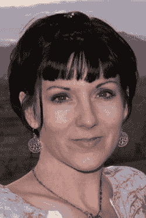
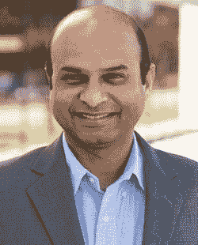
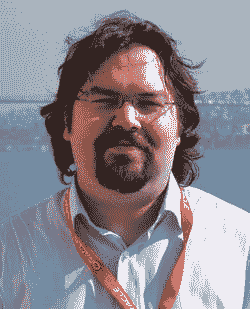
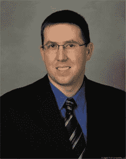
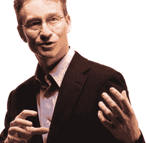
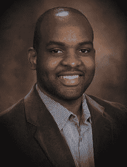
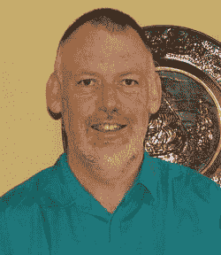
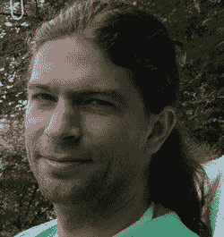

# 关于作者

**Kellyn Pot’Vin** 是 Oracle ACE 总监，也是 Enkitec 公司的高级技术顾问，负责管理 Oracle 和 SQL Server。她专注于环境优化、调优以及构建健壮的企业级系统。Kellyn 主要处理多 TB 级数据库，包括 Exadata，以及涉及固态硬盘解决方案的驱动性能数据库。Kellyn 深入参与 Oracle 用户组社区活动，在全球各地的会议上发表演讲，并且是 Rocky Mountain Oracle Users Group (RMOUG) Training Days 会议的总监，该会议是最大的区域性会议之一。Kellyn 在 `https://dbakevlar.com` 上写博客，并深陷社交媒体。可以在 Twitter 上通过句柄 `@DBAKevlar`、LinkedIn 和 Facebook 上找到她，她经常在那里讨论她的日常技术冒险，因为她在家工作，没有同事可以倾诉。她还领导着本地和全球的技术女性 (WIT) 小组，指导技术领域的女性同仁。Kellyn 与她的伴侣 Tim Gorman 以及她的三个孩子 Sam、Cait 和 Josh 一起居住在科罗拉多州的威斯敏斯特。

**Anand Akela** 是 Oracle Enterprise Manager 的高级首席产品营销总监。他专注于 Oracle 的企业云、虚拟化和基础设施管理产品。在加入 Oracle 之前，他曾在 HP 工作，担任过各种产品营销、产品管理和工程职位，涉及系统管理、服务器、数据中心能源效率和企业软件等领域。
Anand 是各种数据中心行业联盟的积极参与者，目前担任 The Green Grid 数据收集与分析工作组主席。The Green Grid 是一个由 IT 公司和专业人士组成的全球联盟，致力于改善全球数据中心和企业计算生态系统的能源效率。Anand 还担任 PeersNet（一家网络服务提供商）的顾问。Anand 拥有杜克大学富卡商学院的 MBA 学位和印度浦那大学的计算机科学学士学位。

**Gokhan Atil** 是一位自 2000 年起就职于 IT 行业的独立顾问。他曾担任开发与生产 DBA、培训师及软件开发人员。他在 Linux 和 Solaris 系统方面拥有深厚背景。他是 Oracle Database 10g 和 11g 的 Oracle 认证专家 (OCP)，并具有 Oracle 11g/10g/9i/8i 的实践经验。他是 Oracle 社区的活跃成员，曾在多个会议上撰写并发表论文。他也是土耳其 Oracle 用户组 (TROUG) 的创始成员之一。2011 年，他荣获 Oracle ACE 奖。他拥有一个自 2008 年起分享 Oracle 经验的博客：`www.gokhanatil.com`。

**Bobby Curtis** 是佐治亚州亚特兰大市 BIAS 公司的一名解决方案架构师。在他 17 年的 IT 职业生涯中，有 11 年担任数据库管理员，拥有 Oracle、MS SQL Server、MySQL 和 Sybase 的经验。Bobby 专注于企业级数据库和监控工具的数据库实施、配置和数据集成。他是佐治亚 Oracle 用户组 (GOUSER)、独立 Oracle 用户组 (IOUG) 和 Oracle 开发者工具用户组 (ODTUG) 的成员。Bobby 还获得了 Oracle GoldenGate、Oracle Enterprise Manager 11、Oracle Enterprise Manager 12c 和 Oracle Exadata 的认证。他现在特别关注 Oracle 数据库一体机。

很少有 DBA 能像**Alex Gorbachev**那样具备应对各种数据库场景的完备能力。Alex 曾为应对具有挑战性的业务需求设计并架构了众多成功的数据库解决方案。Alex 是 Oracle 界受人尊敬的人物，也是全球 Oracle 会议上备受欢迎的领导者和演讲者。他定期在 Pythian 博客上发表文章并举办在线研讨会。Alex 是 OakTable Network 的成员和 Oracle ACE 总监。

目前，Alex 就职于 The Pythian Group。他从渥太华的 Pythian 开始，领导一个数据库专家团队，之后移居澳大利亚，迎接在东亚/太平洋地区建立公司业务的挑战。现在，他回到渥太华，担任 Pythian 的首席技术官，继续弥合业务与技术之间的差距。对技术、工程人才和业务流程完美契合的追求，是他夜不能寐的动力。

**Niall Litchfield** 是一位拥有 15 年资历的 DBA，在各种 x86(64)平台上运行数据库方面经验丰富，并且尤其偏爱 Microsoft Windows。Niall 的职业生涯始于毕马威 (KPMG) 的“账房先生”（审计员），因此他是一位尊重审计员的 DBA，主要是因为他们必须在寒冬站在没有暖气的仓库里看着别人数东西，这是他绝不想再做的事情。他的父亲是一位真正的工程师，能制作具有精密公差的实用物品，这一点，加上他早期的一项经历——他证明了当时两种相互竞争的宏观经济理论都能同样好地解释实际行为，但又都不能充分解释——相当程度上解释了他对于数据库（尤其是性能调优）基于证据的方法。

**Leighton Nelson** 是一名 Oracle 认证数据库管理员，目前在密苏里州圣路易斯市的 Mercy 担任首席 Oracle DBA。他在 Oracle 数据库产品方面拥有超过十年的工作经验，目前主要从事数据库管理、性能调优、高可用性以及备份与恢复方面的工作。Leighton 是 Oracle 社区的活跃成员。他经常在美国各地的区域会议上发言，包括 Oracle Open World 和 IOUG Collaborate。他现任 Oracle RAC SIG 美国活动主席及 IOUG 联络人。除了演讲活动，Leighton 还通过在`blogs.griddba.com`写博客以及在推特账号`@leight0nn`上分享他使用各种 Oracle 产品的经验。Leighton 与妻子 Kerrine 以及他们的四个儿子 Casani、Brandon、Justin 和 Matthew 居住在密苏里州圣路易斯。

**Pete Sharman** 是 Oracle 公司服务器技术部门企业管理员产品套件组的首席产品经理。他在 Oracle 工作了 18 年，担任过从教育、咨询到开发的多种职位，并从 0.76 beta 版开始使用 Enterprise Manager。Pete 是 Oak Table Network 的成员，并在世界各地的会议上发表过演讲，包括 Oracle Open World（澳大利亚和美国）、RMOUG Training Days、Hostsos Conference、Miracle Open World 以及 AUSOUG 和 NZOUG 会议。他此前曾著有一本关于如何通过 Oracle 认证专家计划中的 Oracle8i 数据库管理考试的书。他与妻子和三个孩子居住在澳大利亚堪培拉。

关于技术审校

**Frits Hoogland** 是一位专注于 Oracle 数据库性能和内核的 IT 专业人士。Frits 经常在荷兰、英国、美国及其他国家进行 Oracle 技术演讲。2009 年，他获得了 Oracle 技术网络颁发的 Oracle ACE 奖，一年后成为 Oracle ACE 总监。2010 年，他加入了 OakTable Network。除了发展 Oracle 专业知识，Frits 还使用 MySQL、PostgreSQL 和现代操作系统。Frits 目前在荷兰的 VX 公司工作。

