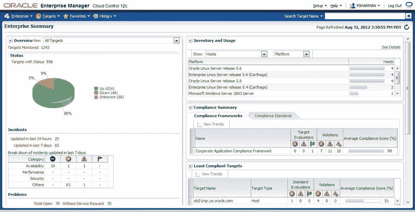
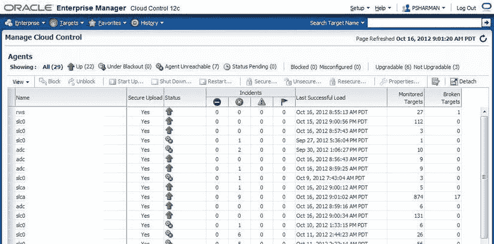
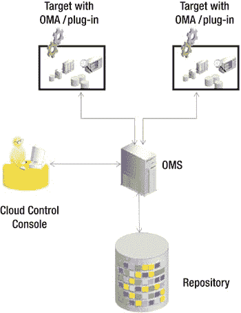
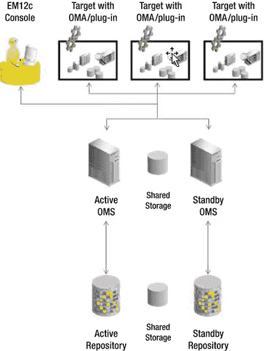
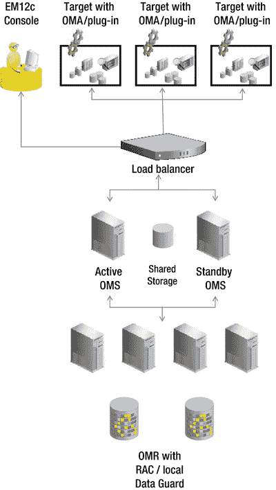
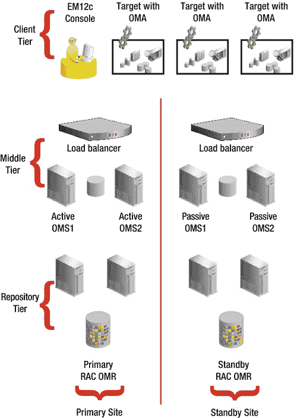
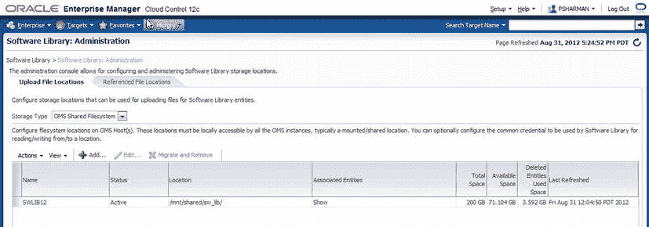

# EM12c 核心功能与架构

*   **框架与基础设施**：EM12c 提供了安全性、可扩展性、丰富的用户界面、新的自更新功能等。
*   **企业监控**：您可以监控整个基础设施的状态，包括数据库、中间件和应用程序。EM12c 提供了问题通知、解决和报告的方法。
*   **云管理**：云管理是当今行业热点，EM12c 在此领域提供了一系列解决方案，包括费用分摊/展示、基于策略的资源管理和自助式供应。
*   **生命周期管理**：如今管理计算系统需要许多手动流程来完成发现、供应、打补丁、变更管理和配置管理。EM12c 自动化了其中许多手动流程，让管理员有更多时间处理其他更高优先级的任务。
*   **数据库管理**：数据库管理一直是 OEM 自首次发布以来的关键功能。这在 EM12c 版本中得以延续，包括围绕打补丁、升级、供应、性能调优、数据脱敏和子集化，以及配置和变更管理的解决方案。
*   **中间件管理**：EM12c 的一个关键组件是为所有 Oracle 中间件产品（包括 WebLogic Server、SOA Suite、Identity Management、WebCenter 和 Coherence）以及非 Oracle 中间件（如 IBM 的 WebSphere 或 JBoss Application Server）提供全面的管理能力。
*   **应用程序管理**：EM12c 开箱即用地提供了对所有 Oracle 提供的应用程序（E-Business Suite、PeopleSoft、Siebel、JD Edwards 和 Fusion Applications）的监控和管理解决方案，此外还具备管理您自己构建的自定义或第三方应用程序的能力。
*   **应用程序性能管理**：EM12c 提供应用程序的端到端监控，包括通过 Real User Experience Insight (RUEI) 进行真实用户监控，以及通过 Service Level Management 信标进行合成事务监控。此处引入的其他功能包括监控和跟踪业务事务、拓扑发现，以及 Java 和数据库监控与诊断。
*   **应用程序质量管理 (AQM)**：提供三个测试领域——通过 Application Testing Suite 产品进行应用测试，通过 Real Application Testing 和 Application Replay 进行基础设施测试，以及包括测试系统创建、数据脱敏和数据子集化技术在内的测试数据管理功能。
*   **硬件与虚拟化管理**：为物理和虚拟环境提供完整的生命周期管理，包括供应、打补丁、配置管理、管理和监控。这包括管理运行在 Linux、Unix、Windows 和 Oracle Virtualization Server (Oracle VM Server) 操作系统上的系统，以及为基于 Oracle Sun 硬件构建的系统提供对服务器、网络和存储层的洞察。
*   **异构（非 Oracle）管理**：通过提供一系列称为连接器和插件的扩展（以及其他），EM12c 除了 Oracle 环境外，还具备管理非 Oracle 技术的能力。这些扩展可以由 Oracle、合作伙伴甚至客户自己构建。它们基于与 EM12c 产品其余部分相同的管理框架，因此可以通过自更新机制下载、导入和部署。

涵盖所有这些关注领域，构成了一个用于管理整个数据中心的强大产品。本书的其余部分将深入探讨其中许多领域的细节。本章的其余部分将介绍基本架构，在您进一步深入了解 EM12c 的精彩功能之前需要理解这些内容。

## 架构概览

从架构角度看，EM12c 由五个主要部分组成：

*   `Cloud Control console`
*   `Oracle Management Agent`
*   `Oracle Management Service`
*   `Oracle Management Repository`
*   `Plug-ins`

让我们更详细地了解每一个组件。

 **注意** 对 EM12c 的许可讨论超出了本书的范围。（完整的许可文档可在 Enterprise Manager 文档中找到，网址为 [`docs.oracle.com/cd/E24628_01/license.121/e24474/toc.htm`](http://docs.oracle.com/cd/E24628_01/license.121/e24474/toc.htm)。）然而，值得注意的是，一般来说，此处描述的大多数基本功能都带有受限使用许可，因此是免费的。此受限使用许可特指 Enterprise Manager，但许多附加选项确实会产生许可费用。有关完整详情，请参阅许可文档。

## Cloud Control 控制台

`Cloud Control console` 提供了用于访问、监控和管理计算环境的用户界面。该控制台通过 Web 浏览器访问，因此允许您从任何位置访问中央控制台。与之前的版本相比，您可以对 EM12c 控制台进行更多定制，为您提供以下选项：

*   从各种预定义页面中选择您的主页（或者确实设置任何您想要的页面作为个人主页）
*   在目标主页上移动区域
*   添加可能比默认区域更让您感兴趣的区域
*   删除不感兴趣的区域

图形用户界面 (GUI) 提供了您最近访问过的目标的历史记录（标准浏览器历史记录也可用）。此外，您可以将页面标记为收藏夹，它们会出现在基于新菜单的界面中的收藏夹列表中。图 1-1 显示了默认主页的示例。

图 1-1. EM12c 中的新默认主页

## Oracle Management Agent

`Oracle Management Agent`（通常简称为 `agent` 或缩写为 `OMA`）通常安装在计算环境中被监控的每个主机上。（EM12c 还引入了在某些情况下远程管理环境的能力。）这些代理从控制台部署（见图 1-2），然后监控由代理发现的所有目标。它们用于控制这些目标上的中断、执行作业、收集指标等，并反过来向 `Oracle Management Service` 提供可用性、指标和作业状态等详细信息。

图 1-2. EM12c 中管理代理的用户界面

对于 EM12c 版本，代理为了更高的可靠性、可用性和性能而完全重写（有关如何实现此目的的详细信息，请参见即将关于插件的部分）。此更改的唯一缺点是您必须使用 EM12c 代理来与 EM12c `Oracle Management Service` 通信。由于新版本中进行的大量更改，12c 及更早版本代理之间的向后兼容性已丢失。

## Oracle Management Service

`Oracle Management Service (OMS)` 是一个基于 Web 的应用程序，它与代理和 `Oracle Management Repository` 通信，以收集和存储有关各个代理上所有目标的信息。（请注意，信息本身存储在 `Oracle Management Repository` 中，而不是 OMS 中。）OMS 还负责为控制台呈现用户界面。

`OMS` 被安装到一个 Oracle 中间件主目录中，该目录还包含 Oracle `WebLogic Server`（包括 `WebLogic Server` 管理控制台）、用于中间件层的 Oracle `Management Agent`、管理服务实例基础目录、`Java 开发工具包`（`JDK`）以及其他配置文件。如果存在现有的 `WebLogic Server`（`WLS`）配置，你可以将 `OMS` 安装进去，但从可用性角度来看，通常最好将其安装在专用的 `WLS` 主目录中。

## Oracle Management Repository

`Oracle Management Repository`（也称为 `repository` 或 `OMR`）是一个 Oracle 数据库，用于存储所有管理代理收集的信息。它由数据库用户、表空间、表、视图、索引、包、过程和数据库作业组成。

与 `OMS` 不同，`OMR` 的安装过程要求数据库已为存储库存在。这意味着在安装 `OMS` 之前，你需要已在环境中的某处创建好数据库。同样，通常建议在专用数据库中创建存储库。

## Plug-ins

在 `EM12c` 中，`Plug-ins` 被赋予了全新的含义。在早期版本中，插件主要是用于监控和管理非 Oracle（异构）软件（包括数据库和中间件）的系统监控工具。它们通常由合作伙伴或 Oracle 公司自身构建。一些技术娴熟的客户也构建了自己的插件，但总体而言插件数量并不多。

在 `EM12c` 版本中，虽然保留了一些此类监控插件，但插件的概念已大大扩展，涵盖了所有被管理的目标类型。因此，现在有用于管理 Oracle 数据库的 Oracle 数据库插件、用于管理 Oracle 中间件的 `Fusion Middleware` 插件、用于管理 Oracle `Fusion Applications` 产品套件的 `Fusion Application` 插件，等等。由于 Oracle 软件的新版本将包含用于管理该软件的插件，这意味着 `EM12c`（及后续版本）将能够比过去更快地监控和管理这些新版本。插件可以通过 `Cloud Control` 控制台中新的 `Self Update` 功能（如果你有足够的权限使用它）来下载、应用和部署。

此外，这种模块化的插件架构意味着代理不再被配置为能够监控任何目标类型。现在，代理只会下载其监控目标所需的插件。这意味着代理本身比以前版本的代理更小。这一变化是 `EM12c` 版本架构中最重要的改进之一。

## 高可用 EM12c 配置

在最基本的 `EM12c` 安装中，`OMS` 和存储库可以物理地位于单台机器上。但是，Oracle 建议将这两个组件放置在不同的机器上。图 1-3 展示了最简单的安装方式。

图 1-3. 基本的 EM12c 架构

尽管这种相对简单的架构可能足以满足初始部署的需求，但你可能需要将其发展为可扩展性更高、可用性更强的架构。有四种部署级别可用于 `EM12c`，以实现更高的可扩展性和可用性。当然，与任何需要同时具备可扩展性和可用性的架构一样，随着性能和可用性的提高，成本也会增加，需要在其中进行权衡。

### Level 1

图 1-3 展示了 `level 1` 的部署。`OMS` 和存储库要么安装在单台主机上，要么（更可取地）安装在两台独立的主机上。但是，这两台主机都没有配置任何故障转移。

### Level 2

对于 `level 2`，`OMS` 安装在共享存储上，并使用基于 `VIP`（虚拟 IP）的故障转移。存储库数据库通过使用本地物理备用数据库技术进行保护。通常，这意味着 `level 2` 部署使用的机器数量是 `level 1` 的两倍。`Level 2` 的主动/被动配置（尽管位于本地而非远程被动站点）在从主动站点故障转移到被动站点时会导致停机窗口。该架构如图 1-4 所示。

图 1-4. level 2 部署示意图

### Level 3

在 `level 3` 配置中，`OMS` 使用主动/主动配置进行安装，需要本地负载均衡器。存储库数据库由 `Real Application Clusters`（`RAC`）和本地 `Data Guard` 共同保护。该级别如图 1-5 所示。

图 1-5. level 3 部署示意图

### Level 4

`Level 4` 是提供最高可扩展性和可用性的部署级别。在这种情况下，`OMS` 在主站点以主动/主动配置运行（就像 `level 3` 一样），但在远程站点有额外的备用 `OMS` 安装。（请注意，由于 `OMS` 和存储库之间的网络延迟要求持续小于 1 毫秒，远程站点不能运行活动的 `OMS`）。此配置需要在主站点和备用站点都设置本地负载均衡器。存储库数据库再次运行在 `RAC` 上，但在这种情况下，备用 `RAC` 数据库位于灾难恢复站点。可以看出，这是一个相当复杂的架构，如图 1-6 所示（图中省略了所有会使它更难理解的通信线路）。

图 1-6. level 4 部署示意图

现在你已经了解了四种可能的部署级别的要点。第 13 章 在高可用性的背景下更详细地介绍了它们。另外，请注意，可以创建与这些级别不完全匹配的配置。如果有一天你看到一个与刚才描述的稍有不同的配置，请不要太过惊讶。`EM12c` 为你提供了极大的灵活性。

## Software Library

Enterprise Manager 安装的另一个重要部分是 `Software Library`。`Software Library` 是一个存储区域，用于存放补丁、`Self Update` 下载内容和黄金镜像等。在“高可用 EM12c 配置”一节前面的示意图中，它被描绘为位于 `OMS` 之间的共享存储。（图 1-5 清晰地展示了它，在那里你几乎可以在正中间看到共享存储的图标）。要创建 `Software Library`，你需要使用 `Software Library: Administration` 页面，可通过 `Setup` → `Provisioning and Patching` → `Software Library` 菜单路径访问。`Software Administration` 页面如图 1-7 所示。

图 1-7. Software Library: Administration 页面

创建 `Software Library` 时需要注意的一个重要点是，如果你认为你的 `EM12c` 部署在某个阶段需要某种程度的高可用性，则需要确保创建 `Software Library` 的位置可以从每个 `OMS` 访问。这可以通过在每个 `OMS` 上挂载相同的网络文件系统（`NFS`）共享，或使用任何其他允许在机器之间共享文件系统的技术来实现。

