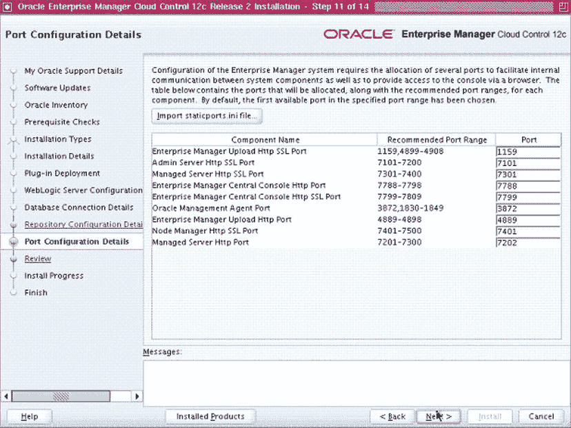
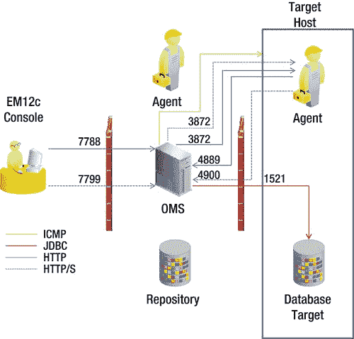

# EM12c 版本包含多项与软件库相关的新功能：

*   在此版本中，**软件库**成为更多实体的单一存放位置，例如指令和程序集。（这些新实体在第 5 章中有解释。）其中许多实体能够自我更新，因此我们现在与 `Self Update` 实现了集成。
*   Oracle 还扩展了存储类型的支持，因此现在支持 `NFS` 文件系统在 `OMS` 之间共享，以及任何我们可以访问的文件系统（即，代理文件系统现在也可用于托管软件库）。
*   软件库现在支持**引用位置**。因此，如果您有一个用于提供这些实体的集中式位置，且该位置独立于 `OMS`，您现在可以通过 `HTTP`、`NFS` 等方式引用它们。在这种情况下，`OMS` 存储有关此引用位置的元数据，而软件位（bits）则存储在外部。
*   此版本还包含一系列其他功能。例如，您可以将支持说明或自述文件附加到软件库实体。该库包含改进的搜索功能，当然，新的权限模型允许使用细粒度权限进行实体访问。

## 管理工具

那么现在，您可能要问了：“好吧，那 Oracle 的其他那些管理工具呢？” 通常你会发现，人们对所有这些工具是什么、如何区分它们，当然还有何时使用哪一个，都存在一定程度的混淆。我们现在就花些时间来讨论一下。

首先，`Cloud Control` 与其他 Oracle 管理工具（如 `Database Control (DB Control)` 和 `Fusion Middleware Control (FMW Control)`）的主要区别在于架构。`Cloud Control` 设计用于管理整个数据中心，因此它拥有比其他工具健壮得多的多层架构。

其次，其他管理工具是简化版工具，通常一次只能连接到单一环境，而不是提供更广泛的数据中心级别的环境视图。例如，`DB Control` 一次只能连接到一个 Oracle 数据库。如果您想使用 `DB Control` 来管理或监控另一个 Oracle 数据库，必须先断开与原始数据库的连接，然后才能连接到新的数据库。事实上，如果您不这样做，Oracle 会自动为您断开连接。

最后，不同工具之间存在一些不兼容性。例如，当您使用 `Database Configuration Assistant (DBCA)` 创建 Oracle 数据库时，系统会询问您是否希望数据库被集中管理（通过 `EM12c`）还是本地管理（通过 `DB Control`）。这是一个二选一的决定；您不能两者都选。这种不兼容性在 `OMR` 上达到了顶峰。当您安装 `EM12c` 时，系统会提示您指定库的位置。（安装程序不会为您创建数据库；它只是提示您指向环境中某个现有 Oracle 数据库的位置。）如果您指向的数据库已被 `DBCA` 配置为由 `DB Control` 本地管理，安装程序实际上会报错，指出该数据库已经是本地管理的。（安装程序确实会为您提供删除 `DB Control` 配置的命令（如果您选择这样做），但实际上不会为您执行该命令。）

最后需要说明的是，在撰写本章时，Oracle 已宣布 `DB Control` 将在 11.2 之后的数据库版本中停止支持。尽管我们尚不清楚新产品将叫什么名字，但 Oracle 指出：“在未来的 Oracle 数据库版本中，基本的数据库管理将通过一个简化的管理工具提供，而广泛的管理功能将通过从 Oracle Enterprise Manager Cloud Control 部署的最新 Oracle 数据库插件实现”（详情请参见 My Oracle Support 上的 Note 1484775.1）。

### 命令行工具

除了大多数 `EM12c` 用户用于日常工作的 `GUI` 外，Oracle 还提供了两个您需要熟悉的命令行工具：

*   `Enterprise Manager Command Line Interface (EMCLI)`：此工具主要用于可能需要重复执行的脚本操作。它是一家咨询公司常用的工具，这些公司以配置 `EM12c` 为业务，因此需要跨不同客户重复执行相同的操作。`EMCLI` 可以安装在任何计算机上（不一定是 `OMS` 或 `OMR`），只需通过 `Cloud Control` 的“设置”菜单下载该工具，然后按照安装说明操作即可。然而，并非所有可以通过 `GUI` 执行的操作都能通过 `EMCLI` 完成。
*   `Enterprise Manager Control (EMCTL)`：此实用程序用于执行各种任务，其中最重要的是启动、停止和检查 `OMS`、代理以及 `Cloud Control` 本身的状态。它还用于保护/取消保护代理和 `OMS`，启动和停止维护窗口以及其他操作。

### 库用户

就数据库用户而言，`EM12c` 安装中最重要的用户是 `SYSMAN` 用户。`SYSMAN` 用户已经存在多个版本了。它基本上是包含库的数据库模式的所有者。在许多方面，它类似于 Oracle 数据库中的 `SYS` 用户，因此，除了在第一次创建另一个超级管理员帐户时使用外，不应再使用它（有关超级管理员帐户的更多详细信息，请参见第 4 章）。

除了 `SYSMAN` 帐户外，在库创建或升级期间，库中还会创建其他数据库用户。这些包括：

*   `CLOUD_ENGINE_USER` 和 `CLOUD_SWLIB_USER` 用于执行云操作。
*   `MGMT_VIEW` 用于生成报告。
*   `SYSMAN_APM`、`SYSMAN_MDS` 和 `SYSMAN_OPSS` 是 Fusion Middleware 组件的元数据模式。
*   `SYSMAN_BIP` 用于商业智能 (`BI`) Publisher 集成。
*   `SYSMAN_RO` 是一个通用的只读用户。

Oracle 文档中对这些帐户提供的细节不多。但可以说，这些都是特殊帐户，您不应删除它们，也不应更改它们的密码。

### 库视图

有关管理员、目标、指标、维护窗口和作业的信息都存储在 Oracle 管理库的一组库视图中。尽管这些视图中的信息显然被 `Cloud Control` 控制台用来向您显示信息，但它也可以用于其他用途，主要是由在 Enterprise Manager 产品之上构建可扩展性的程序员使用。例如，作为插件开发人员，您可能希望扩展 Enterprise Manager 以管理您自己定制开发的目标，或者确实扩展 Oracle 开箱即用的目标类型。您可能还想编写自己的脚本来从这些视图中查询历史数据，或者构建自己的自定义报告，以便从 `SQL Developer` 或其他产品中运行。显然，关于 Enterprise Manager 架构的章节不是深入探讨如何完成所有这些事情的细节的地方，但了解这些库视图是什么以及如何找到有关它们的更多信息是值得的。

好的，作为您的文档工程师和翻译员，我已仔细阅读了注意事项和示例。现在，我将严格按照要求，将您提供的英文技术文档翻译成中文，并确保所有格式元素（如标题、列表、链接、代码、图片引用等）得到妥善处理。

## 仓库视图与通信流程

仓库视图在《Enterprise Manager Cloud Control Extensibility Programmer’s Reference》中有文档说明（您可以从位于[`docs.oracle.com/cd/E24628_01/index.htm`](http://docs.oracle.com/cd/E24628_01/index.htm)的 EM12c 文档访问该参考手册）。该在线参考的第 18 章详细说明了这些视图的使用，并提供了显示每个视图列名的视图的完整列表。

### 通信流程

当您首次开始使用像 Enterprise Manager Cloud Control 12c 这样的产品时，最令人困惑的领域之一就是产品各个部分之间的通信流程是如何进行的。本质上，您需要理解三个领域：涉及的协议、正在使用的端口，以及是否使用了防火墙。

### 协议

在 EM12c 安装的组件之间进行通信时，使用三种主要协议：

*   `Hypertext Transfer Protocol (HTTP)` 或 `Hypertext Transfer Protocol/Secure (HTTP/S)`：这些是万维网使用的基础协议。它们定义了消息如何传输和格式化，以及浏览器和 Web 服务器对不同命令的响应操作。`HTTP`和`HTTP/S`用于在`OMA`、`OMS`和`OMR`之间进行通信。出于安全原因，Oracle 通常建议使用`HTTP/S`而非`HTTP`。
*   `Java Database Connectivity (JDBC)`：这个 Java 标准由`OMS`用于与仓库通信，以及与任何数据库目标通信。
*   `Internet Control Message Protocol (ICMP)`：该协议由`OMS`用于与主机通信，以检查主机的状态。本质上，使用`ping`命令来检查其状态。

### 端口

在 EM12c 安装过程中，系统会提示您提供实体通信的端口列表。默认列表显示在“端口配置详细信息”页面上，如图 1-8 所示。该页面显示了“推荐端口范围”列。此列中列出的第一个端口号是默认端口。如果出于任何原因，在您进行安装时默认端口已被占用，将使用“推荐端口范围”中的下一个端口号。安装后，您还可以在位于 OMS 主机上的`staticports.ini`文件中找到已使用的端口号。

图 1-8. 端口配置详细信息页面

### 防火墙

在许多情况下，企业会要求使用防火墙来控制进出网络流量。这通常涉及限制端口的可用性或限制可以通过特定端口的流量类型。由于这种限制可能难以设置，通常建议在部署 Enterprise Manager 配置之后再进行防火墙配置和启用。但是，如果防火墙已经就位，您应该打开计划使用的通信端口，直到安装完成。

将这三个领域（协议、端口和防火墙）结合起来，EM12c 安装中的默认通信流程如图 1-9 所示。

图 1-9. EM12c 配置中的端口、协议和防火墙

## EM12c 中的认证

借助 EM12c 版本中提供的新可插拔框架，您现在在认证方面有了更多选择。该框架接受一系列可插拔的认证方案，使您能够选择最适合您环境的方法。由于 EM12c 依赖 Oracle 的 WebLogic Server 进行外部认证，因此 WLS 支持的任何认证方法都可用于对 EM12c 进行认证。支持的认证方法包括以下内容：

*   `Repository-based authentication`：在这个您可能从之前版本的 Enterprise Manager 熟悉的默认认证选项中，系统会提示您输入用户名和密码。此认证方法提供标准的密码选项，如密码有效期、密码宽限期、失败尝试次数和密码复杂度。
*   `Single sign-on authentication`：如果您的企业中使用单点登录（SSO）认证，您可以将这些 SSO 凭据注册为 EM12c 中的管理员。然后，您可以使用这些凭据访问 Cloud Control 控制台。
*   `Oracle Access Manager SSO authentication`：Oracle Access Manager（OAM）是 Oracle Fusion Middleware 产品附带的 SSO 解决方案。同样，如果您正在使用 OAM SSO，您可以将这些凭据注册为 EM12c 中的管理员，并使用它们访问控制台。
*   `Enterprise User Security authentication`：`EUS`允许您在符合轻量级目录访问协议（`LDAP`）的目录服务器中将企业用户和角色创建并存储为目录对象。然后，您可以使用`EMCTL`设置一些属性，以允许您深入到这些数据库中，而不显示标准登录页面。
*   `LDAP authentication`：在之前版本的 Enterprise Manager 中，允许使用`LDAP`认证，但它仅限于 Oracle 的`LDAP`解决方案，Oracle Internet Directory（`OID`）。在 12c 版本中，现已扩展到除了`OID`之外，还可以使用 Microsoft 的 Active Directory 产品。

## 总结

本章向您介绍了 Enterprise Manager Cloud Control 12c 的主要架构组件：Cloud Control 控制台、Oracle Management Agent、Oracle Management Service、Oracle Management Repository 以及插件。您了解了部署此架构的选项以及可用于连接到 EM12c 的认证方法。本章还涵盖了 EM12c 使用的协议、端口和防火墙，因此您现在已准备好更详细地钻研产品的安装。这是我们下一章的主题。

