# 硬件要求

本节描述了安装 OMS、管理仓库和管理代理的硬件要求。

### OMS 的硬件要求

如表 2-1 所示，OMS 的硬件要求取决于您拥有的目标数量以及将要部署的代理数量。

表 2-1. OMS 硬件要求

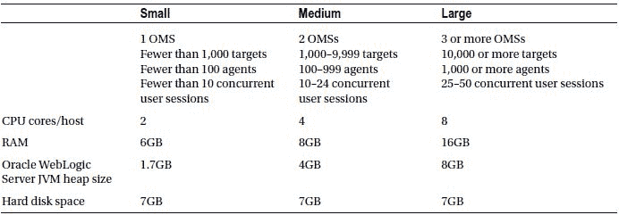

### 管理仓库的硬件要求

仓库数据库的硬件要求也取决于代理和目标的数量，如表 2-2 所示。

表 2-2. 管理仓库硬件要求

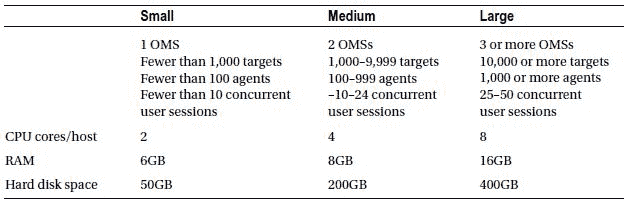

### 管理代理的硬件要求

每个代理部署大约需要 1GB 的可用硬盘空间。虽然管理代理不会消耗大量的 CPU 或 RAM，但我们不建议将代理部署到 RAM 少于 512MB 的系统上。

 **提示** 前几节中的硬件要求可能因版本而异，因此您应在 Oracle Enterprise Manager Cloud Control 基本安装指南中检查实际要求。

## 安装管理仓库

在本节中，您将在名为`repositorydb.testdomain.com`的服务器上下载并安装 Oracle Database 11gR2。

可以使用一个经过认证的数据库：`11.2.0.3`、`11.2.0.2`、`11.2.0.1`、`11.1.0.7`或`10.2.0.5`。如果您已经有一个用于仓库数据库的数据库服务器，可以跳到 Oracle EM12c 的安装部分。

 **提示** 您可以在 My Oracle Support 上找到 Enterprise Manager Cloud Control 的最新认证数据库列表：[`support.oracle.com/epmos/faces/CertifyHome`](https://support.oracle.com/epmos/faces/CertifyHome)。您可能希望使用 Oracle Real Application Clusters（RAC）数据库以实现高可用性。

### 使用 Oracle-validated RPM 包和 YUM

为了在 Oracle Linux 上安装 Oracle Database 11gR2，您的系统需要满足一些先决条件。使用`oracle-validated` RPM 包，您可以完成大部分预安装配置任务，包括创建用户和组。使用此包是在 Oracle Linux 上安装所有 Oracle 先决条件的推荐方法。您可以从 Oracle 网站下载 RPM 包，也可以使用 YUM 包管理器。Oracle 提供了一个免费的公共 YUM 服务器，即使您不从 Oracle 购买支持也可以使用。

要使用 Oracle 公共 YUM 服务器，您首先需要以 ROOT 身份运行以下命令，下载并复制相应的 YUM 配置文件到位：

*   Oracle Linux 4, update 6 或更新版本
    *   `[root@repositorydb ∼]# cd /etc/yum.repos.d`
    *   `[root@repositorydb ∼]# mv Oracle-Base.repo Oracle-Base.repo.disabled`
    *   `[root@repositorydb ∼]# wget [`public-yum.oracle.com/public-yum-el4.repo`](http://public-yum.oracle.com/public-yum-el4.repo)`
*   Oracle Linux 5
    *   `[root@repositorydb ∼]# cd /etc/yum.repos.d`
    *   `[root@repositorydb ∼]# wget [`public-yum.oracle.com/public-yum-el5.repo`](http://public-yum.oracle.com/public-yum-el5.repo)`
*   Oracle Linux 6
    *   `[root@repositorydb ∼]# cd /etc/yum.repos.d`
    *   `[root@repositorydb ∼]# wget [`public-yum.oracle.com/public-yum-ol6.repo`](http://public-yum.oracle.com/public-yum-ol6.repo)`

在文本编辑器中打开`yum public-yum*.repo`配置文件。找到您计划从中更新的仓库的文件部分——例如`[el5_base]`——并将`enabled=0`更改为`enabled=1`。

保存文件并开始使用`yum`：
```
[root@repositorydb ∼]# yum install oracle-validated
```
对于 Oracle Linux 6，您需要安装`oracle-rdbms-server-11gR2-preinstall`包，而不是`oracle-validated`包：
```
[root@repositorydb ∼]# yum install oracle-rdbms-server-11gR2-preinstall
```
您也可以从以下链接手动下载适用于 Red Hat Enterprise Linux 5 的`oracle-validated`包：[`oss.oracle.com/el5/oracle-validated/`](https://oss.oracle.com/el5/oracle-validated/)。

安装`oracle-validated`后，您需要为`ORACLE`用户设置密码。请确保也为 OMS 服务器设置 YUM 并安装`oracle-validated`包。

### 创建 Oracle 用户和组

如果不使用`oracle-validated`包，您可以手动创建所需的组和用户。以 ROOT 身份登录并运行以下命令：
```
[root@repositorydb ∼]# groupadd oinstall
[root@repositorydb ∼]# groupadd dba
[root@repositorydb ∼]# useradd -g oinstall -G dba oracle
[root@repositorydb ∼]# passwd oracle
```
在最后一个命令之后，输入`ORACLE`用户的密码。

### 设置内核参数

Oracle Database 11gR2 安装程序可以检测并修复内核参数错误，因此您可以运行安装程序并让它创建脚本来设置所需参数。如果希望在没有安装程序帮助的情况下配置内核参数，请备份`/etc/sysctl.conf`，然后使用任何文本编辑器编辑该文件，使其包含类似以下的行：
```
fs.aio-max-nr = 1048576
fs.file-max = 6815744
kernel.shmall = 2097152
kernel.shmmax = 4536870912
kernel.shmmni = 4096
kernel.sem = 250 32000 100 128
net.ipv4.ip_local_port_range = 9000 65500
net.core.rmem_default = 262144
net.core.rmem_max = 4194304
net.core.wmem_default = 262144
net.core.wmem_max = 1048576
```
这些是 Oracle Database 的推荐值。如果任何当前值大于推荐值，请使用较大的值。

 **提示** 在 64 位 Linux 系统上，`kernel.shmmax`可以设置为物理内存减去 1 字节的最大值。

输入以下命令以设置`/etc/sysctl.conf`中的内核参数的当前值：
```
[root@repositorydb ∼]# /sbin/sysctl -p
```

### 创建所需目录

Oracle 基础目录必须至少有 5GB 的可用磁盘空间。输入以下命令以创建推荐的子目录并在其上设置所有者、组和权限：
```
[root@repositorydb ∼]# mkdir -p /u01/app/
[root@repositorydb ∼]# chown -R oracle:oinstall /u01/app/
[root@repositorydb ∼]# chmod -R 775 /u01/app/
```

### 安装 Oracle 数据库软件

要安装数据库软件，您需要下载安装文件，解压缩它们，然后运行安装程序。本节列出了所有步骤。

您可以从 Oracle 技术网络（OTN）下载 Oracle 数据库软件。软件以 zip 文件形式提供。以下是 Oracle Database 的链接：


## Oracle 数据库安装与配置

### 安装准备

访问 `www.oracle.com/technetwork/database/enterprise-edition/downloads/index.html`。

我们也建议从 My Oracle Support (MOS) 下载并安装最新的 Oracle Database 软件补丁集。

下载安装文件后，将它们复制到 ORACLE 用户可以访问的目录，然后切换到 ORACLE 用户并解压：

```
[oracle@repositorydb ∼]$ unzip linux_11gR2_database_1of2.zip
[oracle@repositorydb ∼]$ unzip linux_11gR2_database_2of2.zip
```

解压文件后，您将看到一个名为 `database` 的新创建目录。打开此目录并运行安装程序：

```
[oracle@repositorydb ∼]$ cd database
[oracle@repositorydb ∼]$ ./runInstaller
```

### 软件安装步骤

当安装程序启动时，完成以下步骤：

1.  第一个安装步骤是“配置安全更新”，如 图 2-1 所示。您可能不希望输入 My Oracle Support (MOS) 凭据，因为您可以通过 Cloud Control 跟踪所有安全更新。因此，取消选中“我希望接收安全更新”选项并单击“下一步”。安装程序会警告接收关键安全更新的重要性，但可以忽略该警告。

    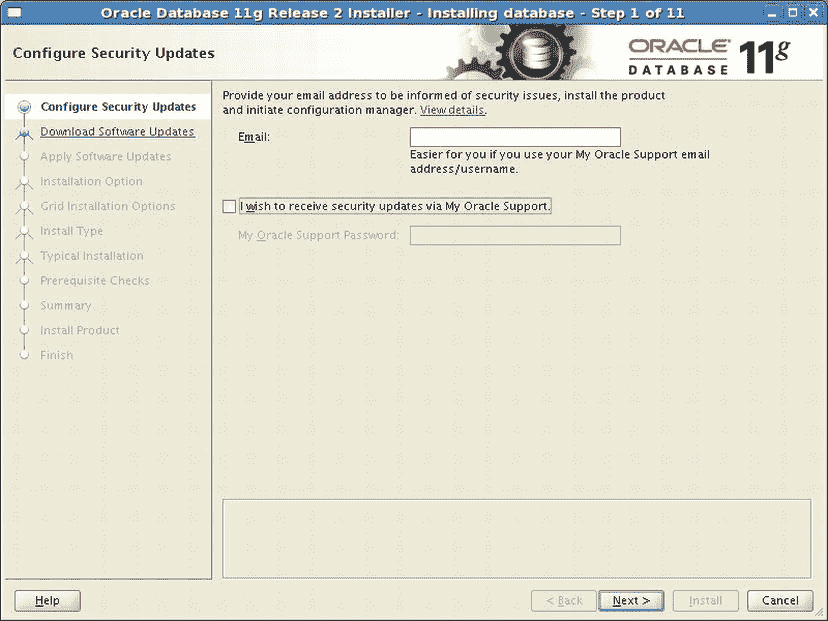
    *图 2-1. Oracle Database 安装程序*

2.  “下载软件更新”步骤出现，如 图 2-2 所示。如果您的数据库服务器可以访问互联网，您应该输入您的 MOS 凭据以下载并应用最新的补丁。（在本例中，我们将跳过此步骤并手动应用关键补丁集更新。）选择适当的选项后，单击“下一步”。

    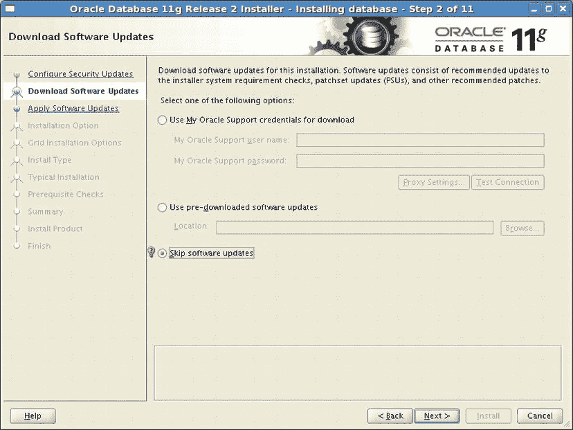
    *图 2-2. 下载软件更新的选项*

3.  对于“选择安装选项”步骤，如 图 2-3 所示，选择“仅安装数据库软件”。然后单击“下一步”。

    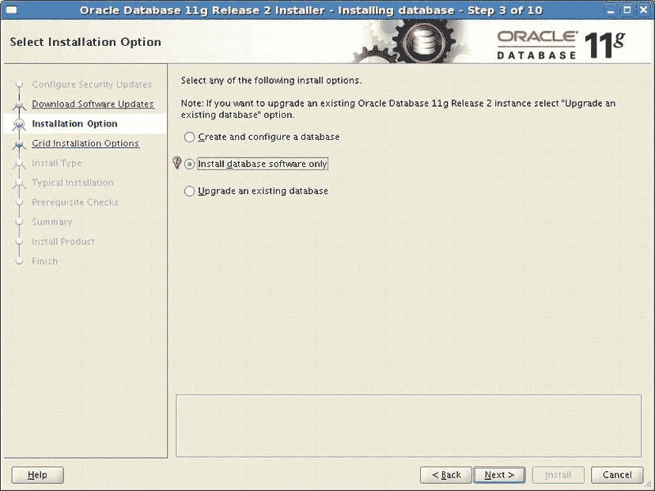
    *图 2-3. 安装选项*

4.  在“网格安装选项”步骤中，如 图 2-4 所示，选择“单实例数据库安装”。然后单击“下一步”。（如果您想将 OEM 存储库数据库创建为 Oracle RAC 数据库，则应选择第二个或第三个选项。）

    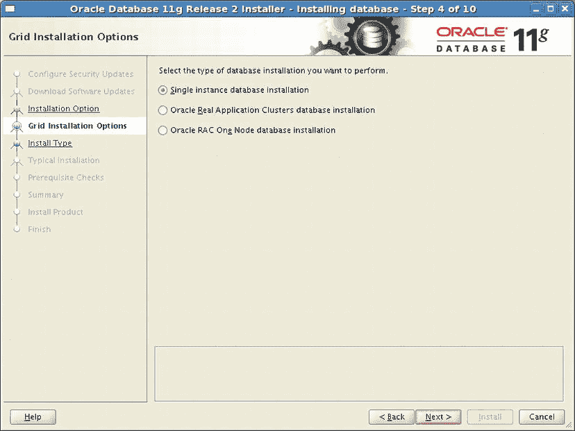
    *图 2-4. 网格安装选项*

5.  为默认语言选择英语，如 图 2-5 所示。

    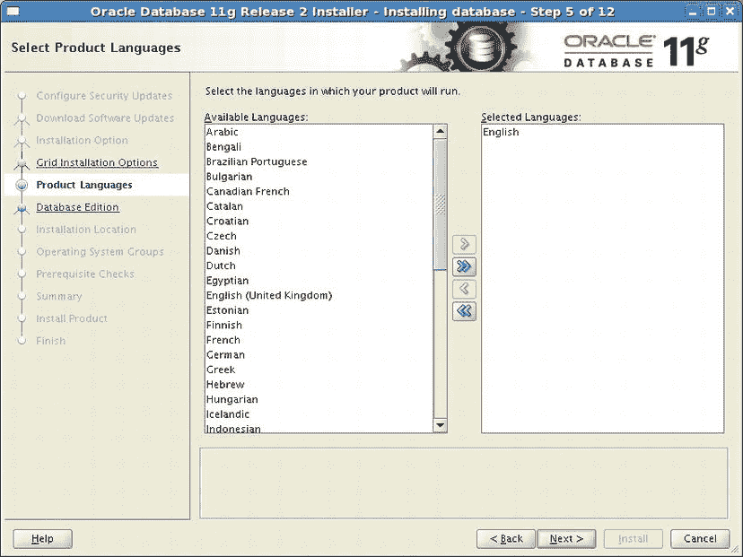
    *图 2-5. 语言选项*

6.  现在您已准备好选择数据库版本。此服务器将仅用作 Oracle Enterprise Manager Cloud Control 的存储库数据库，因此您无需为 Oracle Database 支付许可费用。选择“企业版”，如 图 2-6 所示，然后单击“下一步”。

    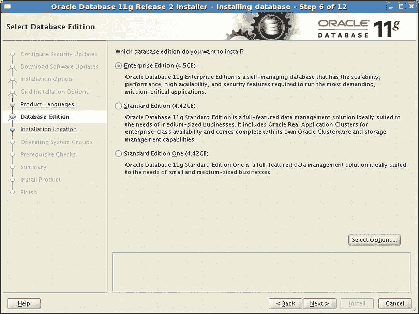
    *图 2-6. 选择数据库版本*

7.  “指定安装位置”步骤出现，如 图 2-7 所示。您已经为 Oracle Database 创建了 `/u01/app`，因此在 Oracle 基目录中输入 `/u01/app/oracle`。安装程序将根据最优灵活架构 (OFA) 确定 Oracle 主目录。异地升级一直是一个最佳实践建议，但从 Oracle Database 11.2.0.2 开始，补丁集安装默认都是异地的。因此，您可能希望在路径中输入完整版本，例如 `/u01/app/oracle/product/11.2.0.3/dbhome_1`。

    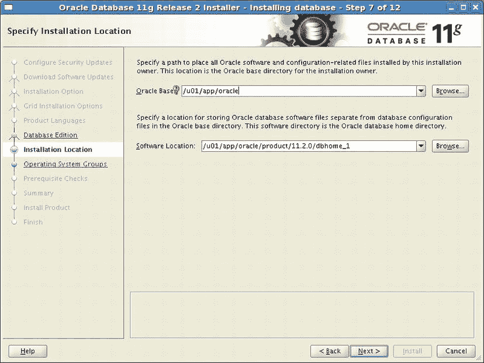
    *图 2-7. 安装位置*

8.  输入（或直接接受）“清单位置”并单击“下一步”，如 图 2-8 所示。

    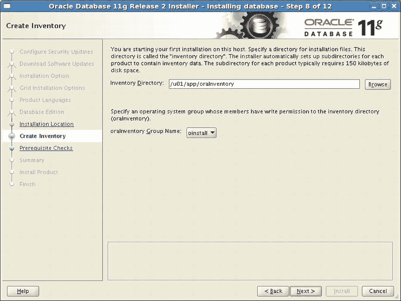
    *图 2-8. 创建清单位置*

9.  对于“特权操作系统组”步骤，如 图 2-9 所示，接受默认设置并单击“下一步”。Oracle 将在下一步检查先决条件。如果没有发现任何错误，安装程序将前进到“概要”步骤。

    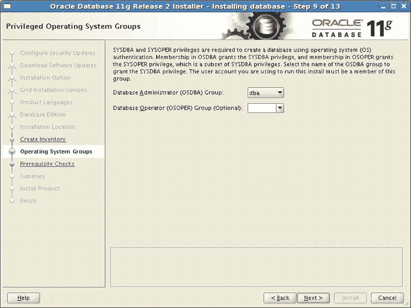
    *图 2-9. 操作系统组*

10. 查看“概要”屏幕，如 图 2-10 所示。如果屏幕上的信息看起来没问题，请单击“安装”按钮。

    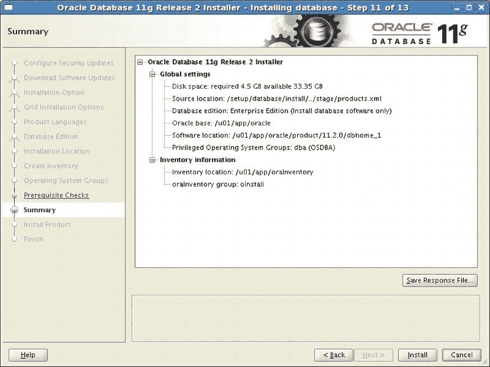
    *图 2-10. 概要*

11. 在安装结束时，您需要执行一些配置脚本。在另一个终端会话中以 ROOT 身份登录服务器并运行脚本。然后单击“确定”完成安装（参见 图 2-11）。

    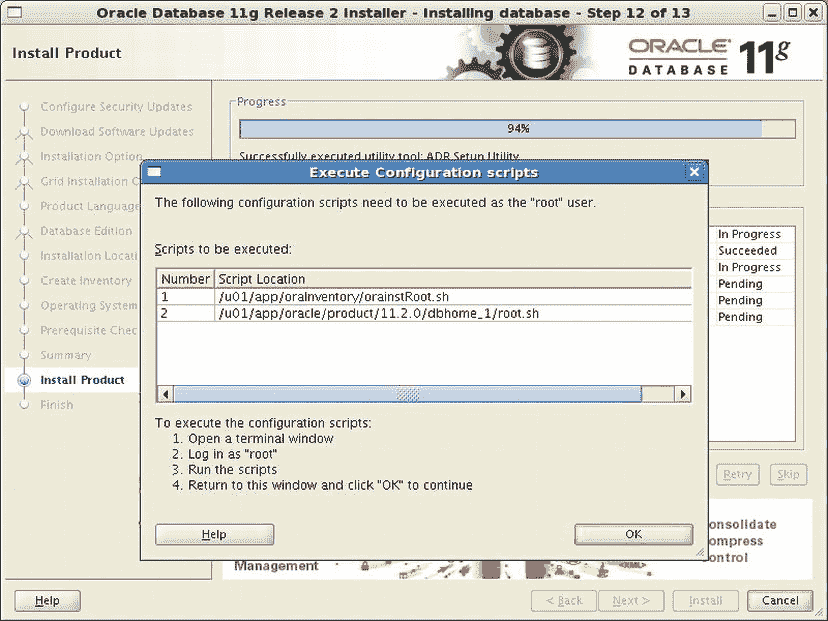
    *图 2-11. 执行配置脚本*

### 创建存储库数据库

既然您已经安装了 Oracle Database 软件，您将创建管理存储库数据库。连接到存储库服务器，设置 Oracle 主目录，然后运行 `dbca`：

```
[oracle@repositorydb ∼]$ . oraenv
ORACLE_SID = [oracle] ? oracle
ORACLE_HOME = [/home/oracle] ? /u01/app/oracle/product/11.2.0/dbhome_1
The Oracle base has been set to /u01/app/oracle
[oracle@repositorydb ∼]$ dbca
```

当您运行 `dbca` 时，会出现“数据库配置助手”欢迎屏幕。单击“下一步”通过屏幕，然后完成以下步骤：

1.  对于“操作”步骤，如 图 2-12 所示，选择“创建数据库”，然后单击“下一步”。

    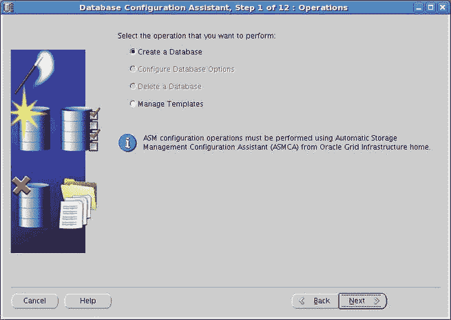
    *图 2-12. 数据库配置助手*

2.  对于“数据库模板”步骤，如 图 2-13 所示，您可以选择“通用”或“自定义数据库”。我们建议您选择“自定义数据库”，因为它可以防止在数据库中安装一些 `SYSMAN` 对象。否则，您必须先从数据库中删除这些对象，然后才能将其用作管理存储库数据库。单击“下一步”。

    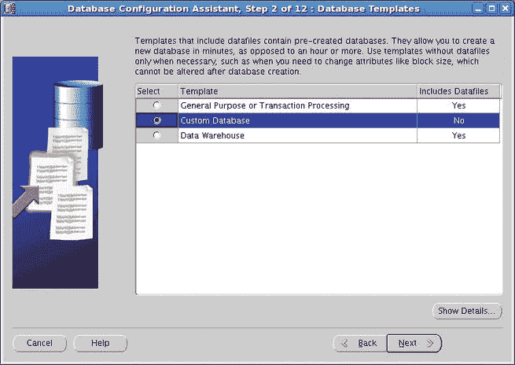
    *图 2-13. 数据库模板*

3.  “数据库标识”步骤出现，如 图 2-14 所示。输入全局数据库名，安装程序将根据该名称设置 `SID`。单击“下一步”。

    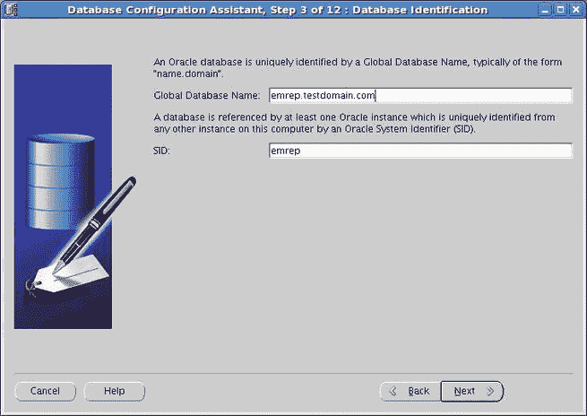
    *图 2-14. 数据库标识*

4.  对于“管理选项”步骤，如 图 2-15 所示，取消选中“配置 Enterprise Manager”，然后单击“下一步”。

    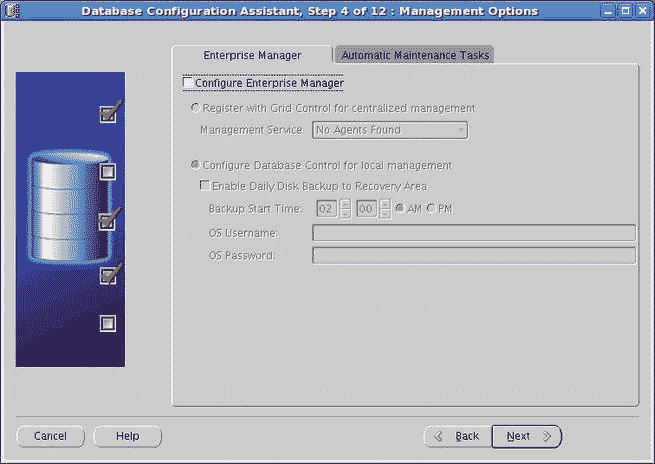
    *图 2-15. 管理选项*

5.  在“数据库凭据”步骤中，如 图 2-16 所示，输入 `SYS` 和 `SYSTEM` 用户的密码，然后单击“下一步”。Oracle 建议输入一个至少包含八个字符的密码，其中包括至少一个大写字母、一个小写字母和一个数字。

    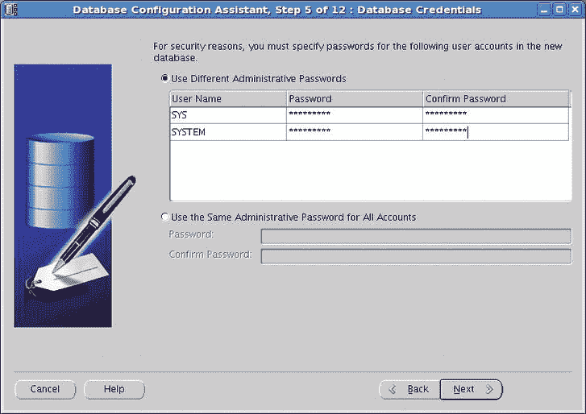
    *图 2-16. 数据库凭据*


6.  接受数据库文件位置的默认设置，然后单击“下一步”。
7.  您可以在此恢复配置步骤中启用归档（如图 2-17 所示），也可以稍后启用。设置快速恢复区（FRA）的目标位置和大小，然后单击“下一步”。

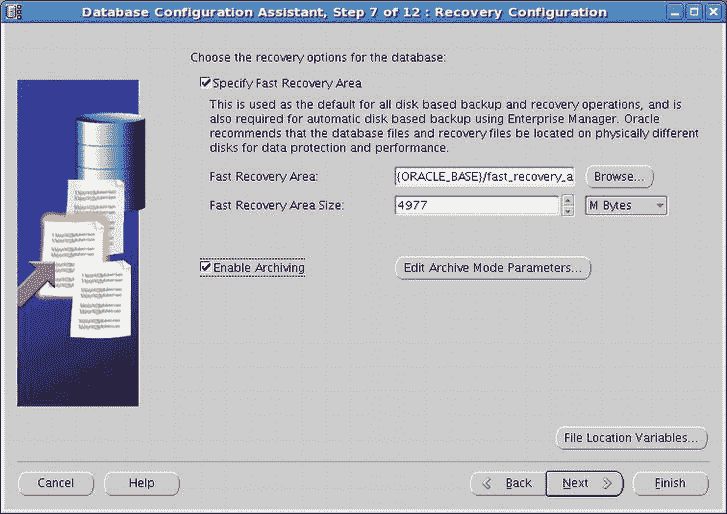

图 2-17. 恢复选项

8.  对于数据库内容步骤（如图 2-18 所示），取消选择所有组件，因为您不需要它们用于存储库数据库。然后单击“标准数据库组件”按钮。

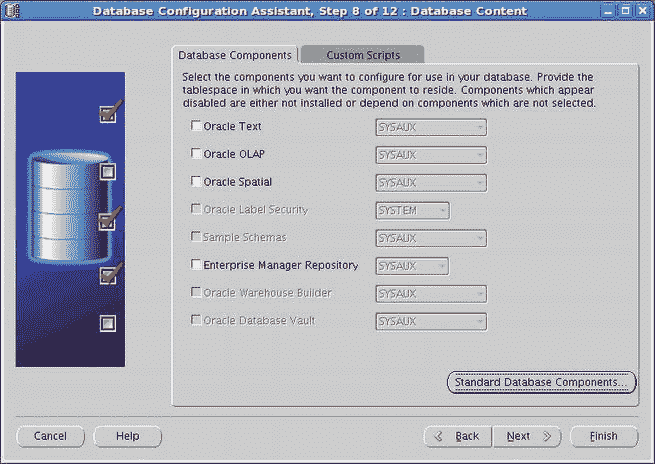

图 2-18. 数据库内容

9.  在“标准数据库组件”对话框中，取消选择`Oracle Multimedia`和`Oracle Application Express`，如图 2-19 所示。单击“确定”关闭对话框，然后单击“下一步”进入下一个步骤。

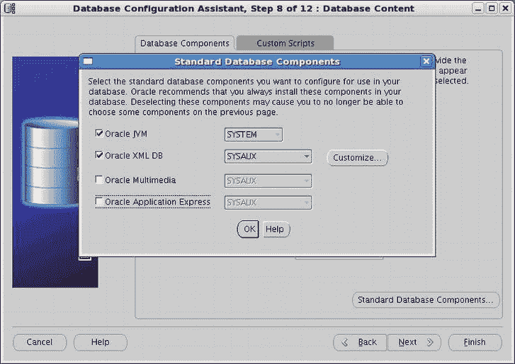

图 2-19. 标准数据库组件

10. 在设置内存时（参见图 2-20），确保为数据库设置的总内存（`SGA_max_size + PGA_aggregate_target`）不超过系统总物理内存的 75%。否则，系统将开始使用交换设备。我们建议您不要在`Enterprise Manager`中使用`memory_target`参数。接下来单击“字符集”选项卡。

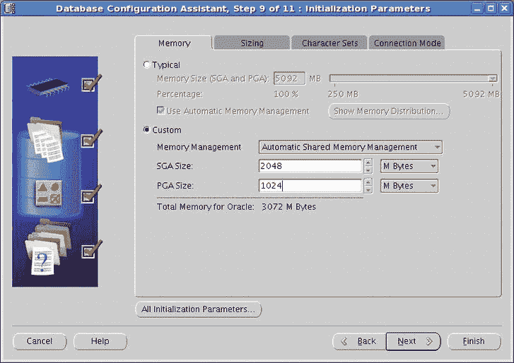

图 2-20. 内存参数

11. 对于初始化参数步骤（如图 2-21 所示），选择“使用 Unicode (`AL32UTF8`)”。将“国家字符集”选项设置为任何受 UTF 支持的字符集，例如`AL16UTF16`或`UTF8`。然后单击“下一步”。

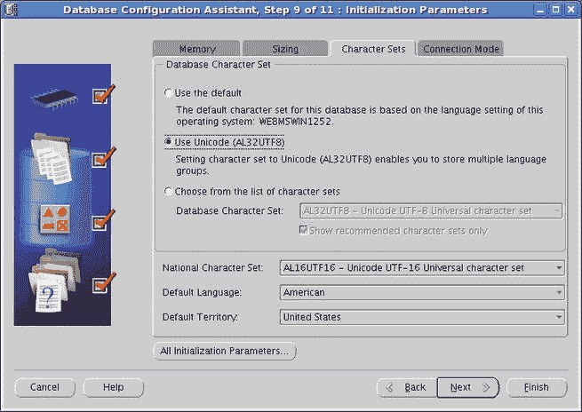

图 2-21. 数据库字符集

12. 将出现数据库存储步骤，如图 2-22 所示。管理存储库的重做日志文件大小应至少为 300MB。为所有三个重做日志组将“文件大小”选项设置为 300MB，然后单击“下一步”。

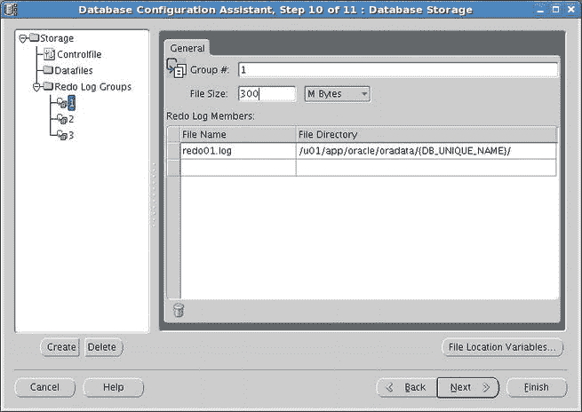

图 2-22. 数据库存储

13. 单击“完成”按钮以复查配置并创建数据库（参见图 2-23）。

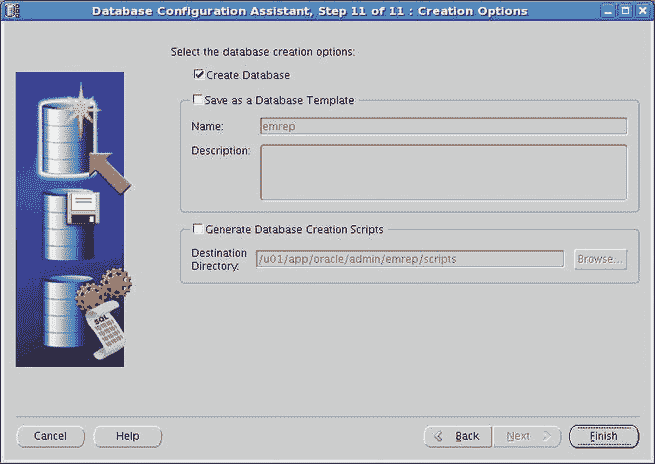

图 2-23. 创建选项

创建数据库后，使用`SQL*Plus`连接到它，运行以下命令，然后重新启动数据库：

```sql
ALTER SYSTEM SET pga_aggregate_target=1G SCOPE=SPFILE;
ALTER SYSTEM SET shared_pool_size=600M SCOPE=SPFILE;
ALTER SYSTEM SET job_queue_processes=20 SCOPE=SPFILE;
ALTER SYSTEM SET log_buffer=10485760 SCOPE=SPFILE;
ALTER SYSTEM SET open_cursors=300 SCOPE=SPFILE;
ALTER SYSTEM SET processes=500 SCOPE=SPFILE;
ALTER SYSTEM SET session_cached_cursors=200 SCOPE=SPFILE;
EXEC dbms_auto_task_admin.disable('auto optimizer stats collection',null,null);
```

现在管理存储库已准备就绪，是时候安装`Oracle Enterprise Manager`了。您将在名为`cloudcontrol12.testdomain.com`的第二台服务器上进行剩余的操作。

## 安装 Oracle Enterprise Manager 12c

`Enterprise Manager`有两种安装选项：简单和高级。使用高级模式时，可以选择预配置的插件，因此本节将使用此模式。

我们强烈建议在托管`Oracle Management Service`的服务器上安装`oracle-validated`软件包。如果不安装它，您将需要进行大量手动配置，包括创建用户和设置内核参数。尽管使用了`oracle-validated`或`preinstall`软件包，`Oracle Enterprise Manager`安装向导仍会检查先决条件，并在发现遗漏时提供脚本来修复内核参数（和缺失的库）。

### 创建 Oracle 用户和组

如果您没有安装`oracle-validated`软件包，则应手动创建`ORACLE`用户。以`ROOT`用户身份登录并发出以下命令：

```bash
[root@cloudcontrol12 ∼]# groupadd oinstall
[root@cloudcontrol12 ∼]# useradd -g oinstall oracle
[root@cloudcontrol12 ∼]# passwd oracle
```

在最后一个命令之后，为`ORACLE`用户输入密码。作为`ROOT`用户，您可以选择任何密码，即使是不遵循密码复杂性规则的密码。如果您这样做，系统会警告，但会让您继续。

### 创建所需目录

Oracle 基础目录必须至少有 5GB 的可用磁盘空间。以`ROOT`身份登录并输入类似以下的命令以创建推荐的子目录并在其上设置适当的的所有者、组和权限：

```bash
[root@cloudcontrol12 ∼]# mkdir -p /u01/app/
[root@cloudcontrol12 ∼]# chown -R oracle:oinstall /u01/app/
[root@cloudcontrol12 ∼]# chmod -R 775 /u01/app/
```

### 安装 Oracle Enterprise Manager

您可以从 OTN 下载`Enterprise Manager Cloud Control`软件。软件以 zip 文件形式提供。以下是`Oracle Enterprise Manager`的链接：

```
www.oracle.com/technetwork/oem/enterprise-manager/overview/index.html
```

下载安装文件后，将它们复制到`ORACLE 用户`可以访问的目录，然后切换到`ORACLE 用户`并解压缩它们：

```bash
[oracle@cloudcontrol12 ∼]$ unzip em12_linux64_disk1of2.zip -d cloudsetup
[oracle@cloudcontrol12 ∼]$ unzip em12_linux64_disk2of2.zip -d cloudsetup
```

确保在安装前未设置任何与数据库相关的环境变量（`ORACLE_HOME`、`ORACLE_SID`或`ORACLE_BASE`）。Oracle 还建议将`umask`设置为`022`。更改目录到`cloudsetup`并运行安装程序：

```bash
[oracle@cloudcontrol12 ∼]$ umask 022
[oracle@cloudcontrol12 ∼]$ cd cloudsetup
[oracle@cloudcontrol12 ∼]$ ./runInstaller
```

当`Enterprise Manager`安装程序启动时，请按照以下步骤操作：

1.  对于“My Oracle Support 详细信息”步骤（如图 2-24 所示），如果您想接收安全更新，请输入您的凭据。然后单击“下一步”。

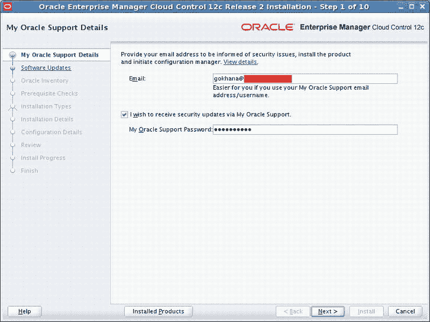

图 2-24. Oracle Enterprise Manager 安装程序

2.  在下一步中，输入您的`My Oracle Support`凭据（再次），然后单击“搜索更新”。在此示例中，您可以看到有可用的补丁（参见图 2-25）。在您的情况下可能会看到不同的补丁。单击“下一步”，然后单击“确定”以接受有关重新启动安装程序的警告。

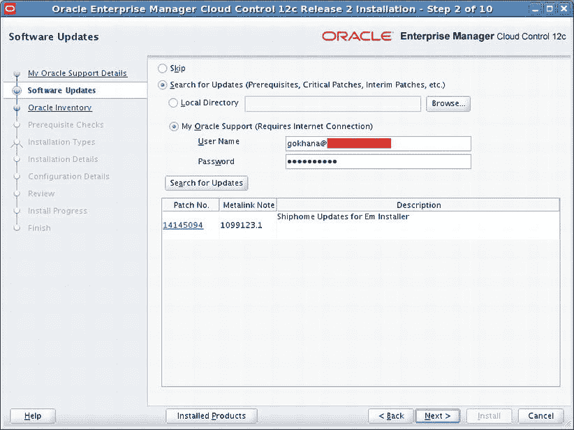

图 2-25. 软件更新

3.  安装程序重新启动后，继续下一步（如图 2-26 所示）。为“清单位置”输入一个目录，并为您为`ORACLE 用户`创建的组。当您单击“下一步”时，安装程序会检查先决条件。

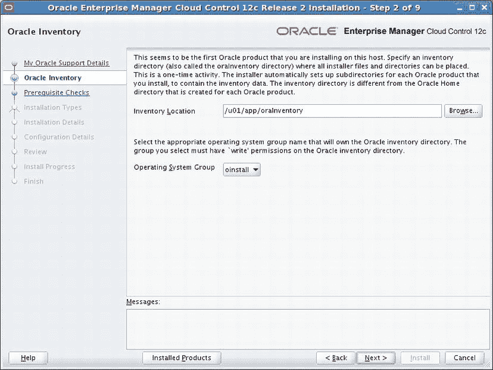

图 2-26. Oracle 清单

4.  确保所有先决条件检查的状态均为“成功”，如图 2-27 所示，然后单击“下一步”。

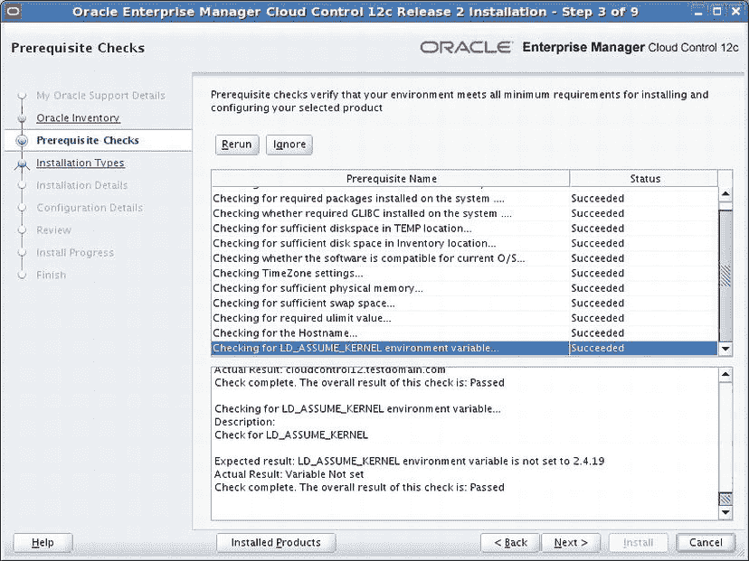

图 2-27. 先决条件检查


## 5.  选择“创建一个新的 Enterprise Manager 系统”，然后选择“高级”（参见图 2-28）。点击“下一步”。

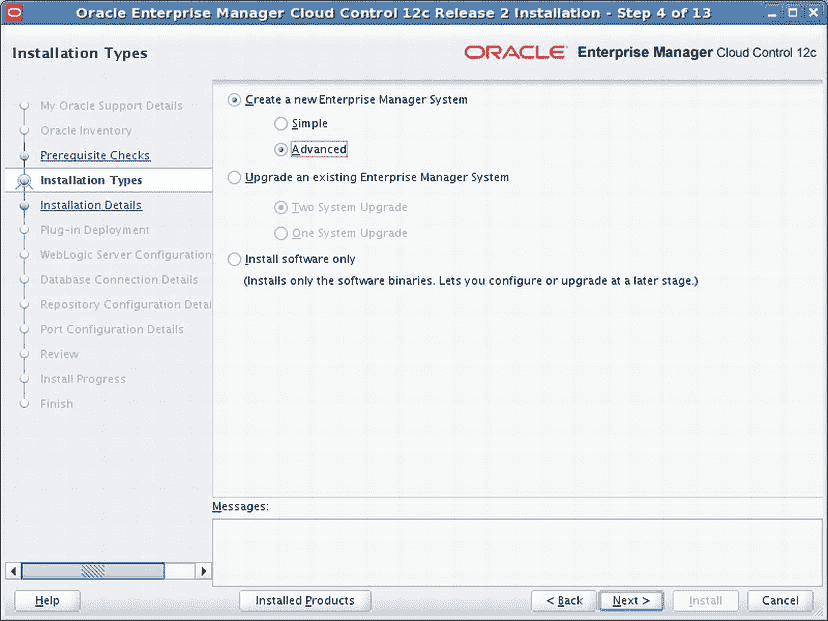

图 2-28. 安装类型

## 6.  对于“安装详情”步骤，如图 2-29 所示，输入中间件主目录位置为`/u01/app/Middleware`，代理基本目录为`/u01/app/agent`，以及您的主机名。然后点击“下一步”。

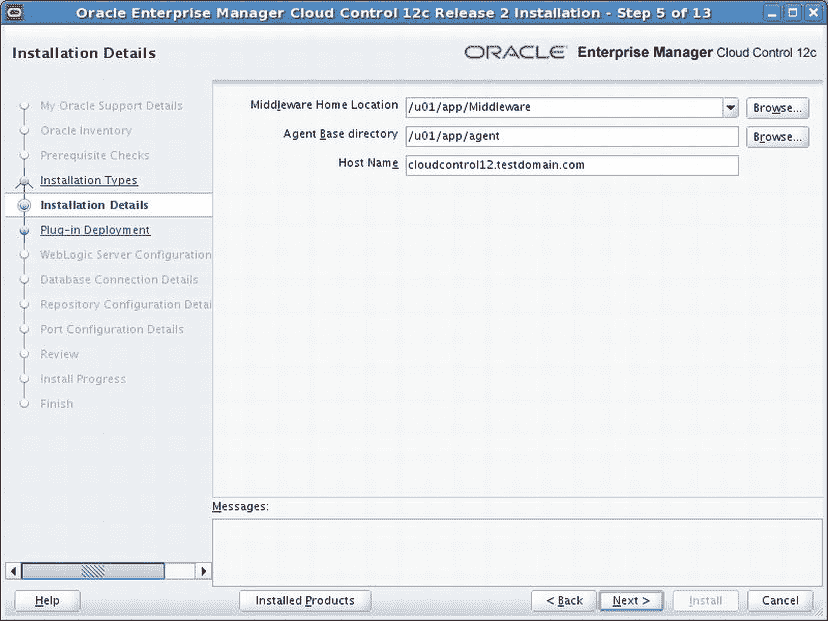

图 2-29. 安装详情

## 7.  在“插件部署”步骤，如图 2-30 所示，选择您要配置的管理插件。您也可以在安装 Enterprise Manager 后添加或移除管理插件。点击“下一步”。

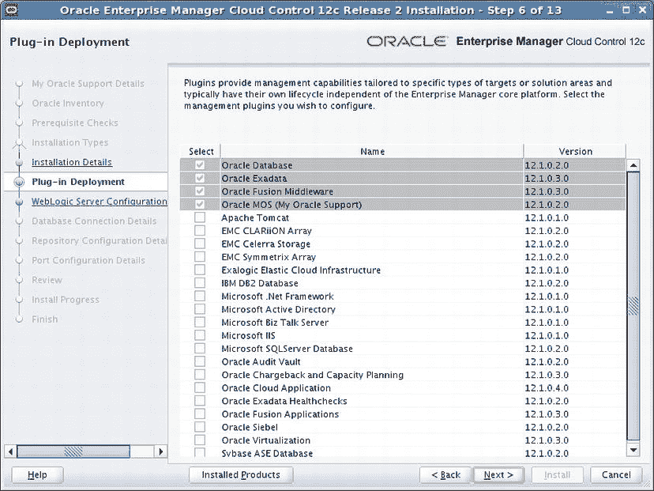

图 2-30. 插件部署

## 8.  Oracle Management Service 是 Enterprise Manager 的主要应用程序，它需要一个 WebLogic 应用服务器来运行。在下一步中，如图 2-31 所示，为 WebLogic 服务器选择一个用户名和密码，并为节点管理器设置一个密码。请妥善保管此信息。在排查与 WebLogic 相关的问题时可能需要它。点击“下一步”。

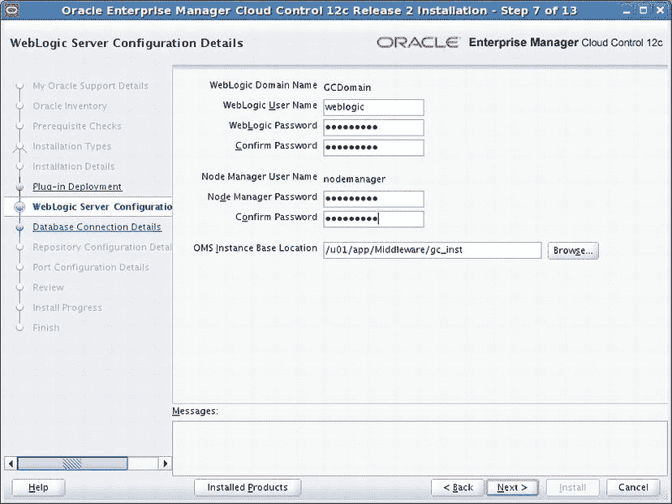

图 2-31. Weblogic 服务器配置

## 9.  输入仓库数据库的连接信息并选择部署规模（参见图 2-32）。安装程序会根据部署规模检查数据库设置。点击“下一步”。

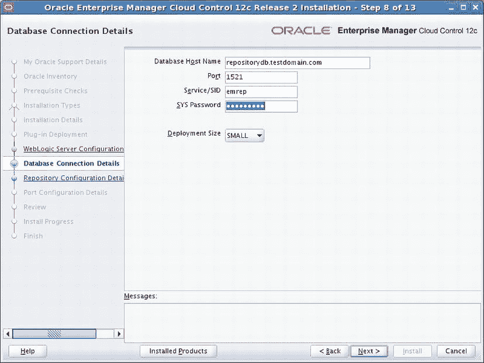

图 2-32. 数据库连接详情

## 10.  安装程序将在仓库数据库中创建所需的数据库用户和表空间。对于“仓库配置详情”步骤，如图 2-33 所示，输入`SYSMAN`用户的密码，根据需要修改目录位置，并输入一个注册密码，该密码将用于保护代理通信的安全。点击“下一步”。

 `注意` 如果您正在为一个使用 Oracle 自动存储管理（ASM）进行存储的数据库配置管理仓库，那么当您指定数据文件位置时，只有磁盘组用于创建表空间。例如，如果您指定`+DATA/mgmt.dbf`，则只有`+DATA`用于在 ASM 上创建表空间，而数据文件在磁盘组上的确切位置由 Oracle 托管文件决定。

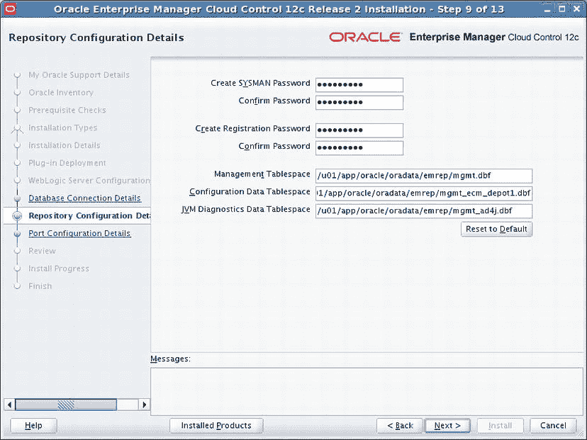

图 2-33. 仓库配置详情

## 11.  检查将分配给 Oracle Enterprise Manager 的端口（参见图 2-34）。您可以修改它们，但请记住端口号必须大于 1024 且小于 65535。

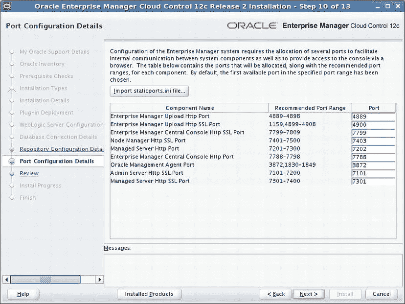

图 2-34. 端口配置详情

## 12.  检查配置（参见图 2-35）。对配置满意后，点击“安装”开始安装。

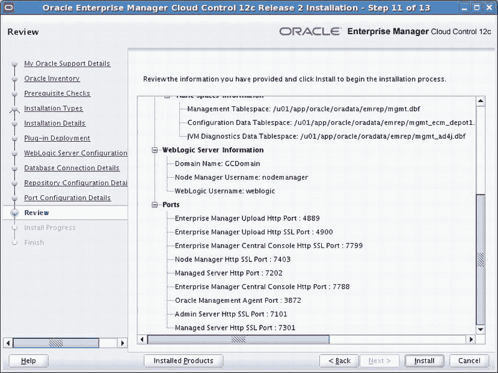

图 2-35. 安装检查

## 13.  安装结束时，您需要执行一些配置脚本。以 ROOT 身份登录到服务器（在另一个终端会话中）并运行脚本（参见图 2-36）。然后点击“确定”完成安装。

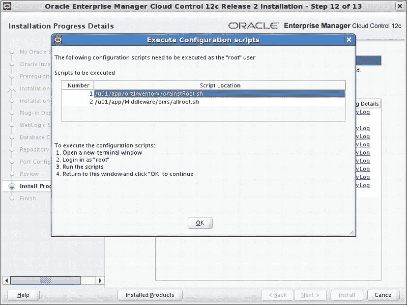

图 2-36. 执行配置脚本

## 14.  检查信息，如图 2-37 所示，然后点击“关闭”以完成 Oracle Enterprise Manager Cloud Control 12c 的安装。

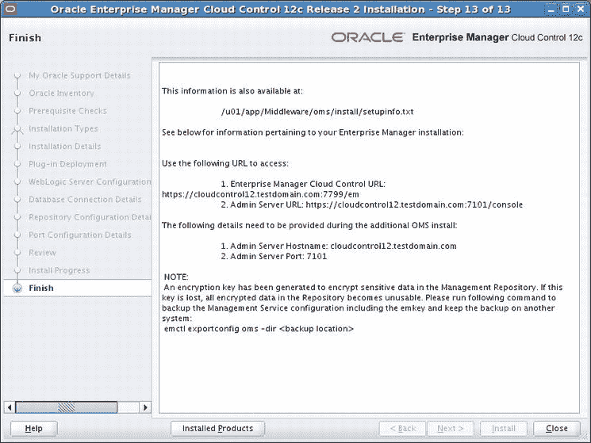

图 2-37. 安装完成

## 15.  现在您可以登录到 Enterprise Manager Cloud Control，如图 2-38 所示。

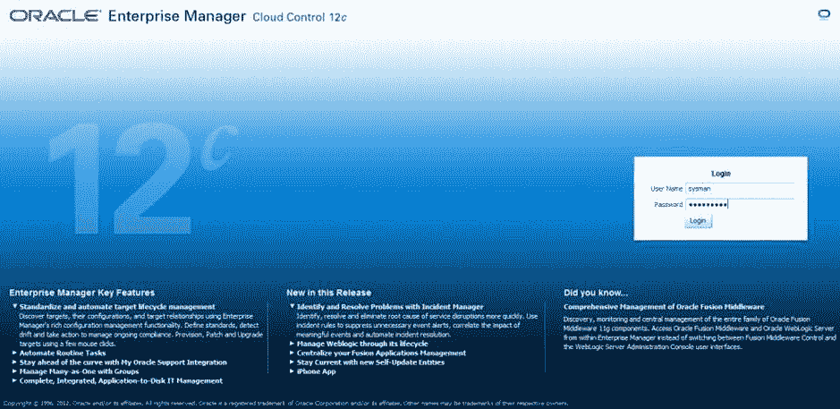

图 2-38. Oracle Enterprise Manager 登录屏幕

## 部署管理代理

Oracle Management Agent 是 Enterprise Manager Cloud Control 的核心组件之一。如果您想要监控在某个主机上运行的目标（例如数据库或应用服务器），您需要通过部署管理代理将该主机转换为受管主机。然后您就可以发现该主机上运行的目标并将其添加到 Enterprise Manager 系统。

有几种部署代理的方式：

*   使用“添加主机目标”向导
*   使用 RPM 文件
*   使用`AgentPull`脚本
*   使用`agentDeploy`脚本

以下各节描述了这些选项。

### 使用“添加主机目标”向导

使用“添加主机目标”向导是部署管理代理最简单的方式。它对于大规模部署管理代理尤其有用。Oracle 也推荐使用此向导。请按照以下步骤操作：

1.  登录到 Enterprise Manager Cloud Control 控制台。
2.  从“设置”菜单中，选择“添加目标”  “手动添加目标”，如图 2-39 所示。

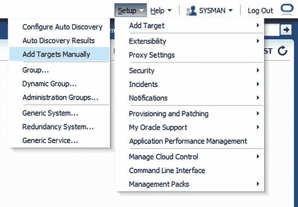

图 2-39. 添加主机向导

3.  选择“添加主机目标”单选按钮，然后点击“添加主机”按钮，如图 2-40 所示。

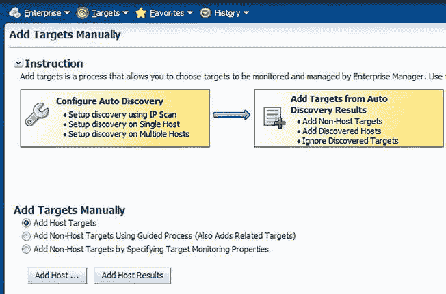

图 2-40. 手动添加目标

4.  为了能够监控仓库数据库，请在`repositorydb.testdomain.com`服务器上部署一个管理代理。点击带有加号的“添加”按钮，输入主机名，然后选择目标服务器的操作系统。在此示例中，我们在 Linux x64 上安装了 Enterprise Manager，并且没有下载任何额外的代理软件，因此目前我们只能为 64 位 Linux 服务器部署代理（参见图 2-41）。点击“下一步”。

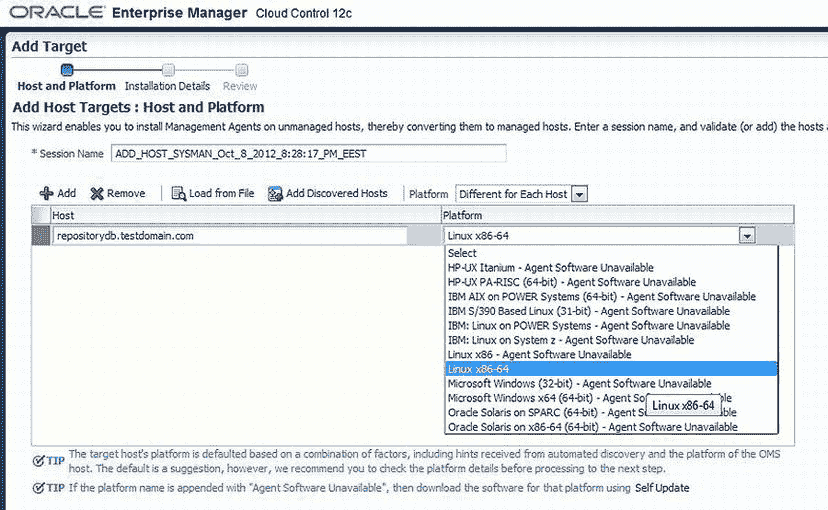

图 2-41. 添加主机目标

5.  输入代理软件将被安装到的目录。点击“命名凭据”选项旁边的蓝色加号，为主机添加一个凭据。在显示的“创建新的命名凭据”对话框中，为凭据起一个有意义的名字，然后点击“确定”保存它（参见图 2-42）。

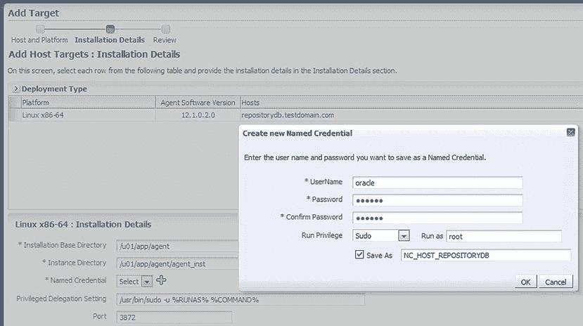

图 2-42. 创建新的命名凭据

6.  使用命名凭据提供了一层额外的安全保护。管理员可以为操作员创建命名凭据，这样他们就可以使用登录信息，而无需知道与之关联的实际用户名和密码。点击“下一步”以检查配置详情，如图 2-43 所示。

 `提示` Oracle 建议配置权限委派（即，给管理代理用户赋予`sudo`权限）。

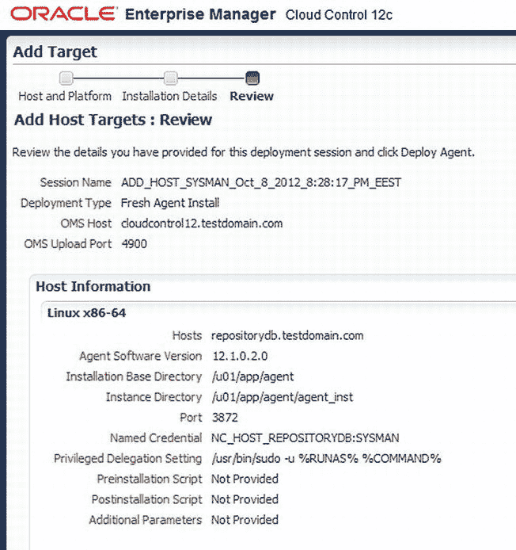

图 2-43. 代理安装检查

7.  点击控制台右上角的“部署代理”按钮开始部署过程。


