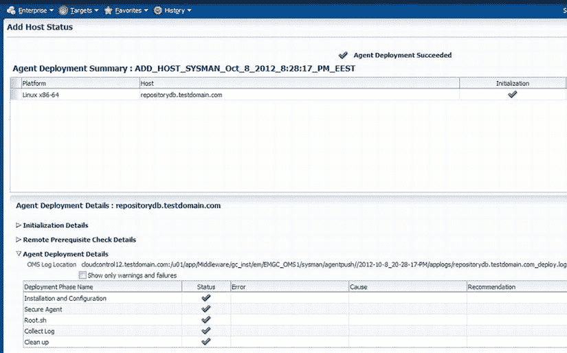

# 代理部署已完成

代理部署已完成（参见图 2-44）。现在，您可以将此服务器上的非主机目标（如 Oracle 数据库）添加到 Enterprise Manager 系统中。



图 2-44. 代理部署摘要

如前所述，添加主机目标向导是部署代理的推荐方式。但是，如果您的目标主机未启用 SSH 服务，或者您希望将代理安装委托给系统管理员，您可以使用其他方法，例如创建代理的 RPM 包，或使用 AgentPull 或 agentDeploy 脚本。

### 使用 RPM

本节概述通过 RPM 部署代理的过程。请遵循以下步骤：

1.  要能够创建 RPM 包，您需要在 OMS 服务器上创建目录 `/usr/lib/oracle`（如果该目录尚不存在）。以 ROOT 用户身份登录并运行以下命令：

    ```
    [root@cloudcontrol12 ∼]# mkdir /usr/lib/oracle
    [root@cloudcontrol12 ∼]# chmod 777 /usr/lib/oracle
    ```

2.  在 OMS 主机上安装 `rpm-build` 软件包：

    ```
    [root@cloudcontrol12 ∼]# yum install rpm-build
    ```

3.  以 ORACLE 用户身份登录 OMS 主机，并使用 `emcli` 登录 OMS：

    ```
    [oracle@cloudcontrol12 ∼]$ /u01/app/Middleware/oms/bin/emcli login -username=sysman
    ```

     **注意**  用户 `SYSMAN` 是 Oracle Enterprise Manager 的默认超级管理员账户。

4.  同步 `emcli`：

    ```
    [oracle@cloudcontrol12 ∼]$ /u01/app/Middleware/oms/bin/emcli sync
    ```

5.  列出 OMS 主机上可用的管理代理软件支持的平台：

    ```
    [oracle@cloudcontrol12 ∼]$ /u01/app/Middleware/oms/bin/emcli get_supported_platforms
    正在获取平台列表 ...
    检查日志 /u01/app/Middleware/gc_inst/em/EMGC_OMS1/sysman/emcli/setup/.emcli/agent.log
    即将访问自更新代码路径以检索平台列表..
    正在获取平台列表  ...
    -----------------------------------------------
    Version = 12.1.0.2.0
    Platform = Linux x86-64
    -----------------------------------------------
    平台列表显示成功。
    ```

6.  如您所见，目前只有 Linux x64 代理可用。您始终可以通过 Enterprise Manager 的自更新屏幕下载其他代理。
7.  发出以下命令，从 Oracle 软件库创建管理代理的 RPM 文件并将其下载到 OMS 主机上的一个目录：

    ```
    [oracle@cloudcontrol12 ∼]$ /u01/app/Middleware/oms/bin/emcli get_agentimage_rpm \
    -destination=/home/oracle -platform="Linux x86-64" -version=12.1.0.2.0
    ...
    代理映像复制成功...
    开始创建 RPM...
    RPM 创建成功。
    代理映像到 rpm 的转换成功完成
    ```

8.  您可以将 OMS 服务器 `/home/oracle` 目录中的 RPM 文件复制到目标系统以部署代理。我们假设您已经在目标系统上为代理创建了一个用户。如果您已在目标系统上安装了 `oracle-validated` 软件包，则 ORACLE 用户和 OINSTALL 组已经创建。

    ```
    [oracle@cloudcontrol12 ∼]$ scp oracle-agt-12.1.0.2.0-1.0.x86_64.rpm \
    oracle@target.testdomain.com:/home/oracle/
    oracle@target.testdomain.com 的密码：
    oracle-agt-12.1.0.2.0-1.0.x86_64.rpm           59%  133MB  15.4MB/s   00:05 ETA
    ```

9.  在目标系统上以 ROOT 身份登录并安装 RPM：

    ```
    [root@target ∼]# cd /home/oracle
    [root@target ∼]# rpm –i oracle-agt-12.1.0.2.0-1.0.x86_64.rpm
    ```

10. 现在，您需要根据您的 Enterprise Manager 安装情况编辑 `/usr/lib/oracle/agent/agent.properties` 文件，然后运行 `/etc/init.d/oracle-agt`：

    ```
    [root@target ∼]# vi /usr/lib/oracle/agent/agent.properties
    OMS_HOST=cloudcontrol12.testdomain.com
    OMS_PORT=7799
    AGENT_REGISTRATION_PASSWORD=<registration_password>
    AGENT_USERNAME=oracle
    AGENT_GROUP=oinstall
    AGENT_PORT=3872
    ORACLE_HOSTNAME=target.testdomain.com
    [root@target ∼]# /etc/init.d/oracle-agt RESPONSE_FILE=/usr/lib/oracle/agent/agent.properties
    ```

11. 检查代理是否已启动：

    ```
    [oracle@target ∼]$ /usr/lib/oracle/agent/core/12.1.0.2.0/bin/emctl status agent
    Oracle Enterprise Manager Cloud Control 12c Release 2
    Copyright (c) 1996, 2012 Oracle Corporation.  All rights reserved.
    ---------------------------------------------------------------
    Agent Version     : 12.1.0.2.0
    OMS Version       : 12.1.0.2.0
    Protocol Version  : 12.1.0.1.0
    Agent Home        : /usr/lib/oracle/agent/agent_inst
    Agent Binaries    : /usr/lib/oracle/agent/core/12.1.0.2.0
    Agent Process ID  : 5323
    Parent Process ID : 5283
    Agent URL         : https://target.testdomain.com:3872/emd/main/
    Repository URL    : https://cloudcontrol12.testdomain.com:4900/empbs/upload
    Started at        : 2012-10-12 03:44:47
    Started by user   : oracle
    Last Reload       : (none)
    最后一次成功上传                       : 2012-10-12 03:47:06
    最后一次尝试上传                        : 2012-10-12 03:47:06
    迄今为止上传的 XML 文件总 MB 数 : 0.01
    等待上传的 XML 文件数           : 0
    等待上传的 XML 文件大小(MB)         : 0
    上传文件系统上的可用磁盘空间    : 91.52%
    收集状态                            : 已启用收集
    心跳状态                             : 正常
    最后一次尝试向 OMS 发送心跳              : 2012-10-12 03:47:00
    最后一次成功向 OMS 发送心跳             : 2012-10-12 03:47:00
    下一次计划向 OMS 发送心跳              : 2012-10-12 03:48:00

    ---------------------------------------------------------------
    代理正在运行并准备就绪
    ```

如您所见，代理已成功部署并运行。

### 使用 AgentPull 脚本

要使用 AgentPull 脚本，请遵循以下步骤：

1.  您需要为管理代理创建一个用户，创建所需的目录，并为新的管理代理用户授予权限。在此示例中，您将创建 ORACLE 用户，因此请以 ROOT 身份登录并运行以下命令：

    ```
    [root@target ∼]# groupadd oinstall
    [root@target ∼]# groupadd dba
    [root@target ∼]# useradd -g oinstall -G dba oracle
    [root@target ∼]# passwd oracle
    [root@target ∼]# mkdir -p /u01/agent
    [root@target ∼]# chown -R oracle:oinstall /u01/agent
    ```

    如果已有 ORACLE 用户（并且您想将其用于管理代理），则无需删除并重新创建它。

2.  创建必需的目录后，以 ORACLE（管理代理）用户身份打开 X Window 会话，并从 OMS 下载 AgentPull 脚本。
    如果目标主机运行在 Unix 系统上，请从该主机访问以下 URL：
    ```
    https://<OMS_HOST>:<OMS_PORT>/em/install/getAgentImage
    ```
    例如：
    ```
    https://cloudcontrol12.testdomain.com:7799/em/install/getAgentImage
    ```
    如果目标主机运行在 Microsoft Windows 上，请从该主机访问以下 URL，该 URL 在之前 URL 的末尾添加了 `?script=bat`：
    ```
    https://cloudcontrol12.testdomain.com:7799/em/install/getAgentImage?script=bat
    ```

3.  也可以使用 `curl` 或 `wget` 下载 `AgentPull.sh` 脚本。要使用 `wget` 下载脚本，请发出以下命令。注意，您下载的是 `getAgentImage`，然后将其名称更改为 `AgentPull.sh`。

    ```
    [root@target ∼]# wget
    https://cloudcontrol12.testdomain.com:7799/em/install/getAgentImage
    --no-check-certificate
    [root@target ∼]# mv getAgentImage AgentPull.sh
    ```

    要通过 `curl` 下载，请发出以下命令：


```
[root@target ∼]# curl "
https://cloudcontrol12.testdomain.com:7799/em/install/getAgentImage
" --insecure -o agentPull.sh
```

 `注意` 上面的 wget 和 curl 示例实际上下载的文件名为 `getAgentImage`。该文件在下载后（wget）或作为下载过程的一部分（curl）被重命名。文件被重命名为 `AgentPull.sh`。

4.  使 `AgentPull.sh` 脚本可执行：
```
[oracle@target ∼]$ chmod +x AgentPull.sh
```

5.  检查可用的平台：
```
[oracle@target ∼]$ ./AgentPull.sh -showPlatforms
平台        版本
Linux x86-64    12.1.0.2.0
```

6.  要使用 `AgentPull` 脚本，需要创建一个响应文件——例如 `agent.rsp`（位于目标主机上的任意位置，最好与 `AgentPull` 脚本在同一目录下）：
```
[oracle@target ∼]$ vi agent.rsp
LOGIN_USER=sysman
LOGIN_PASSWORD=<sysman_password>
PLATFORM="Linux x86-64"
VERSION=12.1.0.2.0
AGENT_REGISTRATION_PASSWORD=<registration_password>
```

7.  然后运行 `AgentPull` 脚本：
```
[oracle@target ∼]$ ./AgentPull.sh RSPFILE_LOC=/home/oracle/agent.rsp AGENT_BASE_DIR=/u01/agent
```

8.  脚本成功执行后，打开一个新的终端窗口，以 ROOT 用户登录，并运行配置脚本（脚本位置写在 `AgentPull.sh` 的输出中）：
```
[root@target ∼]# /u01/agent/core/12.1.0.2.0/root.sh
已完成特定于产品的 root 操作。
/etc 目录已存在
已完成特定于产品的 root 操作。
[root@target ∼]# /u01/app/oraInventory/orainstRoot.sh
正在修改 /u01/app/oraInventory 的权限
为组添加读、写权限，为其他用户移除读、写、执行权限。
正在将 /u01/app/oraInventory 的组名修改为 oinstall。
脚本执行完成。
```
执行脚本后，代理部署即告完成。

### 使用 `agentDeploy` 脚本

要使用 `agentDeploy` 脚本部署管理代理，请按照以下步骤操作：

1.  为管理代理创建用户，创建所需目录，并授予管理代理用户权限。假设您正在创建 ORACLE 用户，因此请以 ROOT 用户登录并运行以下命令：
```
[root@target ∼]# groupadd oinstall
[root@target ∼]# groupadd dba
[root@target ∼]# useradd -g oinstall -G dba oracle
[root@target ∼]# passwd oracle
[root@target ∼]# mkdir -p /u01/agent
[root@target ∼]# chown -R oracle:oinstall /u01/agent
```
如果 ORACLE 用户已经存在（并且您想将其用于管理代理），则无需删除并重新创建它。

2.  以 ORACLE 用户登录 OMS 主机，并使用 `EMCLI` 登录 OEM：
```
[oracle@cloudcontrol12 ∼]$ /u01/app/Middleware/oms/bin/emcli login -username=sysman
```

3.  同步 `EMCLI`：
```
[oracle@cloudcontrol12 ∼]$ /u01/app/Middleware/oms/bin/emcli sync
```

4.  列出 OMS 主机上可用的管理代理软件平台：
```
[oracle@cloudcontrol12 ∼]$ /u01/app/Middleware/oms/bin/emcli get_supported_platforms
正在获取平台列表...
检查日志文件 /u01/app/Middleware/gc_inst/em/EMGC_OMS1/sysman/emcli/setup/.emcli/agent.log
即将访问自更新代码路径以检索平台列表...
正在获取平台列表...
-----------------------------------------------
版本 = 12.1.0.2.0
平台 = Linux x86-64
-----------------------------------------------
平台列表显示成功。
```

5.  将管理代理软件下载到 OMS 主机上的某个目录：
```
[oracle@cloudcontrol12 ∼]$ /u01/app/Middleware/oms/bin/emcli get_agentimage
-destination=/home/oracle -platform="Linux x86-64" -version=12.1.0.2.0
```

6.  该命令将核心管理代理软件下载到目标目录（`/home/oracle`）。例如，对于 Linux x86-64，您将看到文件 `12.1.0.2.0_AgentCore_226.zip`。

7.  将此文件传输到目标服务器：
```
[oracle@cloudcontrol12 ∼]$ scp 12.1.0.2.0_AgentCore_226.zip \
oracle@target.testdomain.com:/home/oracle/
```

8.  登录目标服务器并解压 zip 文件：
```
[oracle@target ∼]$ unzip 12.1.0.2.0_AgentCore_226.zip -d agentsetup
归档:  12.1.0.2.0_AgentCore_226.zip
  正在解压: agentsetup/unzip
  正在解压: agentsetup/agentDeploy.sh
  正在解压: agentsetup/agentimage.properties
  正在解压: agentsetup/agent.rsp
  正在解压: agentsetup/agentcoreimage.zip
  正在解压: agentsetup/12.1.0.2.0_PluginsOneoffs_226.zip
```

9.  进入 `agentsetup` 目录并编辑代理响应文件：
```
[oracle@target ∼]$ cd agentsetup/
[oracle@target agentsetup]$ vi agent.rsp
```

10. 输入以下值：
```
OMS_HOST=cloudcontrol12.testdomain.com
EM_UPLOAD_PORT=4900
AGENT_REGISTRATION_PASSWORD=<registration_password>
AGENT_INSTANCE_HOME=/u01/agent
AGENT_PORT=3872
b_startAgent=true
ORACLE_HOSTNAME=target.testdomain.com
s_agentHomeName="agent12gR2"
```

11. 运行 `agentDeploy.sh` 脚本以部署代理：
```
./agentDeploy.sh RESPONSE_FILE=/home/oracle/agentsetup/agent.rsp AGENT_BASE_DIR=/u01/agent
```

12. 脚本成功执行后，打开一个新的终端窗口，以 ROOT 用户登录，并运行配置脚本（脚本位置写在 `agentDeploy.sh` 的输出中）：
```
[root@target ∼]#  /u01/agent/core/12.1.0.2.0/root.sh
已完成特定于产品的 root 操作。
/etc 目录已存在
已完成特定于产品的 root 操作。
```

13. 检查代理状态：
```
[oracle@target agentsetup]$ /u01/agent/core/12.1.0.2.0/bin/emctl status agent
Oracle Enterprise Manager Cloud Control 12c Release 2
版权所有 (c) 1996, 2012 Oracle Corporation。保留所有权利。
---------------------------------------------------------------
代理版本     : 12.1.0.2.0
OMS 版本       : 12.1.0.2.0
协议版本      : 12.1.0.1.0
代理主目录    : /u01/agent
代理二进制文件    : /u01/agent/core/12.1.0.2.0
代理进程 ID  : 14620
父进程 ID : 14578
代理 URL         : https://target.testdomain.com:3872/emd/main/
存储库 URL    : https://cloudcontrol12.testdomain.com:4900/empbs/upload
启动时间        : 2012-10-12 06:10:12
启动用户   : oracle
上次重新加载       : (无)
上次成功上传                       : 2012-10-12 06:12:57
上次尝试上传                        : 2012-10-12 06:12:57
到目前为止已上传的 XML 文件总大小（MB） : 0.01
待上传的 XML 文件数量           : 0
待上传的 XML 文件大小(MB)         : 0
上传文件系统上的可用磁盘空间    : 89.15%
收集状态                            : 收集已启用
心跳状态                             : 正常
上次尝试向 OMS 发送心跳              : 2012-10-12 06:13:26
上次成功向 OMS 发送心跳             : 2012-10-12 06:13:26
下次计划向 OMS 发送心跳              : 2012-10-12 06:14:26
---------------------------------------------------------------
代理正在运行并准备就绪
```
因此，代理已安装并正在运行。

## 总结

在本章中，您学习了如何安装管理存储库和 Oracle Enterprise Manager Cloud Control。您还学习了各种代理部署方法。部署代理后，您可以在主机上发现目标（例如 Oracle 数据库、中间件和应用程序）。

