# 第 3 章


OMS 和存储库的管理

作者：Pete Sharman


既然我们已经介绍了安装 Enterprise Manager Cloud Control 12c 的选项，包括代理部署，现在来看看维护 EM 基础设施需要做些什么。正如在第 1 章所讨论的，Enterprise Manager 由三个主要活动组件构成：`Oracle Management Agent`、`Oracle Management Service`和`Oracle Management Repository`。让我们依次 examine 每个组件。

## Oracle Management Agent

代理管理是随着 Enterprise Manager 12c 版本的发布而变得**非常直接**的一个领域。在之前的版本中，代理管理必须通过命令行使用`EMCTL`或`EMCLI`工具来执行。虽然在 12c 版本中，你仍然可以使用命令行界面来管理代理，但大部分管理也可以通过`Cloud Control 控制台`完成。本节首先介绍控制台的使用，然后再介绍命令行界面。

### 使用控制台进行代理管理

要从`Cloud Control 控制台`访问代理管理功能，请从`设置`菜单中选择`管理 Cloud Control`  `代理`，如图 3-1 所示。

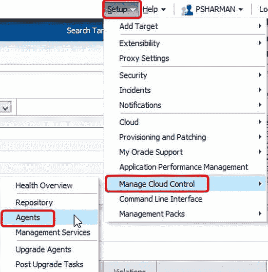

图 3-1. 在 Cloud Control 控制台中选择代理管理

这将带你进入`代理`页面，如图 3-2 所示。默认情况下，此页面显示系统中所有代理的状态，但你可以选择一个选项，仅显示那些处于`运行中`、`维护期`、`不可达`等状态的代理。

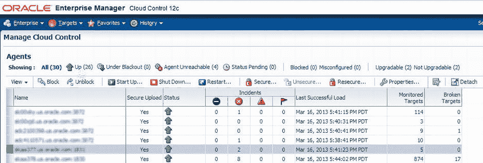

图 3-2. 代理页面

 **提示** `可升级`和`不可升级`的值仅在你已将 OMS 从 12.1.0.1 升级到 12.1.0.2 时才会出现。当然，升级 OMS 并不会同时升级代理。不过，你可以通过在 EM12c 控制台中点击`可升级`，选择要升级的代理，然后点击`升级`按钮来批量升级代理。

你还可以选择特定的代理（按住 Ctrl 键的同时进行选择）或一系列代理（按住 Shift 键的同时进行选择）来执行操作，例如启动、关闭、保障安全等。这些相当直接的操作在 Oracle 的 Enterprise Manager 产品文档中有很好的介绍，因此这里不再赘述。

 **提示** 新用户首次使用 EM12c 用户界面时常掉入的一个陷阱是**没有点击屏幕的正确部分**。请注意，代理名称是超链接，因此点击代理名称会带你到该特定代理的主页。如果你想选择代理并停留在此页面上执行特定操作，请点击代理名称左侧的列（如图 3-2 所示），或者点击代理列中但超链接右侧的位置。

### 同时控制多个代理

能够选择多个代理来执行操作是 EM12c 这一部分相对于之前版本的**主要增强功能**之一。此功能使管理员能够一次性对多个代理进行更改，而不是逐个进行。例如，假设你希望将一组代理上传累积数据文件到更小的值，因为这些代理监控着你更关键的系统。你需要做的就是选择要修改的代理，然后点击`属性`图标（如图 3-2 右侧所示）。这将启动“创建代理配置操作”作业工作流，如图 3-3 所示。

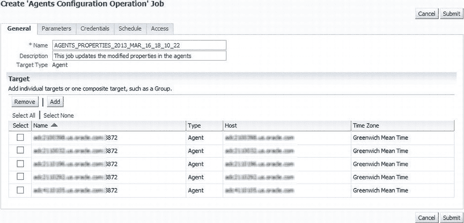

图 3-3. 创建“代理配置操作”作业工作流的第一步

请注意，最初没有选择任何代理。因此，选择你想要的代理（或者直接点击`全选`来选择所有代理），然后点击`参数`选项卡。这将显示一个长长的代理属性列表供你更改，如图 3-4 所示。向下滚动到`UploadInterval`参数，并以分钟为单位输入你希望代理上传的频率值。在图 3-4 中，该值被设置为每 5 分钟上传一次（默认值为 15 分钟）。

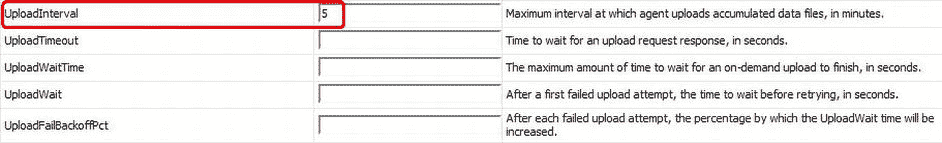

图 3-4. 更改 UploadInterval 参数

你可以使用`计划`选项卡来安排此操作在稍后时间（例如，指定的维护时间）发生。但是，如果你不需要安排此作业稍后运行，可以直接点击`提交`。然后，你将返回到`代理`页面，并收到一条信息性消息，提示作业已提交，并附有一个用于检查作业进度的链接。

### 使用代理的主页

从刚才描述的`代理`页面，你可以通过点击代理名称进入特定代理的主页。（你也可以通过从`所有目标`页面选择代理来访问代理的主页。）OMS 会连接到该代理，并显示有关该特定代理的各种更详细信息，包括以下内容。

### 摘要区域

这提供了诸如代理的可用性和状态等详细信息。此区域中特别令人感兴趣的是列表，它显示了此代理中部署了哪些管理插件，如图 3-5 所示。（请记住，代理只包含其所在机器上存在的目标的插件，因此查看部署了哪些插件很有用。）

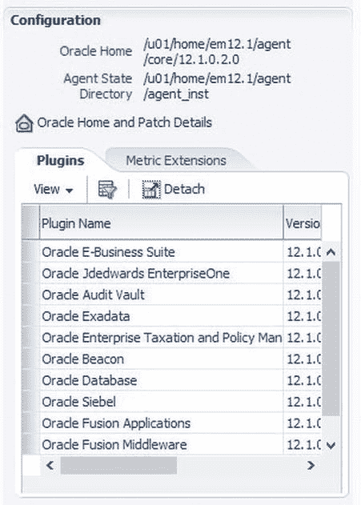

图 3-5. 为代理安装的插件列表

### 监控区域

这显示了此代理监控的目标的详细信息、这些目标的指标问题以及它们的主要收集项。

### 性能和使用情况区域

这详细说明了代理自身的性能情况，如图 3-6 所示。在此区域中，你应注意几个重要事项：

*   乍一看，这些图表可能令人困惑，因为 y 轴似乎没有测量单位。实际上，单位是存在的，只是在每张图表的说明中。
*   y 轴是根据结果进行缩放的。这意味着性能看起来可能比实际情况更糟。例如，图 3-6 中的上传速率乍一看很糟糕，但它达到的最大值仅略高于 0.5 KB/秒，这显然不是问题！
*   有时你需要查看两张图表来发现一个问题。使用相同的上传速率图表，只有当上传积压（上传速率右侧的图表）在增加而上传速率没有增加时，性能才成为问题。
*   通过查看`收集性能`图表，你可以确定代理何时接近其可监控的最大目标数。正如代理下方的提示所示，当 y 轴上的值接近 100 时，代理就达到了容量极限。这可能是你不常见的情况。（本例中的代理监控了 114 个目标，但执行所占收集间隔的百分比平均略低于 0.02，离 100 还差得远呢！）

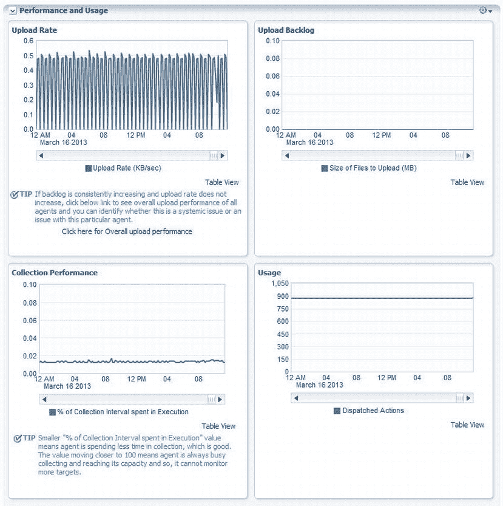

图 3-6. 来自代理主页的性能和使用情况区域


**资源消耗区域**：此区域显示代理的 CPU 和 Java 堆使用情况，如图 3-7 所示。同样，这通常不应成为问题，但如果在此处发现异常，拥有此信息会很有用。

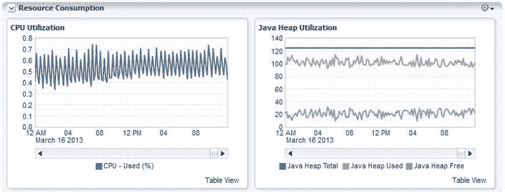

图 3-7。代理主页的“资源消耗”区域

**事件区域**：此区域显示为代理记录的事件列表。（事件管理在第 12 章中有更详细的介绍，此处不再赘述。）

代理主页上另一个值得关注的区域是代理菜单，如图 3-8 所示。其中，最值得深入查看的选择如下：

*   **Monitoring**：显示指标、指标设置、指标收集错误、状态和警报历史记录以及中断的详细信息，并提供对事件管理器控制台的访问。
*   **Diagnostics**：链接到支持工作台，以便您打包最近的问题或事件的详细信息，用于上传到 My Oracle Support。
*   **Control**：提供关闭或重启代理，或结束中断的相关链接。

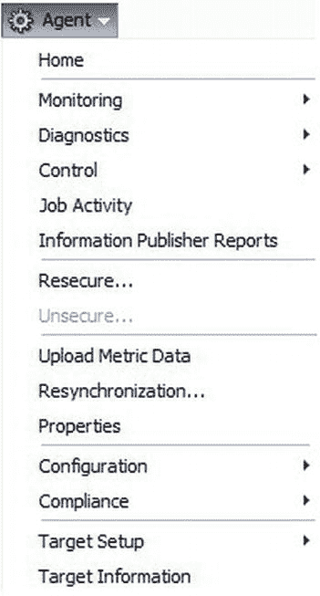

图 3-8。代理主页上的代理菜单

### 使用 EM 代理浏览器

EM 代理浏览器是另一个图形用户界面（GUI），在几个版本前开发，用于在构建 OMS 时访问代理。它在 10g 和 11g 版本中默认禁用，但在 12c 中似乎又恢复可用。未来是否保持如此尚不可知。然而，如果您的代理卡在“挂起”状态（尽管也可以通过控制台清除），或者某些指标未被收集，它可能对您非常有用。

要访问代理浏览器，您需要使用类似 `https://<agent_host_name>:<agent_port_number>/emd/browser/main` 的 URL（例如，`https://em12c.acme.com:3872/emd/browser`）。然后，系统会提示您输入用户 ID 和密码，可以是代理所有者的，也可以是 root 用户的（在 Unix 环境中）。这将打开一个类似图 3-9 所示的屏幕。

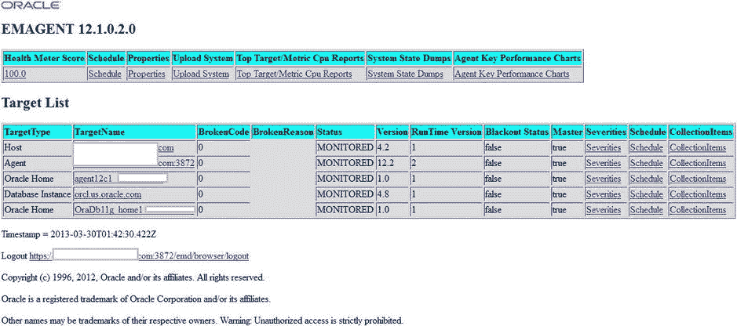

图 3-9。代理浏览器

即将介绍的“EMCTL 实用程序”一节中描述的许多 `emctl` 命令也可通过此浏览器界面获得。其中更有趣的一个是获取代理系统状态转储的命令，这对于调试问题代理的状态特别有用。要执行系统状态转储，只需单击链接“System State Dumps”（如图 3-9 所示），然后在打开的窗口中单击“Perform System Dump”。请注意，生成此文件可能需要一些时间，并且会生成一个相当大的 XML 文件，由于篇幅原因，此处不作展示。

## 使用命令行进行代理管理

当然，您刚才看到的所有区域也可以从命令行访问。Enterprise Manager 有两个命令行界面：EMCTL 和 EMCLI。让我们依次看看。

### EMCTL 实用程序

Enterprise Manager Control 实用程序（EMCTL）主要用于——不出所料！——控制 EM 基础架构的不同部分。由于本节是关于管理代理的，因此这里仅讨论与代理一起使用的函数。您需要确保使用的是代理主页中的 `emctl` 来执行这些命令。可以使用 `emctl getemhome` 来验证这一点，因为很容易混淆正在使用的是哪个 `emctl`！

许多 `emctl` 命令与之前的版本相比没有变化。为了完整起见，表 3-1 列出了管理代理中更常用的 `emctl` 命令。

表 3-1。emctl 命令

| 命令 | 描述 |
| --- | --- |
| `emctl clearstate` | 清除状态目录内容。位于 `$ORACLE_HOME/sysman/emd/state` 下的文件将被此命令删除。 |
| `emctl clearsudoprops` | 清除代理的 sudo 属性。 |
| `emctl config [agent] listtargets [<EM loc>]` | 列出 `targets.xml` 中存在的所有目标。 |
| `emctl config agent getSupportedTZ` | 显示基于环境设置的受支持时区。 |
| `emctl config agent getTZ` | 显示环境中设置的当前时区。 |
| `emctl control agent runCollection <target_name>:<target_type> <metric_name>` | 手动运行特定目标的特定指标的收集。 |
| `emctl deploy agent [-s <install-password>] [-o <omshostname:consoleSrvPort>] [-S] <deploy-dir> <deploy-hostname>:<port> <source-hostname>` | 仅创建并部署代理。 |
| `emctl dumpstate agent <component> . . .` | 为代理生成转储，允许您分析代理的 CPU 或内存问题。 |
| `emctl gensudoprops` | 生成代理的 sudo 属性。 |
| `emctl getemhome` | 打印代理主目录。 |
| `emctl getversion agent` | 打印代理的版本。 |
| `emctl listplugins agent` | 列出在代理上部署的插件、它们的版本和安装目录。 |
| `emctl pingOMS [agent]` | 向 OMS 发送 ping 以检查代理是否能够到达 OMS，并等待 OMS 的反向 ping，以便代理声明 `pingOMS` 成功。 |
| `emctl reload agent dynamicproperties [<Target_name>:<Target_Type>]...` | 为指定目标重新计算和生成动态属性。 |
| `emctl resetTZ agent` | 重置代理的时区。您需要执行以下步骤：<br>1. 首先停止代理。<br>2. 运行此命令将当前时区更改为不同的时区。<br>3. 重启代理。 |
| `emctl secure agent [registration password]` | 使代理对 OMS 安全。这将提示输入注册密码。 |
| `emctl start agent` | 启动管理代理。 |
| `emctl start blackout <Blackoutname> [-nodeLevel] [<Target_name>[:<Target_Type>]].... [-d <Duration>]` | 在目标上启动中断。 |
| `emctl status agent` | 显示代理的状态。 |
| `emctl status agent cpu [-depth n &#124; -full_cpu_report]` | 提供 CPU 统计信息（使用 `depth` 的 top-n 列表或完整详细信息）。需要在 `emd.properties` 中设置 `topMetricReporter=true`。 |
| `emctl status agent dbconnections` | 显示 DBConnection Cache 的内容。 |
| `emctl status agent jobs` | 显示当前正在运行的作业的状态。 |
| `emctl status agent mcache <target name>,<target type>,<metric>` | 显示在指标缓存中具有值的指标名称。 |
| `emctl status agent scheduler` | 显示所有已调度、准备就绪或正在运行的收集线程。 |
| `emctl status agent -secure` | 显示代理是否在安全模式下运行，以及它所报告的 OMS 的安全性。 |
| `emctl status agent target <target name>,<target type>,<metric>` | 按目标名称、目标类型的顺序显示特定目标的详细状态。 |
| `emctl status blackout [<Target_name>[:<Target_Type>]]....` | 提供目标中断的状态。 |
| `emctl stop agent` | 停止管理代理。 |
| `emctl stop blackout <Blackoutname>` | 停止在特定目标上启动的中断。只有通过 EMCTL 工具启动的中断才能使用 EMCTL 停止。 |
| `emctl unsecure agent` | 取消代理的安全状态。通常，这不是推荐做法。 |
| `emctl verifykey` | 通过发送 `pingOMS` 来验证 OMS 和代理之间的通信。 |


当你运行一个 `emctl` 命令时，该命令的输出会被记录到 `emctl.log` 文件中，该文件位于 `$AGENT_HOME/agent_inst/sysman/log` 目录下。（有些命令也会将其输出显示到 `stdout`。）关于代理日志和跟踪文件的更多细节将在后续一个巧妙命名为“代理日志和跟踪文件”的章节中给出。

## EMCLI 实用程序

不过，在更详细地查看代理日志和跟踪文件之前，让我们先审视一下另一个用于管理代理的命令行实用程序——企业管理器命令行界面实用程序 (`EMCLI`)。`EMCLI` 实用程序主要用于自动化需要针对大量目标执行的命令，因为通过脚本实现这一点通常比通过 EM 控制台逐个选择目标来处理操作要快得多。

举个例子，假设你有一个名为 `ProdDB` 的生产数据库组，该组由即将离职的管理员管理。如果该组中有 500 个数据库，你肯定不希望逐个更新 `联系人` 生命周期属性。相反，你可以执行以下操作：

```
emcli set_target_property_value -property_records="ProdDB:composite:Contact:psharman" -propagate_to_members
```

这会将联系人详细信息一次性更改为 `psharman` 用户 ID，适用于全部 500 个数据库。

然而，使用 `EMCLI` 相对于 `EMCTL` 的一个主要优势在于，`EMCLI` 拥有一个客户端，可以安装在任何能够访问 `OMS` 的系统上。这意味着它可以在你的管理环境中的任何地方执行。例如，许多 Cloud Control 管理员会在他们的本地机器上安装 `EMCLI`。`EMCLI` 还允许你调用自定义脚本，如 TCL、Perl、SQL 或操作系统脚本。

从架构角度来看，`EMCLI` 由两部分组成。一部分是 `EMCLI` 客户端（即你安装在所需位置的部分），另一部分是 `OMS` 扩展，它会自动安装在 `OMS` 中。基于 Java 的客户端使用 `emcli` 动词向 `OMS` 扩展发送命令请求，`OMS` 扩展再将这些请求传递给 `OMS` 以执行。这些动词是插件扩展，包含了相关的命令和选项。

安装 `EM CLI` 客户端首先需要将 `EMCLI` 套件下载到你想要安装的位置。你可以通过从 EM 控制台的 `Setup`（设置）菜单中选择 `Command Line Interface`（命令行界面）来下载该套件，如图 3-10 所示。

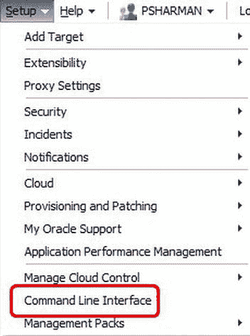

图 3-10. 访问 EM CLI 套件

一旦你下载并安装了 `EM CLI` 套件，你只能访问少数几个基本动词，例如 `help`、`login`、`logout` 和 `setup`。要完全设置客户端，你需要执行命令 `emcli setup`。至少，你需要传递 EM 控制台的 URL 以及你想要用于 `emcli` 登录的用户名（这个用户名通常是你登录控制台使用的用户名），但我发现有时包含 `-autologin` 参数很有用。此参数可确保在你的会话超时后自动重新登录。

`注意` 仅在你安装客户端的工作站是安全的情况下才使用 `-autologin` 参数，特别是如果你同时传递的用户名具有超级管理员级别的访问权限。

例如，以下是在本地工作站上执行以完成设置的命令：

```
$ ./emcli setup -url=https://em12.acme.com/em -username=psharman -autologin
```

命令完成后，你将可以访问 `EMCLI` 能识别的所有动词。动词数量太多，无法在此一一描述，但执行命令 `emcli help` 会为你列出它们。它提供的列表相当长，因此你可能需要将输出重定向到文件以便查阅。你可以通过将特定动词作为参数传递给 `help` 命令来获取关于该动词的详细帮助。例如，`emcli help setup` 会为你提供关于 `setup` 动词的更详细帮助。在 `EM12c` 文档集中也提供了关于 `EMCLI` 实用程序的完整手册（[`docs.oracle.com/cd/E24628_01/em.121/e17786/toc.htm`](http://docs.oracle.com/cd/E24628_01/em.121/e17786/toc.htm)）。

### 代理日志和跟踪文件

当你安装管理代理时，系统会提示你指定一个 `AGENT_BASE` 目录。该目录类似于数据库安装中使用的 `ORACLE_BASE` 目录。在其下方，你会找到代理实例目录（`agent_inst`，包含所有与代理相关的配置文件）以及管理代理主目录。管理代理主目录将是 `<AGENT_BASE>/core/12.1.0.2.0`。显然，目录名中的版本号反映了代理的版本号，因此根据你的安装情况，此数字可能与示例有所不同。你将需要的大多数代理日志和跟踪文件都位于此管理代理主目录下的某个地方。你可能需要查看以查找信息的一些目录如表 3-2 所示。在此表中，`<AGENT_HOME>` 指的是管理代理主目录（例如，`<AGENT_BASE>/core/12.1.0.2.0`），而 `<AGENT_INST>` 指的是代理实例目录（例如，`<AGENT_BASE>/agent_inst`）。

表 3-2. 代理日志和跟踪文件的位置

| 信息类型 | 位置 |
| --- | --- |
| 代理心跳历史 | `<AGENT_INST>/sysman/log/gcagent.log` |
| 代理和看门狗的启动信息 | `<AGENT_INST>/sysman/log/emagent.nohup` |
| 代理跟踪文件 | `<AGENT_INST>/sysman/log/*.trc` |
| 配置助手错误 | `<AGENT_HOME>/cfgtoollogs/cfgfw/CfmLogger_<timestamp>.log` |
| `emctl` 命令输出 | `<AGENT_INST>/sysman/log/emctl.log` |
| 代理安全设置错误 | `<AGENT_INST>/sysman/log/secure.log` |
| 系统状态转储 | `<AGENT_INST>/sysman/emd/dumps/SystemDump_<number>.xml` |

`注意` 表 3-2 中提到的看门狗是代理看门狗。启动代理时，它也会启动一个代理看门狗进程，其作用是监控代理并在代理失败时尝试重启它。

你可以使用 `emctl` 命令来控制这些文件的数量和大小。默认情况下，代理只将信息、警告和关键消息写入跟踪文件，但你可以使用以下命令更改写入的信息级别：

```
$ emctl set property agent -name "Logger.log.level" -value "<LEVEL>"
```

其中 `<LEVEL>` 是以下值之一——`DEBUG`、`INFO`、`WARN`、`ERROR` 或 `FATAL`。由于这可能产生大量信息，你可以通过为 `-name` 设置不同的值来限制。但是，最好仅在 Oracle 支持人员的指导下进行此操作，因此如果需要，请联系他们。

## Oracle 管理服务

现在让我们继续讨论 Oracle 管理服务 (`OMS`)。如第 1 章所述，`OMS` 是一个基于 Web 的应用程序，它与代理和 Oracle 管理资料库通信，以收集和存储有关各个代理上所有目标的信息。`OMS` 还负责呈现控制台的用户界面。与代理一样，`OMS` 可以通过 `EM12c` 控制台和命令行实用程序进行控制。让我们首先更详细地了解控制台。

### 使用控制台管理 OMS


要通过控制台管理 OMS，您可以选择 `设置 > 管理云控制 > 管理服务`，如图 3-11 所示。

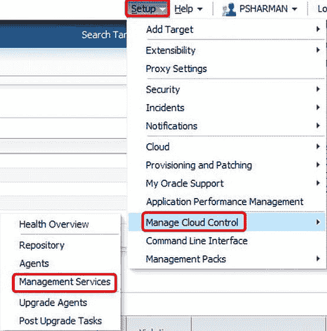

图 3-11. 从 EM12c 控制台访问 OMS

这将带您进入`管理服务`主页，如图 3-12 所示。

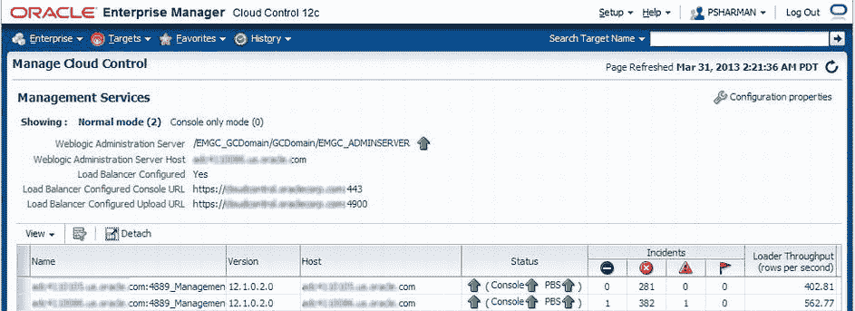

图 3-12. 管理服务主页

在这个特定环境中，我们设置了两个 OMS，由一个负载均衡器控制到每个 OMS 的连接。实际上屏幕右侧还有更多输出内容（`CPU 使用率`、`堆使用率`和`WebLogic Server`），但已裁剪以便于页面显示。

通过点击右上角的`配置属性`，您可以根据需要设置属性来更改 OMS 的运行时行为。默认设置显示所有非默认属性，但您可以通过点击图 3-13 中高亮显示框右侧的下拉箭头，在`管理服务器实例`处将其更改为`全部`或`非默认值`。

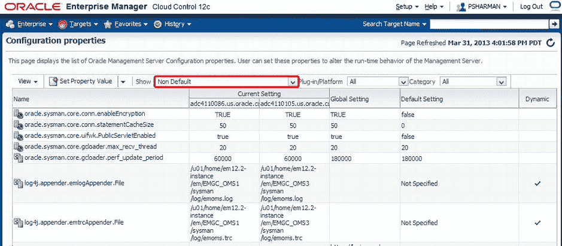

图 3-13. OMS 的配置属性

您也可以点击属性名称进行更改。例如，如果您想在代理（或代理组）与 OMS 之间设置跟踪以诊断它们之间的问题，可以点击属性 `oracle.sysman.core.gcloader.trace_agent`，并根据需要更改设置，如图 3-14 所示。根据属性的不同，您可以全局（针对所有 OMS）设置此值，或针对单个 OMS 进行设置。如果您有多个 OMS，并且问题仅出现在其中一个上，这将特别有用。另请注意（如图 3-14 中所突出显示），您可以查看此属性的更改历史记录，包括先前更改的日期、旧值和新值以及更改者。

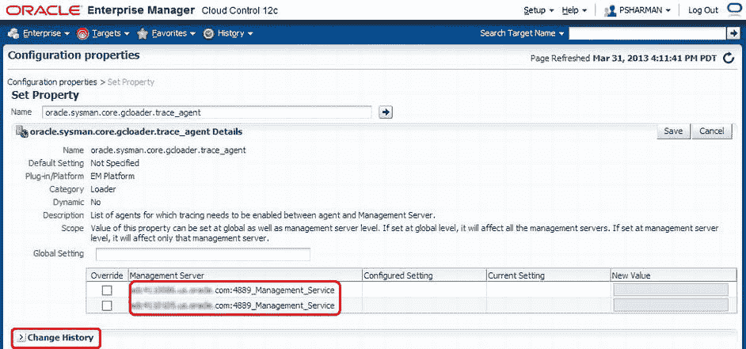

图 3-14. 更改 OMS 的属性值

您可以通过点击其名称进入 OMS 主页来查看每个 OMS 的更多详细信息。图 3-15 展示了一个配置示例，其中有两个 OMS，前面有一个负载均衡器。OMS 主页有几个区域。最重要的两个是`摘要`区域（显示状态、可用性百分比等）和`事件和问题`区域（显示此 OMS 特定的事件和问题列表）。事件管理将在第 12 章中更详细地介绍。

页面另一个值得关注的部分是左上角的`Oracle Management Service`。这些选项中有许多与代理主页上的类似，因此这里不再赘述。

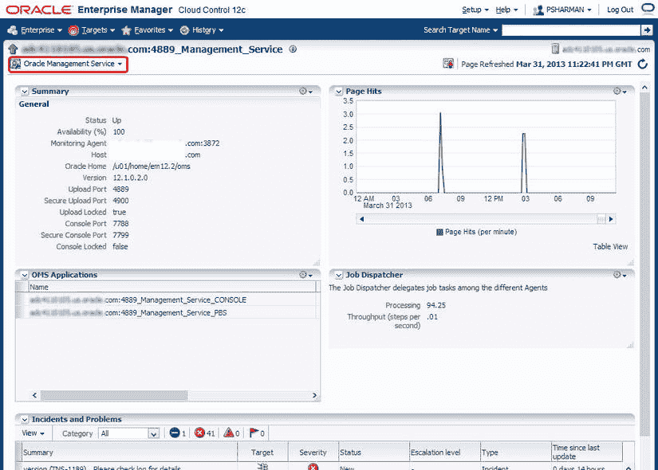

图 3-15. OMS 主页

所以现在您可能想知道所有的 `start`、`stop` 和 `status` 命令在哪里可用。这些命令会导致控制台不可用，因为 OMS 还负责呈现用户界面。因此，这些命令通过我们的老朋友 `EMCTL` 来执行，您很快就会在 OMS 的上下文中看到它。然而，在此之前，您还需要了解 OMS GUI 的另一个部分：`运行状况概览`页面，如图 3-16 所示。此页面提供 OMS 和存储库操作及性能的概览。通过选择`设置 > 管理云控制 > 运行状况概览`来访问。

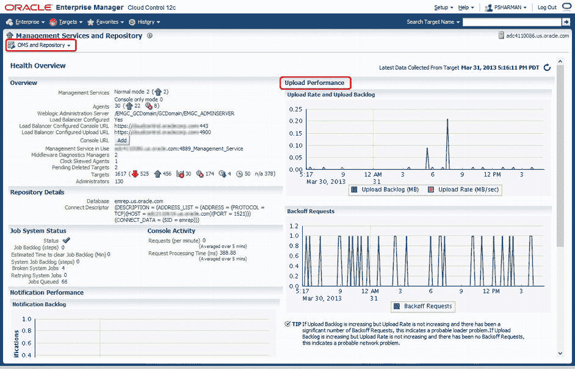

图 3-16. 运行状况概览页面

`运行状况概览`页面也有几个有用的区域。对于托管环境的快速概览，`概览`区域非常有用，特别是用于确定所有受监视目标的数量和状态。然而，最有趣的部分是`上传性能`区域，在那里您可以识别可能的加载器问题和网络问题。同样值得关注的是`OMS 和存储库`菜单。这与 OMS 和代理主页上的等效菜单内容相似，但有几个其他页面上没有的选项。从 OMS 的角度来看最相关的是`添加管理服务`链接（其他选项将在本章的存储库等效部分介绍），它会启动`部署过程管理器`以向您现有系统添加额外的 OMS。

### 通过命令行管理 OMS

让我们从讨论命令行管理 OMS *不再* 提供的功能开始本节，那就是 `OPMNCTL` 实用程序。虽然该实用程序仍然存在，但它已被 `EMCTL` 实用程序取代。所以让我们更详细地看看它。

## EMCTL 实用程序

`EMCTL` 实用程序用于对 OMS 执行许多操作，类似于它用于代理的方式。话虽如此，有许多 `emctl` 命令在您从 OMS 主目录通过 `emctl` 命令发出时，似乎是对存储库进行操作。这是因为许多存储库信息（凭据、连接性等）也存储在 OMS 中，以使其能够连接到存储库并完成工作，因此这些命令基本上是在两者之间进行同步。

表 3-3 列出了一些从 OMS 主目录常用的 `emctl` 命令。

表 3-3. OMS emctl 命令


## EMCTL 命令参考

| 命令 | 描述 |
| --- | --- |
| `emctl abortresync repos (-full|-agentlist "agent names") -name "resync name" [-sysman_pwd "sysman password"]` | 中止当前正在运行的存储库重新同步操作。使用 `-full` 选项可停止完整的存储库重新同步。使用 `-agentlist` 选项可停止对指定代理列表的重新同步。 |
| `emctl config oms -change_repos_pwd [-change_in_db] [-old_pwd ] [-new_pwd ] [-use_sys_pwd [-sys_pwd ]]` | 更改存储库密码。 |
| `emctl config oms -change_view_user_pwd [-sysman_pwd ] [-user_pwd] [-auto_generate]` | 更改 `MGMT_VIEW` 用户的密码。`-auto_generate` 可生成随机密码。 |
| `emctl config oms -list_repos_details` | 显示 OMS 中的存储库详细信息。 |
| `emctl config oms -store_repos_details (-repos_host -repos_port -repos_sid | -repos_conndesc ) -repos_user [-repos_pwd ] [-no_check_db]` | 在 OMS 中更改并存储存储库信息。 |
| `emctl delete property [-sysman_pwd "sysman password"] -name` | 从 `emoms.properties` 文件中删除给定属性名称对应的属性。 |
| `emctl dump oms` | 转储所有节点管理器日志、管理服务器日志、托管服务器日志、sysman 日志和堆栈跟踪文件。 |
| `emctl dump omsthread` | 转储导致 CPU 旋转（自旋）的线程。 |
| `emctl exportconfig oms [-sysman_pwd ] [-dir ] [-keep_host]` | 从主管理服务导出配置。 |
| `emctl get property [-sysman_pwd "sysman password"] -name` | 从 `emoms.properties` 文件中获取给定属性名称对应的属性值。 |
| `emctl importconfig oms -file` | 在备用管理服务上导入已导出的配置。 |
| `emctl list oms` | 提供在该本地 Oracle 主目录中配置的 OMS 名称。 |
| `emctl list properties [-sysman_pwd "sysman password"] [-module]` | 列出从 `emoms.properties` 文件设置的所有属性。 |
| `emctl resync repos -full -name "<resync name>"` | 从一个 OMS Oracle 主目录启动存储库重新同步。 |
| `emctl secure lock [-upload] [-console]` | 限制对管理服务的 HTTP 访问（即，仅允许 HTTP/S 访问）。 |
| `emctl secure oms [-sysman_pwd ] [-reg_pwd ] [-host ] [-slb_port ] [-slb_console_port ] [-reset] [-console] [-lock] [-lock_console] [-secure_port ] [-upload_http_port ] [-root_dc ] [-root_country] [-root_email ] [-root_state ] [-root_loc] [-root_org ] [-root_unit ] [-wallet -trust_certs_loc ] [-wallet_pwd ] [-key_strength ] [-cert_validity ] [-protocol ]` | 启用 OMS 以接受来自代理的上传请求和以 HTTP/S 模式的控制台请求。 |
| `emctl secure setpwd [authpasswd] [newpasswd]` | 创建新的代理注册密码。 |
| `emctl secure unlock [-upload] [-console]` | 允许对 OMS 进行非安全的 HTTP 访问。 |
| `emctl set property [-sysman_pwd "sysman password"] -name -value[-module (default emoms)]` | 在 `emoms.properties` 文件中设置属性值。 |
| `emctl start oms` | 按以下顺序启动 OMS：1\. 如果 OPMN 和 OHS 尚未启动，则启动它们。2\. 如果节点管理器未运行，则启动它。3\. 如果在管理服务器上运行，则启动它（如果尚未启动）。4\. 通过节点管理器启动托管服务器。 |
| `emctl status oms` | 提供 OMS 的状态。使用 `-details` 获取详细信息（包括安全状态和使用的协议）。 |
| `emctl statusresync repos -name "resync name"` | 列出给定存储库重新同步操作的状态。 |
| `emctl stop oms [-all] [-force]` | 按以下顺序停止 OMS：1\. 停止 OHS。2\. 停止 OPMN。3\. 停止托管服务器。使用 `-all` 按以下顺序停止 OMS：1. 停止 OHS。2\. 停止 OPMN。3\. 停止托管服务器。4\. 如果管理服务器正在运行，则停止它。5\. 停止节点管理器。如果任一停止命令未能关闭相关进程，请使用 `-force` 强制停止它们。 |

### OMS 目录结构

OMS 被安装到一个 Oracle 中间件主目录中，该目录可能还包含 Oracle WebLogic Server（包括 WebLogic Server 管理控制台）、用于中间件层的 Oracle 管理代理、管理服务实例基目录、Java 开发工具包 (JDK) 和其他配置文件。根据您在安装时的决定，其中一些目录可能位于中间件主目录之外。您需要熟悉重要的目录，以便配置、维护和故障排除 OMS。可能以图表方式查看最为容易，因此请从查看 图 3-17 开始，它展示了示例环境中的默认中间件主目录结构。

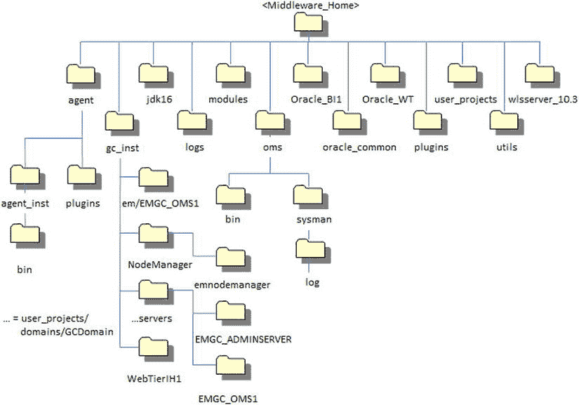

图 3-17. OMS 目录结构

表 3-4 解释了这些目录各自的用途。

表 3-4. OMS 中间件主目录及其用途

| 目录 | 描述 |
| --- | --- |
| `agent` | 包含代理代码和配置文件 |
| `agent/agent_inst` | `<AGENT_HOME>` 目录 |
| `agent/agent_inst/bin` | 包含在 OMS 上运行的代理的可执行代码 |
| `agent/plugins` | 包含在代理上安装的元数据插件的配置数据 |
| `gc_inst` | `OMS_INSTANCE_HOME` 的默认位置 |
| `gc_inst/em/EMGC_OMS1` | `EM_INSTANCE_HOME` 的默认位置 |
| `gc_inst/NodeManager` | 包含 EM 特定的 NodeManager 目录 |
| `gc_inst/NodeManager/emnodemanager` | EM 特定的 NodeManager 安装位置 |
| `gc_inst/...servers` | WebLogic 域主目录的默认位置 |
| `gc_inst/...servers/EMGC_ADMINSERVER` | 与 EMGC_ADMINSERVER 托管服务器相关的 WLS 域文件的位置 |
| `gc_inst/...servers/EMGC_OMS1` | 与 EMGC_OMS1 托管服务器相关的 WLS 域文件的位置 |
| `gc_inst/WebTierIH1` | 中间件 WebTier 实例主目录 |
| `jdk16` | 包含 JDK 配置文件 |
| `logs` | 包含 Fusion Middleware 文件 |
| `modules` | 包含 Fusion Middleware 文件 |
| `oms` | 包含 OMS 代码和配置文件 |
| `oms/bin` | 包含 OMS 二进制文件 |
| `oms/sysman` | 包含各种实用程序，如 `RepManager` |
| `oms/sysman/log` | 包含与 OMS 相关的日志文件，包括 `component_info.log` |
| `Oracle_BI1 [optional]` | 如果安装了 BI Publisher，则包含 Oracle Business Intelligence Publisher 配置文件 |
| `oracle_common` | 包含 OMS、Oracle WebTier 和 WebLogic Server 使用的公共文件 |
| `Oracle_WT` | 包含 Oracle WebTier 配置文件 |
| `plugins` | 包含在 OMS 上安装的元数据插件的配置文件 |
| `user_projects` | 包含 Fusion Middleware 文件 |
| `utils` | 包含 Fusion Middleware 文件 |
| `wlserver_10.3` | 包含 Fusion Middleware 文件 |

### OMS 日志与跟踪文件

有六个主要的日志和跟踪文件用于对 OMS 问题进行故障排除。这些文件位于 OMS 实例基目录（表 3-4 中的 `gc_inst`）下。这些文件如下：

*   `emctl.log` 包含来自 `emctl` 命令的输出。
*   `emctl.msg` 在 OMS 因严重错误重新启动时生成。
*   `emoms.log` 是控制台的日志文件，包含 OMS 执行操作（如启动或停止）或生成错误时创建的信息。
*   `emoms.trc` 包含更详细的跟踪信息，以支持故障排除错误。
*   `emoms_pbs.log` 包含后台模块（如事件和作业系统）的错误或警告。
*   `emoms_pbs.trc` 包含更详细的跟踪信息，以对后台模块的问题进行故障排除。


如你所料，这些文件的大小可能会随时间快速增加。幸运的是，在 OMS 将信息滚动写入新文件之前，这些文件有一个预定义的最大值。文件的旧版本会被 EM 在文件名中添加一个数字来标识。例如，在我的环境中，我可以在日志目录下看到以下文件：

```
[oracle@server log] ls -al
total 101600
drwxr----- 2 oracle oinstall    4096 Mar 30 22:38 .
drwxr-xr-x 6 oracle oinstall    4096 Sep 19  2012 ..
-rw-r----- 1 oracle oinstall 5242789 Mar 18 01:08 emoms-156.log
-rw-r----- 1 oracle oinstall 5242789 Mar 18 01:08 emoms-156.trc
-rw-r----- 1 oracle oinstall 5241643 Mar 19 16:15 emoms-157.log
-rw-r----- 1 oracle oinstall 5241643 Mar 19 16:15 emoms-157.trc
-rw-r----- 1 oracle oinstall 5242832 Mar 21 08:27 emoms-158.log
-rw-r----- 1 oracle oinstall 5242832 Mar 21 08:27 emoms-158.trc
-rw-r----- 1 oracle oinstall 5241829 Mar 22 14:52 emoms-159.log
-rw-r----- 1 oracle oinstall 5241829 Mar 22 14:52 emoms-159.trc
-rw-r----- 1 oracle oinstall 5242518 Mar 24 13:55 emoms-160.log
-rw-r----- 1 oracle oinstall 5242518 Mar 24 13:55 emoms-160.trc
-rw-r----- 1 oracle oinstall 5236550 Mar 26 06:45 emoms-161.log
-rw-r----- 1 oracle oinstall 5236550 Mar 26 06:45 emoms-161.trc
-rw-r----- 1 oracle oinstall 5242710 Mar 28 01:34 emoms-162.log
-rw-r----- 1 oracle oinstall 5242710 Mar 28 01:34 emoms-162.trc
-rw-r----- 1 oracle oinstall 5242442 Mar 28 20:46 emoms-163.log
-rw-r----- 1 oracle oinstall 5242442 Mar 28 20:46 emoms-163.trc
-rw-r----- 1 oracle oinstall 5242752 Mar 30 22:38 emoms-164.log
-rw-r----- 1 oracle oinstall 5242752 Mar 30 22:38 emoms-164.trc
-rw-r----- 1 oracle oinstall 4709623 Apr  1 21:56 emoms.log
-rw-r----- 1 oracle oinstall 4709623 Apr  1 21:56 emoms.trc
```

你可以通过使用`emctl`命令来控制这些文件的数量和大小。具体的命令取决于你想要控制哪个文件。你还可以控制哪些信息写入`emoms.trc`。默认情况下，OMS 只将警告和严重消息写入跟踪文件，但你可以使用以下命令更改写入该文件的信息级别：

```
$ emctl set property -name "log4j.rootCategory" -value "<LEVEL>, emlogAppender, emtrcAppender" -module logging
```

其中`<LEVEL>`是以下值之一——`INFO`、`WARN`、`ERROR`或`DEBUG`。因为这可能会生成大量信息，你可以通过为`-name`设置不同的值来限制。但是，最好只在 Oracle 支持人员的指导下进行此操作，因此如有需要，请联系他们。

## Oracle Management Repository

现在，我们继续讨论 Oracle Management Repository。如第 1 章所述，Oracle Management Repository（OMR，或更常称为，存储库）是一个 Oracle 数据库，用于存储由各种管理代理收集的所有信息。它由数据库用户、表空间、表、视图、索引、包、过程和数据库作业组成。与代理和 OMS 一样，存储库可以通过 EM12c 控制台和命令行实用程序进行控制。让我们从更详细地查看控制台开始。

### 使用控制台管理存储库

要从控制台管理存储库，请选择**设置 → 管理云控制 → 存储库**，如图 3-18 所示。

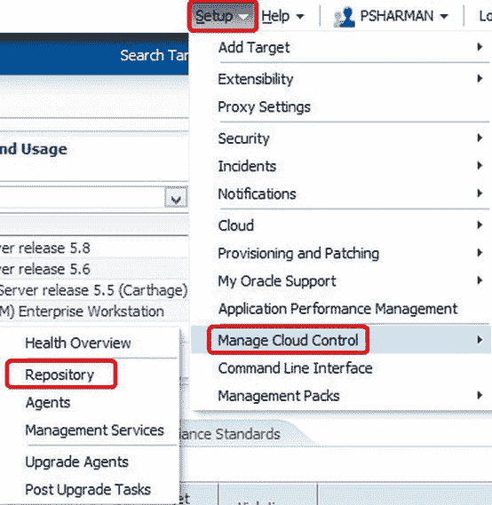

图 3-18. 访问存储库主页

这将带你到存储库主页，如图 3-19 所示。（请注意，页面标题仍然是“管理服务和存储库”，与访问 OMS 主页时相同，但显示的区域都适用于存储库。）。请注意，在此图中，已在“存储库详细信息”区域中单击了“详细信息”链接，以显示所有访问存储库的会话。

在这个页面上你能做的事情真的不多；它更多地用于快速浏览并确保一切正常。这里通常需要检查的一些事项包括：

*   是否还有可用空间？检查“已用空间”栏会很快告诉你答案。
*   存储库收集的积压是否在增加？这不是一个常见问题。它可能偶尔会激增，如你在图 3-19 的示例中所见，但一般来说，这不是问题。
*   Oracle Scheduler 状态是否正常？这里的绿色箭头通常就足够了，但如果有问题，你可以查看“存储库调度程序作业状态”区域以获取更详细的粒度信息。
*   管理服务 AQ 状态是否正常？同样，检查箭头是否为绿色通常就足够了。如果不是，你可以展开该区域以获取更多详细信息。

从屏幕左上角的“OMS 和存储库”下拉菜单中，有几个特定于存储库的选项。其中一个就叫做“存储库”，它只是显示图 3-19 中看到的页面（所以它真的只有在你一直在查看具有相同菜单的 OMS 主页时才有用）。

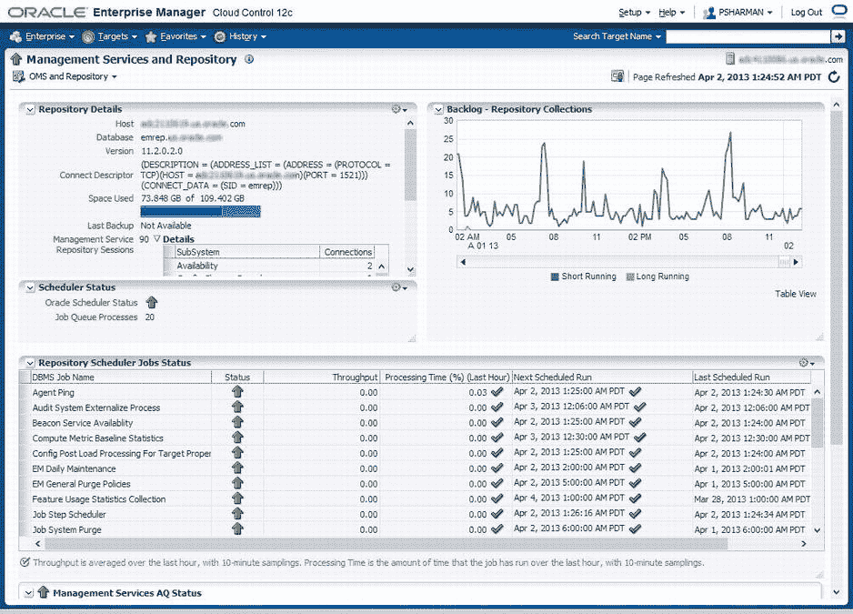

图 3-19. 存储库主页

另一个可能有用的选项是“存储库同步”，它会打开如图 3-20 所示的页面。希望你不需要经常使用它。它基本上用于在存储库从备份恢复后，监控代理和存储库之间的重新同步操作（通过`emctl resync repos -full`命令启动）。你无法从这里启动命令，因为发出命令时需要关闭 OMS（记住，OMS 呈现控制台用户界面，所以那时你无法访问此页面）。然而，一旦命令执行，你可以重新启动 OMS 并从此屏幕监控重新同步的进度。

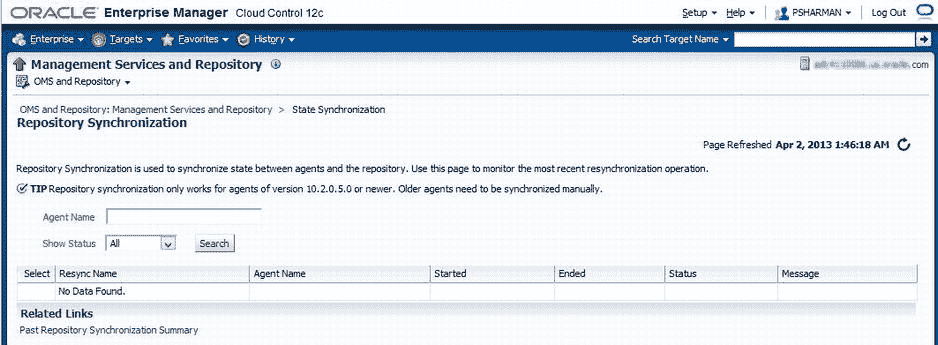

图 3-20. 存储库同步页面

还有另外两个位置可以从控制台查看有关存储库的信息。一个是之前讨论过的“运行状况概述”页面，其中包含有关存储库的部分。那里的信息并没有比你已经在存储库主页上看到的添加更多细节，所以我们现在先忽略它。另一个选项，当然，就是简单地将存储库作为数据库目标深入查看。如果你知道存储库数据库的名称，你只需将其键入屏幕右上角的“搜索目标名称”字段中。或者，你可以简单地单击**目标 → 数据库**，然后单击数据库名称。这将带你到标准的“数据库”主页，如图 3-21 所示。这些功能中的大多数，即使用户界面不熟悉，你可能也已经从之前的版本中熟悉了。（顺便说一句，以防你注意到这些截图中存储库似乎缺乏备份，这是一个运行在`NOARCHIVELOG`模式下的相当临时的系统，所以我只是在必要时通过`tar`进行冷备份。）

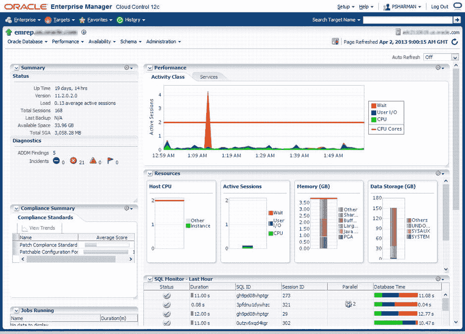

图 3-21. 存储库的数据库主页

### 使用命令行管理存储库


