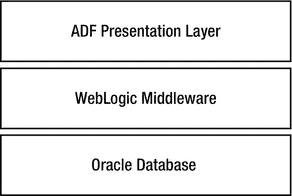
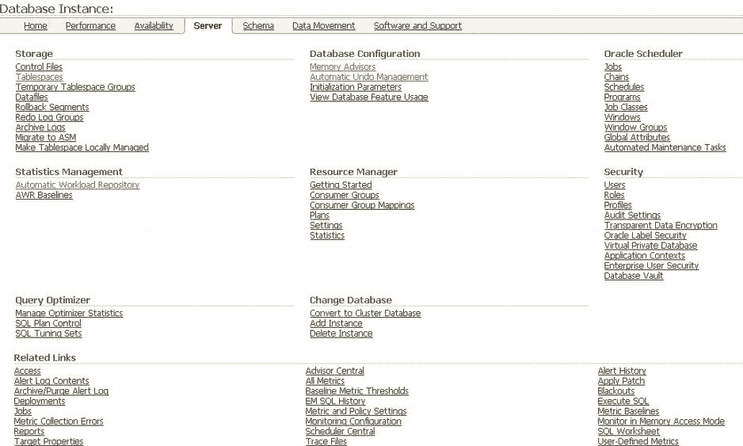
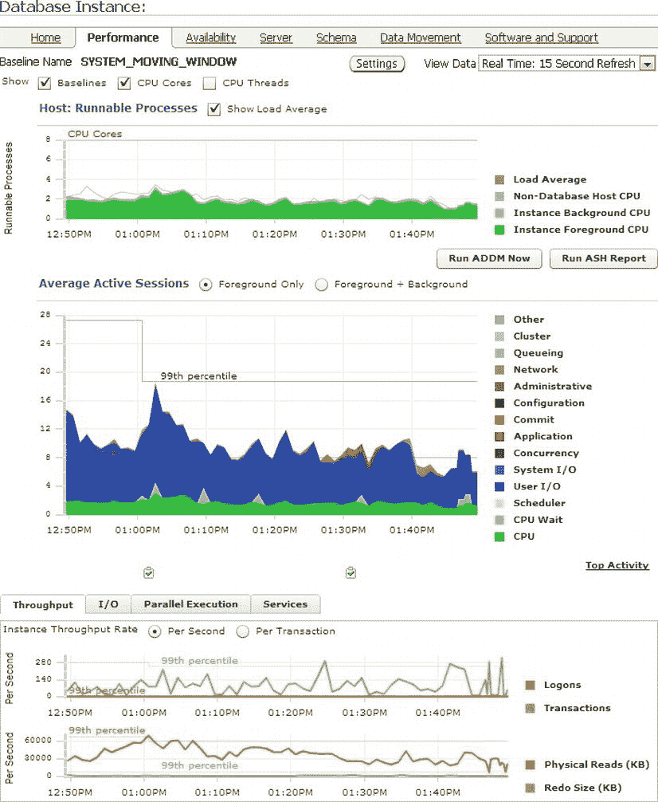
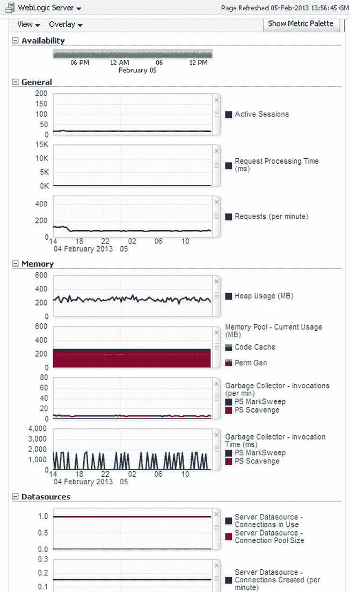

# Oracle Enterprise Manager 存储库命令行管理

## 介绍

在之前的章节中，你已经看到，从命令行对 `OMS` 和 `agent` 进行管理，主要使用 `EMCTL` 和 `EMCLI` 实用程序。从命令行对 `repository` 的管理则有所不同。它实际上就是另一个 `Oracle` 数据库（尽管是一个有特殊用途的数据库），因此 `repository` 管理的命令行界面是 `DBA` 的老朋友——`SQL*Plus`。由于本书并非针对 `DBA 101` 级别的技能，本节不会带你完成启动或停止 `repository` 的过程。你唯一需要注意的是以下几点：

*   在停止并重启 `repository` 数据库之前，你应该先停止 `OMS`（使用 `emctl stop oms` 命令）。
*   在启动 `repository` 数据库之前，你也应该确保监听器已启动。

话虽如此，你确实需要了解一些可以在 `SQL*Plus` 中为 `repository` 管理的其他领域，特别是围绕空间消耗和性能考量方面。在本节中，你将了解以下内容：

*   数据保留
*   队列管理
*   优化器统计信息
*   `repository` 视图

## 数据保留

`Enterprise Manager` 收集大量数据。默认情况下，这些数据在以下生命周期中进行处理和聚合：

*   由管理 `agent` 根据你定义的收集策略上传的原始度量数据，将保留 `7` 天。
*   `7` 天后，仅保留每小时的汇总数据（度量的最大值、最小值和平均值）。
*   这些数据默认保留 `31` 天，之后仅保留每日汇总数据。
*   最后，每日汇总数据保留 `12` 个月。

你可能希望审查这些策略。特别是，目标管理员执行的一项常见任务是与上一个业务周期进行性能比较。因此，你很可能希望原始度量数据的保留时间超过 `7` 天，以便深入分析更细粒度的数据。同样，你可能希望每小时数据的保留时间超过一个月，以便能够（例如）比较月度终数据。最后，许多组织选择将每日数据保留多年。

 `注意` `Enterprise Manager` 在 `repository` 数据库中使用分区来维护度量和其他数据。就许可而言，这通常是一项附加功能，但只要你仅将分区选项用于 `Enterprise Manager` 基表，你就不需要额外付费。请**不要**在没有分区的情况下重新链接 `Oracle`，因为我曾有一位客户因为担心额外的许可成本而这样做了。如果你这样做，将会严重破坏 `repository`！

`Enterprise Manager` 通过删除过期的度量表分区来归档旧数据。因此，可以通过修改要保留的分区数量来设置保留策略。`Enterprise Manager` 提供了一个存储过程来执行此任务。清单 3-1 实现了一个保留策略：详细数据 `10` 天，每小时数据 `40` 天，每日数据 `3` 年。

***清单 3-1***. 修改 `EM` 保留策略

```
BEGIN
        sysman.gc_interval_partition_mgr.set_retention('SYSMAN','EM_METRIC_VALUES',10);
        sysman.gc_interval_partition_mgr.set_retention('SYSMAN','EM_METRIC_VALUES_HOURLY',40);
        sysman.gc_interval_partition_mgr.set_retention('SYSMAN','EM_METRIC_VALUES_DAILY',36);
END;
/
```

 `注意` 表 `EM_INT_PARTITIONED_TABLES` 包含了作为 `repository` 一部分提供的各种 interval 分区表的默认保留时间。

## 队列管理

`Enterprise Manager` 大量使用 `Oracle` 的数据库内队列技术（`Oracle Streams Advanced Queuing`，通常简称为 `AQ`）。该技术可能需要一些细心和维护，以确保性能保持在最佳水平。如果你选择为 `repository` 数据库实施 `Oracle Real Application Clusters` 解决方案，这一点尤其重要。`AQ` 队列使用多种数据库技术实现，包括索引组织表。如果消息出队未高效或完全进行，那么随着时间的推移，底层数据结构可能会显著增长，消息入队和出队时间可能会增加。

`Enterprise Manager` 大量使用队列，特别是用于度量加载和上传以及通知。你可能会发现此区域问题的第一个迹象是出现持续且不断增长的上传积压，或通知延迟。不幸的是，这两种症状也可能有其他原因。

`Oracle Enterprise Manager` 的初始数据库设置并未专门按照 `AQ` 的通用指南配置数据库。特别是，`AQ` 将受益于一个称为 `Streams pool` 的专用内存池。在默认安装中，你可能会发现此池大小未设置，因此 `Advanced Queuing` 只会使用最小的内存分配。我建议你将初始化参数 `STREAMS_POOL_SIZE` 设置为 `100MB` 作为起点（`AQ` 文档建议 `20MB`，但根据我的经验，这对于繁忙的系统来说太小了）。你可以使用清单 3-2 中的查询来监控 `streams pool` 的内存使用情况。

***清单 3-2***. `Streams Pool` 的内存使用情况

```
SELECT name,round(sum(bytes)/1024/1024,1) memory_mb
FROM v$sgastat
WHERE pool = 'streams pool'
GROUP BY name;
```

如果你选择为 `repository` 数据库采用 `RAC` 实施，你可能还希望为队列表配置实例关联性，以最小化实例内块 `ping`。当然，你应该通过 `Oracle Support` 验证对此队列定义的任何此类修改是否受支持。为了执行此任务，你将需要 `AQ_ADMINISTRATOR_ROLE` 角色和在 `SYS.DBMS_AQADM` 包上的执行权限。你可以使用清单 3-3 中的代码分配首选实例。

***清单 3-3***. 更改队列表的实例关联性

```
BEGIN
        SYS.DBMS_AQADM.ALTER_QUEUE_TABLE(
        queue_table => 'SYSMAN.EM_CNTR_QTABLE',
        primary_instance => 1
);
END;
/
```

 `注意` 设置实例关联性仅控制哪个 `QMN` 进程消费消息，并不阻止其他实例使用队列。

### 优化器统计信息

任何 `Oracle` 数据库管理员的核心任务之一是确保优化器拥有关于数据库应用程序访问对象的代表性统计信息，以确定执行计划的成本并据此进行优化。在没有代表性统计信息的情况下，`Oracle` 更有可能选择低效的访问路径。为此，`Oracle` 为 `Enterprise Manager repository` 统计信息维护提供了一个内置的统计信息收集作业。该作业实现了一个统计信息收集策略，比数据库内置的统计信息收集作业更具灵活性。

该作业由 `EM_STATS_MONITOR` 表的内容控制，该表包含 `Enterprise Manager` 使用的表的一个子集，以及要提供给 `DBMS_STATS` 包的偏好值。在此版本中，统计信息收集作业覆盖的唯一偏好是：对象被视为陈旧所需更改行的百分比，以及收集统计信息的粒度。

## 调度任务配置

这个单一的调度任务在逻辑上被组织成两个独立的统计信息收集活动：

*   一个每日运行的任务，确保所有过时的 Enterprise Manager 对象统计信息得到更新
*   第二个每两小时运行的任务，针对 `EM_STATS_MONITOR` 表中最过时的对象进行统计信息收集

每日任务在数据库服务器所在时区的午夜至凌晨 1 点之间运行。第二个任务每 2 小时运行一次，旨在达成以下目标：

*   确保易变表拥有当前的统计信息
*   确保为站点特定需求做出规定

对于每两小时一次的收集，其统计信息收集机制可能过于激进。很少有站点真正需要对存储库表进行每两小时一次的运行。因此，您可能希望修改 `EM_GATHER_SYSMAN_STATS` 计划任务的调度计划，但如果这样做，请确保它仍然在午夜至凌晨 1 点之间执行，以保证隔夜收集仍然发生。

## 存储库视图

归根结底，Enterprise Manager 将其数据存储在一组表中。对这些基表的访问由一组存储库视图提供，这些视图已在《*Oracle Enterprise Manager Cloud Control Extensibility Programmer's Reference*》的第 18 章中记录（可在 [`http://docs.oracle.com/cd/E24628_01/doc.121/e25161/views.htm#sthref1292`](http://docs.oracle.com/cd/E24628_01/doc.121/e25161/views.htm#sthref1292) 在线获取）。请注意，此参考对应的是 `12.1.0.2` 版本的文档。如果您仍在使用 `12.1.0.1`，则需要查看等效文档的第 17 章。

 注意  您可能感兴趣的一些视图记录在可扩展性开发工具包（EDK）中，因此您可能还需要安装该工具包才能查看这些视图的文档。安装方法是：从控制台选择“设置”菜单，选择“可扩展性” “开发工具包”，然后按照那里的说明进行操作。

显然，对于像 Enterprise Manager 这样庞大的产品，同样有大量的视图可供查看，因此这里并未记录全部。重要的是要知道如何查找关于它们的更多信息，而这些都在前面提到的章节中记录了。根据您的需求，您可能还想研究一下 BI Publisher 的使用，它是随 `EM12c` 提供的新报告功能，允许针对 EM 存储库创建高度格式化的自定义报告。（另外，EM 包含一个受限使用许可证，允许 BI Publisher 用于 EM 存储库。用于其他数据源则需要 BI Publisher 许可证。）

 提示  我一直惊讶于了解这些视图的人如此之少，所以请花时间查阅 Oracle 文档并熟悉它们。特别要查看《*Oracle Enterprise Manager Cloud Control Extensibility Programmer's Reference*》第 18 章末尾记录的示例用法。

### 故障排除

还有一个您应该熟悉的实用程序，用于跨技术栈所有三层的故障排除。该工具是 `EMDIAG`。`EMDIAG` 是一组脚本和工具的集合，旨在帮助对 EM 的问题进行故障排除和诊断。每个 EM 层都有一个特定的工具包：`AGTVFY` 用于代理层，`OMSVFY` 用于 OMS 层，`REPVFY` 用于存储库层，每个工具包都通过查找已知问题特征来识别已知问题。Oracle Support 提供了一个 `EMDIAG` 主索引说明（说明 `421053.1`），解释了如何下载、安装和使用每个工具包。请务必下载适用于 `EM12c` 的正确版本。

每个工具包都是一组命令，可用于显示有关相关层的设置、配置和使用的信息，或者转储对象。即使该层本身未运行（或确实已损坏），也可以使用它们。运行这些命令时，您可以像这样传入一个 0 到 9 的级别参数：

```
$ ./agtvfy verify all -level 2 details
```

当命令接受级别作为参数时，您应该从最低值（0）开始，修复该命令报告的问题，然后在下一个最高级别再次运行它。0 到 4 级报告功能问题，6 到 8 级报告报告问题，9 级用于内部诊断。您应仅在 Oracle Support 的指导下在 9 级运行报告。仅举一例，当（例如）运行 `REPVFY` 时，您可以预期在级别 2 和级别 9 之间看到以下类型的差异：

 注意  这是一个特意配置得很糟糕的环境。希望您不会看到接近这种程度的问题！

```
$ ./repvfy verify all -level 2 details

Please enter the SYSMAN password:

-- --------------------------------------------------------------------- --
-- REPVFY: 2013.0327     Repository: 12.1.0.2.0     04-Apr-2013 16:14:52 --

verifyAGENTS
0001\. 没有主机目标的代理：2
1005\. 存在时钟偏差问题的活动代理：1
2001\. 没有关联受管 ORACLE_HOME 的受管代理：2
verifyASLM
verifyAVAILABILITY
verifyBLACKOUTS
verifyCAT
verifyCORE
0003\. EM 模式中的无效对象：2
verifyECM
verifyEMDIAG
1001\. 未定义的验证模块：1
verifyEVENTS
verifyEXADATA
verifyJOBS
verifyJVMD
verifyLOADERS
verifyMETRICS
verifyNOTIFICATIONS
verifyOMS
verifyPLUGINS
verifyREPOSITORY
verifyTARGETS
1003\. 代理上发现的实体未关联到插件：5
1014\. 叶组中具有未使用值的管理组属性：100
2004\. 没有关联 ORACLE_HOME 的目标：2
2006\. 缺少 ORACLE_HOME 目标的目标：1
2007\. 未提升 ORACLE_HOME 目标的目标：1
2010\. 主机名与代理名不匹配的目标：141
verifyUSERS
```

 注意  这一行 `1001\. Undefined verification modules: 1` 是此特定版本 `REPVFY` 中的一个错误，应予以忽略。

```
$ ./repvfy verify all -level 9 details

Please enter the SYSMAN password:

-- --------------------------------------------------------------------- --
-- REPVFY: 2013.0327     Repository: 12.1.0.2.0     04-Apr-2013 16:18:28 --
```


verifyAGENTS
0001\. 无宿主目标的代理：2
1005\. 存在时钟偏差问题的活动代理：1
2001\. 无托管 ORACLE_HOME 的托管代理：2
6006\. 部署的代理插件版本低于 OMS 插件：8

verifyASLM

verifyAVAILABILITY
8001\. 组合可用性错误：1

verifyBLACKOUTS

verifyCA
8002\. 损坏的纠正措施：1

verifyCAT

verifyCORE
0003\. EM 模式中存在无效对象：2

verifyECM

verifyEMDIAG
1001\. 未定义的验证模块：1

verifyEVENTS

verifyEXADATA

verifyJOBS

verifyJVMD

verifyLOADERS

verifyMETRICS
7005\. 使用较新数据收集的指标错误：3
8001\. 存在响应指标错误的目标：83

verifyNOTIFICATIONS

verifyOMS

verifyPLUGINS

verifyRCA

verifyREPOSITORY
6001\. 未分析的表：10
6005\. 统计信息被锁定的表：4
6017\. 数据库时区不匹配：1
6023\. 缺少 OMS exportconfig：1
6037\. PLSQL 追踪已启用：24
6039\. 已部署的 OMS 插件有更新版本可用：7
6041\. AWR 保留时间少于 2 周：1
6042\. 数据库与调度程序之间时区不匹配：1
7001\. 回收站非空：6
8001\. 重复的工作程序任务错误：3

verifyTARGETS
1003\. 代理上发现的未链接到插件的实体：5
1014\. 叶组中包含未使用值的管理组属性：100
2004\. 无 ORACLE_HOME 关联的目标：2
2006\. 缺失 ORACLE_HOME 目标的目标：1
2007\. 包含未提升 ORACLE_HOME 目标的目标：1
2010\. 主机名与代理名称不匹配的目标：141
6001\. 发现的非标准主机名：2
6002\. 无备份代理的 OMS 介导目标：17
7001\. 孤立的待删除目标：2
7004\. 因重复删除而卡在删除挂起状态的目标（13462085）：1
7005\. 旧的未提升目标：412
7006\. 重复的 ORACLE_HOME 目标：7
8002\. 损坏的目标：19

verifyUPGRADE

verifyUSERS
6001\. 非标准的 EM 系统管理员账户：2
8001\. 已被阻止的 EM 管理员账户：5

## 本章小结

本章带您了解了 EM12c 基础架构的一些主要维护和保养领域，既涉及控制台，也涉及命令行实用程序。既然您对管理 EM 基础架构已感到更加得心应手，那么接下来您已准备好进一步熟悉控制台本身。这正是我们下一章的主题。

## 第四章 与 EM12c 控制台交互

作者：Niall Litchfield

Oracle Enterprise Manager 是一款功能丰富的产品，但本书专注于技术管理与运维。为此，Enterprise Manager 必须使管理和运维任务比仅利用底层技术的原始功能时更简单、更一致、更快速。本章将通过向您介绍 Enterprise Manager 的主要用户界面——Web 控制台，帮助您实现这一目标。

因此，本章包含以下部分：

*   对先前版本局限性的简要历史回顾
*   EM12c 如何解决这些局限性的概述
*   您将用于导航控制台的菜单结构回顾
*   对产品附带的定制功能的简要讨论

在此过程中，您将学习如何配置 Enterprise Manager 以与 Oracle 的支持门户 My Oracle Support 进行有效交互。您还将学习如何配置通知、控制额外付费管理包的使用，并熟悉控制台作为您的管理主阵地。

## EM 简史

Oracle Enterprise Manager 于 2002 年 7 月首次亮相，是一款用于管理 Oracle Database 9.2 的基于 Java 的客户端应用程序。随着 Oracle Database 10g 的发布，该应用程序被重新构想为一个基于 Web 的管理界面，主要聚焦于数据库，但具备管理跨多个物理主机的 Oracle 数据库的能力——10g 中的 g 代表 *网格*，而这个以数据库为中心的管理产品后来被称为 Enterprise Manager Grid Control。Grid Control 为数据库管理人员提供了三个关键特性，这些特性在管理集群环境和企业内各种数据库方面具有显著优势。它们如下：

*   管理员可以将分布式环境作为一个整体进行管理，而非管理一系列独立目标。
*   可以在单一屏幕上查看整个 Oracle 数据库资产的状态。
*   它引入了管理除 Oracle 数据库之外的其他目标类型的能力，特别是针对日益增长的 Oracle 应用服务器市场。

与当时主导数据库领域的、碎片化且基于主机的先前管理方式相比，这些优势显著改善了管理员的工作生活。当然，还有另一个优势使得 Enterprise Manager Grid Control 对运行 Oracle 的组织极具吸引力：它的实现不需要（并且至今仍然不需要）额外的许可成本。

 **提示**  Enterprise Manager 确实使得一些额外付费功能易于获取，这些功能要么内嵌在基础产品中，要么单独销售。我们将在本章后面探讨如何控制对此类管理功能的访问。需要明确的是，当使用例如在第 9 章中讨论的“性能”页面时，您使用的是一个需要单独许可的功能，而非免费的基础产品。正如我们讨论管理包访问时将看到的，您可以使用“此页面的管理包”链接来确定当前活动页面所需的许可。

随着 Oracle 在 2000 年代将其产品扩展到中间件、应用程序及其他领域，一个企业级的管理工具将带来巨大优势，并成为 Oracle 的额外收入来源，这一点变得显而易见。然而，Oracle 销售的每个产品往往都内置了管理功能，并且内部拥有精通其特定技术栈管理的团队。Oracle 通过确保现有团队在 Enterprise Manager 产品栈内为其产品开发管理功能，确定了解决方案。

到了该十年末期，Oracle 原先的数据库管理产品已发展成为一个成熟的企业技术管理产品，允许通过一个集中管理控制台管理所有 Oracle 产品及部分第三方产品。然而，随着产品的成熟，至少存在两个结构性问题：

*   技术栈
*   界面

## 技术栈

用于 10.x 系列 Enterprise Manager 的技术栈是 Oracle 旧的 J2EE 应用服务器平台——Oracle Internet Application Server。Oracle 在收购 BEA WebLogic 产品线后，实际上已放弃了这个平台。Grid Control 的 11.x 版本将现有的 Grid Control 产品迁移到了较新的 WebLogic 技术栈，并将源自数据库的 Grid Control 界面与使用 Oracle 自身应用开发框架（ADF）开发的新 Fusion Middleware Control 相集成。因此，自 11g 起，Enterprise Manager 使用了如图 4-1 所示的软件栈。该架构在未来至少五年内很可能仍将是当前状态。



图 4-1. Oracle Enterprise Manager 技术栈


然而，`Grid Control` 能够管理的所有技术都在进步，而且进步速度各不相同，在某些情况下，其发展速度和方向甚至超出了`Oracle 公司`的控制范围。以往`Enterprise Manager`版本的整体式设计意味着，该产品几乎从设计上就注定要永久落后于被监控产品的发布周期。这种情况意味着，客户可能会对监控目标进行修补以解决生产问题，然后却发现他们无法获得监控问题的支持，因为修补后的版本并未获得企业管理产品的认证。`Oracle` 已通过 `EM12c` 的插件架构解决了此问题以及其他问题。

 注意：我们熟悉一个项目，该项目为一家英国企业实施 `Oracle Enterprise Manager 11g`，该企业部署了 `RAC`、`WebLogic`、`SOA` 和 `E-Business Suite`。当时特别选择 `EM 11g` 是因为它支持 `SOA`，而 `SOA` 是客户的关键技术。然而，`EM` 的认证永久性地滞后于 `SOA` 的版本发布，这导致当 `Oracle Support` 因为 `WebLogic` 服务器的四位数版本号比认证版本领先一个补丁集而拒绝接收服务请求时，客户面临重大的支持问题。我们期望通过插件化的方式支持受管目标，能够解决此问题。

## 界面

`Grid Control` 的可视化界面一直掌握在提供底层管理功能的开发团队手中。这带来了两个重大后果。首先，界面设计——客气地说——已经过时。原始产品于 2004 年初发布，这几乎可以肯定它的开发生命始于 2001 年至 2003 年之间的某个时候。值得回忆一下本世纪初的网页界面是什么样子；`Grid Control` 产品存在可用性问题，但它绝非个例。图 4-2 展示了旧式界面，本质上是一个充满链接的白色页面，大致按功能区域排列。


图 4-2. 旧式界面

一个好的 `GUI`，除了其他方面，还应具备以下特征：

*   *清晰性*：易于找到所需内容。
*   *一致性*：类似任务以类似方式完成。
*   *效率*：任务能够快速轻松地达成。

`Grid Control` 在所有这些方面都令人失望，这主要是由于其界面设计和产品中糟糕的导航。数据库页面的主要范式是分类链接列表。这导致页面文本密集，链接有时出现在意想不到的地方——例如，您可能期望在`性能`选项卡上找到的 `AWR` 界面，实际上却位于主数据库管理屏幕的`服务器`选项卡上。总体而言，链接的选择和布局更让人联想到像 `Craigslist` 这样的小型社区广告网站，而不是一个面向任务的管理应用程序。

这个决定很重要，可能比设计者想象的更重要，因为一个好的 `UI` 应该清晰明了的原则。旧的 `Grid Control` 界面有时甚至让经验丰富的操作人员也不得不在选项卡和链接之间点击，试图找到他们知道列在某个地方的页面。该产品还充斥着从未真正解决的奇怪问题；例如，数据库的服务器管理屏幕有两个不同的标记为`作业`的链接，它们会将用户带到不同的页面，一个用于数据库调度程序，另一个用于`Enterprise Manager`调度程序。却没有指向当时大多数 `DBA` 熟悉的作业调度程序 `DBMS_JOB` 的链接。

 注意：`Grid Control` 界面一个特别烦人的方面是每个页面底部的列排列不一致。这些列或多或少是相同的，但在每个选项卡上的排列顺序不同。因此，监控配置链接的位置取决于当时激活的是哪个选项卡。

其次，不同产品之间的界面设计不一致。从数据库管理切换到应用服务器管理会带来全新的界面范式。例如，上下文菜单出现在产品的某些部分而非其他部分，并且用于提供图形显示的插件也不同。这种外观和风格上的不一致，积极地阻碍了熟悉产品某一部分的用户在需要用产品管理不同技术时找到相应的功能。

下图很好地说明了这些问题。两张图都是性能管理页面，一张用于数据库，另一张用于 `J2EE` 应用服务器，但它们简直像是来自不同的产品。图 4-3 展示了数据库实例的当前性能。该页面广泛使用面积图来表示实例上的 `CPU` 和 `I/O` 负载，并对当前活动进行分类。相比之下，图 4-4 是最接近的 `WebLogic` 等效页面，主要使用折线图表示当前活动，允许对显示的信息进行广泛定制，并且具有完全不同的外观和感觉。对于负责多个领域的管理员来说，这种界面的不断变化直接干扰了他们的操作效率。


图 4-3. 数据库性能主页


图 4-4. WebLogic 服务器性能主页

与当时许多其他网页开发人员一样，负责 `Grid Control` 的人员不得不应对各种功能各异的浏览器。然而，正如您所看到的，`Oracle` 的产品在一致性和效率——优秀 `GUI` 的核心特性——方面存在显著缺陷。所有这些在 `Cloud Control` 版本中都得到了解决。

## Cloud Control

此时，您可能想知道为什么本章花了数页篇幅讨论之前的版本。介绍这些材料是为了让您拥有适当的背景知识，帮助您理解 `Enterprise Manager` 团队在为这个新产品创建界面时所做的设计决策，这些决策初看可能显得繁复且过于复杂。`EM12c` 的用户界面已从头开始彻底重新设计，几乎解决了围绕产品前几代的所有担忧。这不可避免地意味着，即使是经验丰富的管理员也必须面对学习曲线。帮助您度过这条曲线是本章的主要焦点。

 注意：`EM12c` 中唯一仍需显著改进的领域是浏览器兼容性（例如，`Google Chrome/Chromium` 存在一些渲染问题）以及与浏览器导航的集成——例如，后退按钮。

`Cloud Control` 使用以下主要的 `UI` 特性，允许用户高效、清晰、一致地与产品交互。主要的导航元素不再是超链接，而是一个菜单系统，结合用于多步骤任务的各种向导。所有这些工作的最终结果是，现在将 `Enterprise Manager` 描述为基于网络的应用程序，而不是基于网络的管理界面，要更为恰当。

`Cloud Control` 提供三个不同的菜单栏：

*   `Cloud Control` 菜单栏 (图 4-5)


