# 云控制菜单栏

*   导航菜单栏 (图 4-6)

图 4-6. 导航菜单栏

*   目标管理菜单栏 (图 4-7)

图 4-7. 目标管理菜单栏

以下部分将讨论每个菜单栏在您操作云控制产品时所扮演的角色。一旦您对这些角色有了清晰的理解，任何给定功能的位置应该就很明确了，而且您与该功能交互的方式也将是一致且高效的。

 **注意** 在 Oracle 文档中没有为这些菜单栏记录官方名称，因此本章将统一使用这些术语。

云控制菜单位于屏幕右上角，用于管理云控制本身。此菜单包含一个实用的“帮助”菜单和一个用于为您的管理账户个性化系统选项的简短菜单。然而，主要的菜单是“设置”菜单。您将广泛使用此菜单来管理企业管理员安装的访问和操作。“设置”菜单分为五个部分，如 图 4-8 所示。

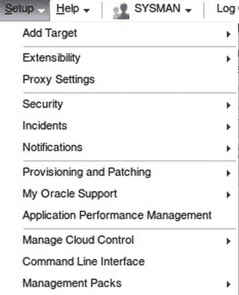

图 4-8. 设置菜单

“设置”菜单体现了应用程序设计者在合理化和精简应用程序方面所面临的一些问题，我们预计随着产品的成熟，这方面还会有进一步的工作。该菜单确实为您提供了一个集中位置来访问设置和维护企业管理员应用程序所需的所有系统范围功能，但对于某些项目的位置，却没有清晰的依据。我们将不会逐项介绍菜单，而是着眼于此菜单在您作为管理员需要执行的最常见任务中的用途。

我们将要完成的管理任务如下：

*   安全管理
*   我的 Oracle 支持集成
*   网络代理配置
*   通知和警报配置
*   控制管理包访问

我们不涵盖事件管理（详见第 12 章），也不涵盖更高级的功能，如产品可扩展性和命令行界面。本章主要旨在让您熟悉控制台的基本布局以及您最初将执行的基本操作。

### 安全管理

从这个版本开始，Oracle 将产品中的大量安全管理集中化了。为了有效操作，您将需要花时间配置所需的凭证。特别是，您将需要管理 表 4-1 中包含的安全领域。

表 4-1. 云控制中的可保护项

| 领域 | 目的 | 示例 |
| --- | --- | --- |
| 企业管理员用户 | 用户访问 EM | `SYSMAN` |
| 企业管理员角色 | EM 内的权限 | `PUBLIC` |
| 命名凭证 | 目标访问 | `NC_DB_ORCL_SYS` |
| 首选凭证 | 目标访问 | `NC_DB_ORCL_SYSTEM` |
| 监视凭证 | 代理访问目标 | `DBSNMP` |

此外，您可能希望设置一个权限委托方案，以便管理所需权限通过简单的角色层级和代理注册密码轮换进行传递。然而，这些项目高度依赖于您所服务企业的组织和安全要求，因此超出了本书的范围。

这里的核心概念是“命名凭证”。这些预配置的身份验证凭证允许用户和管理员以安全的方式访问各种受管目标，而无需记住大量的用户名/密码组合。设置这些凭证所花费的时间可能会显得相当繁琐，尤其是在大型环境中，但就节省日常操作时间以及允许最终用户在无需透露密码的情况下获得适当权限访问而言，这是非常值得的。您应使用一个不太可能被删除的账户来设置命名凭证。（例如，您可以使用 `SYSMAN` 来拥有所有命名凭证，然后授予命名的管理员访问权限。）这种管理员可以访问的凭证集的概念是安全方面的一大进步，很可能会受到您内部安全管理员的欢迎。不利的一面是，您最终可能需要引导他们完成此过程并解释访问控制，这现在比以前更复杂了。

 **提示** 我们强烈建议您为凭证实施命名约定，因为您将有许多凭证需要管理。一个例子是使用 `NC_<目标类型>_<目标名称>_<用户>` 来指示凭证适用的用户和目标。这适用于目标间密码不同的环境，但您的设置可能有所不同。

第一个安全管理任务是添加管理员账户。完成此操作后，您可以定义和分配角色并设置访问权限。

### 添加管理员

本节概述了添加新管理员账户的过程。如果您尚未为自己创建专用的管理账户，您可能希望跟随以下练习操作。

您将需要 表 4-2 中所示的信息项。在添加管理员时，您可能需要为自己制作一个类似的表格。

表 4-2. 新管理员详细信息

| 项目 | 目的 | 示例 |
| --- | --- | --- |
| 用户名 | 标识用户 | `JOE_DBA` |
| 密码 | 用于身份验证 | `Welcome1` |
| 电子邮件地址 | 接收通知的邮件 | joe.dba@lab.org |

请按照以下步骤添加新的管理员账户：

1.  要启动向导，请选择 设置  安全  管理员。将显示一个屏幕，列出系统上的所有管理账户。如果这是您添加的第一个管理员，您将看到如 图 4-9 所示的页面。

    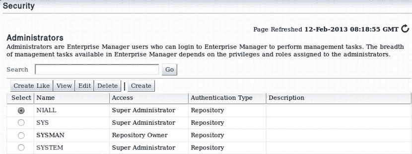

    图 4-9. 安全向导

2.  点击“创建”按钮。然后填写管理员的基本详细信息，如 图 4-10 所示。（这时您的表格就派上用场了。）请注意，添加电子邮件地址将自动创建一个 24×7 的通知计划。您稍后可以调整此设置。

    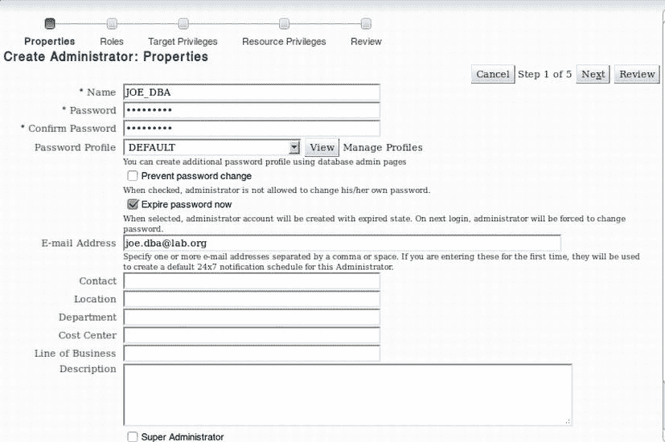

    图 4-10. 管理员详细信息

3.  点击“下一步”。然后选择此管理员将担任的企业管理员角色。您将在下一节中了解更多关于角色的信息。现在，请注意角色的范围非常广泛，并为各种管理任务引入了基于角色的管理。在此示例中，只需使用产品附带的默认角色（参见 图 4-11）。您创建的每个基于库的用户实际上都是库数据库上的一个数据库账户。您可以使用数据库的内置资源和配置文件管理来管理配置文件和资源。

### 创建管理员角色与配置支持集成

 **提示** 至少，我们建议利用数据库的密码复杂度和过期选项，以确保您的 EM 管理员帐户遵循公司策略。

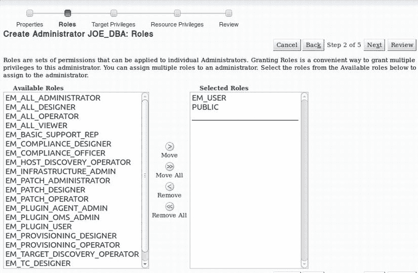

图 4-11. 添加角色

4.  现在，单击 **下一步**。您将看到如图 4-12 所示的屏幕，您可以在其中为用户分配权限，包括跨整个企业的权限以及针对特定目标的权限。

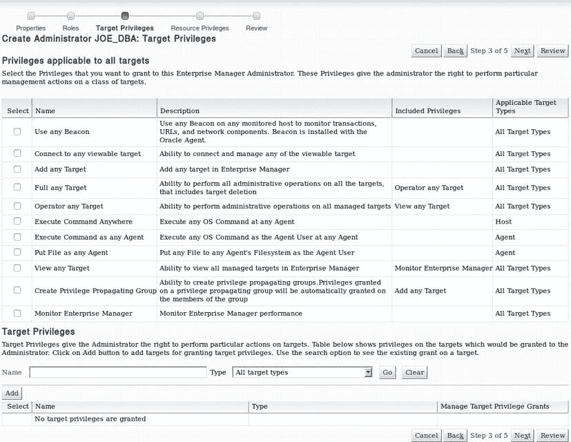

图 4-12. 目标权限分配

5.  单击 **下一步**。如图 4-13 所示的配置屏幕为您呈现了管理员可以管理的各种 Enterprise Manager 资源类型。例如，您可以确保管理员可以查看和编辑用于在企业范围内部署补丁的修补计划。

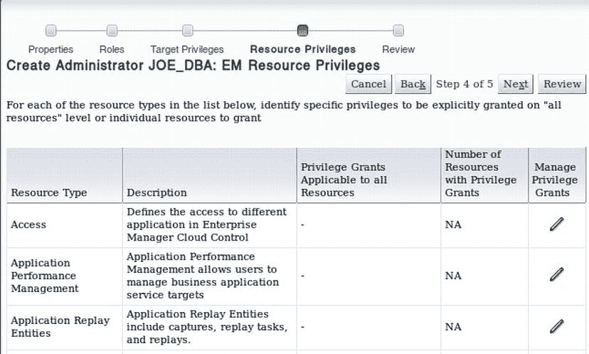

图 4-13. 资源分配

6.  单击 **下一步**。在接下来的屏幕上，复查管理员创建信息。然后单击 **完成**。

## 创建角色进行访问控制

一旦您正确设置了管理员帐户并测试了用户自身的登录访问权限，您就应该使用 Enterprise Manager 角色来配置基于角色的访问控制。在**角色管理**主页上，您将看到内置的 EM12c 角色以及您可以执行的各种管理操作。

**角色**是在目标和 Enterprise Manager 功能上的一组已命名的权限集合。因此，角色可以定义，例如，管理特定目标类型所需的权限，或执行 Enterprise Manager 操作（如请求新的自助数据库）所需的权限。此外，角色可以包含其他角色。因此，角色设计是任何有效 Cloud Control 部署的核心部分，但将取决于您企业的具体情况。

您将通过创建一个数据库管理员角色来逐步完成示例，该角色将拥有适合该工作角色的权限。您可以在接下来的练习中跟随操作。如您将看到的，向导按以下顺序分配权限：角色、目标、资源。

 **提示** 通常，请尝试定义与您组织中的工作角色或任务相匹配的角色。此外，使用适当的命名约定——例如，您可以使用定义操作系统安全性的 LDAP 目录组名称。

要创建您的**数据库管理员**角色，请执行以下步骤：

1.  在**角色管理**页面上，单击 **创建**。图 4-14 中所示的向导出现。避免跳过添加描述的诱惑。一个有用的描述对于未来的管理员将大有帮助，该描述应说明角色中包含的权限以及其设计的业务目的。

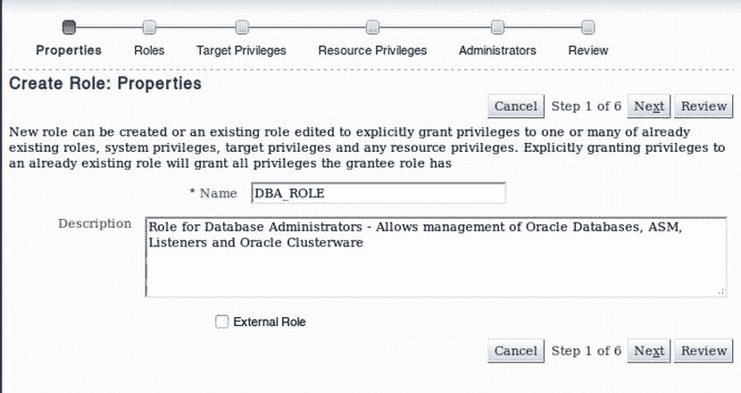

图 4-14. 角色创建向导 — 步骤 1

2.  单击 **下一步**。然后添加您需要的 EM12c 角色。在此示例中，您添加发现操作员角色，以及允许全面管理补丁生命周期的补丁管理员角色（参见图 4-15）。

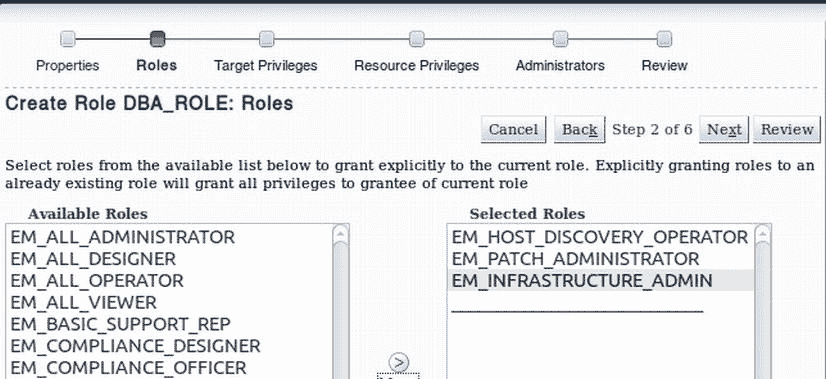

图 4-15. 角色创建向导 — 步骤 2

3.  单击 **下一步**。资源管理权限分配屏幕打开。此屏幕的关键部分如图 4-16 所示，位于最右侧，标记为 **管理权限授予**。单击每个权限类别的铅笔图标并单独分配权限。在这种情况下，添加**目标发现框架**下的所有权限，以允许您的 DBA 管理目标发现。

图 4-16. 角色创建向导 — 步骤 3

4.  最后，将任何现有用户添加到该角色。在此示例中，添加 `Joe_DBA`。要进行分配，请将管理员从左侧列表框移动到右侧列表框，如图 4-17 所示。单击 **下一步** 以继续向导。

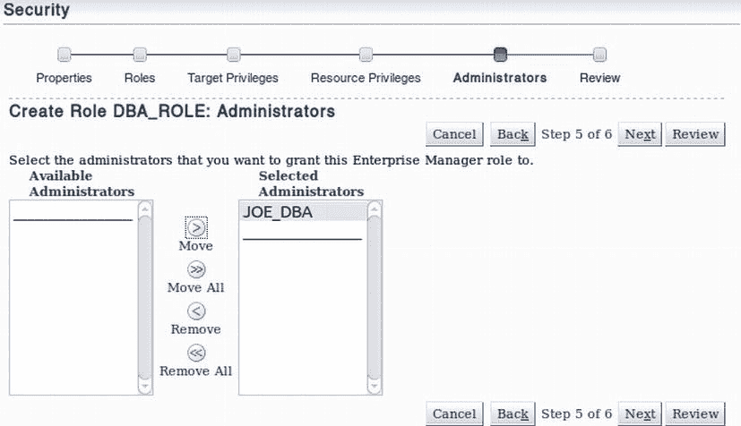

图 4-17. 角色创建向导 — 步骤 4

5.  最后，单击 **复查**，然后单击 **完成**，您就创建了新角色。

 **注意** Oracle 提供了 `PUBLIC` 角色，专门用于适合所有 EM 安装用户的定制。

## 配置支持集成

Enterprise Manager 与 **My Oracle Support** 网站紧密集成，该网站面向所有拥有支持合同的客户开放。然而，不设置此集成的客户站点并不少见。这是一个重大错误。幸运的是，Cloud Control 菜单栏使所需任务变得简单明了。

配置与 **My Oracle Support** 的集成可提供以下关键优势，使您支持 Oracle 的工作变得更加轻松：

*   增强的事件和问题报告
*   从 Enterprise Manager 内部访问支持知识库
*   补丁生命周期管理

支持集成需要设置以下内容：从 OMS 访问 **My Oracle Support** 网站的权限、代理配置以及 **My Oracle Support** 凭证。此外，您可以通过将受管目标链接到该 CSI 的管理员帐户，有选择地将受管目标分配给不同的客户支持标识符（CSI）。

### 代理配置

在大多数组织中，从公司网络访问互联网是通过使用代理服务器来控制的。该服务器旨在充当促进和控制对互联网资源访问的中介。在这种情况下，您需要访问的资源是 **My Oracle Support** Web 门户以及提供 Oracle 客户作为支持合同一部分可请求的服务的各种 Oracle 和第三方服务器。在本节中，您将逐步完成代理配置。如果您的组织有一个通过 Microsoft Active Directory 域自动对用户进行身份验证的代理服务器，您可能需要阅读即将介绍的“使用 NTLMAPS 代理”部分作为解决方法。

### 配置代理服务器访问

请完成以下步骤来配置代理服务器：

1.  从 **设置** 菜单中选择 `代理设置`。出现如图 4-18 所示的屏幕。

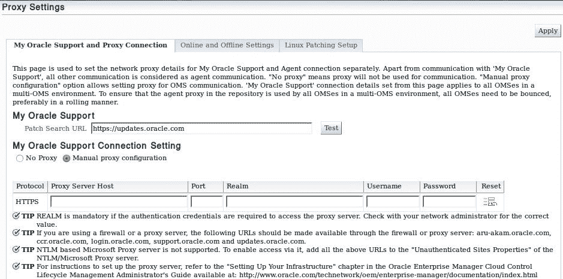

图 4-18. 代理详细信息

2.  输入您的代理服务器详细信息，或者输入您配置为替代方案的 NTLMAPS 代理详细信息，以及任何必要的身份验证。使用 `测试` 按钮测试对 `updates.oracle.com` 的访问。
3.  您可能还希望确保代理**不**用于代理到 OMS 的通信。为此，请选择页面底部的 **不使用代理** 选项，如图 4-19 所示。

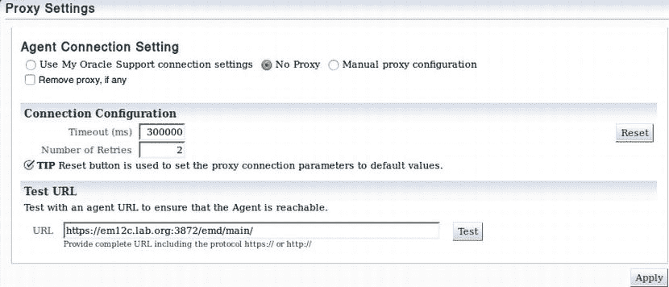

图 4-19. 将代理排除在代理访问之外

4.  最后一步是配置 MOS 凭证。这可以并且应该为 `SYSMAN` 完成，也许使用组织拥有的通用帐户（例如 `em@lab.org`）。这可以通过使用图 4-20 所示的 `设置凭证` 菜单选项来完成。

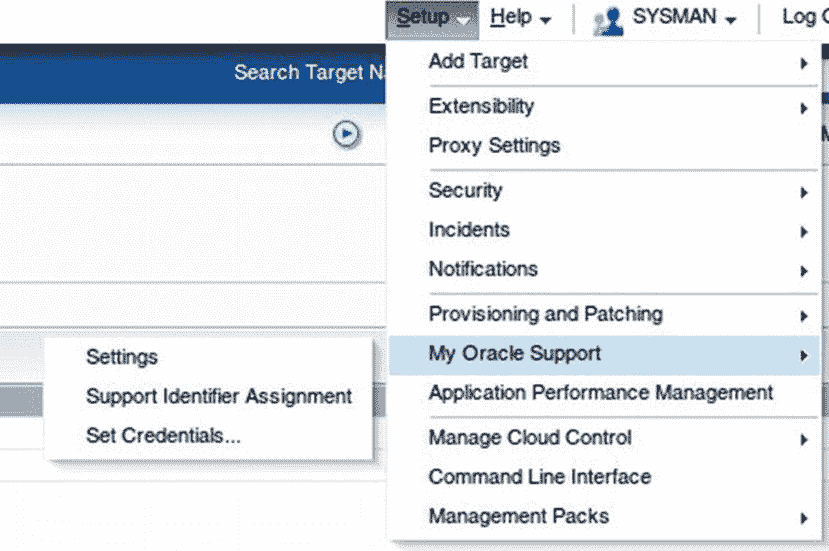

图 4-20. 配置 My Oracle Support 凭证

**注意** 如果您因是第三方支持公司而拥有多个客户支持标识符（CSI），您可以为不同目标分配不同的 CSI。这样，每位管理员将只能根据其合同规定，获得其授权范围内的系统支持。您可以通过“支持标识符分配”选项进行设置。

虽然使用质询/响应机制的简单代理认证设置起来很简单，但多年来，企业管理员中与代理配置相关的错误屡见不鲜。产品在这方面确实在不断改进；然而，在与使用 NTLM 自动认证用户的公司企业代理服务器进行认证时，您可能仍会遇到问题——考虑到 Active Directory 作为认证存储库在市场中的普遍存在，这种配置相当常见。这是因为云控制不支持 NTLM 代理服务器。因此，Oracle 官方建议是将各种 oracle.com 站点排除在公司代理配置之外。

## 使用 NTLMAPS 代理

NTLM 认证代理服务器 (`NTLMAPS`) 是一个代理服务器——本质上是一个智能的 Python 脚本和一些开源的 NTLM 库，它将针对互联网 URI 的请求重定向到上游或父代理服务器。如果需要，它会添加适当的浏览器标头，并且，对于 `EM12c` 至关重要的是，它能使用 NT 凭证正确地通过上游代理服务器认证。该项目在 GNU 通用公共许可证下授权，因此是免费的，可以在 [`ntlmaps.sourceforge.net/`](http://ntlmaps.sourceforge.net/) 找到。

**注意** 本节介绍的是使用轻量级开源专用代理的替代解决方案的设置。如果您选择使用此选项，请确保获得网络管理员的同意。

这意味着我们可以运行自己的代理服务器，无需云控制知晓 Active Directory 认证，同时仍能使用公司代理进行认证，并遵守所有公司安全规则。安装时，请下载并解压发行版到 `/opt/ntlmaps`。如果您使用的是 RedHat 或类似系统，Python 已作为标准发行版的一部分提供。否则，您还需要安装 Python。`NTLMAPS` 使用配置文件 `server.cfg`。您需要为以下参数输入值：

*   `PARENT_PROXY`：父服务器的 IP 地址
*   `PARENT_PORT`：父服务器监听的端口
*   `USER`：配置的 Active Directory 用户名
*   `PASSWORD`：该用户的配置的 AD 密码
*   `NT_DOMAIN`：NT 域名

完成这些设置后，暂时通过执行提供的脚本 `python main.py` 手动启动代理服务器。默认情况下，`NTLMAPS` 使用端口 `5865`。这个端口通常应该是可以接受的。无论您选择哪种方式，现在都应该为 `OMS` 服务器配置互联网访问，在上文“配置代理服务器访问”的步骤 2 中，将代理地址设置为 `NTLMAPS` 的地址。一旦代理正常工作，下一步就是使用 `chkconfig` 配置一个 Linux 服务。我使用的脚本是本书代码库中提供的一个开源脚本。

### 通知

企业管理员的主要作用之一是，当受管目标遇到需要关注的事件时触发警报。典型的例子包括 Web 服务器宕机或数据存储因数据增加而空间不足。企业管理员将此任务分为两个不同的阶段：警报和通知。这两个区域都可以从云控制菜单栏进行配置。

警报阶段关注的是记录特定事件的发生，通常由某个度量驱动。经管理服务器处理后，该信息会在目标主页上显示。警报会触发但不一定为管理员引发警报这一事实，是新用户对该产品感到困惑的常见原因。

相比之下，通知阶段是通过某种方式发送警报详细信息，以使相应的管理员能够响应警报状况的过程。例如，可能会呼叫一位数据库管理员（`DBA`），让她知道数据库的系统表空间空间严重不足，需要紧急增加空间。传统上，通知通过电子邮件进行，但也可以通过 `SNMP` 路由（例如发送到运营控制中心）、由数据库管理员或数据库开发人员编写的 `PL/SQL` 过程，或通过在管理服务器上运行操作系统命令（可能是 shell 脚本）来实现。

一旦您成功安装了企业管理员并使用 `SYSMAN` 账户登录后，您的首要任务之一应该是添加一个可用于通知您所设置管理员的通知方法。在此示例中，我们将使用电子邮件，因为这是实际安装中最常见的方法。要开始此过程，请选择“设置”> “通知”> “通知方法”，如 图 4-21 所示。

图 4-21. 通知方法

然后会显示如 图 4-22 所示的屏幕。您可以使用此屏幕设置公司邮件服务器的详细信息以及所需的任何认证凭据。您使用的邮件服务器*必须*配置为允许 `SMTP` 通信。您可能需要询问您的邮件管理员应该使用哪些服务器，因为许多公司邮件配置只允许来自特定服务器的 `SMTP`，并且可能要求您配置的账户是特定组的成员。

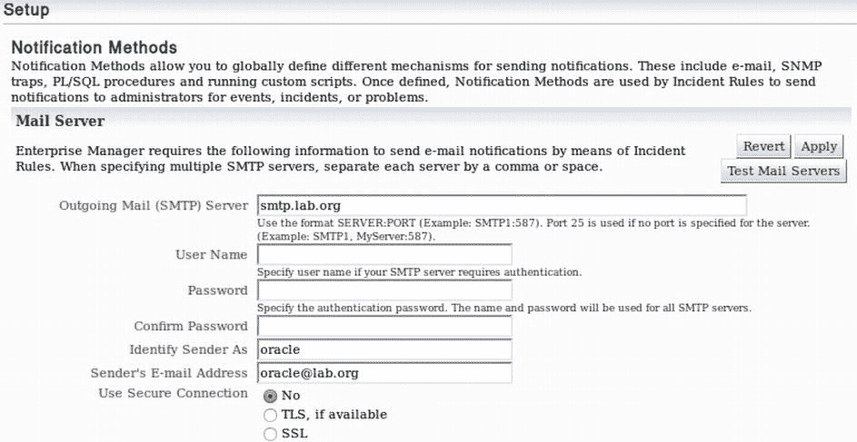

图 4-22. SMTP 服务器详细信息

默认情况下，企业管理员提供两种用于发送事件通知的电子邮件模板，分别称为长格式和短格式电子邮件。您可能需要自定义这些模板，特别是为了确保您的电子邮件客户端已配置规则以高效处理这些邮件。要自定义电子邮件格式，请从“通知”子菜单（如前面的 图 4-21 所示）中选择“自定义电子邮件格式”。这将显示如 图 4-23 所示的屏幕，默认显示度量警报的长格式，不过您可以通过屏幕顶部的下拉菜单更改此设置。

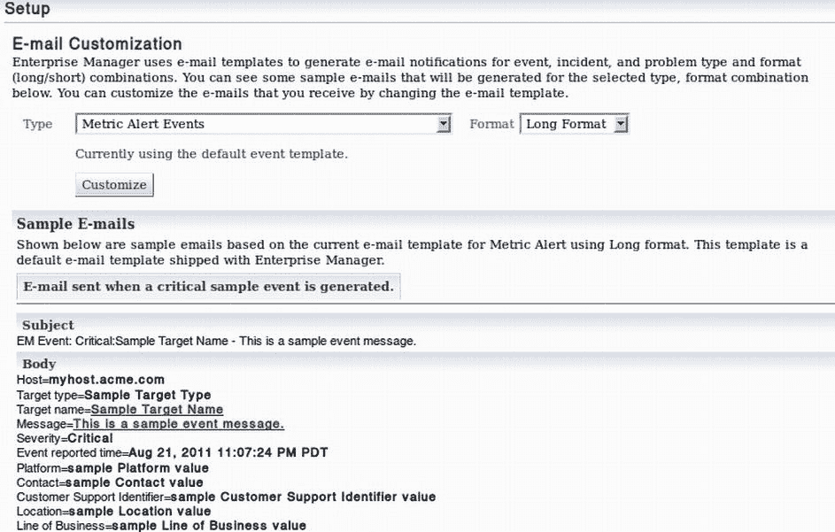

图 4-23. 电子邮件自定义

## 通知格式定制

如你所见，长格式命名详尽，提供了几乎所有你可能需要的信息。遗憾的是，它几乎无法阅读。此时，你可能会选择查看短格式，如 **图 4-24** 所示，尤其是当这些消息要发送到移动设备（如手机或寻呼机）时。不幸的是，这种格式将简洁性发挥到了极致，甚至没有包含引发告警的度量细节。这是一个设计特性，专门将消息长度限制在 155 个字符以内。此限制旨在允许通过 SMS 发送，尽管提供商的限制和 SMS 的字符集可能比这更少（例如，许多限制为 140 个字符）。因此，为了生产使用，你无疑会希望自定义这两种格式之一。

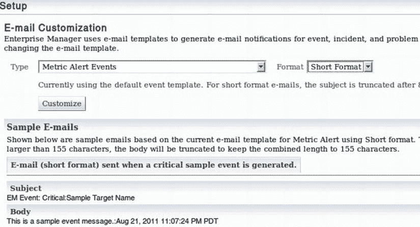

**图 4-24. 短格式通知**

 **提示**  我们建议你从短格式开始并扩展它，而不是从长格式中删减。

定制是一个相对简单的过程，由配置纯文本和占位符的混合组成，这些占位符在运行时会被告警的属性（例如，目标名称或告警时间戳）替换。注释可以用 `--` 字符组合进行前缀，就像 SQL 语句一样。此外，可以应用条件逻辑来包含相关详细信息，例如，如果这是一个重复通知。目前尚无创建新告警模板的能力，因此你只能使用这两种邮件格式。然而，通过仔细使用条件逻辑功能并配合适当的属性，可以有效地规避这一限制。例如，可以基于目标部署类型为生产环境和 QA 定义不同的短格式响应模板。**图 4-25** 展示了一个为生产环境定义所有告警类型（包括重复告警），而仅为 QA 定义一个常规邮件的示例。

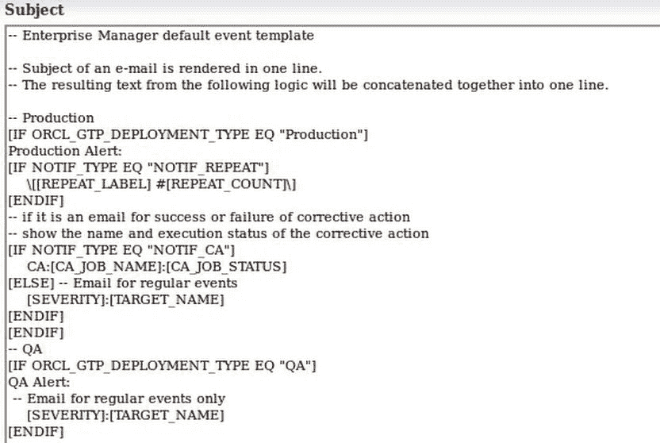

**图 4-25. 条件格式逻辑的使用**

### 管理包访问

客户经常反对实施 Oracle Enterprise Manager 的一个主要原因是其感知成本。尽管 Enterprise Manager 本身是一个完全免费的产品。然而，该产品以易于使用的方式暴露了按目标许可的高级功能。这些功能包含在管理包中。由于 GUI 使得管理员能够轻松访问他们未获许可的功能，因此在实施后不久应执行的任务之一是为你目标配置管理包访问。这需要从 `Cloud Control` 菜单完成。

要开始该过程，请从 `Setup` 菜单中选择 `Management Packs`。其子菜单有四个选项，如 **图 4-26** 所示。

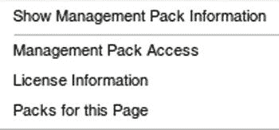

**图 4-26. 管理包配置菜单**

`Management Pack Access` 选项允许你启用——更重要的是，禁用——你未付费因此无权使用的高级功能。**图 4-27** 显示了展示这些选项的屏幕。

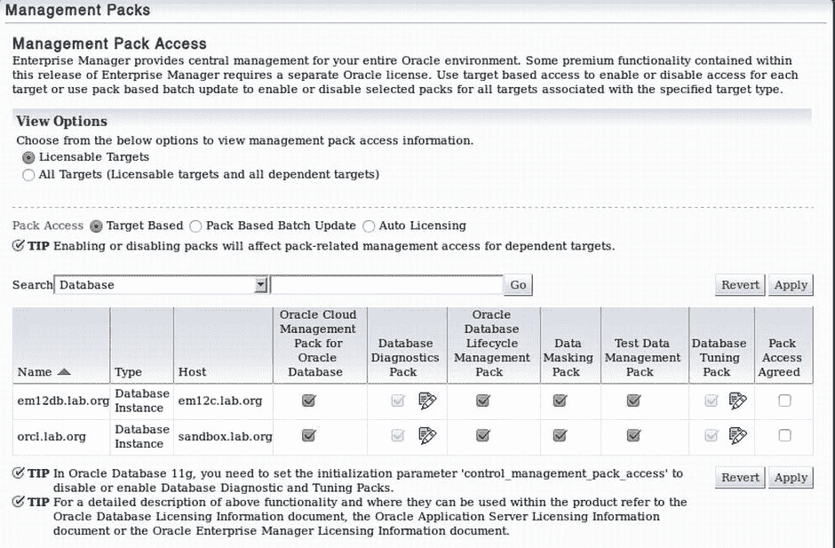

**图 4-27. 限制对管理包的访问**

`Management Packs` 子菜单的 `License Information` 项会带你前往一个长列表，其中包含你可以购买以帮助管理和管理 Oracle 产品的各种管理包和插件。这些包和插件扩展了 Enterprise Manager 和/或基础产品的功能，以提供增强的管理体验。

此外，子菜单的 `Packs for This Page` 选项现在提供了一个弹出窗口，详细说明了访问给定 EM 页面所需的管理包。此功能在整个产品中可用。例如，在数据库性能主页上单击此菜单选项会产生 **图 4-28** 所示的对话框。

**图 4-28. 显示所需管理包的“此页面的包”示例**

 **注意**  遗憾的是，`Packs for This Page` 功能提供的包访问信息粒度不如先前版本中启用文本管理包标签那样细。

## 导航菜单栏

用于导航控制台界面本身的 `Navigation` 菜单位于每个屏幕顶部的蓝色导航栏中。共有四个菜单，允许快速导航到以下位置：

*   整个企业范围内的位置
*   基于目标的管理页面
*   保存的位置（或收藏夹）
*   访问过的位置（或历史记录）

菜单栏如 **图 4-29** 所示。此外，导航栏在屏幕右侧还包含一个搜索框（图中未显示）。

**图 4-29. 导航菜单栏条目**

无论你在产品中导航到何处，这些菜单始终可用。其主要优点在于，你将始终拥有一致的方法来快速轻松地导航到所选位置。

### Enterprise 菜单

`Enterprise` 菜单，如 **图 4-30** 所示，包含你全面了解企业运行状况所需的项，以及各种不适合基于目标菜单的项。

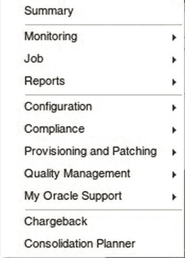

**图 4-30. Enterprise 菜单**

接下来，你将了解该菜单的各种选项，然后花点时间看看可用的报告选项。

#### 探索 Enterprise 菜单

`Summary` 项带你前往企业的整体摘要视图，该视图为你提供所有你有权访问的托管目标的实时状态信息的概览。对于熟悉先前产品版本的用户来说，这是传统的主页。

`Monitoring` 子菜单为你提供了几个企业范围的选项，用于审查和标准化整个企业的监控和管理。因此，例如，此菜单是定义监控模板和纠正措施的起点。此领域将在 **第 7 章** 中介绍。现在，请注意此子菜单提供了一条通往监控和自动故障纠正一站式配置的途径。

`Job` 子菜单是内置的 Enterprise Manager 作业调度程序的接口。这个集中式作业调度系统允许你在整个企业的托管目标上运行各种标准化作业。例如，可以定义标准化的 Recovery Manager (`RMAN`) 备份脚本，并将相同脚本部署到企业中的所有数据库。作业接口将在 **第 11 章** 中介绍。

