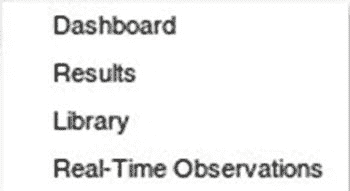
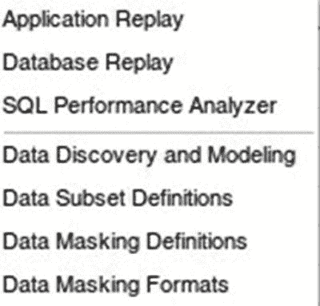

# 企业菜单功能

 **提示** 您需要决定 `EM12c` 作业系统在您的环境中是否提供了足够的灵活性和可靠性，或者替代的作业调度系统是否满足您的要求。一般来说，如果您已有现成的企业调度器，我们推荐您使用它。如果您有一堆有些失控的 shell 脚本，我们建议您，`EM12c` 提供了一个实现集中化和简化的契机。

## 报告子菜单

报告子菜单旨在帮助您基于通过 `Oracle Enterprise Manager` 运行所积累的集中存储库数据生成报告。这部分信息提供了集中式管理数据存储库的大部分附加价值。我们将在本节末尾详细介绍此菜单的功能。

## 配置子菜单

下一个子菜单是配置，它允许您收集和比较组织中受管目标的配置详情。这使您可以确保，例如，在两个相似的主机上安装了相同的操作系统软件包版本。此菜单体现了产品的配置管理能力。

## 合规性子菜单

接下来是合规性子菜单。*合规性* 指的是特定目标的实际配置符合该类型配置项预定义标准的程度。该产品领域在 `12c` 版本中有了一些显著改进。在之前的版本中，所能实现的只是将受管目标与一组单一的、不可编辑的、预定义的最佳实践集进行比较。这有显著的缺点，要么是因为预定义策略限制过严，要么是因为不够严格。后者的最佳例子是受 `支付卡行业 (PCI)` 标准约束的组织。

**图 4-31.** 合规性子菜单

全面覆盖目标合规性超出了本章的范围。不过，这里有一些基本概念供您入门。`Oracle` 设想，根据行业实践，您定义一套标准实践（例如，您将为数据库存储需求使用 `自动存储管理 (ASM)`，或者数据库监听器不会使用默认端口 `1521`）。这些作为合规性标准规则单独管理。然后，您将一组相关规则归为一个公司标准，通常针对一种目标类型。因此，您可能会将您的 `ASM` 标准，与声明您不会使用大文件表空间的标准，以及要求使用统一区大小的本地管理表空间的标准一起，整合为一个数据库存储标准。最后，您可以将相关的标准分组到一个合规性框架中。在我们的例子中，我们可以创建一个如上所述的存储标准，以及一个符合公司密码策略的数据库密码标准。然后，这两者可以一起归组，为您的组织形成一个数据库合规性框架。截至此版本，标准和策略规则可为您的组织编辑。此外，`Oracle` 还随附了多个带有支持性标准和规则的合规性框架。

 **注意** 这一个变化意味着，在之前版本中很少使用的 `Enterprise Manager` 的合规性功能，现在应该列入您的待调查清单。

您创建的规则、标准和框架构成一个合规性库。您可以从合规性菜单中的库链接查看此库。`Enterprise Manager` 然后允许您通过两种方式确保合规性。首先，合规性分数是根据对受管目标评估您的合规性标准规则的结果计算出的加权平均值。该分数显示在目标和企业主页上。其次，合规性负责人可以交互式地查看目标状态，并使用 `Enterprise Manager` 报告框架来维持公司对标准得到遵守的保证，并确保对标准的偏差通过纠正措施或记录不合规原因得到处理。

## 配置和修补

企业菜单中的“配置和修补”选项是进入 `EM` 配置和修补功能的入口。由于这些功能在第 6 章中有介绍，我们在此不深入探讨该功能。

## 质量管理

下一个项目叫做质量管理，但在我看来，这是用词不当。图 4-32 所示的子菜单包含指向数据库和 `WebLogic` 产品的各种增值选项的链接。由于这些项目是单独授权的，我们不在这篇关于 `Enterprise Manager` 界面的介绍中涵盖它们。

**图 4-32.** 质量管理

## 我的 Oracle 支持子菜单

我们要详细查看的最后一项是“我的 Oracle 支持”子菜单。它提供了访问 `Oracle` 在线支持工具的四个常用区域。这些是服务请求、知识库、认证信息以及我的 Oracle 支持社区论坛。要使其中任何一项正常工作，您需要如前所述配置支持集成。我个人只使用服务请求选项，因为其他信息区域（知识库和社区内容）一旦建立了“我的 Oracle 支持”连接，就可以直接从导航栏右上角的搜索框中搜索到。

 **注意** 支持集成的一个方面可能会让您惊讶，即支持页面是从现已退役的 `Flash` 界面显示的我的 Oracle 支持内容。我们预计这将在产品的未来更新中改变。

## 收费 back 和整合规划

最后，在菜单底部，看起来像是设计师找不到更好的地方，是收费 back 和整合规划功能。这些高级功能超出了本章的范围。

总的来说，企业菜单让您能够访问产品级或企业级的功能，并且是您配置或访问企业管理功能应该查看的地方。不过，在离开本节之前，您将更深入地了解产品的报告功能。

