# 配置报告

在撰写本文时，`Enterprise Manager` 处于一个过渡阶段，正从之前版本中可用的技术 `Information Publisher` 转向 `Business Intelligence Publisher` 报告，后者提供了大大增强的格式、调度和分发选项。在 `12c Release 2` 中，您有两个不同的选项，第一个是链接到 `Information Publisher` 报告。（这是在 `12c Release 2` 之前唯一的选项），但已被 `BI Publisher Reports` 取代。`Oracle` 为 `Enterprise Manager` 提供了 `BI Publisher` 的嵌入式许可证，这显然是前进的方向。然而，目前存在一些限制，我们希望在未来的版本中看到放宽。

目前，仅支持 `BI Publisher 11.1.0.6`（是的，版本号有四位小数），并且仅限于将其加载到与 Cloud Control 相同的 `WebLogic` 域中。出于所有实际目的，这意味着您要么需要扩展域以包含一个新的 `BI Publisher` 服务器，要么将 `BI Publisher` 安装到现有的 `OMS` 服务器上。无论哪种方式，在复杂性和管理方面都是一项重大投入——并且确实会带来额外的 CPU、内存和磁盘需求。希望在未来，对同一域的依赖可以放宽，`BI Publisher` 模板可以安装到现有的企业 `BI Publisher` 环境或独立的 `BI Publisher` 实例中。最后，Oracle 目前不保证您开发的 `BI Publisher` 报表的向后兼容性。因此，本书不涵盖 `BI Publisher` 报表，因为我们认为这些限制意味着在撰写本书时采用 `BI Publisher` 是不明智的。

如果选择了 `Information Publisher` 报表，您将看到一个按类别组织的预定义报表列表，看起来有点像 图 4-33 中按字母顺序呈现的列表。

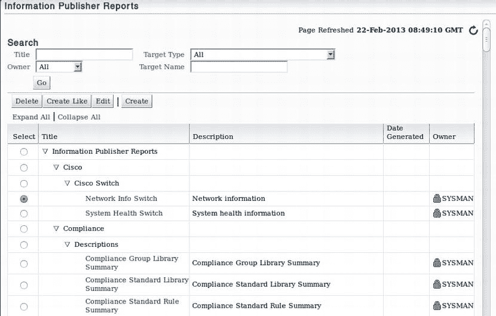
图 4-33. `Information Publisher` 开箱即用报表

这些报表按预定义类别分组。完整列表如 图 4-34 所示。要生成此列表，请选择 `全部折叠`，然后单击 `Information Publisher Reports` 旁边的箭头。

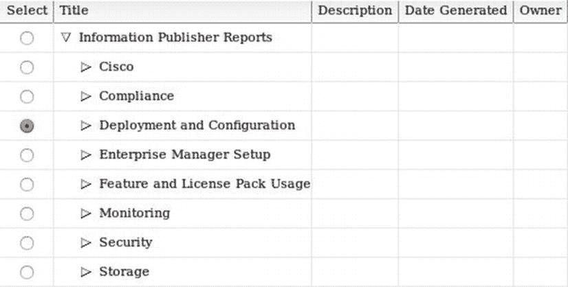
图 4-34. 可用报表类别

您无法编辑预定义报表，但可以使用 `类似创建` 功能来生成自定义版本。为了说明这个原理，您将使用内置的 `Oracle Database Monthly Space Usage Report` 作为新的每日空间使用报表的基础。要查找该报表，请展开报表列表，使其看起来像 图 4-35。

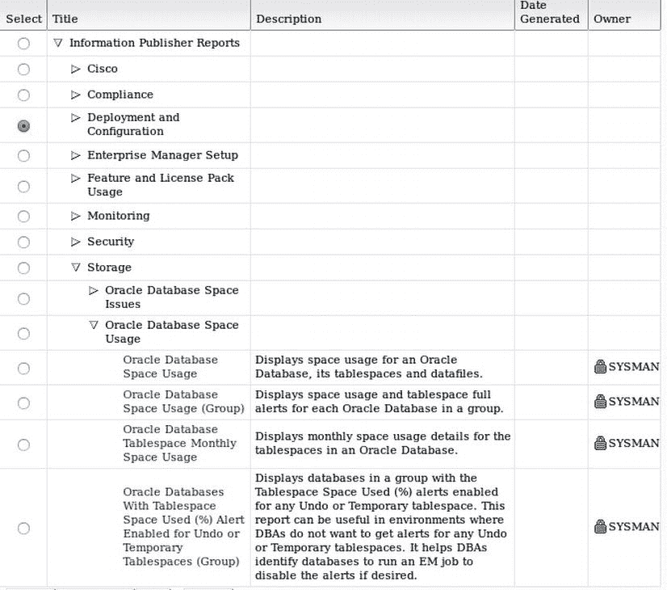
图 4-35. 空间使用报表自定义

选择 `月度空间使用报表` 并单击 `类似创建`。您将看到一个类似于 图 4-36 的屏幕。您可以自定义此报表的所有可编辑属性，并且**必须**自定义报表标题。

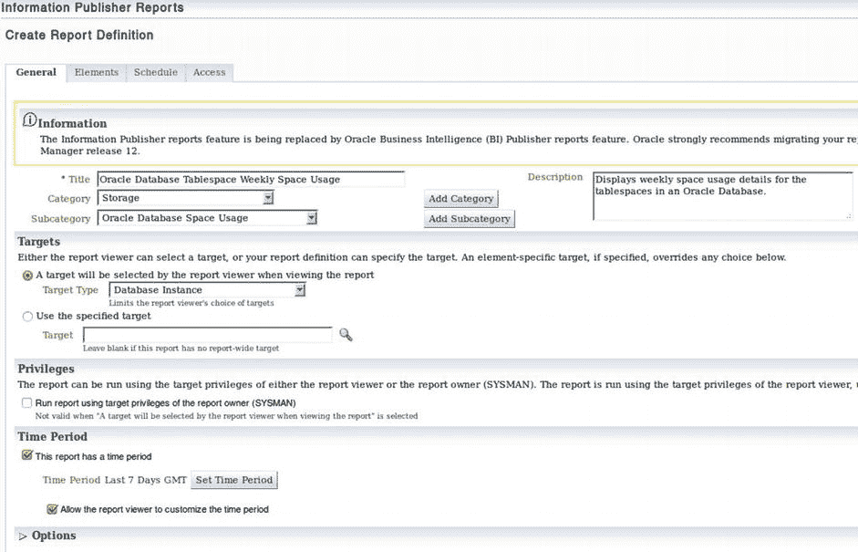
图 4-36. 初始报表设置

将所有现有对 `Monthly` 的引用更新为引用您的新分析周期（在此示例中，您将使用 `Weekly`）。此外，选择 `设置时间段` 并从 31 天更改为 7 天。完成后，报表应类似于 图 4-37。

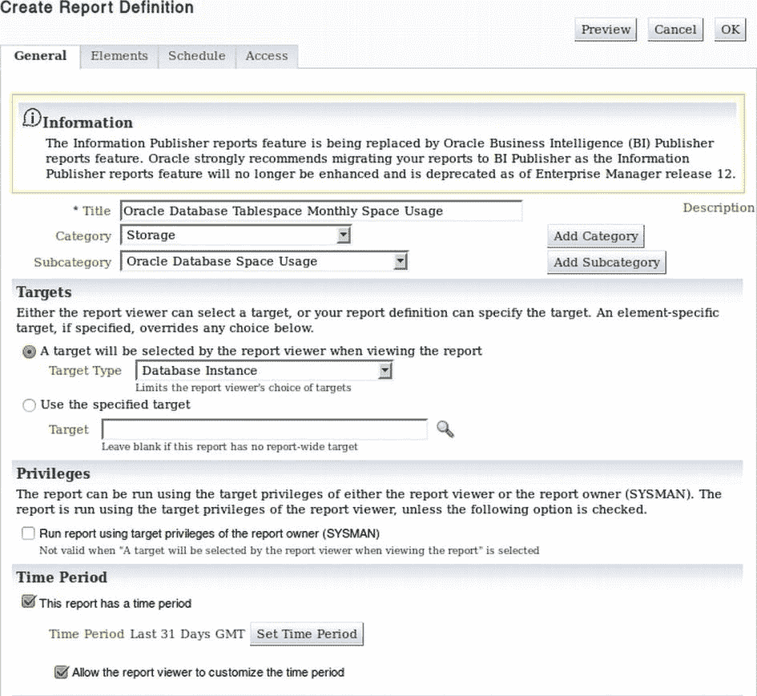
图 4-37. 每周空间管理报表

接下来，暂时忽略 `元素` 选项卡，然后单击 `计划`。此选项卡允许您将报表配置为每周日运行并通过电子邮件发送到相应地址（参见 图 4-38）。这种将报表安排到管理员或管理层收件箱的做法，是将报表功能与管理库集中化的一个巨大优势。我建议您保存已发送报表的副本，并在合理的时间范围内清除，以便进行跨时间比较，从而回答诸如“去年这个时候发生了什么？”之类的问题。

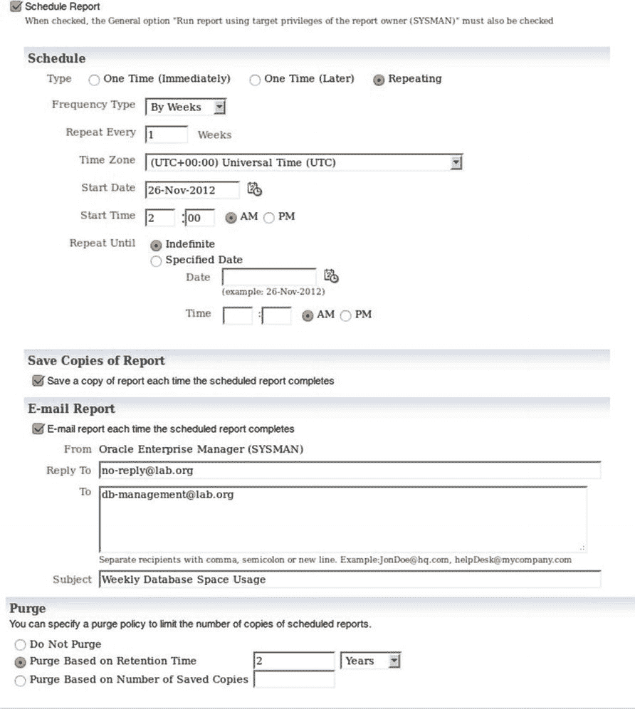
图 4-38. 每周空间报表的两年保留期

## 目标菜单

`目标`菜单，顾名思义，让您能够快速按类型访问目标的摘要信息。可用的目标类型根据您选择安装的插件而有所不同。图 4-39 显示了一个示例。

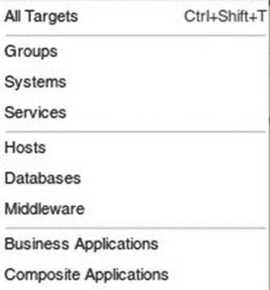
图 4-39. 目标菜单

`所有目标`选项或键盘快捷键会将您带到一个可搜索的目标列表，该列表以各种方式组织。屏幕看起来类似于 图 4-40。

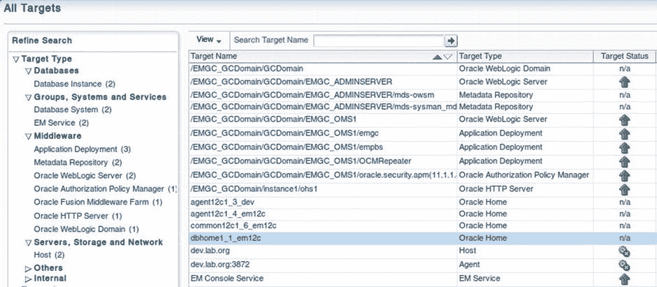
图 4-40. `所有目标`选项

除了按目标类型搜索外，您还可以按软件版本、目标状态、硬件平台或操作系统查看目标。如果您想查看多个相同类型或状态的目标，此屏幕速度更快；如果您正在搜索特定目标，使用`导航`栏上的标准搜索框可能会更好，可以达到相同的效果。

菜单的下一部分涵盖`组`、`服务`和`系统`，这是将一组托管目标作为一个整体进行查看和管理的三种方式。您需要了解每种这些结构的差异和用途，以便有效利用该平台。

`组`是目标的逻辑组织。例如，您可能将所有生产数据库归类为一个组，或某个特定数据中心中的所有主机。组的有效使用在第 7 章中介绍。现在，您只需要知道可以将逻辑相关的项目分组，然后查看有关该组的摘要信息，而不是单个目标的信息。图 4-41 显示了默认情况下您将看到的有关组的信息（本例中是数据库实例组）。

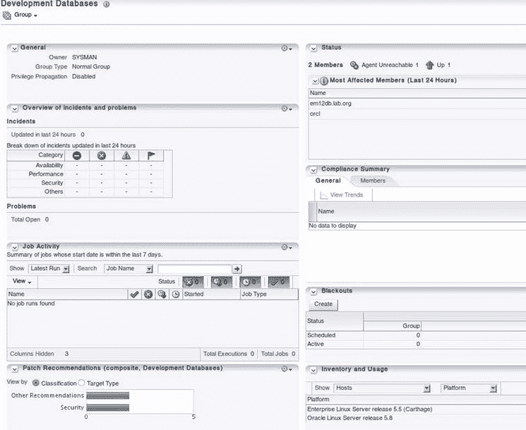
图 4-41. 组信息

此时您可能会想：“太好了；我可以将构成我的重要应用程序安装的所有设备分组在一起，并将它们视为一个组。”虽然这是正确的，但真正需要的很可能是一个`系统`。系统由其提供的服务定义。正式定义如下：

> `系统`是一组协同工作以托管您的应用程序的基础设施组件（例如，主机、数据库和应用程序服务器）。

根据它们提供的服务，系统有几种类型。如果您导航到系统页面，您将看到几个预定义的系统，包括运行`Enterprise Manager Service`的`WebLogic`域。系统管理是一个全面的管理和配置领域，因为`Enterprise Manager`允许您定义相互依赖关系和组件角色等。正确定义系统的力量体现在`Enterprise Manager`为托管系统提供的根本原因分析和服务级别分析中。数据库系统的主页如图 4-42 所示（我们使用的是`Enterprise Manager`存储库数据库系统，因此您可以将其与您的安装进行比较）。

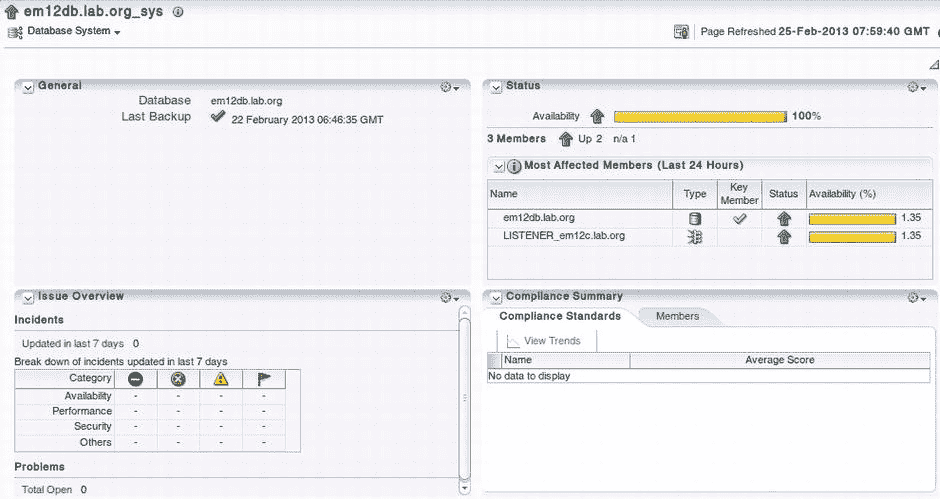
图 4-42. 数据库系统

## Services 菜单

Services 是此组中的最后一个菜单选项，也是 Enterprise Manager 服务级别管理能力的基础。一个*服务*被简单地定义为向一个或多个用户提供有用的功能。这与广泛使用的 ITIL 定义非常相似，后者侧重于向客户交付有用的成果。如前所述，系统可以交付服务，但您也可以定义不基于系统的服务（也许您不拥有或不监控提供它们的 IT 基础设施）。Enterprise Manager 中可用于监控的服务类型的确切列表取决于您安装中的插件。

下一组菜单项由您已配置监控的各种受管目标类型的首页组成。例如，您可能有主机、数据库和中间件的条目。点击这些条目中的任何一个，都会将您带到受管资产的视图，按指定类型的所有目标进行过滤。每个页面都允许您查看该特定类型的现有目标，通过发现过程添加新目标，或在目标使用寿命结束时删除旧目标。

 **提示** 如果您的工作角色是特定类型目标的专用管理员——例如，如果您是 Fusion Middleware 管理员——最好选择并在必要时定制一个合适的首页。

最后，在此菜单中，您有指向正在管理的应用程序的链接。这些不是预设的目标类型，而是由您从监控组件构建起来的。此功能很复杂，并且是站点和应用程序特定的。该主题在文档集 *Oracle® Enterprise Manager Cloud Control Getting Started with Oracle Fusion Middleware Management* 中有涵盖，可在此处访问：`http://docs.oracle.com/cd/E24628_01/install.121/e24215/bussapps.htm#sthref170`。

## 收藏夹菜单

下一个菜单乍看之下似乎是多余的。这是收藏夹菜单，其初始外观如图 4-43 所示。因此，它复制了您已有的浏览器内收藏功能。显然，如果您也可以利用内置的浏览器功能，在此处添加 Cloud Control 收藏夹可能不会带来巨大的价值。

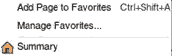

图 4-43. 收藏夹菜单

但是，如果您配置了支持集成，并且像作者们一样已经在 My Oracle Support 界面中收集了广泛的收藏夹，您会发现这些收藏夹可以直接从 Enterprise Manager 收藏夹菜单中获得。图 4-44 显示了一个关联了许多 Oracle E-Business 11.5.10 收藏夹的帐户设置。

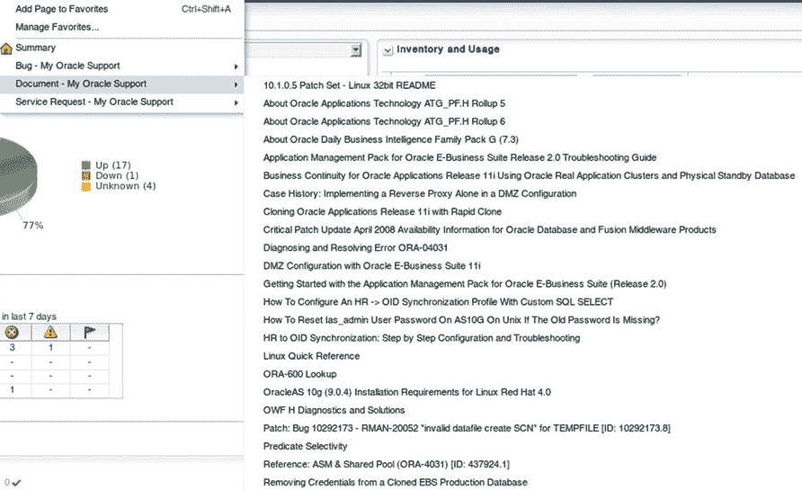

图 4-44. 在 EM 中显示 My Oracle Support 收藏夹

## 历史记录菜单

历史记录菜单仅让您访问最近访问页面的历史记录。这在使用浏览器“后退”按钮会带您穿过任务流而不是返回到真正的上一个页面时很有帮助。除此之外，我们找不到此菜单有浏览器历史记录无法提供的用途。

### 搜索框

在导航栏的右侧是一个搜索框，允许您直接从产品界面内搜索 Enterprise Manager 和 My Oracle Support (MOS)。搜索框的默认范围是“搜索目标名称”，但下拉列表使您可以将范围更改为例如 Oracle 补丁或 My Oracle Support 知识库。举个例子，假设您不完全记得 Oracle Database 近期版本中的 `ADR retention policies` 是如何工作的。您推测此信息应该在 MOS 的知识库中可用。因此，您从下拉菜单中选择“搜索知识库”并输入查询，如图 4-45 所示。

图 4-45. 从 Cloud Control 内部搜索知识库

假设您已配置支持访问，您将被带到查询结果。在我们的案例中，我们需要的准确文档是第一个命中项（参见图 4-46）。如有必要，您可以按照正常的 MOS 方式修改搜索条件以缩小或扩大结果范围。

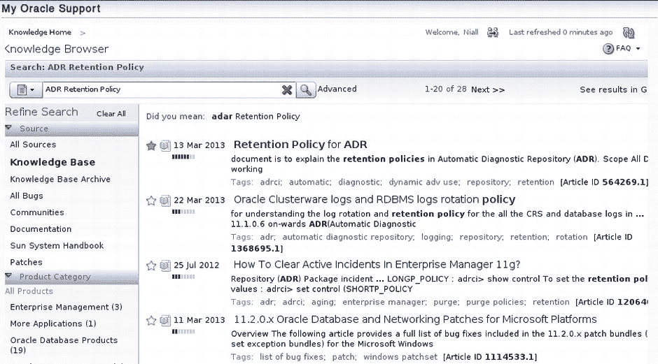

图 4-46. Enterprise Manager 中的知识库搜索结果

搜索下拉列表中的来源范围直接对应于 My Oracle Support Flash 界面中的可搜索来源列表。

## 目标管理菜单栏

前面讨论的所有菜单项在整个 Enterprise Manager 中都可用，并为管理产品提供了一致、连贯且始终可用的导航范式。此外，每个插件，无论是 Oracle 还是第三方提供，都负责为其提供可管理性服务的目标类型提供管理菜单栏。为了说明一般特性，我们将使用 Oracle Database 插件，因为我们假设大多数读者对数据库管理有一定了解。每个受管目标类型在其特定于目标的菜单栏上提供菜单，其中一些将与此处展示的菜单一致，而另一些将是特定于目标类型的，并暴露仅适用于该目标类型的可管理性接口。

正如您在引言中回忆的那样，早期的 Enterprise Manager 版本具有一些不一致的界面，设计取决于各个产品组，并采用了多种范式，从数据库团队的链接列表到 Fusion Middleware 团队采用的高度菜单驱动的方法。在此版本中，各个产品采用了 Fusion Middleware 团队开创的方法。例如，数据库目标的首页如图 4-47 所示。

图 4-47. 数据库首页

Oracle 数据库的目标管理菜单栏有五个子菜单：`Oracle Database`、`Performance`、`Availability`、`Schema` 和 `Administration`。这些在图 4-47 的顶部进行了说明。

最左边的菜单，称为*目标类型菜单*，在整个产品中是通用的，并提供对目标各种配置项的访问。它始终标记为目标类型（`Oracle Database`、`WebLogic Server` 等）。任何进一步的菜单都是该目标类型插件的职责。为了说明这一点，请将数据库首页与 Enterprise Manager `WebLogic` 管理服务器的首页进行比较，如图 4-48 所示。性能、可用性等菜单已丢失，因为底层产品以不同的方式暴露了这些功能的可管理性。但是，目标类型菜单仍然存在，这次标记为 `WebLogic Server`。

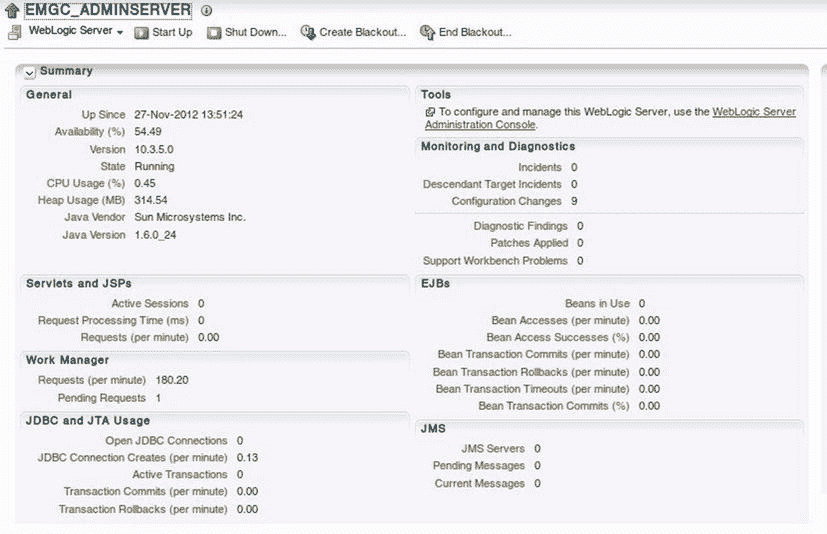

图 4-48. WebLogic 管理服务器的主页

如图 4-49 所示，目标类型菜单项旨在让您快速访问控制目标的监控、配置和报告功能。在此处，您可以更改或设置监控和警报。此外，该菜单可能提供控制目标状态的功能——例如，将其关闭——以及各种信息和报告选项。以下各节将讨论此菜单中的关键选项。

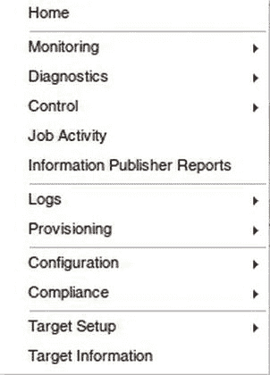

图 4-49. 目标类型菜单

### 监控设置

“监控”子菜单至少包含以下与指标收集和报告相关的项目：

*   `用户定义指标`：为此目标类型创建的用户指标
*   `所有指标`：此目标类型的所有指标
*   `指标收集设置`：是否收集指标以及收集频率
*   `指标收集错误`：收集指标时遇到的错误

图 4-50 展示了 WebLogic 服务器的“监控”子菜单，其中包含了这些选项以及 WebLogic 特有的选项。这些选项的使用方法基本一目了然，而实际的指标则因目标类型而异。图 4-51 显示了为数据库目标选择`所有指标`后的结果。这使您可以访问此目标可用的全部指标。我们已按类别排序以便查看，因为数据库有大量潜在的指标。

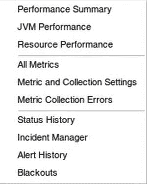

图 4-50. “监控”子菜单

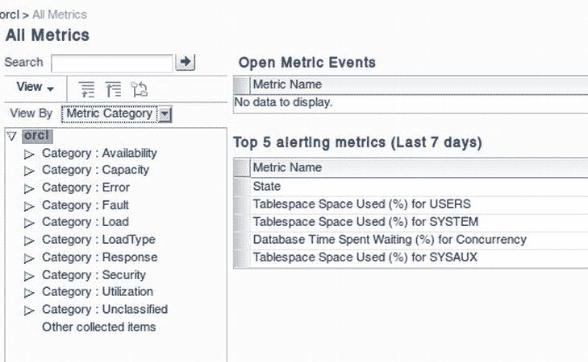

图 4-51. 数据库目标的可用指标

 `注意` 我们还会立即获取前五个告警指标的趋势以及任何未解决的指标事件。这是对以往呈现相同信息方式的一项巧妙改进。

如果您展开“容量”类别并点击一个表空间使用率指标，您将看到通用的指标配置页面，如图 4-52 所示，允许您设置收集频率和上传间隔。此功能对所有受管目标的所有指标都是通用的。在此上下文中，管理指标只是一个感兴趣的数据点——例如，Oracle 表空间中的空闲空间量。指标由代理按配置的频率收集，并每隔若干次收集上传一次（在此情况下是每次都上传）。

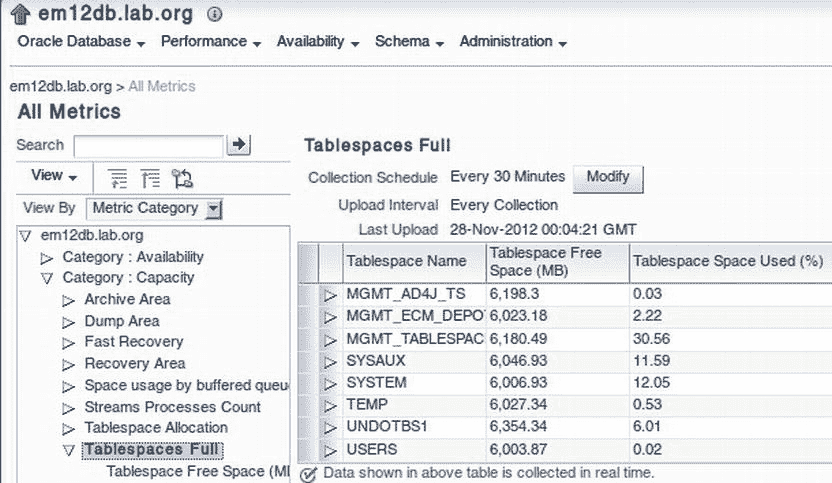

图 4-52. “表空间已满”指标详情

可用的指标因目标类型而异，但收集和上传的配置在整个产品中是通用的。当然，收集指标的主要目的是为了进行分析和告警。在 Enterprise Manager 中，由于历史原因，`告警`具有特定的技术含义，这与常见的英语用法不同。具体来说，当指标超过管理员设定的阈值时就会发生告警（为避免误报，这可能需要连续发生多次收集）。告警的发生与管理员收到通知之间没有关联。

“指标与收集设置”菜单提供了指标收集配置的不同视图，按类型对指标进行分组，并允许您更改收集指标值的计划，以及为该指标定义阈值，以表示收集指标的警告或严重状态。图 4-53 展示了数据库目标的此界面。

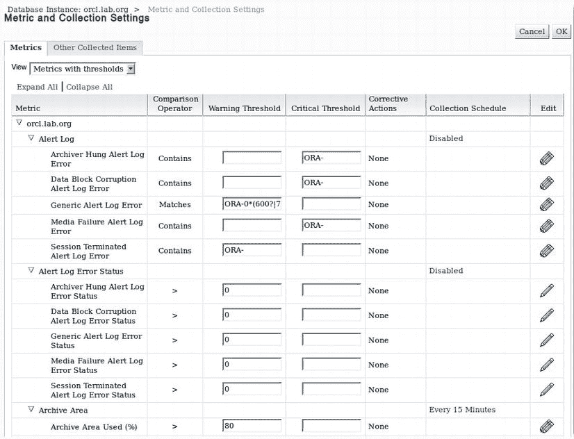

图 4-53. 指标与收集设置

通知是使用前面描述的“云控制”菜单栏上的“设置”菜单，按管理员逐个进行配置的。可以在此处以目标为单位配置告警阈值。

 `注意` 如第 7 章所述，您将主要使用监控模板来设置告警阈值。“监控”菜单提供了一种在必要时覆盖这些设置的方法。设置好指标和告警后，请务必使用`指标收集错误`菜单项定期检查目标是否存在任何指标收集错误。

### 诊断

部分（但非全部）目标类型使用“诊断”子菜单来提供对 Oracle 支持工作台和健康状况检查监视器的访问。我预计提供此子菜单的目标范围会随时间扩大。这为打包您的支持事件并将其上传给支持团队提供了一种便捷方式，以及将您基础设施的现有状态与已发布的 Oracle 实践进行比较。

对于数据库目标，此子菜单允许访问支持工作台，使您可以打包由高级诊断存储库检测到的事件并将其上传给支持团队。图 4-54 显示了一个 EM 存储库数据库目标出现`ORA-0600`错误的情况。

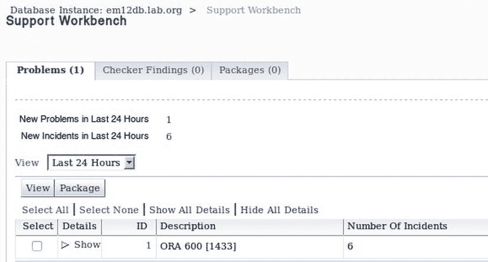

图 4-54. 支持工作台

此界面允许您与支持团队一起管理事件，并将该事件的进度与受管目标集成。全屏视图提供了事件时间线的图形化展示，以及`ADR`将事件与问题记录关联的方式（参见图 4-55）。

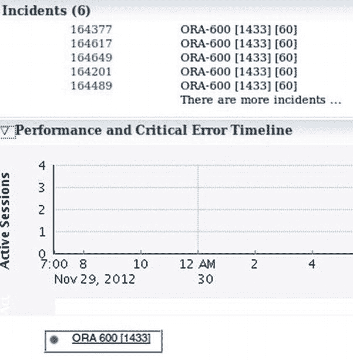

图 4-55. 事件发生情况

### 目标状态与通知控制

“控制”子菜单为您提供两项基本功能，应适用于所有目标类型（参见图 4-56）。第一项是能够简单地使用目标特定的适当程序来启动或停止受管目标。然而，紧接其下的是设置或管理“维护窗口期”的功能。`维护窗口期`是一个预定义的时段，在此期间正常的监控和告警将被暂停，并且可选择在此期间不运行管理任务。维护窗口期功能允许您考虑计划内的停机时间（例如，为每月操作系统安全补丁应用），避免在托管主机关闭和重启时收到大量目标状态变更告警通知。

图 4-56. “控制”子菜单

点击`创建维护窗口期`将打开“创建维护窗口期”向导，如图 4-57 所示。如您所见，维护窗口期功能相当广泛，可应用于复合目标（最常见的是一个主机及其上运行的所有目标）。

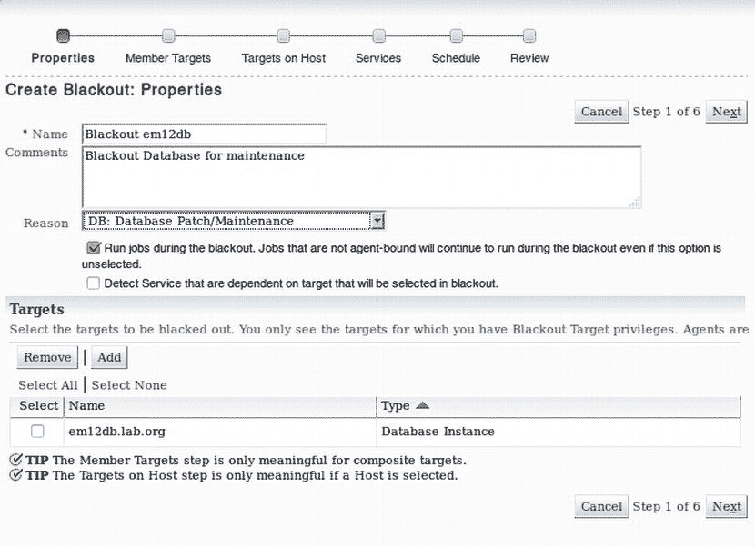

图 4-57. “创建维护窗口期”欢迎屏幕

 `提示` 不要使用维护窗口期来隐藏您不想或不知道如何调查的告警。这`总是`会导致您错过本应处理的重要告警。请仅将维护窗口期用于计划内的维护。

### 日志审查

目标类型菜单还提供了一个便捷的 `日志` 子菜单，用于查看与各种目标相关的系统日志（参见 图 4-58）。该菜单本身对所有目标都是通用的，但可用的详细程度取决于目标的性质和插件设计者。例如，对于数据库，`日志` 子菜单允许您访问并查看 `alert.log` 文件，审阅所有记录的错误，并管理跟踪文件。

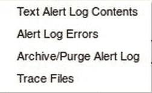

图 4-58. 数据库诊断日志访问

相比之下，Web 服务器目标仅提供一个单一的 `日志` 选项，允许您根据条件搜索和查看日志消息（参见 图 4-59）。

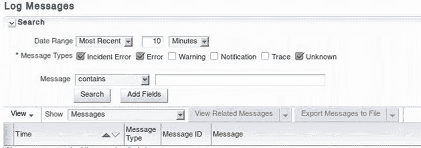

图 4-59. 搜索应用服务器日志

### 目标设置

您肯定会花费一些时间的地方是 `目标设置` 子菜单，如 图 4-60 所示。在这里，您将配置监控凭据和有关目标的元数据，这些数据可用于分组和访问控制。

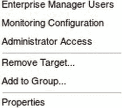

图 4-60. 目标设置子菜单

要配置用于监控目标的帐户，请选择 `监控配置`。实际提供的详细信息因目标类型而异。图 4-61 显示了数据库目标的配置屏幕。如您所见，您需要输入监控帐户详细信息（对于数据库，包括 `用户名`、`密码`、`端口`、`角色` 和 `SID/服务名称`）。

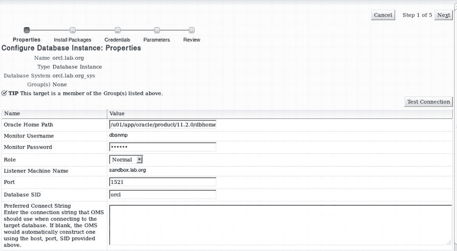

图 4-61. 必需的数据库监控详细信息

类似地，对于其他目标，您很可能需要各个目标监控基础架构的名称、密码和端口。

### 自定义

Cloud Control 设计为可根据单个管理员的需求进行定制，您首次登录时就会感受到这一点。登录后，您将看到一个页面，该页面为您提供机会，根据多个预定义的工作角色之一来选择主页。本书的大多数读者可能希望从两个选项中选择一个。如果您主要担任数据库管理员或开发人员，您可能会选择 `数据库` 页面。如果您从事运维或支持工作，您可能希望从 `事件` 页面开始，该页面专注于为企业中管理运维事件的员工设计。

 **注意** 您在此阶段不必选择任何主页，我们建议您不要选择。相反，请审阅所有可用页面，以找到适合您角色的起点。然后，您可以在稍后更具体地定制您的主页。

由于本书的主要读者是数据库专业人员，除非另有说明，我们将以数据库特定页面为例重点介绍本节内容。但是，此处所述的内容适用于整个产品。图 4-62 展示了数据库目标的主页。

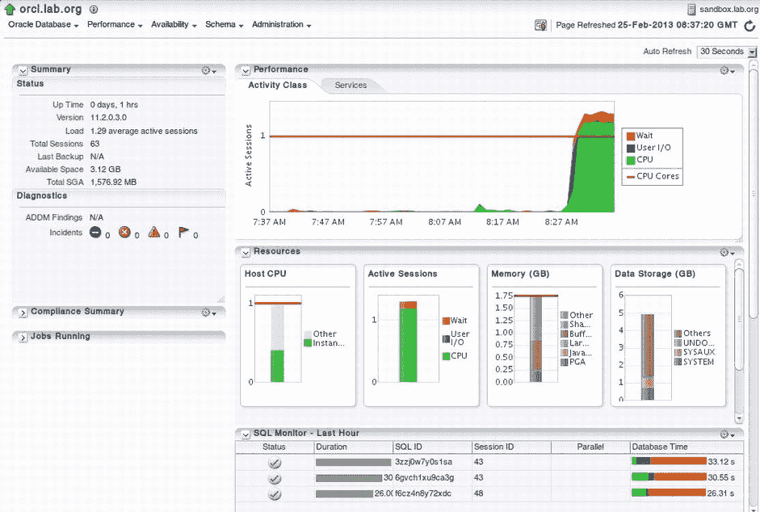

图 4-62. 数据库主页

Enterprise Manager 中的每个页面都划分为多个区域。每个区域都可以由最终用户进一步定制。作为一个例子，我们将以 `数据库摘要` 区域为例，并删除不是很有帮助的合规性摘要。

要开始自定义，请点击位于页面右上角、上次刷新时间旁边的 `个性化此页面` 图标（参见 图 4-63）。这将向页面添加菜单，允许您自定义页面和每个区域。在这种情况下，点击 `摘要` 区域右上角的扳手图标。

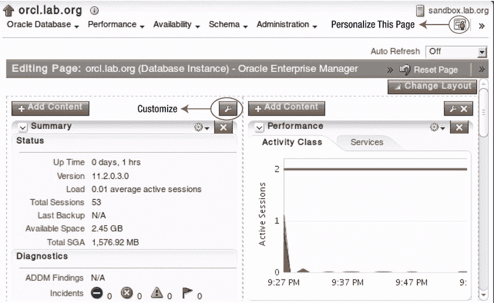

图 4-63. 处于编辑模式的主页

然后，您将看到一个类似于 图 4-64 的自定义对话框。我们只是从视图中删除了 `合规性摘要` 部分，但您可以尝试使用各种可用的样式和显示选项，以根据公司标准或个人喜好显著地个性化该页面。

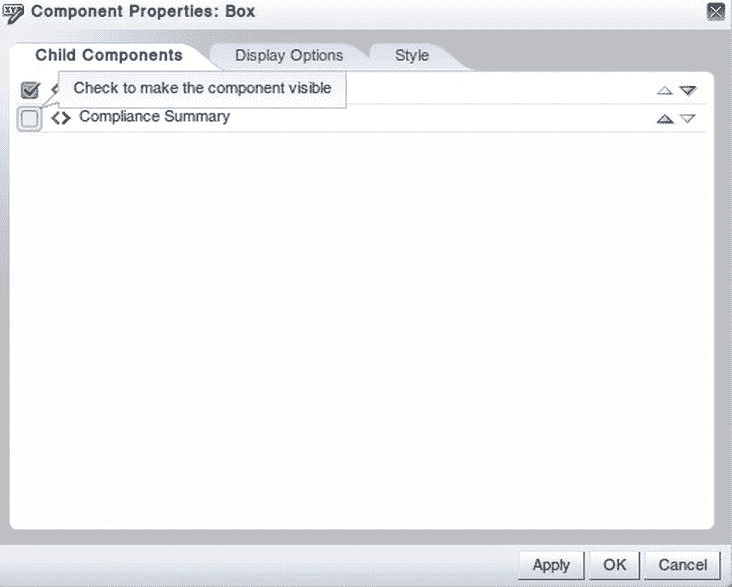

图 4-64. 自定义摘要组件

您应该意识到，自定义页面的选项取决于提供该页面的插件。因此，对于表面上类似的区域，确切的定制选项可能会有所不同。

## 小结

本章向您介绍了新界面以及为了获取 Enterprise Manager 产品的可管理性优势而需要掌握的一些基本任务。您了解了 `云控制`、`导航` 和 `目标管理` 菜单的作用。在此过程中，您学习了如何设置 Enterprise Manager 安全性、设置与 My Oracle Support 的强大集成以及配置通知。您简要浏览了导航功能。最后，您了解了目标设置功能，并学习了如何配置监控和查看诊断日志。

