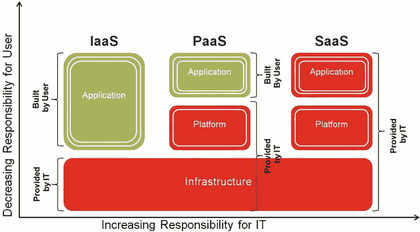

# 第 5 章

## 云生命周期管理

作者：Bobby Curtis 和 Anand Akela

Oracle Enterprise Manager 12c 云控制致力于为动态业务需求提供更强的适应性、显著的运营效率和更低的整体运营成本。为了让组织实现这些目标，我们需要一个全面且完整的管理解决方案。没有 EM12c 的云生命周期管理组件，这些承诺就无法实现，企业可能无法从其云计算基础设施中获得最大价值。云生命周期管理中的组件使组织能够灵活调整其架构，并从扩展的资源中获取更大的业务价值。云生命周期管理涵盖的工具包括以下内容：

*   `自助服务门户`：允许管理员配置云并执行各种操作，例如定义与云关联的策略、将云暴露给用户、决定每个用户可预留的总资源量以及定义系统策略。
*   `费用分摊`：允许企业组织将信息技术资源的成本分配给消耗这些资源的人员、部门或组织。
*   `整合规划器`：允许企业组织将受管服务器映射到整合资源（例如 Oracle Exadata 或 Oracle 虚拟机），并使用存储在 Oracle Management 存储库中的指标和配置数据来规划整合。

在我们深入探讨使用 EM12c 的这些云生命周期管理工具之前，让我们回顾一下云计算到底是什么。

## 什么是云计算？

虽然您可以找到许多关于云计算的定义，但美国国家标准与技术研究院（NIST）在 2011 年 9 月发布了最完整和最可信的定义之一。¹

根据美国国家标准与技术研究院（NIST）的定义，“云计算是一种模型，用于实现对可配置计算资源（例如，网络、服务器、存储、应用程序和服务）共享池的泛在、便捷、按需网络访问，这些资源能够通过最少的管理工作或与服务提供商的交互而快速配置和释放。”

在本节中，我们将为这个总体定义补充一些细节。首先，我们将回顾云计算的基本特征。然后，我们将了解基本的云计算服务和支持的部署模型。

## 基本特征

根据 `NIST` 的定义，云计算具有五项基本特征。让我们详细了解一下每一项：

*   `按需自助服务`：云消费者应能够按需使用云服务，无需与云服务提供商进行人工交互。
*   `广泛的网络访问`：云服务应通过网络和各种常用接口（例如，Web、移动设备、软件客户端等）进行访问。
*   `资源池化`：云提供商将计算资源汇集起来，以高效地服务多个消费者。
*   `快速弹性`：云服务应能弹性地配置和释放，以满足业务需求。
*   `可衡量的服务`：应监控云资源的使用情况，并可进行报告，用户可能为其所使用的服务付费。

`NIST` 的定义还列出了三种 `服务模型`（软件、平台和基础设施）和四种 `部署模型`（私有、社区、公共和混合），这些模型结合起来对提供云服务的方式进行了分类。这些将在后续章节中讨论。

## 服务模型

对于任何企业组织而言，要使云计算成为一个可行的选项，该组织需要选择提供哪种服务模型。`服务模型` 是一种可用于满足特定需求的方法。在云架构中，可以使用三种主要服务模型——软件即服务（`SaaS`）、平台即服务（`PaaS`）和基础设施即服务（`IaaS`）：

*   `软件即服务 (SaaS)`：在此模型中，云服务的消费者使用软件应用程序。消费者不管理或控制底层的任何基础设施，包括网络、服务器、应用服务器、操作系统、存储，甚至单个应用程序功能，可能仅限于有限的用户特定应用程序配置设置。`SaaS` 的例子包括由 Yahoo!、Google 和其他供应商提供的基于 Web 的电子邮件服务。
*   `平台即服务 (PaaS)`：在此模型中，云的消费者利用云提供商提供的软件平台（包括数据库、中间件、编程语言、库、服务和工具）来构建和操作最终用户应用程序。消费者不管理或控制软件平台或底层基础设施（包括网络、服务器、操作系统或存储），但可以控制已部署的应用程序以及可能的应用程序托管环境配置设置。`PaaS` 的例子包括 Google Apps，它使客户能够在移动办公的同时使用一个平台进行工作。
*   `基础设施即服务 (IaaS)`：在此模型中，`IaaS` 云的消费者负责管理软件平台（数据库、中间件、工具等）以及开发和操作最终用户应用程序。消费者不管理或控制底层云基础设施，但可以控制操作系统、存储和已部署的应用程序，并可能对选定的网络组件（例如，主机防火墙）有有限的控制权。Amazon Elastic Compute Cloud 为开发人员提供服务器和数据库，是 `IaaS` 的一个例子。

## 部署模型

除了描述服务模型外，`NIST` 还列出了部署云服务的四种模型。让我们快速了解一下：

*   `公共云`：云提供商构建和运营云基础设施，供公众使用。该基础设施位于云提供商的场所，提供商管理消费者的访问控制和潜在的按使用付费模型。
    *   示例：Box 和 Dropbox 向公众提供一定数量的免费在线存储，并对超出该限制的存储收费。
*   `私有云`：云基础设施为单个组织内的业务线或分支机构专属使用而配置。通常由该组织的 IT 部门构建和运营私有云（或企业私有云）。
    *   示例：Oracle Global IT 为全球 Oracle 员工提供开发和测试云基础设施。但在某些情况下，云基础设施可能由第三方供应商拥有和运营，该供应商专门为单个组织管理私有云。
*   `社区云`：云基础设施为具有共同目标和关注点的组织中的特定消费者社区专属使用而配置。
    *   示例：许多联邦和州组织通过云基础设施共享资源。
*   `混合云`：组织可能决定将某些关键应用程序和数据部署在其私有云中，而将其他应用程序部署在公共云中。如果私有云中的应用程序遭遇灾难或需求激增，组织可能会决定暂时将其部分工作负载迁移到公共云。在峰值负载期间从私有云临时扩展到公共云的过程称为 `云爆发`。混合云基础设施是私有云和公共云（和/或社区云）的组合，通过标准或专有技术连接以实现数据和应用程序的可移植性。

## 企业私有云

本章的其余部分将重点介绍由 `EM12c` 管理的企业私有云基础设施。但是，公共、社区或混合云基础设施提供商也可以决定使用 `EM12c` 来管理其整个云生命周期。例如，Oracle 使用 `EM12c` 来管理其公共的 Oracle Cloud。

如前所述，企业的 IT 部门通常成为负责企业私有云及其相关部署模型的云服务提供商。

如 图 5-1 所示，业务部门中的云用户当他们从 `IaaS` 横向移动到 `PaaS`，然后再移动到 `SaaS` 时，会获得更多价值。企业内的 `IaaS` 云用户负责数据库、中间件以及在其 IT 部门提供的云基础设施之上开发和操作最终用户应用程序。如果 IT 部门提供 `PaaS`，云用户将仅负责其应用程序的开发、测试和操作，而 IT 则负责软件平台及其底层基础设施的管理和操作。与 `IaaS` 模型相比，企业 IT 部门在建立 `PaaS` 或 `SaaS` 模型时将会有更多的前期投资。

图 5-1. 在企业私有云中部署的云服务模型

到目前为止，您已经了解了云计算的概述、其关键特性以及其交付和部署模型。尽管云计算提供了极高的效率、灵活性和成本节约，但只有当企业能够跨整个技术栈管理完整的云生命周期时，企业私有云的效益才能最大化。让我们详细了解一下云生命周期，看看 Oracle Enterprise Manager 如何帮助完全控制该生命周期的各个阶段。

## 完整的云生命周期管理

