# Oracle Enterprise Manager 云生命周期管理

为了从云基础设施中获得最佳价值，对云生命周期所有阶段的各种活动进行端到端管理和自动化工作流至关重要——从规划和设置云，到最终用户自助式配置和取消配置应用程序，再到对云资源使用的计量和收费（参见图 5-2）。

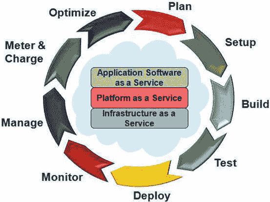

**图 5-2. 完整的云生命周期**

EM12c 帮助您从单一工具管理整个云生命周期。让我们更详细地看看这个生命周期的各个阶段。

## 规划云

从现有 IT 基础设施迁移到云本质上是变革性的。它需要广泛规划，以考虑各种设计和操作标准，确保云基础设施的成功部署和运行。

首先，您需要确定环境中的所有应用程序和基础设施资产。您还需要理解它们之间的关系，以便决定哪些保持原样，哪些需要更新，哪些需要淘汰。在迁移到云之前或作为迁移的一部分整合应用程序和底层基础设施，被认为是行业最佳实践。多年来，数据中心积累了过多的服务器，它们占用机架空间，消耗大量电力用于冷却，并需要系统维护（例如打补丁），其中许多服务器未被充分利用。

EM12c 提供了自动化功能，允许 IT 部门发现现有的应用程序和基础设施资产以及它们之间的关系。这个数据中心的蓝图为云转型规划提供了基线。此外，EM12c 提供了一个名为 `Consolidation Planner` 的工具（本章稍后将详细讨论），它可以基于存储在 `OEM` 仓库中的使用数据和未来整合平台的预计能力，模拟各种整合场景。在图 5-3 所示的示例中，正在分析在七台服务器上运行的数据库，以整合到一个 Oracle Exadata 四分之一机架中。

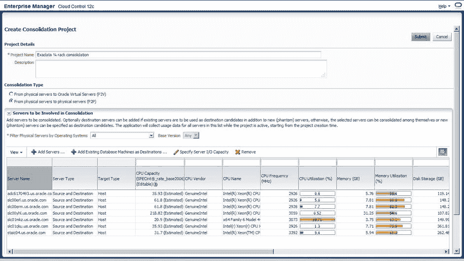

**图 5-3. Oracle Enterprise Manager Consolidation Planner**

`Consolidation Planner` 工具的建议也可以考虑技术和功能约束——例如，生产环境和测试环境不能共置。通过 `Consolidation Planner`，公司的 IT 部门可以识别未充分利用的服务器，并找到整合它们的方法，以尽可能多地释放资源，同时维持当前的服务水平。这种精细的场景规划可以缓解许多云转型风险。您可以确信应用程序在整合后会运行良好。本章稍后将更详细地讨论 `Consolidation Planner`。

在规划阶段，您还需要选择与企业的业务需求最匹配的云服务交付模型（即 IaaS、PaaS 或 SaaS）。当您的业务部门不一定拥有标准化的应用程序开发平台，而只是希望 IT 为其多样化的应用程序和开发环境提供计算基础设施时，IaaS 可以是一个很好的起点。正如我们之前讨论的，企业可以通过向企业用户交付 PaaS 云来获得更多价值。云用户可以专注于在企业私有 PaaS 上开发、测试和部署他们的应用程序，而将运维工作委托给 IT。企业可以在最大化组件重用、灵活性和控制的同时，受益于增强的安全性和合规性。

## 设置云

在您基线化 IT 资产、决定作为云转型的一部分进行升级或淘汰的内容，并最终确定云服务交付模型后，您需要设置和配置云。这不仅需要在现有 IT 基础设施前添加一个自助服务门户，还需要设置广泛的网络访问、资源池、快速弹性和计量服务。您不仅设置虚拟化基础设施，还可以在物理基础设施中池化资源。例如，您可以在运行在 Oracle Exadata 系统之上的 PaaS 云中进行数据库整合。

为了适应各种云服务（DBaaS、MWaaS 或 IaaS），Oracle Enterprise Manager 支持丰富的云资源模型——从应用程序到存储基础设施中的磁盘，涵盖物理和虚拟化基础设施。您可以创建区域（zone），这是云基础设施所需的一组资源的逻辑分组。例如，MWaaS 用户只关心中间件区域或域，而不必担心底层基础设施。您可以在使用 Oracle Enterprise Manager 的自助服务门户时，根据组织结构、区域或企业选择的任何标准来设置区域。EM12c 支持管理程序和操作系统的裸机置备。在云设置过程中，Enterprise Manager 还可以帮助集成来自 F5 Networks、NetApp、Hitachi 和 Fujitsu 等供应商的最佳网络和存储技术。让我们逐步了解 IaaS 的设置过程。

您通过选择机器大小开始设置 IaaS 云。如图 5-4 所示，您也可以添加自定义机器大小以满足您的业务需求，并为您的云选择该大小。

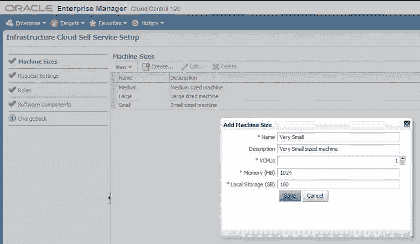

**图 5-4. 添加自定义机器大小**

选择机器大小后，您可以为 IaaS 用户定义基础设施请求的设置。如图 5-5 所示，您可以指示是否可以保留云资源、资源可以请求多长时间、是否应配置管理代理等等。

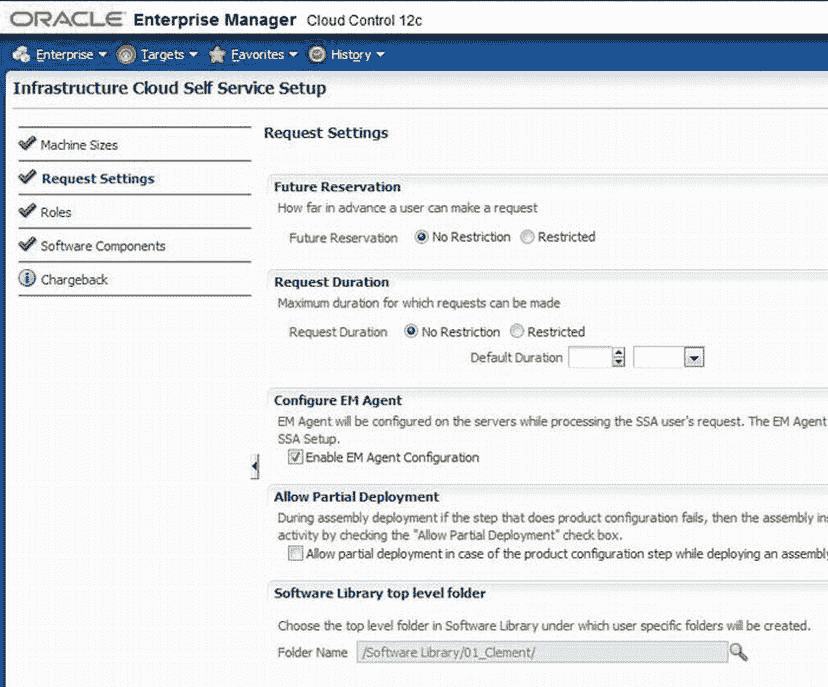

**图 5-5. 为请求定义设置**

您还可以创建和选择用户角色，并为这些角色设置访问控制。如图 5-6 所示，您可以为角色分配配额、区域和网络配置文件。

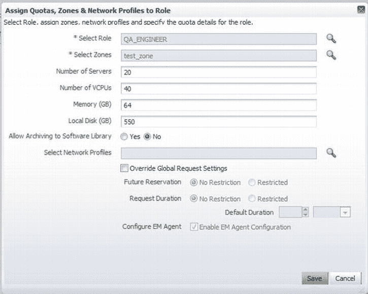

**图 5-6. 配置角色**

您还可以在设置基础设施时向其中添加软件组件。最后，您可以在设置阶段为基础设施资源设置收费和计量参数，并发布基础设施云资源供云用户使用。除了此处展示的基础设施云示例外，Oracle Enterprise Manager 还可以帮助开箱即用地设置数据库或中间件云。

在云设置阶段可能存在不同的管理任务和角色。云管理员可以是设置云基础设施（包括系统、数据库或作为服务提供的任何其他云资源）的人。自助服务管理员可以是业务部门或其他云租户的管理员，他们为其用户设置配额和角色。

与云管理员相关的一些典型任务包括：置备裸机管理程序、配置存储阵列和网络、创建服务器池，以及根据功能和操作边界定义区域。他们还为云用户配置软件库的策略和访问控制。

自助服务管理员定义允许的虚拟机（VM）大小，为用户/角色分配配额，定义访问边界，将角色映射到区域，设置分摊计费计划，并为云的自助服务用户准备可供部署的软件。

`EM12c` 开箱即用地支持这些典型角色及其常见活动。正如你在图 5-6 中所见，在通过`自助服务`门户进行云设置的过程中，这些用户角色和策略可以根据需要进行定制。云、用户角色和策略的定制设置有助于根据云服务模型自动化资源调配。`自助服务`门户用于调配资源的相同自动化技术，也可通过名为`EMCLI`的命令行 API（本书不作讨论）使用。

## 构建云

在你的云管理员设置好共享资源后，业务单元或其他云用户组织中的自助服务管理员将需要构建完整的基础设施，他们最终将在此部署其业务应用程序。

通常，IT 部门设置硬件基础设施。数据库管理员（DBA）部署数据库。各种应用团队构建、测试和部署他们的应用程序。一个跨职能团队将它们连接起来，使所有部分协同工作。应用组件之间的依赖关系和部署约束（例如，数据库和中间件应位于不同的网段）可能使这项任务变得更加困难。

`EM12c` 和 Oracle Virtual Assembly Builder (`OVAB`) 解决了这一挑战。图 5-7 展示了将多层应用程序打包成一个程序集并使其可供部署的步骤。

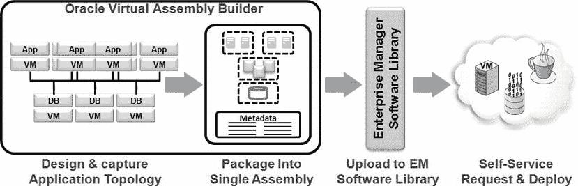

图 5-7. 为部署而打包多层应用程序的步骤

使用`OVAB`，应用开发人员和架构师可以图形化地建模应用程序拓扑，定义所有依赖关系和部署约束，并将整个应用程序打包成我们称为`应用程序程序集`的形式。然后，这些程序集可以上传到企业管理器中集中的软件库，以供自助部署使用。一个完整的多层应用程序（包括各种应用组件、中间件软件、数据库、操作系统以及包含它们的虚拟机）可以打包在一个程序集中。然后，该程序集被发布到企业管理器软件库，如图 5-8 所示，并通过企业管理器的`自助服务`门户提供给云用户进行部署。这可以将应用程序部署所需的时间从数月、数天缩短到数小时、数分钟。由此产生的软件栈标准化最大限度地降低了合规风险和运营停机时间。

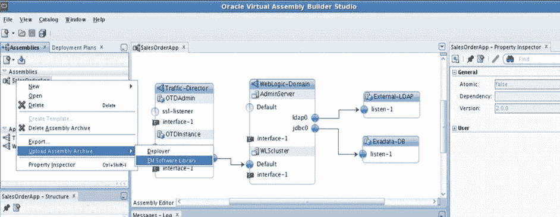

图 5-8. 将程序集上传到企业管理器软件库

Oracle 计划为其所有产品提供程序集，这将允许你只需点击几下即可部署任何 Oracle 产品，包括打包的应用程序。Oracle Enterprise Manager 可以在有新的程序集可用时通知你，如果你感兴趣，可以下载它们。

## 在云中测试

应用程序，无论是作为程序集的一部分还是独立存在，在部署到生产环境之前都需要进行测试。应用程序需要针对功能以及潜在高负载下的性能进行测试。Oracle Enterprise Manager 12c Application Testing Suite 包含 Oracle Functional Testing、Oracle Load Testing 和 Oracle Test Manager，为你的 Oracle 应用程序、中间件和数据库提供全面的测试解决方案。

在将应用程序部署到生产环境之前，在全负载下进行测试至关重要，以确保应用程序在其活动高峰期能够处理该负载。Oracle Enterprise Manager 的负载测试工具允许你使用不同模块并发用户的不同组合来模拟高负载。负载测试的结果以图形化报告的形式呈现，类似于图 5-9 所示。

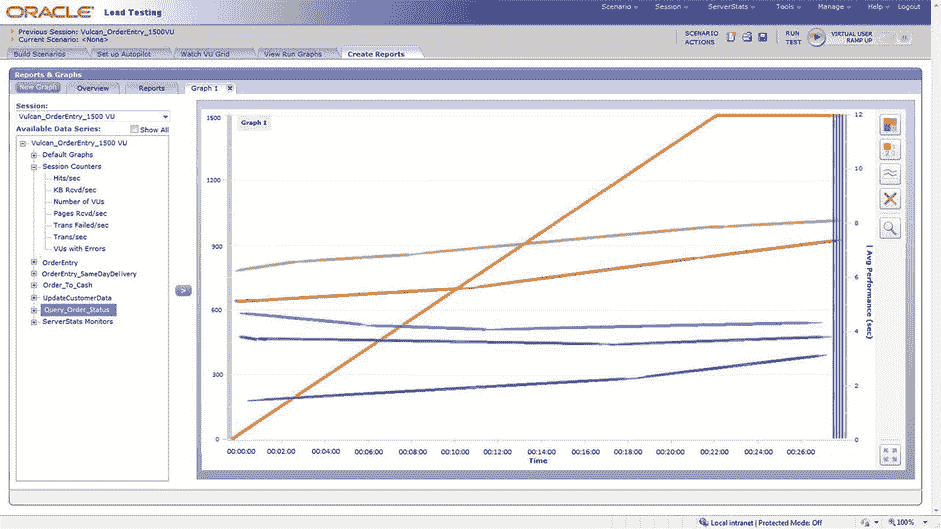

图 5-9. Oracle Enterprise Manager 负载测试报告

该测试解决方案的一个独特之处在于能够捕获生产负载并在测试环境中重放，从而允许你使用真实的生产工作负载来测试你的应用程序。这项技术作为`Oracle Real Application Testing`功能已随 Oracle 数据库提供了一段时间。`EM12c` 引入了一个用于自动化应用程序测试的类似解决方案，称为`Application Replay`。与传统的应用程序测试工具不同，`Application Replay` 使用真实的生产工作负载对被测应用程序生成负载，无需任何脚本开发或维护。它为你所有的 Web 和打包的 Oracle 应用程序验证应用程序基础设施变更提供了一种最佳实践方法。

测试数据管理在云环境中至关重要，但常常被忽视。当你允许用户通过自助门户按需供应应用程序和数据库时，保护关键和敏感数据非常重要。Oracle Enterprise Manager 测试套件的数据屏蔽功能可以发现数据模型的相互依赖关系，并“屏蔽”任何敏感信息以保护它。还为 Oracle E-Business Suite 和 Fusion 应用程序提供了包含预定义敏感列和屏蔽格式的数据屏蔽模板。

`EM12c` 的数据子集化功能让你能够创建包含应用程序数据子集的较小数据库，这些子集在关系上保持一致，因此你只需使用生产数据的一小部分即可进行真实的测试和开发。

Oracle Enterprise Manager 测试套件还利用了构建在技术层中的深度诊断能力，并提供了修复建议。所有这些测试功能确实可以帮助你最小化部署在云中的应用程序的停机风险。

## 部署云

在构建、测试并将应用程序发布到企业管理器软件库之后，它们就可以通过`EM12c`的`自助服务`门户进行部署了。根据 NIST（美国国家标准与技术研究院），按需自助服务是云的五个关键特性之一。它提供了一个抽象层，向最终用户隐藏了云平台底层的复杂性。

`EM12c`中开箱即用的`自助服务`门户（如图 5-10 所示）允许云用户部署广泛的云服务。云用户可以在云平台上部署数据库、Java 应用程序或完整的应用程序程序集，这些服务列在服务目录中，目录显示了企业管理器软件库中发布的所有内容。对于部署请求，用户可以指定其应用程序所需的底层资源（CPU、内存、数据库、`WebLogic`域等），企业管理器将自动供应这些资源。自助服务用户还可以根据计划或性能指标定义策略。

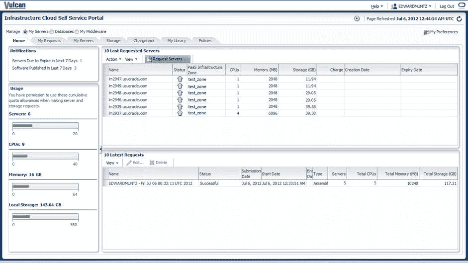

图 5-10. Oracle Enterprise Manager 的`自助服务`门户

除了通过`自助服务`门户部署外，云用户还可以使用 Oracle Enterprise Manager 命令行 API 来部署应用程序或应用程序程序集。

## 监控云

### 云监控

云基础设施构建完成并部署应用程序后，需要在持续运行期间监控应用程序及底层云基础设施。`Oracle Enterprise Manager` 帮助企业监控完整的云堆栈，从应用程序到存储磁盘，如图 5-11 所示。

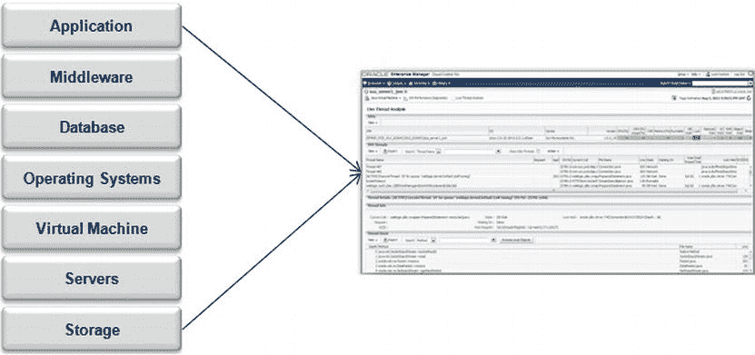

图 5-11. `Oracle Enterprise Manager` 对完整云堆栈的监控

应用程序和底层基础设施需要从不同层级、由我们之前讨论过的不同云角色进行监控。表 5-1 总结了 `Oracle Enterprise Manager` 不同用户执行的监控任务。

表 5-1. 用户角色及其监控任务

| 角色 | 监控任务 |
| --- | --- |
| 云管理员 | 监控云请求 监控整体云服务的运行状况 监控补丁 跟踪合规性 |
| 自服务管理员 | 监控应用程序 SLA 监控业务交易和指标 监控终端用户体验 |
| 自服务用户 | 监控自己的请求 监控自己的应用程序、虚拟机、数据库 监控配额、计费等 |

云管理员（云基础设施的管理员）使用 `Oracle Enterprise Manager` 来跟踪资源变动、租户、策略违规和其他事件，从而监控整个“从应用程序到磁盘”云堆栈的运行状况。`Oracle Enterprise Manager Incident Manager`（如图 5-12 所示）为云管理员提供了一个单一界面，可用于查看、管理、解决和跟踪其监控环境中发生的所有类型的问题。第 12 章将更详细地介绍 `Incident Manager`。

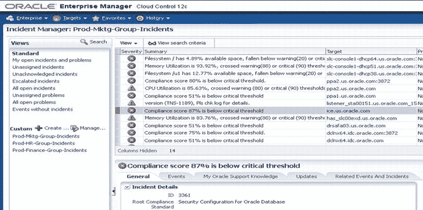

图 5-12. `Oracle Enterprise Manager Incident Manager`

此外，云管理员持续监控请求和故障率，并识别潜在的性能瓶颈以进行修复。云管理员可以通过使用管理组来自动监控云目标，这些组定义了动态标准来对云目标进行分组，并自动分配监控设置和策略。这些组可以根据位置、部门、测试或生产等属性创建。

自服务管理员（他们管理业务线应用程序所有者使用的公共资源）负责监控应用程序堆栈、基础设施上的服务级别和依赖关系、终端用户体验以及许多其他领域。

自服务用户或应用程序所有者则监控其托管在云环境中的自身应用程序的运行状况和配额方面。他们可以对已配置的资源（包括虚拟机、主机和数据库）执行基本监控，也可以监控终端用户的应用程序体验。

第 7 章提供了监控和管理阶段的更多细节和最佳实践。

### 云管理

你刚刚了解了云监控，这是一个了解应用程序和底层云基础设施状态的过程。监控通常会产生不相关的数据集。*云管理* 是一套功能和流程，它利用这些数据为云基础设施和部署在云中的应用程序提供预期的目标。它涉及管理和分配云资源以产生有用的成果。

`EM12c` 提供了全面的云堆栈管理和业务驱动的应用程序管理功能。`Enterprise Manager` 的方法是摆脱拼凑和零散的解决方案，将管理嵌入到核心解决方案中，并为管理整个堆栈提供一个完整的、统一的、集成的解决方案。通过 `EM12c`，你拥有对整个基础设施堆栈（包括性能管理、配置管理以及诸如配置和打补丁等自动化生命周期操作）的单一控制点。

`Enterprise Manager` 的另一个重要方面是，在管理 `Oracle` 软件时，它提供了无与伦比的深度。`Oracle` 为其驱动云的产品设计和内置了可管理性。新的 `Enterprise Manager` 功能与 `Oracle` 产品一起开发和测试，以确保它们降低复杂性、增强自动化、优化性能并提高云环境的可用性。

`Oracle Enterprise Manager` 使你能够构建和管理一个为 `Oracle` 应用程序优化的云，这些应用程序驱动着你的许多业务流程和服务。许多自定义应用程序是使用 `Oracle` 中间件解决方案构建的；由 `Oracle Enterprise Manager` 驱动的云不仅可以运行你的关键任务应用程序，还可以让你深入了解这些应用程序提供的业务服务。我们将这种方法称为*业务驱动的应用程序管理*，它具有三个关键能力：

*   *用户体验管理* 帮助你监控业务用户的体验。`Oracle Enterprise Manager Real User Experience Insight` 监控网络流量，提供关于你的用户是谁、他们在哪里、他们在做什么以及他们是否获得了所需服务级别的完整而准确的视图。此解决方案适用于自定义和打包的应用程序。针对 `Oracle` 应用程序的开箱即用型预构建知识模块，使你能够快速监控业务流程和活动。图 5-13 显示了 `Oracle Enterprise Manager Real User Experience Insight` 的仪表板。

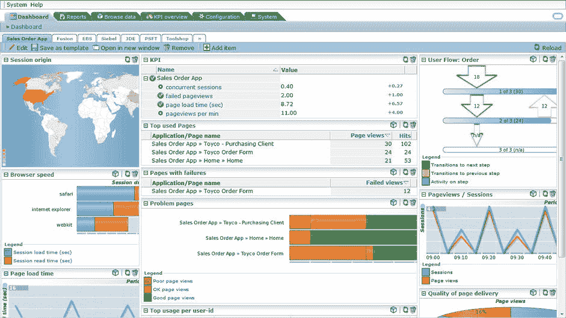

图 5-13. `Oracle Enterprise Manager Real User Experience Insight`

*   *业务交易管理* 让你能透视在应用程序中跨多个组件执行的交易。如果你的应用程序作为组合在云中部署，`Enterprise Manager Business Transaction Manager` 可以让你透视跨该组合各个组件的交易。它甚至可以监控使用外部服务的跨组合或应用程序组件的交易。图 5-14 显示了 `Business Transaction Manager`。

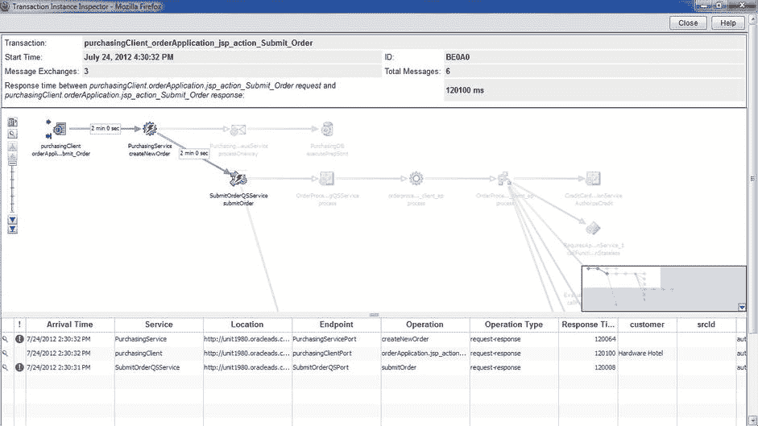

图 5-14. `Oracle Enterprise Manager Business Transaction Manager`

*   *业务服务管理* 帮助监控、诊断和管理你的交易正在执行的跨服务生命周期。这些服务可能开发于许多技术组件之上，而 `Oracle Enterprise Manager` 支持所有这些组件。`EM12c` 引入了创建复合应用程序（如图 5-15 所示）的能力，它代表了你的应用程序环境的所有系统组件。这增强了端到端业务服务管理的能力。

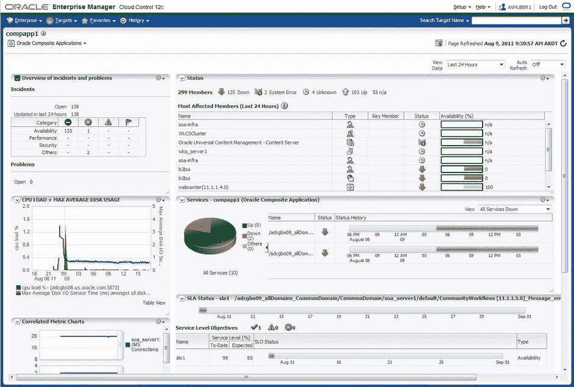

图 5-15. `Oracle Enterprise Manager Business Service Manager`

## 计量与计费

云的关键特性之一是能够衡量云资源的使用情况，并报告或可能对已使用的服务进行计费。虽然云和自助访问带来了很大的灵活性和敏捷性，但它们也带来了一些挑战。

当云用户开始共享云平台或基础设施资源时，您需要对资源的使用情况进行问责；否则，资源可能会被部分用户过度使用，而其他用户在需要时却无法获得资源。为了缓解这种情况，企业需要衡量资源使用情况，并可选地向租户进行费用回收。尽管 IT 组织可能不会实际向其业务部门收费，但用量报告提供了一个透明的机制，用于预算资源并持续优化云平台。

## 理解计量与收费

EM12c 提供了一个复杂而灵活的计量与收费机制，您可以基于固定成本、配置（如版本、许可证）或利用率，或这些因素的组合来定义模型（参见图 5-16）。此功能使您能够在不同级别（例如，主机/虚拟机级别、数据库和中间件）计量资源。它与`LDAP`集成良好，因此您可以遍历组织层级结构，并在各个级别生成消耗报告。

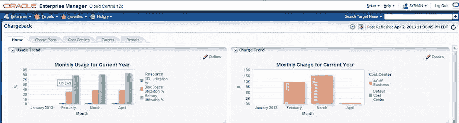

图 5-16. EM12c 收费控制台

这些报告中的信息通常对企业管理器用户以外的人员（如业务部门经理或财务部门人员）很有用。因此，提供了与 BI Publisher 的开箱即用集成，以便这些报告可以与各种用户共享。BI Publisher 可以按计划生成这些报告，并以 `PDF`、`HTML` 和 Microsoft Office 等多种格式共享。然后，如果任何组织想要为租户/消费者生成账单，资源使用数据可以输入到 Oracle Billing and Revenue Management 等计费工具中。

现在您已经了解了什么是计量与收费、它的用途以及可用的功能。但是管理员如何设置此选项并开始使用这些高级功能呢？

## 安装收费插件

要设置计量与收费，您必须在管理服务器上部署一个插件，然后定义六个任务。本节将讨论插件部署和定义的任务。

要访问插件，请从屏幕右侧选择 `Setup`  `Extensibility`  `Plug-ins`。这将带您进入如图 5-17 所示的页面，其中列出了所有可用的插件。

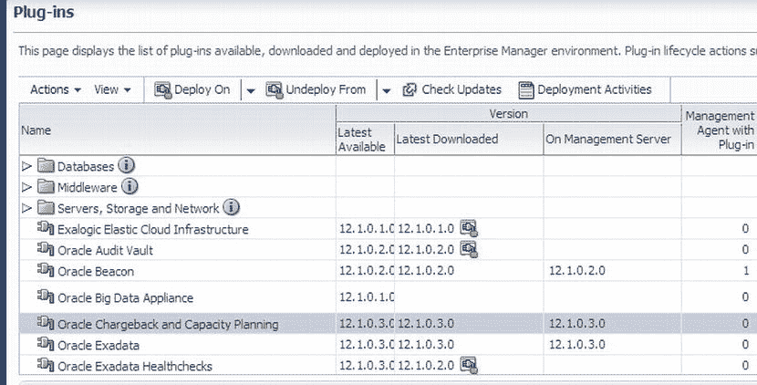

图 5-17. Oracle 收费与容量规划插件可用性

要部署 Oracle 收费与容量规划插件，您需要知道仓库 `SYS` 密码。提供密码并继续部署（参见图 5-18）。

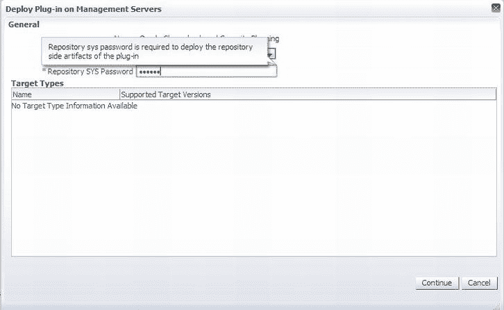

图 5-18. 为部署提供仓库 `SYS` 密码

 **注意**  如果插件部署在管理服务器上，部署将需要停机时间。在部署之前，请确保您已备份仓库和管理服务器的配置。您将看到类似以下的消息。

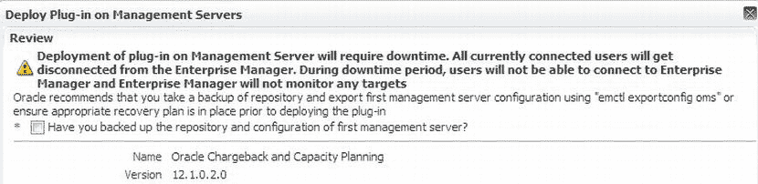

在您选择确认已备份仓库和管理服务器的复选框之前，您将无法进行部署。

部署完成后，企业管理菜单上会显示两个新菜单项：`Chargeback` 和 `Consolidation Planner`（参见图 5-19）。这意味着插件部署成功，您现在可以使用与收费插件相关的功能。您还会注意到，合并规划器的功能也已启用；本章稍后将讨论此功能。

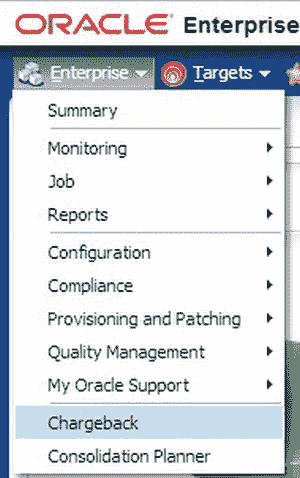

图 5-19. `Chargeback` 和 `Consolidation Planner` 的企业菜单选项

## 配置计量与收费

一旦 EM12c 中启用了收费功能，就该关注成功设置环境收费所需的六个任务了：

1.  定义收费计划。
2.  创建成本中心。
3.  添加用于收费的目标。
4.  将成本中心分配给目标。
5.  将收费计划分配给目标。
6.  配置收费设置。

此过程的第一步是定义应使用的收费计划。收费计划有两种类型：`通用`和`扩展`。`通用收费计划`使用三个基本指标来计算资源消耗：CPU、内存和存储。`扩展收费计划`通过包含特定于目标的指标来确定使用率，从而增强了此模型。

要确定合适的收费计划，您必须根据具体情况决定`通用收费计划`（CPU、内存和存储）是否足以满足组织的需求。如果需要的指标超过核心的三个，则应应用`扩展收费计划`。

要定义收费计划，请选择 `Enterprise`  `Chargeback` 以访问收费界面中的“收费计划”选项卡。对于`通用收费计划`，通过突出显示然后编辑指标，可以轻松设置收费费率（参见图 5-20）。可以在`通用收费计划`下方立即创建或编辑`扩展收费计划`。

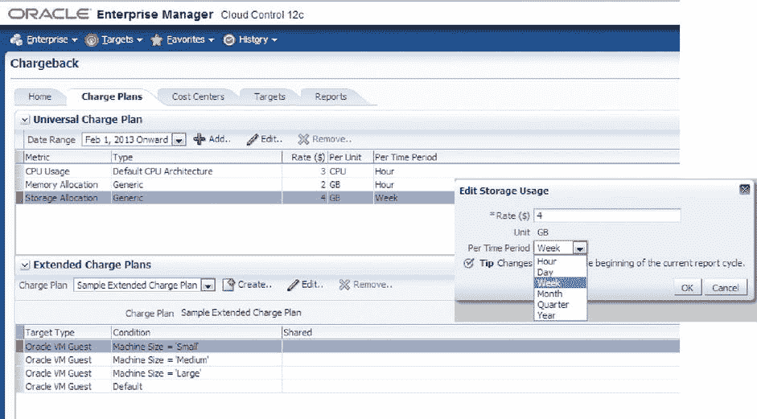

图 5-20. `通用`和`扩展`收费计划可在收费计划配置界面的同一屏幕上编辑

配置收费的下一步是为组织设置成本中心。`成本中心`是用于汇总费用的载体。成本中心可以是个人、组织内的部门，或一个将费用分摊到整个企业的多层业务层级。要创建业务层级，请设置成本中心并将用户分配给业务单元。此外，可以通过从`LDAP`服务器导入组织的层级结构来实现业务层级。

要添加成本中心，请单击“成本中心”选项卡，然后单击“添加”按钮。这将打开“新建成本中心”对话框，如图 5-21 所示。在这里，您可以输入成本中心的名称以及其显示名称和级别。如果有现有的成本中心可用，新成本中心可以作为这些成本中心之一的“成员”添加。

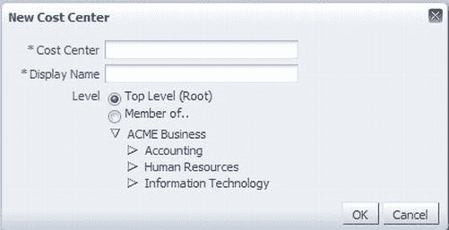

图 5-21. 添加新成本中心

添加成本中心后，它将显示在“成本中心”选项卡的“成本中心”列下。如果您将子成本中心作为现有成本中心的成员添加，则可以通过展开树状视图来查看它们（参见图 5-22）。如您将注意到的，这可能成为一个复杂的成本中心管理架构。然而，通过精心规划您的成本中心，将来更容易识别已消耗的资源和预算需求。

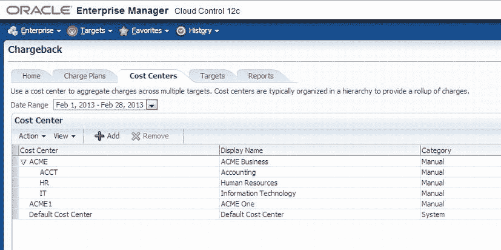

图 5-22. 已定义成本中心示例

## 导入 LDAP 层级结构

如前所述，您也可以从 LDAP 层级结构导入您的成本中心。这可以从`成本中心`表，通过`操作`菜单选择`LDAP 设置`来完成（参见图 5-23）。有少数几个众所周知的 LDAP 是`EM12c`支持的：

*   Oracle Internet Directory
*   Microsoft Active Directory
*   Sun iPlanet
*   Novell eDirectory
*   OpenLDAP

当使用 LDAP 构建成本中心层级结构时，LDAP 将覆盖同名的手动输入的成本中心，同时保留目标分配。成功导入 LDAP 后，它将生成一个计划任务，该任务将在每个报告周期运行，以同步成本中心与 LDAP。也可以通过`操作`菜单执行按需同步。

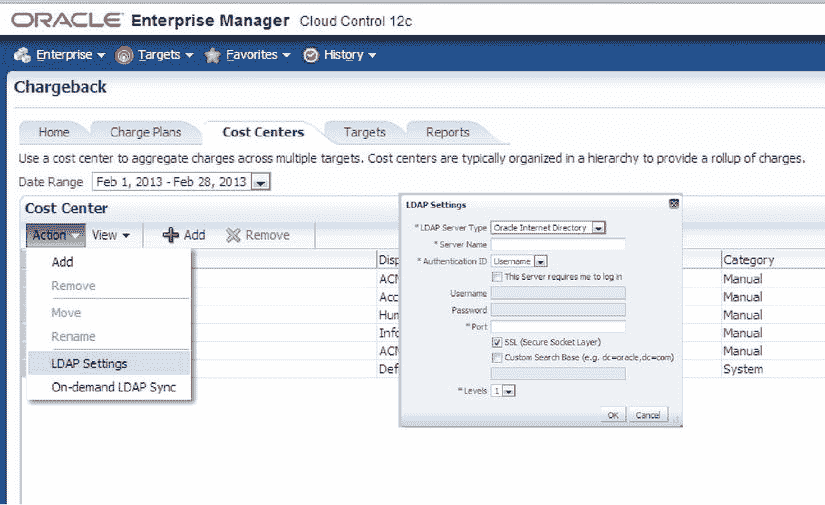

图 5-23. 导入 LDAP 层级结构

## 为目标分配计费计划和成本中心

设置好成本中心后，您需要为目标分配计费。要添加目标，您必须拥有`ADD_CHARGEBACK_TARGET`角色。此角色允许您添加任何由`EM12c`监控且符合计费支持条件的目标。如果未授予您此角色，`添加目标`按钮将被禁用。

 **注意**  除了`ADD_CHARGEBACK_TARGET`角色外，用户查看计费可能还需要另外两个角色。`VIEW_TARGET`角色允许您查看与特定目标相关的计费数据。`VIEW_ANY_TARGET`角色允许您查看与任何目标相关的计费数据。

为了使目标能够分配到计费计划和成本中心，目标首先必须由`企业管理员工`监控。然后，在计费界面的`目标`选项卡上，您将能够使用`添加目标`按钮添加目标。单击`添加目标`按钮会弹出添加目标的对话框，如图 5-24 所示。最初，此对话框将为空。可以通过单击`目标选择器`按钮来添加目标。

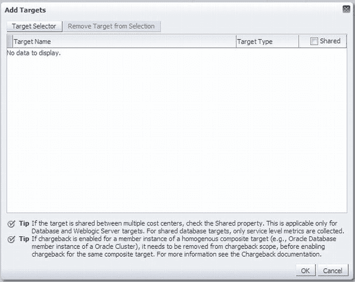

图 5-24. 添加目标对话框

单击`目标选择器`按钮会弹出搜索您想要添加的目标的功能（参见图 5-25）。默认情况下，列出所有目标类型。与`企业管理员工`中的许多搜索选项一样，您选择目标类型并搜索所需的目标。选择目标后，单击`选择`，然后单击`确定`将其添加到可以分配计费计划和成本中心的目标列表中。

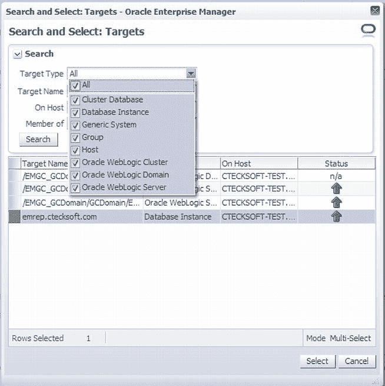

图 5-25. 选择用于计费和成本中心的目标

目标被添加到符合计费和成本中心分配的目标列表后，您可以通过单击列表上方的`分配`按钮来添加之前设置好的计费计划和成本中心（参见图 5-26）。许多通过按钮完成的添加和删除目标、分配计划和分配成本中心的命令也可以通过`操作`菜单完成。

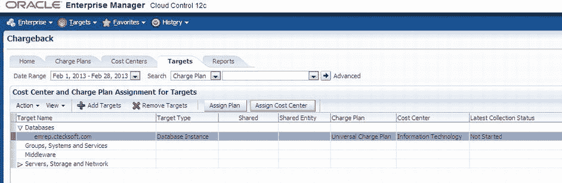

图 5-26. 添加了计费计划和成本中心的目标

如图 5-26 所示，我们添加了一个数据库并为其分配了计费计划和成本中心。但您会注意到，从未对此目标进行过数据收集。可以通过`操作`菜单选项`按需数据收集`手动对此目标执行数据收集。这将在`企业管理员工`中创建一个立即运行的作业。作业完成后，收集状态将变为`成功`。

## 计费报告

一段时间后，识别和提供报告显示资源使用情况将变得很方便。这可以在计费界面的最后一个选项卡，即`报告`选项卡上完成。此选项卡允许您查看和发布计费报告，这些报告可用作跟踪资源使用情况和计费分布的强大分析工具（参见图 5-27）。

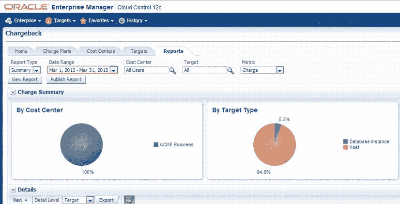

图 5-27. 计费报告视图

`报告`选项卡显示了很多资源细节。在图 5-27 中，您可以看到按成本中心和目标类型的细分。更靠右的位置，您将看到按资源的细分。在屏幕底部的`详细信息`部分是一个表格，提供有关已配置资源的详细信息。报告表上的一切都可以在屏幕顶部进行搜索和报告。

除了`报告`选项卡上提供的报告外，报告还可以通过`Oracle Business Intelligence (BI) Publisher`推送。这使得`企业管理员工`能够以可通过电子邮件发送的格式提供更复杂的报告。安装了`BI Publisher`后，生成的报告可以通过单击`发布报告`按钮发布为任意数量的格式（包括 HTML、PDF、Word、Excel 和 PowerPoint）。图 5-28 显示了一个从计费界面的报告表中发布的示例报告。

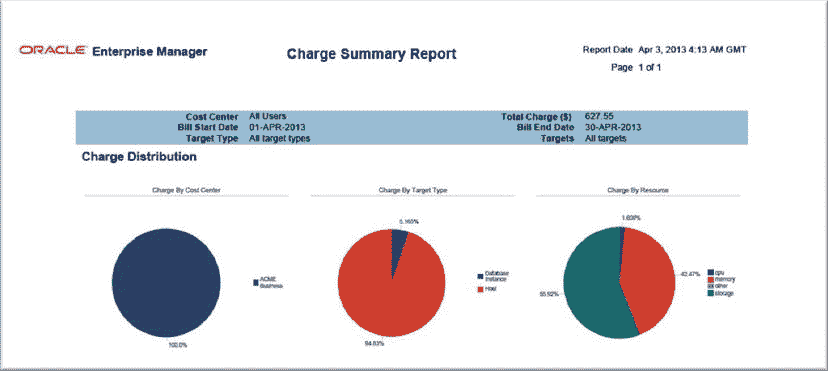

图 5-28. 使用 BI Publisher 发布的报告

计费模块现在是、并且可以成为 IT 部门的强大工具。凭借实施计费计划和成本中心，然后将其应用于目标并向最终用户提供报告的能力，计费模块是任何云环境的必需品。

## 优化云环境

云基础设施及其上部署的应用程序需要针对性能、能源效率、用户体验和运营成本进行优化。`Oracle Enterprise Manager`丰富的云管理功能可帮助您重新发现资产、审查应用程序性能，并根据云持续运营期间收集的信息和智能，微调云生命周期的各个阶段。从设置阶段开始——您可以在此阶段扩大或缩小机器规模、更改配额或区域分配，或微调云资源策略——企业可以决定对程序集内的应用程序或云资源的部署进行更改，以优化云。`企业管理员工`还提供了一个丰富的性能管理数据库，该数据库提供云性能的历史视图，以帮助您对其进行优化。第 9 章更详细地介绍了性能页面和优化。操作系统、数据库和中间件层的功能有助于持续优化云环境。

在本章中，我们讨论了管理云环境的许多生命周期阶段。正如我们之前指出的，`整合规划器`与计费插件一起安装。`整合规划器`不仅可用于云环境，还可用于传统的 IT 环境，以帮助组织缩小其整体企业占用空间。现在让我们来看一下`整合规划器`。

### 整合规划器

