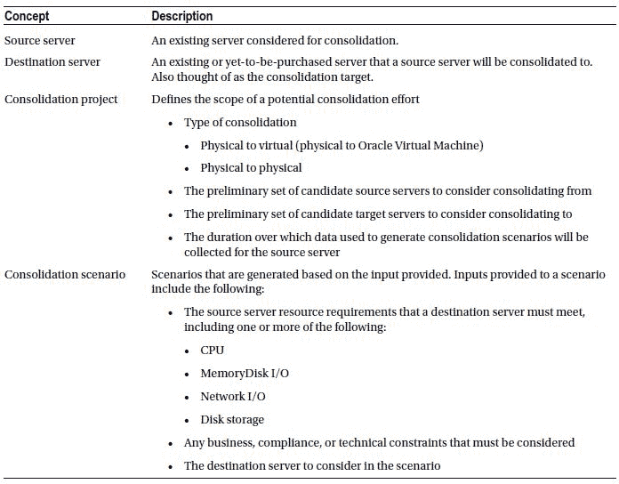
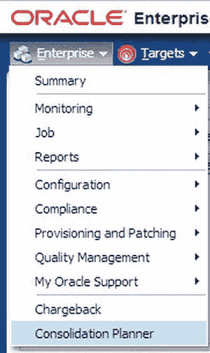
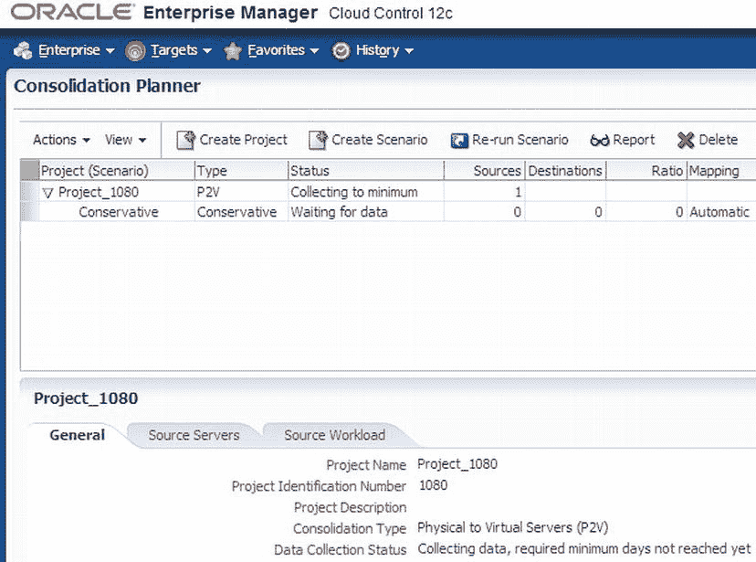
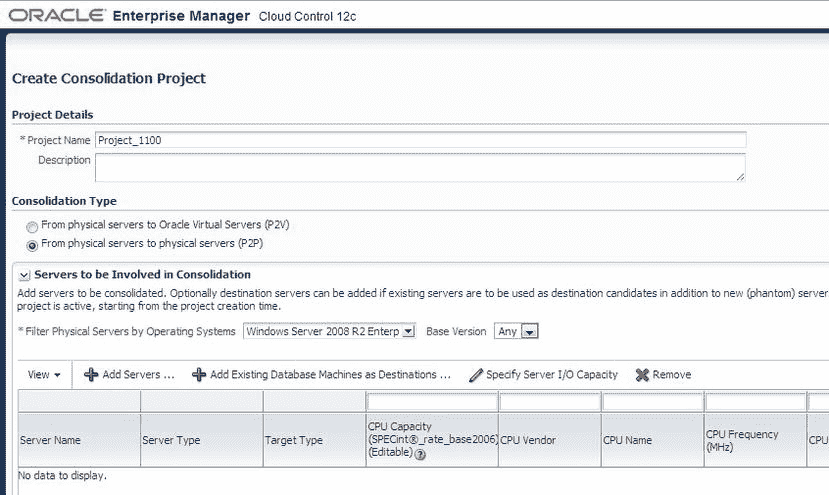
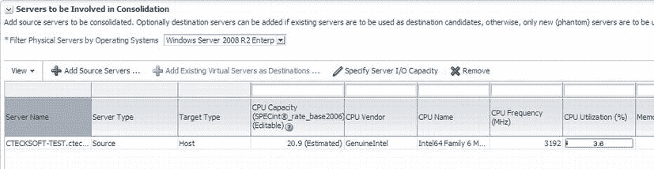
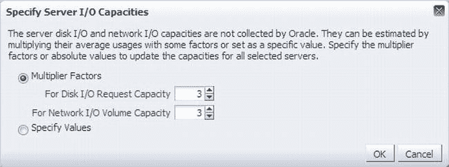
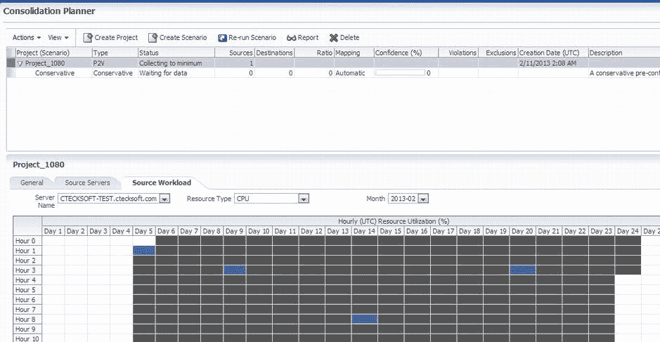
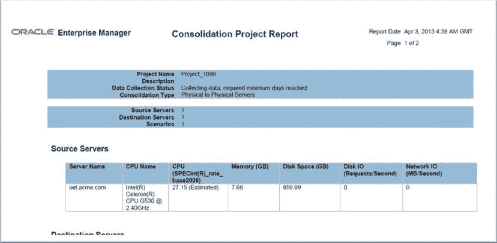

# Consolidation Planner 概述

Chargeback 模块擅长帮助组织或服务提供商识别已用资源的潜在收入，而 Consolidation Planner 则为这些组织提供了一种降低与运行非云或云资源相关的内部成本的方法。每个企业数据中心都会随时间稳步增长，为了满足不断增加的业务需求，需要增加服务器。这种增长通常会导致机架空间以及用于系统冷却、维护（包括安全和补丁）的电力需求增加。

为了应对这种增长趋势，许多企业正越来越多地调研和投资虚拟化技术，例如 Oracle Virtual Machine，通过将物理服务器迁移到虚拟服务器。此类迁移的目标是整合共享硬件，同时保留虚拟机提供的隔离优势。通过这种方式进行整合，企业可以在维持服务级别协议的同时，尽可能多地释放服务器。

Consolidation Planner 使企业能够将托管服务器与它们可以整合到的通用物理机、Oracle Exadata 或 Oracle Virtual Machine 进行匹配。通过利用从 Enterprise Manager 中的受管目标收集的指标和配置数据，Consolidation Planner 帮助企业确定最佳的整合方案，这些方案也反映了与整合过程相关的业务和技术约束。

## 关键概念

Consolidation Planner 中定义的每个整合项目都有一些对项目至关重要的关键概念。这些概念在 表 5-2 中定义。

表 5-2. Consolidation Planner 的关键概念

## 约束条件

现在您已经了解了 Consolidation Planner 的关键概念，理解一些您应该注意的约束也很重要。这些约束主要围绕源服务器和目标服务器。

源服务器的约束基于兼容性或排他性。如果某些属性和配置值匹配，则认为服务器是兼容的。这些属性包括：生命周期状态、部门和位置。例如，当源服务器必须保留在特定位置或地理区域内时，可能需要设置某个属性。此外，源服务器可以通过配置值来定义，这些值包括：网络域、系统供应商、系统配置、CPU 供应商、CPU 名称和操作系统。最后，源服务器可以是相互排斥的。这意味着它们可能被排除在整合范围之外，因为它们不符合 Oracle 最佳实践。要排除匹配的服务器，请设置以下任一或两个条件：RAC 数据库的节点、Oracle Cluster 的节点。

目标服务器可以针对新的或现有的候选服务器确定范围。与目标服务器相关的约束主要表示为 CPU 和内存资源利用率的百分比——即目标服务器可以使用多少任一资源类型。

现在我们已经定义了源和目标服务器，您可以开始更详细地了解如何定义整合项目并评估方案了。

## 安装与访问

Consolidation Planner 作为包含 Chargeback 模块的插件的一部分安装。要访问 Consolidation Planner，请选择 Enterprise  Consolidation Planner。这将打开 Consolidation Planner 模块。如果这是 Consolidation Planner 的新实现，则不会定义任何项目。图 5-29 展示了如何打开 Consolidation Planner。

图 5-29. Consolidation Planner 的 Enterprise 菜单选项

## Consolidation Planner 主页

在 Consolidation Planner 主页上，您将找到已定义项目的列表以及菜单项，这些菜单项可以帮助定义新项目、创建方案、报告项目和删除项目。图 5-30 显示了一个新实施的 Consolidation Planner，其中包含一个项目。我们将逐步演示如何为将物理服务器整合到 Oracle Virtual Machine 创建一个新项目。

图 5-30. 包含项目的新实施 Consolidation Planner

## 创建整合项目

在 Consolidation Planner 页面上，要创建新项目，管理员需要单击 `Create Project` 按钮。这将打开 `Create Consolidation Project` 详细信息页面（参见 图 5-31）。在这里，管理员可以定义项目的各个方面，例如将要执行的整合类型、参与整合的服务器、数据收集的时长以及任何预配置的方案（如果它们已被定义）。

图 5-31. `Create Consolidation Project` 屏幕

此屏幕包含了定义整合项目所需的全部信息。首先要决定的是将要进行的整合类型。两个选项是 `Physical to Oracle Virtual Machine (P2V)` 和 `Physical to Physical (P2P)`。接下来，我们必须选择哪些服务器将参与整合。当添加整合目标时，首先必须添加源服务器。如果需要，我们还可以选择添加现有的虚拟服务器作为目标。添加源目标或 OVM 目标后，您将看到许多特定于该源或目标服务器的估算（参见 图 5-32）。

图 5-32. 为整合添加的源服务器

> **注意**  指定服务器 I/O 容量是 Oracle 提供的估算值。如果您点击 `Specify Server I/O Capacity` 按钮，将弹出一个对话框，使您能够指定乘数因子或绝对值来更新所有选定服务器的容量。

### 数据收集

为了让 Consolidation Planner 对节省或资源做出正确估算，它将基于收集的数据量。在 `Create Consolidation Project` 屏幕的 `Data Collection` 部分，管理员可以指定应用于估算整合的最小和最大天数。与 Enterprise Manager 中的许多其他任务一样，数据收集由一个将被创建的作业处理。作为数据收集的一部分，可以指定是立即开始数据收集还是稍后开始。

### 预配置方案

创建整合项目的最后一步是指定项目是否应使用任何预配置的方案。默认情况下，未选择任何方案。但是，可以从三个选项中选择一个预配置的方案；这些方案使用 CPU、内存和磁盘存储的指标来分析整合项目。图 5-33 提供了这些方案的详细分解。

图 5-33. 预配置方案

## 提交与查看项目

选择预配置方案后，即可提交并创建项目。如果项目创建成功，Consolidation Planner 页面将反映项目已创建以及项目当前的状态。在屏幕底部，您还会注意到三个选项卡，提供有关项目的具体信息。这些选项卡是 `General`、`Source Servers` 和 `Source Workload`。

“常规”选项卡提供与项目相关的所有具体信息，包括项目名称、识别编号、整合类型以及数据收集的当前状态。“源服务器”选项卡提供的信息类似于将源目标添加到项目时所呈现的内容。这里会显示诸如 CPU 利用率、内存利用率和磁盘存储等项目。该选项卡的有趣之处在于，它通过告知您数据收集的开始和结束日期来提供相关信息。“源工作负载”选项卡以表格形式提供一个 24 小时的视图，展示为整合而衡量的资源（参见图 5-34）。可以通过“资源类型”下拉菜单查看这些资源。

图 5-34. 包含项目信息的整合规划器

项目完成收集整合工作所需的信息后，可以通过点击整合规划器屏幕上的“报告”菜单项来生成报告。与成本分摊报告类似，整合项目报告将在浏览器中显示。如果企业管理器中安装了 Oracle BI Publisher，将提供发布报告的选项，允许管理员将整合报告发布给最终用户。图 5-35 展示了一个从整合规划器中的报告表发布的示例报告。

图 5-35. 整合项目的 BI Publisher 报告

整合规划器是一个可用于帮助考虑迁移到云端或新物理硬件（例如 Exadata）的组织识别并缩减其基础设施足迹的工具。

## 总结

在本章中，您回顾了云计算、其关键特性以及交付和部署模型。您还了解到，为了充分利用云基础设施，高效管理云生命周期的所有阶段至关重要。对于高效的云管理而言，仅有用于配置或监控的非常好的解决方案是不够的。EM12c 让您能够完全掌控云生命周期的所有阶段，从而使您在企业私有云上的投资获得最高回报。

¹ NIST 云计算定义：[`csrc.nist.gov/publications/nistpubs/800-145/SP800-145.pdf`](http://csrc.nist.gov/publications/nistpubs/800-145/SP800-145.pdf)

