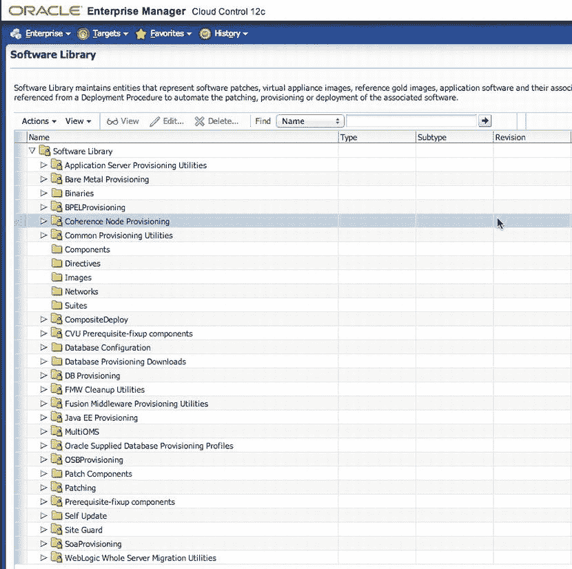
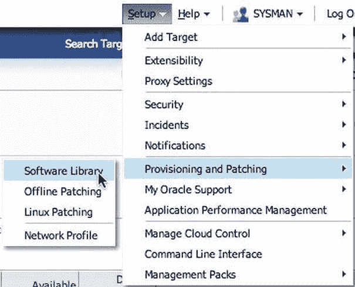
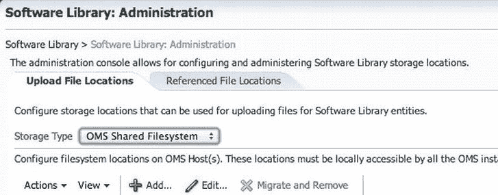
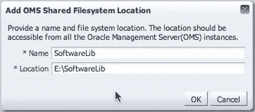
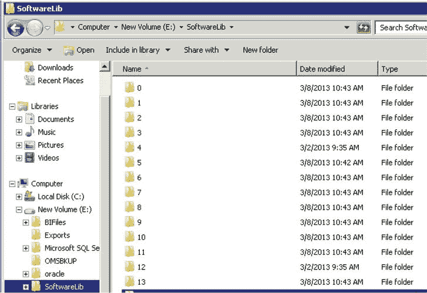
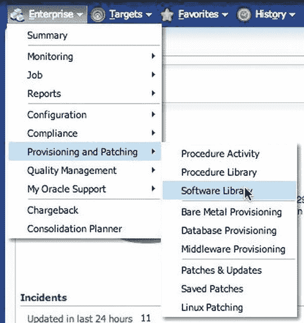
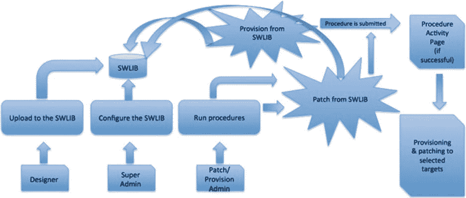
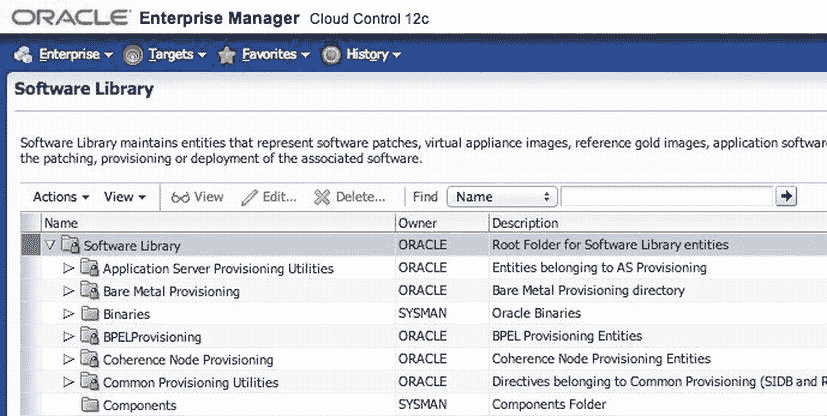

# 第 6 章

## 软件库、补丁与配置

作者：Bobby Curtis

使用 Oracle Enterprise Manager 12c 的主要好处之一是，它能够帮助数据库、系统和应用程序管理员节省时间，并自动化管理 Oracle 数据库生命周期所需的过程。资源的打补丁和配置对于整个企业中关键业务系统的日常运营和维护至关重要。通过数据库生命周期管理包，管理员可以获得一系列工具，以帮助消除与发现、初始配置、打补丁、配置管理和持续变更管理相关的手动且耗时的任务。在本章中，您将了解软件库以及实现 EM12c 打补丁和配置选项所需的数据库生命周期管理包的组件。

### 软件库

EM12c 的核心功能之一是`Oracle 软件库`。这是一个核心存储库，用于存储诸如代理软件、补丁、虚拟设备映像、黄金映像、应用软件及其关联脚本等软件实体。此外，软件库允许您维护所存储的各种软件实体的版本、成熟度级别和状态。图 6-1 展示了软件库控制台的一般外观。

图 6-1. 软件库控制台

要访问软件库控制台页面，请选择 `Enterprise`  `Provisioning and Patching`  `Software Library`。在软件库控制台中，有两种类型的文件夹：标有锁的文件夹是 Oracle 拥有的文件夹，没有锁的文件夹是用户拥有的文件夹。（带锁和不带锁的文件夹可以在图 6-1 中看到。）

Oracle 拥有的文件夹（及子文件夹）是 EM12c 默认附带的。这些文件夹在配置软件库后会出现在软件库控制台中。用户拥有的文件夹是用户创建的顶层文件夹，用于组织软件库内的软件实体。

 **注意**  软件库一旦配置完成，会包含一系列编号的目录，初次查看时可能会让人困惑。根据 Oracle 企业管理器团队的说法，软件库结构中的编号文件夹旨在让所有人专注于 GUI 界面。

使用软件库为管理员带来许多优势，包括：

*   支持在线和离线两种模式下的打补丁和配置任务
*   支持引用文件位置，允许管理员利用现有的 IT 基础设施（文件服务器、Web 服务器和存储系统）来存储和暂存用于打补丁和配置活动的软件实体
*   允许将软件实体组织到逻辑文件夹中，以便高效管理

如前所述，软件库是 EM12c 中与打补丁和配置相关一切的核心存储库。我们已经简要讨论了如何进入软件库控制台、可在库中配置的文件夹类型及其优势。我们尚未讨论的是如何配置软件库以便使用。现在让我们来看看这部分。

### 配置软件库

在开始使用软件库之前，您必须通过软件库管理控制台进行设置。一个软件库必须至少包含一个位于运行 Oracle Management Server (OMS) 的主机上的上传文件位置。软件库中的存储位置代表一个目录，该目录要么被上传到库，要么由某些用户拥有的进程生成并保存。

配置软件库时，上传文件位置有三个选项：`OMS 共享文件系统`、`OMS 代理文件系统`或`引用文件位置`。这些是设置软件库唯一支持的存储选项。让我们快速了解一下这些选项：

*   `OMS 共享文件系统`：此位置需要在所有 OMS 主机之间共享（或挂载）。
*   `OMS 代理文件系统`：使用此选项时，请确保已为 OMS 主机设置了首选或命名凭据。
*   `引用文件位置`：此选项允许您利用组织现有的 IT 基础设施来获取软件二进制文件和脚本。引用文件位置支持三种存储选项：

## 存储位置类型

*   `HTTP`：HTTP 存储位置表示一个基础 URL，作为可引用文件的来源。
*   `NFS`：NFS 存储位置表示服务器上的导出文件系统目录。该服务器不需要是 OEM 主机目标。
*   `Agent`：代理存储位置与 OMS 代理文件系统选项类似，但 OEM 代理可以监控任何主机。可以配置代理以提供该主机上的文件。

### 配置软件库

要配置软件库，你需要决定上传文件的位置。在我完成的许多配置中，我使用 OMS 共享文件系统作为软件库，因为它设置简单并且是本地 OMS。让我们看看如何为软件库设置这种类型的共享。

 **注意** 在设置软件库时，无论你使用哪种类型的存储位置，都需要考虑大小问题。软件库应该有多大？我需要为软件库预分配多少空间？你应该分配你认为将要使用的空间大小。我通常建议起始大小在 5GB 到 50GB 之间。这是因为代理软件需要在部署前下载到软件库中。

要访问软件库管理控制台，你需要选择 Setup  Provisioning and Patching  Software Library。图 6-2 显示了到达该位置的菜单路径。

图 6-2。从 Setup 菜单访问软件库

在软件库管理控制台中，你会立即看到两个选项卡，帮助你区分 OMS 上的上传位置和引用的位置。要设置 OMS 共享文件系统位置，你需要停留在 `Upload File Locations` 选项卡上。在这里，`Storage Type` 下拉菜单为你提供了 `OMS Shared Filesystem` 或 `Agent Shared Filesystem` 的选项（见图 6-3）。

图 6-3。软件库管理控制台

现在，因为你打算使用 OMS 共享文件系统作为我们的软件库，你需要确保在本地主机上有一个位置来存储软件库。一旦确定了该目录结构，就可以将文件系统添加到 OEM。在软件库管理控制台中，单击 `Add` 菜单选项。这将打开一个对话框，允许你命名软件库并确定 OMS 服务器上的位置（见图 6-4）。

图 6-4。添加 OMS 共享文件系统位置

单击 `OK` 按钮，软件库的创建便开始了。库会列出你通过 `Add` 菜单命令创建的位置以及库的状态，如图 6-5 所示。

图 6-5。软件库名称、状态和位置

正如我前面提到的，如果你去查看软件库填充初始条目的位置，你只会看到一堆带数字的文件夹。这是为了保持软件库的整洁，并防止任何人从 OEM 外部修改库。图 6-6 给出了文件结构的示例。

图 6-6。软件库文件结构

至此，你已经了解了在 EM12c 中配置软件库是多么容易。一旦库配置完成，它就可以为你配置的所有软件实体所用。对软件库的一个良好初步测试是下载你企业系统所需的代理软件。代理软件的下载和安装在第 2 章中有所介绍。

### 使用软件库实体

既然软件库已经配置好了，你想要使用库中可用的实体。为此，你需要通过选择 Enterprise  Provisioning and Patching  Software Library 来访问软件库主页，如图 6-7 所示。

图 6-7。软件库主页

在软件库中处理实体时，重要的是要记住有两种广泛分类的类型：Oracle 拥有的实体和自定义实体。每个实体在软件库中都有其自身的用途和用法。表 6-1 描述了这些实体类型。

表 6-1。软件库中的实体

| 类型 | 描述 |
| --- | --- |
| Oracle 拥有的实体 | 一旦软件库配置完成，这些实体默认在软件库主页上可用。 |
| 自定义实体 | 软件库用户创建这些实体。 |

许多生命周期管理任务会利用软件库中的实体。此类任务包括修补和置备部署过程，这些将在本章后面介绍。图 6-8 展示了修补和置备部署过程如何使用软件库。

图 6-8。使用软件库进行修补和置备部署过程

### 通过软件库主页执行任务

在软件库主页上，处理软件库用户可用的实体是有帮助且方便的。可以从库主页执行的任务如下：

*   组织实体
*   创建实体
*   自定义实体
*   管理实体

在查看这些任务时，请记住，在软件库中管理实体最初是简单的。然而，根据你组织和环境的复杂性，软件库的维护可能会变得很耗时。了解软件库将用于什么目的将有助于简化维护任务。

### 组织实体

在软件库中组织实体只是一个在库中创建文件夹的过程。文件夹结构可以根据你组织的意愿变得简单或复杂。图 6-9 显示了一个例子。

图 6-9。软件库主页

从菜单栏的 `Actions` 菜单中，你选择 `Create Folder`，如图 6-10 所示。请注意，此菜单中的其他命令呈灰色显示。这些命令可以在现有文件夹创建后执行。现在，让我们专注于 `Create Folder` 命令。

图 6-10。Create Folder 菜单命令

