# 创建实体与指令

## 创建文件夹

选择“创建文件夹”命令后，会出现一个对话框，允许您指定文件夹的名称（参见图 6-11）。此外，您可以提供文件夹的描述。这些详细信息将显示在软件库中，帮助您快速识别所创建的文件夹。请注意，“父文件夹”选项呈灰色显示。这是默认行为。此框中的文本将根据您在下方文件夹结构中的选择而变化。默认情况下，父文件夹是`/Software Library`。

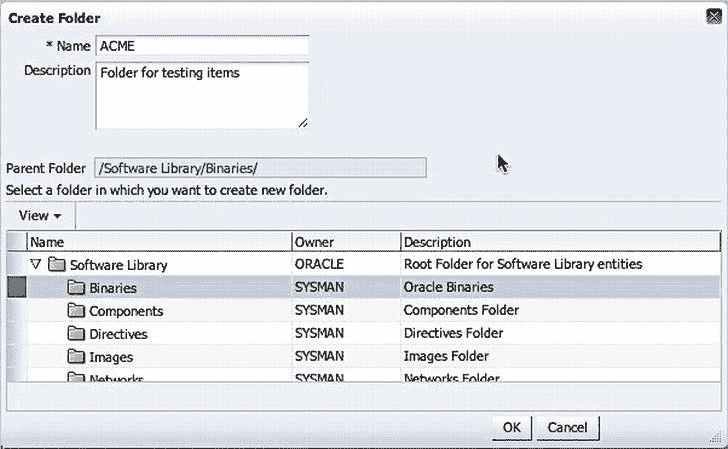

**图 6-11. 创建文件夹对话框**

单击“确定”。如果文件夹创建成功，您将收到确认信息，如图 6-12 所示。您还将在指定的父文件夹下的树形结构中看到该文件夹。

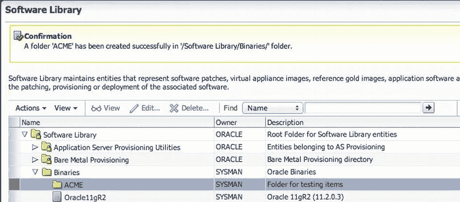

**图 6-12. 在软件库中创建的文件夹**

 **注意** 文件夹创建后，唯一有权限删除该文件夹的人是其所有者或超级管理员。

## 创建实体

**实体**是存储在软件库中的已认证软件二进制文件。实体可以是任何软件，包括补丁、虚拟设备映像、参考金映像、应用软件及其关联的指令脚本。如前所述，实体类型大致有两种：Oracle 拥有的和自定义的。在软件库中，您可以创建两种基本类型的自定义实体：

*   通用组件
*   指令

让我们看看如何在软件库中创建这两种类型。

### 创建通用组件

**通用组件**包含可创建为实体的各种软件项。这些实体使您能够定义一个安装过程，该过程将在生命周期框架内用于打补丁或配置。通用组件列表包括：

*   配置模板
*   数据库模板
*   通用组件
*   安装介质
*   Java EE 应用程序
*   Oracle 应用服务器
*   Oracle Clusterware 克隆
*   Oracle 数据库软件克隆
*   Oracle 中间件主目录金映像
*   PDB 模板
*   WebLogic 域配置配置文件

要在软件库中创建通用组件，您需要选择一个不是 Oracle 拥有的自定义文件夹。如果尚未建立此自定义文件夹，则需要创建它（请参阅前面的“组织实体”部分）。在软件库中选择了自定义文件夹后，“操作”菜单的“创建实体”选项和关联的子菜单将变为可用。选择 **操作**  **创建实体**  **组件**，如图 6-13 所示。子菜单项“指令”和“裸机配置”也可用；我们很快将讨论指令。本章不讨论裸机系统的配置，因为它超出了数据库补丁的范围。

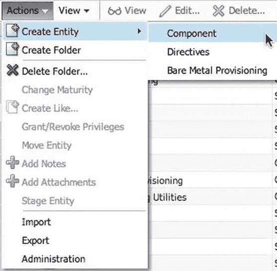

**图 6-13. “操作”  “创建实体”选项**

选择“组件”选项将打开一个对话框，您可以在其中选择要创建的组件类型。如前所述，有许多选项。选择要创建的实体，然后单击“继续”，如图 6-14 所示。

**图 6-14. 选择组件类型**

单击“继续”按钮将带您进入“创建通用组件：描述”页面，如图 6-15 所示。在此页面上，您可以定义组件的名称、描述和其他属性等具体信息。如果需要，您还可以为组件添加附件。附件可以是从自述文件到许可信息的任何内容。如果要添加附件，请确保文件大小为 2MB 或更小。此外，您可以添加有关组件的注释。但是，请谨慎操作，因为注释无法删除。

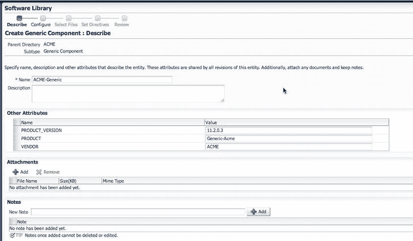

**图 6-15. 描述组件**

您会注意到，在此页面上，Oracle Enterprise Manager 会将您置于一个向导中以帮助您创建组件。可能有四个额外的步骤需要配置，也可能不需要。这完全取决于您尝试使用组件执行的操作。有趣的是，在“设置指令”屏幕（如图 6-16 所示）中，您可以添加指令以告诉组件遵循特定的步骤。我们稍后将深入探讨指令。

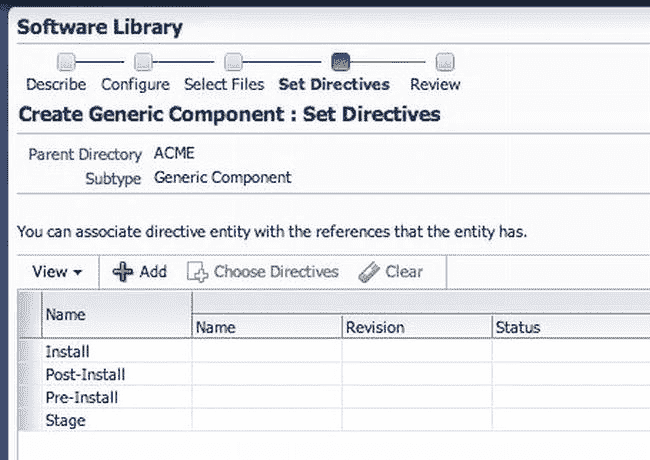

**图 6-16. 设置指令**

通过向导完成添加项目后，您将有机会查看您提供的配置。图 6-17 显示了“审查”屏幕，该屏幕已为可读性进行了裁剪，并在正常上下文之外显示了选项按钮。关于“审查”屏幕有趣的一点是，您有两种保存组件的选项：**保存**或**保存并上传**。两个按钮都会保存您的组件；但是，第二个按钮还会将您的组件上传到软件库。

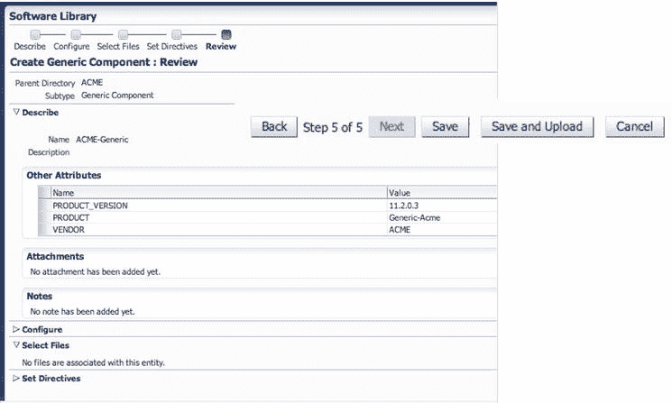

**图 6-17. 审查并保存通用组件**

“保存并上传”按钮会自动将您的新组件上传到软件库。组件保存到库后，您将返回到软件库主页。在页面顶部，您可以看到显示了确认消息，并且您的新组件列在创建组件时指定的文件夹中（参见图 6-18）。

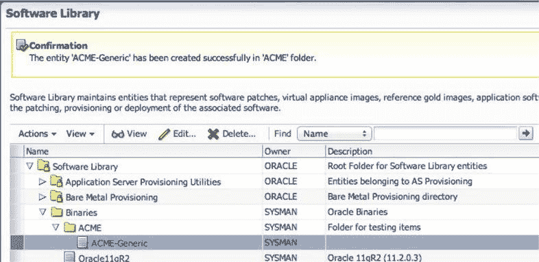

**图 6-18. 确认已创建的通用组件及其位置**

### 创建指令

现在您了解了什么是通用组件，让我们看看指令。**指令**是软件库中的实体，代表一组可以执行的指令。这些实体用于将脚本与软件组件和映像相关联。这些脚本包含如何解释和处理特定软件组件或映像内容的说明。

设置指令时，必须使用与通用组件相同的界面。要创建指令，您需要从软件库主页开始（选择 **Enterprise**  **Provisioning and Patching**  **Software Library**）。请记住，为了创建新指令，您需要选择一个不是 Oracle 拥有的自定义文件夹。

要开始创建新指令，您将使用软件库中的“操作”菜单。这与您创建通用组件时使用的菜单相同。但是，这次您选择 **操作**  **创建实体**  **指令**，如图 6-19 所示。

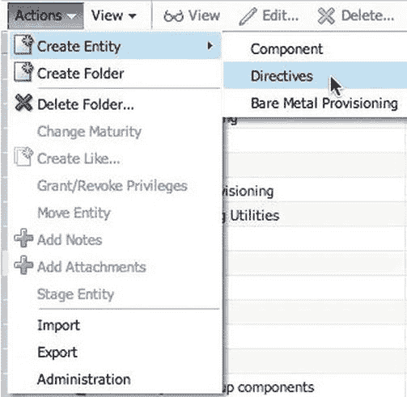

**图 6-19. 创建新指令**

“创建指令”向导随即显示。首先，向导会引导您来到“描述”页面（如图 6-20 所示），让您描述该指令将属于何种类型。此页面上唯一必需的信息是实体的`名称`、`描述`和`其他属性`。与通用组件类似，您可以通过在“附件”和“备注”区域添加文件或备注，将文件和备注与该指令关联起来。

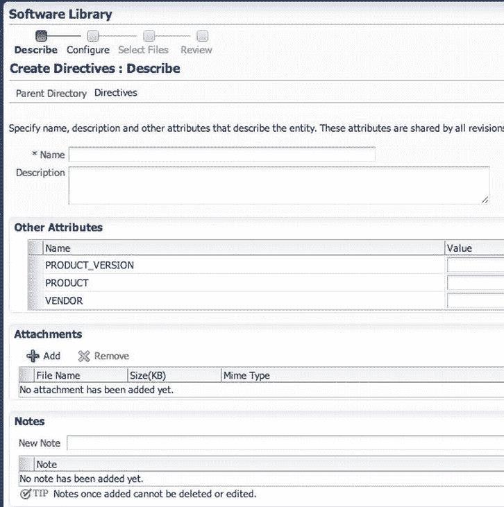
图 6-20. 描述指令

您可能还会注意到页面顶部的向导步骤。创建指令所需的步骤比创建通用组件要少。填写必填字段后，单击“下一步”进入向导的下一个界面。

如前所述，指令是在软件库中对软件包执行一组指令的实体。在“配置”页面（如图 6-21 所示），您可以选择添加与指令关联的命令行参数和属性。如果命令行参数或您想要的属性类型没有需要添加的内容，可以直接单击“下一步”。

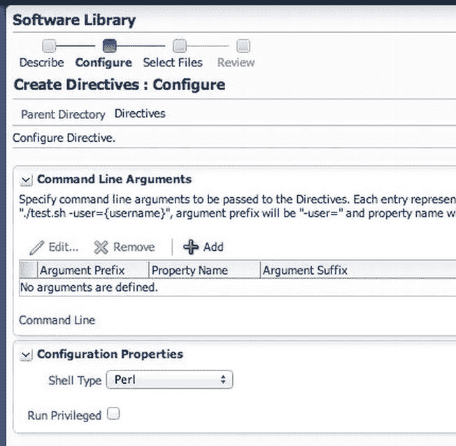
图 6-21. 配置指令

命令行参数就是参数——可以像使用脚本一样传递。参数可以包括稍后设置的变量、前缀和后缀。前缀和后缀文本分别附加在属性值之前和之后，以生成命令行参数。

 **注意** 以下是一个命令行参数示例：
`./test.sh –user={username}`
其中，前缀是 `-user=`，属性是 `username`。

要设置命令行参数，请单击 `添加` 按钮。会出现一个对话框，允许您配置参数前缀、属性名称和参数后缀，如图 6-22 所示。这个对话框的方便之处在于，它明确告诉您需要提供哪些信息，不像其他对话框。

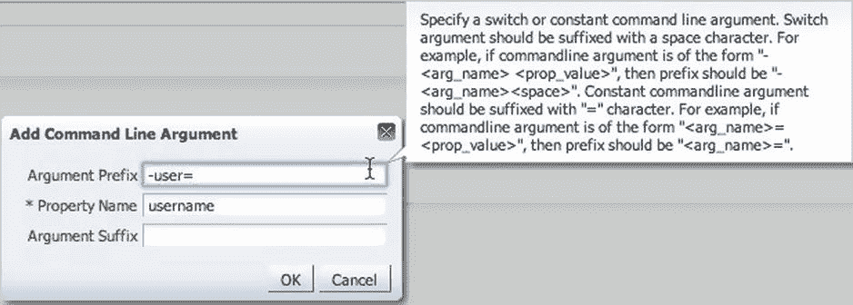
图 6-22. 添加命令行参数

设置好所有所需的参数后，单击 `确定`。这会将参数添加到“配置”页面。随着您添加更多参数，命令行会开始在它们下方构建。图 6-23 显示我们添加了两个参数，并为我们生成了命令行。

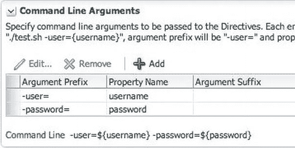
图 6-23. 添加参数后构建的命令行

为指令添加完所有参数后，您需要告诉指令将运行哪种类型的脚本。这可以在同一页面的“配置属性”部分完成。您需要告知指令您将使用 `Perl` 或 `Bash`。此外，如果脚本需要以提升的权限运行，您可以通过勾选 `以高权限运行` 框来指示。图 6-24 显示为一个 Bash 脚本选择了 `以高权限运行` 复选框。

图 6-24. 指令的配置属性

现在您已经配置好了指令“配置”页面上所有需要的项目，可以单击 `下一步` 继续。向导会将您带到“选择文件”界面。

在此界面上，您会看到两个单选按钮，使您能够上传指令所需的文件，或通过位置引用它们。这两个选项与最初创建软件库时的选项非常相似；适用相同的规则：

*   `上传文件`：如果您想从本地文件系统或代理机器将一些实体文件上传到选定的目标位置，请使用此选项。
*   `引用文件`：此选项允许您输入源位置详细信息，因为您没有向软件库上传任何内容。

选择 `上传文件` 选项，如图 6-25 所示。

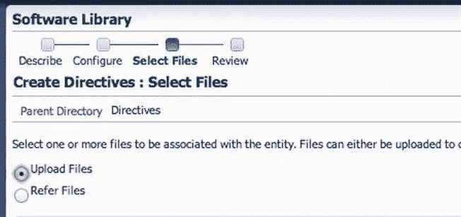
图 6-25. 选择要上传的文件

接下来，您需要选择目标位置。在“指定目标”下，选择上传位置旁边的放大镜图标。这将打开一个对话框，您可以在其中选择 `OMS 共享文件系统` 或 `OMS 代理文件系统`。默认显示的是设置软件库时指定的位置（参见图 6-26）。选择软件库并单击 `确定`。

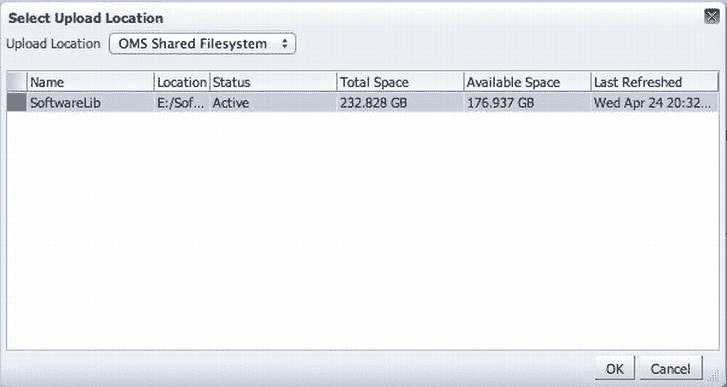
图 6-26. 选择上传位置

接下来，您需要指定源文件。这些是指令执行其工作所需的脚本文件。这些文件可以从本地主机上传，也可以通过安全复制等远程传输过程从远程主机上传。

 **注意** 如果从本地文件系统上传，文件大小限制为 25MB。如果从远程文件系统上传，“保存并上传”操作将提交一个文件传输任务，将远程文件移动到上传位置。

要在“指定源”位置添加文件，您需要单击 `添加` 按钮。这将打开用于选择和添加文件的对话框（参见图 6-27）。选择您要添加的文件，提供文件名，然后单击 `确定`。默认情况下，文件名会被添加到“名称”文本框中。

图 6-27. 向指令添加文件

单击 `确定` 后，该文件会被添加到“选择文件”页面的“指定源”部分，如图 6-28 所示。请注意，文件的名称、大小和 mime 类型已列出。如果此指令有多个文件，下拉框允许您选择主文件。在此示例中，您只使用一个文件；默认情况下，这将是主文件。单击 `下一步` 完成指令的创建。

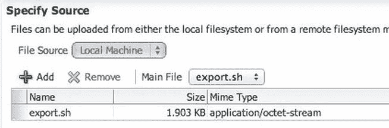
图 6-28. 指定源文件

指令完成后，向导会将您带回软件库，并显示一条确认消息，说明创建成功。此时，您将能够找到您创建的指令。图 6-29 显示了确认消息。

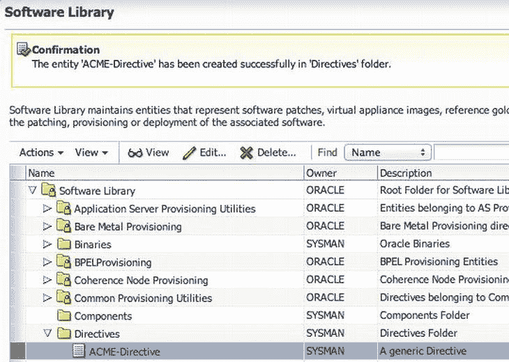
图 6-29. 新指令创建完成

指令创建完成后，它就像软件库中的任何其他实体一样。它可由创建它的所有者或超级管理员查看、编辑或删除。

## 维护软件库中的实体

与任何软件一样，维护任务也需要处理。软件库中的实体也不例外。我们已经讨论了如何创建和添加通用实体和指令实体。现在您已准备好学习维护实体。

许多对实体的维护任务都可以从软件库中执行。我们在此不深入探讨这些内容。有关这些任务的更多信息，请参阅 Oracle 文档；本节仅列出可以完成的项目。

### 维护软件库

 **注意** 适用于 EM12c 云控制的 Oracle 文档位于此处：[`docs.oracle.com/cd/E24628_01/index.htm`](http://docs.oracle.com/cd/E24628_01/index.htm)。

针对实体的维护任务如下：

*   授予或撤销特权
*   移动实体
*   更改实体成熟度
*   向实体添加注释
*   向实体添加附件
*   查看、编辑和删除实体
*   搜索实体
*   导出/导入实体
*   暂存与实体关联的文件

 **注意** 从 EM12c 的 12.1.0.2 版本开始，您可以使用 `GUI` 或 `命令行界面` 来执行上述任务。

正如我们维护软件库中的实体一样，我们也必须维护软件库自身的健康和功能性。只有软件库管理员或拥有管理权限的设计师才能执行以下操作：

*   执行定期维护任务
*   重新导入 Oracle 拥有的实体文件
*   移除（并迁移）软件库存储位置
*   清除已删除的实体文件
*   备份软件库

所有这些任务对于软件库的正常运行都至关重要。

### 执行定期维护任务

为保持软件库正常运行，必须定期执行以下任务：

*   刷新软件库以计算已用和可用磁盘空间
*   清除已删除的实体以节省磁盘空间
*   检查已配置的软件库位置以确保其可访问

### 重新导入 Oracle 拥有的实体文件

重新导入 Oracle 拥有的实体文件并非周期性活动。此过程仅应用于恢复由 Oracle 拥有的元数据文件。仅在以下两种情况下应执行此操作：

*   如果您删除了导入元数据的文件系统位置
*   如果创建第一个上传位置时提交的导入作业失败

要重新导入 Oracle 拥有的文件的元数据，请访问 `设置` 下的软件库管理页面。从 `操作` 菜单中，选择 `重新导入元数据`，如 图 6-30 所示。这将提交一个作业来重新导入元数据。

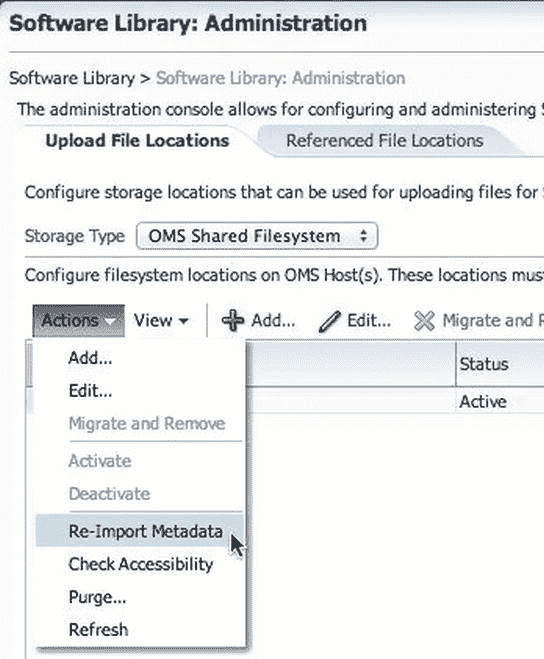

图 6-30。重新导入元数据

 **注意** 重新导入元数据仅适用于 Oracle 拥有的文件，即默认随 `OEM` 产品一起提供的所有实体文件。用户拥有的实体元数据无法通过 `重新导入` 功能恢复。

### 移除（并迁移）软件库存储位置

有时您可能需要将软件库从其当前存储位置移动到新位置。这可能出于多种原因。例如，您可能需要更多的存储空间。

只有 `软件库存储管理员` 拥有删除存储位置所需的权限。在删除存储位置之前，系统会提示您选择一个备用位置来迁移文件。接着，将提交一个迁移作业，并将当前位置标记为非活动状态。迁移作业完成后，旧的存储位置将被删除。

要删除当前存储位置，请按照以下步骤操作：

1.  访问软件库管理页面（`设置` → `置备和修补` → `软件库`）。
2.  选择存储位置。然后点击 `迁移并移除`。
3.  在确认框中，点击 `移除` 以提交作业。成功完成后，旧存储区域将从表中移除。

### 清除已删除的实体文件

从 EM12c 开始，不再需要的实体可以从软件库中清除。清除作业现在也可以安排，同样在 `清除已删除实体文件` 对话框中进行，如 图 6-31 所示。要安排从软件库清除实体的作业，请按照以下步骤操作：

1.  访问软件库管理页面（`设置` → `置备和修补` → `软件库`）。
2.  选择存储位置，然后从 `操作` 菜单中选择 `清除`。
3.  输入作业所需的所有详细信息，然后点击 `确定`。成功完成后，所有已删除的实体将从软件库中移除。

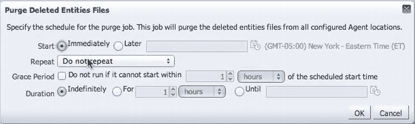

图 6-31。安排清除实体

### 备份软件库

到目前为止，我们花了大量时间定义软件库、它的用途以及如何向其中添加实体。既然我们花了大量时间设置软件库，最不愿意做的事情就是备份它。然而，就像任何其他 Oracle 产品一样，备份对于确保在发生灾难时可恢复性至关重要。

实际上，备份软件库是在备份 Oracle 企业管理器本身时完成的。备份 Oracle 企业管理器在 第 13 章 中有详细介绍。

## 修补

修补是产品生命周期中最重要的阶段之一。它使我们能够通过错误和安全修复来保持我们的软件产品更新。全年，Oracle 会发布几种类型的补丁来帮助我们维护产品。然而，修补也一直是最具挑战性的生命周期阶段，因为它通常复杂、有风险、耗时，并且需要应用程序停机。尽管我们可以使用多种方法来修补数据库，但不幸的是，最小化停机或中断的挑战依然存在。

在本节中，您将学习如何在 EM12c 中管理补丁。此外，您将了解如何配置企业管理器以使用 `My Oracle Support`，并回顾在企业管理器环境中修补的整个过程。

## 补丁管理

在深入探讨 EM12c 中补丁管理的新功能之前，您需要了解之前面临的挑战。表 6-2 列出了修补方法及其相关挑战。

表 6-2。当前的修补工具和挑战

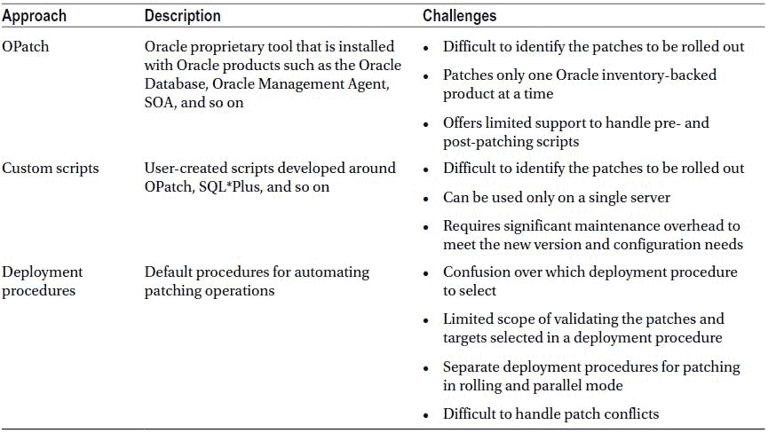

Oracle 企业管理器通过其大幅改进的补丁管理解决方案来应对表 6-2 中列出的挑战，该解决方案以最小的停机时间提供最大的便利。新的补丁管理解决方案提供以下优势：

## 集成补丁工作流的优势

*   集成的补丁工作流与 `My Oracle Support` 相连。因此，您可以使用相同的用户界面查看建议、搜索补丁并推出补丁。
*   使用*补丁计划*对补丁工作流进行完整的端到端编排，包括自动选择部署过程和分析补丁冲突。因此，只需最少的人工操作。
*   设计师和操作员之间的职责划分清晰——设计师可以专注于创建补丁计划、在测试系统上测试它们，并将其保存为补丁模板。操作员可以专注于从模板创建补丁计划，以便在生产系统上推出补丁。
*   轻松审查补丁在您环境中的适用性、验证补丁计划，并自动接收补丁以解决验证问题。
*   将成功分析或可部署的补丁计划另存为补丁模板，其中包含从源补丁计划保存的一组预定义的补丁和部署选项。
*   针对独立（单实例）数据库目标以及属于 `Oracle Exadata` 一部分的 `Oracle Grid Infrastructure` 目标进行异地补丁。
*   灵活的补丁选项，例如滚动和并行，同时支持离线和在线模式。

## 配置 My Oracle Support

在我们真正讨论一些新的补丁选项之前，必须将 `Oracle Enterprise Manager` 与 `My Oracle Support` 集成。Oracle 在集成这两个界面方面做得很好，使我们更容易从 `Oracle Enterprise Manager` 界面在 `MOS` 中找到补丁。

要在 `Oracle Enterprise Manager` 中设置 `My Oracle Support`，需要将我们的 `MOS` 凭据添加到 `OEM`。这可以通过选择 `Setup > My Oracle Support > Set Credentials` 来完成，如图 6-32 所示。

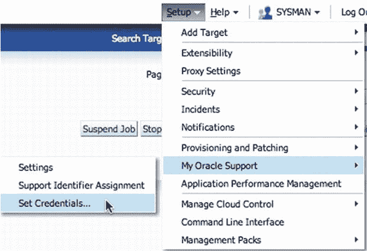

图 6-32. 为 `My Oracle Support` 设置凭据

单击此菜单命令将转到 `My Oracle Support` 首选凭据页面。在这里输入 `MOS` 所需的单点登录名，如图 6-33 所示。然后单击 `Apply`。（`Apply` 按钮旁边是 `Remove` 按钮。如果您想从 `OEM` 中删除 `MOS` 凭据，`Remove` 按钮可实现此功能。）

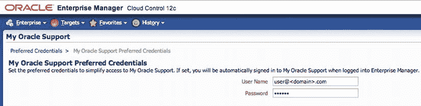

图 6-33. 设置 `My Oracle Support` 首选凭据

将 `MOS` 帐户信息添加到 `OEM` 后，您就可以开始从 `Enterprise Manager` 内部查找补丁和更新。

### 补丁计划

补丁计划可帮助您创建要作为一个组应用到一个或多个目标的合并补丁列表。补丁计划具有映射到部署过程中关键步骤的状态。`Oracle Enterprise Manager` 支持以两种形式创建补丁计划：

*   补丁集
*   补丁（一次性）

*   临时补丁，包含单个错误修复或根据需要提供的一组错误修复。
*   诊断补丁，旨在帮助诊断或验证修复或一组错误修复。
*   补丁集更新。
*   关键补丁更新，现在称为安全补丁更新。

> **注意** 您不能将补丁集和补丁添加到同一个补丁计划中。相反，您可以有一个用于补丁集的补丁计划，另一个用于补丁的补丁计划。

只有当补丁的版本和平台与添加到的目标相同时，才能将补丁添加到计划中的目标。如果您尝试添加与目标关联的产品不同的补丁，将会引发警告。但是，此警告不会阻止您将补丁添加到计划中。您可以在补丁计划中包含任何目标的任何补丁。该计划将根据您的环境验证任何补丁，并检查与已安装补丁的冲突。

根据添加到补丁计划中的补丁，`Oracle` 会自动选择用于应用补丁的适当部署过程。

通过使用补丁计划，我们可以简化许多环境中补丁的识别和部署。这通过帮助我们在实际修补环境之前识别任何潜在冲突，大大增加了我们在补丁方面的灵活性。

> **注意** 补丁计划目前不适用于修补硬件系统或操作系统。如果修补属于 `Oracle Exadata` 一部分的 `Oracle Grid Infrastructure` 目标，您每个补丁计划只能添加一个补丁（`Oracle Exadata`）。对于所有其他目标，只要补丁与要修补的目标具有相同的版本和平台，您可以添加任意数量的补丁。

补丁计划有两种基本类型：可部署和不可部署。

*   当满足以下条件时，补丁计划是可部署的：
    *   它仅包含相同类型的补丁（同质补丁）。
    *   它包含受支持进行修补、配置相似且属于同一产品类型、平台和版本的目标。
    *   计划中没有冲突。
*   任何不满足上述部署条件的补丁计划都是不可部署计划。任何不可部署的补丁计划都无法使用该补丁计划部署补丁。您可以执行一些分析和检查，下载补丁并手动应用它们。

### 创建补丁计划

现在您了解了什么是补丁计划以及两种计划类型，让我们快速浏览一下创建用于应用 `CPU` 补丁的补丁计划的过程。在本节中，您将逐步完成创建可用于补丁集或一次性部署的补丁计划所需的所有步骤。

### 设置补丁计划

要创建补丁计划，您需要从 `Oracle Enterprise Manager` 中的 `Patches & Updates` 页面开始。通过选择 `Enterprise > Provisioning and Patching > Patches & Updates` 导航到此页面，如图 6-34 所示。此页面看起来与 `My Oracle Support` 页面完全相同。唯一的区别是此页面是从 `Enterprise Manager` 内部访问的。

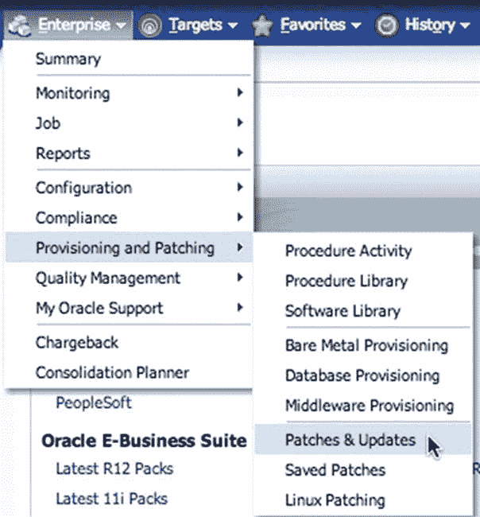

图 6-34. 来自 `Enterprise` 菜单的 `Patches & Updates`

在此页面上，您将通过查看 `Patch Recommendations` 开始创建补丁计划（参见图 6-35）。

图 6-35. `Patches & Updates` 页面上的补丁建议

> **注意** 除非您过去创建过补丁计划，否则 `Patches & Updates` 页面上的 `Plans` 部分将为空。

页面的此部分包含两个单选按钮。默认情况下，选择 `Classification` 按钮。在此对话框中更重要的是 `Oracle` 提供的建议。在图 6-36 所示的示例中，似乎我们有等待处理的安全补丁。让我们将它们添加到计划中。

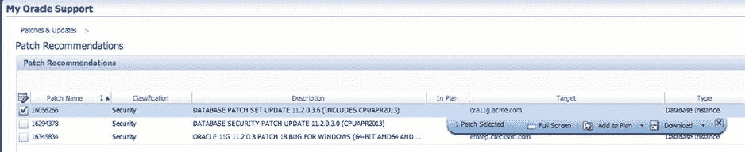

图 6-36. 补丁建议屏幕

单击 `Security` 链接，您将转到如图 6-36 所示的 `Patch Recommendations` 页面。此页面提供了建议的补丁列表及其建议的目标。选中补丁名称旁边的复选框，将打开一个对话框，使您可以直接将补丁下载到桌面或将其添加到补丁计划。

由于您要将此补丁添加到补丁计划中，请点击 `Add to Plan` 下拉菜单，如 图 6-37 所示。此菜单允许您将补丁添加到新建或现有计划中。选择 `Add to New` 选项，将打开一个对话框，允许您为计划命名（参见 图 6-38）。

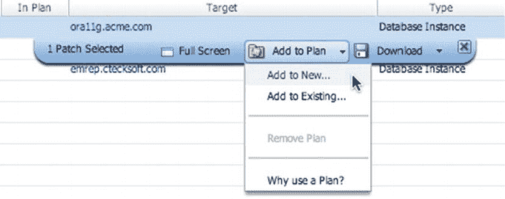

图 6-37. “添加到计划”菜单

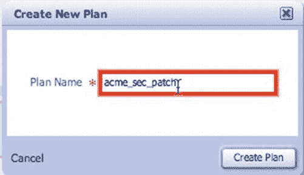

图 6-38. “创建新计划”对话框

为计划命名并点击 `Create Plan`。如果您想添加多个补丁，请先选中所有相关补丁，然后将它们添加到计划中。

 **注意** 如果需要，可以稍后再将补丁添加到计划中。

## 审查计划与部署

计划创建后，您可以通过点击 `View Plan` 来审查它。您也可以从“补丁和更新”页面查看该计划；新计划会列在“计划”窗口中，如 图 6-39 所示。点击计划名称即可详细审查该计划。

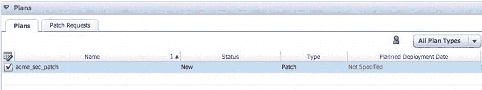

图 6-39. 从“补丁和更新”审查计划

请记住，补丁计划无非就是您想要应用到一个或多个目标上的补丁集合。计划审查是一个包含五个步骤的过程，您可以在屏幕左侧查看。默认情况下，审查从第 2 步开始，您可以在此根据需要向计划中添加补丁（参见 图 6-40）。如果您回退一步并点击第 1 步 `Plan Information`，您可以修改计划名称、设置部署日期并添加计划描述。您还可以为计划添加权限，这些权限将授予各种企业管理器角色 `完全` 或 `查看` 权限。

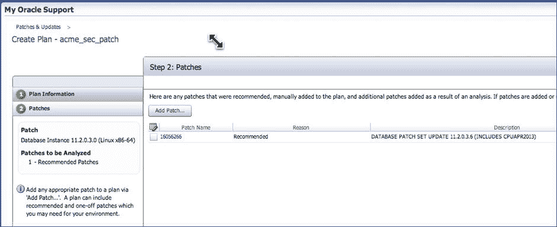

图 6-40. 计划审查的第 2 步

## 添加补丁

在第 2 步中，通过点击 `Add Patch` 按钮将补丁添加到计划中。分析之后，结果可能需要向计划中添加补丁。

您会注意到该计划是可部署的（尽管 图 6-40 中未显示，但此指示会出现在右上角）。如果您不想在计划中更改或添加任何内容，可以点击 `Review` 结束向导，而无需执行第 3 至第 5 步。

 **注意** `完全` 权限允许角色验证计划。`查看` 权限不允许验证计划。

## 设置部署选项

点击“补丁”屏幕底部的 `Next` 进入第 3 步 `Deployment Options`，如 图 6-41 所示。此屏幕包含许多可配置项，可能需要或不需更改。审查所有这些选项对于成功的补丁计划至关重要。

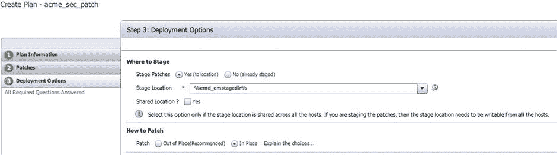

图 6-41. 部署选项（部分屏幕）

在 `Where to Stage` 选项中，您可以指定补丁下载到和/或存储用于修补的位置。默认情况下，补丁将下载并存储在 `%em_emstagedir%` 指定的位置。补丁的暂存位置需要可由将要访问补丁的主机写入。

`How to Patch` 部分提供了两种修补选项：`Out of Place` 和 `In Place`。旁边的超链接解释了每个选择：
*   `Out of Place`：使用较少的停机时间，并保留旧的 Oracle 主目录以供恢复
*   `In Place`：在安装补丁期间需要关闭 Oracle 主目录中的所有数据库

两者都是不错的选择，具体取决于您所需的服务级别协议 (SLA) 或组织策略。Oracle 推荐使用异机修补 (out-of-place)，因为它本质上克隆了您现有的 Oracle 主目录，并允许您通过返回旧的 Oracle 主目录来回退任何您不想要的更改。

“部署选项”页面上的其他部分包括 `What to Patch`、`Customization`、`Recoverability`、`Rollback` 和 `Oracle Home Credentials`。在完成补丁计划审查之前，每个部分都需要审查和验证。

## 验证补丁计划

在第 3 步中验证并配置所有选项后，点击 `Next` 进入第 4 步 `Validation`。在此步骤中，Oracle 企业管理器会检查计划中的补丁与先前安装的补丁是否存在冲突。此检查针对目标清单进行冲突验证。验证会考虑许多因素，可能需要超过 10 分钟才能完成。这些验证包括检查 Oracle 主目录的就绪情况、主目录的空间要求、`OPatch` 版本验证以及其他检查，例如集群节点连接性（如果修补的是 `RAC` 环境）。

图 6-42 显示了验证完成前的屏幕外观。点击 `Analyze` 按钮开始针对补丁计划的目标进行补丁验证。在验证运行期间，您可以离开此屏幕稍后再返回。

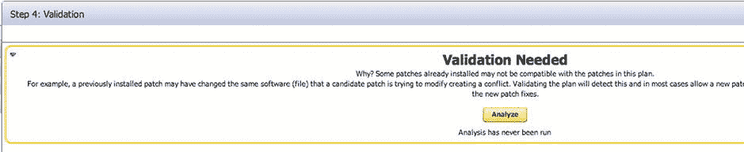

图 6-42. 第 4 步：验证

验证开始后，`Analyze` 按钮上方的消息会发生变化，提供有关该过程的更多信息。您可以通过点击 `Show Detailed Progress Here` 获取详细视图。您可能会注意到分析包含相当多的检查：验证目标是否支持修补；验证普通和提升的用户凭据；验证目标工具、命令、权限以及 `OPatch` 的升级；暂存所选补丁；然后运行修补的先决条件检查。如果所有先决条件通过，该补丁将被视为 `准备部署`。

修补可能存在的任何问题此时都会显示出来。例如，如果存在补丁冲突，可能需要替换或合并补丁。如果没有可用的替换或合并补丁，您可以直接从此屏幕请求此类补丁。

如果需要解决任何问题，它们将列在 `Issues to Resolve` 标题下。分析建议添加的任何内容将列在 `Added from Analysis` 下。常规消息将位于 `Informational Messages` 下。审查完所有这些消息后，您可以点击 `Review` 按钮。

## 审查并部署计划

此时，您可以直接进入第 5 步 `Review & Deploy`。您可以通过在第 4 步点击 `Review` 按钮或点击屏幕左侧的 `Review & Deploy` 来到达此步骤。

在“审查和部署”页面上，详细描述了补丁计划以及将受该计划影响的目标。如果分析后发现了其他目标，它们将被添加到 `受影响的目标` 列表中。在我们的例子中，发现了另外两个监听器并添加了进来，因为它们运行在我们准备修补的同一个 Oracle 主目录中。

将要应用到 Oracle 主目录的补丁也列在此页面上。需要注意的重要一点是 `无冲突` 状态。在我们使用 `CPUAPR2013` 的例子中，我们与该补丁没有冲突。图 6-43 显示了“审查和部署”屏幕的一个子集，表明该计划已准备好部署。

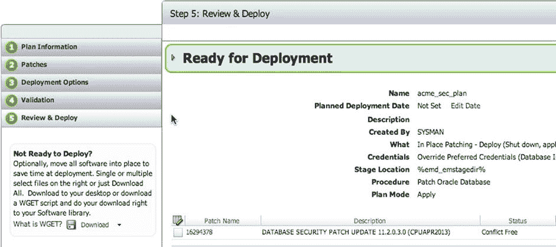

图 6-43. “审查和部署”步骤

