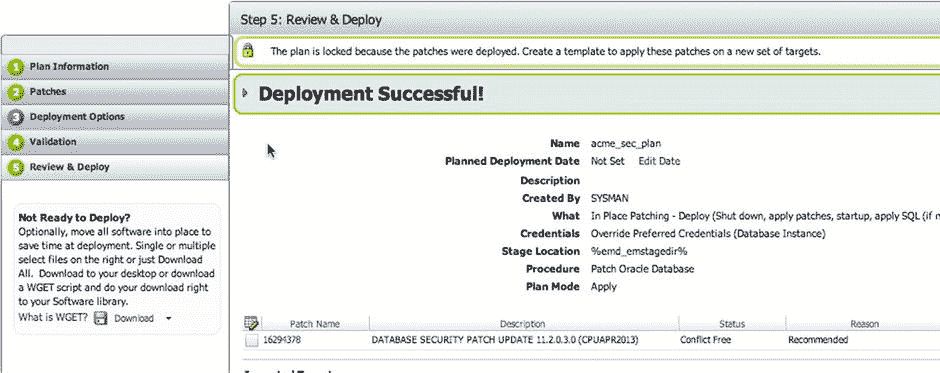
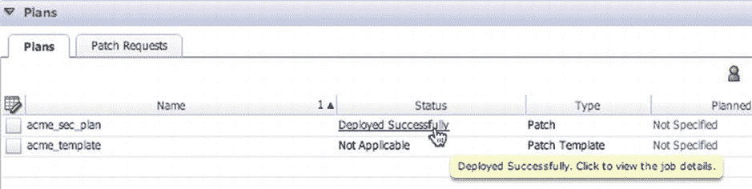
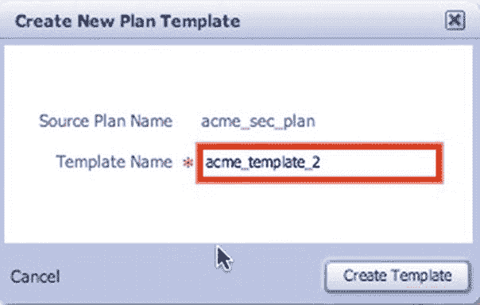
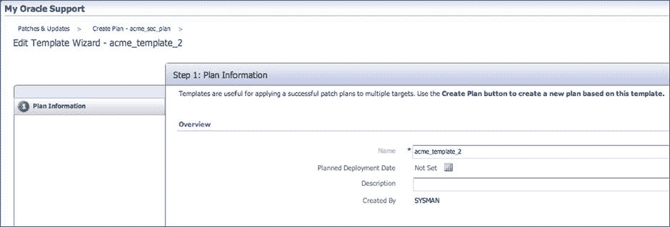
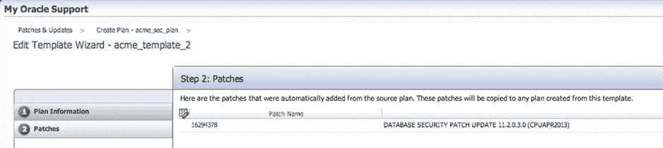
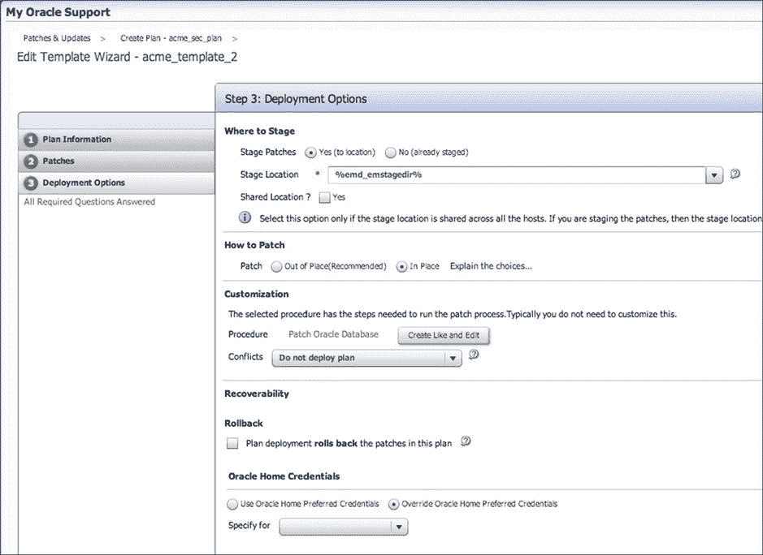
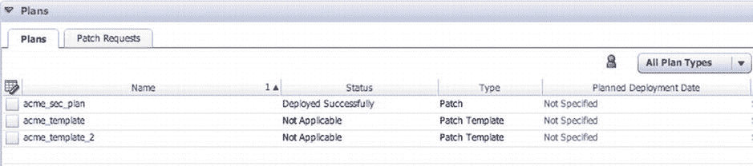
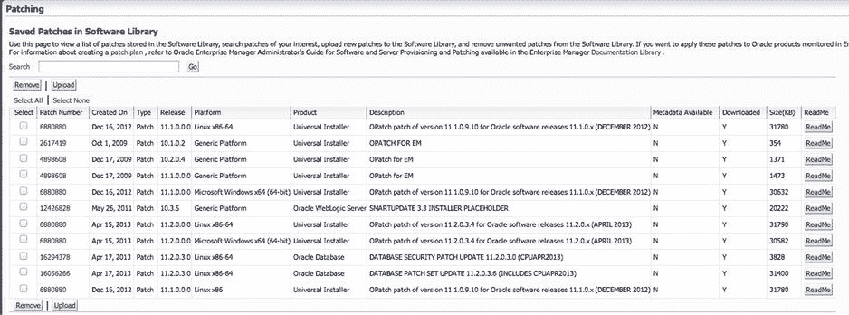
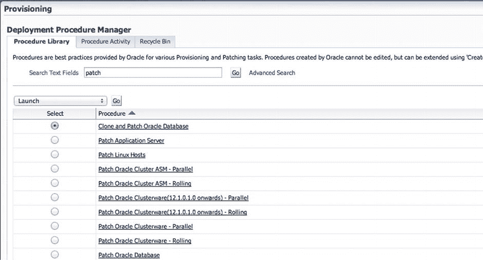

# 补丁部署与模板管理

此前，在步骤 3 中，您已配置补丁计划以使用原地修补。这意味着此补丁计划部署后将会发生服务中断。单击 `Deploy` 按钮可立即开始部署补丁。屏幕会变为 `Deployment in Progress`。后台作业启动，数据库将脱机进行修补。

部署完成后，`Review & Deploy` 屏幕将显示状态为 `Deployment Successful`，如 图 6-44 所示。如果部署未成功，`Review & Deploy` 屏幕将指示部署失败并提供与失败相关的信息。


*图 6-44. 部署成功*

某个目标的部署成功后，该补丁计划无法再用于其他目标。要将补丁计划用于更多目标，需要将其另存为补丁模板。`Review & Deploy` 屏幕底部有一个 `Save as Template` 链接，可让您将补丁计划保存为模板。我们将在下一节讨论模板。

### 计划模板

如前所述，补丁计划可以保存为计划模板。这可以在 `Deployment Successful` 页面底部启动。在创建计划模板之前，您需要确保要使用的补丁计划已成功分析和部署。

与任何类型的模板一样，模板不关联任何目标，这使得该模板可应用于多个目标。在计划模板内部，可以使用 `Create Plan` 按钮基于该模板创建新计划，并可重复应用于多个目标。

在创建模板之前，您需要确保要使用的补丁计划已成功部署。这可以通过 `Patches & Updates` 页面完成，访问路径为：选择 `Enterprise`  `Provisioning and Patching`  `Patches & Updates`。在此屏幕上，所有补丁计划都列在 `Plans` 列表中。您需要查找的状态是 `Deployed Successfully`，如 图 6-45 所示。


*图 6-45. 计划部署成功*

一旦有了成功的补丁计划，就可以基于该计划创建模板。首先，单击成功的计划名称。这将带您返回该补丁计划的 `Review & Deploy` 页面。在页面顶部，请注意一把锁以及关于该计划已被锁定的说明。此时，您需要创建一个模板，以便将此计划用于其他目标。

`Review & Deploy` 页面底部是 `Save as Template` 链接。单击此链接，会弹出一个对话框，要求输入模板名称（见 图 6-46）。输入一个能描述该补丁计划的名称，该计划将用于其他目标。


*图 6-46. “创建新计划模板”对话框*

单击 `Create Template` 按钮，模板即创建完成。在 `Patches & Updates` 屏幕顶部，您可以看到一条说明模板已创建的消息。此消息还包含一个 `View Template` 链接。单击该链接可访问 `Edit Template Wizard`。此向导与前面讨论的 `Create Plan Wizard` 类似。编辑模板只有三个步骤。

第一步是 `Plan Information`。在此页面上，您可以添加或修改模板名称、设置计划部署日期以及添加描述（见 图 6-47）。单击 `Next` 进入向导的下一步。


*图 6-47. 编辑模板向导的第一步：计划信息*

模板向导的第二步列出了与该模板关联的补丁。因为补丁计划已经成功部署，所以补丁已添加到模板中。无法向模板添加更多补丁；任何新补丁都必须通过补丁计划流程进行应用和验证。图 6-48 显示了已添加到模板的补丁。单击屏幕底部的 `Next`。


*图 6-48. 编辑模板向导的第二步：补丁*

第三步提供的部署选项与补丁计划可用的选项类似。但是，模板没有关联的目标。就像处理补丁计划一样，为模板选择所需的部署选项。这些选项取自您先前创建补丁计划时使用的选项。您可以保留先前的选择，或做出新的选择，如 图 6-49 所示。


*图 6-49. 编辑模板向导的第三步：部署选项*

完成选择后，单击页面底部的 `Exit Wizard`。这将带您返回 `Deployment Successful` 页面。此时，您需要返回 `Patches & Updates` 页面，查看模板是否列在 `Plans` 窗口中（见 图 6-50）。


*图 6-50. 列出模板的“计划”窗口*

### 已保存的补丁

使用补丁计划或模板部署的补丁存储在 `Software Library` 中。您可以从 `Saved Patches` 位置查看 `Software Library` 中存储了哪些补丁：选择 `Enterprise`  `Provisioning and Patching`  `Saved Patches`。图 6-51 显示了当前在 `Software Library` 中的已保存补丁列表。


*图 6-51. 软件库中的已保存补丁*

在 `Saved Patches` 页面上，您可以执行各种操作。如果需要，可以手动上传和删除补丁。您还可以访问相关补丁的自述文件。如果 Oracle Management Server 无法连接到互联网且需要手动下载补丁，这些功能使离线修补更易于操作。

有关离线修补的更多信息，请参阅 *Oracle Enterprise Manager Lifecycle Management Administrator’s Guide 12c Release 2 (12.1.0.2)*，网址如下：
```
http://docs.oracle.com/cd/E24628_01/em.121/e27046/pat_mosem_new.htm#BABBIEAI
```

## 其他修补过程

其他修补过程可用于补丁的部署。您可以通过选择 `Enterprise`  `Provisioning and Patching`  `Procedure Library`，然后在 `Search Text Fields` 文本框中搜索补丁来访问这些过程（见 图 6-52）。


*图 6-52. 过程库（部分列表）*

如您所见，有许多可用的其他修补过程，例如 `Clone and Patch Oracle Database`、`Patch Application Server` 以及并行和滚动补丁。凭借所有这些选项，Oracle Enterprise Manager 成为帮助管理员修补其环境的宝贵工具。

## 修补所需的角色


