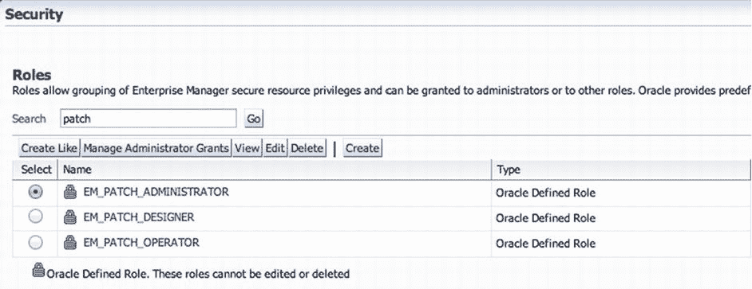
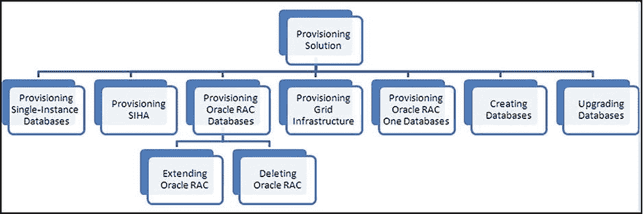
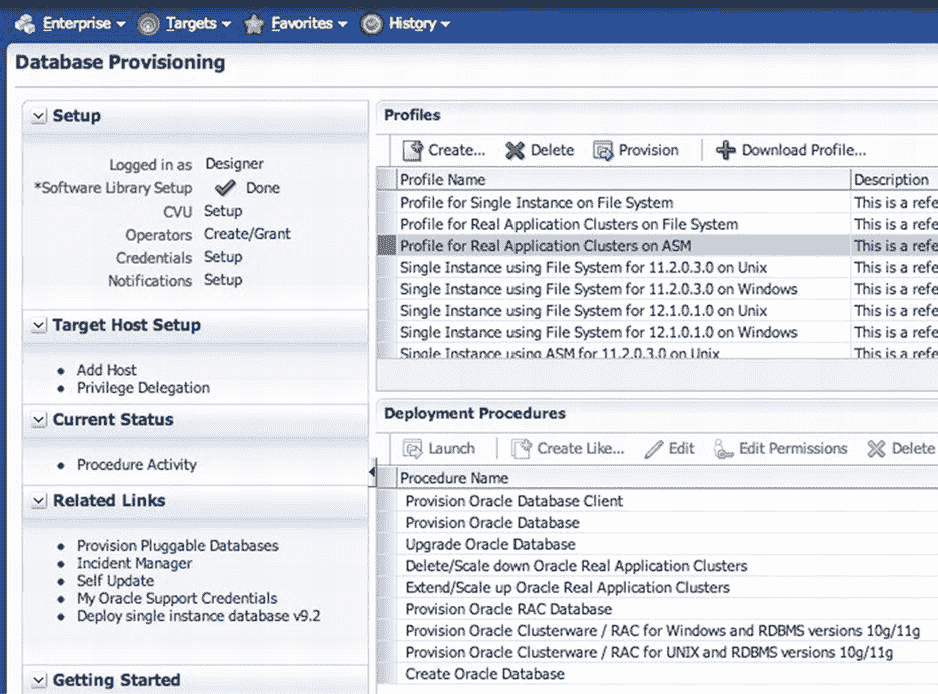
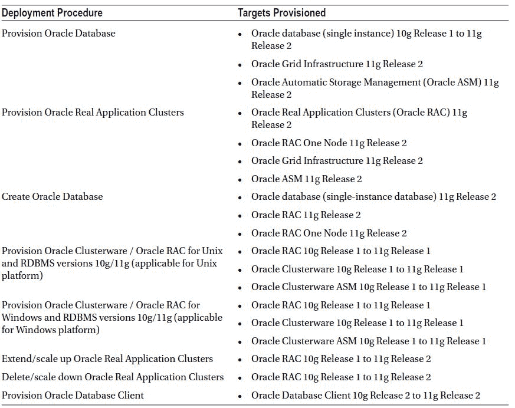

# 补丁角色与数据库配置

EM12c 提供了一些新的、专用于补丁操作的现成角色：`EM_PATCH_ADMINISTRATOR`、`EM_PATCH_DESIGNER` 和 `EM_PATCH_OPERATOR`。需要将这些角色授予负责补丁活动的管理员。

要在 Oracle Enterprise Manager 中查看这些角色，请选择 Setup  Security  Roles。然后搜索关键字 `patch`。这将显示所有与补丁相关的角色（参见 图 6-53）。

图 6-53. 位于 Security 下的补丁角色

让我们了解一下这些为补丁定义的角色：

*   `EM_PATCH_ADMINISTRATOR`：此角色用于在 Enterprise Manager 中为任何补丁计划创建、编辑、部署、删除和授予特权。创建后，此角色还可以将特权授予其他管理员。这是一个对 Enterprise Manager 中任何补丁计划和模板拥有完全权限的访问角色。此角色应有限制地授予。
*   `EM_PATCH_DESIGNER`：此角色可以创建和查看任何补丁计划。此角色通常在补丁生命周期（开发、测试和生产）中用于识别补丁。此角色通常分配给组织中的高级 DBA。此角色能够创建补丁计划和模板，并将这些计划的特权授予 `EM_PATCH_OPERATOR`。
*   `EM_PATCH_OPERATORS`：此角色用于部署补丁计划。此角色非常有限，因为它只能部署补丁计划。它没有创建或修改任何补丁计划或模板的权限。此角色非常适合组织中的初级 DBA。

这些新的补丁角色使管理员能够在部门的多个层级之间分配工作，同时确保补丁按照一致的时间表应用。

## 配置

*配置（Provisioning）* 是 Cloud Control 提供的生命周期中另一个重要部分。它允许我们以自动化方式配置数据库选项，例如单实例 Oracle 数据库和 Oracle Real Application Cluster 数据库；从 Real Application Clusters、Oracle Real Application Clusters One 中扩展或删除节点；以及升级单实例数据库。

### 数据库配置概述

首先，让我们对数据库配置有一个概览。图 6-54 以分层视图显示了解决方案。

图 6-54. 配置的分层视图

在继续之前，有几个特性需要理解。这些特性如下：

*   `Designer and operator roles`：Cloud Control 为配置管理员提供设计师和操作员角色。这些明确定义的角色使您能够锁定部署过程的输入，以提供标准的部署配置。
*   `Locking-down feature in the designer role`：配置的此特性使设计师能够锁定一组变量，例如主机目标、凭据和要在部署过程中配置的 Oracle 主目录。这有助于标准化并最大程度地减少大规模部署中配置的错误。操作员可以部署设计师保存在过程库中的过程。
*   `Provisioning profiles and database templates`：配置文件（Provisioning profiles）用于配置中，以确保部署的标准化并最小化错误。
*   `Creating databases using Cloud Control`：您可以直接从 Cloud Control 控制台创建数据库。这是为了确保数据库可以从单一界面进行配置和创建。
*   `Easy-to-navigate database provisioning wizards`：设计师和操作员可以轻松使用和导航 Cloud Control 中的数据库配置向导。
*   `Self Update`：自更新（Self Update）特性用于自动下载和安装配置实体的更新。
*   `Database Provisioning console for all database provisioning activities`：数据库配置控制台是所有数据库配置活动的中心起点。控制台显示有关配置设置、配置文件、部署过程以及有关如何开始配置的信息。

要访问数据库配置控制台，请选择 Enterprise  Provisioning and Patching  Database Provisioning。您会注意到用于裸机（Bare Metal）和中间件（Middleware）的附加配置选项；这些用于配置服务器和中间件目标。需要明确的是，本章我们关注的是数据库配置。图 6-55 显示了数据库配置控制台的上部。

图 6-55. 数据库配置控制台

## 支持的目标与部署过程

既然您有了数据库配置的起点，那么可以配置什么？如何配置？Cloud Control 使您能够通过使用部署过程（deployment procedures）来执行数据库配置。*部署过程* 是一系列按顺序运行以完成配置任务的预定义步骤。表 6-3 列出了 Cloud Control 中提供和用于配置数据库的过程。

表 6-3. 用于数据库配置的部署过程

使用表 6-3 中的部署过程，有多种用例。本章无法一一讨论，因此在本章剩余部分，我们将专注于单实例 Oracle 数据库的配置。

## 数据库配置的设置

使用 Oracle Enterprise Manager Cloud Control 中的配置选项，您可以使用模板、安装介质、数据库实体或配置文件来配置 Oracle 数据库、Oracle Real Application Clusters 数据库和 Oracle Real Application Clusters One 数据库，以实现标准化部署。

### 创建配置文件

