# 创建 Oracle 数据库配置文件与安装媒体

## 配置文件简介

`provision profile`（配置文件）是一个包含软件位和配置信息的实体。当从现有安装创建配置文件时，它为克隆 Oracle 数据库提供了灵活性。我们可以通过使用配置文件来创建数据库模板。使用配置文件能够在部署中实现标准化。配置文件通过避免错误减少了重新安排部署的需要，并提高了部署流程的效率。让我们来看看如何创建配置文件。

### 启动配置向导

要创建配置文件，您需要访问配置数据库控制台，选择 **Enterprise**  **Provisioning and Patching**  **Database Provisioning**。在“Profiles”部分的顶部是一个**Create**按钮。点击此按钮（如图 6-56 所示）以启动“数据库配置配置文件向导”。这个四步向导将引导您完成配置文件的创建过程。

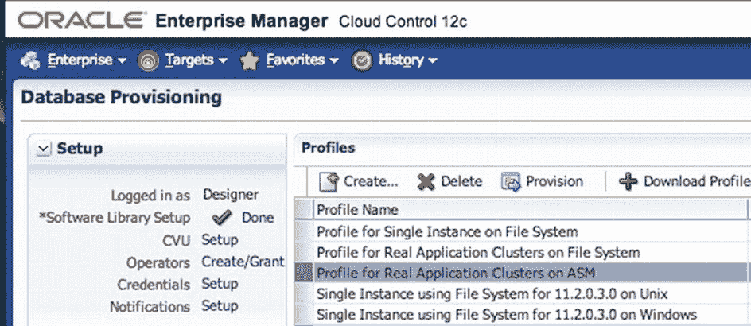

图 6-56. 点击创建按钮

### 步骤 1：选择参考目标

向导从步骤 1 开始，要求选择一个参考目标（参见图 6-57）。这是您想要用来构建配置文件的目标。点击搜索图标并选择要使用的目标。然后点击**Next**继续。

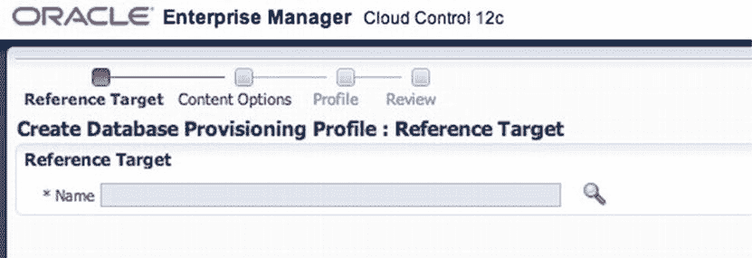

图 6-57. 参考目标

### 步骤 1：选择目标组件

现在您将看到特定于目标的组件。这些组件将被包含在配置文件中（参见图 6-58）。根据参考目标，您可以选择保留这些项或从配置文件中移除它们。

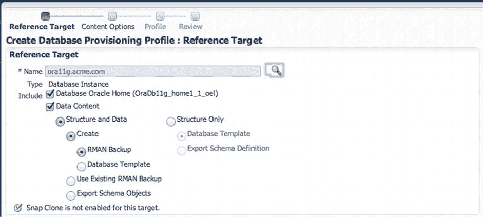

图 6-58. 参考目标组件

### 步骤 1：配置凭据

在参考目标页面的右侧是“Credentials”（凭据）部分，如图 6-59 所示。您需要选择**Preferred Credentials**或**Named Credentials**。如果需要添加这些凭据，请使用 **Setup**  **Security** 功能。第 4 章涵盖了如何向安全模块添加凭据。如果一切设置完毕，点击**Next**。

图 6-59. 凭据部分

### 步骤 2：内容选项

创建配置文件的第二个步骤是“Content Options”（内容选项），如图 6-60 所示。如果需要，此步骤将使用`RMAN`执行备份。如果数据库处于`ARCHIVELOG`模式，则可以执行热备份。否则，将进行冷备份。点击**Next**。

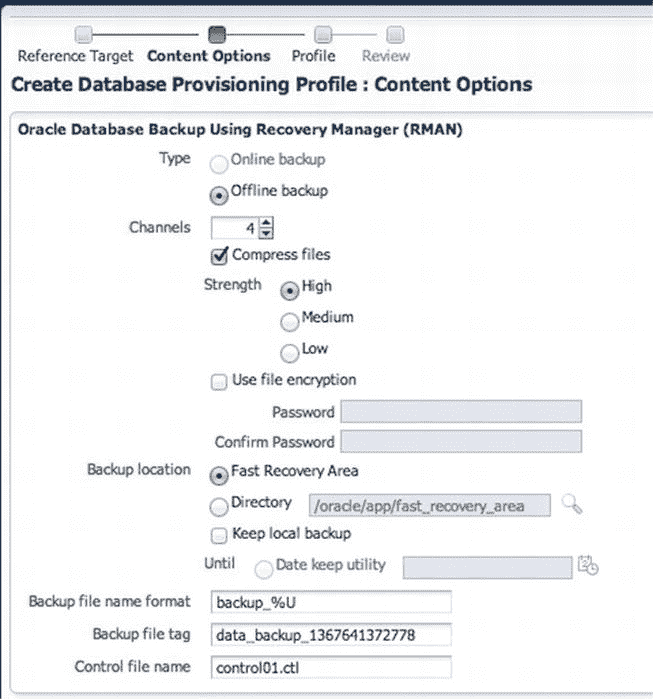

图 6-60. 内容选项

### 步骤 3：配置文件设置

“Profile”页面（如图 6-61 所示）是创建配置文件的第三步。此时，您可以编辑或保留页面上的默认设置。此配置文件的存储位置也在“Software Library Storage”（软件库存储）部分定义。这表明我们将把此配置文件存储在软件库中以供以后使用。图 6-62 中未列出的是计划和工作目录窗口。这些区域可以根据需要更改。点击**Next**。

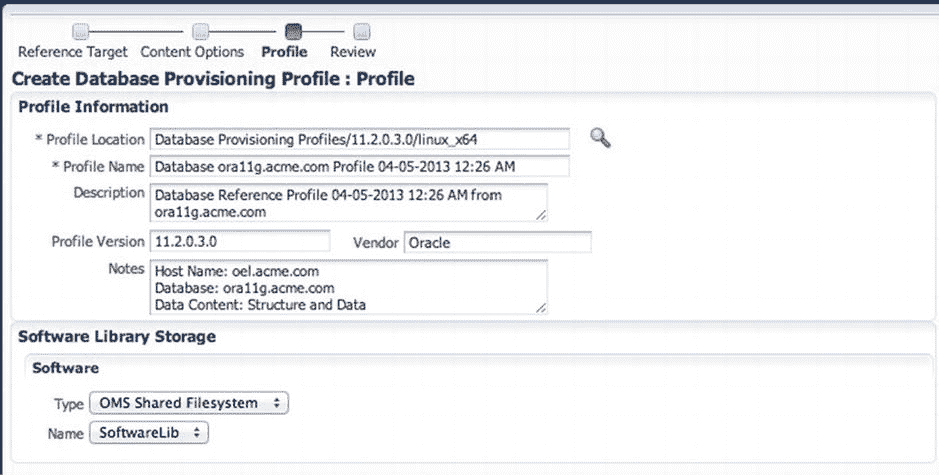

图 6-61. 配置文件页面

### 步骤 4：复核与提交

最后一步是“Review”（复核）页面，如图 6-62 所示。与其他复核页面一样，您可以在点击**Submit**之前在此处复核您的选择。点击**Submit**以创建配置文件。

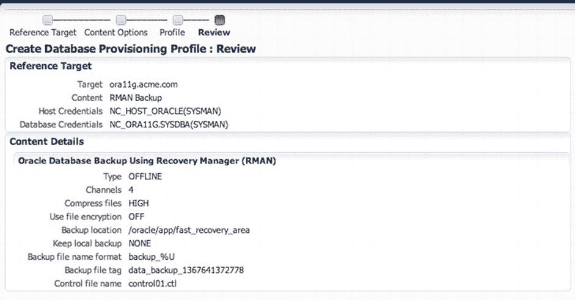

图 6-62. 复核配置文件

作业提交并创建后，请确保配置文件出现在数据库配置页面中。

 **注意**  提交的配置作业将为所选数据库创建黄金镜像。

## 创建安装媒体

另一种配置 Oracle 数据库的方法是将安装媒体上传到软件库中。然后，可以通过部署过程将安装媒体推送到目标系统。让我们看看如何创建安装媒体并将其上传到软件库。

### 准备安装文件

在将安装媒体上传到软件库之前，您需要从 Oracle 下载媒体文件。可以从 Oracle 技术网络（OTN）、My Oracle Support（MOS）或 Oracle 的 E-Delivery 门户下载媒体文件。

 **注意**  任何人都可以从 Oracle 技术网络下载软件。如果您有有效的客户支持标识符（CSI），您也可以从 E-Delivery 访问并下载。

您需要将 Oracle 数据库的`zip`文件下载到您正在工作的主机上的临时目录中。这些文件位于从 Oracle 下载的介质的磁盘 1 和磁盘 2 上。然后按照以下步骤操作：

1.  下载磁盘 1 和 2 的文件后，导航到保存它们的临时位置。需要使用系统上的解压缩工具解压这些文件。然后将这两个文件合并为一个压缩文件。
2.  选择 **Enterprise**  **Provisioning and Patching**  **Software Library** 打开软件库。在软件库中，选择要为其创建数据库安装媒体的目录。
3.  选择了存放二进制文件的目录后，您需要在此文件夹下创建一个新实体。在软件库的“Actions”菜单中，选择**Create Entity**，如图 6-63 所示。

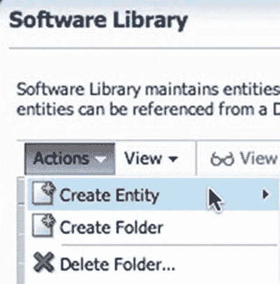

图 6-63. 在软件库中创建新实体

4.  接下来，您需要将安装媒体作为新实体上传到软件库。此过程类似于本章前面使用的步骤，只是在选择组件时选择**Installation Media**（参见图 6-64）。点击**Continue**。

图 6-64. 创建安装媒体实体

5.  在“Describe”（描述）页面上，安装媒体唯一需要的输入是名称。此页面上的所有其他信息都是可选的。点击**Next**。
6.  在“Configure”（配置）页面上，您指定了安装媒体的组件，如图 6-65 所示。媒体上传到软件库后，这些设置无法更改。点击**Next**。

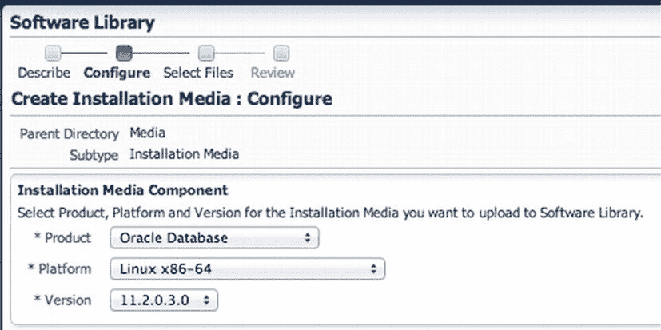

图 6-65. 安装媒体组件的规格

7.  接下来是“Select Files”（选择文件）页面，您将在这里选择之前为数据库二进制文件创建的那个压缩文件。默认情况下，选中了**Upload Files**（上传文件）选项。在指定的目标位置下，我们需要选择要放置`zip`文件的上传位置。点击搜索图标以打开“Select Upload Location”（选择上传位置）对话框，如图 6-66 所示。

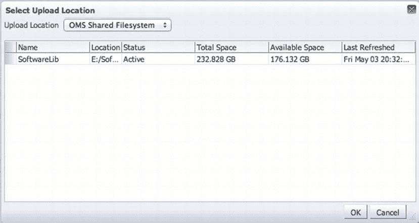

图 6-66. 选择上传位置

8.  由于我们只有一个软件库，点击 **确定**。所选位置将显示在“选择文件”页面上。然后在“指定源”部分，点击“添加”按钮并选择要上传到软件库的 zip 文件（参见图 6-67）。点击“下一步”。

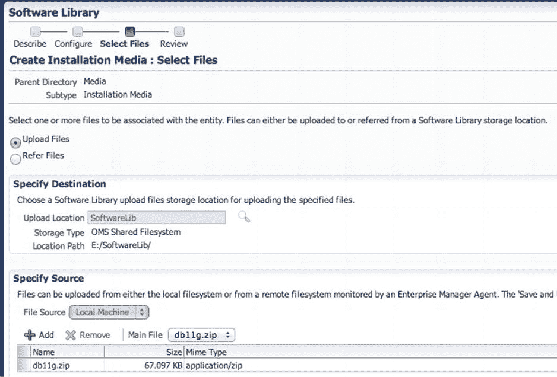

图 6-67. “选择文件”页面

9.  最后，在“审阅”页面上，您可以查看所有已选择的选项，然后点击“保存并上传”。这会将我们的 zip 文件上传到软件库中。上传完成后，您只需验证文件是否已上传到预期位置。

## 配置数据库

到目前为止，您已经了解了如何创建配置配置文件和创建安装介质。现在，让我们看看如何使用其中一种方法来配置数据库。在此示例中，您将使用“创建安装介质”部分中创建的安装介质。请记住，`Oracle Enterprise Manager` 可用于通过诸如 `Database Provisioning`、`Bare Metal Provisioning` 和 `Middleware Provisioning` 等工具来配置多种类型的目标。

要开始配置数据库，您需要打开 `Database Provisioning` 控制台；选择 `Enterprise -> Provisioning and Patching -> Database Provisioning`。

在“数据库配置”页面上，您将使用部署过程来配置数据库。因为我们配置的是单个数据库，所以选择 `Provision Oracle Database` 并点击“启动”按钮，如图 6-68 所示。此时，`Oracle` 数据库的配置向导将启动。

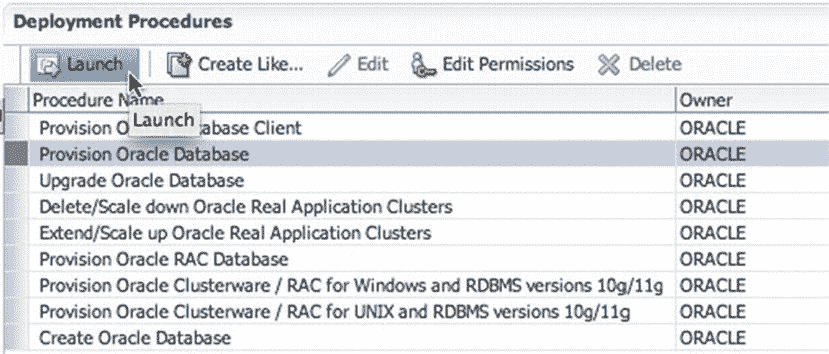

图 6-68. 选择并启动 `Provision Oracle Database` 部署过程

当“配置数据库”向导启动时，您可以看到它与 `Oracle Enterprise Manager` 中的许多其他向导类似。此向导是一个五步流程，第一步使您能够选择要配置数据库的主机。向导步骤如下：

### 1. 选择主机
在“选择主机”页面上，您可以选择使用一个配置配置文件。默认情况下，此选项设置为 `None`。因为我们使用安装介质来配置数据库，所以无需选择配置配置文件。

“选择主机”页面上的接下来两个部分对于配置数据库非常重要。在“选择要执行的任务”部分，您需要选择平台和版本，以及是否安装 `Grid Infrastructure` 并部署数据库软件。`Version` 下拉框提供了支持配置的所有 `Oracle` 版本（参见图 6-69）。

 **注意** `Oracle Enterprise Manager Cloud Control 12c Bundle Patch 2 Update 1` 包含对即将发布的 `Oracle` 产品的插件和支持。

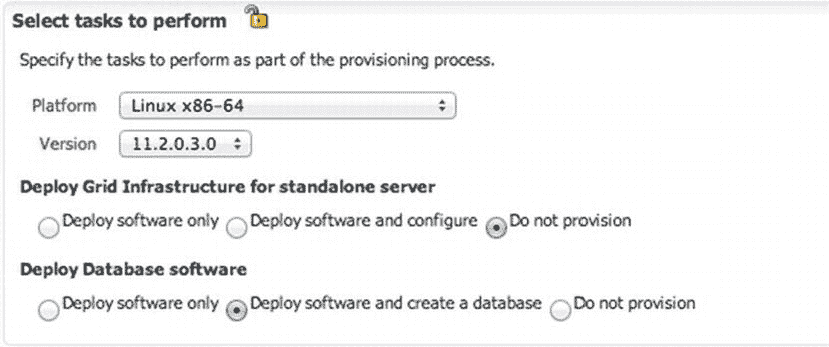

图 6-69. 选择要执行的任务

### 2. 选择目标主机
在“选择目标主机”部分，您添加一个或多个主机来配置数据库软件到其上。目标主机的选择由前面的“选择要执行的任务”部分中选择的平台决定。图 6-70 显示了一个选作目标的主机。所有内容选择完毕后，点击“下一步”。

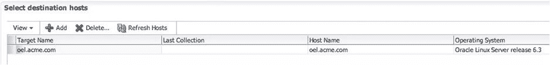

图 6-70. 目标主机的选择

### 3. 提供配置详细信息
现在您进入步骤 2，必须为配置过程提供配置详细信息。在进入步骤 3 之前，需要完成并勾选每一项任务（参见图 6-71）。

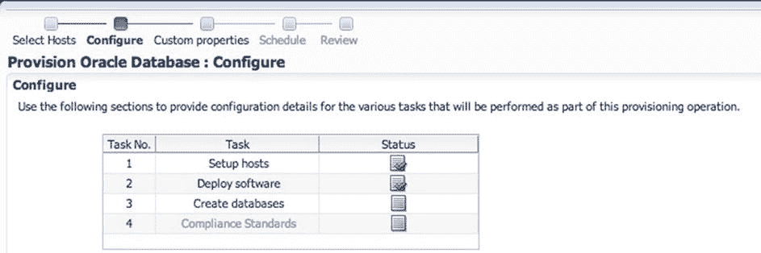

