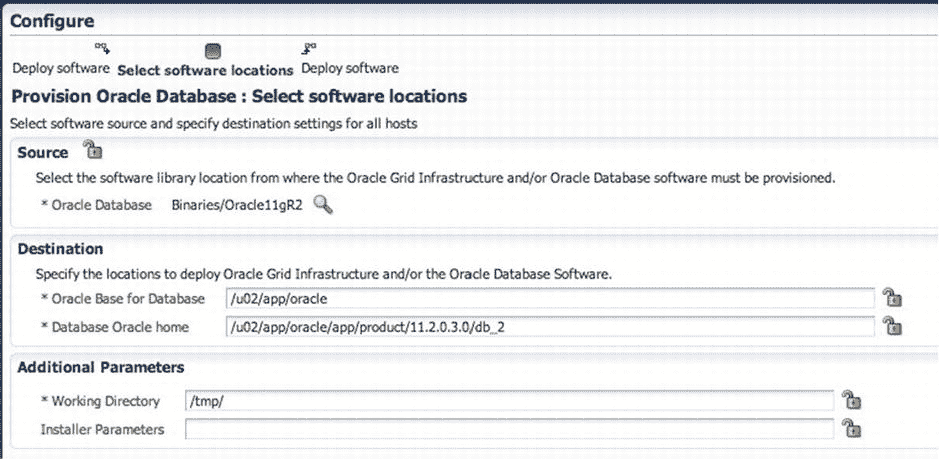
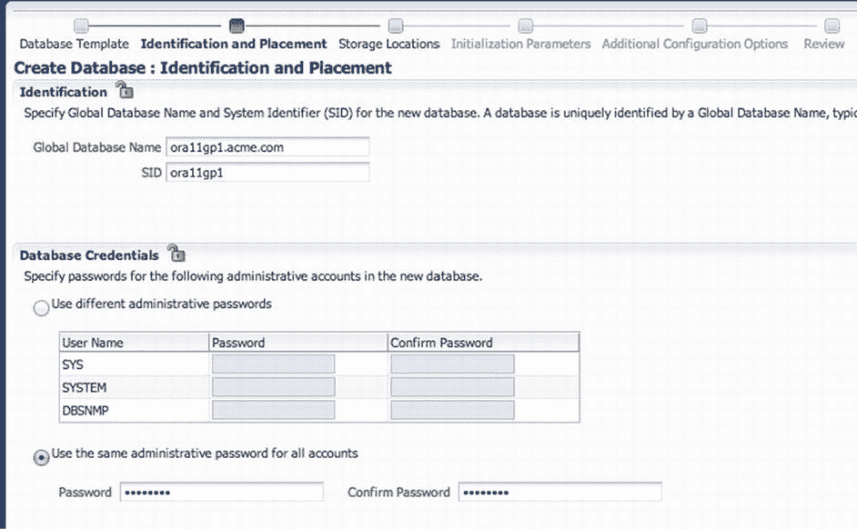
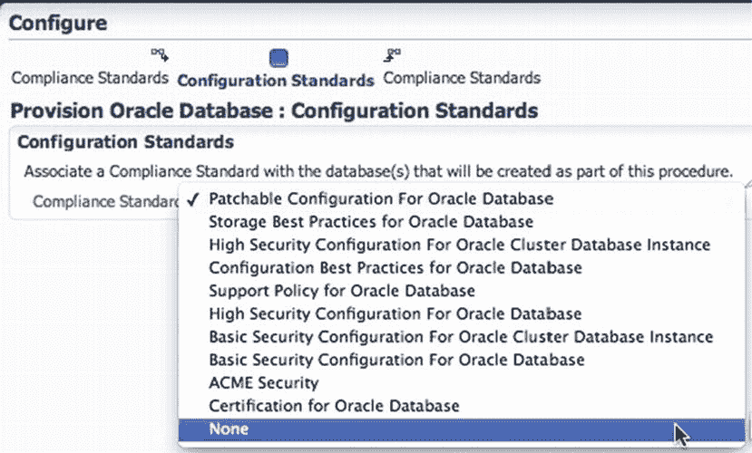
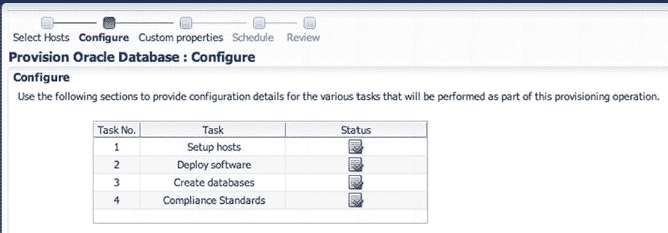
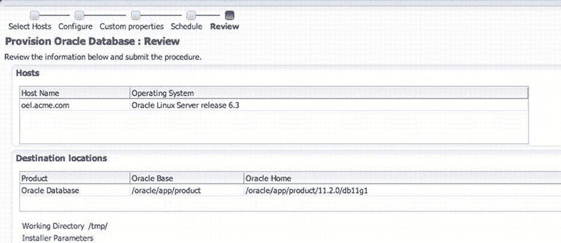

# 配置数据库配置任务

图 6-71. 提供配置详情

配置页面上列出的任务是向主机配置数据库所必需的：

1.  `设置主机`任务允许我们设置用于主机的普通和特权用户名及密码。这些密码可以提前在`设置` → `安全` → `命名凭证`下设置，也可以在任务过程中创建。所有密码配置完成后，状态列会出现绿色的复选标记。
2.  第二个任务是指定要部署的软件。点击`部署软件`链接，您将进入一个单步向导，您可以在此指定此部署的源、目标和其他参数（参见图 6-72）。要部署数据库软件，您需要选择要部署的软件。点击源部分的搜索工具，然后从软件库中选择软件。接下来，提供部署详细信息，例如目标位置和部署所需的任何其他参数。点击`下一步`。

图 6-72. 选择软件位置

3.  用于配置数据库的第三个任务是`创建数据库`任务。与前两步一样，您点击`创建数据库`来启动向导。这个包含六步的向导类似于 Oracle 数据库配置助手，但它是 Oracle 企业管理器内部的。点击`下一步`逐步完成向导并配置许多项目，例如`SID`和密码，如图 6-73 所示。

图 6-73. 标识和放置

4.  四项任务中的最后一项是`合规性标准`。点击`合规性标准`进入其一步向导。在这里，您可以为新的数据库分配一个合规性标准。这大大加快了根据内部合规性标准配置数据库的速度（参见图 6-74）。对于本示例，选择`无`并点击`下一步`。

 `注意` 有关 Oracle 企业管理器内合规性配置的更多信息，请参阅 Oracle 文档。

图 6-74. 设置配置标准

5.  一旦所有内容都配置完成，如图 6-75 所示，您就可以继续进行向导的后续步骤。点击`下一步`。

图 6-75. 配置完成

向导的第三步被跳过，因为我们没有使用任何自定义属性。在第 4 步中，Oracle 企业管理器会安排软件的部署。您可以将部署安排为立即执行（这是默认设置）或在稍后时间执行。此外，您可以指定是否应使用通知来指示任何问题或疑虑，或指示何时成功。如果此页面上无需更改，请点击`下一步`。

数据库配置的最后一步是第 5 步，即复查步骤（参见图 6-76）。从这里您可以查看所有已配置的选项并提交作业。

图 6-76. 复查配置 Oracle 数据库的选项（部分屏幕）

提交作业后，您将被带到配置页面，在那里可以监控作业。此页面加载了大量有价值的信息。您可以停留在此页面，也可以离开去处理其他事情，同时数据库正在配置中。

## 总结

EM12c 是在您的环境中进行打补丁和配置的宝贵工具。为了灵活性并提供多种选项，Oracle 企业管理器依赖软件库作为补丁、安装软件和黄金镜像等软件的中央存储位置。打补丁和配置是企业管理器生命周期中两个有价值的选项。这些选项使管理员能够快速为旧环境打补丁，并非常快速、安全地配置新环境。

