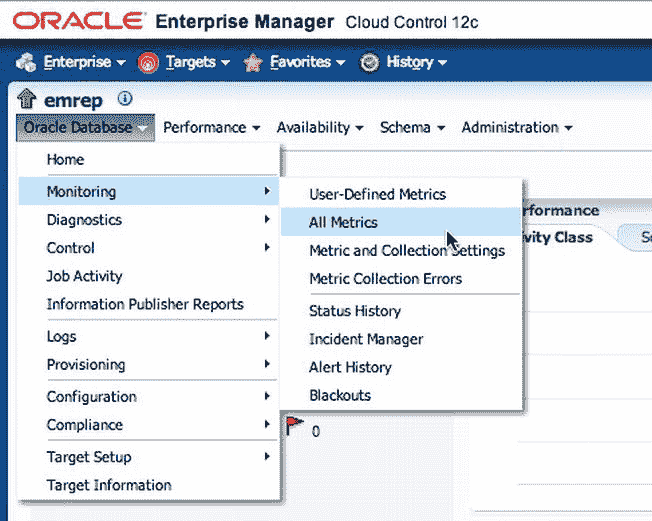
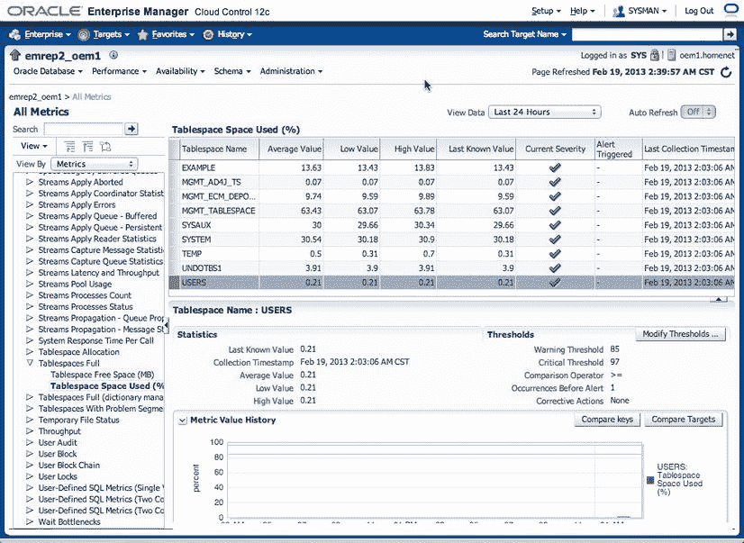

# 管理和监控最佳实践

作者：Leighton Nelson

Oracle Enterprise Manager Cloud Control 12c 从底层开始构建，用于管理和监控整个 IT 堆栈中的企业基础设施和应用程序。为了有效管理您的环境，应遵循各种技术和最佳实践。监控您的环境可确保没有组件被忽视。通过使用事件、指标和事件，您可以随时为自己提供环境的全面概况。

本章介绍了一些使用 EM12c 监控和管理环境的最佳实践。讨论了以下最佳实践领域：

*   指标阈值
*   监控模板
*   管理组
*   模板收集
*   同步计划
*   事件管理

## 指标阈值

`指标阈值`是监控方面的主要功能。它们使您能够积极主动，以便及时发现问题并加以解决。企业管理器云控制包含多种类型的指标，可用于监控目标。根据目标类型，可以使用几类指标。应配置指标阈值，以便触发警报并通过通知发送给管理员。

指标阈值关联两个严重级别：`警告`和`严重`。例如，您可以为数据库中的表空间设置一个指标阈值，当表空间使用率超过 80% 时发送警告警报。然后，您可以设置另一个阈值，当表空间使用率超过 95% 时发送严重警报。警告阈值将在问题变得严重之前留出足够的时间来处理问题。严重警报则表示即将出现的问题，需要立即采取行动。

在定义阈值时，首先确定应设置阈值的重要组件。这可能包括数据库实例、监听器和文件系统。然后，可以为每个目标类型从 EM12c 中选择指标。

要查看数据库实例的所有指标阈值及其值，请按照以下步骤操作：

1.  从 Oracle 数据库下拉菜单中，选择`监控` → `所有指标`，如图 7-1 所示。

图 7-1. 查看指标阈值列表

2.  将显示类似于图 7-2 的指标和阈值显示。仅为您关心的指标设置阈值。选择过多的指标可能会产生大量“白噪音”，导致严重警报被忽略。您还应禁用不需要用于报告或监控目的的指标，以减少存储消耗。

图 7-2. 数据库指标及其当前阈值设置

