# 阈值设置与监控模板

阈值应通过在性能或负载测试期间收集数据来确定。当性能处于可接受范围时，可参考可用的指标历史记录来获取这些值。同时，需定义目标可用性的度量标准，例如数据库实例状态。为关键阈值选择的数值应保守，以便仅在极其严重的情况下发出警报，例如表空间使用率超过 97%时。

要为指标设置数值，请遵循以下步骤：

1.  点击一个指标类别，例如 `Tablespaces Full`。这些类别在图 7-2 的左侧列出。
2.  点击一个具体的指标，例如 `Tablespace Space Used (%)`。
3.  点击 `Modify Thresholds` 按钮。您应该会看到一个类似于图 7-3 的对话框。

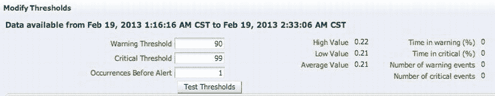
图 7-3. 为指标输入阈值

4.  输入指标的数值。

EM12c 包含开箱即用的默认阈值，可作为您自行监控的基础。您可以根据需要自定义这些阈值，以确保其满足您业务的服务级别协议。如果阈值不合适，或者为了响应服务级别的变更，您可以随时间对其进行微调。

虽然本节介绍的逐一设置方法为单个目标设置阈值提供了一种便捷方式，但随着企业中目标数量的增加，这种方法会变得越来越困难和耗时。因此，我推荐的设置指标阈值的方法是使用监控模板。

## 监控模板

*监控模板*是针对特定目标类型的指标阈值集合。指标阈值应在监控模板上设置，然后应用于一个或多个目标。例如，您可以为生产数据库实例创建一个监控模板，其中可能包含以下指标及其警告/严重阈值：

*   `Tablespace Space Used (%)` > 80/97
*   `Archive Area Space Used (%)` > 75/90
*   `Dump Area Used (%)` > 90/95
*   `Status` = `DOWN`

然后，您可以将该监控模板应用于所有生产数据库实例，从而简化标准化监控设置的任务。您可以为每种目标类型创建单独的监控模板。例如，您可以创建监听器模板、主机模板等。

在监控模板中设置的指标阈值不应过于细粒度，而应足够宽泛，以满足大多数目标的一般服务级别要求。如果需要更细的粒度，可以创建额外的模板并将其应用于有需要的目标。请以创建最少数量的模板来覆盖尽可能多的目标为思路。不要随意创建超出需要的模板，因为管理它们只会增加额外的工作量。只创建您需要的，但不要超出需要。

要创建监控模板，请遵循以下步骤：

1.  运行 `Enterprise Manager Cloud Control` 控制台。
2.  选择 `Enterprise`  `Monitoring`  `Monitoring Templates`，如图 7-4 所示。

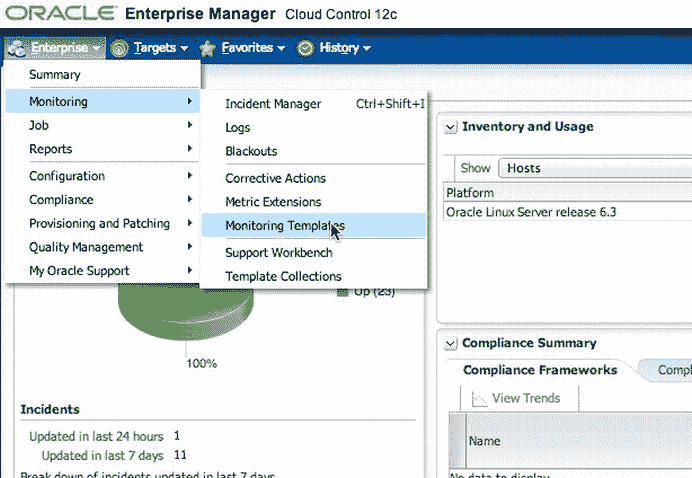
图 7-4. 准备创建新的监控模板

3.  `Monitoring Templates` 页面将打开。点击 `Create` 按钮以创建模板。
4.  选择一个具有代表性的目标，该目标应与您要创建的监控设置相对应，如图 7-5 所示。此目标将用作监控模板中指标和策略的基础。例如，要创建数据库实例监控模板，请从现有的数据库实例目标中选择一个以复制其现有监控设置。或者，您可以选择一个目标类型并手动输入设置。

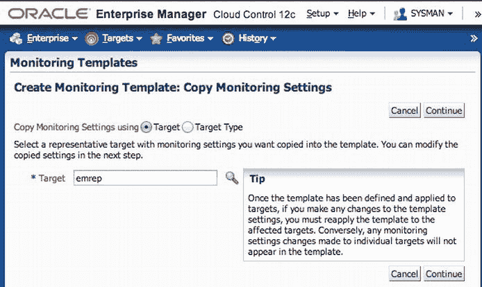
图 7-5. 创建监控模板

5.  为模板输入一个有意义的名称，并可以有选择地添加描述，如图 7-6 所示。（写一个简短的描述以备日后回忆是个好主意。）

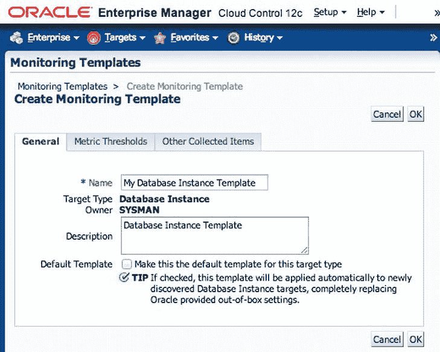
图 7-6. 为模板命名

6.  点击 `Metric Thresholds` 选项卡以打开如图 7-7 所示的数据输入区域。

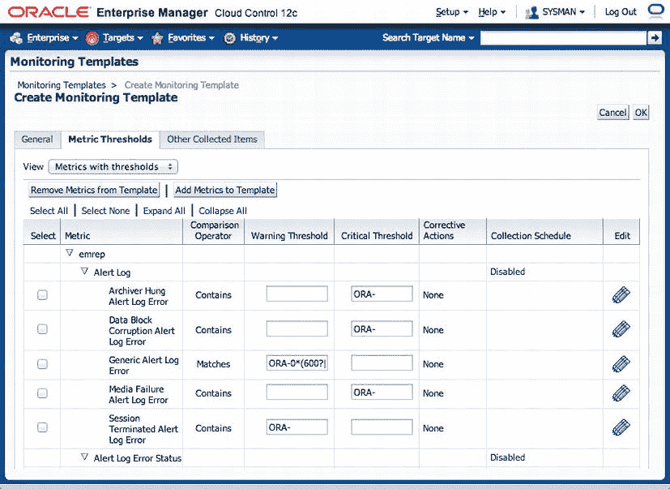
图 7-7. 指定阈值

7.  输入或修改您要设置的指标的数值。仅选择您关心的指标。请记住，指标的数值应根据您的运营目标来设置。如果您不想收集某些指标，也可以将它们完全移除。如果未为指标设置阈值，则不会针对该指标发送警报。

除了为指标指定阈值外，如果收集计划与您的运营目标不符，您还可以修改指标的收集计划。例如，`Archive Area Used (%)` 指标的收集计划默认设置为每 15 分钟收集一次。如果您的数据库实例事务率很高，生成大量归档重做日志，您可能希望将该指标的收集计划修改为每 10 分钟收集一次。点击 `Collection Schedule` 列中的链接以修改计划。图 7-8 显示了一个归档区域阈值的特写视图。您可以点击 `Every 15 Minutes` 链接来修改计划。


图 7-8. 点击 `Every 15 Minutes` 链接以修改检查归档区域阈值的计划

为您希望监控的每种目标类型创建额外的监控模板。在 RAC 环境中，您可以为监听器、集群数据库、ASM 实例和主机创建模板。

虽然监控模板是标准化阈值设置的首选方法，但您确实需要承担将模板应用于不同目标类型的额外开销。此外，如果您更改了监控模板中的指标，则必须将模板重新应用到其关联的目标。反之，如果针对特定目标更改了指标阈值，这些更改不会同步回监控模板。

EM12c 提供了模板集合来帮助减轻将监控模板应用于不同目标类型的手动工作量。您可以创建模板集合来对不同类型目标的阈值进行分组。

## 管理组

*管理组*允许您通过根据监控模板集合将指标、合规性标准和云策略应用于目标，从而轻松实现目标的自动化管理和监控。成员会根据一组定义的全局属性被自动动态添加到管理组中。任何符合标准的目标都会被添加到组中，并且可以将模板集合与这些目标相关联。作为最佳实践，应在 Enterprise Manager 中使用管理组来管理目标。


 **提示** 管理组是 EM12c 中一个出色的新功能。然而，每个目标只能分配一个通知组，因此该功能存在一些限制。在某些情况下，你可能希望一个目标有多个通知，为此你需要使用原始的 Enterprise Manager 组功能。例如，某个目标的监控要求可能是在工作时间将事件分配给生产 DBA 组，并在工作时间之外向值班 DBA 组生成电子邮件。这种复杂的场景只能通过原始的 Enterprise Manager 组功能来满足。

## 规划管理组层级

在创建管理组之前，你应该规划你的管理组层级结构。这个层级结构包含根据全局目标属性在一个或多个级别上逻辑划分的不同目标。你还可以指定定义管理组的多种目标类型。

规划层级结构时，确保其符合你组织的操作和监控标准非常重要。你应该了解目标的监控方式，以便将管理方式相似的目标分组在一起。例如，你可能希望根据 `LifeCycle Status` 属性为生产目标创建一个组，为非生产目标创建另一个组。此外，你可能还希望基于以下目标属性在层级结构中创建其他级别，作为生产组和非生产组的子组：

*   部门
*   业务线
*   位置
*   CSI 编号
*   成本中心
*   联系人

是否在层级结构中创建更多级别的决定，应取决于目标组的监控特征。例如，你是否需要为 HR 和销售组维护独立的指标，还是可以用相似的指标来监控它们？图 7-9 中所示的图是一个基于 `LifeCycle Status`、`Location` 和 `Line of Business` 目标属性的管理组层级结构示例。

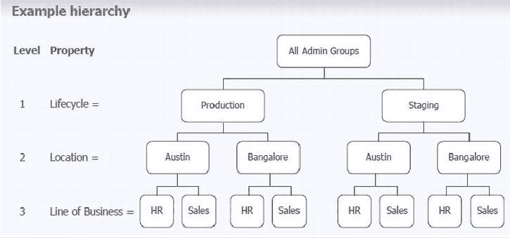

图 7-9 基于生命周期、位置和业务线属性的三层管理组层级结构

只能存在一个管理组层级结构。这一限制防止了因多个层级结构可能产生的冲突。此外，一个目标在层级结构中只能属于一个组。

目标不能直接添加到组中。相反，组成员资格由目标的属性（例如 `LifeCycle Status`）决定。这些属性可以在目标发现和提升时设置，也可以在目标已被发现后设置。可以使用 Enterprise Manager 控制台或带有 `set_target_property_value` 动词的 `emcli` 命令行界面来设置目标属性。有关 `emcli` 命令的更多信息，请参阅 *Oracle Enterprise Manager Command Line Interface* 文档的第 2 章。

 **提示** 可以将规划层级结构想象成两个步骤：1）定义你的层级结构。2）为你的目标分配属性。“魔法”随后发生，因为你的目标会自动被分配到层级结构中的适当级别。

目标加入管理组后，你可以关联模板集合，以便每个组的成员具有相似的指标、策略和标准。模板集合是由多种目标类型组成的模板指标集合。本章稍后将进行讨论。

应为每个管理组创建单独的模板集合。在创建管理组之前，你应首先创建监控模板。每个监控模板都针对单一目标类型。因此，你需要创建一个由多个监控模板组成的模板集合：每个目标类型一个。例如，一个包含主机、监听器、数据库和 ASM 实例的“生产目标”管理组将需要一个包含四个不同监控模板的模板集合。

如果管理组层级结构包含多于两个级别，则应用模板集合的顺序很重要。叶级别上的模板集合会覆盖来自父级别的指标。每个组将有自己的模板集合，而来自父级别的模板集合则会传播到各自的子组。

应用模板集合后，你应该将这些集合与组关联。这确保每个组包含一套标准的指标、策略和标准。完成此操作后，目标会被同步，以便将来对监控模板的任何更改都会自动应用到关联的目标。

## 实现管理组层级

一旦定义了管理组，就可以使用 Enterprise Manager 控制台来实现它们。选择 `Setup` > `Add Target` > `Administration Groups`，如图 7-10 所示。（注意“Administration Groups”显示在左侧。）

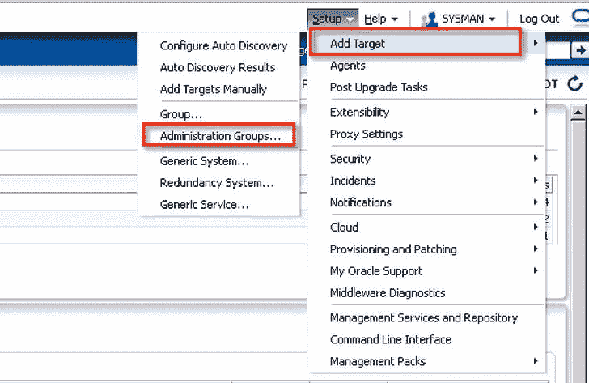

图 7-10 选择添加管理组

在管理组主页（如图 7-11 所示），你现在可以定义规划阶段确定的组层级结构。你还可以创建模板集合并将其与管理组关联。点击“Hierarchy”选项卡来定义层级结构。

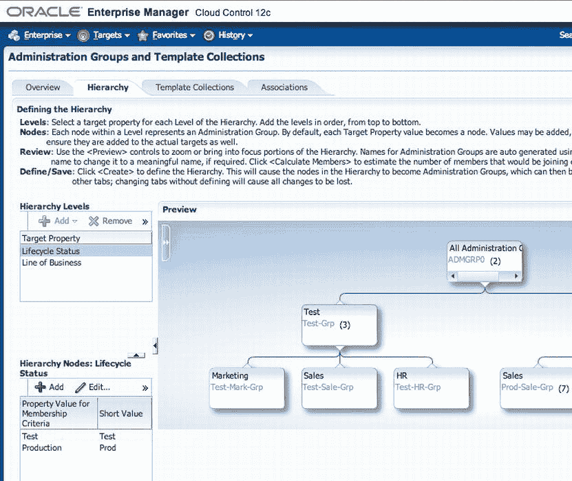

图 7-11 从 Enterprise Manager 控制台创建基于 `LifeCycle Status` 的管理组层级结构

级别是从上到下添加的。点击左侧“Hierarchy Levels”下的添加（+）并选择一个用于定义管理组的全局属性。在图 7-11 中，你可以看到 `LifeCycle Status` 属性表示管理组下的划分，而 `Line of Business` 属性表示下一级别的划分。默认情况下，这两个选择会根据 `LifeCycle Status` 的预定义值为每个组自动创建一个节点。

 **注意** 如果使用 `Target Type` 属性来创建管理组，请将数据库、监听器和 ASM 包含在同一组中，而不是分成三个独立的组。

如果目的是拥有一个单一的生产目标组和一个非生产组，则可以合并一些组。例如，将 Production 和 Mission Critical 合并为一个名为 Production 的组，然后将 Development、Test 和 Staging 合并到一个 Non-Production Targets 组中，将产生如图 7-12 所示的层级结构。

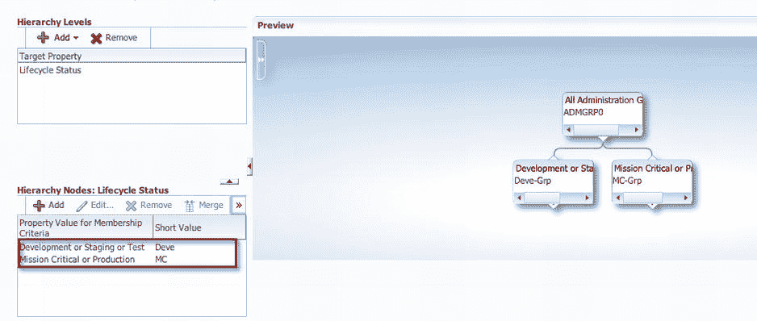

图 7-12 为非生产和生产组合并属性

点击节点中每个组的详细信息，将组的名称更改为比默认自动生成的名称更有意义的名称。如果目标处于多个时区，也为每个组设置时区。所有子组默认使用相同时区。该时区用于组图表和作业调度目的。


重复刚刚描述的过程来创建所需的任何其他级别。创建规划阶段确定的、为有效管理目标所需的那些级别。使用 `Preview` 面板进行缩放、平移并聚焦于层次结构的任何分支。点击双右箭头以展开 `Preview` 控件，如图 7-13 所示。

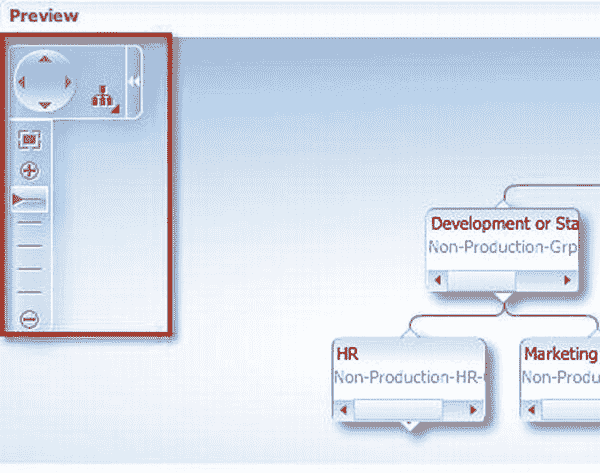

图 7-13. 用于平移、缩放和布局的预览控件

在定义管理组层次结构后，仔细检查它。一旦创建，你只能修改目标属性值，这会导致层次结构在同一级别内扩展或收缩。

考虑在测试的 Enterprise Manager 环境中尝试不同的层次结构组织方式。这让你有机会在将其投入生产环境之前，审视你的监控和管理策略。

如果在创建管理组层次结构之前已经设置了目标属性，你可以点击 `Calculate Members` 按钮，让组自动填充。一旦你对层次结构感到满意，点击 `Create` 按钮。

 **注意** 如果你想在层次结构创建后添加或删除目标属性，则必须删除并重新创建该管理组。

**加入管理组**

下一步是在目标上设置管理组层次结构中定义的那些目标属性。这可以通过使用 Enterprise Manager 控制台完成。或者，你也可以选择使用 `emcli` 和 `set_target_property_value` 命令的命令行方法。如果你要为少量目标设置属性，请使用控制台。否则，建议使用 `EMCLI` 为批量目标设置属性。

要确定哪些目标的属性已设置，请转到 `All Targets` 菜单。默认视图显示目标名称、目标类型、目标状态和待激活列。点击 `View` 下拉菜单（如图 7-14 所示）以添加对应于管理组目标属性的列。

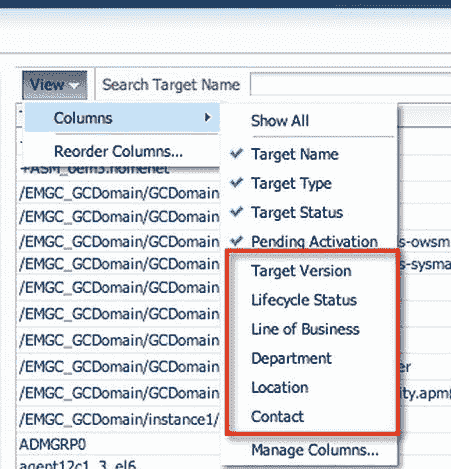

图 7-14. 自定义 All Targets 视图以显示额外的目标属性

要使用控制台为非数据库目标设置目标属性，右键单击目标名称并选择 `Target Setup`  `Properties`。对于数据库实例，右键单击目标名称并选择 `Oracle Database` 或 `Cluster Database`，然后选择 `Target Setup` 和 `Properties`。如图 7-15 所示，为层次结构选择的管理组属性和值显示在所有目标属性表的上方。点击 `Edit` 按钮可编辑属性。

 **注意** 在目标属性表上方显示所选值是从 12.1.0.2.0 版本开始提供的一项功能。

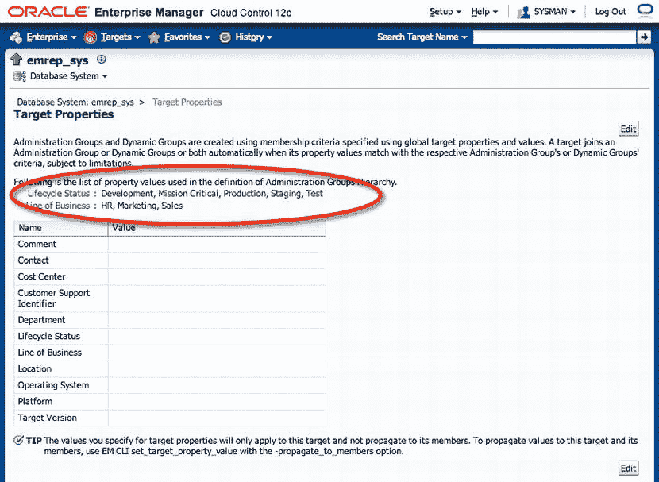

图 7-15. 在管理组层次结构中定义的目标属性

 **注意** 在添加或提升目标时设置目标属性。这样做可确保成员在创建后自动加入管理组。

在非集群聚合目标上设置的目标属性不会自动应用于成员目标。这样做是为了防止目标已属于另一个管理组时产生歧义。要为非集群聚合目标设置目标属性，请使用带有 `set_target_property_values` 和 `-propagate_to_members` 选项的 `emcli`。这样，聚合的成员也会加入同一个管理组。

 **注意** 非集群聚合目标包括数据库系统目标类型，它由数据库实例、侦听器、ASM 实例和高可用服务组成。诸如数据库集群、主机集群和冗余系统之类的集群目标将自动继承当前和新成员的目标属性。

任何聚合的新成员都需要手动设置其目标属性。以下示例展示了如何将 `LifeCycle Status` 和 `Line of Business` 目标属性传播到 `emrep_sys` 聚合：

```
$ emcli set_target_property_value -property_records
  ="emrep_sys:oracle_dbsys:LifeCycle Status:Production" -propagate_to_members
```

此命令将使 `emrep_sys` 聚合的成员（数据库实例、侦听器和 ASM）具有相同的 `LifeCycle Status` 和 `Line of Business` 属性。

使用 `emcli` 时，目标属性区分大小写。例如，使用 `Lifecycle Status` 而不是 `LifeCycle Status`（注意大写的 *C*）设置属性将生成错误。要查看可为特定目标设置的有效目标属性列表，请使用带有 `-target_type` 选项的 `emcli get_target_properties` 命令。以下示例显示了 `oracle_dbsys` 聚合目标的所有有效属性：

```
$ emcli get_target_properties -target_type="oracle_dbsys"
CommentContact
Cost Center
Customer Service Identifier
Department
LifeCycle Status
Line of Business
Location
Operating System
Platform
Target Version
Target properties fetched successfully
```

请务必访问你计划监控的每个目标，并确保为该目标设置用于构建管理组层次结构的每个属性。任何未设置属性的目标将不属于管理组，因此也不会使用定义的监控标准进行监控。

**多个目标**

为多个相关目标设置目标属性时，你可以使用 `emcli` 配合聚合/集群目标名称来简化此过程。例如，要为 `orcl_sys` 数据库系统的数据库实例、侦听器、ASM 主目录和 Oracle 主目录一次性设置相同的 `Line of Business` 属性，你可以执行以下操作：

```
emcli set_target_property_value -property_records
```

```
="orcl_sys:oracle_dbsys:Line of Business:Marketing" –propagate_to_members
```

**模板集合**

如前所述，*模板集合* 用于向一组相似的目标提供一致的指标集。监控模板按目标类型创建，并捆绑在一起形成模板集合。应为层次结构中的每个节点创建一个单独的集合。例如，一个“生产目标”组将与一个“生产目标”模板集合相关联，该集合包含不同目标类型的监控指标。一旦这些模板被关联，使用模板集合有助于你自动部署监控标准，这些标准使用监控模板中定义的指标阈值和策略。

要创建模板集合，选择 `Setup`  `Add Targets`  `Administration Group`。点击 `Template Collections` 选项卡以创建集合，如图 7-16 所示。这假设你已经为你的目标创建了监控模板。有关设置监控模板的详细信息，请参阅《*Oracle Enterprise Manager Cloud Control 12c Administrator’s Guide*》。

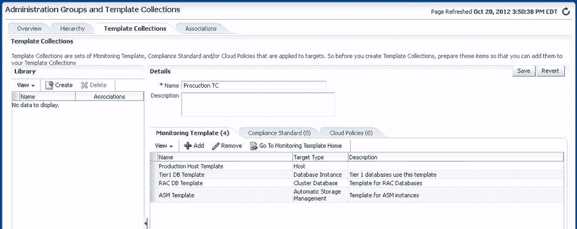

图 7-16. 添加模板集合


