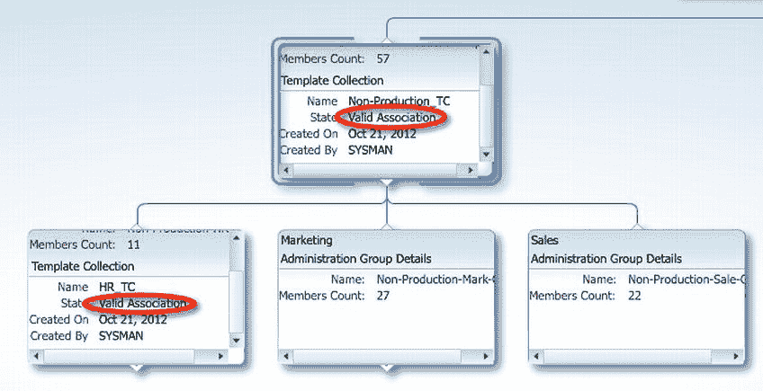
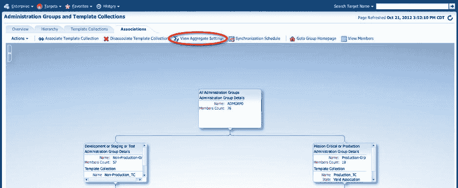
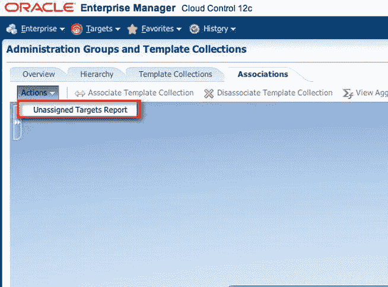
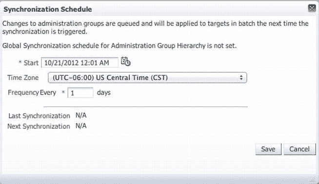
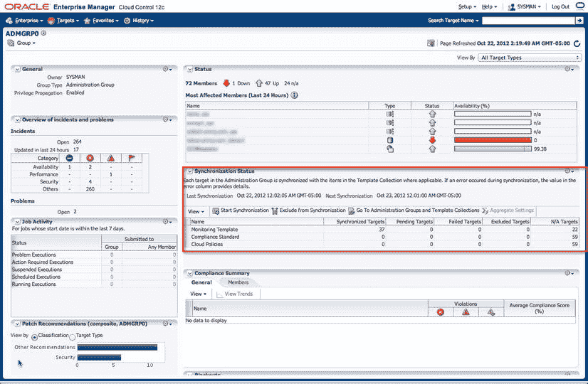

# 监控模板与管理组

在管理组节点中，应为目标类型准备一个监控模板。监控模板的设计应谨慎，以在提供有效监控的同时减少无用告警。创建模板后，需对其进行审查，以确保关键组件得到监控。

创建所有必需的模板集合后，点击“关联”选项卡，将层次结构中每个节点（从第二级，即“所有管理组”之后的一级）与一个模板集合关联。作为该节点成员的所有目标以及子组中的目标都将继承模板的指标。可以看到，节点与模板集合的这种关联极大地增强了在 IT 基础设施中自动执行标准的能力。审查层次结构中的每个节点，以验证其状态是否有关联有效。查找文字`Valid Association`，如图 7-17 所示。

**图 7-17.** 应用于 Non-Production_TC 和 HR_TC 组的模板集合关联

图 7-17 层次结构中的 `Non-Production_TC` 和 `HR_TC` 节点具有有效关联，而 `Marketing` 和 `Sales` 组没有有效关联。这是因为 `Sales` 和 `Marketing` 组继承了已直接关联到 `Non-Production` 组的 `Non-Production_TC` 模板集合。没有模板集合直接关联到 `Marketing` 或 `Sales`。而 `HR_TC` 组则已关联到其自己的模板集合。因此，它显示为“有效关联”状态。

重要的是要理解，聚合指标是基于监控模板的组合来应用的。如果 `HR_TC` 与顶级 `Non-Production` 组有共同的指标，则较低级别的指标具有优先权。使用图 7-18 所示的`View Aggregate Settings`选项，可以查看将应用于目标的所有指标。

**图 7-18.** 从“管理组和模板集合”页面访问“查看聚合设置”选项

要检查是否有目标未通过管理组和模板集合定义的监控标准进行监控，请点击“关联”选项卡左上角的“操作”下拉菜单，然后选择`Unassigned Targets Report`，如图 7-19 所示。随后将显示缺少一个或多个根据管理组层次结构定义的属性的目标。请记住，所有目标必须符合为管理组层次结构定义的所有成员标准。这意味着，如果您选择`LifeCycle Status`和`Line of Business`作为管理层次结构的目标属性，那么目标需要设置这两个属性才能加入管理组。

**图 7-19.** 如何从管理组访问“未分配目标报告”选项

### 同步计划

模板集合成功关联到管理组后，监控模板会立即应用于管理组中的目标。如果存在待处理的同步操作，则同步计划会生效。待处理的操作通常源于对属于与管理组关联的模板集合一部分的监控模板的更改。此外，如果对与管理组关联的模板集合进行了修改，则将在基于全局同步计划的下一个日期发生同步。

通过指定开始日期、时区和频率（以天为单位）来创建全局同步计划。选择 `Setup -> Add Targets -> Administration Groups`。选择“关联”选项卡，然后点击`Synchronization Schedule`。建议将计划设置在非高峰时段，以最小化对系统的影响。计划间隔以天为单位指定，因此任何待处理的操作将在下一个指定的日期和时间发生。图 7-20 是一个每天凌晨 12:01 执行的同步计划示例。

 **注意** 即使设置了同步计划，同步也并非总是发生。它仅在有待处理的操作时发生。

**图 7-20.** Enterprise Manager Cloud Control 12c 中的全局同步计划设置页面

一旦同步计划创建并成功完成至少一次，您可以定期检查顶级管理组的“同步状态”区域（参见图 7-21）。该区域显示层次结构中所有目标的同步状态。

**图 7-21.** 管理组页面中的同步状态

在图 7-21 中，页面中间的“同步状态”框中，您可以看到针对监控模板、合规标准和云策略，处于“已同步”、“待处理”、“失败”、“已排除”和“不适用”状态的目标数量。对于处于“待处理”、“失败”或“不适用”状态的目标，请遵循表 7-1 中的建议。

**表 7-1.** 基于同步状态的建议操作

| 同步状态 | 应采取的措施 |
| :--- | :--- |
| 待处理目标 | 确保已定义全局同步计划。“下次同步”日期的存在表明已定义计划。如果看到“不适用”，请定义一个计划。 |
| 失败目标 | 深入分析以获取特定故障的详细信息。尽可能修复它们。然后手动重新同步，或允许下一次计划同步进行。 |
| 不适用目标 | 目标没有关联的监控模板。深入分析以获取目标类型，并向模板集合添加监控模板。 |

## 事件管理建议

监控数据库环境还意味着，如果您的任何目标遇到任何问题，您能快速被告知——理想情况下是在任何客户察觉之前。这也意味着，如果发生任何值得关注的操作（正常或异常），它们将根据需要得到处理。

那么即将发生的问题呢？我们也需要被告知这些问题，并在它们演变成灾难之前解决它们。EM12c 以事件、 incidents（事件）、规则和规则集的形式提供了解决方案的工具。在本节中，您将看到如何有效地运用这些特性来简化和自动化监控需求。

### 事件、Incidents（事件）和问题

