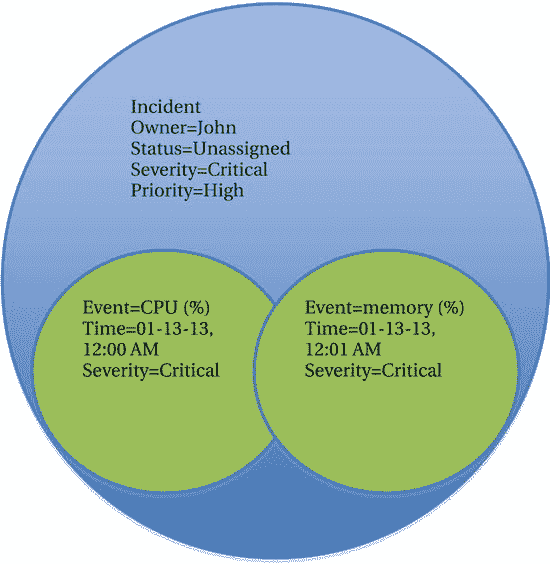
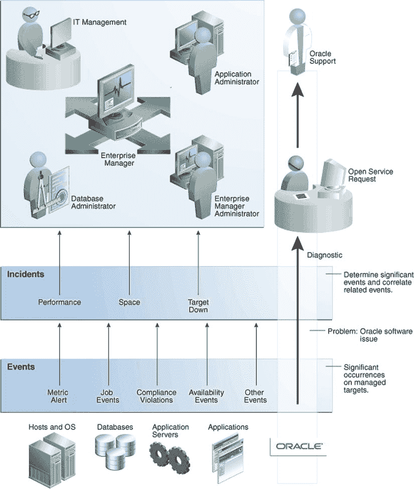
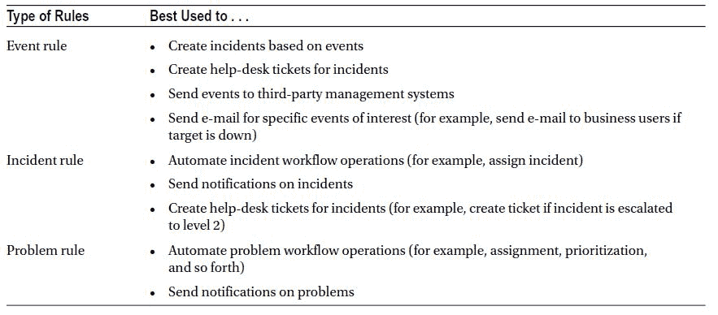
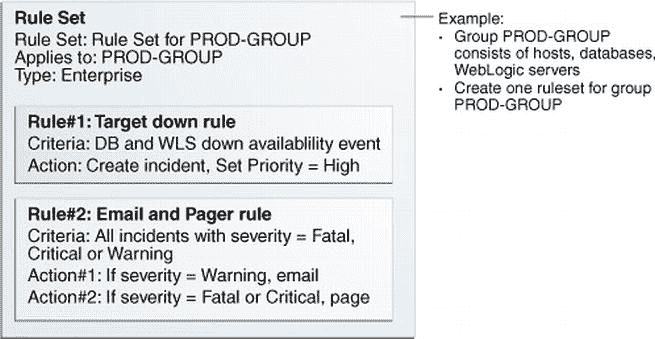
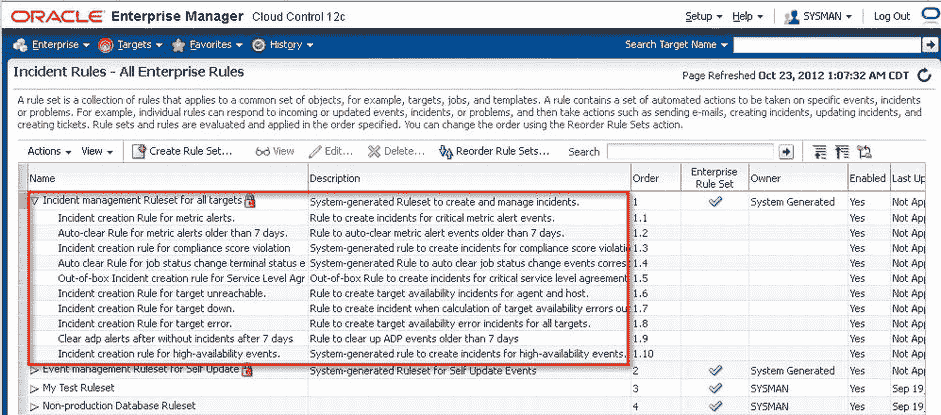

# 事件、问题与规则

## 事件与问题

一个**事件** 是 Enterprise Manager 中影响单个受监控目标的离散发生——例如，监听器宕机、文件系统已满或归档程序挂起。其他发生，如作业操作状态更改（完成、失败、停止、暂停）也属于事件的范畴。

一个**问题** 可以被看作是一组一个或多个相关的事件。问题通常代表一次需要特定操作（包括跟踪、分配、升级和解决）的显著服务中断。将重要的发生作为单个单元进行管理是通过问题而非事件来完成的。一个主机目标可能会生成高 CPU (%) 和内存使用率事件（参见 图 7-22）。单个事件本身可能并不表明一个问题，但一组相关的事件可能指向一个描述资源问题的问题。

图 7-22. 多个事件的问题/事件关系

除了事件和问题，还有**问题**的概念。问题可以被视为问题的根源或起因。它们目前表现为 Oracle 软件中的错误。问题超出了本次讨论的范围，因为它们实际上可能是任何导致服务中断或性能下降的原因。例如，如果在服务器机房地板下乱跑的啮齿动物咬断电线并导致停机，那可能就是一个问题。

 **注意** DBA 工作的挑战之一是必须不断处理无法全部预见的问题。事实上，迄今为止新问题的出现是让 DBA 工作充满乐趣和回报的“调味剂”之一。然而与此同时，我们又追求常规。这正是我们这一行固有的张力。

## 事件与问题的工作流

有效地管理问题有助于我们实现更好的运营效率，帮助我们掌控系统的整体健康状况。使用集中式问题管理控制台使我们能够从一个位置查看、管理、诊断和解决问题。关于问题管理的完整讨论请参见 第 12 章。图 7-23 中的图表展示了使用 EM12c 的事件和问题工作流程。

图 7-23. 事件、问题、问题工作流

## 规则与规则集

现在您已经了解了事件和问题，可以开始学习如何使用它们。**规则** 告诉我们在事件或问题满足特定条件时应执行的操作。这些操作包括发送电子邮件或寻呼、创建服务台工单、升级问题，甚至生成另一个问题。

您还可以根据事件的严重程度指定不同的操作。例如，如果“文件系统空间使用率 (%)”规则生成一个**警告**事件，您可能希望发送电子邮件通知。然后，如果同一规则生成一个**严重**事件，您可能会发送寻呼通知，以唤醒值班的 DBA。

对于每种规则类型，可以执行许多其他操作。表 7-2 总结了每种规则类型及其在不同场景下的用途。

表 7-2. 规则类型及其最佳用途

## 规则集管理

单个规则可以组合成集以便于管理。规则集具有以下属性：
*   **名称**：规则集的标识符。
*   **描述**：规则集用途的简要说明。
*   **应用于**：规则集中规则适用的对象列表。
*   **所有者**：在 Enterprise Manager 中创建规则集的管理员。
*   **已启用**：指示规则集是否已应用。
*   **类型**：表示是企业规则集还是私有规则集。

考虑规则集中规则的顺序，并将类似的规则分组在一起。考虑创建问题的规则，例如通过发送电子邮件或创建问题工单。也考虑管理问题的规则，例如升级它们。基于持续时间的规则应放在最后。

组和系统应用作规则集的目标。如果已定义，建议使用管理组。您定义管理组层次结构将通过指定其目标属性，使规则能够自动应用于添加到管理组的新目标。

同一组的规则应合并到一个规则集中。例如，在 图 7-24 中，PROD-GROUP 规则集应用于所有生命周期状态 = '生产' 的目标。

图 7-24. 规则集应用

您应该，也能够，通过使用规则自动创建问题。您需要在规则集中设置基于事件创建问题的规则。这些规则应首先在规则集中定义。

Enterprise Manager 附带了开箱即用的规则集，用于为某些重要事件（例如目标宕机或目标无法访问）创建问题。其中一个规则集名为 **Incident Management Ruleset for All Targets**，如 图 7-25 所示。

避免使用开箱即用的规则集。相反，通过在 Enterprise Manager 控制台中使用“类似创建”选项，基于这些标准规则集创建您自己的规则集。创建规则集后，您可以禁用开箱即用的规则集。

图 7-25. 在 Enterprise Manager 控制台中看到的、名为 Incident Management Ruleset for All Targets 的开箱即用规则集

### 指标收集错误

监控目标的用户应配置为密码不过期或不被锁定。这是因为过期或锁定的密码会导致指标收集错误。例如，默认监控数据库实例和集群数据库目标的数据库用户是 `DBSNMP` 用户。从 Oracle Database 11g 开始，`DBSNMP` 配置文件设置为 180 天后使密码过期。因此，六个月后，您的监控能力就消失了。不要让这种情况发生。

创建一个禁用密码过期的独立配置文件，并将该配置文件分配给监控用户。例如，您可以创建一个名为 `DBSNMP_MONITOR` 的配置文件，并将该配置文件分配给用户 `DBSNMP`。然后确保该配置文件允许密码终身有效。

企业安全策略有时要求更改此类帐户的密码。这样的策略可能带来不便，但这是生活中的事实。您需要按要求的时间表更改密码。然后确保更新目标监控属性，以便持续进行监控。理想情况是，您可以通过脚本或其他方式自动化密码重置，以及随之所需的监控属性更新。

## 总结

