# 管理工程化系统

作者：Bobby Curtis 和 Anand Akela

您已经了解到，`企业管理器云控制 12c` 为 IT 基础设施和应用程序提供了一个标准化的监控解决方案。它通过自动化将目标分配到组、应用模板以及管理目标成员资格的工作流程，提高了运营效率。通过合理规划标准和操作流程，`企业管理器` 还通过规则集实现一致的事件、 incident 和问题管理，为管理员带来显著效益。最后，您已经学习了上述功能的最佳实践，这些实践将使您在使用 `EM12c` 时，对环境的管理和监控变得更加无缝。


Oracle 工程化系统是预先集成的硬件和软件集合，旨在降低企业基础设施的复杂性和成本，同时提高关键业务系统的生产力和性能。部分工程化系统是为企业内的特定功能设计的。例如，`Oracle Exadata 数据库一体机` 最初是为数据仓库设计的，但其当前版本已扩展为同时支持数据仓库和联机事务处理（`OLTP`）。其他工程化系统则服务于更通用的目的。例如，`Oracle 数据库一体机` 为中小企业提供了一个支持双节点 `真正应用集群 (RAC)` 的解决方案。

工程化系统包含完整的硬件基础设施（例如服务器、存储和网络），这些在传统配置中通常是分开的实体。这些工程化系统还附带一个完整的软件栈，可开箱即用运行系统。在这个层面上硬件和软件的统一，允许快速的实施周期。

在本章中，您将了解工程化系统以及如何使用 `Oracle 企业管理器 12c` 来管理它们，同时还将了解如何查看和监控这些系统。

## 工程化系统类型

在深入了解如何管理工程化系统之前，让我们先概览一下 Oracle 提供的工程化系统：

*   `Oracle Exadata 数据库一体机`：通过将查询下推到存储单元层，为所有数据库应用程序（包括 `OLTP` 和数据仓库）提供极致性能。是整合数据库工作负载到私有云或数据中心的理想平台。
*   `Oracle Exalogic 弹性云`：为企业应用程序（Java、Oracle 应用程序或第三方应用程序）和中间件提供极速性能，帮助企业无论在数据中心还是在云端都能运行得更快。
*   `Oracle SPARC SuperCluster T4-4`：提供高性能、高可用性、可扩展性和安全性的通用解决方案，适用于 Oracle 和第三方应用程序。作为整合多样化环境的理想选择，该工程化系统由新型 `SPARC T4` 处理器和 `Oracle Solaris 11` 提供支持。在单个工程化系统中结合了 `Oracle Exadata 数据库一体机` 和 `Oracle Exalogic 弹性云` 的优势。
*   `Oracle 数据库一体机`：为中端数据库工作负载提供了出色的开箱即用解决方案。旨在帮助中小企业或独立业务部门以创纪录的时间部署企业级解决方案。
*   `Oracle Exalytics 内存分析一体机`：提供首个用于商业智能（`BI`）建模、预测和规划应用程序的内存分析工程化系统，同时具备高级数据可视化功能，可从大型数据集中获得可操作的洞察。
*   `Oracle 大数据一体机`：提供优化的硬件和软件，为获取、组织和加载非结构化数据到 `Oracle 数据库` 提供了一个完整、易于部署的解决方案。
*   `Sun ZFS 存储一体机`：为使用网络附加存储（`NAS`）的企业应用程序、虚拟化、私有/云部署、存储整合和数据保护的客户提供强大、高效、快速的数据存储。

## 工程化系统生命周期

`Oracle 企业管理器` 提供了对 `Oracle 工程化系统` 的全面管理，贯穿其上部署的应用程序或数据库的整个生命周期。工程化系统生命周期包含四个阶段，如 图 8-1 所示：

*   工程化系统的规划与设置
*   用于部署的工程化系统测试
*   为实现最佳性能和效率的管理
*   为合规性和功能改进而进行的维护

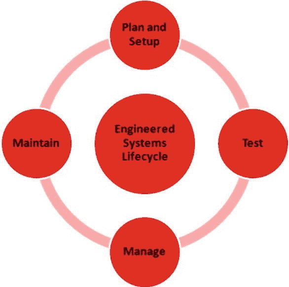

图 8-1. 工程化系统生命周期

尽管所有 `Oracle 工程化系统` 都共享此生命周期并可从 `Oracle 企业管理器 12c` 进行管理，但本章中的示例均针对 `Oracle Exadata 数据库一体机`。

## 支持的硬件和软件

在深入探讨工程化系统生命周期的各个阶段之前，最好先了解 `EM12c` 支持哪些硬件和软件。以下 `Exadata 数据库一体机` 配置通过 `12.1.0.1`、`12.1.0.2` 和 `12.1.0.3` 的插件得到支持：

*   `V2`
*   `X2-2`
*   `X2-8`
*   `X3-2`
*   `X3-8`
*   `Partitioned`

受支持配置的部分是随 `Exadata 数据库一体机` 提供的组件。这些组件在 `EM12c` 中受支持：

```
Exadata Storage Server Software 11g Release 2 (11.2.2.3.0 through 11.2.3.2)
InfiniBand Switch Release 1.1.3.0.0 to 1.3.3.2.0
Integrated Lights Out Manager (ILOM), 3.0.9.27.a r58740
ILOM IPMItool Release 1.8.10.3 (for Oracle Linux)
ILOM IPMItool Release 1.8.10.4 (for Oracle Solaris)
Avocent MergePoint Unity KVM Switch Release 1.2.8
Power Distribution Unit Release 1.04
Cisco—Cisco IOS Software, Catalyst 4500 L3 Switch Software (cat4500-IPBASE-M), Version 12.2(46)SG, RELEASE SOFTWARE (fc1)
```


每当 Oracle 产品发布新版本时，某些项目就会停止支持。Exadata 数据库机器有一些已停止支持的硬件组件。以下硬件配置已随 `Oracle Enterprise Manager 12c` 或 `12c Bundle Pack 1 (BP1)` 停止支持：

*   `V1` 硬件
*   `超级集群`
*   `扩展机架`
*   `多机架 Exadata 数据库机器`

 **注意** 在 `Exadata 插件` 的 `12.1.0.1` 和 `12.1.0.2` 版本中，不支持将计算节点的客户端网络主机名用作 `Oracle Enterprise Manager` 目标名称。此功能在 `12.1.0.3` 插件中得到支持。

随着技术的发展，硬件标准会发生变化，并提供执行任务的新方法。专用系统，特别是 `Oracle Exadata 数据库机器`，很容易受到这些变化的影响。`EM12c` 的插件架构设计为不仅适用于软件堆栈，也适用于硬件堆栈。展望未来，此插件架构将允许对现有的专用系统和未来发布的硬件进行变更。

## 规划与设置阶段

当 `Oracle Exadata 数据库机器` 抵达现场并适应周围环境后，就可以对其进行网络配置。接下来的任务是使用 `EM12c` 为该机器设置监控。

 **注意** `Oracle Exadata 数据库机器` 是一件复杂的企业级基础设施。其紧凑的设计使其如果未适应环境，则容易产生冷凝水。我们建议在通电配置前，让其在现场放置 48 至 72 小时。

尽管 `EM12c` 可以开箱即用地监控 `Exadata`，但在将应用程序部署到 `Exadata` 并使用其功能之前，您仍然需要规划和配置监控。通常，为配置 `Exadata` 以进行主动监控，需执行以下步骤：

1.  将管理代理安装到计算节点。
2.  启动 `自动发现`。
3.  指定组件凭证。
4.  审查配置并完成设置。

按照这些简单的步骤发现 `Oracle Exadata 数据库机器` 组件后，配置可在几分钟内完成。

### 安装管理代理

与 `Oracle Enterprise Manager` 中的任何操作一样，第一步是将管理代理部署到 `Oracle Exadata` 计算节点，然后将 `Oracle Exadata 插件` 推送到这些代理。

 **注意** `Oracle Exadata` 监控，就像监控 `EM12c` 中的任何其他目标一样，是通过部署在管理服务器和代理上的一组插件完成的。

图 8-2 展示了 `EM12c` 代理如何与 `Exadata 插件` 以及 `Exadata 数据库机器` 的其他组件进行交互。

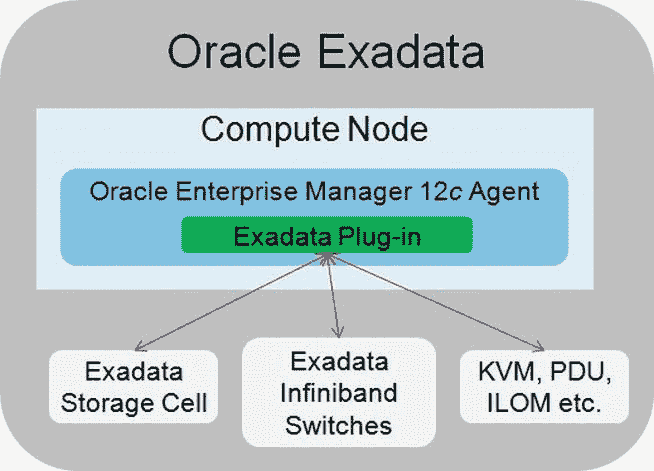

图 8-2. `Oracle Enterprise Manager 12c` 代理与 `Exadata 插件`

将管理代理部署到计算节点的方式，与通过 `Oracle Enterprise Manager` 为任何其他主机目标部署代理的方式相同。首选方法是从 `Enterprise Manager` 推送代理。此过程在 第 2 章 中有更详细的讨论。

### 启动自动发现

一旦管理代理和 `Exadata 插件` 部署完毕，您就可以执行目标的自动发现，以将 `Exadata` 组件纳入 `EM12c`。

与 `EM12c` 中的许多目标类型一样，`Exadata` 有一个向导驱动的发现过程。可以通过此向导自动添加 `Exadata` 硬件。要从 `Enterprise Manager` 主页访问此向导，请选择 `设置`  `添加目标`  `手动添加目标`。您将进入的页面应如 图 8-3 所示。

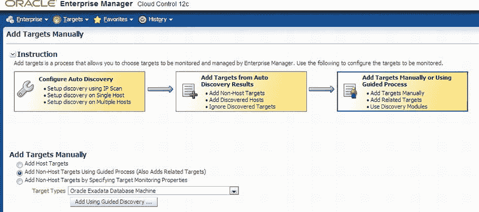

图 8-3. `手动添加目标` 页面

进入 `手动添加目标` 页面后，选择添加 `非主机` 目标的单选按钮。这使您能够从下拉菜单中选择 `Oracle Exadata 数据库机器` 选项。最后，单击按钮以使用引导式发现过程。

这将带您进入 `Oracle Exadata 数据库机器发现` 页面，如 图 8-4 所示。在这里，您可以选择添加带有相关硬件的新数据库机器，或发现新添加的硬件。选择选项后，单击 `发现目标` 按钮。

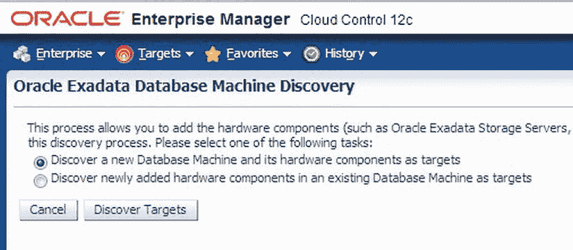

图 8-4. `Oracle Exadata 数据库机器发现` 页面

## 指定组件凭证

单击 `发现目标` 按钮后，`EM12c` 将启动 `数据库机器发现向导`，如 图 8-5 所示。该向导将引导您完成将 `Exadata 数据库机器` 添加到 `EM12c` 所需的十个步骤。在每个发现步骤中，系统会要求用户提供各种 `Oracle Exadata` 组件的登录凭证，例如 `Exadata 单元格` 和 `InfiniBand 交换机`。

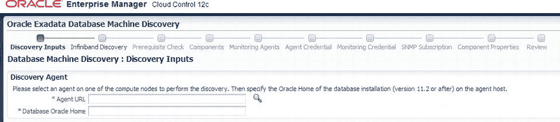

图 8-5. `数据库机器发现向导`

在您使用发现向导的过程中，在 `SNMP 订阅` 步骤（图 8-6），最好在单元格和 `InfiniBand 交换机` 目标上启用 `SNMP` 订阅。这允许管理代理自动接收来自受监控组件的 `SNMP 陷阱`。

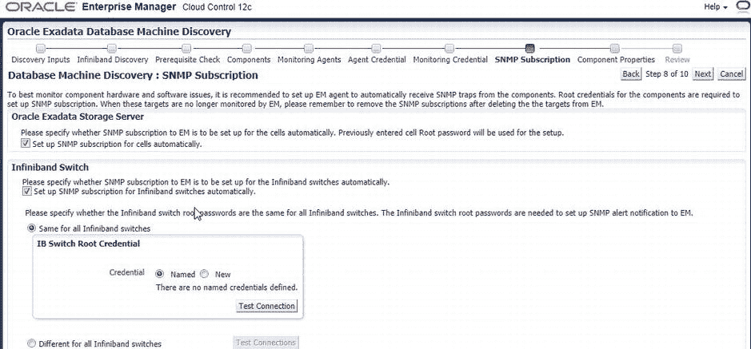

图 8-6. `SNMP 订阅` 步骤

### 审查配置并完成设置

最后，当向导完成时，您将进入 `审查` 屏幕，如 图 8-7 所示。在点击 `提交` 并完成发现向导之前，请核实所有信息。然后您将进入 `目标创建摘要` 页面；点击 `确定`。这将带您进入 `目标提升` 页面，此时目标将显示为受管目标。

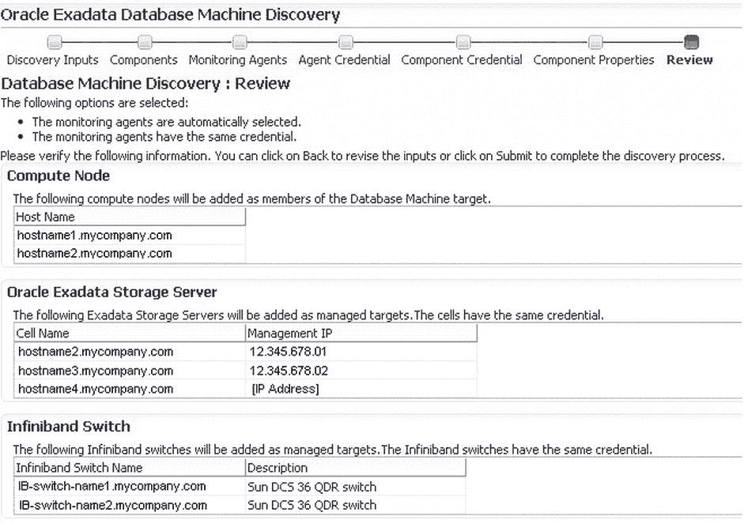

图 8-7. `Exadata 数据库机器发现审查` 页面

在 `Exadata` 监控设置完成后，`EM12c` 可以提供 `Oracle Exadata` 硬件和软件的统一视图，如 图 8-8 所示。您还可以查看其所有组件的详细视图，例如 `InfiniBand 交换机`、`存储单元` 等。

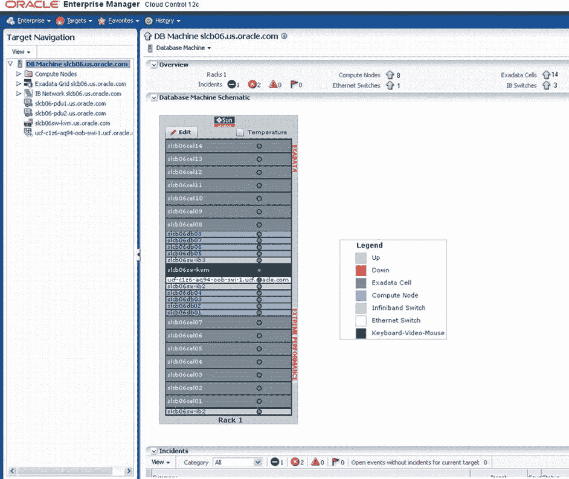

图 8-8. `Oracle Exadata 示意图视图`

 **注意** 除了自动发现过程外，还有一个自动化工具包可用于帮助加速发现。该工具包通过允许一次性将代理推送到所有计算节点，简化了在每个计算节点上部署代理的过程。

有关下载和配置自动化工具包的更多信息，可在 `My Oracle Support` 的 `文档 ID: 1440951.1` 中找到。

您可以在 `示意图视图` 中查看每个组件的可用性信息。顶部的 `概览` 部分显示了数据库机器内所有目标的事件和可用性信息摘要。它还有显示每个组件温度的选项。`示意图视图` 左侧的目标导航栏允许下钻到您选择的任何特定组件。示意图显示还支持查看多个使用相同 `InfiniBand 网络` 互连的 `Exadata 节点`。


如果您在 `Oracle Enterprise Manager` 中拥有多个 `Exadata Database Machine`，可以通过 `Groups` 框架从高级视图进行监控。利用此框架，您可以创建一个管理仪表板，跨多个 `Oracle` 工程系统及其组件，提供性能和用量指标的统一整合视图。

## 测试阶段

当您将应用程序迁移或升级到 `Oracle` 工程系统时，需要考虑其对应用程序响应时间和吞吐量的任何潜在影响。此外，您需要理解所有依赖关系和可能影响应用程序的潜在风险，并计划在环境中进行全面测试，以缓解与迁移相关的这些风险。

对于迁移到工程系统（如 `Oracle Exadata Database Machine`）的典型迁移和部署，您可以考虑以下三个步骤：

1.  识别要迁移的应用程序。
2.  创建测试环境。
3.  验证应用程序性能。

以下各节将介绍这些步骤。

## 识别要迁移的应用程序

如第 5 章所述，`Oracle Enterprise Manager 整合规划器` 可用于帮助识别可能从整合中受益的资源。在考虑迁移到工程系统时，`整合规划器` 也是一个有价值的工具。`EM12c` 收集的数据可用于帮助推导业务和技术需求，以验证向工程系统整合的计划。此外，`整合规划器` 可用于分析各种迁移或升级场景，并识别迁移前需要解决的应用程序问题。

每个整合场景需要三个输入：

*   整合前环境的详细信息
*   技术、业务或合规性约束
*   目标环境的详细信息

 **注意** 如第 5 章所述，在创建整合项目时，您可以选择生成三个预配置的整合场景添加到项目中。这些开箱即用的场景代表了保守、激进和中等的整合方案。

一旦您创建了一个用于将物理机移动到 `Exadata Database Machine` 的整合项目 (`P2P`)，就可以创建一个自定义场景来识别可能受整合影响的任何应用程序。为了创建场景，您必须使用 `整合规划器`，它可从 `Enterprise` 菜单访问。打开 `整合规划器` 后，突出显示所需的 `P2P` 项目，然后单击 `创建场景` 菜单项，如图 8-9 所示。这将打开 `创建场景向导` 以定义客户场景。

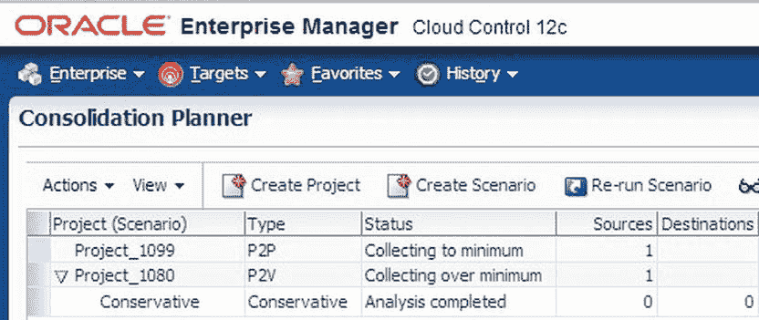
图 8-9. 在 `Oracle 整合规划器` 中创建场景

当 `创建场景向导` 启动时，场景的默认名称将类似于其关联项目的名称。

`创建场景向导` 的第一步是 `资源`，如图 8-10 所示。在这里，您可以指定场景详细信息，例如名称和描述。您还可以指定资源需求。可以定义资源类型、适用日期、时间间隔以及用于估算资源需求的整合算法。提供所有资源需求后，单击 `估算需求` 按钮以显示源服务器的需求。

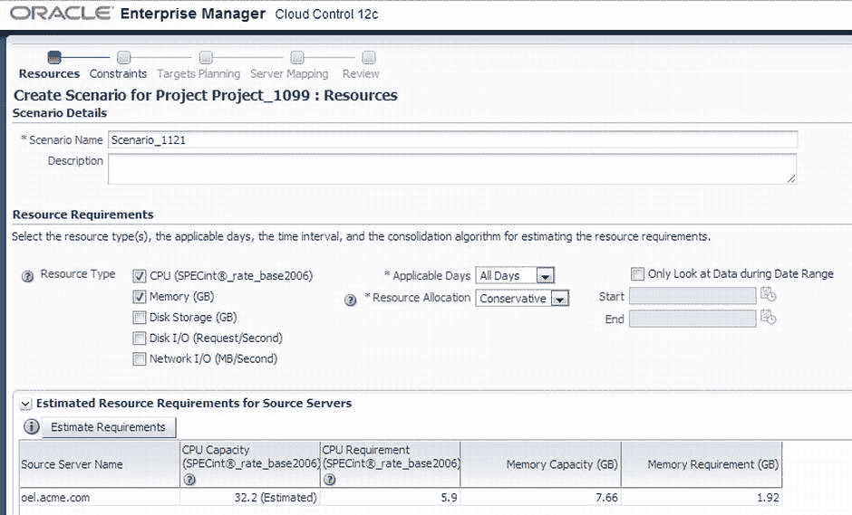
图 8-10. 在 `创建场景向导` 中定义资源

在向导中进行时，您需要仅选择彼此兼容的服务器。兼容的服务器应整合在一起。在 `约束` 页面上，您可以选择指定服务器属性、服务器配置以及作为您整合计划中必需条件的条件。一旦指定了所有约束，`预览约束效果` 选项将启用，您将能够看到任何不兼容的服务器。图 8-11 显示了已定义约束的 `约束` 页面。

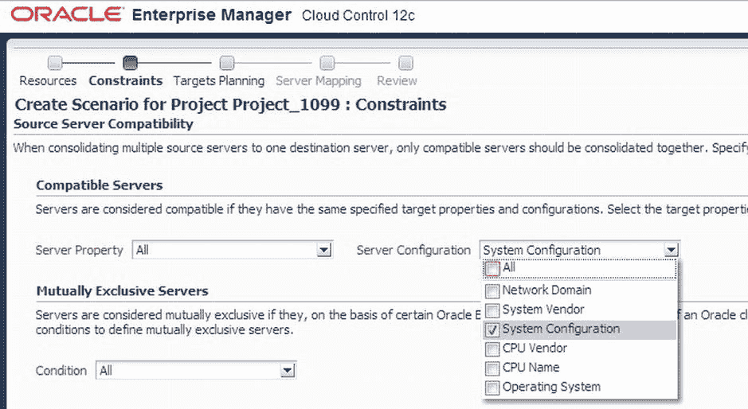
图 8-11. 在 `创建场景向导` 中指定约束

单击 `预览约束效果` 按钮将打开一个对话框，显示与目标服务器不兼容的服务器，如图 8-12 所示。如果有任何不兼容的服务器，请调整约束直到没有不兼容项。

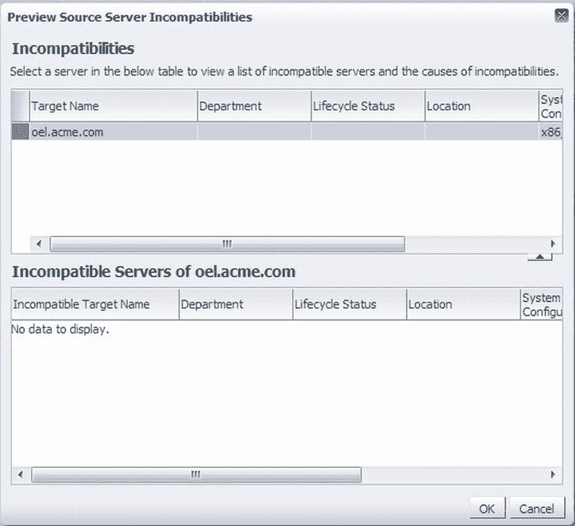
图 8-12. 服务器的不兼容性

解决任何不兼容性问题后，向导将带您进入 `目标规划` 页面。在这里，您可以识别整合的目标候选者。默认情况下，`Oracle Enterprise Manager` 假设您希望整合到半机架的 `Exadata Database Machine`。`Exadata Database Machine` 还有其他选项，以及通用服务器，甚至使用现有服务器。坚持使用您的 `Exadata Database Machine` 示例，我们选择一个全机架，如图 8-13 所示。在此页面上，您可以分配目标服务器的最大资源利用率。

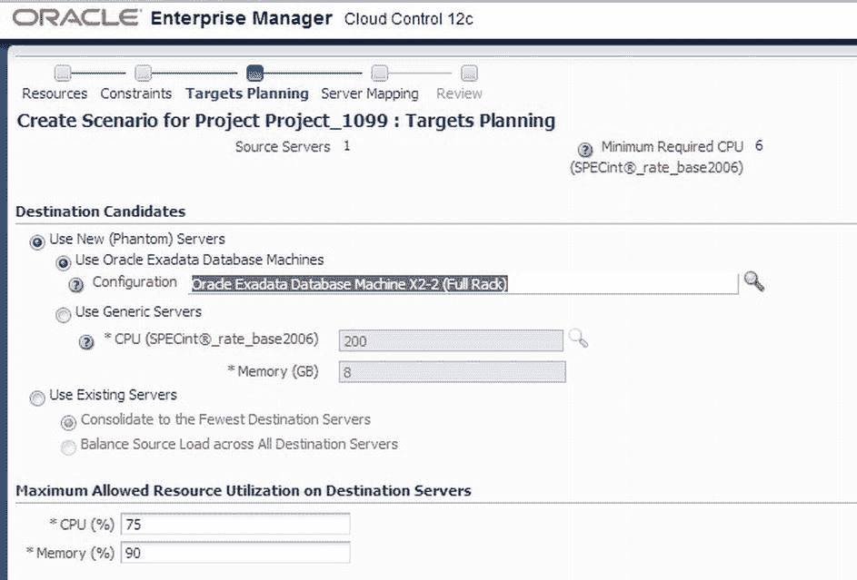
图 8-13. 在 `创建场景向导` 中为目标服务器设置选项

选择计划的目标后，就可以将源服务器映射到目标服务器了。由于我们坚持使用 `Exadata Database Machine` 示例，`创建场景向导` 正在为我们使用自动映射（参见图 8-14）。

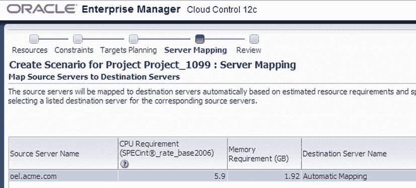
图 8-14. 在 `创建场景向导` 中映射服务器

 **注意** 在 `目标规划` 页面上，如果您选择了 `使用现有服务器`，可以通过选择与源服务器对应的目标服务器列表来手动覆盖自动映射。

在 `复查` 页面上，向导列出了在整个向导中选择的所有项目。此时，您有两个选项：可以将场景另存为模板，也可以提交它开始收集所需信息。场景提交后，`Oracle Enterprise Manager` 将给您确认消息，如图 8-15 所示。

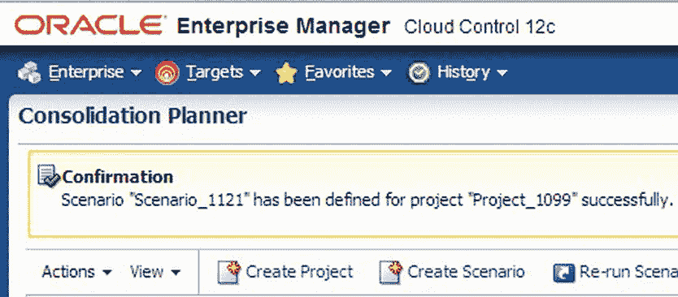
图 8-15. 提交确认

场景作业完成后，`整合规划器` 将生成报告并推荐最优的整合计划。如图 8-16 所示，它还详细说明了整合的工作负载在目标服务器上的执行情况。

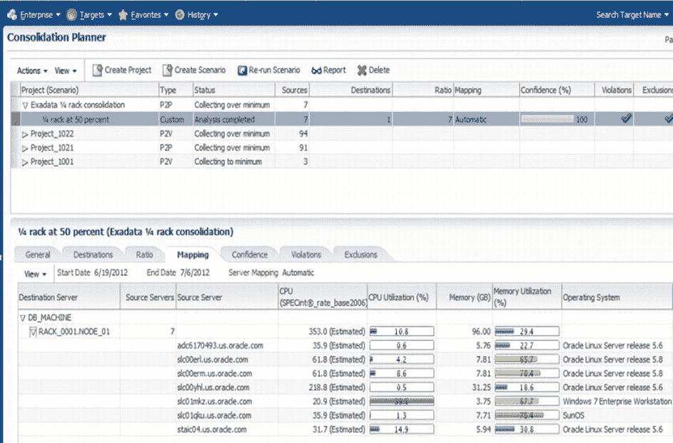
图 8-16. `整合规划器` 针对该场景的输出


正如 `Consolidation Planner` 擅长识别如何将物理资源合并到虚拟资源中一样，这个有价值的工具提供了重要信息，在考虑将物理服务器迁移到更新的物理服务器时非常有帮助。使用 `Consolidation Planner` 来规划向任何工程化系统的迁移，都可以轻松地确定范围、识别任务并充满信心地执行。

### 创建测试环境

在您的场景运行完毕并产生可接受的结果后，就需要确定要迁移的应用程序以及目标工程化系统的详细信息了。您需要创建一个测试环境，该环境应在一定程度上镜像您的目标目的地，以测试并减轻与迁移相关的所有潜在风险。

与任何测试环境一样，存储大量数据可能成本高昂，因此应使用理想的数据子集。Oracle 针对此问题开发了两种方法：`Test Data Management Pack` 和 `Oracle Application Testing Suite`。

`Test Data Management Pack` 支持数据子集化、数据发现和建模。数据子集化功能使您能够在生产、开发和测试系统上创建具有参照完整性的数据子集。为测试目的进行数据子集化，允许您选择所需数据的百分比（如 1%或 5%），从而使测试更轻松。

此工具包中的其他功能使您可以执行以下操作：

*   创建/编辑子集定义
*   预览子集详细信息和空间估算
*   定义和执行子集化前/后脚本
*   在目标之间执行子集定义
*   导出/导入子集定义

第二个选项是 `Oracle Application Testing Suite`，它是 `EM12c` 的一个扩展，提供与 `Test Data Management Pack` 相同的功能。`Oracle Application Testing Suite` 解决了所有相同的问题，并提供了一个完整的套件来创建测试环境并按需执行测试。

 `注` 有关 `Oracle Application Testing Suite` 的更多信息，请访问 `http://otn.oracle.com` 上的 Enterprise Manager 部分。

随着应用程序复杂性的增加，尤其是在云等共享计算环境中，访问敏感数据的机会也在增加。对敏感数据（如社会安全号码）的访问可以通过在不同环境之间对数据进行脱敏来限制。`Oracle Data Masking Pack` 用外观逼真的、经过清理的数据替换原始敏感数据，这些数据具有与原始数据相同的类型特征。这使组织能够共享完全脱敏的数据，同时仍能遵守内部公司治理和政府法规。

`Data Masking Pack` 使您可以执行以下操作：

*   创建或使用脱敏定义
*   对真实的应用程序测试工作负载进行脱敏
*   定义可重用的格式库
*   导出/导入脱敏模板
*   导出/导入格式库

`EM12c` 通过 `Data Masking Pack` 引入了发现数据依赖关系和进行建模的能力。此功能允许您发现环境中的数据模型和敏感数据，从而可以通过数据脱敏来保护它们。使用 Oracle 的 `FAST`（查找、评估、保护和测试）方法论来实施数据脱敏，您可以在 `Oracle Exadata` 上创建一个测试环境，其中所有敏感信息在进行下一步系统性能验证之前都已被脱敏。

其他数据脱敏功能使您可以执行以下操作：

*   创建/编辑应用程序数据模型
*   手动定义应用程序、模式和表
*   使用开箱即用的元数据收集驱动程序，用于客户和打包的应用程序
*   手动或通过使用敏感列发现来定义敏感列
*   按敏感类型对敏感列进行分类
*   定义和管理敏感类型
*   导出和导入应用程序数据模型
*   验证定义并将其与多个目标关联


这些管理包允许您定义并提取测试数据，用于在各类工程系统与通用系统平台上创建测试环境。总体而言，这些管理包有助于定义、优化测试过程，并为迁移与整合工作提供真实的测试结果。

### 验证应用程序性能

建立测试环境后，您需要执行测试，以验证与当前生产负载相比性能是否可接受。Oracle 开发了三种工具来帮助验证应用程序性能：`Database Replay`、`SQL Performance Analyzer` 和 `SQL Tuning Sets`。这些功能均属于 `Real Application Testing (RAT)` 套件。`RAT` 是 Oracle Database 的一个可选组件，为在测试环境中验证生产负载性能提供了理想解决方案。

### 数据库重放

`Database Replay` 功能能够捕获生产负载（包括在线与批处理负载），并在测试环境中重放。它使数据库管理员无需编写定制测试脚本即可测试系统变更、依赖关系及执行时序。通过减少测试所需时间，从而降低总体测试成本，节省时间与精力。`EM12c` 通过简化保存和传输捕获的负载及性能数据至测试系统、设置测试系统以及通过其中央控制台进行重放的流程，对 `RAT` 功能进行了补充。

 **注意** 要使用 `Real Application Testing (RAT)` 的功能，您必须购买许可。唯一的例外是 `SQL Tuning Sets`，它可以在 Oracle Tuning Pack 或 `RAT` 下获得许可。

`EM12c` 还针对中间层引入了功能类似于 `Database Replay` 的 `Application Replay`。`Application Replay` 为验证所有 Web 及打包 Oracle 应用程序的应用基础设施变更提供了最高效、优化且最优质的测试。

### SQL 性能分析器与 SQL 调优集

`SQL Performance Analyzer` 有助于预测并防止 SQL 执行性能问题。它通过在变更前后依次运行 SQL 语句，详细展示环境变化带来的影响。同时，它还会生成清晰、详细的报告，概述系统变更对工作负载的影响以及性能下降的 SQL 语句集。`Oracle Enterprise Manager 12c Tuning Advisor` 对 `SQL Performance Analyzer` 进行了补充，并提供优化和调整 SQL 语句以获取最佳性能的建议。

`SQL Tuning Sets` 是 SQL 语句的集合，可作为输入提供给 `Automatic Database Diagnostic Monitor (ADDM)`、`SQL Tuning Advisor` 或 `SQL Access Advisor`。它们是包含一个或多个 SQL 语句及其相关执行统计信息和上下文的数据库对象。这些调优集用于帮助 DBA 对 SQL 语句进行自动调优，并且可以导出到测试系统中进行评估和改进。

本节讨论的三种工具——`Database Replay`、`SQL Performance Analyzer` 和 `SQL Tuning Sets`——由 Oracle 开发，为测试数据库负载提供了一种方法论途径。这些工具各自表现出色，而它们协同工作时，则为监控任何环境（尤其是工程系统）提供了强大的方式。

## 管理阶段

数据库或应用程序在生产环境中部署后，确保应用程序性能最优并达到预期服务水平至关重要。`EM12c` 控制台中集成的 Oracle Exadata 硬件与软件组件视图，允许 DBA 从数据库性能页面导航至 Oracle Exadata 系统运行状况页面。当 Exadata 运行正常无问题时，附加在数据库上的系统运行状况按钮为绿色。当 `Oracle Enterprise Manager` 检测到错误时，系统运行状况按钮会变为红色，表明可能存在问题影响数据库可用性。

许多原因（例如，负载不均衡、`ASM` 相关问题、存储节点故障、存储节点配置问题或网络相关故障）都可能影响 Exadata 性能。`EM12c` 可帮助对 Exadata 及其他工程系统中的此类问题进行故障排除与诊断。数据库的 `Automatic Database Diagnostic Monitor (ADDM)` 和 `Automatic Workload Repository (AWR)` 功能是使用 Exadata 数据库一体机进行性能分析的关键工具。

### ADDM 与 AWR

`ADDM` 是 Oracle 数据库诊断基础架构的核心部分。`ADDM` 始于对数据库内基于关键工作负载指标获取的快照进行分析。这些快照包含与数据库内核、数据库工作负载以及操作系统级别相关的关键性能信息。`ADDM` 定期运行，分析这些信息并针对识别出的问题提出建议。

例如，当存在 SQL 负载问题时，SQL 顾问会就如何调整 SQL 语句提出建议。同样，当存在 I/O 或 CPU 问题时，`ADDM` 会提供系统资源优化建议。如果您正在运行 `RAC`，`ADDM` 会分析您的整个 `RAC` 基础架构（包括互联网络），并就如何提高整体性能提供建议。

`AWR` 是一个内置的存储库，包含在 `SYSAUX` 表空间中，每个 Oracle 数据库都维护着关于操作统计信息的该存储库。`AWR` 是 Oracle 数据库中所有自我管理功能的基础。它是关于 Oracle 数据库及其使用方式的历史信息的主要来源。`AWR` 存储库及相关快照使数据库能够做出专为其运行环境量身定制的决策。

## ASH 分析

`EM12c` 引入了一个新工具来探索 `Active Session History (ASH)` 数据。`ASH Analytics` 允许 DBA 跨各种性能维度分析性能数据。这种在不同维度上创建过滤器的能力极大地简化了性能问题的识别过程。

 **注意** `Active Session History (ASH)` 是一个 `PL/SQL` 包，使用前必须安装。有关 `ASH` 的更多信息，请参阅 第 9 章。

如 图 8-17 所示，`ASH Analytics` 的下拉菜单允许管理员使用预定义的性能维度层次结构来探索性能数据。

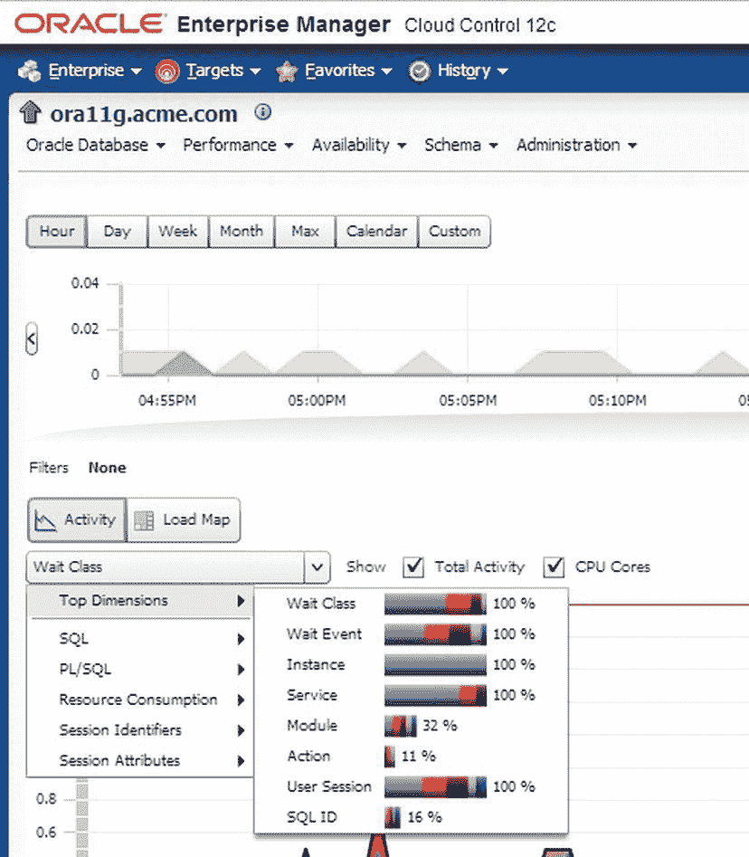

图 8-17. 活动会话历史 (ASH) 分析

`ASH Analytics` 功能可用于运行在 Oracle Exadata 数据库一体机或非 Oracle 平台上的任何 Oracle 11g 数据库。例如，通过使用等待事件维度，您可以聚焦于 Oracle Exadata 特定的等待事件，并解决与性能相关的问题。

### I/O 资源管理器

Exadata `I/O Resource Manager (IORM)` 是 Oracle Exadata 的另一项关键能力，它保证数据库在每个存储服务器上获得资源计划中定义的最小 I/O 量。让我们以运行多个应用程序和数据库的 Exadata 环境为例。

图 8-18 展示了 Exadata 存储服务器网格视图，从中您可以看到 `IORM` 未启用，并且 `CRM` 数据库未获得足够的 I/O 资源，因为 `DW` 数据库占用了大量资源。`DW` 数据库是合法的数据库，您不能仅仅因为它消耗大量资源就终止其进程。您需要找到更具创造性的方法来解决问题。

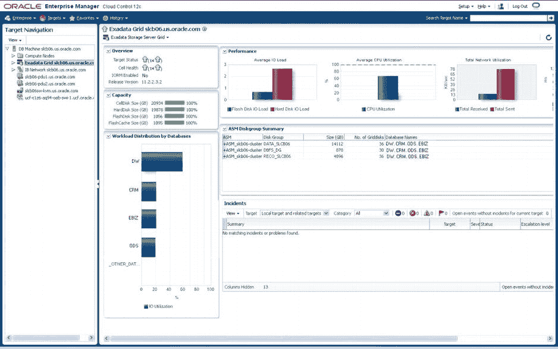

图 8-18. 未启用 IORM 的 Exadata 存储服务器网格


