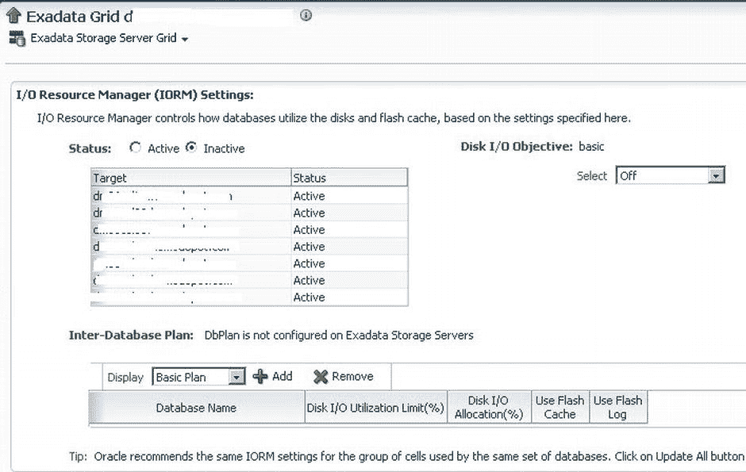
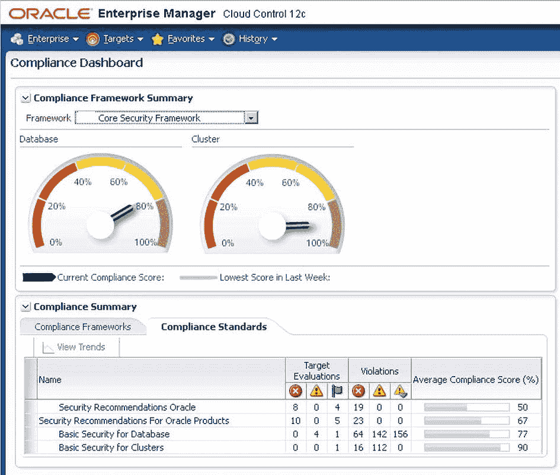
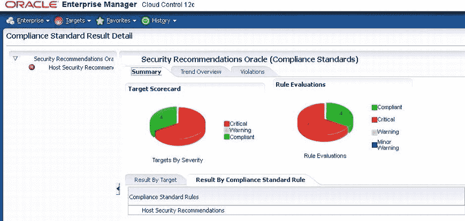
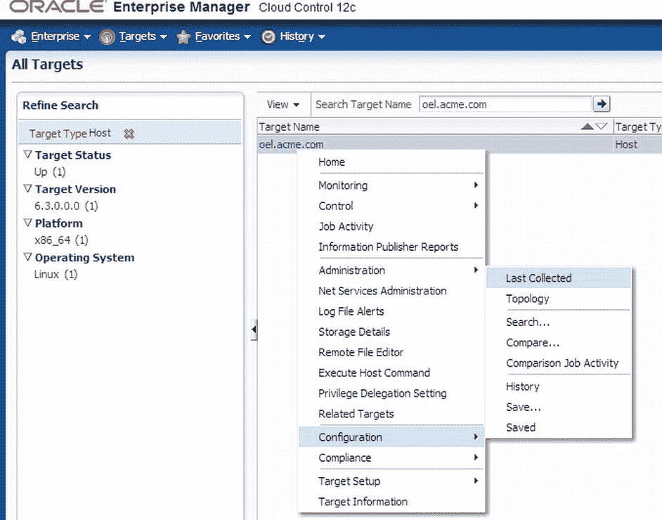
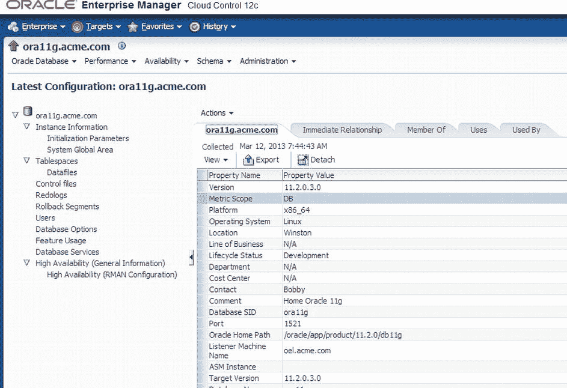
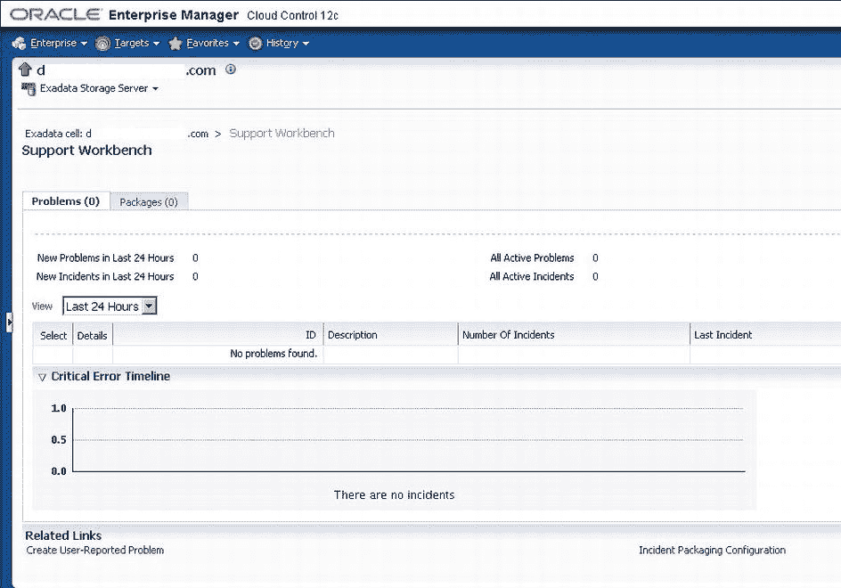
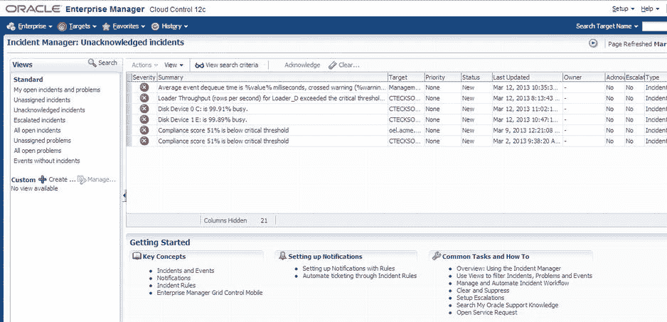
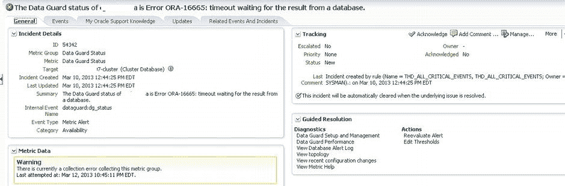

# IORM 配置与维护

在 Exadata 中，您可以通过启用 IORM 来管理 I/O 资源的分配。您可以手动配置 I/O 分配以分配固定数量的 I/O 资源，也可以选择具有固定 I/O 分配的预定义模板。

如图 8-19 所示，当前 IORM 处于禁用状态；此外，我们没有任何内部数据库间计划或磁盘 I/O 目标启用。要启用 IORM，您需要更改所需设置，然后单击“全部更新”按钮。这将启用所有选定的更改，Exadata 将开始按定义的 I/O 资源计划分配资源。也有可以实施的预定义 I/O 模板。

图 8-19 IORM 设置

启用 IORM 并分配所需资源后，任何性能瓶颈都应消失。在设置 IORM 计划时，请确保分配给资源的百分比符合已定义的服务级别协议（SLA）。

## 维护阶段

在应用程序部署到 Oracle 工程系统上的生产环境，并确保资源已优化共享或分配给数据库后，您还需要维护环境中的配置。EM12c 通过使用合规框架来评估主机和数据库，帮助您确保所有组件的合规性。合规框架会主动检查受监控的环境，并通知您潜在的环境问题以及所需的关联补丁。

除了 EM12c 中的合规框架外，还有其他强大的解决方案可用于维护受监控的环境配置：

*   综合配置管理
*   缺陷诊断
*   自动化补丁解决方案

尽管您可以在本书的其余部分找到关于这些 EM12c 功能的更多细节，但让我们在 Oracle 工程系统的背景下更详细地了解它们。

### 合规框架

EM12c 提供了一种跨目标（包括 Exadata 数据库机）管理标准的分层方法。合规框架由三个可以管理和重用的核心组件组成：

*   合规框架
*   合规标准
*   合规规则

合规框架用于提供从合规标准得出的合规分数的聚合。根据需要遵守的要求，可以有多个框架。图 8-20 显示了合规情况仪表板，该仪表板用于确保遵循合规性并显示关联的分数。

图 8-20 合规情况仪表板

合规标准是合规框架中唯一与受管目标关联的部分。合规规则是与合规标准关联的规则。一旦合规标准与目标关联，标准内的规则就会针对目标执行，并存储在 Oracle 管理库中。

可以从合规情况仪表板的高层查看关联框架的结果，如图 8-20 所示。若要查看更详细的结果视图，可以从仪表板深入查看这些合规标准。图 8-21 显示了“安全建议 Oracle 标准”的更详细视图。

图 8-21 合规标准结果详情

合规框架关联的标准和规则是高层查看基础架构内配置的好方法。该框架可应用于所有硬件版本，包括 Oracle 工程系统。

### 配置管理

EM12c 为 Exadata、其他工程系统和通用系统提供配置管理功能。配置管理使您能够从目标收集详细信息，这些信息通常是一个庞大且很少更改、具有非平凡结构的信息集合。与性能指标相比，这些集合很少收集。配置数据应仅由管理员显式更改目标而影响。管理员可以进行的更改示例包括为目标打补丁或重新配置目标，例如更改 Oracle 主目录的文件权限。

EM12c 中的配置管理提供许多功能，包括：

*   相对较大的相关配置数据集的低频收集（每日）
*   按需刷新和计划刷新配置信息
*   比较配置以发现它们在不同目标之间的差异
*   将配置作为保存的快照存储在管理存储库中，以供以后查看、比较和其他与配置相关的操作
*   将配置导出到文件，并将此类文件导入回企业管理器作为保存的快照
*   历史变更跟踪
*   在企业或目标子集的所有配置信息中进行强大搜索
*   由于与关联目标的关系而触发关联

通过企业管理器用户界面查找配置时，可以通过在“所有目标”中右键单击目标并选择“配置” -> “最后收集的配置”来找到配置信息。图 8-22 说明了如何访问目标的配置信息。

图 8-22 访问配置数据

一旦进入目标的最后一个配置页面，您将在屏幕左侧看到一个导航树，在右侧看到一系列选项卡。这些结构使您能够浏览与目标关联的当前配置信息。每个目标类型将呈现不同的导航树；右侧的选项卡将保持不变。图 8-23 显示了 Oracle 11g 数据库最新配置的示例。

图 8-23 Oracle 数据库的最新配置

在查看数据库的配置时，DBA 可以监控和强制执行与初始化文件（`spfile`）、操作系统参数以及 Exadata 或任何其他数据库内的单元配置关联的参数的配置。配置强制执行可以通过比较两个具有相同配置的主机来完成，以识别其中一个主机上的任何问题。也可以将配置与目标保存的配置（视为黄金标准）进行比较，以确定目标配置中是否存在任何偏差。

 **提示**  比较目标配置或使用黄金镜像进行比较需要大量数据。最好在非高峰时段运行比较。

Oracle 企业管理器还可以比较多个 Exadata 数据库机的配置。诸如变更历史跟踪或配置管理清单之类的功能也有助于配置合规性。Oracle 企业管理器持续捕获 Oracle Exadata 中的变更事件，还可以生成配置变更的综合报告，详细信息包括变更内容、时间、地点以及由谁执行。

### 缺陷诊断

Oracle 企业管理员为在 IT 技术栈的任何环节排除问题和诊断缺陷提供了一个出色的解决方案。支持工作台和事件管理器是 `EM12c` 实现缺陷诊断功能的关键组件。

`支持工作台` 与 Oracle 数据库的高级故障诊断基础设施进行交互，用于检测、诊断和解决 `Exadata 数据库一体机` 中的问题。它提供了一个易于使用的图形界面来调查报告并解决 `Exadata` 基础设施中的问题。它通过使用 `IPS` 打包诊断数据、帮助获取支持请求编号以及将 `IPS` 包上传到 Oracle 支持，从而最大限度地减少解决任何问题所需的时间。它支持查看和报告从数据库、`自动存储管理` (`ASM`) 一直到 `Exadata` 的、具有关联打包信息的事件。

图 8-24 显示了 `Exadata` 单元的 `支持工作台`。如果存在问题，您可以通过此界面收集所需的所有文件，并向 Oracle 报告事件以寻求解决方案。

图 8-24. Exadata 单元的 Support Workbench

`EM12c` 引入的最佳功能之一是一个名为 `事件管理器` 的集中式事件控制台。`事件管理器` 使管理员能够跟踪、诊断和解决事件，这些事件可能是一个或多个紧密关联、代表一个已发现问题的事件。图 8-25 显示了 `事件管理器` 的主控制台。

图 8-25. Incident Manager 控制台

事件管理的目标是使管理员能够尽可能快速、高效地监控和解决服务中断。事件管理不是管理可能因任何服务中断而产生的大量离散事件，而是允许您根据业务优先级管理数量更少、意义更明确的事件。

`事件管理器` 还利用 `My Oracle Support` 知识库文章和文档来加速问题诊断和解决。此外，`事件管理器` 现在允许您分配所有权、确认事件、设置事件优先级、跟踪事件状态以及升级或推迟事件。使用帮助台连接器，`事件管理器` 还可以生成事件通知或打开帮助台工单。

图 8-26 显示了可以查看事件附加信息的子部分。此部分中的选项卡提供有关事件的常规信息、关联事件、关联的 `MOS` 说明、事件已发生的更新以及是否发生了任何其他相关事件。

图 8-26. Incident Manager 详细信息子部分

 **注意**  要使 `My Oracle Support 知识库` 选项卡发挥作用，需要通过 Oracle 企业管理员内的 `设置` 菜单，使用 `MOS` 凭据设置 `My Oracle Support`。

通过 `支持工作台` 和 `事件管理器`，`EM12c` 为识别、排除和解决可能发生在 `Exadata 数据库一体机` 内的问题提供了一些强大而灵活的选择。通过扩展管理连接器，这些诊断工具可以与帮助台工单软件结合使用，发挥更大作用。

