# 性能页面与 ASH 分析

作者：Kellyn Pot'vin

通过 `顶级活动` 功能监控性能自 Oracle 9i 引入以来，一直是企业管理员最常用的方面之一。在 `EM12c` 控制台中，将优化功能更深入地集成到现有和新的性能页面中，是新版本中为满足更复杂的数据库和云环境需求而取得的主要成就之一。

这些成就还包括在 `顶级活动` 中更高效的数据报告，以及利用 `活动会话历史` (`ASH`) 数据的新机会，这些数据以 `ASH 分析` 和 `实时自动数据库诊断监控器` (`ADDM`) 性能图的形式呈现。现在，从 `顶级活动` 和 `ASH 分析` 界面中就可以使用新的顾问和报告选项，而在过去，您可能不得不离开当前的性能页面，或打开辅助浏览器窗口，或寻求其他工具来解决问题。

登录到 `EM12c` 数据库目标界面后，您可以单击 `性能` 并选择各种选项来查看数据库中的活动。本章涵盖主要的性能类别，这些类别在以下领域提供优势：

- 主机性能主页
- 性能主页
- `顶级活动`
- `ASH 分析`
- `SQL 监控`
- SQL 优化选项
- 顾问主页
- `实时 ADDM`
- `ADDM` 比较报告

## 许可要求

您必须注意与 `自动工作负载仓库` (`AWR`)、`ASH` 和 `ADDM` 相关的许可要求。在利用这些性能报告功能之前，请确保您已获得 Oracle 的 `诊断` 和 `调优` 管理包的许可。

可以通过单击 `EM12c` 控制台中的 `设置`  `管理包` 来访问许可信息。您可以查看单个页面、整个环境或特定管理包/功能的信息。图 9-1 显示了此菜单层次结构。

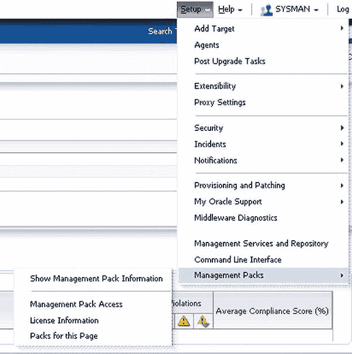


图 9-1。 任何 EM12c 页面或功能的管理包和许可信息都可以从控制台的 `设置` 菜单轻松获取。

 **提示** 管理员可以通过点击 `设置`  `管理包`  `此页面的管理包`，来访问控制台页面中用于任何 EM12c 功能的管理包。

解决了许可问题后，您就可以专注于性能数据以及 EM12c 控制台提供的众多选项了。用于性能数据的最常用界面是目标级别的界面，通常涉及单个实例或集群数据库。

## 主机性能

主机目标的性能信息可以通过在 EM 控制台页面中选择 `目标`  `主机`，然后选择所需的主机来访问。您可以检查基本的性能指标，例如 CPU 使用率、内存使用率、文件系统使用率和网络利用率，如 图 9-2 所示。

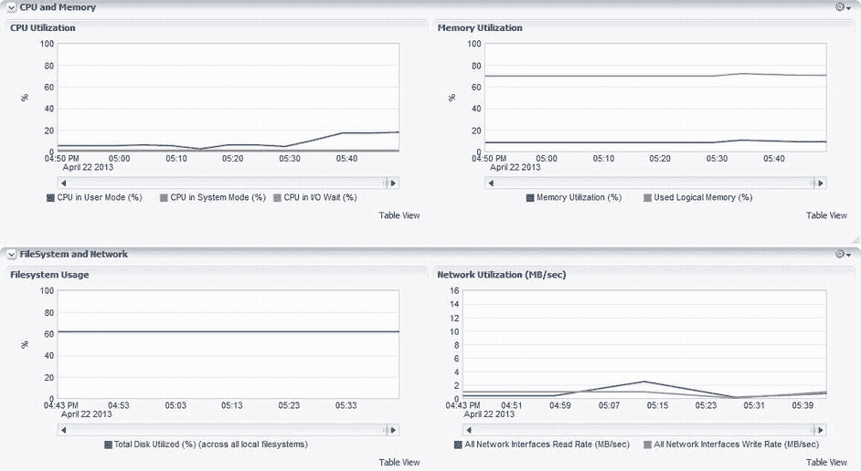

图 9-2。 主机性能信息——请注意右下角图表中下午 1:44 之后网络利用率的峰值。

在左侧窗格中，您可以查看关于主机状态、事件、配置和作业活动的完整摘要信息。

CPU 使用率和内存的任何波动都会显示出来，同时还有文件系统使用率和网络利用率。对于这四个领域（CPU、内存、文件系统和网络）中的每一个，您也可以以表格格式查看数据，如 图 9-3 所示。要访问此格式，请点击任何图表右下角的 `表格视图` 链接。可以检查表格表示形式，以查找在图形界面中可能显示不明显的异常值，或者可以将数据复制并粘贴到 CSV 或 Microsoft Excel 文件中。

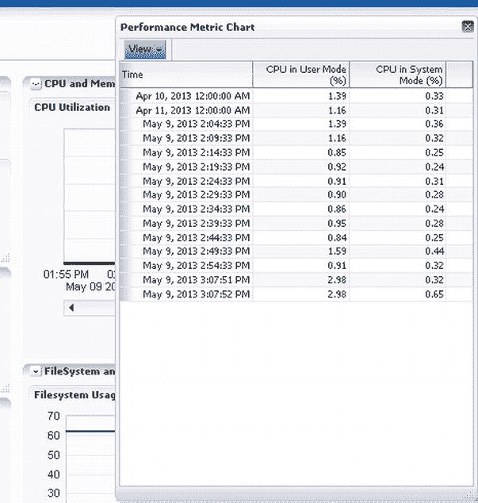

图 9-3。 主机性能页面中性能指标图表的表格显示。

这些窗格中的每一个都可以调整为您选择的任何顺序显示。只需右键单击每个窗口右上角的 `查看操作` 菜单，即可根据您的偏好组织性能摘要视图。

### 性能主页

数据库性能主页提供了一个关于可运行进程（按 CPU 划分）的紧凑视图，包括为单个数据库目标包含的任何基线。性能主页可以通过多种方式访问，具体取决于管理员/用户选择的主页，但登录 EM12c 后始终可以通过点击 `目标`  `数据库` 并选择一个数据库来访问。`性能` 选项卡位于数据库主页的 EM 控制台数据库控件中从左数第二个（参见 图 9-4），并包括用于查看、诊断和检查数据库性能的选项。

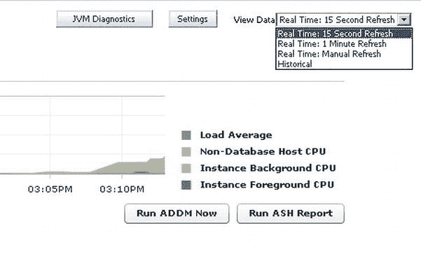

图 9-4。 Oracle 11g 环境中数据库服务器的 CPU 使用率，当前设置为 15 秒刷新间隔，但演示了如何更改为扩展的更新间隔。

与 `顶级活动` 性能页面不同，性能主页是数据库性能的摘要，并非特定于数据库性能，而是数据库环境的总体性能，包括主机和系统信息。

 **提示** 此部分的历史数据将仅基于 CPU 数据。如果您想要有关数据库使用情况的更具体数据，必须转到 `顶级活动`。对于聚合度较低的数据，请参阅本章后面讨论的 `ASH 分析`。

性能主页网格数据可以以 15 秒间隔、1 分钟间隔查看和刷新，或手动刷新，您也可以选择历史视图。基线以及负载平均值可以包含或排除在图表中。可以从本节运行 `JVM 诊断`、`ADDM` 或 `ASH` 报告的选项。

主区域分为高级别的数据库等待信息。此视图不仅显示 CPU 使用率，还显示数据库外的 CPU 使用率和系统负载平均值。

通过点击 图 9-4 右上角所示的 `设置` 按钮，您可以将图表默认设置从基于 CPU 更改为显示 I/O 图表信息或基线值（参见 图 9-5）。

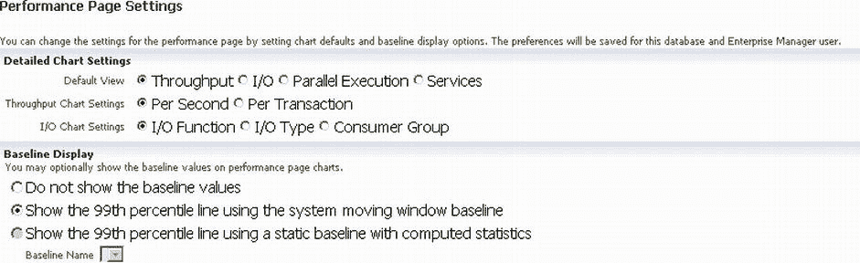

图 9-5。 更改默认性能主页图表设置。

在 图 9-6 中，管理员已从高级摘要性能信息切换到详细性能信息（不要与 `ASH` 混淆）。此视图可以仅显示前台会话，也可以包含后台会话。有时，能够仅显示前台或后台等待信息非常有价值。

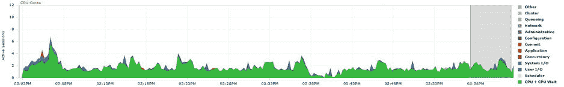

图 9-6。 EM12c 中性能主页的 `平均活动会话` 窗格，展示了涉及 CPU 和一些 I/O 等待的平均负载。

 **提示** 在诊断性能问题时，仅检查前台会话，然后检查前台和后台会话，可以帮助区分问题，例如 ETL 批量加载设计不佳或游标未正确关闭的问题。

从 `平均活动会话` 窗格，您可以快速评估数据库的性能统计数据。通过点击主页底部的链接之一，您可以访问 `顶级活动` 页面以执行更详细的调查。

链接可包括以下内容：

*   `顶级段`
*   `集群缓存一致性` (在 RAC 中)
*   `互连` (在 RAC 中)
*   `并行执行`
*   `数据库锁`
*   `SQL 监控`
*   `顶级消费者`
*   `顶级活动`
*   `重复 SQL`
*   `实例活动` (在 RAC 中)

### 吞吐量

`吞吐量` 选项卡显示每秒或每事务的吞吐量。它具有到 `顶级消费者`、`重复 SQL`、`实例锁`、`实例活动` 和 `SQL 响应时间` 的额外监控链接。这些选项卡会重新链接回 `顶级活动`、锁定页面以及 `顶级活动` 区域之外的信息页面。

### I/O

`I/O` 选项卡具有以毫秒为单位的 I/O 延迟以及按 I/O 功能、类型或消费者组划分的以 MB/秒为单位的 I/O 图表（参见 图 9-7）。有一个按钮可以通过图形界面快速执行 I/O 校准 (`DBMS_RESOURCE_MANAGER.CALIBRATE_IO`)，如果数据库要使用 `Auto DOP`（并行度），则需要此校准。

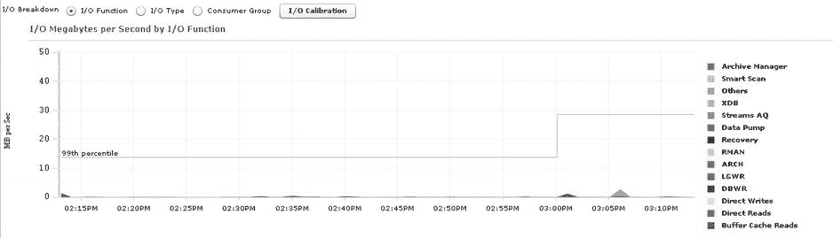

图 9-7。 从性能主页进行数据泵操作期间以 MB 为单位的 I/O。

### 并行执行

`并行执行` 选项卡（如 图 9-8 所示）显示有关活动串行/并行会话的相关信息。此外，第二个图表显示每个并行执行的协调器和从属会话，第三个图表显示数据库环境中并行化的 DDL、DML 和查询。

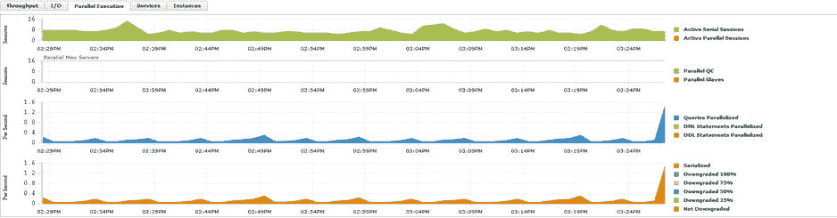

图 9-8。 从性能主页显示的并行执行示例，详细展示了多个级别的并行使用情况。

### 服务


如果数据库环境启用了相关服务，它们将会显示在“服务”选项卡中，如图 9-9 所示。数据会以标准网格性能图的形式展示，通过颜色和名称来标识每个服务及其资源使用情况。

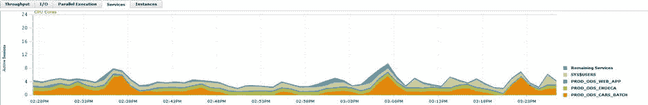
图 9-9. 服务与资源使用示例

查看放大的图例后，可以很容易地看出 `App1_Prod_Orcl` 服务占用了环境中最多的资源。其余服务在资源使用方面非常相似，其影响规模远不能与这个应用程序服务相提并论。

这些信息随后可用于帮助按服务隔离性能问题，从而缩小优化工作的范围。

 **注意**  “实例”选项卡仅在访问真正应用集群（`RAC`）环境时才会显示。如果没有此功能，则没有显示该选项卡的理由，它也不会出现在性能主页上。在撰写本文时，所有可用的 `RAC` 环境都涉及 Exadata 第 2 版，且界面中没有显示实际的实例信息。这可能是当前 Exadata 版本中的一个错误，或者此选项卡可能仅在非 Exadata 环境中起作用。

## 最高活动量

自最初发布以来，“最高活动量”页面一直是 Enterprise Manager 环境的基石。管理员可以查看显示的数据，并获得数据库等待事件的图形化表示——一个简单的数据库使用情况视图。通过易于理解的等待组颜色描述，管理员通常无需高级的性能优化知识，就能识别性能问题并锁定关注区域。

随着 EM12c 的发布，“最高活动量”页面得到了增强，以提供更明确的性能数据、将“最高活动量”界面与性能报告（如 `ASH`、`AWR` 和顾问建议）关联的简单界面选项，以及详细的会话历史记录。

“最高活动量”页面是性能页面视图左上角“性能”下拉菜单中的第二个选项（管理员登录数据库目标后即可使用）。自其首次出现在 Enterprise Manager 10g 以来，该界面基本保持不变，因此即使是 `EM12c` 的新手也会发现该界面易于导航。

“最高活动量”页面的上半窗格（如图 9-10 所示）提供了数据库环境中等待活动和活动会话的快速视图。右侧的图例说明了屏幕上每种颜色代表的含义，时间线显示在底部。

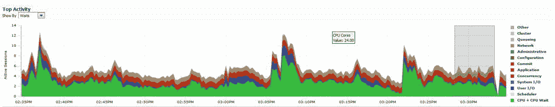
图 9-10. `EM12c` 的最高活动量图，显示了高于正常的 I/O 等待

右侧的图例由等待事件的链接组成，每种颜色对应一个。点击其中任何一个链接都会打开该等待事件的“活动会话”页面，如图 9-11 所示。然后，您可以锁定某个特定的等待事件以收集更多详细信息。

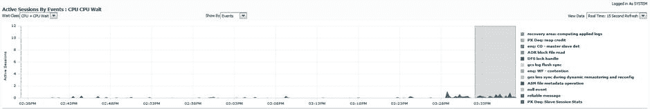
图 9-11. 突出显示的 CPU + CPU 等待事件

将鼠标悬停在等待事件上时，图中该特定等待的资源使用情况会突出显示。例如，点击“CPU + CPU 等待”选项后，您将被连接到显示所有正在经历“CPU + CPU 等待”等待的会话详细信息的页面，如图 9-12 所示。

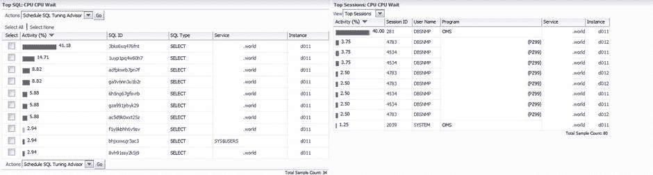
图 9-12. 仅显示 `SQL ID` 和正在经历 CPU 等待及等待 CPU 的会话的等待信息

然后，之前在图 9-10 中显示的“最高活动量”图中的灰色区域，会在“最高活动量”页面的下半部分得到详细展示，默认显示“Top SQL”和“Top Sessions”（参见图 9-13）。请注意，左侧面板中每个 `SQL ID` 左侧和右侧面板中每个会话 ID 左侧的等待区域都以绿色编码，以表明它们是 CPU 等待事件。

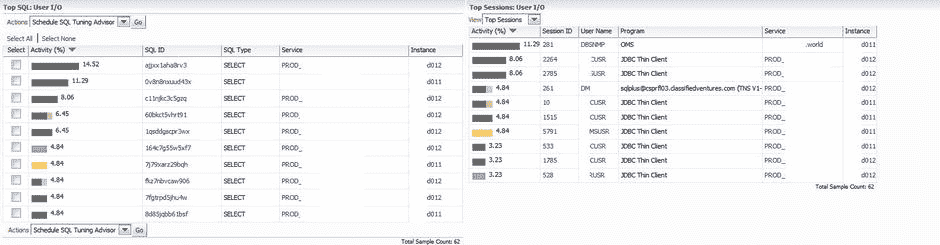
图 9-13. Top SQL 和 Top Sessions，展示了数据库环境中的 I/O 问题

### Top SQL 窗格

Top SQL 部分按活动百分比、`SQL ID`（SQL 语句的唯一标识符）和执行的 SQL 类型进行细分。请注意，在图 9-13 所示的示例中，一个明显高 I/O 资源消耗的语句正由两个会话执行。随着该百分比相对于其余数据库会话显示出来，等待事件的整体影响也清晰地展现出来。

此时，您可以从 Top SQL 标题下方的下拉菜单中选择计划一个 `SQL 调优顾问` 或创建一个 SQL 调优集。点击任何一个 `SQL ID` 都会打开“SQL 详细信息”页面，该页面提供有关各个 SQL 语句的详细信息。

### SQL 详细信息页面

图 9-12 中引用的 `SQL ID` `cwu5p1yyp1p40` 所演示的 I/O 问题，实际上是一个表空间数据泵作业背后的 SQL 语句。在 Top SQL 部分点击此 `SQL ID` 会打开一个详细信息页面，该页面提供有关性能、统计信息、执行计划、调优历史记录和 SQL 监控的详细信息（参见图 9-14）。页面的下半部分由一系列选项卡控制，这些选项卡显示有关该语句的不同详细信息。您可以检查每个选项卡并研究显示的数据，以便为手头的问题提供价值。在右上角，您可以使用按钮来刷新、创建 SQL 工作表、执行 JVM 诊断或创建 SQL 详细信息活动报告。

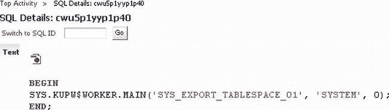
图 9-14. 最高活动量、Top SQL 详细信息，以数据泵语句为例，通过 `SQL ID` 识别

### SQL 活动

“SQL 详细信息”页面的入口点是“SQL 活动”选项卡。此视图清晰地以标准图表形式展示了所调查 `SQL ID` 最近一小时的活动情况，以及语句信息和等待历史记录（请参阅前面的图 9-16）。示例中显示的 SQL 是针对 `SYSTEM` 表空间的一个数据泵作业。

对于过程调用，能够将后台 SQL 进程追溯到其父进程是非常有帮助的。要从 EM 控制台显示的 `SQL ID` 定位到这一点，以下查询可以提供帮助：

```
select o.owner, o.object_name, o.object_type, s.program_line#
from v$sql s, dba_objects o
where sql_id = '<SQL_ID>'
and s.program_id=o.object_id;
```

随后将返回过程或包，以及 SQL 调用源自行号，从而让您快速了解来源。这可以从 SQL *Plus 会话中运行。如果您更愿意从 `EM12c` 控制台运行，可以通过点击 性能  SQL  运行 SQL 来实现。

该界面提供了一个简单的选项来执行 SQL 语句或加载 SQL 脚本。输入用于执行脚本的登录信息（参见图 9-15）。

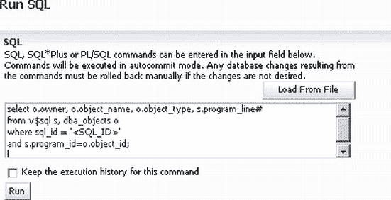
图 9-15. `EM12c` 中的“运行 SQL”界面，允许直接从控制台执行 SQL


