# Oracle 企业管理器云控制 12c 中的 SQL 详细信息页面

 **提示** 如果您定期从 EM12c 控制台运行 SQL，最好确保已设置好`主机`和`数据库首选凭据`，以减少执行失败的问题。

执行后，将返回以下信息：

```
OWNER        OBJECT_NAME            OBJECT_TYPE          PROGRAM_LINE#

USER1        GET_NEW_FUNC           FUNCTION             9
```

以上信息显示了对象名称、对象类型和行号。此数据可用于快速识别代码中的问题所在。

## SQL 详细信息活动选项卡

`SQL 详细信息活动`选项卡（如图 9-16 所示）提供了特定于 SQL 的`Top Activity`数据视图，除了目标`SQL ID`之外，消除了所有其他 SQL 等待和 SQL 执行。可以将灰色区域移动到时间线内的任何位置，以突出显示 SQL 活动中的等待。由于这是 SQL 活动而非会话活动，详细信息页面底部显示了执行 SQL 的会话，以及活动百分比、会话 ID（如果该会话是并行进程的一部分）、`QC SID`（包括执行 SQL 用户的所有并行会话）、SQL 所属的程序，以及 SQL 是否有关联的计划哈希值。

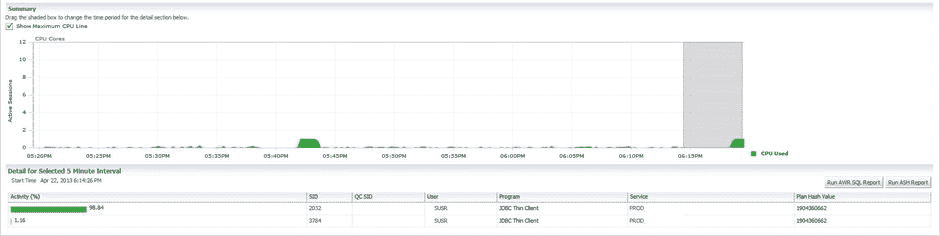

图 9-16. `SQL 详细信息`页面的`活动`选项卡

您可以单击`SQL ID`并进入`SQL 详细信息`页面界面，从此窗格执行 HTML 版本的`AWR`或`ASH`报告，以进一步研究活动和数据库性能。

## SQL 统计信息

`SQL 详细信息`页面中的第一个选项卡`统计信息`包含 SQL 统计数据。此视图（如图 9-17 所示）提供活动会话信息，按等待、时间、耗用时间（数据库时间与 CPU 时间）、执行统计信息和游标统计信息细分活动。

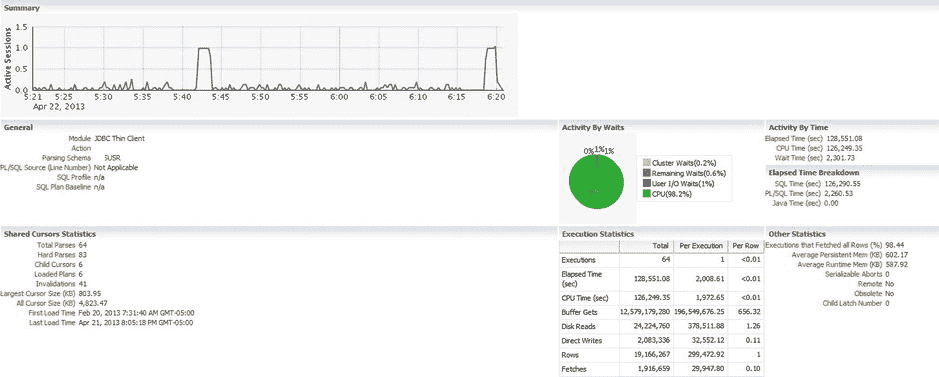

图 9-17. `SQL 详细信息`页面中的`统计信息`活动

## SQL 计划

`计划`选项卡以图形或表格形式提供所详述`SQL ID`的实际执行计划。表格版本（如图 9-18 所示）如果 SQL 语句有多个可用的哈希计划值，则会提供下拉菜单。显示基本计划信息，如解析模式、优化器模式、语句来源和捕获时间。

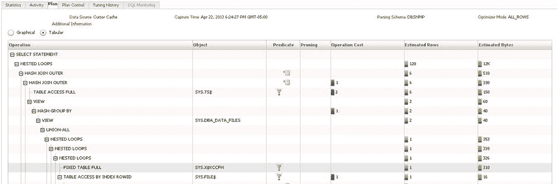

图 9-18. 来自`SQL 详细信息`页面的语句执行计划的表格表示

在 EM12c 控制台版本的表格计划中，还在`优化成本`部分通过图例颜色提供了等待类型。您还可以查看行数（附带图表线以快速访问预期返回的行数）和字节数（同样以预期字节数的视觉指示器显示）。您可以单击`谓词`列中的任何指示器（在图 9-18 中突出显示）以查看谓词和过滤器，以及有关该步骤的更详细信息。

`SQL 详细信息`中的`计划`选项卡的图形版本提供了执行计划的可视化显示（参见图 9-19）。这是语句的逐步路径，通过 SQL 执行显示连接、循环和分组对象。

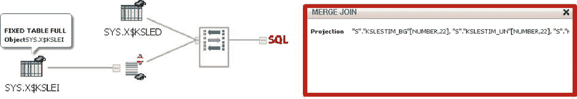

图 9-19. 语句的图形化执行计划，展示了在控制台窗格中突出显示的合并连接

当突出显示执行计划图形格式的部分时，会显示投影、确定的列连接，甚至布隆过滤器。图 9-19 右上角的按钮使您可以将显示从水平更改为垂直地图、执行重写或打印执行计划图形。左侧`图形`和`表格`单选按钮下方的缩放栏使您可以根据需要放大和缩小。

### SQL 计划控制

`计划控制`选项卡可用于高级功能，如`SQL 配置文件`、`SQL 补丁`和`SQL 计划基线`。此窗格有助于快速确定基线是否将计划锁定在潜在的次优执行计划版本中，以及是否存在`SQL 配置文件`或`SQL 补丁`在控制优化器为窗格中详细信息的 SQL 所做的选择。与`SQL 详细信息`页面中的所有选项卡一样，您可以从面板右下角轻松执行 SQL 工作表或安排`SQL 调优顾问`。

 **注意** 由于`SQL 调优顾问`非常易于使用且每晚自动运行，`SQL 配置文件`正成为数据库标准。这种提示、大纲和统计信息的组合，通过其`SQL ID`连接到语句，为 DBA 在流程存在复杂问题时解决棘手问题提供了快速解决方案。由于`SQL 配置文件`仅通过`SQL ID`连接，对 SQL 语句的任何更改都会导致`SQL 配置文件`停止工作。

## SQL 调优历史记录

`调优历史记录`选项卡支持`SQL 详细信息`页面的`计划控制`部分，提供有关针对所详述 SQL 的先前顾问任务或在相关历史时期内的任何`ADDM`发现的历史信息。如果已针对`SQL ID`执行了`SQL 调优`任务，它将在历史记录中显示，并且即使计划未实施，也有链接可用于查看有关发现的详细信息。

### SQL 监控

`SQL 监控`选项卡提供了完整`SQL Monitor`（本章后面将详细介绍）中所提供内容的微观视图。这清晰地显示了会话正在执行的 SQL、会话涉及的先前执行中已完成的 SQL、每次执行耗时多久、I/O 请求以及开始/完成时间（参见图 9-20）。

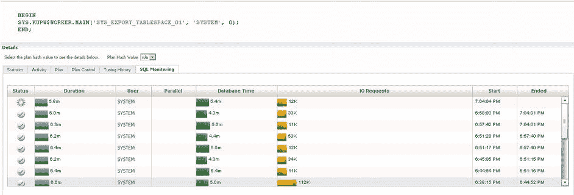

图 9-20. 数据泵进程的`SQL 监控`视图

在检查 SQL 语句以寻找优化机会、基线信息、执行计划稳定性和资源使用情况时，这些选项卡中的每一个都提供了宝贵的信息。通过利用`Top Activity`页面的这一小部分，管理员可以快速深入了解捕获的任何 SQL 语句。

## Top Sessions 窗格

默认情况下，`Top Sessions`窗格位于`Top Activity`页面的右下部分。虽然此部分可以更改为显示关于服务、模块、操作、客户端、文件、对象或`PL/SQL`的 Top 信息（参见图 9-21），但会话信息是管理员认为最有用的主要数据。

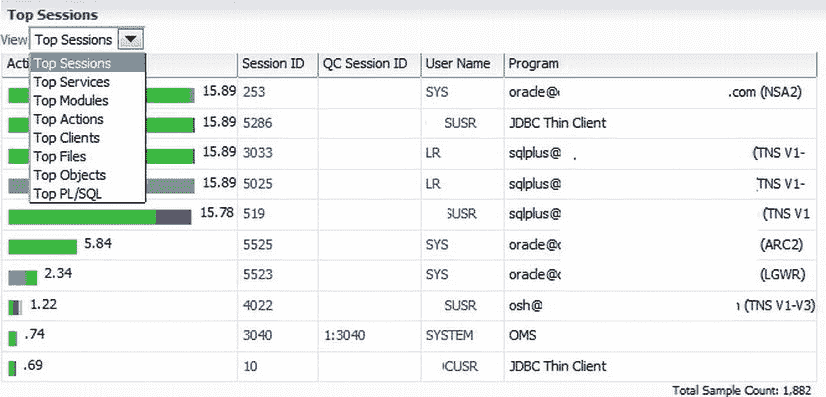

图 9-21. `Top Activity`页面的`Top Sessions`，以及`其他 Top 选项`的下拉列表

在此窗格中，您不仅可以突出显示与`Top Activity`图中图例颜色编码匹配的等待事件，还可以访问每个`SID`和用户名的链接。执行会话的程序也显著显示在右侧，有助于快速区分会话。

由于此页面按会话信息区分，单击任何`SID`将打开`会话详细信息`页面。

## 会话详细信息页面


## 会话详情页面概览

会话详情页面与 SQL 详情页面不同，它在会话级别分解数据。此页面的标签页包括：常规、活动、统计信息、打开的游标、阻塞树、等待事件历史、并行 SQL 和 SQL 监控。与 SQL 详情页面类似，会话详情页面默认显示活动标签页，如图 9-22 所示。

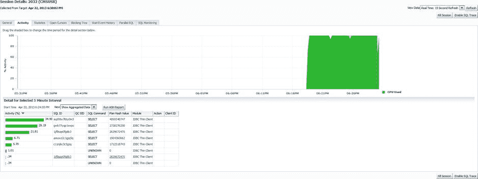

**图 9-22. 会话详情页面，显示由 SID 执行的活动查询**

### 活动标签页

活动标签页通过颜色显示会话的等待活动，并在图例右侧显示等待类型。从页面的右上角，您可以启用跟踪、终止会话以及更改图表的刷新间隔。页面底部显示有关 5 分钟时间间隔的信息（在图表时间线中以灰色高亮显示），以及 SQL ID。该 SQL ID 链接到高亮时间线内正在执行语句的 SQL 详情页面，还包括执行计划哈希值和模块信息。如果在 5 分钟窗口内执行了多个语句，所有 SQL ID 都将显示在该间隔的详细部分。

### 常规标签页

如图 9-23 所示的常规标签页，显示了从顶部活动页面获取的关于该会话的所有信息。会话详情页面与 SQL 详情页面一样，可以通过 EM12c 控制台内的多种方式访问，从而能够快速地从性能页面跳转到控制台，以获取特定会话的数据。

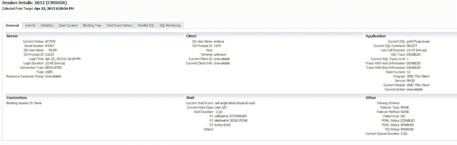

**图 9-23. 会话详情页面中的常规信息**

会话详情页面（如图 9-24 所示）显示服务器级信息，包括操作系统进程 ID、客户端信息、应用程序、发生的任何阻塞以及等待。另一部分包含并行执行信息。

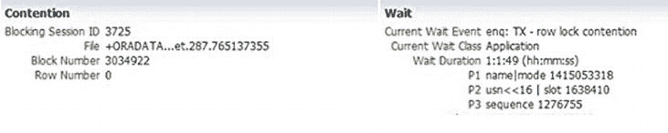

**图 9-24. 会话详情常规页面中的阻塞会话**

### 统计信息标签页

统计信息标签页显示关于会话的所有统计信息，包括物理和逻辑等待、详细的 CPU 使用率信息、Gets 和缓冲区信息。表 9-1 显示了统计信息标签页的详细信息。

**表 9-1. 会话详情页面统计信息标签页上的详细信息**

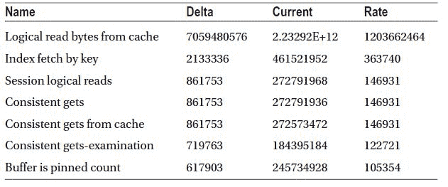

统计信息标签页不提供向下钻取或链接，但它提供了启用跟踪以收集更深层会话级数据或终止会话的选项。

### 打开的游标标签页

如图 9-25 所示的打开的游标标签页，对于识别会话中的游标或互斥锁级别的性能问题非常有帮助。该窗格快速显示游标及其计数，以 SQL ID 为首，该 SQL ID 将再次链接到 SQL 详情页面以识别游标 SQL 中的任何问题。

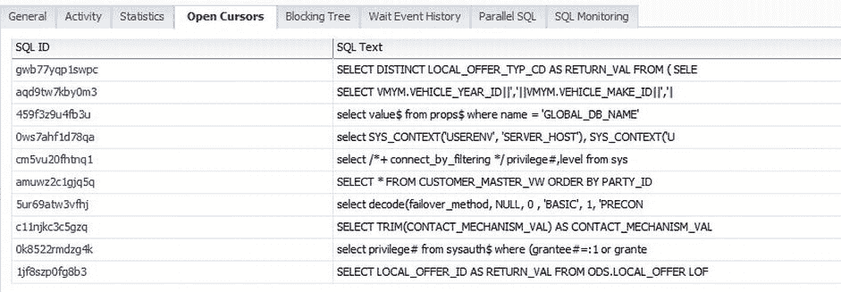

**图 9-25. 会话详情页面中正在进行进程的打开游标**

会话 ID 和用户名在左上角显著显示。跟踪或终止会话的选项再次出现在右上角和右下角。

### 阻塞标签页

阻塞标签页显示环境中可能处于活动状态的任何阻塞会话的信息。由于阻塞信息的复杂性，此标签页可能需要较长时间才能显示，但窗格中发现的数据非常有价值。

### 等待事件历史标签页

如图 9-26 所示的等待事件历史标签页，显示等待事件信息，最近的等待事件在顶部。显示的内容包括等待类别、实际的等待事件以及 P1、P2 和 P3 文本，所有这些都链接到关于等待信息的详细数据（源自 `dba_hist_active_sess_history` 的数据）。跟踪或终止会话的选项再次在右侧的顶部和底部提供。

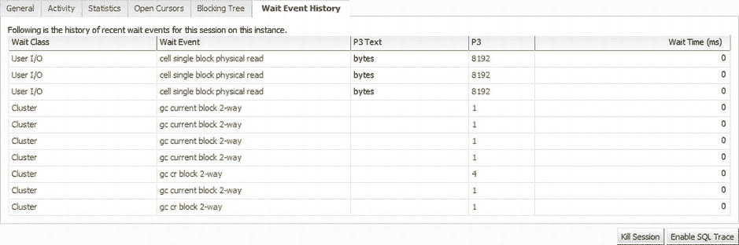

**图 9-26. 会话详情页面等待事件历史标签页中的等待信息**

### 并行 SQL 标签页

并行 SQL 标签页显示会话参与的任何并行执行信息的数据——包括会话是属于协调器还是从属进程，如果是从属进程，则属于并行进程的生产者还是消费者。

### SQL 监控标签页

SQL 监控标签页仅适用于 Oracle Database 11g Release 1 版本的命令行数据和 11g Release 2 版本的 HTML 格式报告。在未设置或不可用此功能的环境中，此标签页会显示为灰色。

## ASH 分析

在 EM12c 控制台的性能页面中，顶部活动区域为经验丰富的管理员（具有先前 Enterprise Manager 经验）提供了用户友好的界面，并提供了新的详细信息以协助解决会话和 SQL 性能问题。

ASH 分析是管理员们在 Enterprise Manager 顶部活动图表中一直未能找到的、用于跨多个维度分析性能的功能。ASH 分析的引入旨在以先前未提供的可视化格式提供活动会话历史数据。该功能提供递归向下钻取、堆叠图或树状图视图，以及将当前报告数据与其他 ASH 报告合并到协作视图中的能力。

> **注意**：ASH 分析默认不安装。必须安装 `ASH_VIEWER` 包才能使用 ASH 分析视图。数据库必须是 11g 版本或更高版本。安装在许多 10g 实例上可能会成功，但屏幕上不会显示数据，因为所需的活动会话历史记录将不可用以填充图表。

主要的 ASH 分析屏幕显示按平均活动会话 (AAS) 排列的数据，通过图表或负载图查看。在主要性能视图中存在大量向下钻取的机会，允许调查不同的研究领域。

ASH 分析主页的上部显示（如图 9-27 所示）可以更改为按小时、天、周或月显示数据。或者，您可以自定义显示以显示与监控任务更相关的数据。

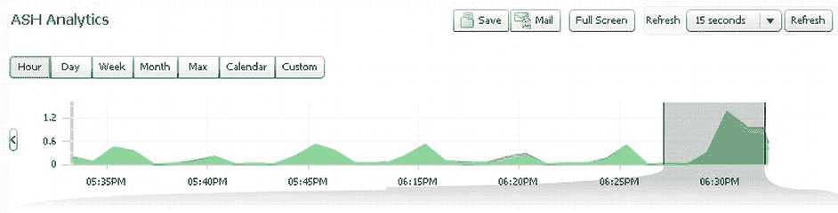

**图 9-27. ASH 分析主性能图表**

> **注意**：如果为 ASH 分析选择“最大值”显示类型，数据的显示方式将与其他等待事件类型通常的显示方式不同。请确保您了解选择“最大值”将如何影响图表和负载图中的数据分散情况，以免发生不准确的诊断。

能够将 ASH 分析数据本地保存到文件或通过电子邮件发送 HTML 报告是有价值的选项，如果您需要保留数据或向团队的关键成员提供信息。从主视图中，您还可以将窗口扩展到全屏并更改刷新间隔。时间线左右两侧的箭头使您能够轻松地导航到更早或更晚的时间线（如果刷新已停止）。

窗口中灰色高亮的部分（如图 9-27 所示）能快速吸引管理员的视线，进一步将 5 分钟的 ASH 数据样本详细描述到图表中，包括等待事件，并默认显示“等待类别”事件。


ASH Analytics 页面底部的活动窗格，如图 9-28 所示，其数据显示格式与"Top Activity"类似，但数据基于`V$ACTIVE_SESSION_HISTORY`视图，并且通过显示的链接可以访问更多性能数据。

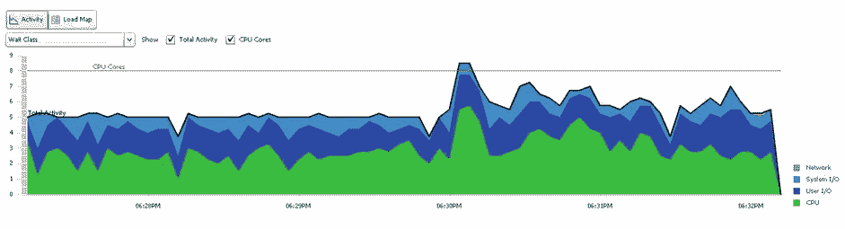

图 9-28. 用于 ASH Analytics 的活动窗格

左下角的`SQL ID`部分链接到 SQL 详情页面。右侧的用户会话部分链接到会话详情页面。下拉式等待类别选项非常广泛，如图 9-29 所示。

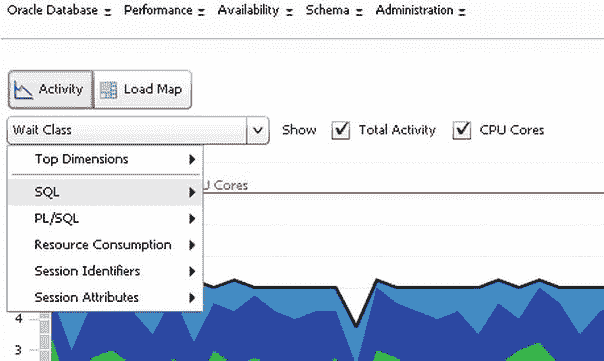

图 9-29. ASH Analytics 等待类别的下拉菜单选项

在 ASH Analytics 活动视图中，SQL 可以通过多种方式分解。选项如表 9-2 所示。根据管理员的需求，可以更改呈现顺序。

表 9-2. 等待类别选项及子选项

| 选项 | 子选项 |
| --- | --- |
| SQL | `SQL ID` `Top Level SQL ID` `SQL Force Matching Signature` `SQL Plan Hash Value` `SQL Plan Operation` `SQL Plan Operation Line` `SQL Opcode` `Top Level SQL Opcode` |
| PL/SQL | `PL/SQL` `Top Level PL/SQL` |
| 资源消耗 | `Wait Class` `Wait Event` `Object` `Blocking Session` |
| 会话标识符 | `Instance` `Service` `User Session` `Parallel Process` `User ID` `Program` `Session Type` |
| 会话属性 | `Consumer Group` `Module` `Action` |

这些选项中的每一个都提供了关于环境中等待和/或资源使用的独特视图。你可以选择最适合当前情况的组合，然后查看数据以调查问题。

你可以选择`Top Level SQL ID`，从而创建一个截然不同的数据库性能视图，并显示具有该 ID 的语句所带来的百分比影响。参见图 9-30。

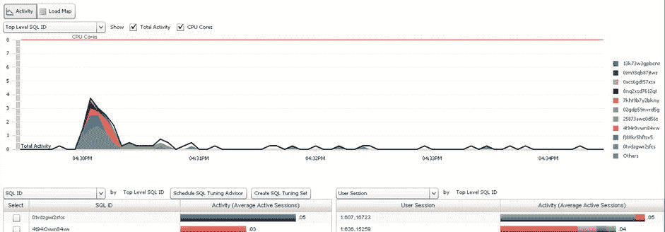

图 9-30. ASH Analytics 中的顶级`SQL ID`活动

在图 9-30 中，`SQL ID` `cwu5p1yyp1p40` 的影响百分比在图表中清晰展现，图表显示在整个时间线上，有两个用户会话正在执行该语句。这可以通过图表中标识该`SQL ID`和用户会话的关联颜色推断出来，但也可以通过点击每个用户会话链接进行验证，届时将显示与每个会话关联的`SQL ID` `okwk7211pw296`。

图 9-31 中的示例仍在图表中以黑线显示总体总活动量。每次调用的系统响应时间（包括两个 CPU 的使用情况）也显示出一个小的"波动"活动，这是因为 ASH 数据样本被汇总到了 AWR 中。

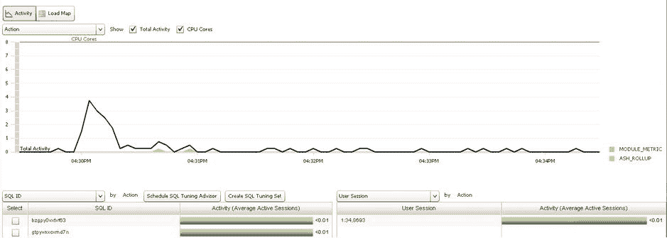

图 9-31. ASH Analytics，按`Action`绘图，显示系统响应时间、DB 等待时间和 ASH 汇总

### 负载地图

负载地图，如图 9-32 所示，是查看 ASH Analytics 数据的第二种选择。活动图表是大多数管理员凭借多年的企业管理器经验所熟悉的视图。负载地图是一种显示 ASH Analytics 中所有数据的新方法，但对于非管理员群体来说通常更为清晰。

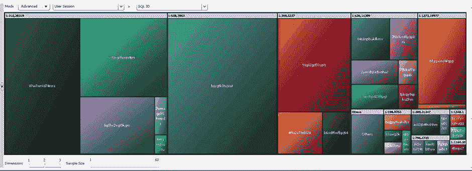

图 9-32. 一个显示`Wait Class`和`SQL ID`的 ASH Analytics 高级负载地图

 **提示**  负载地图视图对于熟悉并受过训练理解"Top Activity"显示数据的管理员来说，常常会被忽略。负载地图以更具视觉冲击力的方式显示性能数据。

图 9-32 中的负载地图显示`SQL ID` `csu5p1yyp1p40` 占环境中资源使用量的近 50%。对于非管理员来说，这种表示方式比相同数据的图形显示更能清晰地展示影响性能的 SQL，而图形显示很可能会产生误导。

然后，可以更改同一个负载地图以显示`SQL ID`，但这次是按用户会话排序。图 9-33 显示了与图 9-32 中相同的负载，但百分比首先按用户会话细分，然后在每个会话内按`SQL ID`细分。

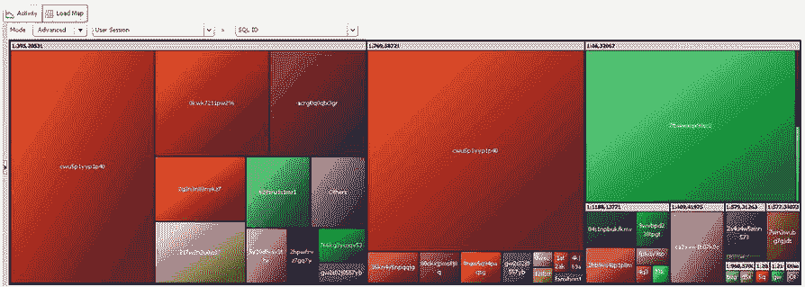

图 9-33. 一个按用户会话和`SQL ID`显示的 ASH Analytics 高级负载地图

同一个负载地图的维度可以调整，样本大小也可以更改（参见图 9-34）。

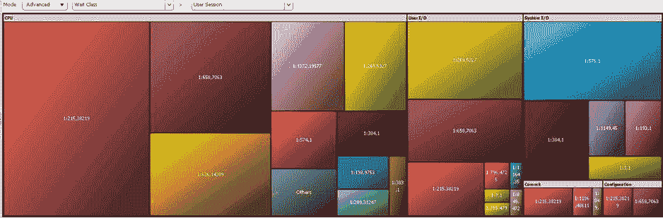

图 9-34. 一个维度和样本量减少的 ASH Analytics 负载地图

图 9-34 中的示例仅显示用户会话信息。如果使用高级负载地图设置并将样本限制为三个，你可以显示更小的样本信息子集。

然后，通过增加到三个维度，分别由`Wait Class`、`SQL ID`和`Client`构建每个维度，你可以创建一个负载地图，其中每个部分的标题显示`SQL ID`，附带客户端信息，然后是`Wait Class`指示器（参见图 9-35）。

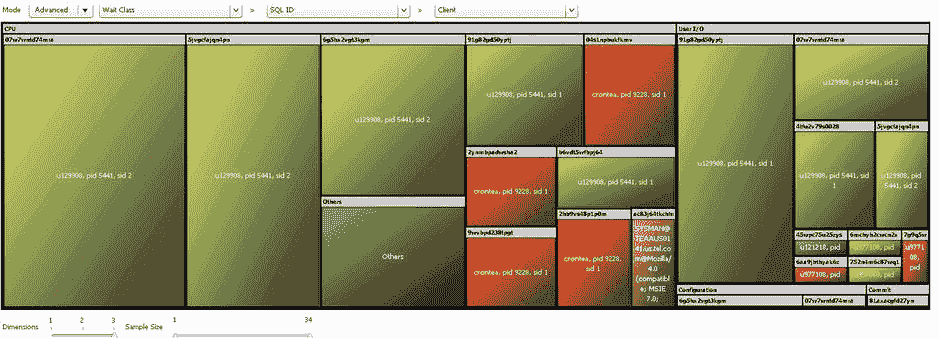

图 9-35. ASH Analytics，显示一个高级的三维负载地图

ASH Analytics 是"Top Activity"的未来。随着 Oracle 未来版本中对 ASH 的预期进步，ASH Analytics 将继续为 Oracle 数据库环境提供更增强的性能数据。

### SQL 监控

`SQL Monitor`在 Oracle 11g 中引入，被誉为最佳新特性之一。企业管理器中`SQL Monitor`的图形化显示为数据库中的会话数据提供了次要视图（参见图 9-36）。

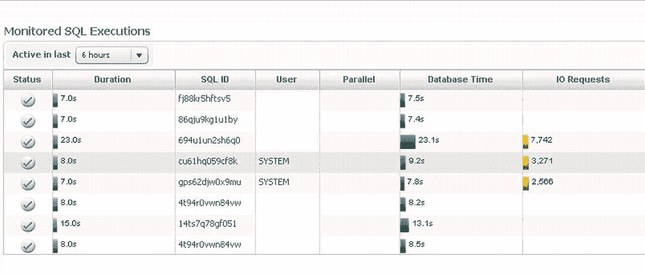

图 9-36. 正在`SQL Monitor`中执行的 SQL

数据按活动会话排序显示在顶部，其后是活动持续时间窗口、`SQL ID`、用户信息、数据库时间、I/O 等待信息、开始时间、结束时间和主监控视图中的 SQL 文本，如图 9-37 所示。该页面还提供了指向监控执行页面的`SQL ID`和用户会话链接。

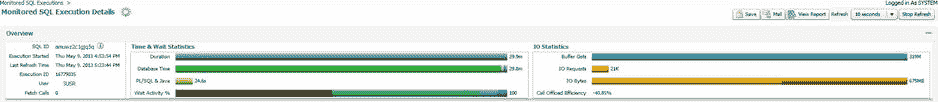

图 9-37. `SQL Monitor`的顶部部分，即受监控的 SQL 执行详情页面


