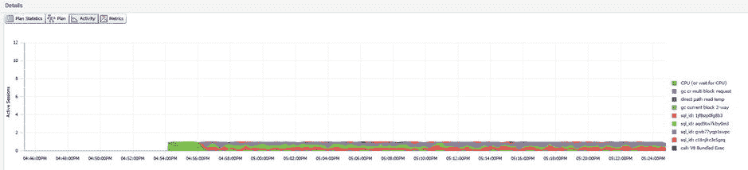
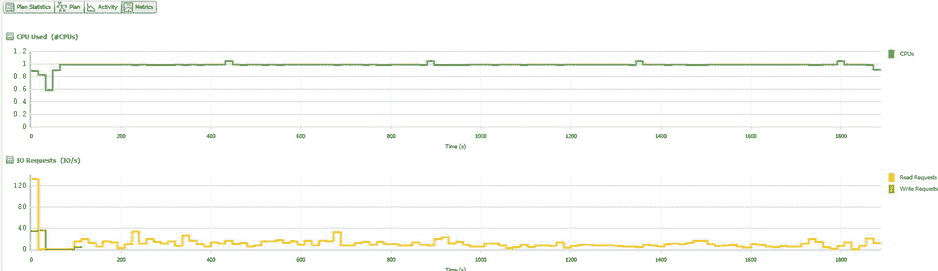
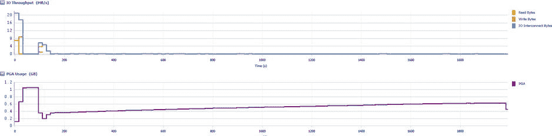
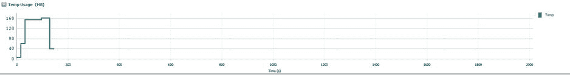

# SQL Monitor

 `提示` 如果有一个视图管理员应该考虑授予只读权限以监控数据库环境中的活动，那就是 SQL Monitor。这个视图极其易用，并能提供关于活动和性能的极其有价值的信息。SQL Monitor 视图可快速提醒开发人员或分析师可能出现异常的情况，这些情况在 EM12c 中不太可能升级为事件，但仍可能需要管理员的协助。在开发生命周期中，这能为数据库团队成员提供另一种方式，以可视化方式监控开发和测试阶段发生的情况。

虽然 Top Activity 和 ASH Analytics 共享 SQL ID 和用户会话的详细信息页面，但 SQL Monitor 仅与用户会话和 CPU 使用率共享会话详细信息。对于 SQL ID，SQL Monitor 拥有自己独立的性能页面，其数据基于 EM12c 控制台执行 `DBMS_SQLTUNE.REPORT_SQL_MONITOR` 来填充主 SQL 监控页面。

图 9-38 展示了当 EM12c 控制台执行 `report_level=>'ALL'` 时，该报告的图形化表示。同样可以通过命令行使用该软件包来执行此报告，但 EM12c SQL Monitor 界面能方便地以用户友好的格式填充和显示数据，方便管理员使用。

**图 9-38** SQL Monitor 为快照中涉及的 `SQL_IDs` 生成的“受监控 SQL 执行详细信息”报告的下方窗格

通过简单地单击左上角的“指标”按钮，可以调整视图以显示 SQL 特定的指标，如 图 9-39 所示。在调查有影响的 SQL 语句时，这些数据可能非常详细且有价值。

**图 9-39** 与图 9-37 中 SQL Monitor 报告同一报告时间的指标使用情况，显示了以字节为单位的 CPU 和 I/O 读写请求

图 9-39 显示了报告中 CPU 和 I/O 读写请求，而 图 9-40 则显示了 I/O 吞吐量和 PGA 使用率的结果。这些数据显示了语句的 CPU 使用率和 CPU 等待。通过获取这些数据并交叉比对高点/低点，你可以清晰地了解读写请求如何受到 CPU 使用率和 CPU 等待的影响。

**图 9-40** SQL Monitor 展示以字节为单位的读写 I/O 吞吐量

通过检查 I/O 吞吐量并将其与 PGA 进行比较，你还可以精确定位排序和哈希操作可能在 PGA 内发生的时间，以及它何时可能“交换”到临时空间（导致因临时表空间读/写而产生更高的 I/O）。

最后一部分如 图 9-41 所示，显示了特定的临时空间使用情况。对于 DSS 和 OLAP 环境，了解临时空间使用情况非常有帮助。SQL Monitor 在 SQL Monitor 详细报告中显示此信息。

**图 9-41** SQL Monitor 报告中的临时空间使用情况，以图表形式显示

使用这些特定的 SQL Monitor 图表可提供高级视图，详细展示了从 SQL 视角监控数据库活动之外的有价值使用领域。管理员可能需要查询一段时间内的任何这些领域或它们的组合，而 SQL Monitor 始终可用，并能清晰地绘制出每个领域的近期使用情况。

