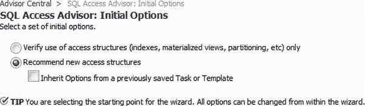
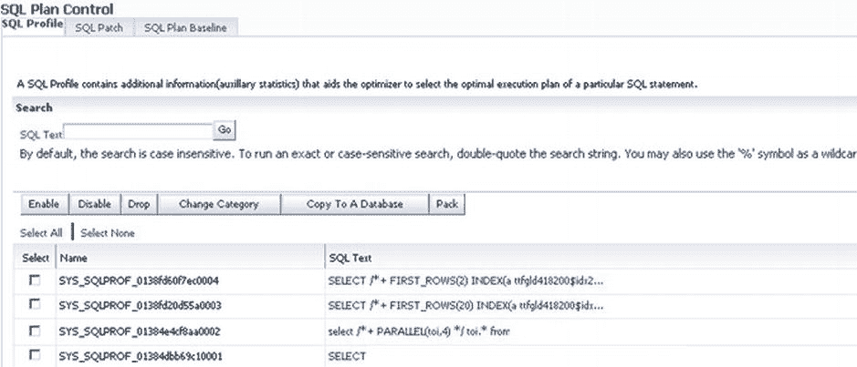

# SQL Performance

数据库目标主页中的 SQL 子菜单具有众多选项，包括：

*   SQL Performance Analyzer
*   SQL Access Advisor
*   SQL Tuning Advisor
*   SQL Tuning Sets
*   SQL Plan Control
*   Optimizer Statistics

## SQL Performance Analyzer

SQL Performance Analyzer 虽然可通过“性能”下拉菜单轻松访问，但它属于 EM12c Advisor Central 功能的一部分。该分析器提供了一个简单的向导来测试和分析数据库环境的变更将如何影响 SQL 调优集。

这使你能够在不影响用户的会话级环境中测试以下内容：

*   版本兼容性变更
*   参数变更
*   优化器统计信息
*   Exadata 模拟
*   引导式工作流

通过单击任何链接并完成向导，可以创建 SQL Performance Analyzer 任务。这些任务随后被安排为 EM12c 环境中的 EM 作业。你可以通过手动刷新界面视图，或者保持“查看数据”选项为其默认设置（使用 15 秒间隔）来检查状态。

## SQL Access Advisor

SQL Access Advisor 提供了一个图形界面，用于评估数据库中现有对象的效率，或推荐可能通过物理优化选项提高性能的新对象。图 9-42 显示了界面中可用的初始顾问选项。

**图 9-42** 针对数据库目标的 SQL Access Advisor 性能选项

SQL Access Advisor（可从“性能”下拉菜单访问，但属于 Advisor Central 功能）有两个选项。第一个选项检查当前对象，并根据系统中已有的内容提出建议。第二个选项检查历史 SQL，以推荐可能有助于提升性能的索引和物化视图。与任何顾问一样，在实施 SQL Access Advisor 的建议之前，你必须审查并验证它们。

## SQL Tuning Sets

*SQL 调优集* 是一组 SQL 语句的集合，可以通过执行模式、应用程序模块/操作或一组绑定变量、游标提取、执行次数、命令类型或优化器成本来进行绑定。

SQL 调优集可以迁移到其他数据库，允许管理员在其他环境上执行调优测试。生产性能问题可以迁移到二级测试环境，以复制遇到的问题并测试解决场景。

 `注意` 对于希望了解其数据库环境中使用情况和优化的管理员来说，理解 SQL 至关重要。SQL Tuning Advisor 和 SQL Access Advisor 利用 SQL 调优集来提供优化 Oracle 环境的最佳建议。

## SQL Plan Control

控制性能的另一个选项是创建和存储 SQL 计划。SQL 计划是 SQL 配置文件使用的功能之一，可以通过从数据库性能主页单击 `Performance -> SQL -> SQL Plan Control` 在 SQL 计划部分查看（参见 图 9-43）。

拥有一个统一视图来管理所有计划控制的好处在于，如果某个语句发生了变化，并且需要确认计划控制是否到位，DBA 可以轻松地从面板访问和验证，而无需去搜索 SQL ID。

**图 9-43** 作为 SQL 配置文件一部分创建的 SQL 计划

## Optimizer Statistics

