# Oracle 数据库统计信息与 EM12c 管理工具

统计信息是 Oracle 基于成本的优化器（CBO）的核心。随着管理员对性能和优化的知识加深，他们对统计信息的了解也必须相应增长。EM12c 提供了多个图形用户界面以降低对命令行的要求，但理解统计信息如何帮助 CBO 做出优化选择，是任何 Oracle 数据库专家技能组合的关键。

图形化的收集、恢复、锁定和管理统计信息的选项，是管理员手中的强大工具。在 EM12c 中，数据库目标的“性能”下拉菜单使您可以设置优化器统计信息的默认选项，并解决与 CBO 相关的性能问题（参见图 9-44）。

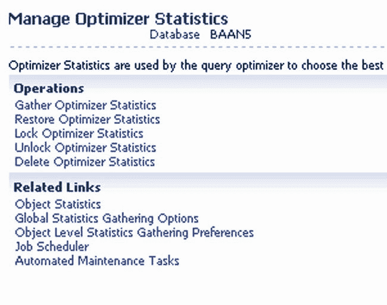

图 9-44. 在 EM12c 性能控制台中管理优化器统计信息

每个链接都访问管理数据库统计信息的不同区域。这包括操作任务。从下方区域，您可以访问对象级和全局级统计信息，以及进行计划和自动化。

### Cloud Control SQL 历史记录

与其他 SQL 历史不同，Cloud Control SQL 历史记录包含了 EM12c 为管理和监控数据库环境而执行的 SQL。该视图不仅提供`SQL_TEXT`，还提供开始时间、持续时间和 URL（参见图 9-45）。URL 非常有价值，因为它提供了足够的描述信息，告诉您是哪个 EM12c 功能执行了该 SQL。

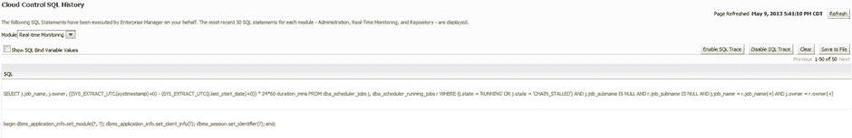

图 9-45. 来自 Cloud Control 的关于一条 SQL 语句的信息，该语句由 EM12c 中的 SQL Monitor 发出

如果您对性能有疑问或正在调查问题，还可以发出特定于 EM12c 操作的跟踪。您只需点击 Cloud Control SQL 历史记录界面右上角的按钮，即可启用或禁用跟踪。

 **注意** Cloud Control SQL 历史记录是一个弹出窗口，与 EM12c 环境中的大多数其他功能不同。要使此功能正常工作，您必须在 Enterprise Manager 中启用弹出窗口。

## Advisor Central

如图 9-46 所示的 Advisor 主页，是 EM12c 控制台中查看、调度和管理 Oracle 顾问的一站式位置。但是，您应该意识到，许多功能也可从数据库管理界面的“性能”下拉菜单中获得。

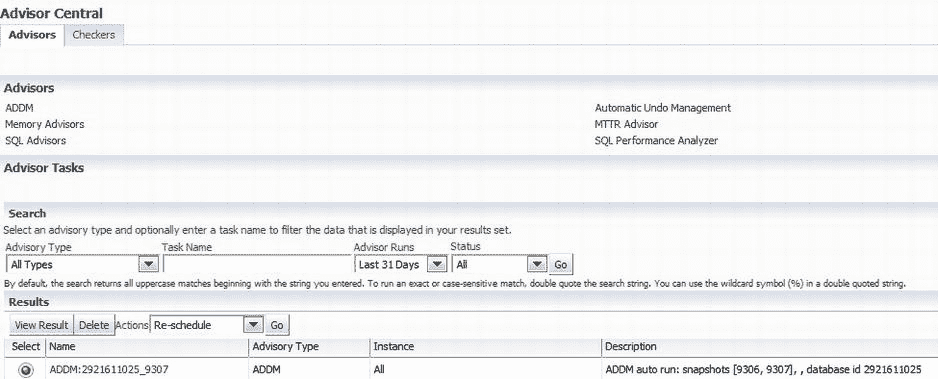

图 9-46. Advisor Central，显示了选项卡选项和主要可用的顾问

Advisor Central 采用双选项卡设置，默认为“Advisors”页面。此页面提供运行 ADDM 报告以及检查撤销管理性能、段顾问、SQL 顾问等的选项。

第二个选项卡“Checkers”提供了用于数据库完整性检查的各种选项（参见图 9-47）。

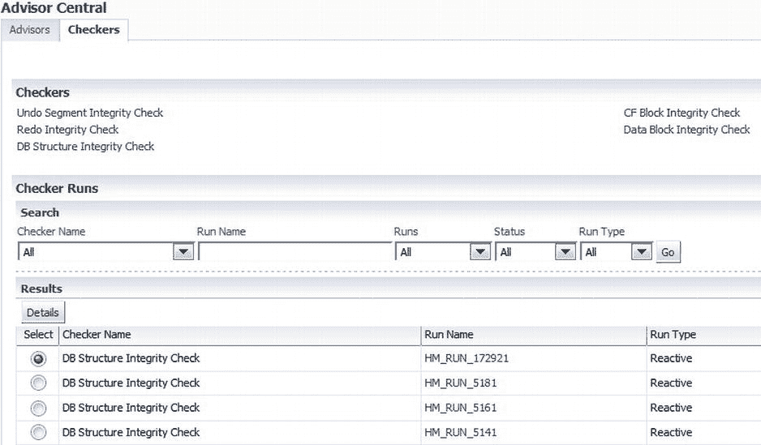

图 9-47. Advisor Central 的数据库完整性检查器选项

EM12c 控制台中每个数据库目标的“性能”部分，提供了对数据库的深入洞察，以及针对其长期健康的优化选项。

## 紧急监控

紧急监控使您能够监控无响应数据库的基本处理和数据库信息。这种专有机制可通过 EM12c 和 Enterprise Manager 命令行界面（`EMCLI`）使用，允许管理员诊断性能问题、进行挂起分析并终止阻塞会话。

紧急监控需要`SYSDBA`访问权限和 DB 主机访问权限，以便 Oracle 用户能够成功实施。

### 实时 ADDM

对于管理员来说，一个棘手的场景是数据库挂起。决定是否快速重启数据库（从而移除导致挂起情况的障碍，但通常会丢失所有用于诊断原因的宝贵数据）的难题，促使 Oracle 提供了实时 ADDM。

实时 ADDM 提供对缓慢或挂起的数据库系统的实时分析，并诊断死锁、性能影响和资源争用（参见表 9-3）。实时 ADDM 功能使用`DB Time`作为所有性能测量的基础。它还识别已发生的任何配置更改，权衡两组指标以进行报告和比较。

表 9-3. 可使用实时 ADDM 解决的不可访问监控问题

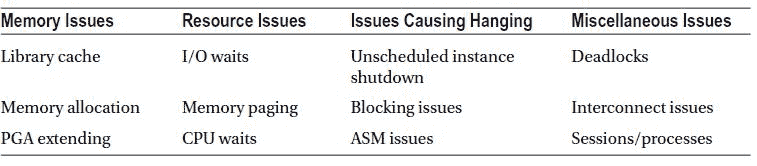

由于实时 ADDM 只建立轻量级连接（也称为到 SGA 的直接连接），通过绕过 SQL 层并通过代理连接，无需任何额外的锁定或资源，因此它能够完成传统连接类型无法实现的连接。

实时 ADDM 可以多种方式分析返回到数据库的数据，包括通过 SQL 层和 JDBC 连接。

当性能在一天或一小时内发生变化时，可以使用实时 ADDM 分析发生了哪些更改，并验证新的批处理作业、工作负载或配置更改。

实时 ADDM 可从任何 EM12c 数据库目标的“性能”下拉菜单中获得。图 9-48 显示了 ADDM 控制台的登录对话框。

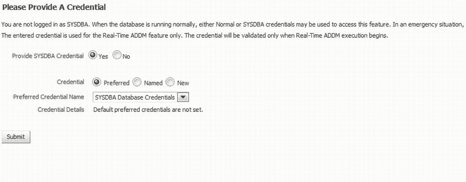

图 9-48. 登录实时 ADDM 控制台需要`SYSDBA`凭据

分析可以在单实例、RAC 环境，甚至是 Exadata 等工程化系统上执行。

如图 9-49 所示的“Top Activity”视图显示了大约 1 小时的数据，以及大约 10 分钟的先前 ASH 数据，因此您可以检查导致数据库挂起的问题。

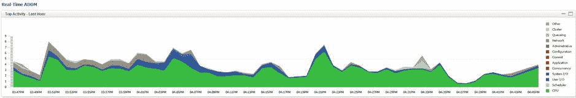

图 9-49. 通过实时 ADDM 的 Top Activity 视图

顶部部分看起来与 Top Activity 非常相似，但实际上来源于 ASH 数据。

要开始实时 ADDM 分析，您需要点击图 9-50 中所示的“Start”按钮。

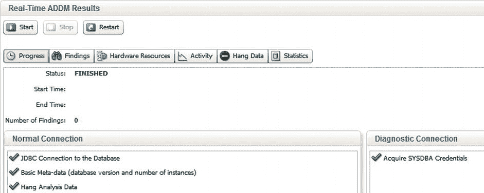

图 9-50. EM12c 的实时 ADDM 分析界面

如果数据库处于挂起状态，将显示状态，通知数据库无法接受连接。实时 ADDM 将继续验证凭据，提供要使用的连接选项，并执行挂起分析。

生成的报告显示在六个选项卡视图中，包括“Progress”选项卡、“General Findings”、“Hardware Resources”（详细说明发现的任何硬件问题）、“Activity”（提供数据库会话分析）、“Hang Data”（提供特定于数据库挂起原因的信息）以及“Statistics”（提供分析报告的详细信息）。

在实时 ADDM 界面的右上角，可以选择将结果以 HTML 格式保存或通过电子邮件发送。

### ADDM 比较报告

管理员经常面临两个时间段内性能存在差异的情况，而实际上不应该发生这种情况。执行两个 ADDM 报告的因果分析功能，可作为 ADDM 比较报告的一部分提供。

### ADDM 比较报告

通过选择 **Performance  AWR  Compare Period ADDM** 路径，可以为任何数据库目标获取 `ADDM` 比较报告。点击链接后，系统会要求您提交有关相关时间线开始和结束时间的信息（参见 图 9-51）。在下方区域，您可以从下拉选项中选择一个基础周期进行比较，选项包括前一个时间段、前一天或前一周。

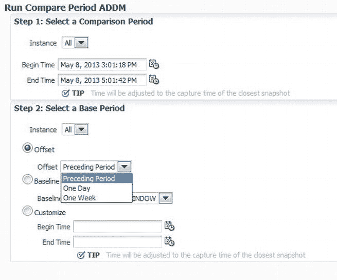

图 9-51. 为比较 `ADDM` 报告选择选项

 **注意**  `ADDM` 比较报告要求在目标上为 `EM12c` 代理用户安装 `PL/SQL` 包以执行比较报告，默认情况下未安装。此安装通过 `EM` 作业执行，可以立即实施或安排在以后的日期和时间执行。

在 图 9-52 的示例中，展示了选择比较 `ADDM` 报告时的选项。可以选择最新偏移量、基线或自定义的开始和结束时间。

图 9-52. `ADDM` 比较报告活动

在 **Below Detail for Selected 30 Minute Interval** 下，您可以定位在 **Top Activity** 图底部窗格中详细显示的部分。利用此信息，您可以单击 **Compare Period ADDM** 来识别关注时间线中任何不寻常的特定活动（参见 图 9-53）。

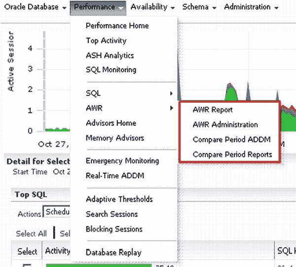

图 9-53. 在 `EM12c` 数据库目标界面中定位 `ADDM` 比较报告

选择与 图 9-52 场景匹配的时间线以获得问题的最清晰视图至关重要。

由于 **Top Activity** 从晚上 11:30 开始并持续 30 分钟，准确比较的适当选择是在 `ADDM` **Begin Time** 中也匹配此时间，并将 **End Time** 设置为 30 分钟后，导致结束时间“起始分钟”为晚上 11:59。

由于活动发生在星期六晚上，而目标是了解前一个小时发生了什么变化，我们将把它与前一个时段进行比较。

图 9-54 显示了 **Comparison ADDM Report** 字段的最终设置。

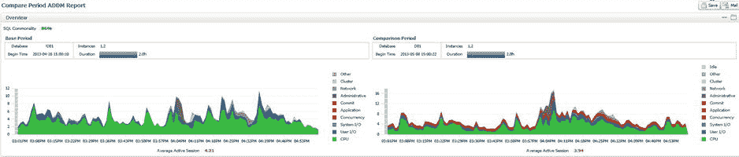

图 9-54. 比较时间线和基线

单击 **Run** 执行 `ADDM` 比较报告。报告首先指示两个时间线的共性（参见 图 9-55）。

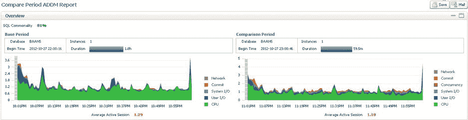

图 9-55. 一个 `ADDM` 比较报告，比较前一小时与使用率较高的一小时

请注意，比较的持续时间是整个 1 小时快照，即使输入的时间是半小时。如果快照间隔设置得比默认值（1 小时）更频繁，`ADDM` 比较将显示覆盖所选开始和结束时间所需的最少快照的结果。

检查图中左侧的值时，您必须注意，显示的平均会话数不是图之间的一对一表示，而是独立于每个会话，以最好地展示比较中使用的每个时段的数据。每个时段图在其右侧也有自己的等待事件类型图例。

每个图的底部清楚地显示了平均活动会话数，右上角的按钮可用于以 `HTML` 格式保存或通过电子邮件发送图表。

`ADDM` 比较报告底部区域的 **Details** 窗格分为三个部分：**Configuration**、**Finding** 和 **Resource**。

## Configuration

`ADDM` 比较报告的 **Configuration** 部分提供有关物理配置、参数设置和会话参数的信息，这些可能影响了所比较时段之间的差异（参见 图 9-56）。

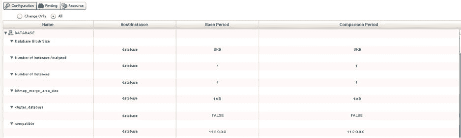

图 9-56. `ADDM` 比较报告的 **Configuration** 部分，设置为显示所有配置值

您可以只显示差异（默认）或显示所有配置值。如果需要检查所有配置值，这确实提供了对参数设置和会话值的快速审查。

## Finding

**Finding** 部分展示了每个 **Performance Difference** 类型、影响百分比，然后是它为每个基础时段创建的影响百分比（参见 图 9-57）。由于这些值在一个时段可能为正，在另一个时段可能为负，您应注意变更影响的总计，并确保清楚地理解比较时段的变更影响，以防问题是随多个时间段升级的。如果确实发生了升级，变更影响百分比可能会产生误导，应考虑在更长时间段内对环境的整体影响。

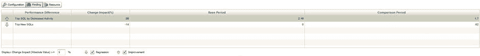

图 9-57. `ADDM` 比较报告的发现，显示了比较两个时段之间性能的改进和下降

对于每个 **Performance Difference**，详细信息显示在 **Details** 窗格下方。由于在 **Top Segments by User I/O** 中发现了性能回归，因此产生了以下发现：

*   发现了负责显著 `User I/O` 和 `Cluster` 等待的单个数据库段。
*   影响从 0.04 个活动会话变为 0.1 个活动会话，变化为 –5%。

## Resource

**Resource** 详细报告了 `CPU`、内存、`I/O` 和互连（如果涉及 `RAC`）方面的差异。这些数据可以以图形形式表示，如 图 9-58 所示，也可以以表格报告形式表示，如 图 9-59 所示。

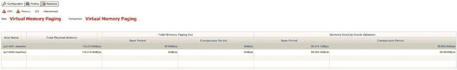

图 9-58. 比较报告中两个 `ADDM` 时间线之间内存差异详细数据的表格表示

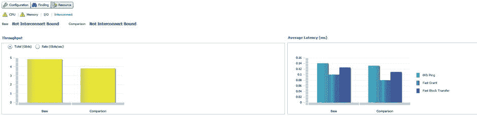

图 9-59. 比较报告中两个 `ADDM` 时间线之间 `I/O` 差异详细数据的图形表示

借助这些详细数据，您可以快速评估出内存使用量跃升了 75%，并且比较中使用的两个时间线之间的数据文件单块读取延迟存在显著差异。

与 `EM12c` 界面中的其他报告一样，可以选择保存或通过电子邮件发送 `HTML` 报告以供日后审查或保留作为历史参考。

## Summary

随着自动化和优化数据库及其环境需求的增加，`Enterprise Manager 12c` 性能控制台的重要性也将随之提高。**Top Activity** 将逐渐迁移到 **ASH Analytics**，其具有强大、透明和有效的报告功能。从一个简单高效的图形界面收集数据并提供有效的优化建议和监控的机会，为企业级数据库控制指明了明确的方向。

