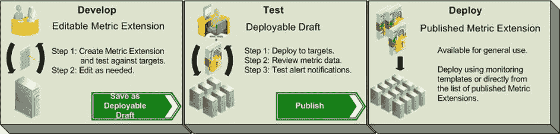
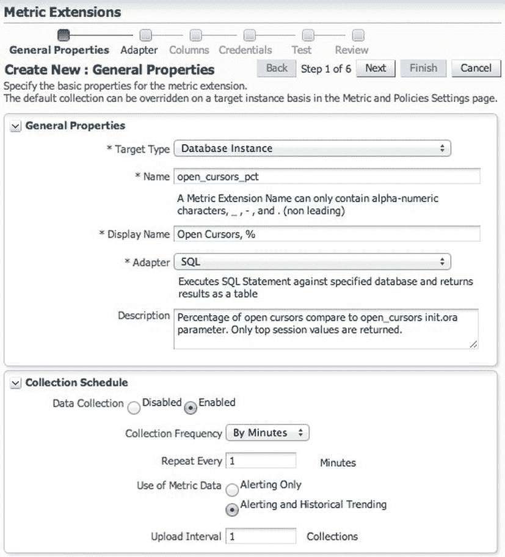
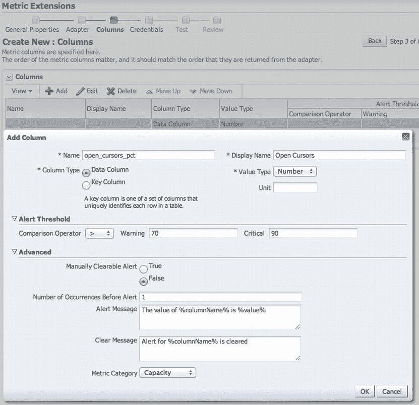
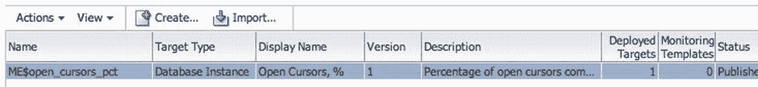
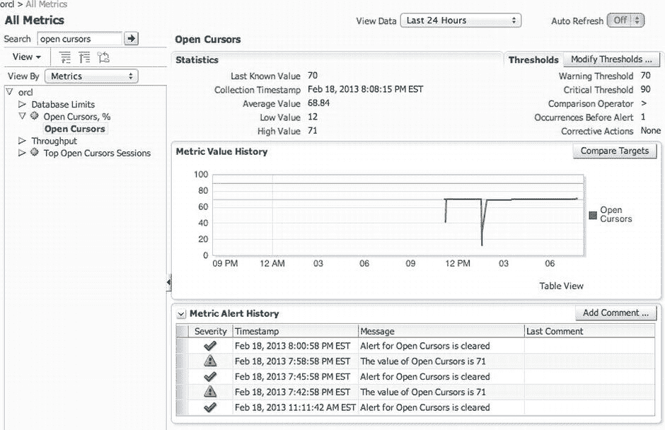
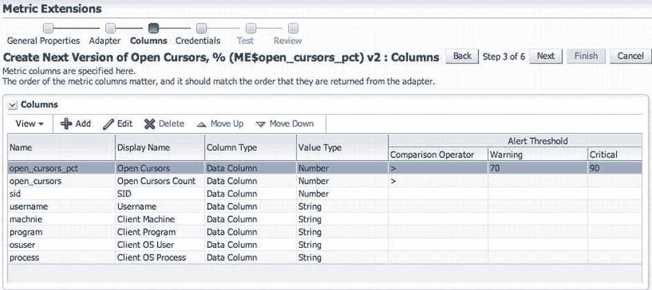
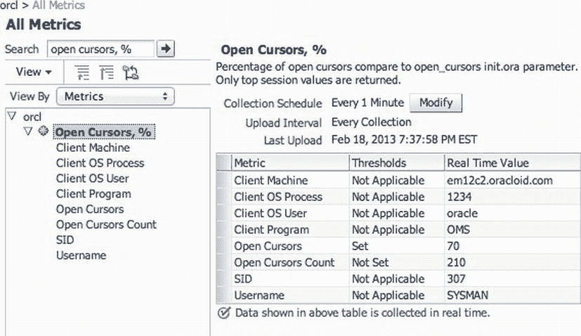
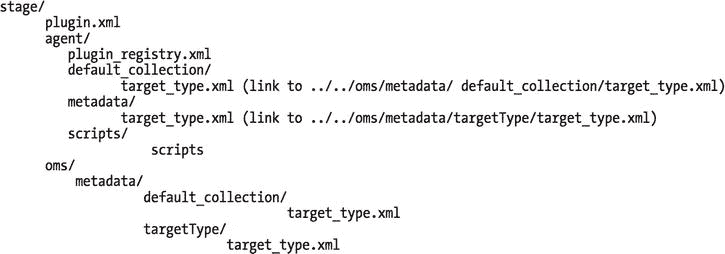

# Oracle Enterprise Manager Cloud Control 12c 扩展性指南

## 概述

Oracle Enterprise Manager (OEM) 的 10g 和 11g 版本引入了一些基础功能，旨在帮助该产品成为一个企业级可管理性和监控框架。然而，OEM 首先是一个为 Oracle 产品构建的可管理性工具，其部分功能扩展了对其他非开箱即用目标类型的支持能力。Oracle Enterprise Manager Cloud Control 12c 已被彻底重新架构，其首要定位是一个企业级可管理性框架。几乎所有针对特定 Oracle 及第三方产品的管理和监控功能，都是作为插件构建在该框架之上。

就像之前版本的 OEM 一样，EM12c 为用户和产品供应商提供了两种基本方式来扩展其能力。本章第一部分介绍最简单的方式：*度量扩展* (Metric Extensions)。第二部分涵盖管理插件开发的基础知识以及一些高级功能。

我建议您在阅读本章时尝试动手操作示例，并备好 EM12c 可扩展性文档作为参考。全面覆盖该主题需要单独一本书，而本章更像是对扩展 EM12c 的一个介绍。

然而，即使您不打算自己开发插件，也不要跳过本章。了解 EM12c 的内部机制将帮助您更好地理解其工作原理。最终，这将使您更高效，并发现该环境更直观易用。

## 度量扩展

EM12c 中的*度量扩展*取代了最初在 OEM 10g 中引入、现已于 12c 中弃用的用户定义度量 (User-Defined Metrics, UDMs)。与 UDMs 相比，度量扩展在数据收集方面提供了更大的灵活性，并且更易于大规模部署和管理。

正如您现在应该已经了解的，每个受监控目标都附带一组由插件创建者（可能是 Oracle 或第三方供应商）设计的预定义度量。例如，主机目标收集 CPU 利用率度量，Oracle Database 目标收集物理 IO 度量等。通常这些度量已足够，但有时您可能希望收集比开箱即用更多的度量，以监控特定于您的环境或应用程序的状况。

度量扩展由部署在其所在主机上的代理运行。虽然您是通过 OMS 集中创建和管理度量扩展，但它们需要分发到监控已部署度量扩展的目标的代理上。一旦度量扩展部署到某个代理的第一个目标上，该分发过程就会自动完成。

与旧式的 UDMs 相比，度量扩展的开发生命周期稍微复杂一些，但这正是度量扩展在多用户环境中更易于大规模管理的原因。要访问度量扩展主页，请选择 **Enterprise** → **Monitoring** → **Metric Extensions**。在那里，您将看到度量扩展开发生命周期的快速概览，如图 10-1 所示。



*图 10-1. 度量扩展开发生命周期*

## 您的第一个度量扩展

让我们创建一个示例度量，以便您了解实际过程。假设您需要监控数据库中的会话接近其每会话最大打开游标数的程度。该最大值由 `open_cursors` init.ora 参数控制。您可以使用清单 10-1 中的查询，返回相对于定义最大值的打开游标百分比。

***清单 10-1***. 用于打开游标度量扩展的 SQL

```sql
SELECT ROUND (c.open_cursors / p.value * 100) open_cursors_pct
  FROM (SELECT   sid, COUNT (*) open_cursors
            FROM v$open_cursor
        GROUP BY sid
        ORDER BY 2 DESC) c,
       v$parameter p
 WHERE p.name = 'open_cursors' AND ROWNUM = 1
```

### 创建新的度量扩展

要创建此度量，请单击度量扩展主页上可用度量扩展列表上方的 `Create` 按钮。如果该按钮呈灰色且不可点击，说明您没有创建新度量扩展的权限。您需要由 EM 超级管理员授予 `Create Metric Extension` 权限。此权限在资源特权屏幕的 `Metric Extensions Resource` 行中，在创建或编辑 EM 用户时分配。只有一个相关权限：`Create Metric Extension`。此权限允许您创建和导入新的度量扩展。

单击 `Create` 按钮后，新的度量扩展向导将会出现。图 10-2 显示了该向导的“常规属性”选项卡。



*图 10-2. open_cursors_pct 度量扩展的常规属性*

将“目标类型”选项设置为 `Database Instance`，以便该度量可以部署在单实例数据库以及 RAC 数据库的每个实例上。如果您要从真实表中选择度量或监控全局条件（例如队列表中的消息数量），您应将“目标类型”设置为 `Cluster Database` 而不是每个 RAC 数据库实例。将“名称”属性设置为 `open_cursors_pct`。这是 EM 内部使用的名称，如果您以后需要从存储库中提取信息（例如为自定义报告编写 SQL 语句），将会用到它。选择 `SQL` 作为适配器，并选择 1 分钟的采集间隔和 1 的上传间隔（表示每次采集后上传）。我建议您谨慎选择采集间隔，避免采集度量的频率高于 5-15 分钟。您应该仅将少数需要快速通知的关键度量的间隔设置为低于 5 分钟。否则，您将对代理和 EM 框架的其余部分引入显著的额外开销，以处理和存储过量的数据。在测试和开发期间（如本示例）使用 1 分钟的采集间隔是可以的，以避免等待度量历史记录出现的时间过长。在“适配器”选项卡上，将清单 10-1 中的 SQL 文本复制到“基本属性”部分的“SQL 查询”字段中。在此示例中，您不会使用任何高级属性或上传文件。

接下来是“列”选项卡。向度量添加一个列，并根据图 10-3 进行定义。



*图 10-3. 度量扩展列*

在“警报阈值”部分，选择大于号 (`>`) 比较运算符。将警告和严重状况的默认阈值分别设置为 70% 和 90%。在高级选项中，您可以编辑触发警报前的发生次数，以及创建自定义消息。您还可以将度量分配到预定义的类别之一，然后 EM12c 控制台会将您的度量与其他类似度量进行分组。

在“凭证”选项卡上，保留“使用默认监视凭证”。现在，您已准备好测试您的度量。


## 测试度量扩展

在**测试**选项卡中，添加一个或多个数据库（请记住，如果您不是超级管理员用户，您应该对这些数据库拥有**查看**权限）。然后点击**运行测试**按钮。您应该会看到收集进度对话框短暂出现（除非您选择了许多数据库实例），随后收集结果将被显示。如果没有错误信息且结果符合预期，您就可以继续在**审查**选项卡上完成操作。

如果您点击**完成**按钮后度量扩展创建成功，您将在**度量扩展**主页上看到它，其状态为`可编辑`。您还会看到此度量扩展的版本为`1`。在`可编辑`状态下编辑度量扩展不会增加版本号。您可以多次检查和编辑您的度量扩展，直到在实时测试对话框中按预期完成收集工作。

如果初稿运行符合预期，下一步就是在真实目标上执行测试运行。在将度量部署到目标之前，必须先将其保存为可部署的草稿。选择您的度量，然后从度量扩展表格上方的**操作**菜单中选择**另存为可部署草稿**。度量的状态将变为`可部署草稿`。在此阶段，度量仅对您（其所有者）可见，除非您通过**操作** -> **管理访问权限**明确授予其他用户或角色权限。另请注意，除非您创建新版本（稍后将进行），否则无法编辑处于`可部署草稿`状态的度量扩展。

为确保您的度量扩展按预期运行，让我们将其部署到一些目标。这通过选择**操作** -> **部署到目标**来完成。选择目标并提交部署作业后，度量扩展将在后台运行。所有部署作业都是异步操作，在`EM12c`中作为作业调度。在少数目标上部署度量扩展通常非常快，因此您可以点击右上角的刷新图标，如果作业从待处理部署列表中消失，并且没有出现在屏幕下半部分的失败部署列表中，则表示部署成功。您还可以从**度量扩展**主页查看部署进度，该主页指示待处理和失败部署的总数，以及库中每个度量扩展的已部署目标数量，如图 10-4 所示。



图 10-4. 显示部署状态的`度量扩展`主页

现在度量扩展已经部署，您可以像使用`数据库实例`目标类型附带的任何其他开箱即用的度量一样使用它。收集几个小时后，您可能会看到类似于图 10-5 中的数据。要进入此屏幕，您需要导航到已部署度量的目标，然后从目标的菜单中选择**Oracle Database** -> **监控** -> **所有度量**。请注意，与用户定义的度量不同，度量扩展没有自己的视图。



图 10-5. 度量扩展详细信息和历史记录

## 发布度量扩展

当您的度量按预期工作时，您就可以发布它，以便任何`EM`用户都可以部署该度量扩展。请注意，处于`可部署草稿`状态的已部署度量扩展对所有可以查看该目标的用户都是可见的。他们甚至可以编辑度量设置，就像对任何其他度量一样。发布度量扩展只是提供了将此度量扩展（或更准确地说，此特定版本的度量扩展）部署到其他目标的能力。

您可以从**度量扩展**主页通过选择**操作** -> **发布度量扩展**来发布度量扩展。状态变为`已发布`，并且该度量扩展对任何`EM`用户可用。请注意，`已发布`度量也可以包含在**监控模板**中，这是与`可部署草稿`状态的另一个重要区别。

现在假设度量运行良好，但一段时间后，您意识到拥有关于会话的额外信息会很有帮助。您希望看到打开的游标的最高数量，而不仅仅是打开游标计数接近限制的程度。在度量本身中拥有`SID`、`用户名`、`客户端机器`、`客户端操作系统用户`和`客户端程序`信息将极大地帮助您对新度量扩展生成的警报进行故障排除。

## 创建度量扩展的新版本

让我们改进您刚刚创建的度量扩展。从**度量扩展**主页中，选择当前版本并选择**操作** -> **创建下一版本**。然后更改反映描述中更改的常规属性。

在**适配器**选项卡上，用清单 10-2 中的`SQL`替换旧的`SQL`，该`SQL`收集有关具有最多打开游标的会话的信息。

清单 10-2. 用于打开游标的度量扩展的修改后`SQL`

```sql
SELECT ROUND (c.open_cursors / p.value * 100) open_cursors_pct,
       c.open_cursors, c.sid, s.username, s.machine,
       s.program, s.osuser, s.process
  FROM (select * from (SELECT   sid, COUNT (*) open_cursors
            FROM v$open_cursor
        GROUP BY sid
        ORDER BY COUNT (*) DESC)
        WHERE ROWNUM = 1) c,
       v$parameter p, v$session s
 WHERE p.name = 'open_cursors'
   AND s.sid = c.sid
```

在**列**选项卡上，您需要添加新列。请注意，您仅在`open_cursors`列上设置了比较运算符，以防有人想使用绝对游标计数作为阈值。其他列不能设置任何警告或严重状况，因为它们仅用于提供信息。参见图 10-6。



图 10-6. 修改后的打开游标度量扩展的列列表

现在测试您的度量扩展。如果一切正常且度量收集工作正常，请完成其创建。您将看到同一个度量扩展的下一个版本，版本号为`2`，出现在**度量扩展**主页上。您现在可以将版本`2`另存为`可部署草稿`并部署它以验证其是否按预期工作。如果该目标上已部署了先前版本的度量扩展，它将被升级。最后一步是发布最新版本，以便所有`EM12c`用户都可以使用它。

当发布度量扩展的更新版本时，可以从显示目标部署的屏幕完成旧部署的升级。您可以从**度量扩展**主页访问此屏幕：点击先前版本度量扩展的已部署目标数量链接，然后点击**部署**按钮（首先选择要升级的所有目标）。完成后，您将在此度量中看到更多列。新的度量扩展收集结果将类似于图 10-7。




图 10-7. 修改后的开放游标指标扩展

请注意，你可能希望获取到的不仅仅是单个具有开放游标的顶级会话——也许是前十个。为此，你需要将你的指标扩展转换为多行指标，这需要将一个或多个列作为键列。在这种情况下，你可以使用 `SID` 列作为键，然后修改查询以返回前十个会话。遗憾的是，在指标扩展的下一个版本中，你将无法添加键列，而是需要创建一个新的指标扩展。幸运的是，通过在指标扩展主页使用 `操作`  `类似创建`，可以轻松克隆现有的指标扩展。请注意，创建新的指标扩展版本还有其他限制——例如，你不能移除或更改旧列的顺序，但可以更改显示名称。

尽管 `SID`（以及可以说 `SERIAL#`）对于键列来说已经足够，但请考虑在键中添加其他列。这样，告警通知就可以包含键值。默认的告警消息（在编辑指标扩展列时的高级设置中查看）如下所示：

*   %columnName% 的值对于 %keyValue% 来说是 %value%

键值将由所有键通过逗号连接生成一个字符串，因此你的告警消息将如下所示：

*   对于会话 260,SYSMAN,em12c2.oracloid.com,OMS,oracle,1234，open_cursors_pct 的值是 72

你可以修改告警消息，使其更具描述性。例如，你的告警消息模板可以是这样的：

*   会话 %keyValue%（SID，用户名，机器，程序，操作系统用户，进程）的开放游标百分比为 %value%

从这条告警消息中，你立即就能看出哪些会话是问题所在。遗憾的是，目前无法引用指标的特定键列来使告警消息更用户友好。至少，我还没有找到方法。

到目前为止，你使用的是 SQL 适配器来收集指标。从 `12.1.0.2.0` 版本的 EM 开始，指标扩展提供了六个有文档记载的适配器，以及一个未记载的适配器。尽管你很可能主要会使用两个适配器（SQL 适配器和 OS 命令—多列适配器），但为了获得更完整的概览，让我们回顾一下所有可用的适配器。

### SQL 适配器

SQL 适配器是你在前面的例子中使用的那个。因为你已经熟悉了它的基本功能，我们就只回顾一下它的附加选项。

如果你的 SQL 语句太长，你可能会倾向于上传一个 SQL 文件，而不是内联指定 SQL 代码。上传的 SQL 文件会随你的指标扩展一起分发到收集指标的代理上，然后由这些代理运行文件中的 SQL。

如果你正在选择一组预定义的名称-值测量，你可以使用转置的结果，而不是创建一个两列的指标（名称作为键列，值作为数据列）。例如，假设你想使用代码清单 10-3 中的查询来收集四个指标。你需要将第一列创建为键列。然而，你将无法控制列的命名，告警消息也只能是泛泛的。

***代码清单 10-3***. 用于收集物理读和写的 SQL 语句

```sql
select name, value
  from v$sysstat
 where name in ('physical read total IO requests',
                'physical read total bytes',
                'physical write total IO requests',
                'physical write total bytes')
 order by name;

NAME                                  VALUE
------------------------------------- -----------
physical read total IO requests       2285653
physical read total bytes             21313147392
physical write total IO requests      1245633
physical write total bytes            27849077248
```

注意，添加了 `ORDER BY` 子句是为了确保结果总是按相同顺序排列（在此例中，与 `IN` 列表中的顺序一致）。现在你只需要创建四个数据列，并且可以指定更具描述性的名称，比如*总物理读请求数*，以及自定义告警消息：

*   总物理读请求数过高 - %value%（警告阈值为 %warning_threshold%，严重阈值为 %critical_threshold%）

如本例所示，你可以在告警消息中包含阈值。

你也可以在 SQL 文本中指定绑定变量，而不是字面量。然而，这仅在你能动态生成变量值时才真正有用，而指标扩展在这方面并未提供太多灵活性（除了预定义变量，但它们作为 SQL 参数并不十分有用）。如果你最终遇到这种情况，最好重新设计并通过使用额外的键列将这些指标扩展合并成一个。但是，如果你有多个使用相同 SQL 但不同字面量的指标扩展，那么绑定变量就是可行的方法。

也可以使用返回游标（这正是高级属性中 `Out` 参数的用途）的 `PL/SQL` 块，而不是简单的 SQL。如果你需要使用动态 SQL 或根据某些条件（例如 Oracle 数据库版本或你提取数据的应用程序版本）以不同方式执行指标收集，这会很有用。

最后一个例子也展示了指标扩展的一个重要限制：当处理需要基于先前多次收集进行额外处理的数据时（例如本例中使用的累积计数器），它们不是很有用。我们真正感兴趣的并不是数据库实例启动以来的 `IO` 请求总数，而是收集周期内的平均 `IO` 请求次数。尽管公式会非常简单（两个收集值之差除以收集间隔），但指标扩展没有提供计算此类比率的方法。当然，你可以使用 `PL/SQL` 块来存储先前收集的计数器并计算每个间隔的比率，但这并不简单，并且当你的测量实际上导致了数据库的变化时，会引入更显著的测量侵入。

无论你为指标扩展使用什么适配器，累积计数器的这个限制都存在。到目前为止，我们一直关注 SQL 适配器，但现在让我们看看其他选项。

### OS 命令适配器

有三种 OS 命令适配器，你可能比 SQL 适配器使用得更频繁。OS 命令适配器之间的区别仅在于它们是否可以收集多列和多行：

*   OS 命令—多列
*   OS 命令—单列
*   OS 命令—多值

所有三种 OS 命令适配器都有三个基本属性：`命令`、`脚本` 和 `参数`。代理基本上是执行命令行，连接这三个属性。事实上，你可以在单个 `命令` 属性中指定它们全部，所以我们不确定为什么要用三个属性，除了使属性更具可读性。你可以上传脚本（甚至多个脚本、程序和其他所需文件），然后在任何属性中使用 `%scriptsDir%` 替换变量来引用上传文件的位置——例如，`Script` 属性的 `%scriptsDir%/myscript.sh`。

我强烈建议使用 Perl 脚本来确保你的指标扩展是平台无关的。每个 Oracle Management Agent 都附带相同版本的 Perl，因此你不会依赖于服务器上安装了哪个 Perl 版本（如果有的话）。只需在命令属性中使用 `%perlBin%/Perl`，它将自动替换为 Oracle Management Agent 附带的 Perl 二进制文件的位置（通常是 `<AGENT_HOME>Perl/bin/Perl`）。


除了在命令行上传递参数外，还有几种其他方法。当你希望避免过长的命令行、避免处理与平台相关的不同转义规则，或者需要传递敏感信息（例如凭据）时（因为命令行参数在许多平台上很容易被任何用户看到），这些方法非常有用。传递参数的一种方法是使用环境变量。代理在调用操作系统命令之前设置环境变量，程序或脚本可以在执行过程中读取该变量。一种更好的传递参数方式是使用标准输入，然后由程序解析。Oracle 将这种机制称为 `输入属性`。后者是将凭据传递给脚本的最安全方式，因为在某些平台上，即使是进程的环境变量也可以轻松检索。

**注意** 有关环境变量和输入属性的更多详细信息，请参阅 `Oracle Enterprise Manager Cloud Control 12c 管理员指南`（第 8 章，“指标扩展”，第 8.4 节）。

## 操作系统命令适配器的凭据

操作系统命令适配器有两套凭据：主机凭据和输入凭据。`主机凭据` 用于登录运行目标类型代理的服务器。默认情况下，操作系统命令适配器使用默认监控凭据——即用于收集目标预定义指标的凭据。但是，你可以选择创建自己的主机凭据集，然后为计划部署指标扩展的目标设置凭据。例如，你可能需要以特定的操作系统用户（例如 `ROOT` 或运行代理本身之外的其他应用程序用户）身份运行收集脚本。请注意，SQL 适配器具有相同的功能，因此你可以定义自定义数据库凭据集，以与默认监控用户（例如 `DBSNMP`）不同的数据库用户身份运行。

输入凭据是第二种可以定义的凭据类型。这些凭据完全独立于主机凭据，并使用标准输入传递给正在执行的程序或脚本，就像 `输入属性` 一样。`输入凭据` 的优势在于，你可以独立于指标扩展定义来设置它们。如果不同的目标需要不同的凭据，指标扩展的用户可以轻松定义凭据，而无需创建具有各种硬编码密码的唯一指标扩展——这正是如果使用 `输入属性` 传递凭据时你需要做的。

**注意** 使用 `输入凭据` 的示例可以在 `Oracle Enterprise Manager Cloud Control 12c 管理员指南`（第 8 章，“指标扩展”，第 8.4.1 节）中看到。

## 操作系统命令—多列适配器

现在让我们逐一看看操作系统命令适配器。

操作系统命令—多列适配器可能是你最常使用的。命令的输出由适配器解析，使得每一行成为单个行，然后每一行本身被标记化为多个值。无论行尾是以类 Unix 格式（单个 `LF`）还是 Windows 格式（`CR+LF`）标记，适配器都能正确分割行。

该适配器允许使用“以...开始”前缀来过滤掉输出中不包含指标的行。这是一种良好的实践，可以防止潜在的输出噪声干扰——例如，未预期或你只想忽略的警告。广泛接受的前缀标准是 `em_result=`。清单 10-4 显示了一个输出示例。

***清单 10-4***. 使用 `em_result=` 前缀的操作系统命令的示例输出

```
em_result=<指标行 1>
此行被忽略
em_result=<指标行 2>
如果 em_result= 不在行首，它也会被忽略
em_result=<指标行 3>
```

请注意，前缀中的前导和尾随空格是有效的，不会被截断。

### 处理分隔符和空格

前缀之后的行内容随后使用一个简单的分隔符字符串被标记化为多个列。默认（且常用）的分隔符是管道符号（`|`）。但是，如果你的列内容可能包含该字符，你可以使用任何其他分隔符，甚至可以使用多字符字符串使其真正唯一，例如 `{=-DELIMITER-=}`，这样像下面这样的行就会被正确解析为三个值：

```
em_result=一些常见的分隔符有 | , % ;{=-DELIMITER-=}123{=-DELIMITER-=}456
```

空格在分隔符字符串中具有特殊含义。首先，前导和尾随空格会被截断并忽略。其余的空格似乎会将分隔符字符串拆分为多个分隔符，但它们的应用非常不一致，因此很难预测最终结果。我曾尝试创建一个分隔符来解析以逗号分隔值、并可能用双引号括起来的行，但未能想出一个可靠的分隔符字符串。我怀疑代码可能原本就不是用来处理分隔符中的空格的。文档没有提及如何处理空格，而且它们的处理似乎不可靠，因此我强烈建议此时避免在分隔符字符串中使用空格。

关于空格的最后一点说明：收集到的值中的空格在存储到存储库时不会被截断。但是，EM 用户界面在显示它们时会截断前导和尾随空格。如果你在文本列上设置诸如 `CONTAINS` 之类的条件，那么前导和尾随空格在条件字符串和收集到的指标值中都是重要的，请注意。我建议尽可能避免前导和尾随空格，因为你在用户界面中看不到它们，但它们确实存在。（只需检查存储库视图 `MGMT$METRIC_CURRENT`，例如。）

### 数据列与键列

在定义适配器时，你需要定义命名列及其属性。你已经看过了前面的例子，所以我们只简要说明数据列和键列之间的区别。

`数据列` 实际上是你要收集的指标值。例如，你可能希望监视暂存目录的大小，文件被加载到该目录中以便后续处理。该目录中文件的总大小是你想要计算的指标——这将是一个数据列。你可能还想计算暂存目录中的文件总数——这是另一个数据列。对于这些数据列中的每一个，你可能都想定义一个比较运算符。在这种情况下，你很可能希望选择大于（`>`）警报条件，这样当暂存目录中的大小或文件数量增长超过预定义的阈值时，你就可以生成警告和错误。请注意，在指标开发过程中选择正确的运算符很重要。阈值本身是可选的，并且可以由指标扩展用户为每个目标自定义。然而，运算符只能由指标扩展作者更改，并且更改它们需要创建指标扩展的新版本。


现在设想一下，你想要监控的不是一个而是多个临时目录，并且需要分别监控每一个。你无需定义多个指标扩展（每个目录一个），而是可以将它们合并到同一个`指标扩展`中，将目录大小和文件数作为单独的一行收集，然后添加目录路径来区分这些行。这便是你需要使用`键列`的场景。在这个例子中，目录路径将是`键列`，而文件大小将是`数据列`。请注意，如果你正在创建一个`指标扩展`的新版本，你不能移除任何现有的列或添加任何`键列`。至于修改，你只能更改现有列的某些属性，例如显示名称和比较运算符。但是，你可以添加额外的`数据列`。例如，如果你已经有一个监控目录大小的指标，你不能创建一个新版本并添加一个包含目录路径的`键列`来监控多个目录的大小。相反，你需要将其克隆为一个新的`指标扩展`，而不仅仅是下一个版本。

`键列`（或多个列）对于每次数据收集必须是唯一的。否则将引发错误。如果一个适配器接收到多行数据，并且没有为`指标扩展`定义`键列`，同样会引发错误。最后，请记住选择正确的列类型：`字符串`或`数字`。请记住，只有`数字`指标才会显示在图表上，并且在`EM12c`中，随着收集数据从详细快照转为每小时和每日快照而进行回滚或聚合。`字符串`指标仅在`EM`界面中以表格形式显示。

## 操作系统命令—单列

`操作系统命令—单列`适配器仅返回一个值。你仍然应将其视为包含一列一行的表格（`EM12c`始终将指标视为表格），因此你需要在“列”选项卡中定义单个列。命令的完整输出——即使是多行输出——也会作为一个值返回。我尚未发现此适配器的许多用途，但如果你需要传回多行文本片段，这是一种可行的方法。然后，你可以设置`包含`或`匹配`告警条件，来测试返回文本中是否存在子字符串或正则表达式匹配。

请注意，此适配器没有`操作系统命令—多列`适配器那样的`分隔符`和`起始于`属性。你无法使用前缀过滤输出行。不幸的是，此适配器仅适用于非常有限的目标集合，如本章稍后“适配器与目标类型”部分所述。

## 操作系统命令—多值

`操作系统命令—多值`适配器使用与`操作系统命令—多列`适配器相同的前缀机制返回多行结果。它没有`分隔符`属性，因为适配器不会将行内容拆分为多个值；前缀后的整行内容作为值传递。最终结果是一个单列表。请注意，你只需定义一个数据列，且无需`键列`。该适配器本质上是收集一组值。因此，此适配器与`操作系统命令—多列`的区别在于，`操作系统命令—多值`不需要任何`键列`。

此类适配器的一个用途是从日志文件收集行，你可以在列上定义`包含`或`匹配`条件。请注意，如果你尝试使用`操作系统命令—多列`适配器并仅使用单个`键列`来模拟类似的收集，你将无法在该列上定义告警条件。此外，重复的值会产生错误。

### SNMP 适配器

虽然通过`SNMP`（简单网络管理协议）收集指标的想法很好，但当前`SNMP`适配器的实现使其对`指标扩展`的用途非常有限。`SNMP`适配器设计用于从单个`SNMP`服务器收集指标，该服务器通常在本地运行。然而，截至`EM`版本`12.1.0.2.0`，`SNMP`适配器基本上已损坏，因为它需要主机目标的一个特定动态属性被正确评估——`SNMPHostname`——而此属性仅在极少数硬件平台上能被解析。你可以使用`emcli`命令手动设置该属性名称作为变通方法，但你无法使用`SNMP`适配器通过部署`指标扩展`的单个主机目标来从多个设备收集指标。

请注意，使用`SNMP`适配器还需要设置`SNMP`凭据。此适配器的文档相当不完整，因此我建议你目前避免使用它。相反，可以使用`操作系统命令`适配器来收集`SNMP`指标，或使用插件（这些插件具有功能齐全的`SNMP`指标收集方法，将在本章第二部分介绍）。

### JMX 适配器

`JMX`（Java 管理扩展）适配器用于从 Java 应用程序收集指标，这些应用程序具有基于`JMX`的标准检测，嵌入在支持`JMX`的服务器中，如 Oracle WebLogic、IBM WebSphere、Red Hat JBoss，甚至是独立的`JVM`（Java 虚拟机）。更多信息，请参考标准文档《Oracle Enterprise Manager Cloud Control 12c 管理员指南》（第 8 章，第 8.4.1 节）。

尽管公认此文档内容单薄，但当你学习本章其余部分的管理插件时，你也会了解到底层的获取器，而关于`JMX`获取器的文档描述得稍为详尽。更多信息，请参见《Oracle Enterprise Manager Cloud Control 可扩展性程序员参考》（第 20 章，“使用获取器”，第 20.11 节）。更完整的示例可在《Oracle Enterprise Manager Cloud Control 12c 管理员指南》（第 20 章，“使用 Web 服务和 JMX 进行监控”）中找到。

### 适配器与目标类型

`EM12c`为每种目标类型限制了适配器的选择。虽然文档没有涵盖哪些适配器可用于哪些目标类型，但你可以从`EM_MEXT_TARGETTYPE_ADAPTERS`存储库视图中查看这些关联。从该视图中，你还可以看到几种目标类型有`Web 服务适配器`支持，尽管这未被记录。你还可以在`EM_MEXT_ADAPTERS`视图中看到，甚至有更多的适配器可用，例如`RESTful Web Wervices Wdapter`。然而，它们未被任何目标类型启用。我预期这些是为后续版本预留的，正如我们见过一些功能在内部交付，但直到后续版本才对外公开。

各种`操作系统命令`适配器可用于某些目标但不适用于其他目标，这确实没什么道理可言。例如，`操作系统命令—单列`适配器可用于自动存储管理（但不能用于集群 ASM）、集群数据库、数据库实例以及少数其他目标类型。几乎每种目标类型都有`操作系统命令—多列`适配器可用。`操作系统命令—多值`适配器与系统上安装了默认插件的`12.1.0.2.0`版本中任何可用的目标类型都没有关联。

你可以在《Oracle Enterprise Manager Cloud Control 12c 管理员指南》（第 8.4 节）中找到关于`指标扩展`适配器的详细官方文档。如果你对底层实现更感兴趣，可以查看`SYSMAN`模式中的`EM_MEXT_%`视图和表。在本章稍后讨论插件时，我将回到这些表中的某些内容（参见“指标扩展内部揭秘”部分）。


第 8 章 `Oracle Enterprise Manager Cloud Control 12c 管理员指南`详细介绍了指标扩展的其他功能，例如管理对指标扩展的访问、使用警报选项以及导出/导入指标扩展。在那里您还可以了解如何将旧版的用户定义指标从 Grid Control 10g 和 11g 迁移到 12c Cloud Control 中的新指标扩展。

## 管理插件

指标扩展易于创建，并且与 10g 风格的用户定义指标相比，它们更易于大规模管理，并为用户提供了更大的灵活性。然而，在监控更复杂的目标和指标方面，它们仍然非常有限。

插件的强大之处在于开发者可以创建新的目标类型。目标类型为您管理的基础设施的每个组件提供了已熟悉的托管目标概念。例如，数据库实例是一个目标，监听器也是一个目标。甚至 Oracle 主目录在 EM12c 中也以目标形式呈现。

如果您的应用程序作为守护程序在服务器上运行，并且您有十个指标想要收集，您可以定义十个指标扩展并全部部署，也可以在插件中定义一个新的目标类型，然后只需部署一个插件。目标还具有实例属性，可根据其部署参数配置目标。相比之下，指标扩展完全没有参数化，因此如果您的应用程序在每台服务器上的配置不同，或者您在同一台服务器上运行多个应用程序实例，则必须为每个应用程序创建一套专用的指标扩展。

此外，插件提供的功能远不止监控扩展。它们提供全面的管理能力，使得插件开发者能够对目标实施操作，例如启动和停止应用程序、按需检索日志进行分析或启用调试模式。控制台中的目标页面也完全可自定义。有方法可以定义 EM12c 如何自动发现新目标，并且还有许多其他功能可用，例如作业、报告、配置管理和合规标准。在本章剩余部分通过查看示例插件时，您将了解到其中一些内容。

### 可扩展性框架入门

如前所述，EM12c 可扩展性框架不像 10g 和 11g 版本中那样仅仅是一个附加功能。相反，它构成了所有管理插件的基础，包括 Oracle 提供的插件，用于监控其核心产品，如数据库、中间件、应用程序和集成系统。

可扩展性框架包含创建新的、功能齐全的目标类型所需的一切——从高级指标收集功能到自动发现、配置管理、作业支持和合规管理，以及成熟的仪表板和完全交互式的目标管理界面。

Enterprise Manager 可扩展性文档为插件开发者提供了两份指南：

*   `Oracle Enterprise Manager Cloud Control 可扩展性程序员指南` 是对插件概念及其如何组合在一起的简要概述。在阅读下一份指南之前通读它是很有用的。像 `管理插件概念指南` 这样的标题会更好地反映其内容。
*   `Oracle Enterprise Manager Cloud Control 可扩展性程序员参考手册` 是您将一直使用的文档。它的结构是指南而非简单参考，因此请将其视为 `管理插件开发者指南`。

本节重点介绍插件开发的实际方面以及文档中不太清晰的细节。由于可扩展性框架在 EM12c 中发生了巨大变化，并且不像其他最终用户功能那样广泛使用，因此其文档不如 EM12c 的其他文档清晰和全面。但是，请务必始终查阅最新版本的 Oracle 文档，因为在线文档会不时静默发布改进内容。

即使您不计划自己开发插件，本节也将帮助您理解 EM12c 的一些内部机制，因此我建议您无论如何都浏览一下。

在深入研究细节之前，让我们先看看插件的生命周期：

*   *设计与开发*：这是插件开发者花费大部分精力的地方。
*   *将插件打包成 Oracle 插件存档 (OPAR) 文件*：这是一个可以轻松分发的单一包。
*   *在 Enterprise Manager 系统上部署插件*：EM12c 管理员从 OPAR 文件导入插件并将其部署到 OMS 上，使其对最终用户可用。最终用户然后可以添加要监控和管理的新目标。

当您完成本章中的示例时，您将看到如何在插件开发过程中迭代此周期。首先我们将介绍如何设置您的开发环境。

### 开发环境

我建议您拥有一个专用的 EM12c 插件开发环境。这样更容易在故障排除期间分析日志，并完全隔离您可能遇到的问题。作为插件开发者，您的一些活动可能会对环境造成干扰，因此拥有开发环境比在共享的 EM12c 系统上开发并冒影响其他用户的风险更安全。

一个虚拟机 (VM) 非常适合此目的。我在笔记本电脑上的虚拟机使用两个虚拟处理器核心和 6GB 内存。单核和 3-4GB 内存也可以应付，但请确保有合理的交换空间大小，因为除了运行 EM12c 环境本身之外，您还会使用一些 Java 工具。例如，如果内存或交换空间不足，在使用 `empdk` 命令行工具打包插件时可能会遇到奇怪的故障。

我的开发虚拟机运行 Oracle Enterprise Linux，承载了 EM 存储库、OMS 和代理。我还在同一个虚拟机中安装并配置了可扩展性开发工具包 (EDK)。这样，我在一个虚拟机上就拥有了完整的开发环境。值得为您的开发虚拟机保留备份，以防您对 EM12c 存储库造成任何不一致，因为您将在 SYSMAN 模式以及一些元数据记录中创建和删除对象。

您可能希望在工作站上进行开发，那里有您喜欢的开发工具和编辑器（我的是 vi，所以在虚拟机上已就绪）。在这种情况下，应在安装 `EDK` 之前先在其中安装 Enterprise Manager 命令行接口 (`EMCLI`)。有关安装 `EMCLI` 的详细说明，请参阅第 1 章或在您的 EM12c 控制台中导航到 设置  命令行接口。

### 可扩展性开发工具包

可扩展性开发工具包 (`EDK`) 包含多个组件：


## 工具包内容

*   用于验证和打包插件的插件开发工具。
*   参考文档，包含前面提到的两个可扩展性指南的 PDF 版本以及 XML 模式定义文档，其中包含所有可能的 XML 元素——比 PDF 中描述的要多得多，但大多数元素的描述要么缺失，要么非常简略，因此如果您想使用未记录的选项，需要进行大量实验。
*   插件示例。截至 EDK 12.1.0.2 版本，提供了同一插件的多个变体：即 Host Sample 插件。这些版本在实现的功能上有所不同，变得越来越复杂和丰富。之前的 EDK 版本只有一个示例插件，文件数量、代码量和实现的功能让初学者简直不知所措，因此真的很难将其用作示例。

## 安装 EDK

安装 EDK 的最佳方式是导航到 EM12c 控制台：选择 Setup  Extensibility  Development Kit，然后按照说明操作。简而言之，您需要下载一个压缩的发行版，将其解压缩到您喜欢的文件夹中，并在设置好适当的环境后，就可以调用`empdk`工具。我通常会确保`empdk`和`emcli`都在我的路径中。当需要将 EDK 位置作为路径的一部分时，我将称其为`<EDK>`。

请注意，您应该只在受支持的平台之一上运行 EDK。例如，虽然大多数功能在我的 Mac OS X 上有效，但插件打包功能会挂起，因为它是一个不受支持的平台，因为 EDK 使用 Oracle Universal Installer 来执行其部分功能。

 **注意**  *Oracle Enterprise Manager Cloud Control Extensibility Programmer’s Reference* (第 1 章，第 1.3 节) 提供了更详细的安装 EDK 说明。

## 部署示例插件

在继续之前，让我们打包并部署三个随 EDK 提供的示例插件——执行前一节描述的插件生命周期中的步骤 2 和步骤 3。假设您使用的是 Unix/Linux，请转到`<EDK>/samples/utl`并运行`./build_sample_plugin.sh oracle.samples.xsh1`。（您可能需要在此之前为脚本添加可执行权限。如果您使用的是 Windows，请查看 shell 脚本内部并修改它以在 Windows 上运行，或者使用 Windows 记法自行调用命令。）该脚本将在您的主目录中创建 OPAR 包：`12.1.0.0.0_oracle.samples.xsh1_2000_0.opar`。为另外两个更高级的插件版本运行此脚本：`xsh2`和`xsh3`。我们将部署它们，您可以看到插件在开发过程中如何从简单演变为更复杂。现在您的主目录中有三个 OPAR 文件。

请注意，创建 OPAR 归档文件会在后台调用 Oracle Universal Installer，因此您需要满足其通用要求，例如有足够的可用交换空间。

在继续之前，您需要执行一个额外的步骤：配置软件库（Software Library）。（有关更详细的软件库介绍，请参见第 6 章。）这在安装 OMS 后只需执行一次，您通常也会为修补和供应功能以及 EM12c 自更新执行此操作。一种方法是使用 EMCLI（您也可以使用 EM12c 控制台添加它）。到现在您应该已经可以让 EMCLI 工作了，因此使用`emcli login -username=SYSMAN`登录。我也习惯将 EMCLI 与 OMS 同步，所以我运行`emcli sync`，但实际上并不需要每次都运行。接下来，创建软件库位置：

```
emcli add_swlib_storage_location -name=swlib -path=/some/path/on/OMS/server
```

如果您认为软件库位置已经配置过，只需运行`emcli list_swlib_storage_locations`进行验证。您需要至少有一个活动位置。

现在您可以将 OPAR 文件上传到 OMS 了。如果您的 OPAR 文件位于运行 OMS 的同一服务器本地，请使用以下命令上传每个文件：

```
emcli import_update -file=<绝对路径到.opar 文件> -omslocal
```

请注意，`emcli`实际上并不上传文件，而只是向 OMS 发送一个命令（在 EMCLI 术语中称为动词）来执行导入操作。如果 OPAR 文件不在 OMS 本地，您可以指定主机和凭据，以便 OMS 可以从该远程主机检索文件。此示例可以在*Oracle Enterprise Manager Cloud Control Extensibility Programmer's Reference*（第 13 章，第 13.5.2 节）中找到。

## 部署插件到 OMS

现在是将插件部署到 OMS 的时候了。这时 OMS 会激活插件的某个版本，并使其目标类型成为其接口和 API 的组成部分，就像数据库实例目标类型一样。您可以通过使用 EM12c 控制台来部署插件，如*Oracle Enterprise Manager Cloud Control Extensibility Programmer's Reference*（第 13 章，第 13.5.3 节）所示。但是，我们将在这里使用命令行，因为它更易于重复且文档记录更快。我们将再次使用 EMCLI：

```
emcli deploy_plugin_on_server -plugin=oracle.samples.xsh1
```

同样部署`oracle.samples.xsh2`和`oracle.samples.xsh3`。请注意，`emcli`会在部署过程中询问 SYS 密码，而不仅仅是 SYSMAN 密码，大概是因为插件部署需要 SYSDBA 角色。请注意，`emcli`实际上在后台发送了一个部署作业，您可以使用`emcli get_plugin_deployment_status -plugin_id=oracle.samples.xsh1`检查进度。

## 添加目标类型实例

最后，高潮部分：添加目标类型实例！您将再次使用`emcli`，以避免在 EM12c 控制台中进行长时间导航和多次截图。对于三个目标类型中的每一个，请使用此命令：

```
emcli add_target -name='Sample Host 1' -type=sample_host1 -host=<现有主机名> -properties="sample_host1_username:<操作系统用户>;sample_host1_password:<操作系统密码>"
```

`<现有主机名>`是新插件将部署到的位置。使用您在 EM12c 控制台中为该主机目标看到的确切拼写。对于`<操作系统用户>`和`<操作系统密码>`，您可以使用 Oracle 用户凭据（实际上，EDK 12.1.0.2.0 中提供的示例插件根本不使用它们，因为它只是以运行本地管理代理的操作系统用户身份运行命令）。为另外两个插件版本运行此命令，递增名称、类型和属性中的索引。您将获得三个示例主机目标。它们都监控同一台服务器（运行代理的本地服务器），但每个目标都提供了逐渐更多的功能。

为了模拟主机的上/下状态，插件读取`/tmp/hostsample_status`。当文件内容为“up”时，目标被视为启动。请使用命令`echo up > /tmp/hostsample_status`在部署目标的主机上初始化该文件。否则，您的 Sample Host X 目标将无限期处于“状态待定”状态。

## 基本插件目标类型和指标

在本节中，您将开始使用位于`<EDK>/samples/plugins/oracle.samples.xsh1`中的最简单的示例 EDK 插件。内部是`plugin_dist`目录，我将其称为暂存区或分段区域。

### 暂存区结构

要使用 EDK 打包插件，其文件必须在暂存区内组织。EDK 定义了需要遵循的特定目录结构。我建议您在开发一开始就创建该目录结构。您将从图 10-8 所示的最简单的结构开始。



图 10-8。插件暂存区结构


