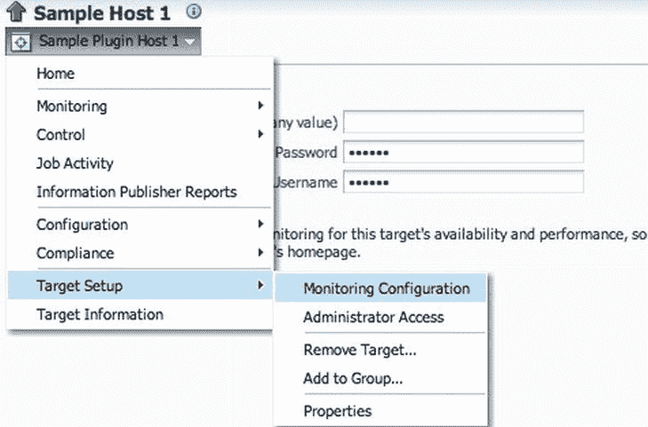
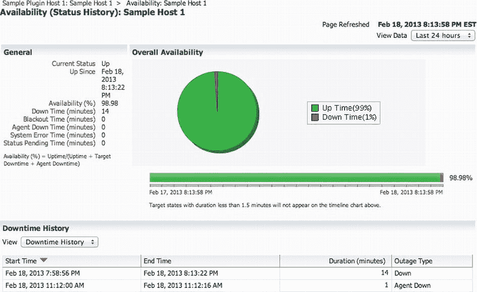

# Oracle Enterprise Manager Cloud Control 插件开发基础

## 插件基础结构

暂存根目录包含 `plugin.xml`，这是一个插件定义文件，其中包含了 OMS 所需的基本插件信息。暂存根目录中有两个必需的子目录：`oms` 和 `agent`。`oms` 目录包含所有用于在 OMS 上部署的文件，而 `agent` 目录包含用于在代理上部署的文件。你可以将它们视作代理端和 OMS 端区域。你会发现某些文件必须同时包含在两个区域中。`plugin_registry.xml` 文件在某种程度上类似于暂存根目录中的 `plugin.xml` 文件，但其内容用于部署在管理代理上。可以将 `plugin.xml` 和 `plugin_registry.xml` 共同视作插件定义。请注意，如果设计用于支持复杂系统，单个插件可能包含不止一个目标类型。例如，Oracle Exadata 插件就包含了十种新的目标类型。

**目标类型元数据** 是插件的关键组件。XML 目标类型元数据文件同时包含在 OMS 和代理区域中。由于我的开发平台是 Linux，我通常将目标类型元数据文件放置在 `<stage>/oms/metadata/targetType/` 中，并从 `<stage>/agent/metadata/` 创建一个指向它的软链接。虽然文件名本身可以自由选择，但建议的做法是根据它定义的目标类型来命名，并添加 `.xml` 扩展名。

**默认采集元数据** 与目标类型元数据紧密耦合，定义了所有指标（包括告警条件）的采集计划和采集相关属性。就像目标类型元数据一样，默认采集元数据 XML 文件也存在于 OMS 和代理区域中，因此我通常也使用软链接。建议将文件命名为与目标类型元数据 XML 文件相同的名称。

你会了解到，在 OMS 端区域可以包含更多文件，但这通常是任何插件中都会看到的最低要求。通过创建这个基本的目录树来开始你的每一个新插件。

## 插件元数据

一个简化版的 `plugin.xml` 如 清单 10-5 所示。你可以在 `<stage>/plugin.xml` 中找到它。请记住，我们第一个示例插件的暂存区域是 `<EDK>/samples/plugins/oracle.samples.xsh1/plugin_dist`。

**清单 10-5**. 简单主机插件 1 的插件元数据 `plugin.xml`

```xml
<?xml version = "1.0"?>
<Plugin xmlns:xsi="http://www.w3.org/2001/XMLSchema-instance"
    xsi:schemaLocation=
       "http://www.oracle.com/EnterpriseGridControl/plugin_metadataplugin_metadata.xsd"
    xmlns="http://www.oracle.com/EnterpriseGridControl/plugin_metadata">
  <PluginId vendorId="oracle" productId="samples" pluginTag="xsh1"/>
  <PluginVersion value="12.1.0.0.0"/>
  <PluginOMSOSAruId value="2000"/>
  <ShortDescription>Sample Host Plugin 1</ShortDescription>
  <Readme>Sample Host Plugin 1\. See Book Expert Oracle Enterprise Manager 12c.</Readme>
  <PluginAttributes Category="Others" DisplayName="Sample Host Plugin 1"/>
  <TargetTypeList>
    <TargetType name="sample_host1" isIncluded="TRUE"/>
  </TargetTypeList>
</Plugin>
```

要获取更多选项，请参阅示例的完整 `plugin.xml` 文件，以及文档 *Oracle Enterprise Manager Cloud Control Extensibility Programmer's Reference*（第 2 章，第 2.4 节）。更多选项可以在插件元数据参考中找到，位于 `<EDK>/doc/partnersdk/mrs/emcore/pluginMetadata/`。这里，我们只介绍几个必需的基本元素。根元素 `Plugin` 的庞大属性 `xmlns:xsi`、`xsi:schemaLocation` 和 `xmlns` 引用了各种命名空间和 XML 架构。只需确保你从示例模板中原样保留它们即可。这同样适用于我们将使用的其他 XML 文件。

`PluginId` 由三个部分组成，用点分隔：`vendorId.productId.pluginTag`。点表示法稍后将在代理端定义中使用。供应商 ID 和产品 ID 最多可包含 8 个字符，而插件标签必须为 4 个字符或更少。例如，Oracle 的示例插件 ID 是 `oracle.sysman.xsh1`，而对于我的演示 MySQL 插件，我使用 ID `pythian.mysql.demo`。

插件版本由五个数字表示：`a.b.c.d.e`。前两个数字（`a.b`）应与你开发所基于的 EM12c 版本相同。第三个数字（`c`）应始终为 0。第四个数字是你每次发布插件时递增的数字。Oracle 将第五个数字（`e`）保留供将来使用，并指示你始终将其设置为 0。然而，我一直用它来标识插件的次要版本。例如，在撰写本文时，`12.1.0.1.2` 是 Pythian MySQL 插件的当前版本。

你需要在开发环境中部署后续版本时递增版本号。你可以使用最后一个数字用于开发版本递增，或者在开发期间只修改插件 ID。例如，我使用 `pythian.mysql.prod` 表示公开发布的版本，使用 `pythian.mysql.test` 表示开发和测试。

`PluginOMSOSAruId` 元素定义了 OMS 应在哪个操作系统上运行才能支持此插件。值 `2000` 表示通用平台，你经常会发现你的插件对 OMS 服务器平台几乎没有依赖性，但通常对代理操作系统有依赖。这里我不深入探讨兼容性的细节（参见前面引用的文档），但 `plugin.xml` 是你可以定义插件与其他 EM12c 组件兼容性的地方。

`ShortDescription` 和 `Readme` 标签的作用不言自明。`PluginAttributes` 元素包含一些基本属性。你可以为 `Category` 属性设置一些预定义的类别，例如 `Databases`、`Middleware` 等。`DisplayName` 属性是你的插件在 EM12c 用户界面中显示的方式。

最后，是 `TargetTypeList` 元素，它列出了插件包含的所有目标类型。一个简单的插件通常只包含一个目标类型，因此只有一个 `TargetType` 子元素。目标类型名称是插件中包含的目标类型的内部 ID。本章稍后在实际定义目标类型时，会展示更多关于目标类型 ID 选择的内容。

插件定义还支持定义插件依赖关系、版本支持和兼容性，以及许多其他属性，例如“新增功能”部分。你现在不需要深入研究这些，并且总可以在以后使插件元数据变得更加复杂。我通常建议从简单开始，然后慢慢向你的插件中添加功能。

## 插件注册表

虽然 `plugin.xml` 包含 OMS 端的元数据，但 `plugin_registry.xml` 定义了插件部署的代理所需的元数据——通常只是目标类型元数据文件和默认采集元数据文件的列表。对于单目标类型插件，每种文件只有一个。它们使用 `TargetTypes` 和 `TargetCollections` 元素来定义，这些元素是一个或多个 `FileLocation` 元素的简单容器。`FileLocation` 中的路径是相对于暂存区域中的 `agent` 目录的。清单 10-6 是示例中简化的 `plugin_registry.xml` 文件。

**清单 10-6**. 简单主机插件 1 的代理端插件元数据 `plugin_registry.xml`


## XML 配置文件示例

```xml
<?xml version="1.0"?>
<PlugIn ID="oracle.samples.xsh1" Description="Sample Host Plugin 1" Version="12.1.0.0.0"
    xmlns:xsi="http://www.w3.org/2001/XMLSchema-instance"
    xsi:schemaLocation="http://www.oracle.com/EnterpriseGridControl/pluginplugin.xsd" >
  <TargetTypes>
    <FileLocation>metadata/sample_host1.xml</FileLocation>
  </TargetTypes>
  <TargetCollections>
    <FileLocation>default_collection/sample_host1.xml</FileLocation>
  </TargetCollections>
</PlugIn>
```

可以看到，属性 `ID`、`Description` 和 `Version` 是从 OMS 端的 `plugin.xml` 文件复制过来的。请注意，`ID` 是 `PluginId` 的点表示法版本。更高级的选项是可用的，但文档记录仍然相当差，且未在示例中提供。例如，你可以通过定义一个自定义的 fetchlet（你很快会了解到 fetchlet）来注册你自己的指标收集方法，但在你精通插件开发之前，不会这样做。

除了 Oracle *Enterprise Manager Cloud Control Extensibility Programmer's Reference*（第 2 章，第 2.5 节）中的标准文档外，更多详细信息可以在 EDK API 参考中找到，路径为 `<EDK>/doc/partnersdk/mrs/emcore/agentPluginMetadata/`。这个 XML API 文档是由定义此 XML 结构的 XML Schema 生成的——什么元素可以存在于何处以及数量、它们的属性是什么、哪些是可选的，以及一些零散的注释，对于那些在其他地方未文档化的元素，你仍会发现它们很有用。

在这一点上，已经有足够的机会犯很多错误。幸运的是，EDK 提供了验证工具，可以帮助我们确保我们的定义在语法和语义上是正确的。例如，它将捕获格式错误的 XML 文件以及不匹配的插件 ID。清单 10-7 展示了一个示例验证命令行和成功的验证输出。末尾引用的输出文件包含更多详细信息。请注意，将插件打包到 OPAR 文件之前会执行显式验证。

### 插件验证示例
```
[oracle@em12c2 oracle.samples.xsh1]$ empdk validate_plugin -stage_dir plugin_dist
Validating Plugin Xml : Passed
Validating Plugin Structure: Passed

Validating Metadata Syntax: Passed
Validating Metadata Semantic: Passed
Validating Embedded SQL strings in meta data: Passed
Plugin Validation : Passed
Validation Report generated to: /home/oracle/edk/samples/plugins/oracle.samples.xsh1/./plugin_validation_report_121127.txt
```

请注意，如果你删除了 `Readme` 元素，例如，验证将通过但会有警告，因为这个元素在 XML Schema 中是可选的，所以从语法上讲一切正确，但 EDK 有一个语义规则，即这个元素应该作为最佳实践存在。我使用 EDK 主机示例的暂存区，但你也可以使用前面的 XML 内容启动自己的暂存区并并行进行。

现在验证已经成功，你可以继续创建核心结构：目标类型元数据。

### 目标类型元数据

目标类型元数据定义了插件的基本结构——其属性、指标以及如何收集它们。这是创建新目标类型的绝对最低要求。目标类型元数据在单个 XML 文件中定义，该文件放置在 `<stage>/oms/metadata/targetType` 目录中。Oracle 最新的建议是使用 `vendorID_productID_PluginTag.xml` 模板，根据插件 ID 命名文件。之前的命名约定是根据目标类型 ID 添加 `.xml` 扩展名，但一般来说，它可以是任何文件名。我建议使用目标类型来命名目标类型元数据文件，因为你可以在同一个插件中打包多个目标类型。你还需要在 `<stage>/agent/metadata` 目录下的 agent 区域提供相同的 XML 文件，该文件随后从 `plugin_registry.xml` 中引用，正如你之前所了解的。在 Unix/Linux 服务器上，我只需从 agent 区域创建到 OMS 区域主副本的符号链接。这样，我就不会忘记同步它们。（如果你忘记了同步副本，就像我曾做过的几次那样，故障排除可能是一个巨大的时间消耗。那时我改用了符号链接。）

目标类型元数据的一般结构如清单 10-8 所示。

### 元素示例
```
<TargetMetadata META_VER="1.8" TYPE="sample_host1">
  <Display>...</Display>
  <Metric>...</Metric>
  ......
  <Metric>...</Metric>
  <InstanceProperties>...</InstanceProperties>
</TargetMetadata>
```

顶级元素 `TargetMetadata` 在 `TYPE` 属性中包含唯一的目标类型 ID `"sample_host1"`，并在 `META_VER` 属性中包含元数据版本 `"1.8"`。如果更改了文件，你应该更改版本号。当 EM12c 检测到目标类型版本已更改时，它将重新加载新的元数据。我曾花费无数小时排查为什么在更新元数据定义后我的插件不工作，后来才发现我漏掉了更改 `META_VER` 属性。当部署较新版本的插件时，EM12c 会分析元数据版本是否已更改，如果新目标类型元数据定义中的 `META_VER` 未更改，则会跳过一些内部更新。

请注意，随 EDK 打包的示例，例如 `sample_host1`，在注释中引用了 XML 数据类型定义（DTD）`$OMS_HOME/sysman/admin/dtds/TargetMetadata.dtd`。这是来自 10g/11g Grid Control 的旧定义，不仅风格陈旧，而且已过时。请使用 `<EDK>/doc/partnersdk/mrs/emcore/targetType` 中基于 XML Schema 的 API 参考。例如，`TargetMetadata` 根元素在 `<EDK>/doc/partnersdk/mrs/emcore/targetType/noNamespace/element/TargetMetadata.html` 中描述。

`TargetMetadata` 元素的子元素通常包括三个元素：`Display`、`Metric` 和 `InstanceProperties`。

### Display


### 目标类型元数据

## 显示元素

首先，我们来检查 `Display` 元素。此元素仅用于存储属性，这些属性指示了父元素所定义的组件在 EM12c 控制台中的显示方式。您几乎会在任何在用户界面中具有一定可见性的目标类型元数据的其他元素下看到 `Display` 元素。在本例中，它对应于目标类型本身，`Display` 元素定义了目标类型的显示方式。在最简单的形式中，`Display` 元素将包含一个用于在控制台中显示目标类型的 `Label` 元素，如 列表 10-9 所示。`Label` 的可选属性 `NLSID` 是一个唯一标识符，可用于将此目标类型相关的控制台用户界面翻译为其他语言。如果指定它，请养成将 `NLSID` 前缀设置为目标类型 ID 的习惯，以便在所有可能的插件中保持唯一性（因为您的目标类型 ID 是唯一的，您只需确保所有 `NLSID` 在您自己的目标类型内是唯一的）。根据上下文，`Display` 元素内部可以包含其他元素，正如您将在本章后面看到的。

```
<Display>
  <Label NLSID="hs_displayname">Sample Plugin Host 1</Label>
</Display>
```

请注意，目标类型元数据 XML 文件中元素的顺序很重要；`Metric` 元素必须始终位于 `InstanceProperties` 元素之前。接下来您将了解 `InstanceProperties` 结构，因为它对理解指标及其收集方式很有用。

## 实例属性

`InstanceProperties` 是一个必需的元素，必须放置在所有 `Metric` 元素之后。在根元素 `TargetMetadata` 中应恰好有一个 `InstanceProperties` 描述符。此描述符由一个或多个 `InstanceProperty` 元素以及可选的 `DynamicProperties` 元素组成，如 列表 10-10 所示。每个 `InstanceProperty` 条目指定一个目标属性，当在 EM12c 控制台中添加新目标实例时，应由用户定义该属性（参见 图 10-9）。`DynamicProperties` 元素定义由代理自动计算的属性。

```
<InstanceProperties>
        <InstanceProperty NAME="USE_FAKE_DATA" ... </InstanceProperty>
        <InstanceProperty NAME="sample_host1_username" ... </InstanceProperty>
        <InstanceProperty NAME="sample_host1_password" ... </InstanceProperty>
        <DynamicProperties>...</DynamicProperties>
        <DynamicProperties>...</DynamicProperties>
</InstanceProperties>
```



图 10-9. 实例属性在 EM12c 控制台的“目标监控配置”中设置

实例属性通常表示目标实例的配置，以便代理可以收集各种指标并计算动态属性。许多目标在实例属性中包含凭据——用于连接到目标并收集信息的用户名和密码。其他属性通常包括安装目录的路径、用于通信的端口或套接字路径，甚至如果目标运行在代理所在主机之外的主机上，则包括主机名。

由于这是一个演示插件，Oracle 包含了属性 `USE_FAKE_DATA`，因此您可以将其设置为 `TRUE`，以使收集脚本返回预定义的数据而不是真实收集的指标。这是一种很好的调试技术。

列表 10-11 提供了一个密码属性的示例。

```
<InstanceProperty NAME="sample_host1_password" CREDENTIAL="TRUE" OPTIONAL="TRUE">
  <Display>
    <Label NLSID="host_password">Host Password</Label>
  </Display>
</InstanceProperty>
```

`NAME` 属性定义了您稍后在定义指标收集时可以用来引用此属性的句柄。将 `CREDENTIAL` 设置为 `TRUE` 确保此属性以加密方式存储，而不是明文存储，使得未经授权的用户更难检索密码。对于标记为凭据的属性，`HIDE_ENTRY="TRUE"` 属性使 EM12c 控制台使用密码样式的输入框，其中显示星号而不是浏览器中输入的真实文本。`HIDE_ENTRY` 默认设置为 `TRUE`，因此如果您希望凭据的用户名部分以明文显示，则需要将此属性设置为 `FALSE`。另一个属性 `NEED_REENTER`，当设置为 `TRUE` 时，将使 EM12c 控制台显示该属性的双重输入——这是密码常见的做法。

`OPTIONAL` 属性表示那些不必定义且因此具有默认值的属性，这些值在许多情况下是可接受的。例如，`USE_FAKE_DATA` 属性的默认值是一个空字符串，它指示插件使用真实收集的指标。

您还可以看到 `InstanceProperty` 有一个您已经熟悉的子元素 `Display`。在本例中，它定义了此属性在 EM12c 控制台中的显示方式。要查看其实际操作，请导航到您的 “Host Sample 1” 目标，并从目标菜单中选择 “目标设置” → “监控配置”，如 图 10-9 所示。

## 指标

指标集是目标类型元数据的核心内容；它们定义了收集的信息以及收集方式。`Metric` 是目标类型元数据中最重要的，也可以说是最复杂的元素。一个目标类型可以（并且通常确实）包含多个 `Metric` 子元素，它们都必须放置在 `InstanceProperties` 元素之前。列表 10-12 展示了来自 `sample_host1` 目标类型的 `Response` 指标。

```
<Metric NAME="Response" TYPE="TABLE">
  <Display>
    <Label NLSID="hs_response_displayname">Response</Label>
  </Display>
  <TableDescriptor>
    <ColumnDescriptor NAME="Load" TYPE="NUMBER" IS_KEY="FALSE">
      <Display>
        <Label NLSID="hs_response_cpuload">CPU Load</Label>
      </Display>
    </ColumnDescriptor>
    <ColumnDescriptor NAME="Status" TYPE="NUMBER" IS_KEY="FALSE">
      <Display>
        <Label NLSID="hs_response_status">Status (up/down)</Label>
      </Display>
    </ColumnDescriptor>
  </TableDescriptor>
  <QueryDescriptor FETCHLET_ID="OSLineToken">
    <Property NAME="scriptsDir" SCOPE="SYSTEMGLOBAL">scriptsDir</Property>
    <Property NAME="fake" SCOPE="INSTANCE" OPTIONAL="TRUE">USE_FAKE_DATA</Property>
    <Property NAME="perlBin" SCOPE="SYSTEMGLOBAL">perlBin</Property>
    <Property NAME="command" SCOPE="GLOBAL">%perlBin%/perl</Property>
    <Property NAME="script" SCOPE="GLOBAL">
       %scriptsDir%/sample_host1/data_collector.pl --collect Response --fake "%fake%"
    </Property>
    <Property NAME="startsWith" SCOPE="GLOBAL">em_result=</Property>
    <Property NAME="delimiter" SCOPE="GLOBAL">|</Property>
  </QueryDescriptor>
</Metric>
```


## 度量元素与描述符基础

度量元素必须具有在目标类型中唯一的`NAME`。`TYPE`最常见是`TABLE`，但也可能是其他值（此处不作探讨）。每个度量元素应包含一个`TableDescriptor`。`TableDescriptor`定义了具有名称、类型和标签的列。最后，`QueryDescriptor`标签描述了如何通过某个 fetchlet 来收集度量值。这些类似于度量扩展适配器，但 fetchlet 类型更多，在 XML 中配置的灵活性也更大。`TableDescriptor`中列的顺序很重要，因为配置在`QueryDescriptor`元素下的 fetchlet 必须按该顺序返回值。

## TableDescriptor 元素详解

`TableDescriptor`元素是多个`ColumnDescriptor`元素的简单容器（每个描述表中的一列，正如您可能已猜到的那样）。每个列描述符都有熟悉的`Display`元素，描述该列在用户界面中的显示方式。列描述符的属性定义了列名和类型。`STRING`和`NUMBER`是您将最常使用的两种列类型。`IS_KEY`属性允许您指定此列是否属于度量的唯一键的一部分，从而像在“度量扩展”章节中学习的多行度量那样返回多行。

## 响应指标的特殊要求

对于每种目标类型，定义一个名为`Response`、类型为`TABLE`的特殊度量至关重要，它需包含一个名为`Status`的列。`EM12c`框架将使用此列来表示目标的上下状态和历史可用性统计信息。您还必须为此度量定义一个关键条件（稍后将学习）。`EM12c`知道，如果`Response`度量的`Status`列生成了严重警报，则目标已宕机。获取目标可用性历史的一种方式是通过目标菜单：选择“目标信息”选项，然后点击可用性百分比。示例“Sample Plug-in Host 1”的可用性历史如图 10-10 所示。



图 10-10. Sample Plug-in Host 1 的示例可用性历史

除了`Status`，您还可以在`Response`度量中收集更多列。在检查目标状态的同时，收集几个关键测量值通常很容易。例如，一个测量值可能是数据库连接请求的响应时间，或者是如“Sample Plug-in Host 1”目标类型那样的主机负载平均值。这将节省收集调用次数，但不会影响目标的可用性。只有`Status`列被计入目标可用性。

## 数据收集机制概述

最后，让我们继续讨论数据收集。在绝大多数情况下，您将使用由`QueryDescriptor`元素配置的可用 fetchlet 之一。管理代理将根据定义的 fetchlet 执行收集方法并“获取”度量值。

其他收集选项允许`EM12c`通过连接或聚合一些先前收集的度量来计算度量值。此类收集通过使用`ExecutionDescriptor`元素而非`QueryDescriptor`来定义。另一种度量收集选项是将代理配置为目标发送给它的数据的被动“监听器”（例如，通过使用 SNMP 陷阱）。可用的机制称为`receivelets`，并由`PushDescriptor`定义。我仅涵盖 fetchlet 的使用，因为这是唯一有完整文档记录的机制，但如果您想尝试使用另外两种高级度量收集机制，可以深入研究 XML Schema 文档。《Oracle Enterprise Manager Cloud Control 可扩展性程序员参考》（第 19 章）描述了 SNMP receivelet 的用法。

`QueryDescriptor`有一个属性`FETCHLET_ID`，用于唯一标识用于收集所需信息的 fetchlet 类型。随着后面讨论各种 fetchlet，您会发现之前讨论的度量扩展适配器无非就是使用了其中一些 fetchlet。

## Fetchlet 配置与属性

每个 fetchlet 都有自己的一组具有预定义名称的必需和可选属性。您通过定义具有这些名称的`Properties`元素来配置 fetchlet。例如，`OSLineToken` fetchlet 对应于度量扩展中的“OS 命令—多列”适配器。此 fetchlet 有一个必需的`command`属性以及一些可选属性，如`startWith`和`delimiter`。您还可以指定额外的临时属性，这些属性可以作为“助手”来构成 fetchlet 的预定义配置属性。例如，`perlBin`和`fake`属性是从`command`属性中引用的。

`Property`元素的`SCOPE`属性定义了属性值被解析的上下文。以下是最重要的`SCOPE`选项：

*   `GLOBAL`：值是具有占位符变量的`Property` XML 元素的内容，这些占位符被解析为当前`QueryDescriptor`元素的属性。在我们的示例中，`command`属性的作用域为`GLOBAL`，值为`%perlBin%/Perl`。`%%`内的占位符被替换为当前`QueryDescriptor`元素的属性值，例如`perlBin`。另一个`GLOBAL`属性的例子是引用`scriptDir`和`fake`属性的`script`属性。`GLOBAL`作用域也用于常量定义，例如`delimiter`属性。名称`GLOBAL`可能有误导性，但请记住其作用域是当前的`QueryDescriptor`元素。
*   `SYSTEMGLOBAL`：此值在`$AGENT_HOME/sysman/config`目录下的`emd.properties`配置文件的上下文中被解析。`Property` XML 元素的内容是来自`emd.properties`代理配置文件的变量名。例如，`emd.properties`包含`perlBin`，定义了 Perl 可执行文件的路径。如果使用 Perl 脚本收集度量值，这将非常有用，因为您可以始终使用随管理代理安装的 Perl 发行版，而不必希望系统上安装了兼容版本的 Perl。另一个有用的`SYSTEMGLOBAL`值是`scriptsDir`，它指向为所有插件安装脚本的路径，这些脚本位于一个与目标类型 ID 同名的子目录中。
*   `INSTANCE`：此值在目标实例的上下文中被解析（即目标配置时定义的实例属性的值）。这些值对于每个目标实例都是不同的。在我们的示例中，您可以看到`USE_FAKE_DATA`是如何被引用的，但没有引用`sample_host1_username`或`sample_host1_password`。如果度量收集实际使用了这些属性，它们会以某种方式传递给连接脚本。
*   `ENV`：此值取自环境变量。例如，如果您的监控脚本需要在服务器上安装一个特殊二进制文件，并且该二进制文件未随插件分发，您可以通过在代理启动前设置的某个环境变量来指定该二进制文件的路径。例如，`<Property NAME="mypath" SCOPE="ENV">MYSQL_PATH</Property>`将获取环境变量`MYSQL_PATH`的值作为`mypath`属性的值，以便您稍后可以从`command`属性中以`%mypath%`的形式引用它。


可以在命令执行前设置环境变量——无论是用于定义需求还是传递参数。如果命令行参数包含特殊符号，在不同平台上的处理方式可能有所不同。环境变量似乎能在所有平台（包括 Linux、Windows 和 Unix）上可靠地传递。通过环境变量传递凭证和其他敏感信息可能比通过命令行更安全，因为命令行内容通常很容易被任何已登录的主机用户观察到。然而，某些平台可能会将进程的环境变量内容暴露给其他用户，就像 Linux 通过 `/proc` 文件系统所做的那样。本章后续部分，你将了解凭证监控，这是一种更安全地向脚本传递登录名和密码的方式。

让我们总结一下 清单 10-12 中 `Response` 指标的定义。`Response` 指标是一个单行指标，包含 `Load` 和 `Status` 两列。它使用了 `OSLineToken` 获取器，该获取器能够从操作系统命令返回一个多行、多列的结果集。获取器被配置为运行一个名为 `data_collector.pl` 的 Perl 脚本，并通过管道符号 (`|`) 分隔列值来解析输出，同时只筛选以 `em_result=` 开头的行。

**默认采集元数据**

现在你已经了解了 EM12c 用户如何配置新的目标实例（通过 `InstanceProperties` 元素），以及目标类型将采集哪些指标以及如何采集（通过 `Metric` 元素），唯一缺失的部分是定义指标的采集频率以及指标的告警条件。这定义在默认采集元数据 XML 文件中，该文件位于 `<EDK>/oms/metadata/default_collection`，并从 `<EDK>/agent/default_collection` 链接。使用与目标类型元数据文件相同的命名约定。清单 10-13 展示了一个示例默认采集元数据定义。有关完整示例，请参阅示例主机 1 目标的默认采集定义。

清单 10-13. 示例默认连接元数据定义

```
<TargetCollection TYPE="sample_host1">
  <CollectionItem NAME="Response">
    <Schedule>
      <IntervalSchedule INTERVAL="5" TIME_UNIT="Min"/>
    </Schedule>
    <Condition COLUMN_NAME="Status" CRITICAL="1" OPERATOR="LT"/>
  </CollectionItem>
  <CollectionItem NAME="Perf" UPLOAD="1">
    <Schedule>
      <IntervalSchedule INTERVAL="5" TIME_UNIT="Min"/>
    </Schedule>
    <MetricColl NAME="CPUPerf">
      <Condition COLUMN_NAME="non_nice" WARNING="NotDefined" CRITICAL="NotDefined"
         OPERATOR="GE"
         MESSAGE="The value for %columnName% is %value%%%.  It has risen above the
           critical (%critical_threshold%%%) or warning (%warning_threshold%%%) threshold."
         CLEAR_MESSAGE="The value for %columnName% is %value%%%." />
      <Condition ... />
      ...
    </MetricColl>
    <MetricColl NAME="MemoryPerf">...</MetricColl>
    <MetricColl NAME="CPUProcessorPerf">...</MetricColl>
    ...
  </CollectionItem>
  ...
</TargetCollection>
```

根元素是 `TargetCollection`，其 `TYPE` 属性应与目标类型元数据 XML 文件（`sample_host1`）中 `TargetMetadata` 根元素的 `type` 属性相匹配。`TargetCollection` 元素包含多个 `CollectionItem` 元素，每个 `CollectionItem` 元素对应目标类型元数据文件中的一个 `Metric` 元素。`CollectionItem` 的 `NAME` 属性应与指标名称匹配。

当需要相同的采集频率或指标采集顺序时，还有一种方法可以在同一个采集中对多个指标进行分组。这是通过在 `CollectionItem` 内部包含 `MetricColl` 元素（每个指标一个）来实现的（例如，采集项 "Perf"）。在这种情况下，子元素 `MetricColl` 的 `NAME` 属性应与指标名称匹配，如示例中的 "CPUPerf"、"MemoryPerf" 和 "CPUProcessorPerf"。请参阅 *Oracle Enterprise Manager Cloud Control Extensibility Programmer's Reference*（第 3 章，第 3.5.1 节）。

对于每个采集项，我们可以定义一个 `Schedule` 子元素，该子元素通常包含一个 `IntervalSchedule` 子元素，使用数值属性 `INTERVAL` 和字符串属性 `TIME_UNIT` 来指示采集的频率。后者可以设置为 `Sec`、`Min`、`Hr` 或 `Day`，默认为 `Min`。由于这是一个默认采集定义，此设置代表初始的默认频率。EM12c 用户可以像修改任何其他指标一样修改采集间隔，插件开发人员可以使用 `IntervalSchedule` 元素的 `MIN_INTERVAL` 和 `MAX_INTERVAL` 属性来设置这些设置的限制。其他调度选项也可用，例如在每月的某一天或每周的某一天运行。这些选项在可扩展性指南中没有文档说明，但你可以在 `<EDK>/doc/partnersdk/mrs/emcore/default_collection` 查看 XML 模式文档以获取更多选项，也可以在控制台中修改采集计划时看到它们。

如果未为某个指标定义计划，则除非 EM12c 用户打开实时指标视图（此时 OMS 每次刷新实时视图时都会向代理请求采集），否则代理不会自动采集该指标。无论初始采集计划是否在默认采集文件中定义，都可以在 EM12c 控制台中自定义计划。你可以使用目标的"所有指标"视图，如图 10-11 所示，对应于名为 "Perf" 的采集项（在前面的 清单 10-13

图 10-11. 自定义采集计划

指标中的每一列都可以定义一个条件，用于测试警告和严重阈值——每列一个 `Condition` 元素。如果为每个指标定义一个采集项，则 `Condition` 元素是 `CollectionItem` 的子元素。否则，`Condition` 元素是 `MetricColl` 的子元素。`Condition` 元素有两个必需属性：`COLUMN_NAME` 和 `OPERATOR`。后者定义了一个比较运算符，可以是数值关系运算符或字符串匹配运算符。在 清单 10-13 中，`LT` 表示*小于*，`GT` 表示*大于*。字符串条件包括用于子字符串匹配的 `CONTAINS` 和用于正则表达式匹配的 `MATCH`。*可扩展性程序员参考*的第 3.5.5 节提供了运算符的完整列表。请注意，运算符代码必须为大写。


